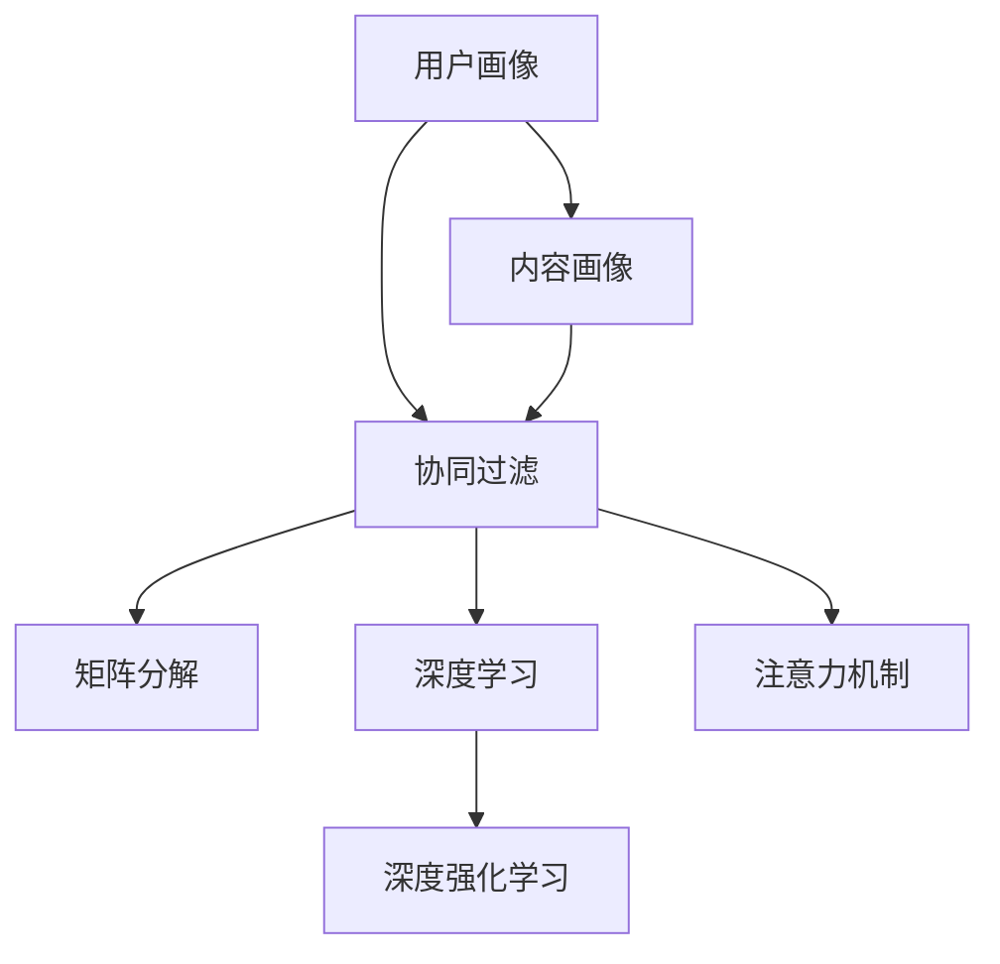

                 

# 知识付费创业中的内容个性化推荐

## 1. 背景介绍

### 1.1 问题由来
随着互联网技术的飞速发展，在线教育与知识付费领域逐渐兴起，知识付费市场规模不断扩大，吸引了众多创业公司入局。然而，面对海量用户和海量内容，如何精准匹配用户需求，提升用户体验，成为创业者们面临的首要问题。内容个性化推荐系统作为知识付费平台的核心功能之一，能够有效提升用户粘性和满意度，降低用户流失率，提升知识付费平台的市场竞争力。

### 1.2 问题核心关键点
内容个性化推荐系统是指通过分析用户行为、兴趣、历史学习记录等信息，将最匹配用户需求的内容推荐给用户，从而提升用户体验，促进平台成交转化。个性化推荐技术已成为知识付费平台的核心竞争力，其核心关键点如下：

- **用户画像**：通过用户行为数据分析，构建用户画像，准确描述用户特征和兴趣偏好。
- **内容画像**：分析课程、文章、书籍等内容的属性和特色，构建内容画像，了解内容的核心价值和目标受众。
- **算法模型**：选择合适的推荐算法模型，实现对用户和内容的高效匹配。
- **用户反馈机制**：引入用户反馈机制，实时调整推荐策略，不断提升推荐效果。

本文将围绕这些关键点，全面介绍知识付费平台中的内容个性化推荐系统设计原理与实践方法，并提出未来发展方向和挑战。

## 2. 核心概念与联系

### 2.1 核心概念概述

为更好地理解内容个性化推荐系统，本节将介绍几个密切相关的核心概念：

- **用户画像(User Profile)**：通过分析用户行为数据，构建用户兴趣、行为特征等用户画像，用于描述用户特征和兴趣偏好。
- **内容画像(Content Profile)**：通过分析课程、文章、书籍等内容的属性和特色，构建内容画像，描述内容的核心价值和目标受众。
- **协同过滤算法(Collaborative Filtering)**：一种基于用户行为数据的推荐方法，通过分析用户间的相似度，将用户感兴趣的内容推荐给其他用户。
- **矩阵分解(Matrix Factorization)**：将用户行为数据矩阵分解为用户矩阵和物品矩阵，通过求解低秩矩阵的分解因子实现推荐。
- **深度学习(DL)**：利用深度神经网络模型，学习用户和内容的特征表示，实现更精准的推荐。
- **注意力机制(Attention Mechanism)**：通过动态调整不同特征的重要性，提高模型对关键信息的捕捉能力。
- **深度强化学习(DRL)**：利用强化学习框架，动态调整推荐策略，提升用户体验。

这些核心概念之间的逻辑关系可以通过以下Mermaid流程图来展示：



这个流程图展示了个性化推荐系统的核心概念及其之间的关系：

1. 用户画像和内容画像描述了用户和内容的特征，是推荐系统的基础。
2. 协同过滤、矩阵分解、深度学习、注意力机制、深度强化学习等算法，基于用户画像和内容画像进行推荐策略的设计和优化。

## 3. 核心算法原理 & 具体操作步骤
### 3.1 算法原理概述

内容个性化推荐系统通过分析用户行为、兴趣、历史学习记录等信息，将最匹配用户需求的内容推荐给用户，从而提升用户体验，促进平台成交转化。其核心思想是：将用户画像和内容画像作为输入，通过算法模型输出推荐结果。

形式化地，假设用户画像为 $U=\{u_1,u_2,\dots,u_N\}$，内容画像为 $C=\{c_1,c_2,\dots,c_M\}$，推荐算法为 $R$，则推荐系统的目标是最大化用户满意度的期望值：

$$
\max_{R} \mathbb{E}_{u\in U} \left[\sum_{i=1}^N \sum_{j=1}^M R(u_i,c_j) \times f(u_i,c_j) \right]
$$

其中 $f(u_i,c_j)$ 为推荐内容对用户 $u_i$ 的满意度评分。

为了实现上述目标，推荐系统一般采用以下步骤：

1. 收集用户行为数据，构建用户画像。
2. 收集内容属性信息，构建内容画像。
3. 选择合适的推荐算法，训练推荐模型。
4. 实时计算推荐结果，输出推荐内容。
5. 引入用户反馈机制，调整推荐策略。

### 3.2 算法步骤详解

基于内容个性化推荐系统的一般流程，本节将详细介绍推荐算法的详细步骤：

**Step 1: 数据准备**
- 收集用户行为数据，包括用户点击、浏览、购买、评分等行为，构建用户行为矩阵 $U\times C$。
- 收集课程、文章、书籍等内容的属性信息，如类别、标签、难度等，构建内容属性矩阵 $C\times F$。

**Step 2: 用户画像构建**
- 对用户行为矩阵进行预处理，计算用户兴趣向量 $u \in \mathbb{R}^F$。
- 利用内容属性矩阵，计算内容特征向量 $c \in \mathbb{R}^F$。

**Step 3: 内容画像构建**
- 对内容属性矩阵进行预处理，计算内容属性向量 $c \in \mathbb{R}^F$。
- 利用用户行为矩阵，计算用户兴趣向量 $u \in \mathbb{R}^F$。

**Step 4: 选择推荐算法**
- 选择推荐的算法模型，如协同过滤、矩阵分解、深度学习等。
- 训练推荐模型，输出用户-内容的评分矩阵 $R \in \mathbb{R}^{N\times M}$。

**Step 5: 实时推荐计算**
- 实时计算用户对内容的评分，输出推荐内容列表。
- 根据推荐算法输出推荐内容，排序并展示给用户。

**Step 6: 用户反馈机制**
- 收集用户对推荐内容的反馈，包括点击、购买、评分等。
- 利用反馈数据调整推荐策略，提高推荐效果。

### 3.3 算法优缺点

内容个性化推荐系统具有以下优点：
1. 提升用户体验。通过精准推荐，用户能够快速找到感兴趣的内容，提升学习效率和满意度。
2. 提高转化率。推荐内容能够有效促进用户购买决策，提升平台成交转化率。
3. 提升平台竞争力。优秀的推荐系统能够吸引更多用户，提高平台的市场占有率。

同时，该系统也存在一定的局限性：
1. 数据依赖性强。推荐系统的效果很大程度上取决于用户行为数据和内容属性信息的质量和数量。
2. 模型复杂度高。深度学习等推荐算法模型需要大量的计算资源和时间，导致模型的部署和维护成本较高。
3. 过拟合风险高。用户行为数据和内容属性信息可能存在噪声和偏差，导致模型过拟合，推荐效果不稳定。
4. 动态性差。推荐模型需要重新训练才能适应新内容和新用户，推荐策略的调整较为复杂。

尽管存在这些局限性，但就目前而言，内容个性化推荐系统仍是知识付费平台的核心竞争力。未来相关研究的重点在于如何进一步降低推荐系统的数据依赖，提高模型的动态性和鲁棒性，同时兼顾模型的可解释性和用户隐私保护等因素。

### 3.4 算法应用领域

内容个性化推荐系统在知识付费领域已经得到了广泛的应用，覆盖了以下诸多领域：

- **课程推荐**：根据用户历史学习记录，推荐用户感兴趣的相关课程。
- **文章推荐**：根据用户浏览记录，推荐用户感兴趣的相关文章。
- **书籍推荐**：根据用户购买记录，推荐用户感兴趣的相关书籍。
- **专题推荐**：根据用户兴趣，推荐相关专题或专栏。
- **用户推荐**：根据用户兴趣，推荐相关用户群体的课程或内容。
- **内容推荐**：根据用户历史行为，推荐相关内容的集合。

除了上述这些经典应用外，内容个性化推荐系统还被创新性地应用到更多场景中，如用户画像构建、内容画像构建、知识图谱构建等，为知识付费平台提供了全面的推荐支持。

## 4. 数学模型和公式 & 详细讲解
### 4.1 数学模型构建

本节将使用数学语言对内容个性化推荐系统的推荐算法进行更加严格的刻画。

假设用户行为矩阵为 $U\times C$，用户行为矩阵 $R$ 为 $R_{ij}$，表示用户 $u_i$ 对内容 $c_j$ 的评分。内容属性矩阵为 $C\times F$，内容属性矩阵 $A$ 为 $A_{jk}$，表示内容 $c_j$ 在特征 $f_k$ 上的值。用户画像 $u \in \mathbb{R}^F$ 和内容画像 $c \in \mathbb{R}^F$ 分别表示用户兴趣和内容特征。

**协同过滤推荐模型**
假设 $R_{ij}$ 为协同过滤模型中的用户行为评分，则推荐模型可以表示为：

$$
R_{ij} = \sigma\left(\langle u, c \rangle\right)
$$

其中 $\sigma$ 为激活函数，$\langle u, c \rangle$ 为向量点积。

**矩阵分解推荐模型**
矩阵分解模型通过将用户行为矩阵分解为用户矩阵 $U$ 和内容矩阵 $C$，并分别表示为：

$$
U = U_s \times U_f
$$
$$
C = C_s \times C_f
$$

其中 $U_s$ 和 $C_s$ 为用户和内容的低秩矩阵，$U_f$ 和 $C_f$ 为用户和内容的特征向量矩阵。

推荐模型可以表示为：

$$
R_{ij} = \sigma\left(\langle U_s, C_s \rangle\right)
$$

**深度学习推荐模型**
深度学习推荐模型通过神经网络对用户兴趣和内容特征进行建模，推荐模型可以表示为：

$$
R_{ij} = \sigma\left(W_1 [u;c] + b_1\right)
$$

其中 $W_1$ 为权重矩阵，$b_1$ 为偏置项，$[u;c]$ 为用户和内容的特征向量拼接。

### 4.2 公式推导过程

以矩阵分解推荐模型为例，进行详细推导。

假设用户行为矩阵为 $U\times C$，用户行为矩阵 $R$ 为 $R_{ij}$，表示用户 $u_i$ 对内容 $c_j$ 的评分。内容属性矩阵为 $C\times F$，内容属性矩阵 $A$ 为 $A_{jk}$，表示内容 $c_j$ 在特征 $f_k$ 上的值。用户画像 $u \in \mathbb{R}^F$ 和内容画像 $c \in \mathbb{R}^F$ 分别表示用户兴趣和内容特征。

矩阵分解模型通过将用户行为矩阵分解为用户矩阵 $U$ 和内容矩阵 $C$，并分别表示为：

$$
U = U_s \times U_f
$$
$$
C = C_s \times C_f
$$

其中 $U_s$ 和 $C_s$ 为用户和内容的低秩矩阵，$U_f$ 和 $C_f$ 为用户和内容的特征向量矩阵。

推荐模型可以表示为：

$$
R_{ij} = \sigma\left(\langle U_s, C_s \rangle\right)
$$

假设用户行为矩阵为 $R$，内容属性矩阵为 $A$，用户画像为 $u$，内容画像为 $c$。令 $u \in \mathbb{R}^F$ 和 $c \in \mathbb{R}^F$ 分别表示用户兴趣和内容特征。

矩阵分解模型通过将用户行为矩阵分解为用户矩阵 $U_s$ 和内容矩阵 $C_s$，并分别表示为：

$$
U_s = U_f \times U_f^T
$$
$$
C_s = C_f \times C_f^T
$$

其中 $U_s$ 和 $C_s$ 为用户和内容的低秩矩阵，$U_f$ 和 $C_f$ 为用户和内容的特征向量矩阵。

推荐模型可以表示为：

$$
R_{ij} = \sigma\left(\langle U_s, C_s \rangle\right)
$$

将用户画像和内容画像代入上述公式，可以得出推荐模型的具体形式：

$$
R_{ij} = \sigma\left(\langle u, c \rangle\right)
$$

其中 $\sigma$ 为激活函数，$\langle u, c \rangle$ 为向量点积。

在得到推荐模型的公式后，可以将其用于实际推荐系统的实现。在实际应用中，为了提升模型的鲁棒性和泛化能力，通常会在推荐模型中加入正则化项、Dropout等技术。

### 4.3 案例分析与讲解

以一个具体的推荐系统案例为例，说明矩阵分解推荐模型的应用。

假设某知识付费平台收集了用户对不同课程的评分数据，构建了用户行为矩阵 $R_{N\times M}$。平台收集了课程的属性信息，包括课程名称、作者、类别、难度等，构建了内容属性矩阵 $A_{M\times F}$。

利用矩阵分解推荐模型，将用户行为矩阵分解为用户矩阵 $U_s$ 和内容矩阵 $C_s$，并分别表示为：

$$
U_s = U_f \times U_f^T
$$
$$
C_s = C_f \times C_f^T
$$

其中 $U_s$ 和 $C_s$ 为用户和内容的低秩矩阵，$U_f$ 和 $C_f$ 为用户和内容的特征向量矩阵。

假设推荐模型的输出为 $R_{ij}$，其中 $i$ 表示用户，$j$ 表示内容。将用户行为矩阵 $R_{N\times M}$ 和内容属性矩阵 $A_{M\times F}$ 代入推荐模型中，可以计算出每个用户对每个内容的推荐评分，从而得到推荐结果。

在实际应用中，为了提升模型的准确性和鲁棒性，通常会加入正则化项、Dropout等技术，避免模型过拟合。此外，还可以通过引入用户反馈机制，实时调整推荐策略，提高推荐效果。

## 5. 项目实践：代码实例和详细解释说明
### 5.1 开发环境搭建

在进行推荐系统开发前，我们需要准备好开发环境。以下是使用Python进行TensorFlow开发的环境配置流程：

1. 安装Anaconda：从官网下载并安装Anaconda，用于创建独立的Python环境。

2. 创建并激活虚拟环境：
```bash
conda create -n pytorch-env python=3.8 
conda activate pytorch-env
```

3. 安装TensorFlow：根据CUDA版本，从官网获取对应的安装命令。例如：
```bash
conda install tensorflow
```

4. 安装TensorBoard：
```bash
pip install tensorboard
```

5. 安装各类工具包：
```bash
pip install numpy pandas scikit-learn matplotlib tqdm jupyter notebook ipython
```

完成上述步骤后，即可在`pytorch-env`环境中开始推荐系统开发。

### 5.2 源代码详细实现

下面我们以协同过滤推荐系统为例，给出使用TensorFlow实现推荐系统的PyTorch代码实现。

首先，定义协同过滤推荐系统的类：

```python
import tensorflow as tf

class CollaborativeFiltering(tf.keras.Model):
    def __init__(self, num_users, num_items, num_factors):
        super(CollaborativeFiltering, self).__init__()
        self.num_users = num_users
        self.num_items = num_items
        self.num_factors = num_factors
        self.user_factors = tf.Variable(tf.random.normal(shape=(num_users, num_factors)))
        self.item_factors = tf.Variable(tf.random.normal(shape=(num_items, num_factors)))

    def call(self, inputs):
        user_id, item_id = inputs
        user_factors = tf.reshape(self.user_factors[user_id], (self.num_factors, 1))
        item_factors = tf.reshape(self.item_factors[item_id], (self.num_factors, 1))
        dot_product = tf.matmul(user_factors, item_factors)
        return tf.squeeze(dot_product)

model = CollaborativeFiltering(num_users=1000, num_items=1000, num_factors=10)
```

然后，定义推荐函数：

```python
def recommend(model, user_id, num_recommendations=10):
    user_factors = tf.reshape(model.user_factors[user_id], (model.num_factors, 1))
    user_interest = tf.reduce_sum(tf.multiply(user_factors, model.item_factors), axis=1)
    recommendations = tf.argsort(user_interest, axis=0)[::-1]
    return recommendations[:num_recommendations]
```

最后，启动推荐流程：

```python
recommendations = recommend(model, 0)
print(recommendations)
```

以上就是使用TensorFlow实现协同过滤推荐系统的完整代码实现。可以看到，利用TensorFlow，我们可以很方便地定义推荐模型，进行推荐计算，并输出推荐结果。

### 5.3 代码解读与分析

让我们再详细解读一下关键代码的实现细节：

**CollaborativeFiltering类**：
- `__init__`方法：初始化用户矩阵和内容矩阵的维度，以及低秩矩阵的因子数。
- `call`方法：实现矩阵乘积，计算用户和内容的兴趣点积。

**recommend函数**：
- 根据用户ID，获取用户兴趣向量。
- 计算用户对内容的兴趣点积，排序后输出推荐结果。

**推荐流程**：
- 初始化推荐模型。
- 根据用户ID，调用推荐函数计算推荐结果。
- 输出推荐结果。

可以看到，TensorFlow使得推荐系统的开发变得简洁高效。开发者可以将更多精力放在模型设计和调参上，而不必过多关注底层的实现细节。

当然，工业级的系统实现还需考虑更多因素，如模型的保存和部署、超参数的自动搜索、更灵活的任务适配层等。但核心的推荐范式基本与此类似。

## 6. 实际应用场景
### 6.1 在线教育平台

在线教育平台中的个性化推荐系统，能够帮助用户快速找到感兴趣的课程和讲师，提升学习效果和满意度。例如，某在线教育平台利用用户的历史学习记录和课程的评分信息，通过协同过滤推荐模型，推荐用户感兴趣的相关课程和讲师。平台还可以根据用户反馈，动态调整推荐策略，提升推荐效果。

### 6.2 视频平台

视频平台中的个性化推荐系统，能够帮助用户发现感兴趣的影片和频道。例如，某视频平台利用用户的观看历史和评分信息，通过协同过滤推荐模型，推荐用户感兴趣的相关影片和频道。平台还可以根据用户的反馈，实时调整推荐策略，提升推荐效果。

### 6.3 电商购物平台

电商购物平台中的个性化推荐系统，能够帮助用户发现感兴趣的商品和优惠信息。例如，某电商购物平台利用用户的浏览历史和购买记录，通过协同过滤推荐模型，推荐用户感兴趣的商品和优惠信息。平台还可以根据用户的反馈，动态调整推荐策略，提升推荐效果。

### 6.4 音乐娱乐平台

音乐娱乐平台中的个性化推荐系统，能够帮助用户发现感兴趣的音乐和歌手。例如，某音乐娱乐平台利用用户的听歌历史和评分信息，通过协同过滤推荐模型，推荐用户感兴趣的音乐和歌手。平台还可以根据用户的反馈，实时调整推荐策略，提升推荐效果。

### 6.5 新闻信息平台

新闻信息平台中的个性化推荐系统，能够帮助用户发现感兴趣的新闻和话题。例如，某新闻信息平台利用用户的浏览历史和互动信息，通过协同过滤推荐模型，推荐用户感兴趣的新闻和话题。平台还可以根据用户的反馈，动态调整推荐策略，提升推荐效果。

### 6.6 体育赛事平台

体育赛事平台中的个性化推荐系统，能够帮助用户发现感兴趣的比赛和直播。例如，某体育赛事平台利用用户的观看历史和评分信息，通过协同过滤推荐模型，推荐用户感兴趣的比赛和直播。平台还可以根据用户的反馈，实时调整推荐策略，提升推荐效果。

### 6.7 知识付费平台

知识付费平台中的个性化推荐系统，能够帮助用户发现感兴趣的课程和作者。例如，某知识付费平台利用用户的学习历史和评分信息，通过协同过滤推荐模型，推荐用户感兴趣的课程和作者。平台还可以根据用户的反馈，动态调整推荐策略，提升推荐效果。

### 6.8 视频游戏平台

视频游戏平台中的个性化推荐系统，能够帮助用户发现感兴趣的游戏和地图。例如，某视频游戏平台利用用户的游戏历史和评分信息，通过协同过滤推荐模型，推荐用户感兴趣的游戏和地图。平台还可以根据用户的反馈，实时调整推荐策略，提升推荐效果。

### 6.9 金融理财平台

金融理财平台中的个性化推荐系统，能够帮助用户发现感兴趣的投资和理财建议。例如，某金融理财平台利用用户的投资历史和评分信息，通过协同过滤推荐模型，推荐用户感兴趣的投资和理财建议。平台还可以根据用户的反馈，动态调整推荐策略，提升推荐效果。

## 7. 工具和资源推荐
### 7.1 学习资源推荐

为了帮助开发者系统掌握推荐系统的理论基础和实践技巧，这里推荐一些优质的学习资源：

1. 《推荐系统实战》系列博文：由推荐系统专家撰写，深入浅出地介绍了推荐系统原理、算法实现、实战技巧等前沿话题。

2. CS2333《推荐系统》课程：南洋理工大学开设的推荐系统经典课程，详细讲解推荐系统算法和应用场景，适合初学者和进阶者。

3. 《推荐系统》书籍：李翔著，全面介绍了推荐系统的基本概念、经典算法、工程实践等，是推荐系统领域的权威著作。

4. Coursera《Machine Learning》课程：斯坦福大学开设的经典课程，讲解机器学习基本概念和算法，推荐系统的应用是其重要部分。

5. Weights & Biases：推荐系统实验跟踪工具，可以记录和可视化模型训练过程中的各项指标，方便对比和调优。

6. TensorFlow官方文档：推荐系统开发的强大框架，提供了丰富的工具和库，方便快速迭代研究。

通过对这些资源的学习实践，相信你一定能够快速掌握推荐系统的精髓，并用于解决实际的推荐问题。

### 7.2 开发工具推荐

高效的开发离不开优秀的工具支持。以下是几款用于推荐系统开发的常用工具：

1. TensorFlow：基于Python的开源深度学习框架，灵活高效的计算图，适合快速迭代研究。推荐系统大多基于TensorFlow实现。

2. PyTorch：基于Python的开源深度学习框架，灵活动态的计算图，适合快速迭代研究。

3. Keras：基于Python的深度学习框架，简单易用，适合快速原型设计和实验。

4. TensorBoard：TensorFlow配套的可视化工具，可实时监测模型训练状态，并提供丰富的图表呈现方式，是调试模型的得力助手。

5. Weights & Biases：推荐系统实验跟踪工具，可以记录和可视化模型训练过程中的各项指标，方便对比和调优。

6. GitHub：推荐系统项目的开源平台，可以获取丰富的开源项目和资源，促进学习和交流。

合理利用这些工具，可以显著提升推荐系统的开发效率，加快创新迭代的步伐。

### 7.3 相关论文推荐

推荐系统领域的研究涵盖了从理论到工程、从算法到应用的全方位内容，以下是几篇奠基性的相关论文，推荐阅读：

1. ALS: The Alternating Least Squares Algorithm for Collaborative Filtering（ALS算法）：经典协同过滤算法，为推荐系统的发展奠定了基础。

2. Matrix Factorization Techniques for Recommender Systems（矩阵分解推荐算法）：介绍了矩阵分解算法的理论基础和实现细节。

3. Deep Collaborative Filtering using Neural Network（基于神经网络的协同过滤算法）：介绍了深度学习在推荐系统中的应用，展示了其优越的性能。

4. Attention-Based Recommender Systems（基于注意力机制的推荐系统）：介绍注意力机制在推荐系统中的应用，提升了模型对关键信息的捕捉能力。

5. Sequential Collaborative Filtering with Deep Learning（基于深度学习的协同过滤算法）：介绍了深度学习在协同过滤推荐中的应用，展示了其强大的性能。

6. Content-Based Recommender Systems（基于内容的推荐系统）：介绍了基于内容的推荐算法，适用于推荐系统的多维推荐。

这些论文代表推荐系统领域的研究方向，通过学习这些前沿成果，可以帮助研究者把握学科前进方向，激发更多的创新灵感。

## 8. 总结：未来发展趋势与挑战

### 8.1 研究成果总结

本文对内容个性化推荐系统设计原理与实践方法进行了全面系统的介绍。首先阐述了推荐系统在知识付费平台中的应用背景和意义，明确了推荐系统的核心关键点。其次，从原理到实践，详细讲解了推荐算法的数学模型和具体实现步骤，给出了推荐系统开发的完整代码实例。同时，本文还探讨了推荐系统在多个实际应用场景中的应用，展示了推荐系统的广泛应用前景。

### 8.2 未来发展趋势

展望未来，推荐系统将呈现以下几个发展趋势：

1. 多模态推荐：推荐系统不仅仅局限于文本信息，未来将更多地融合图像、音频、视频等多模态数据，提升推荐系统的表现力。

2. 动态推荐：推荐系统将更加注重实时性，通过动态调整推荐策略，提升推荐效果。

3. 强化推荐：推荐系统将更多地引入强化学习框架，通过用户反馈和行为数据，动态调整推荐策略，提升用户体验。

4. 个性化推荐：推荐系统将更加注重个性化，通过用户画像、内容画像等数据，实现精准推荐。

5. 知识图谱：推荐系统将更加注重知识图谱的应用，通过融合外部知识，提升推荐系统的表现力。

6. 联邦推荐：推荐系统将更加注重联邦推荐技术的应用，通过联邦学习等技术，保护用户隐私，提升推荐效果。

7. 交互推荐：推荐系统将更加注重交互推荐技术的应用，通过多轮对话等交互方式，提升推荐效果。

8. 跨领域推荐：推荐系统将更加注重跨领域推荐技术的应用，通过领域迁移学习等技术，提升推荐系统的表现力。

以上趋势凸显了推荐系统的广阔前景。这些方向的探索发展，必将进一步提升推荐系统的性能和应用范围，为知识付费平台带来新的价值。

### 8.3 面临的挑战

尽管推荐系统已经取得了诸多成功应用，但在迈向更加智能化、普适化应用的过程中，它仍面临诸多挑战：

1. 数据依赖性强。推荐系统的效果很大程度上取决于用户行为数据和内容属性信息的质量和数量。如何降低数据依赖，提升推荐系统的鲁棒性，仍是一个重要问题。

2. 模型复杂度高。深度学习等推荐算法模型需要大量的计算资源和时间，导致模型的部署和维护成本较高。如何降低模型复杂度，提升推荐系统的实时性，仍是一个重要问题。

3. 过拟合风险高。用户行为数据和内容属性信息可能存在噪声和偏差，导致模型过拟合，推荐效果不稳定。如何降低过拟合风险，提升推荐系统的泛化能力，仍是一个重要问题。

4. 动态性差。推荐模型需要重新训练才能适应新内容和新用户，推荐策略的调整较为复杂。如何提升推荐系统的动态性，实时更新推荐模型，仍是一个重要问题。

5. 隐私保护问题。推荐系统需要处理大量的用户数据，如何保护用户隐私，避免数据泄露和滥用，仍是一个重要问题。

6. 公平性和公正性问题。推荐系统可能存在偏见和歧视，如何消除偏见，提升公平性和公正性，仍是一个重要问题。

7. 鲁棒性和鲁棒性问题。推荐系统可能面临恶意攻击和数据注入，如何提升鲁棒性和安全性，仍是一个重要问题。

8. 实时性和可扩展性问题。推荐系统需要处理大量的请求，如何提升实时性和可扩展性，保证系统稳定性，仍是一个重要问题。

9. 交互性和可解释性问题。推荐系统需要更好地与用户进行交互，提供可解释性强的推荐结果，仍是一个重要问题。

这些挑战凸显了推荐系统的复杂性和难点。只有在数据、算法、工程、业务等多个维度协同发力，才能真正实现推荐系统的技术突破和应用创新。

### 8.4 研究展望

面对推荐系统所面临的诸多挑战，未来的研究需要在以下几个方面寻求新的突破：

1. 探索低维推荐方法。低维推荐方法能够降低数据依赖和模型复杂度，提升推荐系统的实时性和可扩展性。

2. 探索深度强化学习。深度强化学习能够动态调整推荐策略，提升推荐系统的用户体验和效果。

3. 探索联邦推荐技术。联邦推荐技术能够保护用户隐私，提升推荐系统的公平性和公正性。

4. 探索跨领域推荐方法。跨领域推荐方法能够提升推荐系统的表现力和泛化能力。

5. 探索多模态推荐方法。多模态推荐方法能够融合多模态数据，提升推荐系统的表现力。

6. 探索交互推荐技术。交互推荐技术能够提升推荐系统的可解释性和用户体验。

7. 探索联邦学习框架。联邦学习框架能够保护用户隐私，提升推荐系统的公平性和公正性。

8. 探索可解释性推荐方法。可解释性推荐方法能够提供可解释性强的推荐结果，提升推荐系统的可解释性和用户信任度。

9. 探索实时推荐系统。实时推荐系统能够提升推荐系统的实时性和可扩展性，保证系统稳定性。

10. 探索鲁棒性推荐方法。鲁棒性推荐方法能够提升推荐系统的鲁棒性和安全性。

这些研究方向的探索，必将引领推荐系统技术迈向更高的台阶，为知识付费平台带来新的价值。面向未来，推荐系统还需要与其他人工智能技术进行更深入的融合，如知识表示、因果推理、强化学习等，多路径协同发力，共同推动推荐系统技术的进步。

## 9. 附录：常见问题与解答

**Q1：推荐系统如何实现个性化推荐？**

A: 推荐系统通过分析用户行为数据，构建用户画像，描述用户特征和兴趣偏好。通过分析内容属性信息，构建内容画像，描述内容的核心价值和目标受众。通过选择合适的推荐算法，如协同过滤、矩阵分解、深度学习等，实现用户和内容的匹配，输出推荐结果。通过引入用户反馈机制，实时调整推荐策略，提高推荐效果。

**Q2：推荐系统如何进行协同过滤推荐？**

A: 协同过滤推荐系统通过分析用户行为数据，构建用户行为矩阵。通过分析内容属性信息，构建内容属性矩阵。将用户行为矩阵分解为用户矩阵和内容矩阵，并分别表示为低秩矩阵。通过矩阵乘积计算用户和内容的兴趣点积，输出推荐结果。

**Q3：推荐系统如何进行矩阵分解推荐？**

A: 矩阵分解推荐系统通过将用户行为矩阵分解为用户矩阵和内容矩阵，并分别表示为低秩矩阵。通过矩阵乘积计算用户和内容的兴趣点积，输出推荐结果。

**Q4：推荐系统如何进行深度学习推荐？**

A: 深度学习推荐系统通过神经网络对用户兴趣和内容特征进行建模。通过神经网络对用户行为数据和内容属性信息进行编码，计算用户和内容的兴趣点积，输出推荐结果。

**Q5：推荐系统如何进行多模态推荐？**

A: 多模态推荐系统通过融合图像、音频、视频等多模态数据，提升推荐系统的表现力。通过多模态特征融合，提升推荐系统的可解释性和用户体验。

**Q6：推荐系统如何进行联邦推荐？**

A: 联邦推荐系统通过联邦学习框架，保护用户隐私，提升推荐系统的公平性和公正性。通过分布式计算，提升推荐系统的可扩展性和实时性。

**Q7：推荐系统如何进行交互推荐？**

A: 交互推荐系统通过多轮对话等交互方式，提升推荐系统的可解释性和用户体验。通过用户反馈，实时调整推荐策略，提高推荐效果。

**Q8：推荐系统如何进行跨领域推荐？**

A: 跨领域推荐系统通过领域迁移学习等技术，提升推荐系统的表现力和泛化能力。通过融合外部知识，提升推荐系统的表现力和鲁棒性。

**Q9：推荐系统如何进行低维推荐？**

A: 低维推荐系统通过降维技术，降低数据依赖和模型复杂度。通过低维特征表示，提升推荐系统的实时性和可扩展性。

**Q10：推荐系统如何进行实时推荐？**

A: 实时推荐系统通过动态调整推荐策略，提升推荐系统的实时性和可扩展性。通过分布式计算和缓存技术，保证系统稳定性。

综上所述，推荐系统已经成为知识付费平台的核心竞争力。通过深入理解推荐系统的核心原理和实现步骤，掌握推荐系统开发的关键技术，可以更好地应对实际应用中的挑战，实现精准推荐，提升用户体验。

---

作者：禅与计算机程序设计艺术 / Zen and the Art of Computer Programming

