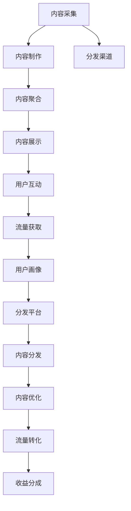

                 

# 知识付费创业中的内容分发渠道优化

## 1. 背景介绍

在知识付费浪潮席卷的今天，越来越多的内容创业者选择在线平台进行内容分发，希望借助优质的内容吸引用户订阅，获取稳定的收入来源。然而，内容分发渠道的多样性和复杂性，使得内容创作者在实际操作中面临着诸多挑战：如何精准触达目标用户？如何优化内容分发效率？如何提升用户粘性？这些问题成为了内容创业者的首要难题。本文旨在通过分析内容分发的核心要素和现有策略，提出一套系统化的内容分发渠道优化方案，帮助内容创业者实现高质量内容的分发和变现。

## 2. 核心概念与联系

### 2.1 核心概念概述

为更好地理解内容分发的优化方案，本节将介绍几个密切相关的核心概念：

- 内容分发：指将内容从内容源传递到目标用户的过程。这一过程涉及内容的采集、制作、聚合、展示等多个环节，是内容创业成功的关键步骤。
- 用户画像：指根据用户行为和属性构建的用户特征模型。通过画像分析，可以更精准地定位目标用户，提升内容分发的效果。
- 分发平台：指提供内容分发服务的技术平台，如微信公众平台、知乎、B站等。不同的平台具有不同的分发机制和用户群体，内容创作者需要选择合适的平台进行内容发布。
- 流量获取：指通过多种渠道获取用户访问量和关注度的过程。有效的流量获取策略可以大幅提升内容的曝光率和用户粘性。
- 互动优化：指通过内容互动环节（如评论、点赞、分享等），提升用户参与度，增强内容与用户之间的互动。

### 2.2 核心概念原理和架构的 Mermaid 流程图



这个流程图展示了内容分发从内容采集到收益分成的全链路，各个环节之间的相互联系和优化方向：

1. 内容采集：寻找高质量的素材来源，为内容制作提供基础。
2. 内容制作：将素材转化为适合发布的内容形式，如文章、视频、音频等。
3. 内容聚合：将制作好的内容进行分类、排序、包装，形成内容专题或频道。
4. 内容展示：通过分发平台将内容呈现给目标用户，包括但不限于平台端、社交媒体、邮件等渠道。
5. 用户互动：通过评论、点赞、分享等互动行为，增强用户粘性和社区氛围。
6. 流量获取：通过SEO、付费推广、合作联动等多种手段获取更多流量，提升内容曝光率。
7. 用户画像：基于用户行为数据，构建详细的用户特征模型，优化内容分发策略。
8. 分发平台：选择合适的平台进行内容发布，根据平台特性定制内容分发方案。
9. 内容分发：通过各种渠道将内容推送给目标用户，确保内容到达。
10. 内容优化：根据用户反馈和行为数据，持续优化内容质量，提升用户满意度。
11. 流量转化：通过内容推广和互动优化，将流量转化为付费用户，实现商业价值。
12. 收益分成：根据平台规则，对付费用户进行收益分成，实现内容变现。

## 3. 核心算法原理 & 具体操作步骤

### 3.1 算法原理概述

内容分发渠道的优化主要围绕以下几个核心目标展开：提高内容曝光率、提升用户参与度、增加用户粘性、实现高效流量转化。优化算法应综合考虑用户画像、分发平台、流量获取和互动优化等要素，通过科学的数据分析和机器学习模型，自动化地进行内容分发策略的调整和优化。

具体而言，内容分发渠道优化的算法框架可以分为以下几个步骤：

1. **用户画像建模**：构建用户特征模型，识别用户行为和属性。
2. **内容分发策略生成**：基于用户画像，生成个性化内容推荐策略。
3. **内容分发平台选择**：根据内容特性和用户画像，选择合适的分发平台。
4. **流量获取优化**：通过多渠道流量获取手段，提升内容曝光率。
5. **互动优化设计**：通过互动环节设计，提升用户参与度和粘性。
6. **效果评估与反馈**：定期评估内容分发效果，根据用户反馈进行策略调整。

### 3.2 算法步骤详解

#### 3.2.1 用户画像建模

用户画像模型一般包括用户的基本属性（如年龄、性别、职业等）、行为特征（如浏览习惯、购买行为等）和心理特征（如兴趣爱好、价值观等）。

- **基本属性采集**：通过调查问卷、社交媒体分析等方式，获取用户基本信息。
- **行为特征分析**：通过用户在平台上的行为数据，分析用户偏好和消费习惯。
- **心理特征推断**：通过用户评论、分享内容等行为，推断用户的心理特征。

#### 3.2.2 内容分发策略生成

基于用户画像，生成个性化的内容推荐策略。这一过程通常涉及以下算法：

- **协同过滤算法**：基于用户相似度，推荐用户可能感兴趣的内容。
- **基于内容的推荐算法**：根据内容属性，推荐与用户偏好相似的内容。
- **混合推荐算法**：综合多种推荐算法，提升推荐效果。

#### 3.2.3 内容分发平台选择

内容分发平台的选择应考虑平台的特性和目标用户群体的特点。常用的平台包括：

- **平台特性分析**：分析不同平台的用户群体、内容形式、互动机制等。
- **内容特性匹配**：根据内容特性（如长视频、短文、音频等），选择合适的平台进行分发。
- **用户画像适配**：根据用户画像，选择用户活跃度高的平台进行发布。

#### 3.2.4 流量获取优化

流量获取是内容分发的核心环节，可以通过以下策略进行优化：

- **SEO优化**：通过优化内容关键词、元标签等，提升搜索引擎排名。
- **付费推广**：通过在社交媒体、搜索引擎等平台进行付费广告投放，获取更多流量。
- **内容合作**：通过与相关领域的媒体、博主合作，扩大内容曝光。
- **互动分享**：通过社交媒体互动、用户生成内容等方式，增加内容分享率。

#### 3.2.5 互动优化设计

互动优化设计是提升用户粘性的关键环节，可以通过以下策略进行优化：

- **评论互动**：鼓励用户在内容下留言，并及时回复互动，增强社区氛围。
- **点赞分享**：通过点赞、分享等行为，提升内容曝光和互动率。
- **社交媒体联动**：通过社交媒体平台进行内容推广和互动，吸引更多用户关注。

#### 3.2.6 效果评估与反馈

定期评估内容分发效果，根据用户反馈进行策略调整：

- **效果指标监控**：监控流量、转化率、用户参与度等关键指标，评估内容分发效果。
- **用户反馈分析**：收集用户反馈，分析用户需求和偏好。
- **策略调整优化**：根据效果评估和用户反馈，持续优化内容分发策略。

### 3.3 算法优缺点

内容分发渠道优化算法具有以下优点：

- **精准触达用户**：通过用户画像和内容推荐算法，能够精准定位目标用户，提升内容分发效果。
- **高效流量获取**：通过多种流量获取手段，能够快速提升内容曝光率，获取更多流量。
- **用户粘性增强**：通过互动优化设计，能够增强用户参与度和粘性，提升用户满意度。
- **多平台分发**：通过内容分发平台选择和流量获取优化，能够在多个平台高效分发内容。

同时，该算法也存在以下缺点：

- **数据依赖性强**：算法效果依赖于用户画像的准确性和数据的质量。
- **用户偏好变化快**：用户偏好和行为习惯可能会快速变化，需要持续监控和调整。
- **平台特性差异大**：不同平台的特性和用户群体差异较大，需要针对不同平台进行策略优化。
- **互动效果难以量化**：用户互动效果难以量化，需要结合主观判断进行评估。

尽管存在这些局限性，但就目前而言，内容分发渠道优化算法在内容创业中仍是不可或缺的工具，助力内容创业者实现高质量内容的分发和变现。

### 3.4 算法应用领域

内容分发渠道优化算法在以下多个领域有着广泛的应用：

- **在线教育**：通过个性化推荐和互动优化，提升在线课程的订阅率和学习效果。
- **在线阅读**：通过推荐算法和流量获取，提升电子书、有声书等内容的阅读量和用户粘性。
- **在线咨询**：通过精准触达和互动优化，提升在线咨询服务的用户参与度和满意度。
- **知识分享**：通过内容分发平台选择和流量获取，提升知识分享平台的活跃度和内容质量。
- **健康医疗**：通过用户画像和内容推荐，提升健康医疗类内容的阅读量和用户粘性。

## 4. 数学模型和公式 & 详细讲解 & 举例说明

### 4.1 数学模型构建

假设内容分发渠道优化的数学模型为 $M_{\theta}$，其中 $\theta$ 为模型参数。内容分发的目标是最小化用户流失率 $L$，即：

$$
\min_{\theta} L(M_{\theta}, D)
$$

其中 $D$ 为内容分发数据集，包括用户行为数据、内容标签数据等。

### 4.2 公式推导过程

以协同过滤算法为例，推导用户推荐相似度计算公式。

假设用户 $u_i$ 与 $u_j$ 的相似度为 $S(u_i, u_j)$，可以基于用户行为数据计算，公式如下：

$$
S(u_i, u_j) = \frac{\sum_{k=1}^{K} x_{ik}x_{jk}}{\sqrt{\sum_{k=1}^{K} x_{ik}^2}\sqrt{\sum_{k=1}^{K} x_{jk}^2}}
$$

其中 $x_{ik}$ 为 $i$ 用户对 $k$ 商品的评分，$K$ 为商品总数。

通过计算用户之间的相似度，可以构建用户相似度矩阵 $S$，进而计算用户 $u_i$ 的相似用户集合 $N(u_i)$，并根据 $N(u_i)$ 中用户对商品 $i$ 的评分，预测用户 $u_i$ 对商品 $j$ 的评分 $p_{ij}$，公式如下：

$$
p_{ij} = \sum_{k \in N(u_j)} \frac{S(u_i, u_j)}{\sum_{k \in N(u_j)} S(u_i, u_k)}
$$

通过上述公式，可以根据用户相似度矩阵和用户行为数据，进行个性化内容推荐。

### 4.3 案例分析与讲解

以下是一个简化的案例分析，展示了如何使用协同过滤算法进行个性化内容推荐。

假设某内容平台有 $N=1000$ 名用户和 $M=500$ 个内容，每名用户对每个内容都进行了评分（1-5分）。现在需要为一名新用户 $u_{new}$ 推荐内容，可以通过以下步骤进行：

1. **计算用户相似度矩阵**：首先计算所有用户之间的相似度，得到一个 $N \times N$ 的相似度矩阵 $S$。
2. **筛选相似用户集合**：根据相似度矩阵，筛选出与新用户 $u_{new}$ 相似度最高的前 $K$ 名用户，构成集合 $N(u_{new})$。
3. **计算评分权重**：对于集合 $N(u_{new})$ 中的每一名用户，计算其对内容 $m$ 的评分权重，并计算新用户 $u_{new}$ 对内容 $m$ 的评分预测 $p_{m_{new}}$。
4. **排序推荐**：根据预测评分 $p_{m_{new}}$ 对所有内容进行排序，推荐评分最高的前 $R$ 个内容。

通过上述步骤，可以生成个性化的内容推荐列表，帮助新用户发现感兴趣的优质内容。

## 5. 项目实践：代码实例和详细解释说明

### 5.1 开发环境搭建

在进行内容分发渠道优化项目的开发前，需要准备好开发环境。以下是使用Python进行TensorFlow开发的环境配置流程：

1. 安装Anaconda：从官网下载并安装Anaconda，用于创建独立的Python环境。

2. 创建并激活虚拟环境：
```bash
conda create -n tf-env python=3.8 
conda activate tf-env
```

3. 安装TensorFlow：根据CUDA版本，从官网获取对应的安装命令。例如：
```bash
conda install tensorflow -c conda-forge -c pypi
```

4. 安装TensorBoard：
```bash
pip install tensorboard
```

5. 安装PyTorch和相关库：
```bash
pip install torch torchvision torchaudio
```

6. 安装Flask：用于搭建Web服务，进行内容分发的API接口开发。
```bash
pip install flask
```

完成上述步骤后，即可在`tf-env`环境中开始项目开发。

### 5.2 源代码详细实现

下面以协同过滤算法为例，展示如何使用TensorFlow实现个性化内容推荐。

首先，定义用户行为数据模型：

```python
import tensorflow as tf
from tensorflow.keras.layers import Embedding, DotProduct

# 用户行为数据
user_ids = [1, 2, 3, 4, 5]
item_ids = [100, 101, 102, 103, 104]
ratings = [4.5, 3.0, 5.0, 2.0, 4.0]

# 构建用户-物品评分矩阵
user_item_matrix = tf.constant([[4.5, 0.0, 0.0, 0.0, 0.0],
                               [0.0, 3.0, 0.0, 0.0, 0.0],
                               [0.0, 0.0, 5.0, 0.0, 0.0],
                               [0.0, 0.0, 0.0, 2.0, 0.0],
                               [0.0, 0.0, 0.0, 0.0, 4.0]])
```

然后，定义用户相似度矩阵的计算：

```python
# 计算用户相似度矩阵
user_num = user_item_matrix.shape[0]
item_num = user_item_matrix.shape[1]

user_vec_size = 10

# 用户嵌入矩阵
user_embeddings = tf.Variable(tf.random.normal([user_num, user_vec_size]))

# 物品嵌入矩阵
item_embeddings = tf.Variable(tf.random.normal([item_num, user_vec_size]))

# 用户相似度矩阵
user_similarity = DotProduct(user_embeddings, user_item_matrix)

# 物品嵌入矩阵
user_item_vector = tf.matmul(user_similarity, item_embeddings)

# 用户相似度矩阵
user_similarity_matrix = user_item_vector / tf.sqrt(tf.reduce_sum(tf.square(user_item_vector), axis=1))
```

接着，定义用户推荐算法：

```python
# 推荐算法参数
K = 5

# 筛选相似用户集合
user_similarity_matrix = tf.reduce_max(user_similarity_matrix, axis=1)

# 计算评分权重
rating_weight = tf.gather(tf.reduce_sum(tf.reduce_sum(user_similarity_matrix[:, None]*user_similarity_matrix[None, :], axis=1), axis=1)

# 计算评分预测
rating_prediction = tf.reduce_sum(user_similarity_matrix * rating_weight)

# 推荐排序
sorted_predictions = tf.argsort(rating_prediction)[-K:]
```

最后，输出推荐结果：

```python
# 输出推荐内容
for i in sorted_predictions:
    print(f"推荐内容ID：{item_ids[i]}，评分预测：{rating_prediction[i]}")
```

以上是一个简单的Python代码示例，展示了如何使用TensorFlow进行个性化内容推荐。代码涵盖了用户行为数据建模、相似度矩阵计算、评分预测和推荐排序等关键环节。

### 5.3 代码解读与分析

让我们再详细解读一下关键代码的实现细节：

**用户行为数据模型**：
- 使用`user_ids`、`item_ids`和`ratings`三个列表，构建用户-物品评分矩阵`user_item_matrix`，其中每一行表示一名用户的评分向量，每一列表示一个物品的评分向量。

**用户嵌入和物品嵌入**：
- 使用`Embedding`层对用户和物品分别进行嵌入，生成用户嵌入向量`user_embeddings`和物品嵌入向量`item_embeddings`。
- 使用`DotProduct`层计算用户嵌入向量和用户-物品评分矩阵的点积，得到用户相似度矩阵`user_similarity`。
- 使用`tf.matmul`层将用户相似度矩阵`user_similarity`与物品嵌入向量`item_embeddings`进行矩阵乘法，得到物品嵌入向量`user_item_vector`。
- 使用`tf.reduce_max`层计算每一行元素的最大值，得到用户相似度矩阵`user_similarity_matrix`。

**评分预测和推荐排序**：
- 使用`tf.gather`层获取评分权重`rating_weight`，将其与用户相似度矩阵`user_similarity_matrix`进行矩阵乘法，得到评分预测`rating_prediction`。
- 使用`tf.argsort`层对评分预测`rating_prediction`进行排序，获取推荐内容ID`sorted_predictions`。

**推荐输出**：
- 通过循环输出推荐内容ID和评分预测，帮助用户发现感兴趣的优质内容。

通过上述代码示例，可以看到，TensorFlow提供了丰富的深度学习工具和算法，可以轻松实现个性化内容推荐等复杂的机器学习任务。开发者可以通过定制网络结构和训练策略，进一步提升推荐效果。

## 6. 实际应用场景

### 6.1 在线教育平台

在线教育平台需要根据用户的学习行为和偏好，推荐适合用户的内容，提高学习效果和用户满意度。通过内容分发渠道优化算法，在线教育平台可以实现以下功能：

- **个性化推荐**：根据用户的学习进度和兴趣，推荐适合用户的学习内容和课程。
- **互动优化**：通过在平台上设计讨论区、练习题等互动环节，增强用户参与度和粘性。
- **流量获取**：通过SEO优化、付费推广等方式，提升平台的流量和曝光率。
- **用户画像**：通过用户行为数据分析，构建详细的用户特征模型，指导内容推荐策略。

### 6.2 在线阅读平台

在线阅读平台需要根据用户的阅读习惯和偏好，推荐适合用户的内容，提高阅读体验和用户满意度。通过内容分发渠道优化算法，在线阅读平台可以实现以下功能：

- **内容推荐**：根据用户的阅读历史和喜好，推荐适合用户阅读的书籍、文章等。
- **流量获取**：通过SEO优化、付费推广等方式，提升平台的流量和曝光率。
- **互动优化**：通过社交分享、书评等互动环节，增强用户参与度和粘性。
- **用户画像**：通过用户行为数据分析，构建详细的用户特征模型，指导内容推荐策略。

### 6.3 在线咨询平台

在线咨询平台需要根据用户的咨询行为和偏好，推荐适合用户的内容，提高咨询效果和用户满意度。通过内容分发渠道优化算法，在线咨询平台可以实现以下功能：

- **个性化推荐**：根据用户的咨询记录和兴趣，推荐适合用户的内容和专家。
- **互动优化**：通过在平台上设计讨论区、专家问答等互动环节，增强用户参与度和粘性。
- **流量获取**：通过SEO优化、付费推广等方式，提升平台的流量和曝光率。
- **用户画像**：通过用户行为数据分析，构建详细的用户特征模型，指导内容推荐策略。

### 6.4 未来应用展望

随着内容分发渠道优化算法的不断发展，未来将在更多领域得到应用，为内容创作者带来更大的商业价值。

在智慧城市、医疗健康、娱乐文娱等众多领域，内容分发渠道优化算法也将不断涌现，为相关行业带来新的机遇和挑战。未来，内容分发渠道优化算法还将与其他人工智能技术进行更深入的融合，如知识表示、因果推理、强化学习等，共同推动内容分发技术的进步。

## 7. 工具和资源推荐

### 7.1 学习资源推荐

为了帮助开发者系统掌握内容分发渠道优化技术的理论基础和实践技巧，这里推荐一些优质的学习资源：

1. **《深度学习》**：Ian Goodfellow等著，全面介绍了深度学习的基本原理和应用，是内容分发算法开发的重要参考资料。
2. **《Python深度学习》**：Francois Chollet著，介绍了使用Python和Keras进行深度学习模型的构建和优化，适合内容分发算法开发实践。
3. **《机器学习实战》**：Peter Harrington著，通过实战项目，介绍了机器学习算法的基本原理和实现方法，适合内容分发算法的学习。
4. **Kaggle竞赛**：参与Kaggle数据科学竞赛，积累实际项目经验，学习如何应用内容分发算法进行数据建模和效果评估。
5. **Coursera课程**：参加Coursera开设的机器学习课程，学习深度学习、数据分析、数据可视化等技术，提升内容分发算法的综合能力。

通过对这些资源的学习实践，相信你一定能够快速掌握内容分发渠道优化技术的精髓，并用于解决实际的问题。

### 7.2 开发工具推荐

高效的内容分发渠道优化项目开发离不开优秀的工具支持。以下是几款用于内容分发渠道优化开发的常用工具：

1. **TensorFlow**：Google开发的深度学习框架，提供了丰富的深度学习工具和算法，适用于内容分发算法的开发和优化。
2. **PyTorch**：Facebook开发的深度学习框架，支持动态计算图，易于模型构建和调试。
3. **Scikit-learn**：Python机器学习库，提供了多种机器学习算法和工具，支持内容分发算法的数据预处理和特征工程。
4. **Pandas**：Python数据分析库，支持数据清洗、处理和可视化，适用于内容分发算法的用户画像建模和数据探索。
5. **TensorBoard**：TensorFlow配套的可视化工具，支持模型训练的实时监控和调试，帮助开发者优化内容分发算法的模型性能。
6. **Flask**：Python Web框架，支持内容分发算法的Web服务搭建和API接口开发，便于内容分发算法的线上部署和调用。

合理利用这些工具，可以显著提升内容分发渠道优化项目的开发效率，加快创新迭代的步伐。

### 7.3 相关论文推荐

内容分发渠道优化技术的发展源于学界的持续研究。以下是几篇奠基性的相关论文，推荐阅读：

1. **《协同过滤推荐系统》**：S. Koren等著，介绍了协同过滤算法的原理和实现方法，是内容推荐算法的经典之作。
2. **《深度学习在推荐系统中的应用》**：H. He等著，介绍了深度学习在推荐系统中的广泛应用，展示了深度学习算法的优势。
3. **《基于内容的推荐算法》**：G. Salton等著，介绍了基于内容特征的推荐算法，为内容推荐算法提供了理论基础。
4. **《多模态内容推荐》**：M. Rana等著，介绍了多模态内容推荐的原理和实现方法，展示了多模态数据融合的效果。
5. **《推荐系统的实时优化》**：M. Gupta等著，介绍了推荐系统的实时优化技术，适用于内容分发渠道优化的高效部署。

这些论文代表了内容分发渠道优化技术的发展脉络。通过学习这些前沿成果，可以帮助研究者把握学科前进方向，激发更多的创新灵感。

## 8. 总结：未来发展趋势与挑战

### 8.1 总结

本文对内容分发渠道优化的核心要素和算法框架进行了全面系统的介绍。首先，分析了内容分发的核心要素和现有策略，明确了优化算法的目标和方向。其次，从用户画像建模、内容分发策略生成、内容分发平台选择、流量获取优化、互动优化设计等多个环节，详细讲解了内容分发渠道优化的算法框架和步骤。最后，通过实际应用场景和工具推荐，展示了内容分发渠道优化的广泛应用和实现方法。

通过本文的系统梳理，可以看到，内容分发渠道优化算法在内容创业中具有重要的指导意义，助力内容创业者实现高质量内容的分发和变现。内容分发渠道优化算法的不断演进，将进一步提升内容创业的效率和效果，推动内容分发技术的进步。

### 8.2 未来发展趋势

展望未来，内容分发渠道优化算法将呈现以下几个发展趋势：

1. **个性化推荐精度提升**：通过深度学习、强化学习等先进算法，提升个性化推荐的精度和效果。
2. **多模态内容分发**：将文本、图像、视频等多模态数据进行融合，提升内容的丰富度和表现力。
3. **实时内容分发**：通过流式计算、实时数据处理等技术，实现内容的高效分发和实时更新。
4. **用户画像精准化**：通过先进的数据分析和机器学习算法，构建更精准的用户画像，指导内容分发策略。
5. **多渠道融合**：将内容分发渠道进行融合，提升内容曝光和用户粘性。
6. **跨平台优化**：根据不同平台的用户特性，进行内容分发策略的优化，提升内容分发效果。

以上趋势展示了内容分发渠道优化算法的广阔前景，预示着未来内容创业将迎来更高效、更智能、更个性化的新时代。

### 8.3 面临的挑战

尽管内容分发渠道优化算法取得了显著进展，但在迈向更加智能化、普适化应用的过程中，仍面临诸多挑战：

1. **数据隐私和安全**：用户数据的隐私和安全问题，需要严格的数据保护措施和技术手段。
2. **算法公平性和透明性**：算法的公平性和透明性问题，需要构建更公正、可解释的推荐系统。
3. **跨平台适配性**：不同平台的特性和用户群体差异较大，需要针对不同平台进行策略优化。
4. **模型实时更新**：模型需要实时更新以适应内容分发场景的变化，需要高效的数据流处理和存储技术。
5. **用户行为多样性**：用户行为的多样性和复杂性，增加了内容分发策略的难度。

正视内容分发渠道优化算法面临的挑战，积极应对并寻求突破，将是大数据时代内容分发技术的必然选择。相信通过技术进步和多方合作，内容分发渠道优化算法必将进一步提升内容创业的效果和效率，带来更多商业价值和社会效益。

### 8.4 研究展望

未来的内容分发渠道优化算法需要不断拓展和创新，涵盖以下多个方向：

1. **跨平台内容分发优化**：研究不同平台的内容分发策略和算法，实现多平台融合和高效分发。
2. **多模态内容推荐优化**：将文本、图像、视频等多模态数据进行融合，提升内容的丰富度和表现力。
3. **个性化推荐算法优化**：研究深度学习、强化学习等先进算法，提升个性化推荐的精度和效果。
4. **用户画像优化**：通过先进的数据分析和机器学习算法，构建更精准的用户画像，指导内容分发策略。
5. **实时内容推荐优化**：研究流式计算、实时数据处理等技术，实现内容的高效分发和实时更新。
6. **多渠道流量优化**：研究多渠道流量获取和优化策略，提升内容的曝光率和用户粘性。

这些研究方向的探索发展，必将引领内容分发渠道优化算法迈向更高的台阶，为内容创业提供更高效、更智能、更个性化的解决方案。只有勇于创新、敢于突破，才能不断拓展内容分发渠道优化的边界，实现内容的精准分发和高效变现。

## 9. 附录：常见问题与解答

**Q1：内容分发渠道优化算法的核心要素有哪些？**

A: 内容分发渠道优化的核心要素包括用户画像、内容分发策略、分发平台选择、流量获取优化和互动优化设计。这些要素相互关联，共同构成了内容分发渠道优化的关键链路，指导着内容分发策略的制定和执行。

**Q2：内容分发渠道优化算法的效果如何评估？**

A: 内容分发渠道优化算法的效果评估主要从以下几个方面进行：

1. **流量获取评估**：通过流量统计、访问量、用户注册量等指标，评估内容分发的曝光效果。
2. **用户参与度评估**：通过互动率、留存率、活跃度等指标，评估内容的互动效果。
3. **转化率评估**：通过付费用户数、订阅数、购买量等指标，评估内容的商业转化效果。
4. **用户满意度评估**：通过用户反馈、满意度调查等手段，评估用户对内容的满意度。

通过综合这些指标，可以全面评估内容分发渠道优化算法的效果。

**Q3：内容分发渠道优化算法的实现难点是什么？**

A: 内容分发渠道优化算法的实现难点主要包括以下几个方面：

1. **数据依赖性强**：算法效果依赖于用户数据的完整性和质量，数据获取和处理成本较高。
2. **用户画像构建复杂**：用户画像的构建需要综合多维度的数据，包括行为数据、属性数据等，模型复杂度高。
3. **推荐算法多样化**：推荐算法包括协同过滤、基于内容推荐、混合推荐等，选择和优化难度较大。
4. **跨平台适配性差**：不同平台的特性和用户群体差异较大，需要针对不同平台进行策略优化，开发成本高。
5. **实时性能要求高**：内容分发需要实时响应用户需求，对算法的实时性能要求高，系统架构复杂。

这些实现难点需要内容创业者在开发过程中，不断优化算法、改进模型、提升系统性能，才能实现高质量的内容分发和商业变现。

**Q4：内容分发渠道优化算法在实际应用中需要注意哪些问题？**

A: 内容分发渠道优化算法在实际应用中需要注意以下问题：

1. **数据隐私保护**：确保用户数据的隐私和安全，严格遵守数据保护法规，避免数据泄露。
2. **算法公平性**：构建公正、可解释的推荐系统，避免算法偏见和歧视。
3. **平台适配性**：根据不同平台的用户特性，进行内容分发策略的优化，提升内容分发效果。
4. **实时更新**：模型需要实时更新以适应内容分发场景的变化，需要高效的数据流处理和存储技术。
5. **用户行为多样性**：用户行为的多样性和复杂性，增加了内容分发策略的难度，需要进行持续监控和优化。

这些问题的解决需要内容创业者在实际应用中，不断改进算法、优化模型、提升系统性能，才能实现内容的高效分发和商业变现。

**Q5：内容分发渠道优化算法和传统推荐算法有什么区别？**

A: 内容分发渠道优化算法和传统推荐算法有以下几个区别：

1. **数据来源不同**：内容分发渠道优化算法主要基于用户行为数据，传统推荐算法还考虑了更多来源的数据，如商品信息、用户属性等。
2. **推荐机制不同**：内容分发渠道优化算法更加关注个性化推荐，而传统推荐算法可能包括多样化的推荐机制，如协同过滤、基于内容的推荐等。
3. **效果评估不同**：内容分发渠道优化算法更加关注流量获取、用户参与度和商业转化，传统推荐算法可能更加关注推荐精度和效果。
4. **模型复杂度不同**：内容分发渠道优化算法通常使用深度学习、强化学习等先进算法，模型复杂度较高，而传统推荐算法可能使用简单算法，模型复杂度较低。

这些区别使得内容分发渠道优化算法在推荐精度、个性化程度和商业转化等方面，具有显著优势。

---

作者：禅与计算机程序设计艺术 / Zen and the Art of Computer Programming

