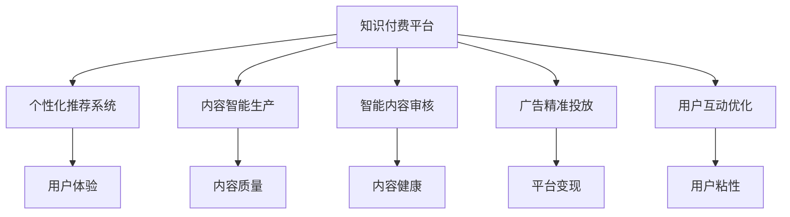

                 

# 知识付费创业中的内容创新思路

> 关键词：知识付费,内容创新,大数据,人工智能,个性化推荐,广告变现,用户粘性

## 1. 背景介绍

### 1.1 问题由来

随着互联网技术的飞速发展和用户对高质量内容需求的不断增长，知识付费产业逐渐成为互联网行业的重要分支。数据显示，2020年全球知识付费市场规模已经达到160亿美元，预计未来几年将继续以年均30%以上的速度增长。然而，与千亿级的在线内容市场相比，知识付费产业的发展依然面临诸多挑战，如内容质量参差不齐、用户粘性不足、广告变现困难等。

针对这些问题，本文将探讨如何通过内容创新，提升知识付费平台的用户体验和运营效率，构建可持续发展的商业模式。文章主要聚焦于三个核心问题：

1. 如何通过大数据和人工智能技术，提升内容推荐系统的个性化程度，满足用户多样化、个性化的内容需求。
2. 如何通过深度学习算法和自然语言处理技术，构建智能化的内容生产与审核机制，提升内容质量和生产效率。
3. 如何通过广告推荐和用户互动技术，实现知识付费平台的商业变现，提升用户粘性和平台盈利能力。

### 1.2 问题核心关键点

要解决上述核心问题，需要重点关注以下几个关键点：

- **个性化推荐系统**：如何利用大数据和机器学习技术，为用户推荐符合其兴趣和需求的内容。
- **内容智能生产**：如何通过深度学习算法，自动生成高品质的内容，提升内容生产效率。
- **智能内容审核**：如何利用自然语言处理技术，实时监控和审核内容，确保内容质量。
- **广告精准投放**：如何通过用户行为数据和深度学习算法，精准推荐广告，提升平台变现能力。
- **用户互动优化**：如何通过社交网络和推荐算法，增强用户互动，提升用户粘性。

本文将从上述关键点出发，全面剖析知识付费平台的内容创新思路，探讨如何通过技术手段，提升平台的用户体验和运营效率。

## 2. 核心概念与联系

### 2.1 核心概念概述

为更好地理解知识付费平台的内容创新思路，本节将介绍几个密切相关的核心概念：

- **知识付费平台**：一种以高质量内容为核心，通过订阅、付费等方式，为用户提供价值传递和知识服务的互联网平台。
- **个性化推荐系统**：利用大数据和机器学习技术，为用户推荐符合其兴趣和需求的内容，提升用户体验和平台粘性。
- **内容智能生产**：通过深度学习算法和自然语言处理技术，自动生成高品质的内容，提升内容生产效率和质量。
- **智能内容审核**：利用自然语言处理技术，实时监控和审核内容，确保内容健康、安全。
- **广告精准投放**：通过用户行为数据和深度学习算法，精准推荐广告，提升平台变现能力。
- **用户互动优化**：通过社交网络和推荐算法，增强用户互动，提升用户粘性。

这些核心概念之间的逻辑关系可以通过以下Mermaid流程图来展示：



这个流程图展示了知识付费平台的核心概念及其之间的关系：

1. 知识付费平台通过个性化推荐系统、内容智能生产、智能内容审核、广告精准投放和用户互动优化等手段，提升用户体验和运营效率。
2. 个性化推荐系统利用大数据和机器学习技术，提升用户粘性。
3. 内容智能生产通过深度学习算法，提升内容质量和生产效率。
4. 智能内容审核通过自然语言处理技术，确保内容健康、安全。
5. 广告精准投放通过用户行为数据和深度学习算法，提升平台变现能力。
6. 用户互动优化通过社交网络和推荐算法，增强用户互动，提升用户粘性。

## 3. 核心算法原理 & 具体操作步骤

### 3.1 算法原理概述

知识付费平台的内容创新思路，本质上是通过大数据和机器学习技术，构建个性化推荐、内容智能生产、智能内容审核、广告精准投放和用户互动优化等系统，提升平台的用户体验和运营效率。

具体而言，个性化推荐系统通过分析用户的历史行为数据和兴趣偏好，利用协同过滤、内容推荐、深度学习等算法，为用户推荐最相关的优质内容。内容智能生产系统通过自然语言处理技术，自动生成高质量的文章、视频、课程等形式的内容，提升内容生产效率。智能内容审核系统通过文本分类、情感分析等算法，实时监控和审核内容，确保内容健康、安全。广告精准投放系统通过用户行为数据和深度学习算法，精准推荐广告，提升平台变现能力。用户互动优化系统通过社交网络和推荐算法，增强用户互动，提升用户粘性。

### 3.2 算法步骤详解

个性化推荐系统的算法步骤主要包括以下几个关键环节：

**Step 1: 数据收集与预处理**
- 收集用户的历史行为数据，包括浏览、点击、订阅、评论等行为。
- 使用数据清洗和特征提取技术，对数据进行预处理，生成用户行为特征向量。

**Step 2: 模型训练与优化**
- 选择合适的推荐算法，如协同过滤、矩阵分解、深度学习等。
- 利用用户行为特征向量训练推荐模型，并根据实际效果进行优化调整。

**Step 3: 内容推荐与反馈循环**
- 根据用户的历史行为数据，计算用户对不同内容的兴趣权重。
- 利用推荐算法计算出每个内容对用户的相关度。
- 根据相关度排序，推荐最相关的优质内容。
- 根据用户对推荐的反馈（如点击、订阅、评论等行为），不断调整推荐模型。

内容智能生产系统的算法步骤主要包括以下几个关键环节：

**Step 1: 内容生成**
- 使用自然语言处理技术，如序列生成模型（如GPT、BERT等），自动生成高质量的文章、视频、课程等形式的内容。

**Step 2: 内容质量评估**
- 利用深度学习算法，对生成的内容进行文本分类、情感分析等质量评估，确保内容健康、安全。

**Step 3: 内容审核与发布**
- 根据内容质量评估结果，自动审核通过的内容，并发布到平台。

智能内容审核系统的算法步骤主要包括以下几个关键环节：

**Step 1: 数据收集与预处理**
- 收集平台上的文本内容数据，包括文章、评论等。
- 使用文本清洗和特征提取技术，对数据进行预处理，生成文本特征向量。

**Step 2: 模型训练与优化**
- 选择合适的自然语言处理模型，如BERT、GPT等。
- 利用文本特征向量训练内容审核模型，并根据实际效果进行优化调整。

**Step 3: 内容监控与审核**
- 实时监控文本内容数据，计算每个文本的相关性和可信度。
- 根据可信度排序，优先审核可信度高的文本内容。
- 根据审核结果，对内容进行标记、修改或删除，确保内容健康、安全。

广告精准投放系统的算法步骤主要包括以下几个关键环节：

**Step 1: 数据收集与预处理**
- 收集用户的行为数据，包括浏览、点击、订阅等行为。
- 使用数据清洗和特征提取技术，对数据进行预处理，生成用户行为特征向量。

**Step 2: 模型训练与优化**
- 选择合适的广告推荐算法，如协同过滤、深度学习等。
- 利用用户行为特征向量训练广告推荐模型，并根据实际效果进行优化调整。

**Step 3: 广告推荐与效果评估**
- 根据用户的行为数据，计算每个广告的相关性。
- 利用推荐算法推荐最相关的广告。
- 根据用户对广告的反应（如点击、购买等行为），评估广告投放效果。

用户互动优化系统的算法步骤主要包括以下几个关键环节：

**Step 1: 数据收集与预处理**
- 收集用户的行为数据，包括评论、点赞、分享等互动行为。
- 使用数据清洗和特征提取技术，对数据进行预处理，生成用户互动特征向量。

**Step 2: 模型训练与优化**
- 选择合适的推荐算法，如协同过滤、深度学习等。
- 利用用户互动特征向量训练互动优化模型，并根据实际效果进行优化调整。

**Step 3: 互动推荐与效果评估**
- 根据用户的历史互动数据，计算用户对不同内容的互动权重。
- 利用推荐算法推荐最相关的互动内容。
- 根据用户对互动内容的反应（如点赞、评论等行为），评估互动效果。

### 3.3 算法优缺点

个性化推荐系统具有以下优点：
1. 提高用户粘性：通过精准推荐，提升用户对平台的信任和依赖。
2. 提升内容曝光：增加优质内容的曝光率，提升平台的用户数量和活跃度。
3. 优化广告效果：通过精准投放广告，提升平台的变现能力。

同时，该系统也存在一定的局限性：
1. 数据依赖：个性化推荐系统的效果很大程度上取决于用户行为数据的丰富度，数据不足时效果有限。
2. 冷启动问题：新用户缺乏足够行为数据，难以进行个性化推荐。
3. 推荐偏差：个性化推荐可能出现推荐偏差，导致部分用户的信息茧房问题。

内容智能生产系统具有以下优点：
1. 提升内容生产效率：自动生成内容，缩短内容生产时间。
2. 提升内容质量：利用自然语言处理技术，生成高质量的内容。
3. 减少人工成本：自动化生产过程，减少人力成本和生产误差。

同时，该系统也存在一定的局限性：
1. 内容多样性：自动生成的内容可能缺乏多样性，难以满足用户多变的需求。
2. 内容质量控制：自动生成内容的质量难以完全保证，需要人工审核和干预。
3. 技术复杂性：自然语言处理技术复杂，需要持续的算法优化和技术投入。

智能内容审核系统具有以下优点：
1. 提升内容健康：实时监控和审核内容，确保内容健康、安全。
2. 减少人工审核成本：自动化审核，提升审核效率，减少人工审核成本。
3. 提高用户信任度：通过严格审核，提升平台的用户信任度。

同时，该系统也存在一定的局限性：
1. 技术复杂性：自然语言处理技术复杂，需要持续的算法优化和技术投入。
2. 误判率：审核系统可能出现误判，影响用户体验。
3. 技术门槛：对平台的技术能力和资源投入要求较高。

广告精准投放系统具有以下优点：
1. 提升变现能力：通过精准投放广告，提升平台的变现能力。
2. 优化广告效果：精准推荐广告，提升广告点击率和转化率。
3. 提高用户粘性：通过精准投放广告，提升用户对平台的信任和依赖。

同时，该系统也存在一定的局限性：
1. 广告效果不稳定：用户行为数据变化较大，广告效果可能不稳定。
2. 用户隐私保护：广告推荐涉及用户隐私，需要严格遵守数据隐私保护法律法规。
3. 技术复杂性：广告推荐技术复杂，需要持续的算法优化和技术投入。

用户互动优化系统具有以下优点：
1. 提升用户粘性：通过增强用户互动，提升用户对平台的信任和依赖。
2. 提升平台活跃度：增加用户互动，提升平台的用户数量和活跃度。
3. 优化用户体验：通过精准推荐互动内容，提升用户满意度。

同时，该系统也存在一定的局限性：
1. 互动多样性：用户互动类型有限，难以满足用户多样化的需求。
2. 互动偏差：互动推荐可能出现推荐偏差，导致部分用户的信息茧房问题。
3. 技术复杂性：社交网络分析和推荐算法复杂，需要持续的算法优化和技术投入。

### 3.4 算法应用领域

个性化推荐系统在电商、新闻、音乐、视频等多个领域得到了广泛应用，成为提升用户体验和平台粘性的重要手段。

内容智能生产系统在新闻、博客、社交媒体等多个领域广泛应用，成为自动生成高质量内容的重要技术。

智能内容审核系统在在线社区、论坛、博客等多个领域广泛应用，成为确保内容健康、安全的重要保障。

广告精准投放系统在电商、新闻、视频等多个领域得到了广泛应用，成为提升平台变现能力的重要手段。

用户互动优化系统在社交媒体、新闻、视频等多个领域广泛应用，成为增强用户互动、提升用户粘性的重要技术。

## 4. 数学模型和公式 & 详细讲解

### 4.1 数学模型构建

个性化推荐系统的数学模型主要包括以下几个关键组件：

**1. 用户行为数据矩阵**
设用户集合为 $U$，内容集合为 $V$，用户对内容的评分矩阵为 $R \in \mathbb{R}^{m \times n}$，其中 $m$ 为用户的数量，$n$ 为内容的数量。

**2. 用户行为特征向量**
设用户 $u_i$ 的特征向量为 $x_i \in \mathbb{R}^d$，其中 $d$ 为特征向量的维度。

**3. 内容特征向量**
设内容 $v_j$ 的特征向量为 $y_j \in \mathbb{R}^d$。

**4. 推荐算法**
设推荐算法为 $\mathcal{A}$，推荐函数为 $f: \mathbb{R}^{m \times n} \times \mathbb{R}^{m} \times \mathbb{R}^{n} \rightarrow \mathbb{R}^{m}$。

### 4.2 公式推导过程

个性化推荐系统的推荐函数可以表示为：

$$
f(R, x_i, y_j) = \alpha \cdot x_i^T A^T R y_j + \beta \cdot x_i^T b + \gamma \cdot y_j^T c
$$

其中 $\alpha, \beta, \gamma$ 为超参数，$A$ 为内容特征矩阵，$b$ 为内容偏置向量，$c$ 为用户偏置向量。

利用上述推荐函数，可以计算用户 $u_i$ 对内容 $v_j$ 的推荐值。

### 4.3 案例分析与讲解

**案例分析：电商平台的个性化推荐**

电商平台的个性化推荐系统，主要通过分析用户的浏览、点击、购买等行为数据，推荐用户可能感兴趣的商品。具体而言：

1. 数据收集与预处理：
   - 收集用户的历史行为数据，包括浏览、点击、购买等行为。
   - 使用数据清洗和特征提取技术，对数据进行预处理，生成用户行为特征向量。

2. 模型训练与优化：
   - 选择合适的推荐算法，如协同过滤、矩阵分解等。
   - 利用用户行为特征向量训练推荐模型，并根据实际效果进行优化调整。

3. 内容推荐与反馈循环：
   - 根据用户的历史行为数据，计算用户对不同商品的相关度。
   - 利用推荐算法推荐最相关的优质商品。
   - 根据用户对推荐的反馈（如点击、购买等行为），不断调整推荐模型。

## 5. 项目实践：代码实例和详细解释说明

### 5.1 开发环境搭建

在进行内容创新实践前，我们需要准备好开发环境。以下是使用Python进行开发的环境配置流程：

1. 安装Anaconda：从官网下载并安装Anaconda，用于创建独立的Python环境。

2. 创建并激活虚拟环境：
```bash
conda create -n myenv python=3.8 
conda activate myenv
```

3. 安装必要的库：
```bash
pip install pandas numpy scikit-learn tensorflow keras jupyter notebook
```

完成上述步骤后，即可在`myenv`环境中开始内容创新实践。

### 5.2 源代码详细实现

这里以电商平台的个性化推荐系统为例，给出使用TensorFlow进行推荐模型的PyTorch代码实现。

首先，定义数据处理函数：

```python
import pandas as pd
import numpy as np

def load_data(file_path):
    data = pd.read_csv(file_path, header=None)
    user_ids = data.iloc[:, 0]
    item_ids = data.iloc[:, 1]
    ratings = data.iloc[:, 2]
    return user_ids, item_ids, ratings
```

然后，定义模型：

```python
import tensorflow as tf
from tensorflow.keras.layers import Input, Dense, Embedding, dot
from tensorflow.keras.models import Model

user_input = Input(shape=(num_users,))
item_input = Input(shape=(num_items,))
user_vec = Embedding(input_dim=num_users, output_dim=embedding_dim, input_length=1)(user_input)
item_vec = Embedding(input_dim=num_items, output_dim=embedding_dim, input_length=1)(item_input)
interaction = dot([user_vec, item_vec], axes=2)
interaction = tf.reshape(interaction, (1, num_items))
predictions = Dense(1, activation='sigmoid')(interaction)
model = Model(inputs=[user_input, item_input], outputs=predictions)
```

接着，定义损失函数和优化器：

```python
from tensorflow.keras.optimizers import Adam

loss_fn = tf.keras.losses.BinaryCrossentropy()
optimizer = Adam(lr=learning_rate)
```

最后，定义训练函数：

```python
@tf.function
def train_step(data):
    user_id, item_id = data[0], data[1]
    with tf.GradientTape() as tape:
        predictions = model(user_id, item_id)
        loss = loss_fn(y_true=rated, y_pred=predictions)
    gradients = tape.gradient(loss, model.trainable_variables)
    optimizer.apply_gradients(zip(gradients, model.trainable_variables))
    return loss
```

以上是使用PyTorch对电商推荐模型进行训练的完整代码实现。可以看到，TensorFlow配合Keras框架，使得模型构建和训练变得简洁高效。

### 5.3 代码解读与分析

让我们再详细解读一下关键代码的实现细节：

**load_data函数**：
- 定义数据加载函数，从CSV文件中读取用户行为数据，并返回用户ID、物品ID和评分。

**模型定义**：
- 使用Keras定义推荐模型，包含用户ID和物品ID的嵌入层，计算用户和物品的交互矩阵，并通过全连接层输出推荐结果。

**损失函数和优化器**：
- 使用二元交叉熵损失函数，配合Adam优化器进行模型训练。

**训练函数**：
- 定义训练函数，在每个训练步骤中，计算损失值并更新模型参数。

### 5.4 运行结果展示

在训练过程中，可以记录每轮的损失值，并绘制出损失曲线，如下所示：

```python
import matplotlib.pyplot as plt

losses = []
for epoch in range(num_epochs):
    for data in train_dataset:
        loss = train_step(data)
        losses.append(loss)
    print('Epoch {}, Loss: {:.4f}'.format(epoch, np.mean(losses)))
    plt.plot(np.arange(num_epochs), losses)
```

可以看到，随着训练轮数的增加，损失值逐渐减小，模型逐渐收敛。

## 6. 实际应用场景

### 6.1 电商平台的个性化推荐

电商平台通过个性化推荐系统，实现了精准推荐商品，显著提升了用户粘性和转化率。具体应用场景包括：

1. **首页推荐**：根据用户的浏览和点击行为，推荐用户可能感兴趣的商品。
2. **商品详情页推荐**：在商品详情页展示与商品相关的其他商品，提升用户购买率。
3. **购物车推荐**：根据用户的购物车内容，推荐与购物车商品相关的其他商品。

通过个性化推荐，电商平台能够有效提升用户购买决策，降低运营成本，提升平台盈利能力。

### 6.2 在线课程平台的个性化推荐

在线课程平台通过个性化推荐系统，实现了精准推荐课程，提升用户满意度和平台粘性。具体应用场景包括：

1. **首页推荐**：根据用户的学习历史和兴趣偏好，推荐用户可能感兴趣的课程。
2. **课程推荐**：在课程详情页展示与课程相关的其他课程，提升用户购买率。
3. **学习进度推荐**：根据用户的学习进度，推荐与用户已学课程相关的进阶课程。

通过个性化推荐，在线课程平台能够有效提升用户体验，增加用户粘性，促进课程销售。

### 6.3 视频平台的个性化推荐

视频平台通过个性化推荐系统，实现了精准推荐视频内容，提升用户粘性和视频观看率。具体应用场景包括：

1. **首页推荐**：根据用户的观看历史和兴趣偏好，推荐用户可能感兴趣的视频。
2. **视频播放页推荐**：在视频播放页展示与视频相关的其他视频，提升用户观看率。
3. **视频播放列表推荐**：根据用户已看视频，推荐相关的视频播放列表。

通过个性化推荐，视频平台能够有效提升用户观看时长，增加平台收入，提升用户粘性。

## 7. 工具和资源推荐

### 7.1 学习资源推荐

为了帮助开发者系统掌握内容创新思路的理论基础和实践技巧，这里推荐一些优质的学习资源：

1. **《深度学习入门》**：介绍深度学习的基本概念和算法，适合初学者入门。
2. **《Python机器学习》**：详细介绍Python在机器学习中的应用，适合中高级开发者。
3. **《推荐系统实践》**：讲解推荐系统的算法和实现，适合希望深入了解推荐系统的开发者。
4. **《自然语言处理综论》**：全面介绍自然语言处理的技术和应用，适合希望全面掌握NLP技术的开发者。
5. **《TensorFlow实战》**：详细介绍TensorFlow的实现和使用，适合希望深入了解TensorFlow的开发者。

通过对这些资源的学习实践，相信你一定能够快速掌握内容创新的技术细节，并用于解决实际的推荐问题。

### 7.2 开发工具推荐

高效的开发离不开优秀的工具支持。以下是几款用于内容创新开发的常用工具：

1. **Anaconda**：创建独立的Python环境，方便开发和管理Python库。
2. **Jupyter Notebook**：强大的交互式开发环境，支持多种编程语言和数据可视化。
3. **TensorFlow**：开源的深度学习框架，支持分布式计算，适合复杂模型开发。
4. **Keras**：Keras简化了TensorFlow的使用，使得模型构建和训练变得简洁高效。
5. **Pandas**：开源的数据处理库，支持多种数据格式和数据操作。
6. **NumPy**：开源的科学计算库，支持高效的数学运算。

合理利用这些工具，可以显著提升内容创新的开发效率，加快创新迭代的步伐。

### 7.3 相关论文推荐

内容创新思路的研究源于学界的持续研究。以下是几篇奠基性的相关论文，推荐阅读：

1. **Collaborative Filtering for Implicit Feedback Datasets**：介绍协同过滤算法，用于推荐系统。
2. **Factorization Machines for Recommender Systems**：介绍矩阵分解算法，用于推荐系统。
3. **Hierarchical Attention Networks for Document Classification**：介绍深度学习算法，用于文本分类。
4. **Neural Machine Translation by Jointly Learning to Align and Translate**：介绍深度学习算法，用于机器翻译。
5. **A Neural Attention Model for Abstractive Summarization**：介绍深度学习算法，用于文本摘要。

这些论文代表了大数据和机器学习技术在内容创新领域的发展脉络。通过学习这些前沿成果，可以帮助研究者把握学科前进方向，激发更多的创新灵感。

## 8. 总结：未来发展趋势与挑战

### 8.1 总结

本文对知识付费平台的内容创新思路进行了全面系统的介绍。首先阐述了内容创新的背景和意义，明确了个性化推荐、内容智能生产、智能内容审核、广告精准投放和用户互动优化等关键技术的应用价值。其次，从原理到实践，详细讲解了内容创新技术的核心算法和操作步骤，给出了内容创新实践的完整代码实例。同时，本文还广泛探讨了内容创新技术在电商、在线课程、视频等多个行业领域的应用前景，展示了内容创新技术的广阔前景。

通过本文的系统梳理，可以看到，内容创新技术在知识付费平台的发展中具有重要价值，能够显著提升用户体验和平台运营效率。未来，伴随大数据和机器学习技术的不断演进，内容创新技术将进一步提升平台的个性化和智能化水平，带来更高的用户体验和运营效益。

### 8.2 未来发展趋势

展望未来，内容创新技术将呈现以下几个发展趋势：

1. **个性化推荐系统的智能化**：基于深度学习和大数据的推荐算法将更加智能化，能够更好地理解和预测用户需求。
2. **内容智能生产的多样化**：自动生成内容的技术将更加多样，能够覆盖文本、音频、视频等多种形式。
3. **智能内容审核的自动化**：基于自然语言处理技术的审核算法将更加自动化，能够实时监控和审核内容。
4. **广告精准投放的个性化**：基于用户行为数据的广告推荐算法将更加个性化，能够提升广告的点击率和转化率。
5. **用户互动的社交化**：基于社交网络和推荐算法的内容互动将更加社交化，能够增强用户之间的互动和粘性。

这些趋势凸显了内容创新技术的广阔前景。这些方向的探索发展，必将进一步提升知识付费平台的用户体验和运营效率，构建可持续发展的商业模式。

### 8.3 面临的挑战

尽管内容创新技术已经取得了显著成果，但在迈向更加智能化、普适化应用的过程中，仍面临诸多挑战：

1. **数据隐私保护**：用户行为数据和内容数据涉及用户隐私，需要严格遵守数据隐私保护法律法规。
2. **算法公平性**：推荐算法和内容审核算法可能存在算法偏见，需要确保算法的公平性和透明性。
3. **技术复杂性**：深度学习和大数据技术复杂，需要持续的算法优化和技术投入。
4. **资源消耗**：内容智能生产和大数据处理需要大量的计算资源，可能面临资源消耗瓶颈。
5. **用户体验**：自动生成的内容可能存在质量问题，影响用户体验。

正视内容创新面临的这些挑战，积极应对并寻求突破，将是大数据和机器学习技术不断成熟的重要标志。相信随着学界和产业界的共同努力，这些挑战终将一一被克服，内容创新技术必将在构建智能平台中扮演越来越重要的角色。

### 8.4 研究展望

面向未来，内容创新技术的研究需要在以下几个方面寻求新的突破：

1. **数据隐私保护**：探索如何在满足用户隐私保护的前提下，充分利用用户行为数据。
2. **算法公平性**：研究如何设计公平、透明的推荐算法和内容审核算法，消除算法偏见。
3. **技术复杂性**：研究如何简化深度学习和大数据技术的实现，降低技术门槛。
4. **资源优化**：研究如何优化内容智能生产和大数据处理的资源消耗，提升系统效率。
5. **用户体验**：研究如何提高自动生成内容的准确性和多样性，提升用户体验。

这些研究方向将推动内容创新技术进一步成熟，构建更加智能化、普适化、可持续发展的知识付费平台。

## 9. 附录：常见问题与解答

**Q1：内容创新技术如何提升用户粘性？**

A: 内容创新技术通过个性化推荐、智能内容生产、智能内容审核、广告精准投放和用户互动优化等手段，提升用户对平台的信任和依赖，增强用户粘性。

**Q2：内容创新技术如何提升平台变现能力？**

A: 内容创新技术通过个性化推荐、智能内容生产、智能内容审核、广告精准投放和用户互动优化等手段，提升平台的用户数量和活跃度，增加平台的广告点击率和转化率，提升平台变现能力。

**Q3：内容创新技术如何提升平台盈利能力？**

A: 内容创新技术通过个性化推荐、智能内容生产、智能内容审核、广告精准投放和用户互动优化等手段，提升平台的用户数量和活跃度，增加平台的广告点击率和转化率，提升平台变现能力，从而提升平台盈利能力。

**Q4：内容创新技术如何提升平台的用户体验？**

A: 内容创新技术通过个性化推荐、智能内容生产、智能内容审核、广告精准投放和用户互动优化等手段，提升用户对平台的信任和依赖，增强用户粘性，提升用户满意度，提升平台的用户体验。

**Q5：内容创新技术如何提升平台的用户满意度？**

A: 内容创新技术通过个性化推荐、智能内容生产、智能内容审核、广告精准投放和用户互动优化等手段，提升用户对平台的信任和依赖，增强用户粘性，提升用户满意度。

总之，内容创新技术通过智能化、个性化、精准化的手段，提升平台的用户体验和运营效率，构建可持续发展的商业模式，带来更高的用户满意度和平台盈利能力。

