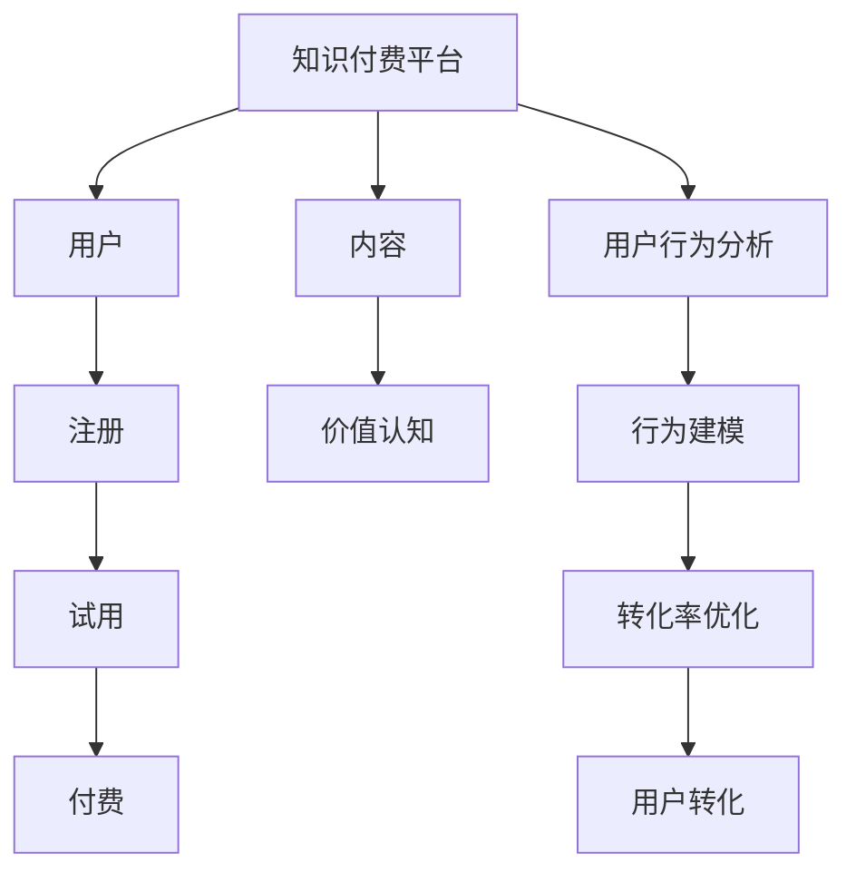

                 

# 知识付费创业中的用户转化策略

> 关键词：知识付费,用户转化,用户行为分析,转化率优化,心理博弈,行为经济学,用户旅程

## 1. 背景介绍

### 1.1 问题由来
在互联网+时代，知识付费成为一种新兴的商业模式。在线教育、音频课程、图文资讯、职业培训等各种形式的付费内容层出不穷。这些付费内容依赖于庞大的用户基础，如何吸引用户注册并转化成为付费用户，成为一个关键问题。

### 1.2 问题核心关键点
知识付费创业中的用户转化，是一个涉及心理、行为经济学、市场营销等多学科的复杂问题。核心关键点在于如何构建用户对知识付费内容的价值认知，并通过精准的用户行为分析和心理博弈策略，提升用户的注册与付费转化率。

### 1.3 问题研究意义
通过优化知识付费平台的用户转化策略，不仅有助于提升平台的盈利能力，更能推动知识传播和用户的学习行为，实现知识共享的良性循环。

## 2. 核心概念与联系

### 2.1 核心概念概述

为更好地理解知识付费平台的用户转化策略，本节将介绍几个关键概念：

- **知识付费 (Knowledge-based Subscription Model)**：指用户通过支付一定费用，获取高质量知识内容和服务，常见的形式包括在线课程、音频图书、专业文章等。
- **用户转化 (User Conversion)**：指用户从潜在客户转变为付费客户的过程，通常包括注册、试用、付费等关键步骤。
- **用户行为分析 (User Behavior Analysis)**：通过数据分析和建模技术，揭示用户行为背后的模式和动因，为转化策略提供数据支撑。
- **转化率优化 (Conversion Rate Optimization, CRO)**：通过数据驱动的优化手段，提高平台的用户注册和付费转化率。
- **心理博弈 (Psychological Tactics)**：利用用户心理特征，设计用户转化策略，增强用户体验，引导用户行为。
- **行为经济学 (Behavioral Economics)**：研究人们如何通过决策与决策产生的经济行为，应用于产品设计、市场推广等领域。
- **用户旅程 (User Journey)**：描述用户在接触、使用、反馈平台过程中的情感和行为变化，帮助优化用户体验，提升用户满意度。

这些核心概念之间存在密切联系，共同构成了知识付费平台用户转化的理论基础和实践框架。通过理解这些概念，我们可以更好地把握用户转化的内在机制，并构建有效的转化策略。

### 2.2 核心概念原理和架构的 Mermaid 流程图



这个流程图展示了用户与知识付费平台之间的转化路径：

1. 用户接触到知识付费平台。
2. 注册并成为平台会员。
3. 体验平台提供的内容。
4. 完成支付，成为付费用户。

在这个过程中，用户行为分析、价值认知、行为建模、转化率优化和心理博弈策略都发挥着重要作用，共同驱动用户的最终转化。

## 3. 核心算法原理 & 具体操作步骤
### 3.1 算法原理概述

知识付费平台的用户转化，本质上是一个用户行为预测和干预的过程。其核心算法原理主要包括用户行为分析、价值认知建模、转化率优化等。

- **用户行为分析**：通过数据分析技术，揭示用户注册、使用、付费等关键行为背后的模式和动因。
- **价值认知建模**：构建用户对知识内容价值的认知模型，帮助平台精准推荐和定价。
- **转化率优化**：通过精准的用户行为分析，设计优化策略，提高用户的注册、试用和付费转化率。

这些算法原理相互配合，形成了知识付费平台用户转化的核心模型。

### 3.2 算法步骤详解

以下以一个具体的用户转化流程为例，详细讲解知识付费平台的用户转化算法步骤：

**Step 1: 用户行为数据收集**
- 收集用户在平台上的行为数据，包括浏览记录、点击行为、注册信息、支付记录等。
- 通过数据清洗和预处理，去除噪音数据，保留有效的用户行为特征。

**Step 2: 用户行为建模**
- 采用统计分析和机器学习技术，对用户行为进行建模。例如，可以建立用户的兴趣模型，描述用户在内容上的偏好和行为模式。
- 可以使用协同过滤、基于内容的推荐、深度学习等方法，挖掘用户行为中的潜在模式。

**Step 3: 价值认知建模**
- 通过用户行为数据，构建用户对知识内容的价值认知模型。例如，可以使用逻辑回归、支持向量机、神经网络等算法，分析用户对内容的质量、难度、适用性的评价。
- 通过价值认知模型，平台可以更准确地推荐相关内容，提升用户的满意度和转化意愿。

**Step 4: 转化率优化**
- 基于用户行为分析和价值认知建模，设计优化策略。例如，可以使用A/B测试，评估不同页面布局、广告文案对用户转化的影响。
- 使用多臂老虎机算法，根据不同用户群体的行为特征，动态调整推荐策略，提高转化率。

**Step 5: 心理博弈策略**
- 利用用户心理特征，设计转化策略。例如，使用稀缺性和紧迫感，吸引用户注册和付费；通过社会认同原理，增强用户对社区的归属感，提高留存率。
- 使用情境影响力，通过环境改变用户的决策过程，促进转化。

### 3.3 算法优缺点

知识付费平台的用户转化算法具有以下优点：
1. 科学性和可操作性强。通过数据驱动的分析和建模，转化策略具有较高的科学性和可操作性。
2. 策略效果可量化。转化率优化过程可以通过量化指标（如注册率、转化率）来评估效果，便于持续优化。
3. 动态调整能力强。用户行为和偏好随时变化，算法能够实时调整推荐策略，保持最佳效果。

同时，该算法也存在一些局限性：
1. 依赖数据质量。用户行为数据的质量直接影响算法的效果，数据噪音、不完整等问题可能导致模型偏差。
2. 模型复杂度高。高维度的行为数据和复杂的用户认知模型，增加了算法的计算复杂度和实现难度。
3. 策略依赖性大。用户转化策略的效果很大程度上取决于策略的设计和执行，策略不当可能导致反效果。

### 3.4 算法应用领域

基于知识付费平台的用户转化算法，已经在多个应用领域得到广泛应用，例如：

- 在线教育平台：通过精准的用户推荐和价值认知建模，提升课程的注册率和付费转化率。
- 专业培训网站：通过行为分析，优化课程设计，提高学员的学习效果和续费率。
- 财经资讯订阅服务：通过行为分析，提升用户的订阅率和续订率，增强平台的长期价值。
- 技术社区平台：通过心理博弈策略，吸引用户参与内容创作和知识共享，提升社区的活跃度。

## 4. 数学模型和公式 & 详细讲解 & 举例说明

### 4.1 数学模型构建

知识付费平台的用户转化算法模型，通常包括以下几个关键模块：

- 用户行为数据收集与清洗模块。
- 用户行为建模模块。
- 价值认知建模模块。
- 转化率优化模块。
- 心理博弈策略模块。

数学模型主要分为两个部分：
1. **用户行为建模**：描述用户行为与行为特征之间的关系，例如，使用线性回归、逻辑回归、随机森林等模型。
2. **价值认知建模**：描述用户对知识内容的价值认知，例如，使用分类算法、神经网络等模型。

### 4.2 公式推导过程

以用户行为建模为例，假设有用户行为数据 $X = \{(x_1, y_1), (x_2, y_2), ..., (x_n, y_n)\}$，其中 $x_i$ 为用户行为特征， $y_i$ 为行为结果（如注册、付费等）。

假设 $f$ 为行为建模函数，目标为最小化损失函数 $L$：

$$
L(f) = \sum_{i=1}^n \ell(y_i, f(x_i))
$$

其中，$\ell$ 为损失函数，通常为均方误差或交叉熵等。

根据数据，求解最优函数 $f$：

$$
\hat{f} = \mathop{\arg\min}_{f} L(f)
$$

这可以通过最小二乘法、梯度下降法等优化算法求解。

### 4.3 案例分析与讲解

以在线教育平台的用户注册转化为例，用户注册行为可以表示为：

- 特征：用户浏览的课程、阅读的笔记、观看的视频、注册的页面等。
- 目标：用户注册为付费用户。

使用逻辑回归模型，可以表示为：

$$
\hat{y_i} = sigmoid(\hat{\theta}^T x_i)
$$

其中 $\hat{y_i}$ 为注册转化的概率，$x_i$ 为用户行为特征向量，$\hat{\theta}$ 为模型参数。

通过逻辑回归模型，可以预测用户注册转化的概率，从而设计针对性的转化策略。例如，针对高转化概率的用户，设计推荐特定课程和优惠活动，吸引其付费注册。

## 5. 项目实践：代码实例和详细解释说明
### 5.1 开发环境搭建

在进行用户转化策略的开发前，需要准备好开发环境。以下是使用Python进行机器学习开发的环境配置流程：

1. 安装Anaconda：从官网下载并安装Anaconda，用于创建独立的Python环境。
2. 创建并激活虚拟环境：
```bash
conda create -n conversion-env python=3.8 
conda activate conversion-env
```
3. 安装必要的库：
```bash
pip install pandas numpy scikit-learn tensorflow pytorch
```

完成上述步骤后，即可在`conversion-env`环境中开始用户转化策略的开发。

### 5.2 源代码详细实现

下面我们以在线教育平台的用户注册转化为例，给出使用机器学习对用户行为进行建模的PyTorch代码实现。

```python
import pandas as pd
import numpy as np
from sklearn.model_selection import train_test_split
from sklearn.linear_model import LogisticRegression
import torch
from torch import nn, optim
from sklearn.preprocessing import StandardScaler

# 加载数据
data = pd.read_csv('user_data.csv')

# 数据清洗与预处理
features = ['浏览课程', '阅读笔记', '观看视频', '注册页面']
target = '注册转化'

X = data[features]
y = data[target]

X = pd.get_dummies(X, columns=['浏览课程', '阅读笔记', '观看视频', '注册页面'], prefix_sep='_')
X = X.dropna()

# 标准化数据
scaler = StandardScaler()
X = scaler.fit_transform(X)

# 划分数据集
X_train, X_test, y_train, y_test = train_test_split(X, y, test_size=0.2, random_state=42)

# 构建模型
class LogisticRegressionModel(nn.Module):
    def __init__(self):
        super(LogisticRegressionModel, self).__init__()
        self.linear = nn.Linear(X.shape[1], 1)
    
    def forward(self, x):
        x = self.linear(x)
        return torch.sigmoid(x)

# 训练模型
model = LogisticRegressionModel()
optimizer = optim.Adam(model.parameters(), lr=0.01)
loss_fn = nn.BCELoss()

model.train()
for epoch in range(10):
    optimizer.zero_grad()
    output = model(X_train)
    loss = loss_fn(output, torch.tensor(y_train, dtype=torch.float))
    loss.backward()
    optimizer.step()

# 评估模型
model.eval()
with torch.no_grad():
    y_pred = (model(X_test) > 0).float()
    accuracy = (y_pred == torch.tensor(y_test, dtype=torch.float)).sum().item() / len(y_test)
    print(f'Accuracy: {accuracy:.3f}')
```

### 5.3 代码解读与分析

让我们再详细解读一下关键代码的实现细节：

**数据加载与预处理**：
- 使用Pandas库加载用户行为数据，选择注册转化作为目标变量。
- 对用户行为特征进行独热编码，构建特征矩阵。
- 使用StandardScaler对数据进行标准化处理，避免特征尺度不一致对模型性能的影响。

**模型训练**：
- 定义逻辑回归模型，使用Pandas库的独热编码功能。
- 使用PyTorch的Adam优化器和BCE损失函数，训练模型。
- 在训练过程中，使用小批量随机梯度下降法更新模型参数，每轮迭代后计算损失函数和准确率。

**模型评估**：
- 使用模型对测试集进行预测，计算预测准确率。
- 通过打印输出，显示模型评估结果。

可以看到，这段代码实现了对用户行为进行逻辑回归建模的全流程，包括数据加载、预处理、模型训练和评估。开发者可以根据具体需求，选择不同的模型和优化方法，实现高效的转化策略。

## 6. 实际应用场景
### 6.1 在线教育平台

在线教育平台通过精准推荐和价值认知建模，提升课程的注册率和付费转化率。具体而言，平台可以构建用户行为数据，包括浏览历史、观看时长、作业完成情况等，结合课程质量、难度、适用性等因素，进行价值认知建模。通过逻辑回归、支持向量机等算法，预测用户注册转化的概率，设计推荐和定价策略。

例如，针对浏览某一课程时长较长的用户，可以推送相关课程的优惠信息，促使其注册并付费。同时，平台可以通过A/B测试，评估不同推荐策略的效果，持续优化转化策略。

### 6.2 专业培训网站

专业培训网站通过用户行为分析，优化课程设计，提高学员的学习效果和续费率。例如，平台可以收集学员的登录频率、学习时长、互动行为等数据，使用K近邻算法、随机森林等方法，构建学员的兴趣模型。根据兴趣模型，推荐适合的培训课程，提高学习效果。同时，平台可以通过行为分析，预测学员的续费意愿，设计针对性的续费策略。

例如，对于经常登录但学习时长较短的用户，可以推送提醒和激励措施，促进其持续学习并续费。

### 6.3 财经资讯订阅服务

财经资讯订阅服务通过行为分析，提升用户的订阅率和续订率，增强平台的长期价值。平台可以收集用户的浏览记录、搜索关键词、订阅内容等数据，使用协同过滤、聚类分析等方法，构建用户兴趣模型。根据兴趣模型，推荐相关财经资讯，提高用户粘性。同时，平台可以通过价值认知建模，预测用户的续费意愿，设计续费策略。

例如，对于订阅内容较少但互动活跃的用户，可以推送更多相关内容，增强用户对平台的依赖性，促进续费。

### 6.4 未来应用展望

随着用户转化策略的不断发展，未来的应用将更加多样化和精准化。

1. **多模态数据融合**：未来的用户行为数据将不仅仅包括文本数据，还包括图像、音频、视频等多模态数据。通过多模态数据的融合，可以构建更全面、准确的用户行为模型。例如，平台可以通过视频观看记录和语音交互数据，预测用户的注册和付费行为。

2. **实时化数据分析**：未来的用户转化策略将更加注重实时数据分析，通过实时监测用户行为，及时调整转化策略。例如，平台可以通过实时监控用户登录行为，预测用户的注册意愿，设计动态推荐策略。

3. **个性化推荐算法**：未来的用户转化策略将更加注重个性化推荐算法，通过深入分析用户兴趣和行为，提供定制化的内容推荐。例如，平台可以使用深度学习模型，如自适应神经网络、多任务学习等，提高推荐精度。

4. **跨平台协同转化**：未来的用户转化策略将更加注重跨平台协同转化，通过多平台联动，提升整体转化率。例如，平台可以在移动端和PC端进行联动，设计跨平台的转化策略。

## 7. 工具和资源推荐
### 7.1 学习资源推荐

为了帮助开发者系统掌握用户转化策略的理论基础和实践技巧，这里推荐一些优质的学习资源：

1. **《User Behavior Analysis and Prediction》书籍**：详细介绍了用户行为分析的方法和技术，涵盖行为建模、预测、推荐等领域。
2. **《Customer Conversion Rate Optimization》课程**：Coursera上的在线课程，由知名专家讲授，涵盖CRO的策略、工具和实践技巧。
3. **《Behavioral Economics in Marketing》视频**：Khan Academy的视频课程，讲解行为经济学在营销中的应用，有助于理解用户心理特征。
4. **《Machine Learning for Conversion Rate Optimization》文章**：相关领域的学术论文，介绍了机器学习在CRO中的应用，包含具体算法和案例分析。
5. **《User Journey Mapping and Design》文章**：讲解用户旅程映射的方法和工具，提升用户体验，优化转化策略。

通过对这些资源的学习实践，相信你一定能够快速掌握用户转化策略的精髓，并用于解决实际的商业问题。

### 7.2 开发工具推荐

高效的开发离不开优秀的工具支持。以下是几款用于用户转化策略开发的常用工具：

1. **Python**：数据科学和机器学习的强大语言，拥有丰富的开源库和工具。
2. **Pandas**：数据处理和分析的必备库，支持大规模数据集的处理和分析。
3. **Scikit-learn**：机器学习库，提供丰富的分类、回归、聚类算法，支持高效建模。
4. **TensorFlow**：深度学习框架，支持分布式计算和高效模型训练。
5. **PyTorch**：深度学习框架，支持动态计算图和高效模型构建。
6. **Jupyter Notebook**：交互式编程环境，方便数据分析和模型调试。

合理利用这些工具，可以显著提升用户转化策略的开发效率，加快创新迭代的步伐。

### 7.3 相关论文推荐

用户转化策略的研究源于学界的持续研究。以下是几篇奠基性的相关论文，推荐阅读：

1. **《Predicting User Conversion Rate in Online Retail Using Machine Learning》**：详细介绍了机器学习在用户转化率预测中的应用，涵盖数据收集、特征工程、模型选择等方面。
2. **《Behavioral Engineering for User Conversion: Designing Experiments in Conversion Optimization》**：讲解了行为工程学在用户转化中的作用，包含心理学和设计思维的应用。
3. **《A Survey of Conversion Rate Optimization: Methodologies and Tools》**：综述了CRO领域的方法和工具，涵盖A/B测试、多臂老虎机算法、推荐系统等技术。
4. **《Cross-Platform User Retention Modeling》**：通过多平台协同数据建模，提升用户留存率。
5. **《Adaptive Nearest Neighbor Recommendations》**：通过自适应近邻算法，提高推荐精度，提升用户转化率。

这些论文代表了大数据时代用户转化策略的发展脉络。通过学习这些前沿成果，可以帮助研究者把握学科前进方向，激发更多的创新灵感。

## 8. 总结：未来发展趋势与挑战
### 8.1 总结

本文对知识付费平台的用户转化策略进行了全面系统的介绍。首先阐述了用户转化的核心概念和关键点，明确了用户转化的内在机制和重要性。其次，从原理到实践，详细讲解了用户转化的数学模型和具体算法步骤，给出了用户转化策略的完整代码实例。同时，本文还广泛探讨了用户转化策略在多个领域的应用前景，展示了其巨大的潜力。最后，精选了用户转化策略的学习资源和工具，力求为开发者提供全方位的技术指引。

通过本文的系统梳理，可以看到，用户转化策略在知识付费平台中具有重要的实践意义，它不仅能提升平台盈利能力，还能促进知识传播和用户学习，实现知识共享的良性循环。未来，伴随算法的不断演进和工具的持续优化，用户转化策略将变得更加精准和高效，为知识付费平台的商业成功提供重要保障。

### 8.2 未来发展趋势

展望未来，用户转化策略将呈现以下几个发展趋势：

1. **数据驱动的决策**：未来的用户转化策略将更加依赖数据驱动的决策，通过实时数据监测和分析，快速调整优化策略，提升转化率。
2. **个性化推荐的深化**：通过深度学习和多任务学习等技术，实现更高精度的个性化推荐，提升用户满意度和转化意愿。
3. **跨平台协同优化**：通过多平台联动，提升整体转化率，增强用户粘性。
4. **多模态数据融合**：通过多模态数据的融合，构建更全面、准确的用户行为模型，提升转化效果。
5. **行为经济学与社会心理学的结合**：通过结合行为经济学和社会心理学，设计更加科学、合理的转化策略，提高用户参与度。

这些趋势展示了用户转化策略的未来发展方向，预示着该策略将在商业应用中发挥越来越重要的作用。

### 8.3 面临的挑战

尽管用户转化策略已经取得了显著成效，但在迈向更加智能化、普适化应用的过程中，仍面临诸多挑战：

1. **数据质量和隐私问题**：用户行为数据的质量和隐私保护问题，一直是用户转化策略中的重要挑战。数据噪音、数据泄露等问题可能影响转化效果，甚至引发法律风险。
2. **算法复杂度与计算资源**：高维度的行为数据和多模态数据的融合，增加了算法的复杂度和计算资源的需求，需要在算法优化和资源管理上不断努力。
3. **策略执行与用户接受度**：转化策略的执行可能遭遇用户抵触，需要通过不断优化策略，提升用户体验，增强用户信任和接受度。
4. **跨平台协同转化的复杂性**：多平台协同转化需要考虑不同平台的用户行为和偏好差异，设计统一的转化策略，面临复杂的管理和协调问题。

这些挑战需要在理论和实践中进行深入研究和不断优化，才能实现用户转化策略的最佳效果。

### 8.4 研究展望

面对用户转化策略所面临的挑战，未来的研究需要在以下几个方面寻求新的突破：

1. **数据隐私保护技术**：研究高效的数据隐私保护技术，保护用户隐私的同时，确保数据的有效利用。
2. **多模态数据融合算法**：开发更加高效的多模态数据融合算法，提升数据质量和转化效果。
3. **策略执行的个性化设计**：通过个性化设计和动态调整，提升用户转化策略的接受度和效果。
4. **跨平台协同优化策略**：研究跨平台协同优化的有效策略，实现多平台联动，提升整体转化率。
5. **用户行为与心理特征的结合**：结合用户行为和心理特征，设计更加科学合理的转化策略，提高用户参与度和满意度。

这些研究方向的探索，必将引领用户转化策略的进一步优化和创新，为知识付费平台带来更加智能、高效的用户转化策略，推动其商业成功和用户满意度的提升。

## 9. 附录：常见问题与解答

**Q1：用户转化策略与用户流失策略有哪些区别？**

A: 用户转化策略和用户流失策略，是用户生命周期管理中的两个重要组成部分。用户转化策略旨在将潜在用户转变为付费用户，而用户流失策略则旨在阻止已有用户的流失。两者虽然目标相反，但都是基于用户行为分析和心理博弈，通过优化策略，提升用户体验，实现用户管理的双赢。

**Q2：用户转化策略中的A/B测试有哪些注意事项？**

A: 用户转化策略中的A/B测试，需要注意以下几个方面：
1. 样本量：确保样本量足够大，以获得具有统计显著性的结果。
2. 时间跨度：确保测试时间跨度足够长，避免短期波动影响结果。
3. 指标选择：选择具有实际意义和可操作性的转化指标，如注册率、付费率等。
4. 随机性：确保测试组和对照组随机分配，避免偏差影响结果。
5. 数据分析：进行严格的统计分析，避免结果误判和误导。

**Q3：用户转化策略中的推荐算法有哪些？**

A: 用户转化策略中的推荐算法，包括以下几种：
1. 协同过滤算法：通过用户行为数据，发现相似用户群体，推荐相关内容。
2. 基于内容的推荐算法：通过内容特征，推荐与用户兴趣相关的其他内容。
3. 深度学习推荐算法：如自适应神经网络、多任务学习等，通过深度学习模型，提高推荐精度。

**Q4：用户转化策略中的数据清洗有哪些常见方法？**

A: 用户转化策略中的数据清洗，主要包括以下几种方法：
1. 去除噪音数据：通过数据预处理，去除缺失值、异常值等噪音数据。
2. 标准化数据：通过标准化处理，消除数据尺度差异，提高模型性能。
3. 数据归一化：通过归一化处理，将数据映射到统一范围，便于算法处理。
4. 特征选择：通过特征选择，去除冗余和无关特征，提高模型效率。
5. 数据增强：通过数据增强，扩充训练数据集，提高模型泛化能力。

这些方法可以结合使用，根据具体场景进行优化，提升数据质量和转化效果。

**Q5：用户转化策略中的多臂老虎机算法有哪些优点？**

A: 用户转化策略中的多臂老虎机算法，具有以下优点：
1. 动态优化：通过动态调整模型参数，实现实时优化，提高转化率。
2. 资源利用：通过多臂分配，优化资源利用效率，提升用户体验。
3. 参数高效：通过固定部分参数，只调整关键参数，减少模型训练时间。
4. 鲁棒性强：通过随机策略和控制参数，提高算法的鲁棒性和稳定性。

这些优点使得多臂老虎机算法在用户转化策略中具有广泛应用价值。

---

作者：禅与计算机程序设计艺术 / Zen and the Art of Computer Programming

