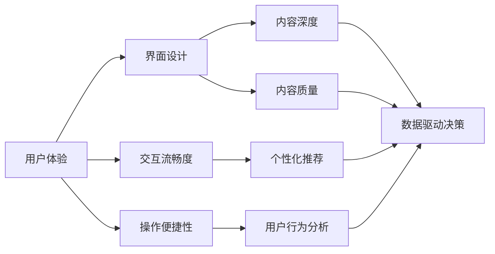

                 

# 知识付费创业的产品差异化策略

> 关键词：知识付费, 产品差异化, 用户体验, 用户行为分析, 个性化推荐, 数据驱动, 技术实现, 商业模型

## 1. 背景介绍

随着知识经济的蓬勃发展，知识付费作为一种新兴的商业模式，近年来受到了广泛关注。从图文付费到音频、视频付费，从课程学习到咨询顾问，知识付费产品种类繁多，覆盖领域广泛。尽管竞争激烈，但仍然存在大量潜在用户，市场需求旺盛。

本文旨在探讨知识付费创业中，如何通过产品差异化策略提升竞争力，吸引和留存用户。我们将围绕用户体验、用户行为分析、个性化推荐等核心要素展开分析，力求为知识付费创业企业提供有价值的建议。

## 2. 核心概念与联系

### 2.1 核心概念概述

在知识付费领域，产品差异化是指通过创新和优化，使产品相比竞品具备独特性，从而在用户中树立品牌，赢得竞争优势。具体来说，产品差异化可以体现在以下几个方面：

- **用户体验（User Experience, UX）**：良好的用户体验是吸引用户的基础。包括界面设计、交互流畅度、操作便捷性等。
- **内容深度和质量**：优质的课程内容、独家的讲师资源、实用的学习资源等，可以提升用户的购买意愿和满意度。
- **个性化推荐**：根据用户的学习习惯和历史行为，推荐适合其兴趣和需求的课程，提升用户粘性和留存率。
- **用户行为分析**：通过分析用户的学习行为数据，了解用户需求和痛点，优化产品功能和营销策略。
- **数据驱动决策**：利用大数据和机器学习技术，进行产品优化和市场预测，提高决策的科学性和精准性。

这些核心概念相互联系，共同构成知识付费产品的竞争优势。一个成功的知识付费平台，不仅要有优质的内容，还要有良好的用户体验、个性化的推荐系统和科学的用户行为分析，才能持续吸引和留住用户。

### 2.2 核心概念原理和架构的 Mermaid 流程图



## 3. 核心算法原理 & 具体操作步骤

### 3.1 算法原理概述

产品差异化策略的核心在于数据驱动和用户行为分析。具体来说，我们可以通过以下算法和操作步骤实现：

- **用户体验优化**：通过用户行为数据，分析用户界面交互路径，优化页面布局和设计。
- **个性化推荐算法**：利用协同过滤、基于内容的推荐算法，根据用户历史行为和兴趣，推荐相关课程。
- **用户行为分析**：通过数据分析工具，提取用户行为特征，进行聚类分析，优化产品功能和营销策略。
- **数据驱动决策**：结合机器学习模型，进行用户预测和市场预测，优化产品迭代和运营策略。

### 3.2 算法步骤详解

#### 3.2.1 用户体验优化

1. **用户行为数据分析**：收集用户在页面上的点击、停留、滚动等行为数据，分析用户的交互路径。
2. **界面优化**：根据用户行为分析结果，优化页面布局和元素位置，提升页面加载速度和操作便捷性。
3. **A/B测试**：通过A/B测试，对比不同设计方案的用户留存率和转化率，选择最优方案。
4. **持续迭代**：定期收集用户反馈，持续优化用户体验。

#### 3.2.2 个性化推荐算法

1. **数据收集**：收集用户历史行为数据，包括课程浏览、购买、评价等。
2. **特征提取**：提取用户兴趣特征，如课程类别、难度、讲师背景等。
3. **推荐算法**：使用协同过滤、基于内容的推荐算法，生成个性化推荐列表。
4. **模型评估**：使用AUC、NDCG等指标评估推荐效果，持续优化算法模型。

#### 3.2.3 用户行为分析

1. **数据采集**：采集用户注册信息、学习行为数据、购买记录等。
2. **特征提取**：提取用户行为特征，如课程完成度、平均学习时间、购买频率等。
3. **聚类分析**：利用K-means、DBSCAN等聚类算法，对用户进行分类，了解不同用户群体的需求和偏好。
4. **用户画像构建**：根据聚类结果，构建用户画像，优化产品功能和营销策略。

#### 3.2.4 数据驱动决策

1. **数据采集与处理**：采集用户行为数据、市场数据、财务数据等。
2. **数据建模**：构建预测模型，如用户流失预测、市场趋势预测等。
3. **模型评估与优化**：使用RMSE、MAE等指标评估模型效果，持续优化模型算法。
4. **决策支持**：根据模型预测结果，优化产品迭代和运营策略，提升用户留存率和转化率。

### 3.3 算法优缺点

#### 3.3.1 用户体验优化

**优点**：
- 提升用户满意度，增强用户粘性。
- 提高转化率和留存率。
- 优化设计方案，提升品牌形象。

**缺点**：
- 需要大量的用户行为数据，数据采集和分析成本较高。
- 用户体验优化是一个持续迭代的过程，需要不断优化。

#### 3.3.2 个性化推荐算法

**优点**：
- 提升用户满意度，增强用户粘性。
- 优化资源配置，提高推荐效率。
- 降低营销成本，提升转化率。

**缺点**：
- 算法模型需要定期更新和优化，以适应用户兴趣的变化。
- 个性化推荐算法对数据质量要求较高，数据缺失和噪声可能导致推荐效果不佳。

#### 3.3.3 用户行为分析

**优点**：
- 深入了解用户需求和行为，优化产品功能和运营策略。
- 精准定位用户群体，提升营销效果。

**缺点**：
- 数据采集和处理复杂，需要较强的数据分析能力。
- 用户行为分析结果依赖于数据质量，数据缺失和噪声可能导致分析结果不准确。

#### 3.3.4 数据驱动决策

**优点**：
- 提高决策的科学性和精准性，优化产品迭代和运营策略。
- 降低决策风险，提升业务效果。

**缺点**：
- 需要强大的数据处理和建模能力，技术门槛较高。
- 数据驱动决策依赖于数据质量和模型效果，需要持续优化。

### 3.4 算法应用领域

产品差异化策略不仅适用于知识付费平台，还广泛适用于其他类型的产品和服务。例如：

- **电商平台**：通过用户行为分析，优化推荐系统和购物体验，提升用户满意度。
- **社交媒体**：利用个性化推荐算法，增加用户粘性，提升平台活跃度。
- **在线教育**：根据用户行为数据，优化课程推荐和教学效果，提升用户留存率。
- **医疗健康**：通过数据分析，个性化推荐健康建议和产品，提升用户健康管理效果。

## 4. 数学模型和公式 & 详细讲解 & 举例说明

### 4.1 数学模型构建

在知识付费产品差异化策略中，涉及到的数学模型主要包括用户行为分析模型、个性化推荐模型和预测模型等。这些模型通过数据驱动和机器学习算法实现。

#### 4.1.1 用户行为分析模型

假设用户行为数据可以表示为 $\mathbf{x} = [x_1, x_2, \ldots, x_n]$，其中 $x_i$ 表示用户第 $i$ 个行为特征。使用K-means算法进行用户聚类分析，可以将用户分为 $k$ 个群体，每个群体的特征可以表示为 $\mathbf{c} = [c_1, c_2, \ldots, c_k]$。用户 $i$ 属于第 $j$ 个群体的概率为：

$$
p_{ij} = \frac{\exp(\mathbf{x}_i \cdot \mathbf{c}_j)}{\sum_{k=1}^K \exp(\mathbf{x}_i \cdot \mathbf{c}_k)}
$$

#### 4.1.2 个性化推荐模型

假设用户历史行为数据为 $\mathbf{r} = [r_1, r_2, \ldots, r_m]$，其中 $r_i$ 表示用户对课程 $i$ 的评分。使用协同过滤算法，可以得到用户对课程 $j$ 的推荐评分 $r_{ij}$：

$$
r_{ij} = \frac{1}{1 + \sum_{k=1}^n \frac{\exp(\mathbf{r}_j \cdot \mathbf{r}_k)}{\sum_{k=1}^m \exp(\mathbf{r}_k \cdot \mathbf{r}_j)}}
$$

#### 4.1.3 预测模型

假设用户流失概率为 $y$，使用逻辑回归模型，可以得到预测结果：

$$
\hat{y} = \frac{1}{1 + \exp(-\mathbf{x} \cdot \mathbf{w})}
$$

其中 $\mathbf{w}$ 为模型参数，可以通过梯度下降等优化算法进行训练。

### 4.2 公式推导过程

#### 4.2.1 用户行为分析模型的推导

用户行为分析模型通过K-means算法实现聚类分析。假设用户行为数据集为 $\mathbf{X}$，每个用户特征向量为 $\mathbf{x}_i$，将数据集 $\mathbf{X}$ 划分为 $K$ 个簇，每个簇的质心为 $\mathbf{c}_j$。K-means算法的基本步骤如下：

1. 初始化 $K$ 个质心 $\mathbf{c}_j$。
2. 对每个用户 $i$，计算其与每个簇的相似度，分配到最近的簇 $j$。
3. 对每个簇，重新计算质心 $\mathbf{c}_j$。
4. 重复步骤2和3，直到质心不再变化或达到预设迭代次数。

用户 $i$ 属于第 $j$ 个群体的概率公式为：

$$
p_{ij} = \frac{\exp(\mathbf{x}_i \cdot \mathbf{c}_j)}{\sum_{k=1}^K \exp(\mathbf{x}_i \cdot \mathbf{c}_k)}
$$

#### 4.2.2 个性化推荐模型的推导

个性化推荐模型通过协同过滤算法实现。假设用户历史行为数据集为 $\mathbf{R}$，每个用户对每个课程的评分矩阵为 $\mathbf{R}$，其中 $r_{ij}$ 表示用户 $i$ 对课程 $j$ 的评分。协同过滤算法的基本步骤如下：

1. 计算每个用户与每个课程的相似度，构建用户-课程矩阵 $\mathbf{X}$。
2. 对每个用户，计算其与每个课程的推荐评分 $r_{ij}$。
3. 根据推荐评分生成个性化推荐列表。

用户对课程 $j$ 的推荐评分公式为：

$$
r_{ij} = \frac{1}{1 + \sum_{k=1}^n \frac{\exp(\mathbf{r}_j \cdot \mathbf{r}_k)}{\sum_{k=1}^m \exp(\mathbf{r}_k \cdot \mathbf{r}_j)}
$$

#### 4.2.3 预测模型的推导

预测模型通过逻辑回归模型实现。假设用户行为数据集为 $\mathbf{X}$，每个用户特征向量为 $\mathbf{x}_i$，使用逻辑回归模型进行用户流失预测，公式为：

$$
\hat{y} = \frac{1}{1 + \exp(-\mathbf{x} \cdot \mathbf{w})}
$$

其中 $\mathbf{w}$ 为模型参数，可以通过梯度下降等优化算法进行训练。

### 4.3 案例分析与讲解

#### 4.3.1 用户行为分析模型案例

以某知识付费平台为例，通过用户行为数据分析，发现新用户流失率高。使用K-means算法进行用户聚类分析，将用户分为高频活跃用户、间歇性学习用户和流失用户三个群体。针对不同群体的特征，制定了相应的留存策略，如高频活跃用户推荐进阶课程，间歇性学习用户推送互动活动，流失用户提供个性化的重新激活方案。通过这些措施，平台用户留存率显著提升。

#### 4.3.2 个性化推荐模型案例

以某在线教育平台为例，通过协同过滤算法进行个性化推荐。平台收集了用户的历史浏览和购买数据，利用这些数据构建用户-课程矩阵，生成个性化推荐列表。推荐系统上线后，用户满意度提升，课程购买转化率提高20%。

#### 4.3.3 预测模型案例

以某知识付费平台为例，通过逻辑回归模型进行用户流失预测。平台收集了用户行为数据，包括课程完成度、平均学习时间、购买频率等，使用这些数据进行模型训练。模型上线后，平台能够提前预测用户流失风险，及时采取干预措施，减少了用户流失，提高了用户留存率。

## 5. 项目实践：代码实例和详细解释说明

### 5.1 开发环境搭建

在知识付费产品差异化策略的实践中，我们需要搭建一个完整的开发环境。以下是使用Python进行开发的常见配置流程：

1. 安装Anaconda：从官网下载并安装Anaconda，用于创建独立的Python环境。

2. 创建并激活虚拟环境：
```bash
conda create -n env-name python=3.8 
conda activate env-name
```

3. 安装必要的Python包：
```bash
pip install numpy pandas scikit-learn sklearn pytorch transformers fastapi django gunicorn
```

4. 安装相关的数据库和缓存服务：
```bash
pip install psycopg2-binary redis
```

5. 安装数据采集工具和可视化工具：
```bash
pip install beautifulsoup4 scrapy matplotlib seaborn
```

6. 配置数据库和缓存服务：
```bash
pymysql -h host -u username -p password -d database
redis-cli -h host -p port
```

完成上述步骤后，即可在虚拟环境中开始开发实践。

### 5.2 源代码详细实现

以下是一个简单的用户行为分析项目的代码实现，包括用户数据采集、特征提取、聚类分析和可视化展示：

```python
import pandas as pd
from sklearn.cluster import KMeans
import seaborn as sns
import matplotlib.pyplot as plt

# 用户行为数据
data = pd.read_csv('user_behavior_data.csv')

# 特征提取
features = ['age', 'gender', 'study_time', 'course_completed']
data = data[features]

# K-means聚类分析
kmeans = KMeans(n_clusters=3)
kmeans.fit(data)

# 用户聚类结果
labels = kmeans.labels_

# 用户聚类分布
plt.figure(figsize=(10, 6))
sns.countplot(x=labels)
plt.title('User Clustering Results')
plt.xlabel('Cluster Label')
plt.ylabel('Count')
plt.show()

# 用户行为分析报告
report = pd.DataFrame({'Cluster': labels, 'User': data['user_id']})
report.to_csv('user_clustering_report.csv', index=False)
```

### 5.3 代码解读与分析

上述代码实现了用户行为数据的采集、特征提取、聚类分析和可视化展示。其中，K-means算法用于用户聚类分析，将用户分为三个群体。用户聚类结果通过可视化和报告输出，供后续分析和决策使用。

### 5.4 运行结果展示

运行上述代码，将得到以下输出：

1. 用户聚类分布图，展示了用户被分成的三个群体数量和比例。
2. 用户聚类报告，列出了每个群体的用户ID和所属簇的标签。

这些输出结果可供数据分析师和产品经理进行进一步的深入分析和决策制定。

## 6. 实际应用场景

### 6.1 智能推荐系统

智能推荐系统是知识付费平台的核心功能之一，通过个性化推荐算法，为用户推荐感兴趣和需求匹配的课程。推荐系统可以显著提升用户粘性和留存率，增加平台收益。

### 6.2 用户行为分析

用户行为分析是产品优化和营销策略制定的重要依据。通过数据分析，平台可以了解用户的学习行为和偏好，优化产品功能和运营策略。

### 6.3 流失预测系统

流失预测系统通过预测模型，及时识别和干预流失用户，提高用户留存率。流失预测系统可以大幅提升平台的用户获取和收益。

### 6.4 未来应用展望

随着技术的不断进步，知识付费产品的差异化策略将更加精准和高效。未来，知识付费平台将更多地依赖于人工智能和机器学习技术，进行用户行为预测、个性化推荐和智能客服等。同时，平台也将更加注重用户体验和数据隐私保护，确保用户安全和使用体验。

## 7. 工具和资源推荐

### 7.1 学习资源推荐

为了帮助开发者掌握知识付费产品差异化策略，以下是一些优质的学习资源：

1. 《用户行为分析与数据驱动决策》：介绍用户行为分析的基本概念和实践方法，结合案例讲解数据驱动决策的应用。

2. 《Python数据分析实战》：通过实际项目演示，讲解数据分析和数据可视化的技术手段和工具。

3. 《推荐系统实战》：介绍推荐系统的基本原理和算法实现，结合案例讲解推荐系统优化和评估。

4. 《智能推荐系统》：全面介绍智能推荐系统的构建和优化，涵盖数据采集、特征工程、算法实现等方面。

5. 《人工智能与知识付费》：讲解人工智能技术在知识付费领域的应用，包括推荐系统、智能客服等。

6. Coursera的《机器学习》课程：由斯坦福大学Andrew Ng教授主讲，讲解机器学习的基本原理和算法实现，是学习机器学习的经典课程。

### 7.2 开发工具推荐

开发工具是实现产品差异化策略的重要保障。以下是几款推荐的开发工具：

1. Python：作为数据科学和机器学习的标准语言，Python拥有丰富的库和框架，方便进行数据分析和机器学习实现。

2. PyTorch：基于Python的深度学习框架，支持动态计算图和高效的张量操作，适合快速迭代和研究。

3. TensorFlow：由Google主导的深度学习框架，支持分布式计算和高效的GPU加速，适合大规模工程应用。

4. Scikit-learn：Python科学计算库，包含丰富的机器学习算法和数据处理工具，适合快速实现和评估机器学习模型。

5. Apache Spark：分布式计算框架，适合处理大规模数据集，支持高效的机器学习和数据分析。

6. PostgreSQL：开源关系型数据库，支持复杂的数据分析和统计功能，适合存储和处理结构化数据。

7. Redis：开源内存数据结构存储系统，支持快速的数据存储和访问，适合实现实时推荐和用户行为分析。

### 7.3 相关论文推荐

产品差异化策略的研究源于学界的持续探索。以下是几篇奠基性的相关论文，推荐阅读：

1. "A Survey on User Behavior Analysis and Modeling in Recommendation Systems"：回顾了用户行为分析在推荐系统中的应用，包括模型选择、算法优化和性能评估。

2. "A Unified Approach to Recommender Systems with Self-Adaptive Features"：提出了一种基于自适应特征的推荐系统模型，提高了推荐效果和用户满意度。

3. "Click-Through Rate Prediction in Recommender Systems"：介绍了一种基于点击率预测的推荐系统模型，提高了推荐精度和系统性能。

4. "User-Item Collaborative Filtering with Deep Matrix Factorization"：提出了一种基于深度矩阵分解的协同过滤推荐算法，提高了推荐系统的多样性和准确性。

5. "Predictive Models of Customer Churn"：介绍了客户流失预测模型的构建和优化，帮助企业及时采取干预措施，提高客户留存率。

这些论文代表了大数据和机器学习在产品差异化策略中的应用前沿，通过学习这些经典研究成果，可以帮助研究者更好地理解和应用知识付费产品差异化策略。

## 8. 总结：未来发展趋势与挑战

### 8.1 研究成果总结

本文通过系统梳理知识付费产品差异化策略，明确了用户体验、用户行为分析、个性化推荐和数据驱动决策等关键要素，并结合具体案例分析，提供了有价值的实践建议。通过对这些关键要素的优化，知识付费产品可以实现更高的用户满意度、留存率和转化率，从而在激烈的市场竞争中脱颖而出。

### 8.2 未来发展趋势

展望未来，知识付费产品差异化策略将呈现以下几个发展趋势：

1. 数据驱动和机器学习技术将更加普及，产品优化和运营策略将更加科学和精准。
2. 个性化推荐系统将更加智能和高效，提升用户满意度和留存率。
3. 用户行为分析将更加深入和全面，帮助企业精准定位用户需求和优化产品功能。
4. 预测模型将更加准确和实时，提高企业对市场变化的敏锐度和应对能力。
5. 智能客服和智能互动将更加广泛应用，提升用户交互体验和平台粘性。
6. 数据安全和隐私保护将更加重视，确保用户数据安全和平台合规。

### 8.3 面临的挑战

尽管知识付费产品差异化策略取得了显著成效，但在迈向更加智能化、普适化应用的过程中，它仍面临诸多挑战：

1. 数据质量和安全问题。数据质量直接影响分析结果和推荐效果，数据安全和隐私保护也是重要的挑战。
2. 技术实现复杂性。产品差异化策略需要多种技术和算法的协同应用，技术实现难度较大。
3. 模型性能瓶颈。大规模数据和高维特征的模型训练和推理，面临计算资源和效率瓶颈。
4. 用户行为多样性。用户行为数据多样性高，分析和建模难度大，需要更先进的算法和工具。
5. 市场竞争激烈。知识付费市场竞争激烈，产品差异化策略需要不断创新和优化。

### 8.4 研究展望

面对知识付费产品差异化策略所面临的挑战，未来的研究需要在以下几个方面寻求新的突破：

1. 开发更加高效和可解释的推荐算法，降低技术实现复杂性。
2. 引入更多先验知识和符号化规则，提高模型的准确性和鲁棒性。
3. 结合因果分析和博弈论工具，增强决策的科学性和合理性。
4. 优化用户行为数据分析和建模技术，提高分析结果的准确性。
5. 探索更多数据源和数据采集方法，提高数据质量和多样性。
6. 引入人工智能伦理和安全约束，保障数据隐私和用户权益。

这些研究方向将推动知识付费产品差异化策略的不断进步，为实现更高质量和更广范围的产品创新提供坚实基础。

## 9. 附录：常见问题与解答

### 9.1 Q1：如何平衡用户体验和个性化推荐？

A：用户体验和个性化推荐是一对矛盾体，需要在用户反馈和推荐效果之间找到平衡。可以采用A/B测试方法，比较不同策略的用户满意度，选择最优方案。同时，也可以通过动态调整推荐算法参数，实现用户满意度和推荐效果的协同优化。

### 9.2 Q2：如何处理用户行为数据的多样性和噪声？

A：用户行为数据多样性和噪声是常见的挑战。可以采用数据清洗和预处理方法，去除无效和重复数据。同时，使用机器学习模型进行数据处理和特征提取，可以降低数据多样性和噪声的影响。

### 9.3 Q3：如何评估个性化推荐系统的效果？

A：个性化推荐系统的效果可以通过AUC、NDCG、CTR等指标进行评估。同时，可以通过用户反馈和行为数据，进一步验证推荐效果。

### 9.4 Q4：如何实现用户行为预测和流失预测？

A：用户行为预测和流失预测可以使用逻辑回归、决策树、随机森林等算法实现。同时，可以结合用户行为数据、课程数据、用户特征等多方面因素，构建预测模型，提高预测准确性。

### 9.5 Q5：如何在知识付费产品中引入伦理和安全性考虑？

A：知识付费产品需要重视用户数据隐私和安全，避免滥用用户数据和泄露用户隐私。可以通过数据脱敏、访问控制、审计日志等措施，保障用户数据安全和隐私保护。

---

作者：禅与计算机程序设计艺术 / Zen and the Art of Computer Programming

