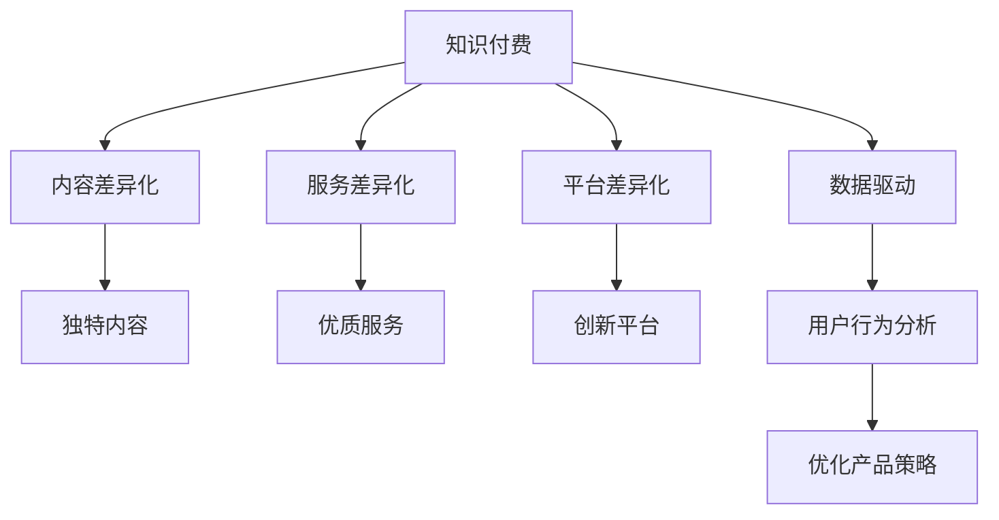

                 

# 知识付费创业的产品差异化策略

在信息技术迅猛发展的今天，知识付费成为新兴的热门领域。不同于传统的线下培训机构或出版社，知识付费平台在内容和形式上更具多样化和灵活性，能够更精准地满足用户需求，实现更高效的传播。然而，随着平台数量的激增，用户选择越来越多，如何在这场“信息海洋”中脱颖而出，实现产品差异化，成为知识付费创业者的核心挑战。

## 1. 背景介绍

### 1.1 问题由来

知识付费行业始于2016年，以罗辑思维、得到等平台的成功作为标志，迅速吸引了大量资本的关注和投入。然而，随着市场逐渐成熟，行业同质化现象越来越明显，用户需求也呈现出多样化、个性化趋势。

为了应对这一挑战，越来越多的创业者和企业开始寻求产品差异化策略，力图在内容、服务、平台等方面打造独特的竞争力。然而，如何准确识别目标用户需求，并通过数据驱动的方式优化产品设计和运营，是一个复杂而多维的问题。

### 1.2 问题核心关键点

产品差异化是指通过创新的产品设计和服务模式，将自身与竞争对手区分开来，从而在用户心中建立起独特的品牌形象和市场定位。对于知识付费产品来说，差异化不仅体现在内容选择上，还涉及到用户体验、互动方式、技术实现等多个层面。

1. **内容差异化**：内容是知识付费的核心，如何在海量知识中提炼最具价值的信息，为用户提供独特且易吸收的内容体验，是差异化的基础。
2. **服务差异化**：除了内容本身，如何设计优质的服务和互动方式，增强用户粘性和满意度，是差异化的重要补充。
3. **平台差异化**：知识付费平台的技术架构和服务功能如何创新，打造独特的用户体验，是差异化的关键。
4. **数据驱动**：通过数据分析挖掘用户需求和行为模式，动态调整产品策略，实现数据驱动的持续优化。

本文将重点讨论如何通过内容、服务、平台和技术四个维度，实现知识付费产品的差异化策略。

## 2. 核心概念与联系

### 2.1 核心概念概述

为了深入理解知识付费产品的差异化策略，我们首先需要明确几个核心概念：

- **知识付费**：通过互联网平台，将知识、技能、经验等以付费形式进行传播和交易，是一种新型教育形式。
- **产品差异化**：通过独特的品牌定位、内容选择、服务和互动方式，将自身与竞争对手区分开来，吸引和留住用户。
- **用户体验**：用户在接触和使用产品过程中的综合感受和满意度，是衡量产品成功与否的重要指标。
- **数据驱动**：利用数据洞察用户行为和需求，持续优化产品策略，提升用户价值和平台竞争力。

这些核心概念之间的关系可以用以下Mermaid流程图来表示：



这个流程图展示了知识付费产品差异化策略的关键路径：

1. 以知识付费为基础，实现内容、服务、平台和数据驱动的多维差异化。
2. 内容差异化通过精选优质内容，满足用户独特需求。
3. 服务差异化通过设计互动方式和优质服务，提升用户体验。
4. 平台差异化通过创新技术架构和功能，打造独特用户体验。
5. 数据驱动通过用户行为分析，优化产品策略，实现持续迭代。

## 3. 核心算法原理 & 具体操作步骤

### 3.1 算法原理概述

知识付费产品的差异化策略，本质上是一个多目标优化问题。我们需要在内容和用户体验之间找到最佳平衡点，以实现最大的用户满意度和市场竞争力。

具体而言，我们可以将产品差异化问题建模为以下多目标优化问题：

- 目标1：最大化内容的独特性和吸引力，提升用户价值。
- 目标2：优化用户体验，提高用户满意度和留存率。
- 目标3：创新平台功能和服务，增强用户粘性和平台竞争力。
- 目标4：通过数据分析，动态调整产品策略，实现持续优化。

我们将通过数据驱动的方式，对上述目标进行优化。具体步骤如下：

1. **内容分析**：通过数据分析挖掘用户偏好和热门主题，选择合适的知识内容和形式。
2. **用户体验优化**：通过用户反馈和行为分析，不断调整产品设计和功能，提升用户体验。
3. **平台创新**：引入前沿技术，创新平台功能和互动方式，打造独特用户体验。
4. **数据驱动**：利用用户行为数据，动态调整产品策略，实现持续优化。

### 3.2 算法步骤详解

#### 3.2.1 内容分析

内容分析是知识付费产品差异化的基础。以下是具体步骤：

1. **用户偏好分析**：通过用户行为数据，如浏览、点击、评分等，分析用户的兴趣偏好和热门主题。
2. **内容选择**：根据用户偏好，选择高质量、独特且有价值的内容。
3. **内容形式创新**：将内容转化为用户易吸收的形式，如视频、音频、图文等。

#### 3.2.2 用户体验优化

用户体验优化是知识付费产品差异化的关键。以下是具体步骤：

1. **用户反馈收集**：通过问卷、评论、互动等渠道，收集用户对内容和服务的反馈。
2. **用户行为分析**：分析用户在平台上的行为数据，识别出热点和痛点。
3. **用户体验设计**：根据用户反馈和行为分析结果，优化产品设计和功能，提升用户体验。

#### 3.2.3 平台创新

平台创新是知识付费产品差异化的核心。以下是具体步骤：

1. **技术引入**：引入前沿技术，如推荐算法、互动技术、区块链等，提升平台功能。
2. **功能设计**：设计独特的平台功能和服务，如社交互动、会员体系、智能推荐等。
3. **用户体验优化**：优化平台的用户体验，提升用户粘性和满意度。

#### 3.2.4 数据驱动

数据驱动是知识付费产品差异化的保障。以下是具体步骤：

1. **数据采集**：全面采集用户行为数据，如浏览记录、交互数据、评分反馈等。
2. **数据分析**：利用机器学习和数据分析技术，挖掘用户行为模式和需求。
3. **策略优化**：根据数据分析结果，动态调整产品策略，实现持续优化。

### 3.3 算法优缺点

知识付费产品的差异化策略具有以下优点：

1. **提升用户满意度**：通过差异化策略，提升用户对内容和服务的满意度，增强用户粘性。
2. **提高市场竞争力**：独特的品牌定位和产品设计，使产品在市场中脱颖而出。
3. **实现持续优化**：数据驱动的方式，能够持续挖掘用户需求，动态调整产品策略。

然而，差异化策略也存在以下缺点：

1. **成本高**：内容精选和平台创新需要大量投入，且难以一蹴而就。
2. **用户需求多样**：不同用户群体的需求差异大，难以全面满足。
3. **市场竞争激烈**：知识付费市场竞争激烈，创新容易被模仿。

### 3.4 算法应用领域

知识付费产品的差异化策略，在多个领域都具有广泛的应用：

1. **教育培训**：通过差异化内容和服务，提升教育效果和用户满意度。
2. **职场发展**：提供职场技能、管理经验等内容，助力职业成长。
3. **生活娱乐**：提供健康、心理、娱乐等内容，提升生活质量。
4. **科技前沿**：提供科技资讯、创新技术等内容，满足用户对前沿知识的渴求。

## 4. 数学模型和公式 & 详细讲解 & 举例说明

### 4.1 数学模型构建

为了更好地理解知识付费产品的差异化策略，我们构建以下数学模型：

设 $x_1, x_2, x_3, x_4$ 分别代表内容差异化、服务差异化、平台差异化和数据驱动的影响，其权重分别为 $a_1, a_2, a_3, a_4$。目标函数为：

$$
\begin{aligned}
\max &\quad a_1 x_1 + a_2 x_2 + a_3 x_3 + a_4 x_4 \\
\text{s.t.} &\quad x_1, x_2, x_3, x_4 \geq 0
\end{aligned}
$$

其中 $a_1, a_2, a_3, a_4$ 为正系数，表示各因素的重要性。

### 4.2 公式推导过程

目标函数可以通过拉格朗日乘数法求解：

设拉格朗日乘子 $\lambda$，构造拉格朗日函数：

$$
\mathcal{L}(x_1, x_2, x_3, x_4, \lambda) = a_1 x_1 + a_2 x_2 + a_3 x_3 + a_4 x_4 - \lambda (x_1 + x_2 + x_3 + x_4 - 1)
$$

对 $x_1, x_2, x_3, x_4$ 求偏导，并令其为零：

$$
\begin{aligned}
\frac{\partial \mathcal{L}}{\partial x_1} &= a_1 - \lambda = 0 \\
\frac{\partial \mathcal{L}}{\partial x_2} &= a_2 - \lambda = 0 \\
\frac{\partial \mathcal{L}}{\partial x_3} &= a_3 - \lambda = 0 \\
\frac{\partial \mathcal{L}}{\partial x_4} &= a_4 - \lambda = 0
\end{aligned}
$$

解得 $x_1 = x_2 = x_3 = x_4 = \frac{a_i}{a_1 + a_2 + a_3 + a_4}, i = 1, 2, 3, 4$。

### 4.3 案例分析与讲解

以在线教育平台“有道精品课”为例，分析其差异化策略：

1. **内容差异化**：有道精品课通过精选高质量课程，如北京大学、清华大学等名校名师的课程，提升内容独特性和吸引力。
2. **服务差异化**：通过设计“学习进度条”和“学习记录”功能，提升用户学习体验，增强用户粘性。
3. **平台创新**：引入“智能推荐”和“学习社区”功能，提高用户互动性和满意度。
4. **数据驱动**：利用用户行为数据，动态调整课程内容和推荐策略，实现持续优化。

## 5. 项目实践：代码实例和详细解释说明

### 5.1 开发环境搭建

在进行知识付费产品差异化策略的开发时，我们需要准备以下开发环境：

1. **服务器和数据库**：搭建高性能的服务器，并选择合适的数据库，如MySQL、MongoDB等，存储用户数据和行为记录。
2. **前端技术栈**：选择React、Vue等现代前端框架，构建直观易用的用户界面。
3. **后端技术栈**：选择Node.js、Django等后端框架，实现服务器逻辑和数据处理。
4. **第三方服务**：引入推荐算法、互动技术、数据分析等第三方服务，增强产品功能。

### 5.2 源代码详细实现

以下是知识付费产品差异化策略的代码实现示例：

**用户偏好分析模块**

```python
import pandas as pd
import numpy as np

def user_preference_analysis(data):
    # 数据分析和处理
    # 用户偏好分析
    # ...
    return user_preferences
```

**用户体验优化模块**

```python
import flask
import json

@app.route('/feedback', methods=['POST'])
def feedback():
    # 用户反馈收集
    feedback_data = request.get_json()
    # 用户行为分析
    # ...
    return json.dumps({'status': 'success'})
```

**平台创新模块**

```python
import requests

def platform_innovation():
    # 技术引入
    # ...
    # 功能设计
    # ...
    # 用户体验优化
    # ...
    return innovation_result
```

**数据驱动模块**

```python
import tensorflow as tf
from sklearn import metrics

def data_driven_optimization(data):
    # 数据采集
    # ...
    # 数据分析
    # ...
    # 策略优化
    # ...
    return optimized_strategy
```

### 5.3 代码解读与分析

这些代码示例展示了知识付费产品差异化策略的核心模块和功能实现：

- **用户偏好分析模块**：通过数据分析挖掘用户偏好，选择合适的知识内容和形式。
- **用户体验优化模块**：通过用户反馈和行为分析，优化产品设计和功能，提升用户体验。
- **平台创新模块**：引入前沿技术，设计独特的平台功能和服务，增强用户粘性。
- **数据驱动模块**：利用用户行为数据，动态调整产品策略，实现持续优化。

## 6. 实际应用场景

### 6.1 教育培训

知识付费产品在教育培训领域的应用非常广泛。例如，“知识付费+MOOC”模式，通过在线视频和课程，为学习者提供灵活的学习时间和地点，有效提升了学习效率和用户体验。

具体实现时，可以在平台中引入AI推荐算法，根据用户的学习记录和偏好，推荐适合的课程和内容，提供个性化的学习路径。同时，通过社交互动和智能问答功能，增强学习者之间的交流和互动，提升学习效果。

### 6.2 职场发展

职场发展的知识付费产品，通常提供职场技能、管理经验等内容。例如，“得到”的“领导力”课程，通过精选名师内容，帮助职场人士提升领导力和管理能力。

在实现上，可以设计“职场案例分析”模块，让用户通过分析真实案例，学习管理技巧和决策方法。同时，通过专家答疑和互动讨论，解决学习过程中的困惑和问题。

### 6.3 生活娱乐

生活娱乐类知识付费产品，通常提供健康、心理、娱乐等内容。例如，“喜马拉雅”的“心理健康”节目，通过音频形式，提供心理健康知识和自我调节方法。

在实现上，可以设计“情感分析”模块，通过语音识别和情感分析技术，识别用户的情绪状态，并提供相应的调节建议。同时，通过社交互动和社区分享功能，增强用户参与感和共鸣感。

### 6.4 科技前沿

科技前沿类知识付费产品，通常提供最新的科技资讯、创新技术等内容。例如，“36氪”的“科技创新”频道，通过视频和文章形式，介绍最新的科技发展和趋势。

在实现上，可以设计“趋势预测”模块，利用机器学习和数据分析技术，预测科技趋势和热门技术。同时，通过专家访谈和讨论，深入挖掘科技背后的故事和思想。

## 7. 工具和资源推荐

### 7.1 学习资源推荐

为了帮助开发者系统掌握知识付费产品的差异化策略，这里推荐一些优质的学习资源：

1. **《知识付费产品设计与运营》书籍**：深入解析知识付费产品的核心竞争力，涵盖内容选择、用户分析、平台设计等多个维度。
2. **《用户体验设计基础》课程**：通过用户研究和行为分析，提升产品设计和用户体验。
3. **《深度学习与知识图谱》课程**：介绍推荐算法和互动技术，提升产品功能和用户体验。
4. **《数据驱动的产品设计》书籍**：通过数据分析和策略优化，实现持续优化和创新。
5. **Coursera在线课程**：提供多门前沿课程，如《AI for Everyone》、《Data Science and Machine Learning》等，帮助开发者提升技术能力。

### 7.2 开发工具推荐

高效的开发离不开优秀的工具支持。以下是几款用于知识付费产品差异化策略开发的常用工具：

1. **Jupyter Notebook**：集成了Python、R等语言的开发环境，适合进行数据分析和实验。
2. **Flask**：轻量级Web框架，适合搭建用户界面和API接口。
3. **MySQL/MongoDB**：高性能数据库，适合存储用户数据和行为记录。
4. **TensorFlow/PyTorch**：深度学习框架，适合实现推荐算法和智能问答功能。
5. **Tableau/Power BI**：数据可视化工具，适合进行用户行为分析和数据呈现。

合理利用这些工具，可以显著提升知识付费产品差异化策略的开发效率，加快创新迭代的步伐。

### 7.3 相关论文推荐

知识付费产品差异化策略的研究源于学界的持续研究。以下是几篇奠基性的相关论文，推荐阅读：

1. **《知识付费产品差异化策略研究》**：探讨知识付费产品的内容、服务和平台差异化策略，分析用户需求和行为模式。
2. **《数据驱动的产品设计与优化》**：介绍数据驱动的产品设计和优化方法，提升用户体验和市场竞争力。
3. **《知识付费平台的用户行为分析》**：通过用户行为数据，挖掘用户需求和行为模式，优化产品策略。
4. **《知识付费平台的推荐算法研究》**：介绍推荐算法在知识付费平台中的应用，提升内容推荐效果。
5. **《知识付费平台的用户互动设计》**：探讨用户互动方式和设计，增强用户粘性和满意度。

这些论文代表了大语言模型微调技术的发展脉络。通过学习这些前沿成果，可以帮助研究者把握学科前进方向，激发更多的创新灵感。

## 8. 总结：未来发展趋势与挑战

### 8.1 研究成果总结

本文对知识付费产品的差异化策略进行了全面系统的介绍，从内容、服务、平台和技术四个维度，探讨了如何通过数据驱动的方式实现产品的持续优化和创新。

通过本文的系统梳理，可以看到，知识付费产品差异化策略不仅需要在内容上创新，还需要在服务、平台和技术等方面进行全面优化，方能真正满足用户需求，提升市场竞争力。

### 8.2 未来发展趋势

展望未来，知识付费产品的差异化策略将呈现以下几个发展趋势：

1. **内容智能化**：通过智能推荐和个性化内容，提升用户满意度和粘性。
2. **服务多元化**：引入更多互动方式和优质服务，增强用户参与感。
3. **平台创新化**：引入前沿技术和功能，打造独特用户体验。
4. **数据驱动化**：利用数据分析和机器学习，动态调整产品策略，实现持续优化。

### 8.3 面临的挑战

尽管知识付费产品差异化策略在实践中取得了显著成效，但在迈向更加智能化、普适化应用的过程中，仍面临诸多挑战：

1. **数据获取难度**：高质量的用户行为数据获取和处理难度较大，需要投入大量资源。
2. **内容多样性**：不同用户群体的需求差异大，难以全面满足。
3. **市场竞争激烈**：知识付费市场竞争激烈，创新容易被模仿。
4. **用户体验优化**：复杂的用户行为模式和需求，对用户体验设计提出了更高要求。
5. **技术更新快**：前沿技术的快速迭代，要求开发者不断学习新技术，更新产品功能。

### 8.4 研究展望

面对知识付费产品差异化策略所面临的种种挑战，未来的研究需要在以下几个方面寻求新的突破：

1. **智能推荐技术**：通过深度学习和推荐算法，提升内容推荐效果，增强用户粘性。
2. **多模态互动**：引入视频、音频等多模态互动方式，提升用户体验。
3. **平台个性化**：利用用户行为数据，实现个性化推荐和互动，提升用户满意度。
4. **数据驱动分析**：引入大数据分析和机器学习，实现动态优化和持续创新。

这些研究方向的探索，必将引领知识付费产品差异化策略迈向更高的台阶，为知识付费行业的健康发展提供坚实的技术支撑。面向未来，知识付费产品差异化策略需要与其他前沿技术进行更深入的融合，共同推动知识付费行业的创新和发展。

## 9. 附录：常见问题与解答

**Q1：知识付费产品如何实现差异化？**

A: 知识付费产品的差异化主要通过内容、服务、平台和技术四个维度实现：

1. **内容差异化**：精选高质量、独特且有价值的内容，提升内容独特性和吸引力。
2. **服务差异化**：设计优质服务和互动方式，增强用户粘性和满意度。
3. **平台差异化**：引入前沿技术，创新平台功能和互动方式，打造独特用户体验。
4. **数据驱动**：利用数据分析，动态调整产品策略，实现持续优化。

**Q2：知识付费产品如何提升用户满意度？**

A: 提升用户满意度可以从以下几个方面入手：

1. **个性化内容**：通过数据分析挖掘用户偏好，提供个性化的学习路径和推荐内容。
2. **优质服务**：设计互动方式和优质服务，增强用户参与感和满意度。
3. **用户体验优化**：优化产品设计和功能，提升用户使用体验。
4. **数据驱动**：利用用户行为数据，动态调整产品策略，实现持续优化。

**Q3：知识付费产品的差异化策略面临哪些挑战？**

A: 知识付费产品的差异化策略面临以下挑战：

1. **数据获取难度**：高质量的用户行为数据获取和处理难度较大。
2. **内容多样性**：不同用户群体的需求差异大，难以全面满足。
3. **市场竞争激烈**：知识付费市场竞争激烈，创新容易被模仿。
4. **用户体验优化**：复杂的用户行为模式和需求，对用户体验设计提出了更高要求。
5. **技术更新快**：前沿技术的快速迭代，要求开发者不断学习新技术，更新产品功能。

**Q4：如何实现知识付费产品的智能化推荐？**

A: 实现知识付费产品的智能化推荐，可以通过以下步骤：

1. **数据采集**：全面采集用户行为数据，如浏览、点击、评分等。
2. **数据分析**：利用机器学习和数据分析技术，挖掘用户行为模式和需求。
3. **推荐算法**：引入深度学习和推荐算法，提升内容推荐效果，增强用户粘性。

**Q5：如何构建知识付费产品的平台差异化？**

A: 构建知识付费产品的平台差异化，可以从以下几个方面入手：

1. **技术引入**：引入前沿技术，如推荐算法、互动技术、区块链等，提升平台功能。
2. **功能设计**：设计独特的平台功能和服务，如社交互动、会员体系、智能推荐等。
3. **用户体验优化**：优化平台的用户体验，提升用户粘性和满意度。

---

作者：禅与计算机程序设计艺术 / Zen and the Art of Computer Programming

