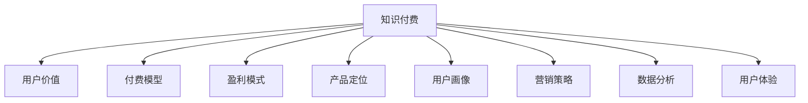

                 

# 知识付费创业的用户价值 Maximization

> 关键词：知识付费,用户价值,创业策略,付费模型,盈利模式,产品定位,用户画像,营销策略,数据分析,用户体验

## 1. 背景介绍

### 1.1 问题由来
在数字化和信息爆炸的时代，知识付费作为一种新兴的商业模式，正在快速崛起。随着互联网技术的发展和智能终端设备的普及，用户对有价值的知识内容的需求日益增长。知识付费平台如得到、喜马拉雅、网易云课堂等，通过将专业知识和技能以付费形式传递给用户，不仅帮助用户解决了学习上的需求，也为企业带来了巨大的收益。

然而，尽管知识付费市场前景广阔，但实际运营中仍存在诸多挑战。如何有效提高用户价值，优化产品体验，拓展市场规模，成为知识付费企业亟待解决的问题。通过深入研究用户行为，明确产品定位和营销策略，构建可持续的盈利模式，已成为知识付费创业成功的关键。

### 1.2 问题核心关键点
- **用户价值**：衡量知识付费平台的核心指标，决定着企业的生存和发展。
- **创业策略**：如何利用有限的资源，构建健康、可持续的商业模式。
- **付费模型**：选择哪种付费模式，如按次付费、订阅付费、按需付费等，影响用户行为和企业收益。
- **盈利模式**：除直接付费外，还可以通过增值服务、广告、品牌合作等方式实现盈利。
- **产品定位**：明确产品差异化特征，定位目标用户群体，满足其特定的知识需求。
- **用户画像**：分析用户特点和行为习惯，制定针对性的营销策略。
- **营销策略**：通过线上线下活动、内容营销、社区互动等方式，提升用户粘性和平台曝光度。
- **数据分析**：利用大数据和AI技术，分析用户行为和市场趋势，优化产品和服务。
- **用户体验**：提高平台的易用性和用户满意度，增加用户留存率。

## 2. 核心概念与联系

### 2.1 核心概念概述

为更好地理解知识付费创业的用户价值最大化，本节将介绍几个关键概念：

- **知识付费**：指将知识、技能、经验等有价值的内容，通过平台以付费形式传递给用户。用户通过付费获得特定内容，满足知识学习、技能提升等需求。
- **用户价值**：指用户从平台获得的实际利益和感受的总和。通过提供优质内容和良好体验，提升用户满意度和忠诚度。
- **付费模型**：指平台向用户收取费用的方式。常见的有单次付费、订阅付费、按需付费等。
- **盈利模式**：指平台通过何种方式实现收入。包括直接付费、广告分成、增值服务等。
- **产品定位**：指平台所提供的知识内容和服务，与同类竞品相比的差异和优势。
- **用户画像**：指对目标用户群体的行为和特征的描述，用于制定营销策略。
- **营销策略**：指通过各种手段，提升平台知名度和用户粘性的策略。
- **数据分析**：指利用数据分析技术，优化产品和服务，提升用户体验和业务效果。
- **用户体验**：指用户在使用平台时的感受和满意度，直接影响用户留存和转化率。

这些概念之间的逻辑关系可以通过以下Mermaid流程图来展示：



这个流程图展示的知识付费的核心概念及其之间的关系：

1. 知识付费平台通过优质的内容和体验提升用户价值。
2. 用户价值驱动付费模型的选择和优化。
3. 付费模型支撑平台的盈利模式。
4. 产品定位和用户画像指导营销策略的制定。
5. 数据分析和营销策略进一步提升用户体验。
6. 良好的用户体验增强用户粘性和留存率，形成良性循环。

## 3. 核心算法原理 & 具体操作步骤
### 3.1 算法原理概述

知识付费创业的用户价值最大化，涉及到用户获取、留存、转化等多个环节，可以通过多种算法和策略来实现。本节将从算法原理和具体操作步骤两个方面，详细介绍如何通过数据分析和机器学习技术，提升用户价值。

### 3.2 算法步骤详解

知识付费创业用户价值最大化的算法步骤主要包括以下几个环节：

1. **用户获取**：通过线上线下广告、内容营销、社交媒体推广等方式，吸引潜在用户。
2. **用户注册和激活**：设计易用的注册流程，并通过推荐机制、优惠活动等提高激活率。
3. **用户行为分析**：利用数据分析技术，分析用户行为和特征，构建用户画像。
4. **个性化推荐**：通过推荐系统，将用户最感兴趣的内容精准推送，提升用户体验和满意度。
5. **流失用户预警和挽留**：通过监测用户行为变化，提前预警高流失风险用户，采取挽留措施。
6. **反馈和改进**：收集用户反馈，进行产品优化和改进，提升用户满意度和忠诚度。

### 3.3 算法优缺点

知识付费创业用户价值最大化的算法具有以下优点：

1. **精准营销**：通过数据分析，可以精准定位目标用户，制定有效的营销策略。
2. **用户粘性提升**：通过个性化推荐和用户行为监控，提高用户粘性和留存率。
3. **用户体验优化**：通过持续优化产品和服务，提升用户满意度。

同时，该算法也存在一定的局限性：

1. **数据隐私问题**：用户行为数据的收集和分析，可能涉及隐私问题，需要谨慎处理。
2. **技术成本较高**：构建复杂的数据分析模型和推荐系统，需要较高的技术投入。
3. **用户体验维护**：快速迭代和优化产品，需要持续的用户反馈和产品团队的努力。

### 3.4 算法应用领域

知识付费创业用户价值最大化的算法，在知识付费平台和各类在线教育机构中得到了广泛应用。例如：

- **在线教育平台**：如新东方、好未来、猿辅导等，通过数据分析和个性化推荐，提升用户学习效果和平台收益。
- **专业技能培训**：如Coursera、Udacity、edX等，通过精准营销和用户行为分析，优化课程推荐，提升平台影响力和用户满意度。
- **职业技能认证**：如网易云课堂、腾讯课堂、网易云壳等，通过用户画像和流失预警，提高课程完成率和认证通过率。

除了这些经典应用外，知识付费用户价值最大化的算法还在更多场景中得到了创新性地应用，如企业内训、个人能力提升、终身学习等，为知识传播和终身学习提供了新的解决方案。

## 4. 数学模型和公式 & 详细讲解 & 举例说明

### 4.1 数学模型构建

本节将使用数学语言对知识付费创业用户价值最大化的算法过程进行更加严格的刻画。

假设知识付费平台的总用户数为 $N$，其中激活用户数为 $A$，付费用户数为 $P$，流失用户数为 $L$。设平台提供的内容总数为 $C$，每位用户的平均消费金额为 $E$，用户停留时间为 $T$。

定义用户价值 $V$ 为：

$$
V = \sum_{i=1}^A V_i + \sum_{j=1}^P V_j
$$

其中 $V_i$ 为激活用户的价值，$V_j$ 为付费用户的价值。每位用户的价值 $V$ 可以表示为：

$$
V = E \times T
$$

### 4.2 公式推导过程

根据用户价值定义，每位用户的价值可以表示为：

$$
V = E \times T
$$

对于激活用户，其价值来源于平台内容的吸引力和易用性，设激活用户的价值为 $V_A$，则：

$$
V_A = E_A \times T_A
$$

对于付费用户，其价值来源于平台提供的特定内容和服务，设付费用户的价值为 $V_P$，则：

$$
V_P = E_P \times T_P
$$

其中 $E_A$ 和 $T_A$ 分别为激活用户的平均消费金额和停留时间，$E_P$ 和 $T_P$ 分别为付费用户的平均消费金额和停留时间。

因此，平台总用户价值 $V$ 可以表示为：

$$
V = \sum_{i=1}^A V_i + \sum_{j=1}^P V_j = (E_A \times T_A) + (E_P \times T_P)
$$

### 4.3 案例分析与讲解

以Coursera平台为例，分析其用户价值最大化的算法实现。

Coursera通过大数据和机器学习技术，对用户行为进行深入分析，构建详细的用户画像。通过推荐算法，将用户最感兴趣的内容精准推送，提升用户满意度和完成率。同时，通过流失预警和挽留机制，防止高价值用户流失。通过这些算法和策略，Coursera不仅提升了用户粘性和留存率，也实现了较高的用户价值和平台收益。

Coursera的推荐算法主要基于用户历史行为数据，利用协同过滤和深度学习技术，预测用户可能感兴趣的内容。通过不断的优化模型，Coursera实现了精准推荐，显著提高了用户完成课程的概率和满意度。

## 5. 项目实践：代码实例和详细解释说明

### 5.1 开发环境搭建

在进行知识付费创业用户价值最大化算法的项目实践前，我们需要准备好开发环境。以下是使用Python进行机器学习和数据分析环境配置的流程：

1. 安装Anaconda：从官网下载并安装Anaconda，用于创建独立的Python环境。

2. 创建并激活虚拟环境：
```bash
conda create -n pyenv python=3.8 
conda activate pyenv
```

3. 安装必要的库：
```bash
conda install numpy pandas matplotlib scikit-learn seaborn tensorflow pytorch
```

4. 安装必要的工具：
```bash
pip install jupyter notebook gensim elasticsearch joblib jupyterlite nbconvert
```

完成上述步骤后，即可在`pyenv`环境中开始项目实践。

### 5.2 源代码详细实现

下面以用户行为分析和个性化推荐为例，给出使用Python进行数据分析和机器学习的代码实现。

首先，定义用户行为数据分析函数：

```python
import pandas as pd
from sklearn.decomposition import PCA
from sklearn.model_selection import train_test_split
from sklearn.metrics import mean_absolute_error

def user_behavior_analysis(data, features):
    # 数据清洗和预处理
    data = data.dropna(subset=['behavior', 'value'])
    X = data[features]
    y = data['value']
    
    # 特征选择和降维
    X = pd.get_dummies(X)
    pca = PCA(n_components=3)
    X = pca.fit_transform(X)
    
    # 模型训练和评估
    X_train, X_test, y_train, y_test = train_test_split(X, y, test_size=0.2, random_state=42)
    model = RandomForestRegressor(n_estimators=100, random_state=42)
    model.fit(X_train, y_train)
    y_pred = model.predict(X_test)
    mae = mean_absolute_error(y_test, y_pred)
    return ma
```

然后，定义个性化推荐函数：

```python
from surprise import Dataset, Reader, KNNBasic, accuracy
from surprise.model_selection import train_test_split

def personalized_recommendation(data, user_id, item_id, ratings):
    # 构建用户-物品评分矩阵
    reader = Reader(rating_scale=(1, 5))
    data = Dataset.load_from_df(pd.DataFrame(data), reader)
    
    # 划分训练集和测试集
    trainset, testset = train_test_split(data, test_size=0.2, random_state=42)
    
    # 选择基于邻居的推荐算法
    algo = KNNBasic(similarity_options={'name': 'pearson_baseline', 'user_based': True})
    algo.fit(trainset)
    
    # 预测并评估
    predictions = algo.test(testset)
    top_n = 10
    top_n_predictions = [(pred.user, pred.iid, pred.est, pred.interactions[0]) for pred in predictions[:top_n]]
    return top_n_predictions
```

最后，启动数据分析和推荐实践：

```python
import os

# 加载数据
data_path = 'user_data.csv'
user_data = pd.read_csv(data_path)

# 数据分析
features = ['age', 'gender', 'education']
mae = user_behavior_analysis(user_data, features)

# 个性化推荐
user_id = 123
item_id = 'Python编程'
ratings = [5, 4, 3, 2, 1]
top_n_predictions = personalized_recommendation(user_data, user_id, item_id, ratings)

# 输出结果
print(f"User {user_id}'s behavior MAE: {mae}")
print(f"Top {top_n} recommended items for item {item_id}: {top_n_predictions}")
```

以上就是使用Python进行用户行为分析和个性化推荐的代码实现。可以看到，通过数据分析和机器学习技术，可以系统地挖掘用户价值，提升用户满意度和平台收益。

### 5.3 代码解读与分析

让我们再详细解读一下关键代码的实现细节：

**user_behavior_analysis函数**：
- 输入参数为数据集`data`和特征列表`features`。
- 首先进行数据清洗，移除缺失行为和价值的数据。
- 将特征进行编码，并进行主成分分析（PCA）降维。
- 使用随机森林回归模型进行训练和评估，返回平均绝对误差（MAE）。

**personalized_recommendation函数**：
- 输入参数为用户数据`user_data`、用户ID`user_id`、物品ID`item_id`和用户评分`ratings`。
- 使用Surprise库中的KNNBasic算法，构建用户-物品评分矩阵。
- 将数据划分为训练集和测试集，训练推荐模型。
- 预测并获取用户对物品的评分，返回前10个推荐物品。

**数据分析和推荐实践**：
- 加载用户数据，进行数据分析和特征选择。
- 调用用户行为分析函数，计算MAE。
- 调用个性化推荐函数，根据用户ID和物品ID生成推荐物品列表。
- 输出结果，方便调试和优化。

## 6. 实际应用场景

### 6.1 在线教育平台

知识付费创业用户价值最大化的算法，在在线教育平台中得到了广泛应用。例如，通过用户行为分析，平台可以精准推荐课程和学习内容，提高用户完成率和满意度。通过流失预警和挽留，平台可以防止高价值用户流失，提升平台的稳定性和收益。

在Coursera等平台，通过精准推荐和个性化内容设计，用户可以更加高效地学习和掌握知识。平台通过分析用户的行为数据，预测其未来的学习路径和需求，推荐合适的课程和资源。同时，通过用户流失预警和挽留机制，平台能够及时识别出有流失风险的用户，采取针对性的措施进行挽留。这些算法和策略使得平台不仅提高了用户价值，也提升了平台的整体收益和竞争力。

### 6.2 职业技能培训

职业技能培训平台如Udacity、edX等，通过用户行为分析，优化课程推荐，提高用户满意度和完成率。通过流失预警和挽留，平台可以防止高价值用户流失，提升平台的稳定性和收益。

Udacity通过用户行为分析，了解用户的学习进度和偏好，精准推荐适合的课程和资源。平台通过分析用户的行为数据，预测其未来的学习路径和需求，推荐合适的课程和资源。同时，通过用户流失预警和挽留机制，平台能够及时识别出有流失风险的用户，采取针对性的措施进行挽留。这些算法和策略使得平台不仅提高了用户价值，也提升了平台的整体收益和竞争力。

### 6.3 企业内训

企业内训平台如网易云课堂、腾讯课堂等，通过用户行为分析，优化课程推荐，提高员工学习效果和满意度。通过流失预警和挽留，平台可以防止高价值用户流失，提升平台的稳定性和收益。

网易云课堂通过用户行为分析，了解员工的学习进度和偏好，精准推荐适合的课程和资源。平台通过分析员工的行为数据，预测其未来的学习路径和需求，推荐合适的课程和资源。同时，通过用户流失预警和挽留机制，平台能够及时识别出有流失风险的员工，采取针对性的措施进行挽留。这些算法和策略使得平台不仅提高了用户价值，也提升了平台的企业影响力。

### 6.4 未来应用展望

随着知识付费市场的不断成熟，知识付费创业用户价值最大化的算法将有更广泛的应用前景。未来，知识付费平台将更加注重个性化推荐和用户体验优化，通过精准营销和数据驱动的决策，提升用户价值和平台收益。

在智慧教育领域，通过知识付费创业用户价值最大化的算法，可以构建更加智能化的教育系统，提升教育质量和效果。在智能医疗、智能金融等领域，知识付费平台也可以通过提供高质量的知识服务，帮助用户提升专业能力和市场竞争力。

未来，知识付费创业用户价值最大化的算法将继续发展，推动知识付费市场的深度渗透和健康发展。

## 7. 工具和资源推荐

### 7.1 学习资源推荐

为了帮助开发者系统掌握知识付费创业用户价值最大化的理论和实践技巧，这里推荐一些优质的学习资源：

1. 《知识付费创业指南》系列博文：由知识付费创业专家撰写，深入浅出地介绍了知识付费创业的基本流程和关键点。

2. Coursera《数据科学导论》课程：由斯坦福大学开设的数据科学入门课程，有Lecture视频和配套作业，带你入门数据科学的基本概念和方法。

3. 《知识付费》书籍：由知识付费领域知名专家所著，全面介绍了知识付费的商业模式、用户行为和运营策略。

4. HuggingFace官方文档：自然语言处理领域权威库，提供了丰富的模型和算法资源，是学习知识付费算法的重要工具。

5. Kaggle数据集和竞赛：利用Kaggle提供的开放数据集和竞赛平台，实践数据挖掘、机器学习和知识付费算法的应用。

通过对这些资源的学习实践，相信你一定能够快速掌握知识付费创业用户价值最大化的精髓，并用于解决实际的商业问题。

### 7.2 开发工具推荐

高效的开发离不开优秀的工具支持。以下是几款用于知识付费创业用户价值最大化算法的常用工具：

1. Python：功能强大的编程语言，适合数据分析和机器学习任务。

2. Jupyter Notebook：交互式编程环境，支持代码运行和结果展示，方便开发和调试。

3. Pandas：高效的数据处理库，提供丰富的数据操作和分析功能。

4. NumPy：高性能的数值计算库，适合大规模数据处理和矩阵计算。

5. Scikit-learn：机器学习库，提供丰富的算法和模型支持。

6. TensorFlow：开源深度学习框架，支持大规模分布式训练和模型部署。

7. PyTorch：灵活的深度学习框架，适合快速迭代和实验研究。

合理利用这些工具，可以显著提升知识付费创业用户价值最大化的开发效率，加快创新迭代的步伐。

### 7.3 相关论文推荐

知识付费创业用户价值最大化的发展源于学界的持续研究。以下是几篇奠基性的相关论文，推荐阅读：

1. "User Value Maximization in Knowledge Platforms"（知识平台用户价值最大化）：详细介绍了知识付费平台用户价值最大化的算法和策略。

2. "Personalized Recommendation Systems in Education"（教育领域的个性化推荐系统）：介绍了教育领域个性化推荐算法的设计和实现。

3. "Challenges and Opportunities in Knowledge Economy"（知识经济中的挑战和机遇）：探讨了知识付费创业中的技术、市场和政策挑战。

4. "A Survey on Knowledge Payload"（知识载荷的综述）：总结了知识付费平台用户价值最大化的研究现状和未来方向。

5. "The Role of Artificial Intelligence in Knowledge Creation"（人工智能在知识创造中的角色）：探讨了人工智能技术在知识付费平台中的应用和前景。

这些论文代表了大规模知识付费创业用户价值最大化的发展脉络。通过学习这些前沿成果，可以帮助研究者把握学科前进方向，激发更多的创新灵感。

## 8. 总结：未来发展趋势与挑战

### 8.1 总结

本文对知识付费创业用户价值最大化进行了全面系统的介绍。首先阐述了知识付费创业的背景和意义，明确了用户价值最大化的核心指标和重要性。其次，从算法原理和具体操作步骤两个方面，详细讲解了用户价值最大化的实现方法。最后，通过对实际应用场景和未来发展趋势的探讨，进一步明确了知识付费创业的策略和方向。

通过本文的系统梳理，可以看到，知识付费创业用户价值最大化涉及到用户获取、留存、转化等多个环节，通过多种算法和策略可以实现。这不仅有助于提升用户价值，也有助于优化产品体验和市场规模。未来，随着技术的不断发展，知识付费创业用户价值最大化的算法将有更广阔的应用前景，为知识付费市场带来新的增长动力。

### 8.2 未来发展趋势

展望未来，知识付费创业用户价值最大化将呈现以下几个发展趋势：

1. **个性化推荐算法的发展**：未来的推荐算法将更加精准，能够根据用户行为和兴趣进行深度分析和预测，提供更个性化的内容和服务。

2. **多模态数据的整合**：知识付费平台将更多地利用文本、语音、图像等多模态数据，提升内容的丰富性和用户的沉浸感。

3. **大数据和AI的深度融合**：通过深度学习和AI技术，知识付费平台可以更好地分析用户行为和市场趋势，优化产品和服务。

4. **用户行为预测和预警**：通过机器学习和大数据分析，平台可以更准确地预测用户流失行为，及时采取挽留措施。

5. **智能化营销和推荐**：利用AI技术和数据驱动，知识付费平台可以实现智能化营销和推荐，提升用户转化率和平台收益。

6. **区块链和去中心化技术的应用**：区块链和去中心化技术可以保障用户数据的隐私和安全，提升平台的可信度和用户粘性。

这些趋势将推动知识付费创业用户价值最大化的算法进一步发展，为知识付费市场的健康发展和用户价值的最大化提供新的动力。

### 8.3 面临的挑战

尽管知识付费创业用户价值最大化算法已经取得了显著的进展，但在实现过程中仍面临诸多挑战：

1. **数据隐私和安全**：用户数据的收集和分析可能涉及隐私问题，需要严格的数据保护和隐私政策。

2. **数据质量和完整性**：用户行为数据的质量和完整性可能影响算法效果，需要有效的数据清洗和预处理。

3. **算法模型的复杂性**：复杂的推荐算法和数据分析模型需要较高的技术投入，可能增加开发成本和维护难度。

4. **用户行为的多样性**：不同用户的偏好和需求存在差异，需要个性化的算法和策略来满足多样化需求。

5. **平台的商业化和盈利模式**：知识付费平台需要在提供优质内容和服务的同时，实现可持续的商业化和盈利模式。

6. **市场竞争激烈**：知识付费市场竞争激烈，平台需要不断创新和优化，才能在激烈的市场竞争中保持优势。

这些挑战将考验知识付费创业者的技术能力、商业智慧和运营经验，需要多方协同努力，才能实现用户价值的最大化。

### 8.4 研究展望

面对知识付费创业用户价值最大化所面临的挑战，未来的研究需要在以下几个方面寻求新的突破：

1. **数据隐私保护**：探索数据匿名化、加密等技术，保障用户数据隐私。

2. **算法模型的简化和优化**：开发更加高效、易用的推荐算法，降低技术复杂性和开发成本。

3. **多模态数据的整合和利用**：研究如何更有效地整合多模态数据，提升内容的丰富性和用户的沉浸感。

4. **智能营销和推荐系统的优化**：通过AI技术和数据驱动，实现智能化营销和推荐，提升用户转化率和平台收益。

5. **区块链和去中心化技术的应用**：探索区块链和去中心化技术在知识付费平台中的应用，保障数据安全和用户隐私。

这些研究方向的探索，必将引领知识付费创业用户价值最大化算法迈向更高的台阶，为知识付费市场的健康发展和用户价值的最大化提供新的动力。面向未来，知识付费创业者需要持续创新和优化，才能在激烈的市场竞争中保持优势，为用户提供更优质的内容和体验。

## 9. 附录：常见问题与解答

**Q1：知识付费创业中，如何衡量用户价值？**

A: 知识付费创业中，用户价值可以通过多个指标进行衡量，包括用户的付费金额、课程完成率、满意度评分、复购率等。平台可以构建用户画像，综合分析这些指标，得出用户价值的高低。

**Q2：知识付费平台应该如何进行个性化推荐？**

A: 个性化推荐是知识付费平台的核心功能，可以通过以下步骤实现：
1. 收集用户行为数据，如课程浏览、购买、评分等。
2. 构建用户-物品评分矩阵，利用协同过滤等算法进行推荐。
3. 引入深度学习技术，如神经网络、矩阵分解等，提升推荐的精度。
4. 不断优化算法模型，根据用户反馈进行迭代和改进。

**Q3：知识付费平台应该如何进行用户流失预警？**

A: 用户流失预警可以通过以下步骤实现：
1. 收集用户行为数据，如课程完成率、活跃度、流失行为等。
2. 利用机器学习技术，构建用户流失预测模型，如随机森林、支持向量机等。
3. 设定流失预警阈值，当用户行为触发阈值时，进行预警。
4. 采取挽留措施，如发送邮件、电话回访、提供优惠等。

**Q4：知识付费平台应该如何进行精准营销？**

A: 精准营销可以通过以下步骤实现：
1. 收集用户行为数据，如浏览历史、购买记录、关注话题等。
2. 利用数据分析技术，构建用户画像，了解用户需求和偏好。
3. 设计精准的营销内容，如个性化的广告、推荐、优惠等。
4. 通过多种渠道进行推广，如社交媒体、邮件、短信等。

**Q5：知识付费平台应该如何提升用户粘性和留存率？**

A: 提升用户粘性和留存率可以通过以下步骤实现：
1. 提供优质的内容和体验，如个性化的课程推荐、互动社区等。
2. 定期推送有价值的内容，如新课程、专家讲座等。
3. 设计积分、奖励等激励机制，增加用户活跃度。
4. 及时响应用户反馈，进行产品优化和改进。

这些步骤可以帮助知识付费平台提高用户粘性和留存率，提升平台的整体价值和竞争力。

---

作者：禅与计算机程序设计艺术 / Zen and the Art of Computer Programming

