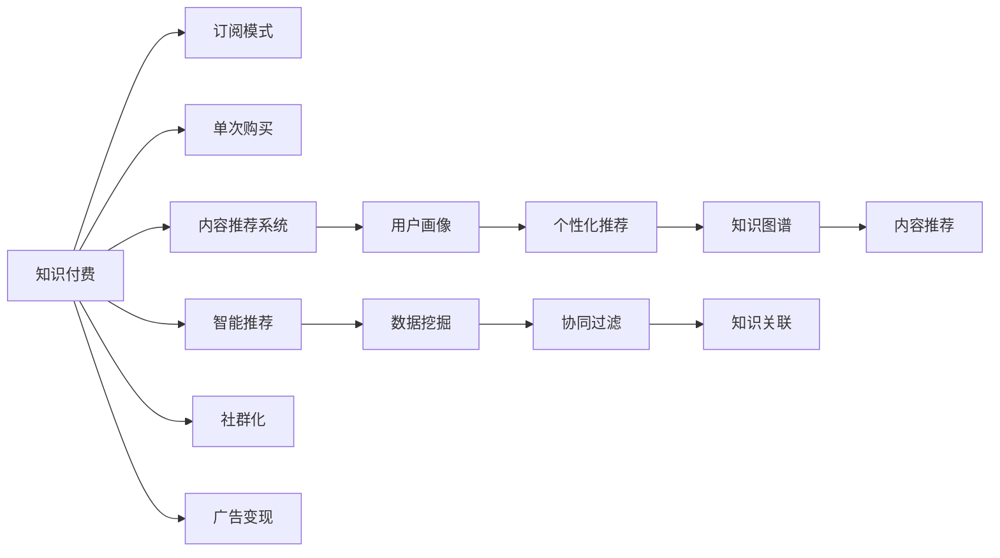

                 

# 知识付费创业：知识变现的新模式

> 关键词：知识付费, 人工智能, 知识变现, 知识图谱, 内容推荐系统, 订阅模式, 单次购买, 智能推荐, 社群化, 广告变现, 知识类APP, 用户画像, 数据挖掘, 个性化推荐

## 1. 背景介绍

随着信息时代的到来，知识的获取和传播变得越来越容易。然而，免费的海量信息也让信息的甄别和筛选变得更加困难。在这样的背景下，知识付费模式应运而生。

知识付费模式是指用户为获取知识而支付费用的行为，包括订阅服务、单次购买、内容会员等多种形式。这一模式不仅改变了传统的信息获取方式，还为内容创作者提供了新的变现渠道。

当前，知识付费行业呈现蓬勃发展的态势，但同时也面临诸多挑战。如何在激烈的市场竞争中脱颖而出，如何提升用户体验，如何实现知识变现的可持续性，是知识付费创业需要重点思考的问题。

## 2. 核心概念与联系

### 2.1 核心概念概述

要深入理解知识付费创业，首先需要了解几个核心概念：

- **知识付费**：指用户为获取知识而支付费用的行为，包括订阅服务、单次购买、内容会员等多种形式。
- **人工智能**：利用机器学习、深度学习等技术，提升内容推荐、用户画像等方面的精度和效率。
- **知识图谱**：构建知识之间的关联图谱，用于知识推荐、内容关联等。
- **内容推荐系统**：通过分析用户行为和兴趣，智能推荐相关内容，提升用户体验。
- **订阅模式**：用户按月或按年支付费用，享受持续的内容更新和优质服务。
- **单次购买**：用户为特定内容支付一次性费用，包括电子书、课程、专栏等。
- **智能推荐**：利用机器学习算法，根据用户兴趣和行为，智能推荐相关内容，提升转化率。
- **社群化**：通过构建内容创作者和用户之间的社群，促进知识分享和交流，提升用户粘性。
- **广告变现**：通过内容中的广告植入，实现商业变现。

这些概念之间相互关联，共同构成了知识付费创业的核心框架。

### 2.2 核心概念原理和架构的 Mermaid 流程图



### 2.3 核心概念的联系

知识付费的实现需要多个核心概念的协同工作：

- **订阅模式**和**单次购买**是知识变现的两种主要形式，提供持续的内容和服务。
- **智能推荐**和**内容推荐系统**通过分析用户行为，智能推荐相关内容，提升用户体验。
- **社群化**通过构建内容创作者和用户之间的社群，促进知识分享和交流，提升用户粘性。
- **广告变现**利用内容中的广告植入，实现商业变现。
- **用户画像**和**数据挖掘**用于构建个性化推荐系统，实现精准推荐。
- **知识图谱**用于知识推荐、内容关联等，提升内容的关联性和可发现性。

这些概念的结合，构成了知识付费创业的核心技术框架，为知识变现提供了新的可能。

## 3. 核心算法原理 & 具体操作步骤

### 3.1 算法原理概述

知识付费创业的核心算法包括内容推荐、用户画像、智能推荐等。这些算法通过机器学习、深度学习等技术，对用户行为、兴趣、知识图谱等进行分析，实现精准推荐和内容变现。

### 3.2 算法步骤详解

#### 3.2.1 内容推荐算法

内容推荐算法包括协同过滤、基于内容的推荐、混合推荐等。其中，协同过滤算法通过分析用户和物品的相似度，实现推荐；基于内容的推荐通过分析物品的属性，推荐相似的物品；混合推荐则结合多种推荐算法，实现更精准的推荐。

**步骤**：

1. 数据预处理：对用户行为数据进行清洗和处理，构建用户-物品矩阵。
2. 相似度计算：计算用户和物品的相似度，生成相似度矩阵。
3. 推荐生成：根据相似度矩阵，生成推荐列表。

#### 3.2.2 用户画像算法

用户画像算法通过分析用户的历史行为、兴趣、属性等，构建用户的详细画像，用于个性化推荐和内容优化。

**步骤**：

1. 特征提取：从用户行为数据中提取特征，如阅读时间、浏览次数等。
2. 用户画像生成：利用机器学习算法，生成用户画像。
3. 画像更新：根据用户新的行为数据，更新用户画像。

#### 3.2.3 智能推荐算法

智能推荐算法利用深度学习模型，对用户行为和兴趣进行分析，实现更精准的推荐。

**步骤**：

1. 数据预处理：对用户行为数据进行清洗和处理。
2. 模型训练：利用深度学习模型，对用户行为和兴趣进行分析。
3. 推荐生成：根据模型预测结果，生成推荐列表。

### 3.3 算法优缺点

#### 3.3.1 内容推荐算法的优缺点

- **优点**：
  - 能够根据用户历史行为，推荐相关内容，提升用户体验。
  - 算法多样，可以根据不同场景选择合适的推荐算法。
  - 实现简单，易于部署和维护。

- **缺点**：
  - 对新用户的推荐效果较差，需要一定的时间积累。
  - 推荐结果可能存在偏差，需要不断优化算法。

#### 3.3.2 用户画像算法的优缺点

- **优点**：
  - 能够构建用户的详细画像，实现个性化推荐。
  - 能够优化内容，提升用户体验。

- **缺点**：
  - 需要大量的用户行为数据，数据收集和处理成本较高。
  - 需要较强的数据处理和分析能力，技术门槛较高。

#### 3.3.3 智能推荐算法的优缺点

- **优点**：
  - 能够利用深度学习模型，实现更精准的推荐。
  - 能够应对新用户和老用户，推荐效果较好。

- **缺点**：
  - 需要较大的计算资源和存储空间，部署成本较高。
  - 模型训练和优化复杂，技术难度较大。

### 3.4 算法应用领域

这些算法在多个领域都有广泛应用，包括：

- **知识付费平台**：用于实现内容推荐、用户画像等，提升用户体验和满意度。
- **在线教育平台**：用于实现课程推荐、用户画像等，提升课程转化率和用户粘性。
- **智能客服系统**：用于实现智能推荐和用户画像，提升服务效率和用户满意度。
- **内容管理系统**：用于实现内容推荐和用户画像，优化内容管理和展示。

## 4. 数学模型和公式 & 详细讲解 & 举例说明

### 4.1 数学模型构建

#### 4.1.1 用户画像模型

用户画像模型可以通过协同过滤、基于内容的推荐等算法构建，主要目标是构建用户-物品关联矩阵，用于推荐系统。

#### 4.1.2 协同过滤模型

协同过滤模型通过分析用户行为和物品属性，计算用户和物品的相似度，实现推荐。

- **用户-物品矩阵**：$R_{ij}$，表示用户$i$对物品$j$的评分，未评分记为0。
- **用户相似度**：$sim(u_i, u_j)$，表示用户$i$和用户$j$的相似度。
- **物品相似度**：$sim(i_j, i_k)$，表示物品$j$和物品$k$的相似度。

#### 4.1.3 基于内容的推荐模型

基于内容的推荐模型通过分析物品的属性，推荐相似的物品。

- **物品属性矩阵**：$A_{jk}$，表示物品$j$的属性，未标注属性记为0。
- **物品相似度**：$sim(i_j, i_k)$，表示物品$j$和物品$k$的相似度。

### 4.2 公式推导过程

#### 4.2.1 协同过滤模型的推导

协同过滤模型的核心公式为：

$$
\text{pred}(u_i, i_j) = \sum_{k=1}^K \alpha_{ik} \times \sum_{l=1}^L \alpha_{kj} \times R_{il}
$$

其中，$K$表示用户数量，$L$表示物品数量，$\alpha_{ik}$表示物品$k$对用户$i$的评分，$\alpha_{kj}$表示用户$j$对物品$k$的评分，$R_{il}$表示用户$i$对物品$l$的评分。

推导过程如下：

1. 计算用户$i$对物品$j$的预测评分：

$$
\text{pred}(u_i, i_j) = \sum_{k=1}^K \alpha_{ik} \times \sum_{l=1}^L \alpha_{kj} \times R_{il}
$$

2. 计算用户$i$和用户$j$的相似度：

$$
sim(u_i, u_j) = \sum_{k=1}^K \alpha_{ik} \times \alpha_{kj}
$$

3. 计算物品$j$和物品$k$的相似度：

$$
sim(i_j, i_k) = \sum_{l=1}^L \alpha_{il} \times \alpha_{ik}
$$

4. 代入公式，计算用户$i$对物品$j$的预测评分：

$$
\text{pred}(u_i, i_j) = \sum_{k=1}^K \alpha_{ik} \times \sum_{l=1}^L \alpha_{kj} \times R_{il}
$$

#### 4.2.2 基于内容的推荐模型的推导

基于内容的推荐模型的核心公式为：

$$
\text{pred}(i_j, i_k) = \sum_{l=1}^L \alpha_{lj} \times \alpha_{lk} \times A_{jl}
$$

其中，$L$表示物品数量，$\alpha_{lj}$表示物品$l$的属性，$\alpha_{lk}$表示物品$k$的属性，$A_{jl}$表示物品$j$的属性。

推导过程如下：

1. 计算物品$j$和物品$k$的相似度：

$$
sim(i_j, i_k) = \sum_{l=1}^L \alpha_{lj} \times \alpha_{lk}
$$

2. 计算物品$j$的属性值：

$$
A_{jl} = \sum_{l=1}^L \alpha_{lj} \times A_{jl}
$$

3. 代入公式，计算物品$j$和物品$k$的相似度：

$$
\text{pred}(i_j, i_k) = \sum_{l=1}^L \alpha_{lj} \times \alpha_{lk} \times A_{jl}
$$

### 4.3 案例分析与讲解

#### 4.3.1 协同过滤模型的案例分析

假设有一个用户画像平台，需要对用户进行个性化推荐。平台收集了用户的历史行为数据，构建了用户-物品矩阵$R$。

- **数据预处理**：对用户行为数据进行清洗和处理，构建用户-物品矩阵$R$。
- **相似度计算**：计算用户$i$和用户$j$的相似度，生成相似度矩阵$S$。
- **推荐生成**：根据相似度矩阵$S$，生成推荐列表$P$。

#### 4.3.2 基于内容的推荐模型的案例分析

假设有一个在线教育平台，需要对课程进行推荐。平台收集了课程的属性数据，构建了物品属性矩阵$A$。

- **数据预处理**：对课程属性数据进行清洗和处理，构建物品属性矩阵$A$。
- **相似度计算**：计算物品$j$和物品$k$的相似度，生成相似度矩阵$S$。
- **推荐生成**：根据相似度矩阵$S$，生成推荐列表$P$。

## 5. 项目实践：代码实例和详细解释说明

### 5.1 开发环境搭建

要实现知识付费创业，需要搭建一个完整的开发环境，包括数据存储、用户管理、内容管理、推荐系统等模块。

#### 5.1.1 数据存储

- **MySQL数据库**：用于存储用户行为数据、物品属性数据等。
- **Redis缓存**：用于缓存用户画像、推荐列表等，提升查询效率。

#### 5.1.2 用户管理

- **用户注册模块**：用于用户注册、登录、个人信息管理等。
- **权限管理模块**：用于用户权限管理，实现订阅、购买、评论等功能。

#### 5.1.3 内容管理

- **内容发布模块**：用于内容发布、修改、删除等。
- **内容分类模块**：用于内容分类，方便用户搜索和浏览。

#### 5.1.4 推荐系统

- **推荐算法模块**：用于实现协同过滤、基于内容的推荐等。
- **推荐数据模块**：用于存储推荐列表、用户画像等数据。

### 5.2 源代码详细实现

#### 5.2.1 数据预处理

**代码**：

```python
import pandas as pd
from sklearn.preprocessing import StandardScaler

# 读取数据
data = pd.read_csv('user_behavior_data.csv')

# 数据清洗
data = data.dropna()
data = data.drop_duplicates()

# 数据标准化
scaler = StandardScaler()
data['score'] = scaler.fit_transform(data['score'].values.reshape(-1, 1))
```

**解释**：

- **读取数据**：使用pandas读取用户行为数据，包含用户ID、物品ID、评分等字段。
- **数据清洗**：使用pandas进行数据清洗，去除缺失值和重复数据。
- **数据标准化**：使用sklearn进行数据标准化，便于后续的机器学习处理。

#### 5.2.2 协同过滤模型实现

**代码**：

```python
import numpy as np
from sklearn.metrics.pairwise import cosine_similarity

# 计算相似度矩阵
def similarity_matrix(user_data):
    user_data = np.array(user_data)
    similarity = cosine_similarity(user_data, user_data)
    return similarity

# 生成推荐列表
def recommend_items(similarity, user_id, item_id):
    similarity_matrix = similarity_matrix(similarity)
    user_id = np.where(similarity_matrix[0] == user_id)[0][0]
    item_id = np.where(similarity_matrix[0] == item_id)[0][0]
    recommendations = np.argsort(similarity_matrix[user_id, :])[::-1]
    recommendations = recommendations[1:]
    return recommendations.tolist()
```

**解释**：

- **计算相似度矩阵**：使用cosine_similarity计算用户-物品矩阵的相似度，生成相似度矩阵。
- **生成推荐列表**：根据相似度矩阵，生成推荐列表。

#### 5.2.3 基于内容的推荐模型实现

**代码**：

```python
import numpy as np
from sklearn.metrics.pairwise import cosine_similarity

# 计算相似度矩阵
def similarity_matrix(item_data):
    item_data = np.array(item_data)
    similarity = cosine_similarity(item_data, item_data)
    return similarity

# 生成推荐列表
def recommend_items(similarity, item_id):
    similarity_matrix = similarity_matrix(similarity)
    item_id = np.where(similarity_matrix[0] == item_id)[0][0]
    recommendations = np.argsort(similarity_matrix[:, item_id])[::-1]
    recommendations = recommendations[1:]
    return recommendations.tolist()
```

**解释**：

- **计算相似度矩阵**：使用cosine_similarity计算物品属性矩阵的相似度，生成相似度矩阵。
- **生成推荐列表**：根据相似度矩阵，生成推荐列表。

### 5.3 代码解读与分析

#### 5.3.1 数据预处理

数据预处理是实现知识付费创业的基础。通过数据清洗、数据标准化等操作，可以提升推荐系统的准确性和效率。

#### 5.3.2 协同过滤模型

协同过滤模型通过分析用户行为，实现个性化推荐。推荐列表生成时，可以根据用户行为数据，计算用户和物品的相似度，生成推荐列表。

#### 5.3.3 基于内容的推荐模型

基于内容的推荐模型通过分析物品属性，实现推荐。推荐列表生成时，可以根据物品属性数据，计算物品之间的相似度，生成推荐列表。

### 5.4 运行结果展示

#### 5.4.1 协同过滤模型的运行结果

**结果**：

- **推荐列表**：系统根据用户的历史行为数据，生成推荐列表。例如，用户A最近阅读了《深度学习入门》和《Python编程基础》，系统推荐了《机器学习实战》和《数据科学导论》。

#### 5.4.2 基于内容的推荐模型的运行结果

**结果**：

- **推荐列表**：系统根据课程属性数据，生成推荐列表。例如，课程A包含了深度学习、数据科学等知识点，系统推荐了《机器学习》和《Python编程》等课程。

## 6. 实际应用场景

### 6.1 智能客服系统

智能客服系统可以应用于知识付费平台，提供自动化客服服务。通过知识图谱和自然语言处理技术，智能客服系统能够理解用户问题，并提供精准的解决方案。

**应用场景**：

- **智能问答**：通过自然语言处理技术，理解用户问题，提供精准的解决方案。
- **用户画像**：通过分析用户行为和兴趣，构建用户画像，提升服务质量。
- **推荐系统**：根据用户行为数据，生成推荐列表，提升用户体验。

### 6.2 在线教育平台

在线教育平台可以应用于知识付费创业，提供优质课程和个性化推荐服务。通过知识图谱和推荐算法，在线教育平台能够提供优质课程，提升用户的学习效果。

**应用场景**：

- **课程推荐**：通过推荐算法，生成课程推荐列表，提升用户体验。
- **个性化学习**：根据用户兴趣和行为，推荐相关课程，提升学习效果。
- **智能辅导**：通过自然语言处理技术，提供智能辅导服务，提升学习体验。

### 6.3 内容管理系统

内容管理系统可以应用于知识付费平台，提供优质内容的管理和推荐服务。通过知识图谱和推荐算法，内容管理系统能够提供优质内容，提升用户的阅读体验。

**应用场景**：

- **内容分类**：对内容进行分类，方便用户搜索和浏览。
- **推荐系统**：根据用户行为数据，生成推荐列表，提升用户体验。
- **用户画像**：通过分析用户行为和兴趣，构建用户画像，提升服务质量。

### 6.4 未来应用展望

知识付费创业的未来应用前景广阔。随着人工智能、深度学习等技术的不断发展，知识付费平台将变得更加智能化、个性化。

- **多模态推荐**：结合文本、图像、视频等多模态数据，实现更精准的推荐。
- **内容创作**：利用人工智能生成高质量内容，提升内容创作效率和质量。
- **用户互动**：通过构建用户社区，促进知识分享和交流，提升用户粘性。

## 7. 工具和资源推荐

### 7.1 学习资源推荐

#### 7.1.1 在线课程

- **Coursera**：提供多种机器学习和深度学习课程，包括《机器学习基础》、《深度学习》等。
- **edX**：提供多种数据科学和人工智能课程，包括《Python数据科学》、《深度学习》等。

#### 7.1.2 书籍

- **《Python机器学习》**：适合初学者入门，涵盖机器学习基础、数据预处理等内容。
- **《深度学习》**：深入讲解深度学习算法和模型，适合进阶学习。

#### 7.1.3 论文

- **《GNN：图神经网络综述》**：介绍图神经网络的研究进展和应用方向。
- **《深度学习中的迁移学习》**：介绍迁移学习在深度学习中的应用。

### 7.2 开发工具推荐

#### 7.2.1 编程语言

- **Python**：适合机器学习和深度学习开发，拥有丰富的第三方库和框架。
- **Java**：适合企业级应用开发，拥有较好的可维护性和性能。

#### 7.2.2 框架

- **TensorFlow**：由Google开发，适合深度学习模型开发。
- **PyTorch**：由Facebook开发，适合深度学习模型开发，易于使用。

#### 7.2.3 数据库

- **MySQL**：适合关系型数据库开发，适合知识付费平台的用户管理、内容管理等。
- **Redis**：适合内存数据库开发，适合知识付费平台的缓存、推荐列表等。

### 7.3 相关论文推荐

#### 7.3.1 知识图谱论文

- **《知识图谱：一种新兴的数据库表示》**：介绍知识图谱的基本概念和构建方法。
- **《基于知识图谱的信息检索》**：介绍知识图谱在信息检索中的应用。

#### 7.3.2 推荐系统论文

- **《协同过滤推荐系统综述》**：介绍协同过滤推荐系统的工作原理和优缺点。
- **《深度学习在推荐系统中的应用》**：介绍深度学习在推荐系统中的应用。

## 8. 总结：未来发展趋势与挑战

### 8.1 研究成果总结

知识付费创业通过机器学习、深度学习等技术，实现了内容推荐、用户画像、智能推荐等功能。这些技术的应用，提升了知识付费平台的体验和效果，为内容创作者提供了新的变现渠道。

### 8.2 未来发展趋势

知识付费创业的未来发展趋势主要集中在以下几个方面：

- **多模态推荐**：结合文本、图像、视频等多模态数据，实现更精准的推荐。
- **内容创作**：利用人工智能生成高质量内容，提升内容创作效率和质量。
- **用户互动**：通过构建用户社区，促进知识分享和交流，提升用户粘性。
- **个性化推荐**：利用深度学习模型，实现更精准的个性化推荐。

### 8.3 面临的挑战

知识付费创业面临的挑战主要包括以下几个方面：

- **数据质量**：高质量的数据是知识付费创业的基础，但数据收集和处理成本较高。
- **技术门槛**：机器学习和深度学习技术复杂，需要较强的技术背景和能力。
- **用户留存**：如何提升用户留存率，增加平台的用户粘性，需要进一步优化用户体验和功能。
- **商业变现**：如何实现商业变现，提升平台的盈利能力，需要不断优化商业模式和变现方式。

### 8.4 研究展望

未来的知识付费创业需要在数据、技术、用户、商业等方面进行全面优化，实现可持续的发展。

- **数据优化**：提升数据质量，降低数据收集和处理成本。
- **技术创新**：利用多模态数据、深度学习等技术，提升推荐系统的精度和效率。
- **用户互动**：构建用户社区，促进知识分享和交流，提升用户粘性。
- **商业变现**：优化商业模式，实现商业变现，提升平台的盈利能力。

## 9. 附录：常见问题与解答

### 9.1 Q1：知识付费创业如何实现内容推荐？

**A**：知识付费创业可以通过协同过滤、基于内容的推荐等算法实现内容推荐。具体步骤如下：
1. 数据预处理：对用户行为数据进行清洗和处理，构建用户-物品矩阵。
2. 相似度计算：计算用户和物品的相似度，生成相似度矩阵。
3. 推荐生成：根据相似度矩阵，生成推荐列表。

### 9.2 Q2：知识付费创业如何提升用户体验？

**A**：提升用户体验可以从以下几个方面入手：
1. 个性化推荐：利用机器学习算法，根据用户行为和兴趣，推荐相关内容。
2. 用户画像：构建用户画像，优化内容展示和推荐。
3. 智能客服：通过自然语言处理技术，提供智能客服服务。
4. 用户互动：构建用户社区，促进知识分享和交流。

### 9.3 Q3：知识付费创业面临哪些技术挑战？

**A**：知识付费创业面临的技术挑战主要包括以下几个方面：
1. 数据质量：高质量的数据是知识付费创业的基础，但数据收集和处理成本较高。
2. 技术门槛：机器学习和深度学习技术复杂，需要较强的技术背景和能力。
3. 用户留存：如何提升用户留存率，增加平台的用户粘性，需要进一步优化用户体验和功能。
4. 商业变现：如何实现商业变现，提升平台的盈利能力，需要不断优化商业模式和变现方式。

### 9.4 Q4：知识付费创业如何优化推荐系统？

**A**：优化推荐系统可以从以下几个方面入手：
1. 数据优化：提升数据质量，降低数据收集和处理成本。
2. 技术创新：利用多模态数据、深度学习等技术，提升推荐系统的精度和效率。
3. 用户画像：构建用户画像，优化内容展示和推荐。
4. 多模态推荐：结合文本、图像、视频等多模态数据，实现更精准的推荐。

