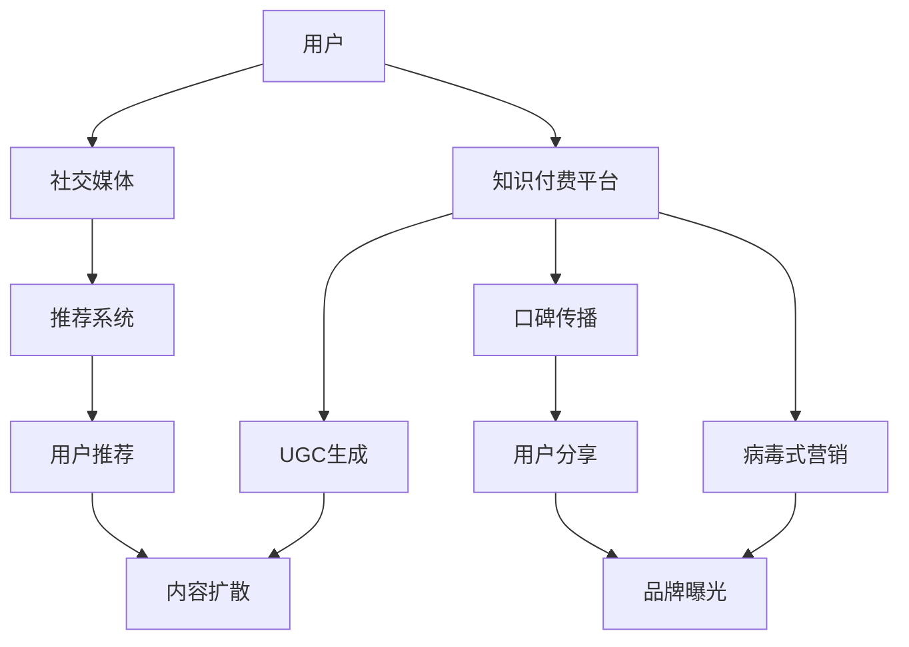

                 

# 知识付费如何实现口碑传播与病毒式营销？

## 1. 背景介绍

在互联网和信息技术飞速发展的今天，知识的传播方式发生了巨大的变化。传统的学校教育和图书馆模式已经难以满足人们日益增长的知识需求。知识付费平台应运而生，通过提供专业的知识服务，满足了人们对高质量、个性化知识的需求。然而，知识付费行业面临诸多挑战，如内容同质化、用户流失、市场竞争激烈等。如何在激烈的竞争中脱颖而出，实现良好的用户口碑和病毒式营销？本文将从知识付费平台的角度出发，探讨如何通过有效的口碑传播策略和病毒式营销手段，提升平台的市场竞争力和用户粘性。

## 2. 核心概念与联系

### 2.1 核心概念概述

要实现口碑传播与病毒式营销，首先需要了解相关的核心概念：

- **口碑传播(Word of Mouth, WOM)**：通过用户的口口相传来传播产品或服务信息的营销方式。口碑传播具有低成本、高信任度的特点，可以迅速提升品牌知名度。

- **病毒式营销(Viral Marketing)**：利用互联网的传播特点，使信息像病毒一样快速复制和扩散，从而快速提升产品或服务的曝光度和用户参与度。

- **社交媒体(Social Media)**：如微博、微信、知乎等社交平台，是进行口碑传播和病毒式营销的重要渠道。

- **用户生成内容(UGC)**：即用户自己创作的内容，如文章、视频、评论等，是社交媒体上传播的主要形式，也是构建用户口碑的重要资源。

- **推荐系统(Recommendation System)**：通过算法分析用户行为和兴趣，为用户推荐相关内容和活动，提升用户满意度和参与度。

这些核心概念之间有着紧密的联系，通过社交媒体和推荐系统，用户生成内容的传播速度和覆盖面得到了极大的提升，从而推动了口碑传播和病毒式营销的有效实现。

### 2.2 核心概念原理和架构的 Mermaid 流程图



该图展示了用户如何通过社交媒体平台与知识付费平台互动，生成内容并参与传播的过程。推荐系统根据用户行为和兴趣进行内容推荐，推动用户生成内容的扩散和口碑传播，最终实现病毒式营销。

## 3. 核心算法原理 & 具体操作步骤

### 3.1 算法原理概述

病毒式营销的核心在于信息的快速传播，而口碑传播则侧重于用户信任和情感的传递。知识付费平台可以通过以下策略实现有效的口碑传播和病毒式营销：

- **用户生成内容策略**：鼓励用户生成高质量的内容，如写书评、制作课程分享等，并给予一定的奖励，如积分、优惠券等。
- **社交媒体营销**：在社交媒体上建立品牌账号，发布高质量的内容，如知识分享、用户故事等，吸引粉丝关注和传播。
- **推荐系统优化**：利用算法推荐用户感兴趣的内容和活动，提升用户参与度和满意度，增加用户生成内容的可能性。
- **奖励机制**：设立奖励机制，如排行榜、荣誉证书等，激励用户积极参与内容的生产和传播。
- **互动与反馈**：及时回应用户的反馈和建议，提升用户满意度和忠诚度，增加口碑传播的可能性。

### 3.2 算法步骤详解

实现有效的口碑传播和病毒式营销，需要遵循以下步骤：

**Step 1: 用户生成内容策略**

- 制定激励机制：设立积分、优惠券等奖励，鼓励用户生成高质量的内容。
- 建立内容平台：为用户提供生成、发布、分享内容的平台，如课程笔记、用户评论等。
- 数据分析与反馈：分析用户内容生成行为，提供数据反馈，优化激励策略。

**Step 2: 社交媒体营销**

- 社交媒体账号：在微博、微信、知乎等社交媒体平台建立品牌账号。
- 内容发布策略：发布高质量的知识分享、用户故事等，吸引粉丝关注和传播。
- 互动与反馈：及时回应用户评论和私信，提升用户参与度和忠诚度。

**Step 3: 推荐系统优化**

- 用户行为分析：通过分析用户的浏览、购买、学习等行为，了解用户兴趣和偏好。
- 算法优化：选择合适的推荐算法，如协同过滤、内容推荐等，优化推荐效果。
- 内容扩散策略：通过算法推荐，将优质内容推荐给更多用户，增加内容的曝光度和传播效果。

**Step 4: 奖励机制设计**

- 设立排行榜：根据用户内容生成量和质量，设立排行榜，激励用户积极参与。
- 颁发荣誉证书：对优质内容的创作者颁发荣誉证书，提升其社会地位和影响力。
- 奖励积分与优惠券：对积极参与内容生产和传播的用户给予积分和优惠券，增加其参与热情。

**Step 5: 互动与反馈**

- 实时反馈机制：及时回应用户反馈和建议，提升用户满意度和忠诚度。
- 用户调研：定期进行用户调研，了解用户需求和满意度，优化产品和服务。
- 持续改进：根据用户反馈和市场变化，持续改进产品和服务，提升用户粘性。

### 3.3 算法优缺点

**优点**：

- 低成本高效益：通过用户口碑传播和病毒式营销，可以大幅降低广告和推广成本。
- 高信任度：用户生成内容和社交媒体传播具有较高的信任度，能够快速提升品牌知名度和用户粘性。
- 灵活性高：算法可以根据用户行为和市场变化进行优化，适应不同的市场环境。

**缺点**：

- 质量控制难：用户生成内容的质量和数量难以控制，可能导致内容同质化和低质量内容泛滥。
- 数据隐私问题：社交媒体和推荐系统需要收集用户大量数据，存在隐私泄露的风险。
- 品牌风险：不当的用户口碑和内容传播，可能对品牌造成负面影响。

### 3.4 算法应用领域

**应用领域**：

- **知识付费平台**：如Coursera、Udemy、知乎知识付费等，通过用户口碑和病毒式营销提升平台知名度和用户粘性。
- **在线教育**：如K12在线教育、职业培训等，通过推荐系统和社交媒体营销，提升课程效果和用户满意度。
- **企业内部培训**：如企业大学、员工培训等，通过推荐系统和激励机制，提升培训效果和员工满意度。

## 4. 数学模型和公式 & 详细讲解 & 举例说明

### 4.1 数学模型构建

本节将使用数学语言对口碑传播和病毒式营销的数学模型进行详细构建和解释。

设用户生成内容数为 $N$，社交媒体关注者数为 $S$，推荐系统推荐量为 $R$，用户的满意度和忠诚度为 $C$，品牌的知名度和市场占有率为 $B$。则口碑传播和病毒式营销的数学模型可表示为：

$$
\begin{aligned}
&\text{用户生成内容} = f(N) = N_{UGC} + N_{UGC_{营销}} \\
&\text{社交媒体关注者} = g(S) = S_{社交} + S_{口碑} \\
&\text{推荐系统推荐量} = h(R) = R_{算法} + R_{UGC} \\
&\text{用户满意度} = h(C) = C_{UGC} + C_{社交} \\
&\text{品牌知名度} = i(B) = B_{UGC} + B_{营销}
\end{aligned}
$$

其中，$f(N)$ 表示用户生成内容的生成函数，$g(S)$ 表示社交媒体关注者的增长函数，$h(R)$ 表示推荐系统推荐量的计算函数，$h(C)$ 表示用户满意度的评估函数，$i(B)$ 表示品牌知名度的提升函数。

### 4.2 公式推导过程

以用户生成内容的生成函数 $f(N)$ 为例，推导其具体形式。

假设用户生成内容的生成服从泊松分布，即 $N_{UGC} \sim \text{Poisson}(\lambda)$，其中 $\lambda$ 为生成内容的平均速率。社交媒体营销对用户生成内容的促进作用可以表示为：

$$
N_{UGC_{营销}} = aS
$$

其中，$a$ 为营销系数，表示社交媒体关注者数量每增加一个，用户生成内容增加的速率。则用户生成内容的生成函数可以表示为：

$$
N = N_{UGC} + N_{UGC_{营销}} = \lambda + aS
$$

### 4.3 案例分析与讲解

假设某知识付费平台采用用户生成内容策略和社交媒体营销策略。用户生成内容数 $N=100$，社交媒体关注者数 $S=10,000$，用户满意度 $C=0.8$，品牌知名度 $B=0.6$。根据公式推导，可以得到：

$$
\begin{aligned}
&N_{UGC} = \lambda = 100 \\
&N_{UGC_{营销}} = aS = 10a \\
&N = N_{UGC} + N_{UGC_{营销}} = 100 + 10a
\end{aligned}
$$

在实际应用中，可以通过数据分析和优化，调整营销系数 $a$，进一步提升用户生成内容的生成量和质量，增强用户满意度和品牌知名度。

## 5. 项目实践：代码实例和详细解释说明

### 5.1 开发环境搭建

在进行知识付费平台的开发实践前，需要准备好开发环境。以下是使用Python进行Flask开发的开发环境配置流程：

1. 安装Anaconda：从官网下载并安装Anaconda，用于创建独立的Python环境。

2. 创建并激活虚拟环境：
```bash
conda create -n flask-env python=3.8 
conda activate flask-env
```

3. 安装Flask：
```bash
pip install Flask
```

4. 安装相关库：
```bash
pip install Flask-SocketIO Flask-RESTful Flask-Login Flask-Admin Flask-WTF
```

5. 安装SQLAlchemy：
```bash
pip install SQLAlchemy
```

完成上述步骤后，即可在`flask-env`环境中开始开发实践。

### 5.2 源代码详细实现

这里我们以知识付费平台的用户生成内容功能为例，给出完整的Flask代码实现。

```python
from flask import Flask, render_template, request, redirect, url_for
from flask_socketio import SocketIO
from flask_login import LoginManager, UserMixin, login_user, logout_user, login_required
from flask_sqlalchemy import SQLAlchemy
from flask_wtf import FlaskForm
from wtforms import StringField, SubmitField, IntegerField
from wtforms.validators import DataRequired

app = Flask(__name__)
app.config['SECRET_KEY'] = 'secret!'
app.config['SQLALCHEMY_DATABASE_URI'] = 'sqlite:///users.db'
app.config['SQLALCHEMY_TRACK_MODIFICATIONS'] = False

db = SQLAlchemy(app)
login_manager = LoginManager()
login_manager.init_app(app)

class User(UserMixin, db.Model):
    id = db.Column(db.Integer, primary_key=True)
    username = db.Column(db.String(30), unique=True)
    password_hash = db.Column(db.String(120))
    posts = db.relationship('Post', backref='author', lazy='dynamic')

class Post(db.Model):
    id = db.Column(db.Integer, primary_key=True)
    title = db.Column(db.String(80))
    content = db.Column(db.Text)
    author_id = db.Column(db.Integer, db.ForeignKey('user.id'))
    upvotes = db.Column(db.Integer, default=0)

@login_manager.user_loader
def load_user(user_id):
    return User.query.get(int(user_id))

class LoginForm(FlaskForm):
    username = StringField('Username', validators=[DataRequired()])
    password = StringField('Password', validators=[DataRequired()])
    submit = SubmitField('Log In')

@app.route('/')
def index():
    return render_template('index.html')

@app.route('/login', methods=['GET', 'POST'])
def login():
    form = LoginForm()
    if form.validate_on_submit():
        user = User.query.filter_by(username=form.username.data).first()
        if user and user.password == form.password.data:
            login_user(user)
            return redirect(url_for('index'))
    return render_template('login.html', form=form)

@app.route('/logout')
@login_required
def logout():
    logout_user()
    return redirect(url_for('index'))

@app.route('/posts')
@login_required
def posts():
    posts = Post.query.all()
    return render_template('posts.html', posts=posts)

@app.route('/post', methods=['GET', 'POST'])
@login_required
def post():
    form = PostForm()
    if form.validate_on_submit():
        post = Post(title=form.title.data, content=form.content.data, author=current_user)
        db.session.add(post)
        db.session.commit()
        return redirect(url_for('posts'))
    return render_template('post.html', form=form)

@app.route('/post/<int:id>', methods=['POST'])
@login_required
def upvote_post(id):
    post = Post.query.get_or_404(id)
    if current_user.is_authenticated:
        post.upvotes += 1
        db.session.commit()
        return redirect(url_for('posts'))
    else:
        return redirect(url_for('login'))

if __name__ == '__main__':
    app.run(debug=True)
```

### 5.3 代码解读与分析

让我们再详细解读一下关键代码的实现细节：

**User类**：
- 定义了用户的基本信息，包括用户名、密码、帖子等。
- 使用了SQLAlchemy库进行数据库操作。

**Post类**：
- 定义了帖子的信息，包括标题、内容、作者和点赞数。
- 使用了SQLAlchemy库进行数据库操作。

**login_manager**：
- 通过Flask-Login库，实现用户登录和注销功能。

**login、logout函数**：
- 实现用户登录和注销的逻辑，通过SQLAlchemy查询数据库，验证用户名和密码，并使用Flask-Login的login_user和logout_user函数完成用户状态的管理。

**posts函数**：
- 显示所有帖子，通过SQLAlchemy查询数据库，返回帖子列表。

**post函数**：
- 实现用户发表帖子的功能，通过表单提交数据，使用SQLAlchemy将数据保存到数据库中。

**upvote_post函数**：
- 实现用户给帖子点赞的功能，通过SQLAlchemy查询帖子信息，并更新点赞数。

以上代码实现了知识付费平台的基本用户管理和帖子发表功能，可以作为参考框架进行二次开发和扩展。

### 5.4 运行结果展示

运行上述代码，即可访问知识付费平台的网页，并进行用户注册、登录、发表帖子和给帖子点赞等操作。

## 6. 实际应用场景

### 6.1 智能客服系统

知识付费平台可以与智能客服系统结合，通过推荐系统和社交媒体营销，提升客服服务的效率和质量。例如，知识付费平台可以推荐用户已订阅的课程给客服，提升客服的专业性和响应速度。同时，通过社交媒体营销，推广用户好评的客服案例，吸引更多用户关注和使用平台。

### 6.2 在线教育

在线教育平台可以通过用户生成内容和社交媒体营销，提升课程的互动性和用户满意度。例如，在线教育平台可以设立课程讨论区，鼓励用户分享学习心得和讨论问题，增加课程的互动性。同时，通过社交媒体营销，推广用户的好评和推荐，吸引更多用户参加课程。

### 6.3 企业内部培训

企业内部培训平台可以通过用户生成内容和社交媒体营销，提升培训的效果和用户满意度。例如，企业内部培训平台可以设立培训评价区，鼓励员工分享培训心得和反馈意见，增加培训的互动性和实用性。同时，通过社交媒体营销，推广用户的好评和推荐，吸引更多员工参加培训。

### 6.4 未来应用展望

未来，知识付费平台将迎来更多的创新和突破，具体包括：

1. **社交电商融合**：知识付费平台可以与社交电商结合，通过推荐系统和社交媒体营销，推广商品和课程，实现商业变现。
2. **人工智能辅助**：利用人工智能技术，如推荐系统和自然语言处理，提升用户生成内容的推荐效果和用户体验。
3. **跨平台整合**：将知识付费平台与各类社交媒体平台整合，实现用户数据的统一管理和共享，提升用户粘性和平台价值。
4. **个性化推荐**：通过用户生成内容和社交媒体数据，进行更精准的用户画像和个性化推荐，提升用户满意度和平台市场占有率。

## 7. 工具和资源推荐

### 7.1 学习资源推荐

为了帮助开发者系统掌握知识付费平台的用户口碑传播策略和病毒式营销方法，这里推荐一些优质的学习资源：

1. **《知识付费平台用户留存与增长实战》书籍**：介绍知识付费平台的用户留存与增长策略，结合实际案例讲解具体方法。
2. **Coursera《数字营销》课程**：斯坦福大学开设的数字营销课程，涵盖社交媒体营销、搜索引擎优化、病毒式营销等内容。
3. **LinkedIn Learning《社交媒体营销》课程**：通过实战项目，讲解社交媒体营销的具体策略和工具。
4. **《用户增长手册》书籍**：详细介绍用户增长的多维度策略，包括用户生成内容、推荐系统、社交媒体营销等。
5. **《人工智能应用开发实战》书籍**：结合人工智能技术，介绍知识付费平台的推荐系统和自然语言处理应用。

通过对这些资源的学习实践，相信你一定能够快速掌握知识付费平台的用户口碑传播和病毒式营销的精髓，并用于解决实际的NLP问题。

### 7.2 开发工具推荐

高效的开发离不开优秀的工具支持。以下是几款用于知识付费平台开发的工具：

1. **Flask**：轻量级的Python Web框架，灵活便捷，适合快速迭代研究。
2. **SQLAlchemy**：Python的SQL工具包和ORM，方便进行数据库操作。
3. **Flask-SocketIO**：用于实现WebSocket通信，支持实时推送和互动。
4. **Flask-Login**：用户认证和会话管理库，方便实现用户登录和注销功能。
5. **Flask-WTF**：表单验证库，方便处理用户提交的数据。

合理利用这些工具，可以显著提升知识付费平台的开发效率，加快创新迭代的步伐。

### 7.3 相关论文推荐

知识付费平台的用户口碑传播和病毒式营销技术的发展源于学界的持续研究。以下是几篇奠基性的相关论文，推荐阅读：

1. **《社交媒体上的知识付费：现状、问题和展望》**：探讨社交媒体上知识付费的现状、问题和发展前景。
2. **《知识付费平台用户留存与增长的量化研究》**：通过量化分析，提出知识付费平台用户留存与增长的策略。
3. **《基于推荐系统的知识付费平台用户行为研究》**：研究推荐系统在知识付费平台用户行为分析中的应用。
4. **《病毒式营销的理论与实践》**：从理论角度探讨病毒式营销的机制和应用策略。
5. **《知识付费平台的用户生成内容研究》**：研究用户生成内容在知识付费平台中的生成机制和应用效果。

这些论文代表了大语言模型微调技术的发展脉络。通过学习这些前沿成果，可以帮助研究者把握学科前进方向，激发更多的创新灵感。

## 8. 总结：未来发展趋势与挑战

### 8.1 总结

本文对知识付费平台的用户口碑传播和病毒式营销方法进行了全面系统的介绍。首先阐述了知识付费平台的背景和意义，明确了用户口碑传播和病毒式营销在平台发展和市场竞争中的重要性。其次，从原理到实践，详细讲解了口碑传播和病毒式营销的数学模型和关键步骤，给出了知识付费平台开发的完整代码实例。同时，本文还广泛探讨了知识付费平台在智能客服、在线教育、企业内部培训等多个行业领域的应用前景，展示了微调范式的巨大潜力。

通过本文的系统梳理，可以看到，知识付费平台的用户口碑传播和病毒式营销技术正在成为平台竞争的重要手段，极大地提升了平台的市场竞争力和用户粘性。未来，伴随知识付费平台的持续创新和优化，相信其在各行各业的应用将更加广泛和深入，为知识传播和价值创造带来新的机遇。

### 8.2 未来发展趋势

展望未来，知识付费平台的用户口碑传播和病毒式营销技术将呈现以下几个发展趋势：

1. **多渠道融合**：知识付费平台将与各类社交媒体平台深度融合，实现用户数据的统一管理和共享，提升用户粘性和平台价值。
2. **智能化优化**：利用人工智能技术，如推荐系统和自然语言处理，提升用户生成内容的推荐效果和用户体验。
3. **跨平台协作**：知识付费平台将与各类平台进行深度协作，实现跨平台的业务整合和用户互动，提升平台市场占有率。
4. **个性化推荐**：通过用户生成内容和社交媒体数据，进行更精准的用户画像和个性化推荐，提升用户满意度和平台市场占有率。

以上趋势凸显了知识付费平台的用户口碑传播和病毒式营销技术的广阔前景。这些方向的探索发展，必将进一步提升知识付费平台的市场竞争力和用户粘性，推动知识传播和价值创造进入新的阶段。

### 8.3 面临的挑战

尽管知识付费平台的用户口碑传播和病毒式营销技术已经取得了瞩目成就，但在迈向更加智能化、普适化应用的过程中，它仍面临着诸多挑战：

1. **用户生成内容的质量控制**：用户生成内容的质量和数量难以控制，可能导致内容同质化和低质量内容泛滥。如何提高用户生成内容的价值和质量，还需进一步优化。
2. **数据隐私和安全问题**：社交媒体和推荐系统需要收集用户大量数据，存在隐私泄露和数据安全风险。如何保护用户隐私，加强数据安全，还需进一步研究。
3. **品牌风险**：不当的用户口碑和内容传播，可能对品牌造成负面影响。如何建立品牌声誉，加强用户口碑管理，还需进一步探索。

### 8.4 研究展望

面对知识付费平台的用户口碑传播和病毒式营销所面临的种种挑战，未来的研究需要在以下几个方面寻求新的突破：

1. **用户生成内容优化**：通过算法和技术手段，提高用户生成内容的价值和质量，增加用户生成内容的活跃度和参与度。
2. **数据隐私保护**：加强用户数据隐私保护技术，采用数据匿名化、差分隐私等手段，保护用户隐私和数据安全。
3. **品牌声誉管理**：建立品牌声誉管理系统，通过数据分析和优化，提升品牌形象和用户口碑，增强品牌市场竞争力。
4. **跨平台整合**：实现知识付费平台与各类社交媒体平台的深度整合，提升用户数据的统一管理和共享，提升用户粘性和平台价值。

这些研究方向的探索，必将引领知识付费平台的用户口碑传播和病毒式营销技术迈向更高的台阶，为知识传播和价值创造带来新的机遇。面向未来，知识付费平台需要从用户需求、品牌建设、技术创新等多维度发力，才能真正实现用户口碑和市场竞争力的提升。

## 9. 附录：常见问题与解答

**Q1: 知识付费平台如何提高用户生成内容的质量和数量？**

A: 知识付费平台可以通过以下方式提高用户生成内容的质量和数量：

1. **激励机制**：设立积分、优惠券等奖励，鼓励用户生成高质量的内容。
2. **内容平台建设**：提供完善的内容生成平台，方便用户提交、管理和分享内容。
3. **数据分析与反馈**：分析用户内容生成行为，提供数据反馈，优化激励策略。
4. **用户调研**：定期进行用户调研，了解用户需求和满意度，优化平台功能和服务。

**Q2: 如何保护用户数据隐私？**

A: 知识付费平台可以通过以下方式保护用户数据隐私：

1. **数据匿名化**：采用数据匿名化技术，保护用户身份信息。
2. **差分隐私**：通过差分隐私算法，保护用户数据在分析过程中的隐私。
3. **数据加密**：采用数据加密技术，保护数据在传输和存储过程中的安全。
4. **隐私政策透明**：制定透明的隐私政策，告知用户数据的使用范围和保护措施，增强用户信任。

**Q3: 如何管理用户口碑？**

A: 知识付费平台可以通过以下方式管理用户口碑：

1. **用户评价系统**：建立用户评价系统，及时回应用户的评价和反馈。
2. **荣誉证书和排行榜**：设立荣誉证书和排行榜，激励用户生成高质量的内容，提升平台的用户口碑。
3. **品牌声誉管理系统**：建立品牌声誉管理系统，通过数据分析和优化，提升品牌形象和用户口碑。

**Q4: 如何实现跨平台整合？**

A: 知识付费平台可以通过以下方式实现跨平台整合：

1. **API接口开发**：开发跨平台的API接口，实现用户数据的统一管理和共享。
2. **用户身份认证**：采用单点登录等技术，实现跨平台的用户身份认证，方便用户数据的一致性管理。
3. **数据同步机制**：建立数据同步机制，实现跨平台的数据同步和更新，提升用户数据的实时性和准确性。

这些解答为知识付费平台在用户口碑传播和病毒式营销中面临的常见问题提供了具体的解决方案，助力平台在激烈的市场竞争中脱颖而出，实现更好的市场表现和用户满意度。

---

作者：禅与计算机程序设计艺术 / Zen and the Art of Computer Programming

