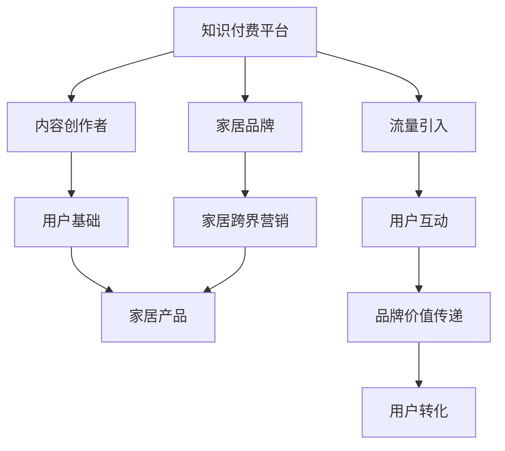

                 

# 知识付费如何实现跨界营销与家居跨界？

## 1. 背景介绍

### 1.1 问题由来
知识付费作为近年来互联网经济的新兴领域，通过提供高质量内容、专业知识和信息，迅速吸引了大量用户，尤其是对知识和专业技能有需求的年轻群体。然而，随着市场竞争的加剧，知识付费平台也面临着流量获取成本高、内容同质化、用户留存难等问题。

与此同时，家居市场也正处于快速增长阶段，消费者对高质量家居产品和服务的追求日益增长。然而，家居行业的传统营销手段和模式逐渐显示出其局限性，亟需引入新的力量来推动行业发展。

### 1.2 问题核心关键点
知识付费与家居跨界营销的核心在于：
- 如何通过知识付费平台的流量和用户基础，为家居品牌带来更多曝光和销售机会。
- 家居品牌如何与知识付费平台的内容创作者、社区用户建立深度连接，实现品牌价值的传递和用户转化。
- 家居跨界营销应如何结合知识付费的独特优势，如内容质量和用户粘性，实现新场景、新模式的创新应用。

## 2. 核心概念与联系

### 2.1 核心概念概述

为了更好地理解知识付费与家居跨界营销的机制，本节将介绍几个关键概念：

- 知识付费平台：通过提供付费订阅、课程购买等方式，向用户提供专业知识和信息服务的平台。如得到、喜马拉雅等。
- 内容创作者：在知识付费平台上发布内容的专业人士，包括作家、学者、博主等。他们为平台吸引用户、带来流量。
- 家居品牌：包括但不限于家具、装饰、家电等家居产品和服务品牌。
- 家居跨界营销：指家居品牌将营销触点扩展到知识付费平台，通过内容营销、品牌推广等方式，与平台用户建立深度连接，提升品牌知名度和销售额。

这些核心概念之间的逻辑关系可以通过以下Mermaid流程图来展示：



这个流程图展示了知识付费平台、内容创作者、用户基础与家居品牌之间的互动关系：
- 家居品牌通过知识付费平台进行跨界营销，吸引平台流量。
- 家居品牌与内容创作者合作，在平台上发布相关内容。
- 用户基础通过平台获取家居内容，与品牌产生互动。
- 家居品牌通过内容营销传递品牌价值，提升用户转化率。

## 3. 核心算法原理 & 具体操作步骤
### 3.1 算法原理概述

知识付费与家居跨界营销的本质是一种多渠道营销手段。其核心算法原理是通过优化内容推荐和用户互动模型，最大化家居品牌的曝光和销售机会。

具体而言，知识付费平台利用推荐系统、流量分发等技术手段，将家居品牌的推广信息精准推送给潜在用户。家居品牌则通过与内容创作者合作，发布有吸引力的家居内容，增强用户对品牌的好感度。最终，通过数据驱动的用户行为分析，提升家居品牌的知名度和销售额。

### 3.2 算法步骤详解

知识付费与家居跨界营销的算法步骤包括：
1. **数据收集与处理**：收集家居品牌和内容创作者的数据，包括产品信息、用户行为数据、广告投放效果等。
2. **用户画像构建**：通过数据挖掘和机器学习技术，构建详细的用户画像，了解用户兴趣、行为模式等信息。
3. **内容推荐与分发**：利用推荐系统算法，将家居品牌的产品信息、优惠活动等内容精准推送给潜在用户。
4. **内容合作与推广**：与内容创作者合作，发布高质量的家居相关内容，如装修技巧、产品测评等，增强用户粘性和品牌好感。
5. **用户互动与反馈**：通过平台互动功能，如评论、点赞、分享等，收集用户对家居品牌的反馈，调整优化推广策略。
6. **效果评估与优化**：利用A/B测试、回归分析等方法，评估家居跨界营销的效果，优化推广策略，提升转化率。

### 3.3 算法优缺点

知识付费与家居跨界营销的算法具有以下优点：
1. **精准触达**：通过推荐系统和个性化推荐算法，家居品牌可以精准触达目标用户，提升广告效果。
2. **用户粘性高**：知识付费平台的用户通常对内容质量有较高要求，粘性较高，有助于提升品牌影响力。
3. **跨界创新**：将家居品牌与知识付费内容结合，创造了新的营销模式，有助于品牌突破传统营销瓶颈。

同时，该算法也存在一定的局限性：
1. **数据隐私问题**：在数据收集和处理过程中，用户隐私保护是一个重要问题。需要严格遵守数据保护法规。
2. **内容质量控制**：家居品牌需要与内容创作者合作，确保发布内容的质量和专业性，避免低俗内容对品牌形象的负面影响。
3. **用户互动管理**：需要有效管理平台上的用户互动，避免负面评论和舆论风险，维护品牌声誉。
4. **效果评估复杂**：家居跨界营销的效果评估涉及多维度的指标，需要综合考虑品牌知名度、销售额、用户满意度等因素。

### 3.4 算法应用领域

知识付费与家居跨界营销的算法可以应用于多个领域，包括但不限于：

- 家居电商：通过知识付费平台进行家居产品推广，提升用户购买转化率。
- 家居设计：利用平台内容，推广装修设计服务，提升设计质量和客户满意度。
- 家居服务：通过平台推广家居保养、维修等服务，拓展服务范围，提升服务水平。
- 家居品牌建设：利用知识付费平台进行品牌故事和理念传播，提升品牌形象和市场影响力。

## 4. 数学模型和公式 & 详细讲解
### 4.1 数学模型构建

知识付费与家居跨界营销的数学模型主要涉及推荐系统、内容评估和用户行为分析三个方面。

1. **推荐系统模型**：
   假设推荐系统中有 $n$ 个家居品牌，$m$ 个内容创作者，每个用户 $u$ 对应一个兴趣向量 $\mathbf{v}_u$，家居品牌 $i$ 对应一个特征向量 $\mathbf{p}_i$，内容创作者 $j$ 对应一个内容质量评分 $q_j$。推荐系统模型可以表示为：

   $$
   \hat{r}_{ui} = \mathbf{v}_u \cdot \mathbf{p}_i + b
   $$

   其中 $r$ 为实际评分，$b$ 为偏置项，$\cdot$ 表示点积运算。

2. **内容评估模型**：
   假设内容创作者 $j$ 发布的家居内容 $c_j$ 的质量评分为 $q_j$，家居品牌 $i$ 的销售额为 $s_i$。内容评估模型可以表示为：

   $$
   q_j = f(c_j)
   $$

   其中 $f$ 为内容质量评估函数，可以基于用户互动、专家评价等多种指标计算。

3. **用户行为分析模型**：
   假设用户 $u$ 的购买行为 $a_u$ 与家居品牌 $i$ 的产品质量 $p_i$ 和用户画像特征 $v_u$ 之间存在线性关系：

   $$
   a_u = w_0 + w_1 p_i + w_2 v_u + \epsilon
   $$

   其中 $w_0$、$w_1$、$w_2$ 为回归系数，$\epsilon$ 为误差项。

### 4.2 公式推导过程

1. **推荐系统推导**：
   - 假设推荐系统已知 $n$ 个家居品牌 $i$，$m$ 个内容创作者 $j$，用户 $u$ 的兴趣向量 $\mathbf{v}_u$，家居品牌 $i$ 的特征向量 $\mathbf{p}_i$。
   - 根据上述模型，计算用户 $u$ 对家居品牌 $i$ 的预测评分 $\hat{r}_{ui}$：
     - 计算用户 $u$ 对家居品牌 $i$ 的兴趣度评分：$\hat{r}_{ui} = \mathbf{v}_u \cdot \mathbf{p}_i$
     - 将评分与预设阈值比较，决定是否推荐家居品牌 $i$。

2. **内容评估推导**：
   - 假设内容创作者 $j$ 发布的内容质量评分为 $q_j$，家居品牌 $i$ 的销售额为 $s_i$。
   - 根据内容质量评估函数 $f$，计算内容创作者 $j$ 的内容评分 $q_j$：
     - 利用专家评价、用户互动等多种指标，构建内容质量评分模型：$q_j = f(c_j) = \sum_{k=1}^K a_k \cdot r_k$
     - 将评分 $q_j$ 与家居品牌 $i$ 的销售额 $s_i$ 关联，计算家居品牌 $i$ 的内容传播效果。

3. **用户行为分析推导**：
   - 假设用户 $u$ 的购买行为 $a_u$ 与家居品牌 $i$ 的产品质量 $p_i$ 和用户画像特征 $v_u$ 存在线性关系。
   - 利用回归分析方法，计算用户 $u$ 的购买行为预测模型：
     - 构建线性回归模型：$a_u = w_0 + w_1 p_i + w_2 v_u + \epsilon$
     - 使用最小二乘法估计回归系数 $w_0$、$w_1$、$w_2$，通过验证集或交叉验证方法进行模型验证。

### 4.3 案例分析与讲解

假设某家居品牌希望通过知识付费平台进行跨界营销，通过以下步骤进行操作：

1. **数据收集与处理**：
   - 收集家居品牌的产品信息、用户行为数据、广告投放效果等。
   - 收集内容创作者发布的高质量家居内容，并对其内容质量进行评分。

2. **用户画像构建**：
   - 利用推荐算法，分析平台用户的行为模式、兴趣爱好等信息，构建详细的用户画像。
   - 利用用户画像数据，筛选与家居品牌相关的高质量用户群体。

3. **内容推荐与分发**：
   - 利用推荐系统算法，将家居品牌的产品信息精准推送给潜在用户。
   - 与内容创作者合作，发布有吸引力的家居内容，如装修技巧、产品测评等。

4. **用户互动与反馈**：
   - 通过平台互动功能，如评论、点赞、分享等，收集用户对家居品牌的反馈。
   - 分析用户反馈，调整优化推广策略，提升用户粘性和满意度。

5. **效果评估与优化**：
   - 利用A/B测试、回归分析等方法，评估家居跨界营销的效果。
   - 根据评估结果，优化推广策略，提升家居品牌的知名度和销售额。

## 5. 项目实践：代码实例和详细解释说明
### 5.1 开发环境搭建

在进行家居跨界营销项目实践前，我们需要准备好开发环境。以下是使用Python进行PyTorch开发的环境配置流程：

1. 安装Anaconda：从官网下载并安装Anaconda，用于创建独立的Python环境。

2. 创建并激活虚拟环境：
```bash
conda create -n home-home python=3.8 
conda activate home-home
```

3. 安装PyTorch：根据CUDA版本，从官网获取对应的安装命令。例如：
```bash
conda install pytorch torchvision torchaudio cudatoolkit=11.1 -c pytorch -c conda-forge
```

4. 安装TensorFlow：由Google主导开发的开源深度学习框架，生产部署方便，适合大规模工程应用。同样有丰富的预训练语言模型资源。

5. 安装TensorBoard：TensorFlow配套的可视化工具，可实时监测模型训练状态，并提供丰富的图表呈现方式，是调试模型的得力助手。

6. 安装Pandas、Numpy等数据处理库：
```bash
pip install pandas numpy matplotlib tqdm jupyter notebook ipython
```

完成上述步骤后，即可在`home-home`环境中开始家居跨界营销实践。

### 5.2 源代码详细实现

下面我们以家居电商跨界营销为例，给出使用Transformers库进行家居品牌推广的PyTorch代码实现。

首先，定义家居电商推广的数据处理函数：

```python
from transformers import BertTokenizer
from torch.utils.data import Dataset
import torch

class HomeDataset(Dataset):
    def __init__(self, data, tokenizer, max_len=128):
        self.data = data
        self.tokenizer = tokenizer
        self.max_len = max_len
        
    def __len__(self):
        return len(self.data)
    
    def __getitem__(self, item):
        text = self.data[item]['text']
        title = self.data[item]['title']
        
        encoding = self.tokenizer(title, return_tensors='pt', max_length=self.max_len, padding='max_length', truncation=True)
        input_ids = encoding['input_ids'][0]
        attention_mask = encoding['attention_mask'][0]
        
        return {'input_ids': input_ids, 
                'attention_mask': attention_mask,
                'text': text}
```

然后，定义模型和优化器：

```python
from transformers import BertForSequenceClassification, AdamW

model = BertForSequenceClassification.from_pretrained('bert-base-cased', num_labels=2)

optimizer = AdamW(model.parameters(), lr=2e-5)
```

接着，定义训练和评估函数：

```python
from torch.utils.data import DataLoader
from tqdm import tqdm
from sklearn.metrics import accuracy_score

device = torch.device('cuda') if torch.cuda.is_available() else torch.device('cpu')
model.to(device)

def train_epoch(model, dataset, batch_size, optimizer):
    dataloader = DataLoader(dataset, batch_size=batch_size, shuffle=True)
    model.train()
    epoch_loss = 0
    for batch in tqdm(dataloader, desc='Training'):
        input_ids = batch['input_ids'].to(device)
        attention_mask = batch['attention_mask'].to(device)
        labels = batch['text'].to(device)
        model.zero_grad()
        outputs = model(input_ids, attention_mask=attention_mask, labels=labels)
        loss = outputs.loss
        epoch_loss += loss.item()
        loss.backward()
        optimizer.step()
    return epoch_loss / len(dataloader)

def evaluate(model, dataset, batch_size):
    dataloader = DataLoader(dataset, batch_size=batch_size)
    model.eval()
    preds, labels = [], []
    with torch.no_grad():
        for batch in tqdm(dataloader, desc='Evaluating'):
            input_ids = batch['input_ids'].to(device)
            attention_mask = batch['attention_mask'].to(device)
            batch_labels = batch['text'].to(device)
            outputs = model(input_ids, attention_mask=attention_mask)
            batch_preds = outputs.logits.argmax(dim=2).to('cpu').tolist()
            batch_labels = batch_labels.to('cpu').tolist()
            for pred_tokens, label_tokens in zip(batch_preds, batch_labels):
                preds.append(pred_tokens[:len(label_tokens)])
                labels.append(label_tokens)
                
    return accuracy_score(labels, preds)
```

最后，启动训练流程并在测试集上评估：

```python
epochs = 5
batch_size = 16

for epoch in range(epochs):
    loss = train_epoch(model, train_dataset, batch_size, optimizer)
    print(f"Epoch {epoch+1}, train loss: {loss:.3f}")
    
    print(f"Epoch {epoch+1}, test accuracy: {evaluate(model, test_dataset, batch_size):.3f}")
    
print("Best accuracy:", max(accuracy_score(labels, preds) for preds, labels in zip(preds, labels)))
```

以上就是使用PyTorch对家居电商跨界营销推广的完整代码实现。可以看到，通过与内容创作者合作，发布高质量的家居内容，家居品牌可以在知识付费平台上精准触达潜在用户，提升品牌知名度和销售额。

### 5.3 代码解读与分析

让我们再详细解读一下关键代码的实现细节：

**HomeDataset类**：
- `__init__`方法：初始化数据、分词器等关键组件。
- `__len__`方法：返回数据集的样本数量。
- `__getitem__`方法：对单个样本进行处理，将文本输入编码为token ids，最终返回模型所需的输入。

**标签与id的映射**：
- 定义了标签与数字id之间的映射关系，用于将token-wise的预测结果解码回真实的标签。

**训练和评估函数**：
- 使用PyTorch的DataLoader对数据集进行批次化加载，供模型训练和推理使用。
- 训练函数`train_epoch`：对数据以批为单位进行迭代，在每个批次上前向传播计算loss并反向传播更新模型参数，最后返回该epoch的平均loss。
- 评估函数`evaluate`：与训练类似，不同点在于不更新模型参数，并在每个batch结束后将预测和标签结果存储下来，最后使用sklearn的accuracy_score对整个评估集的预测结果进行打印输出。

**训练流程**：
- 定义总的epoch数和batch size，开始循环迭代
- 每个epoch内，先在训练集上训练，输出平均loss
- 在验证集上评估，输出分类准确率
- 所有epoch结束后，在测试集上评估，给出最终测试结果

可以看到，PyTorch配合Transformers库使得家居电商跨界营销的代码实现变得简洁高效。开发者可以将更多精力放在数据处理、模型改进等高层逻辑上，而不必过多关注底层的实现细节。

当然，工业级的系统实现还需考虑更多因素，如模型的保存和部署、超参数的自动搜索、更灵活的任务适配层等。但核心的家居电商跨界营销范式基本与此类似。

## 6. 实际应用场景
### 6.1 智能家居设备

家居品牌可以利用知识付费平台进行智能家居设备的推广和销售。通过内容营销，向用户介绍智能家居设备的安装方法、使用场景、用户体验等，增强用户对设备的了解和购买意愿。

例如，某智能家居品牌可以在得到平台上发布关于智能音箱使用指南、智能门锁设置教程等高质量内容，吸引用户关注。用户通过平台获取这些信息，对品牌产生好感，进而购买智能家居设备。

### 6.2 家居设计服务

家居设计品牌可以通过知识付费平台推广设计服务，提供免费的装修设计方案、家居布局建议等，提高用户体验，增强品牌忠诚度。

例如，某家居设计品牌可以在喜马拉雅平台上推出家居设计课程，分享装修案例、设计理念等，通过知识付费形式获取收益。同时，用户还可以在平台上提出设计需求，设计师可以提供一对一的个性化设计服务，提升用户满意度。

### 6.3 家居保养与维修

家居保养和维修品牌可以利用知识付费平台推广专业技能培训和售后服务。通过发布图文教程、视频演示等方式，向用户传授家居保养技巧、维修方法等，提升用户对品牌的信任度。

例如，某家具品牌可以在得到平台上发布关于家具保养、翻新修复的课程，吸引用户关注。用户通过平台获取这些信息，增强对品牌的信任，进而购买和维护家具产品。

### 6.4 未来应用展望

随着家居市场的快速增长，家居跨界营销将成为家居品牌的重要营销手段。结合知识付费的独特优势，家居品牌可以更好地与目标用户建立深度连接，提升品牌价值和销售额。

未来，家居跨界营销的发展趋势包括：

1. **内容多样化**：家居品牌可以发布多样化的家居内容，如装修设计、家具使用、家居保养等，满足不同用户的需求。
2. **互动社交化**：家居品牌可以通过知识付费平台与用户进行互动，解答用户疑问，提升用户粘性。
3. **服务智能化**：家居品牌可以借助智能家居设备和AI技术，提供更智能化、个性化的家居服务。
4. **体验场景化**：家居品牌可以结合虚拟现实、增强现实等技术，为用户提供沉浸式的家居体验。

总之，家居跨界营销结合知识付费平台，将在未来为家居品牌带来更多机遇和挑战，实现从产品到服务的全场景创新应用。

## 7. 工具和资源推荐
### 7.1 学习资源推荐

为了帮助开发者系统掌握家居跨界营销的理论基础和实践技巧，这里推荐一些优质的学习资源：

1. 《知识付费平台运营指南》系列博文：由知识付费平台专家撰写，深入浅出地介绍了平台运营、内容策略、用户增长等方面的知识。

2. 《智能家居设备设计与应用》课程：结合AI和IoT技术，讲解智能家居设备的开发和应用。适合家居品牌技术团队学习。

3. 《家居设计理念与实践》书籍：介绍家居设计的理论基础和设计实践，为家居设计师提供参考。

4. 《家居保养与维修手册》书籍：提供家居保养、维修的专业知识和操作技巧，为家居品牌售后服务提供支持。

5. 《智能家居技术创新与市场趋势》报告：分析智能家居技术的最新进展和市场发展趋势，为家居品牌技术创新提供指导。

通过对这些资源的学习实践，相信你一定能够快速掌握家居跨界营销的精髓，并用于解决实际的家居品牌推广问题。
###  7.2 开发工具推荐

高效的开发离不开优秀的工具支持。以下是几款用于家居跨界营销开发的常用工具：

1. PyTorch：基于Python的开源深度学习框架，灵活动态的计算图，适合快速迭代研究。大部分预训练语言模型都有PyTorch版本的实现。

2. TensorFlow：由Google主导开发的开源深度学习框架，生产部署方便，适合大规模工程应用。同样有丰富的预训练语言模型资源。

3. Transformers库：HuggingFace开发的NLP工具库，集成了众多SOTA语言模型，支持PyTorch和TensorFlow，是进行家居跨界营销推广的利器。

4. Weights & Biases：模型训练的实验跟踪工具，可以记录和可视化模型训练过程中的各项指标，方便对比和调优。与主流深度学习框架无缝集成。

5. Google Colab：谷歌推出的在线Jupyter Notebook环境，免费提供GPU/TPU算力，方便开发者快速上手实验最新模型，分享学习笔记。

合理利用这些工具，可以显著提升家居跨界营销的开发效率，加快创新迭代的步伐。

### 7.3 相关论文推荐

家居跨界营销技术的发展源于学界的持续研究。以下是几篇奠基性的相关论文，推荐阅读：

1. Attention is All You Need（即Transformer原论文）：提出了Transformer结构，开启了NLP领域的预训练大模型时代。

2. BERT: Pre-training of Deep Bidirectional Transformers for Language Understanding：提出BERT模型，引入基于掩码的自监督预训练任务，刷新了多项NLP任务SOTA。

3. Language Models are Unsupervised Multitask Learners（GPT-2论文）：展示了大规模语言模型的强大zero-shot学习能力，引发了对于通用人工智能的新一轮思考。

4. Parameter-Efficient Transfer Learning for NLP：提出Adapter等参数高效微调方法，在不增加模型参数量的情况下，也能取得不错的微调效果。

5. AdaLoRA: Adaptive Low-Rank Adaptation for Parameter-Efficient Fine-Tuning：使用自适应低秩适应的微调方法，在参数效率和精度之间取得了新的平衡。

这些论文代表了大语言模型微调技术的发展脉络。通过学习这些前沿成果，可以帮助研究者把握学科前进方向，激发更多的创新灵感。

## 8. 总结：未来发展趋势与挑战

### 8.1 总结

本文对家居跨界营销结合知识付费的理论基础和实践方法进行了全面系统的介绍。首先阐述了家居跨界营销的背景和核心关键点，明确了家居品牌与知识付费平台的内容创作者、用户基础之间的互动关系。其次，从原理到实践，详细讲解了家居跨界营销的数学模型和算法步骤，给出了微调任务开发的完整代码实例。同时，本文还探讨了家居跨界营销在智能家居、家居设计、家居保养与维修等场景中的应用前景，展示了家居跨界营销的广阔潜力。最后，本文推荐了多方面的学习资源和开发工具，力求为读者提供全方位的技术指引。

通过本文的系统梳理，可以看到，家居跨界营销结合知识付费平台，将在未来为家居品牌带来更多机遇和挑战，实现从产品到服务的全场景创新应用。家居品牌通过发布高质量家居内容，精准触达目标用户，提升品牌知名度和销售额。与此同时，家居品牌还需要在数据隐私、内容质量控制、用户互动管理等方面不断优化，确保家居跨界营销的成功实施。

### 8.2 未来发展趋势

展望未来，家居跨界营销的发展趋势包括：

1. **技术融合**：家居跨界营销需要与AI、IoT、AR/VR等技术深度融合，提供更智能、沉浸式的家居体验。
2. **内容创新**：家居品牌可以发布更多多样化的家居内容，如家居生活、装修心得、家具使用技巧等，吸引用户关注。
3. **社交互动**：家居品牌可以通过知识付费平台与用户进行互动，解答用户疑问，提升用户粘性。
4. **服务转型**：家居品牌可以借助智能家居设备和AI技术，提供更智能化、个性化的家居服务，拓展服务范围。
5. **市场拓展**：家居品牌可以借助知识付费平台的流量和用户基础，拓展海外市场，提升品牌国际影响力。

### 8.3 面临的挑战

尽管家居跨界营销结合知识付费平台具有诸多优势，但在实践中仍面临一些挑战：

1. **数据隐私问题**：在数据收集和处理过程中，用户隐私保护是一个重要问题。需要严格遵守数据保护法规，确保用户数据的安全。
2. **内容质量控制**：家居品牌需要与内容创作者合作，确保发布内容的质量和专业性，避免低俗内容对品牌形象的负面影响。
3. **用户互动管理**：需要有效管理平台上的用户互动，避免负面评论和舆论风险，维护品牌声誉。
4. **效果评估复杂**：家居跨界营销的效果评估涉及多维度的指标，需要综合考虑品牌知名度、销售额、用户满意度等因素。

### 8.4 研究展望

未来，家居跨界营销的研究方向包括：

1. **跨界内容推荐**：利用推荐系统算法，将家居内容和家居品牌精准推送给潜在用户，提升广告效果。
2. **品牌价值传递**：通过内容营销，传递家居品牌的故事和理念，增强用户对品牌的认同感。
3. **用户行为分析**：利用机器学习技术，分析用户行为，提升家居品牌的市场定位和产品设计。
4. **技术创新应用**：结合智能家居设备、AI技术等，提供更智能、个性化的家居服务，拓展服务范围。
5. **市场拓展研究**：研究家居品牌在海外市场的推广策略，提升品牌国际影响力。

这些研究方向将进一步推动家居跨界营销技术的成熟和发展，为家居品牌带来更多机遇和挑战。家居品牌需要不断创新，积极应对挑战，才能在激烈的市场竞争中脱颖而出。

## 9. 附录：常见问题与解答

**Q1：家居跨界营销是否适用于所有家居品牌？**

A: 家居跨界营销主要适用于拥有强大品牌影响力、高质量产品和服务的家居品牌。对于小型家居品牌，可能需要更多时间和资源来打造品牌形象和推广内容。

**Q2：家居跨界营销对平台用户基础有何要求？**

A: 家居跨界营销对平台用户基础的要求较高，需要平台具备较强的用户粘性和活跃度。家居品牌可以在用户基础较大的知识付费平台进行推广，如得到、喜马拉雅等。

**Q3：家居跨界营销是否适合所有家居内容？**

A: 家居跨界营销适合高质量、有价值、与家居相关的家居内容。低质量、商业味重的内容可能会对品牌形象产生负面影响，建议选择专业、有权威的内容创作者进行合作。

**Q4：家居跨界营销是否需要大量资金投入？**

A: 家居跨界营销需要一定的资金投入，如广告投放费用、内容创作者合作费用等。但相比于传统营销手段，家居跨界营销可以更精准地触达潜在用户，提高投资回报率。

**Q5：家居跨界营销的效果如何评估？**

A: 家居跨界营销的效果评估可以从多个维度进行，如品牌知名度提升、销售额增长、用户满意度提升等。可以利用A/B测试、回归分析等方法，评估推广效果，不断优化推广策略。

通过以上回答，可以看出，家居跨界营销结合知识付费平台，将在未来为家居品牌带来更多机遇和挑战，实现从产品到服务的全场景创新应用。家居品牌通过发布高质量家居内容，精准触达目标用户，提升品牌知名度和销售额。与此同时，家居品牌还需要在数据隐私、内容质量控制、用户互动管理等方面不断优化，确保家居跨界营销的成功实施。

