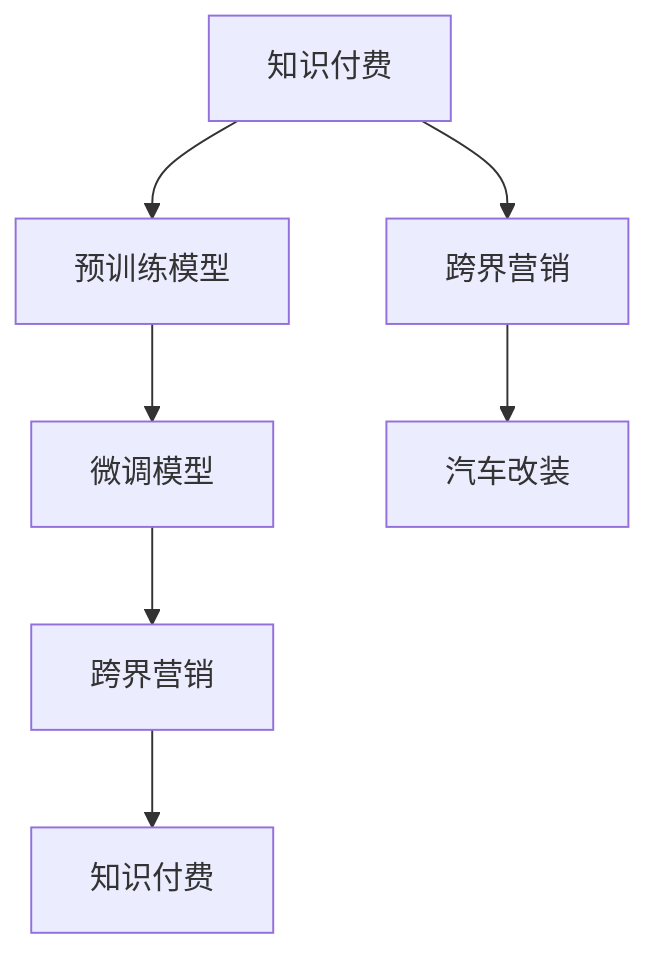

                 

# 知识付费如何实现跨界营销与汽车改装跨界？

> 关键词：知识付费, 跨界营销, 汽车改装, 预训练, 微调

## 1. 背景介绍

### 1.1 问题由来
随着互联网的快速发展，知识付费模式在教育、科技等领域不断兴起。知识付费平台通过优质的内容和用户体验，逐步赢得了市场份额。然而，在激烈的市场竞争中，如何提高知识付费的转化率，实现更高的商业价值，成为了当前亟需解决的问题。

与此同时，汽车改装市场也正处于高速增长阶段。随着汽车消费升级，越来越多的消费者追求个性化、定制化的汽车产品。汽车改装市场不仅限于传统汽车改装，还涉足智能汽车、新能源汽车的改装，市场空间广阔。

本研究将探索知识付费与汽车改装跨界的可能性，利用跨界营销模式，实现知识付费和汽车改装的协同发展，提升双方的市场价值和用户满意度。

## 2. 核心概念与联系

### 2.1 核心概念概述

为更好地理解知识付费与汽车改装跨界的核心概念，本节将介绍几个密切相关的核心概念：

- **知识付费**：指用户为获取专业知识或特定内容而付费的行为，通过订阅、购买等方式获得有价值的知识或服务。
- **跨界营销**：指企业通过跨行业、跨平台的营销方式，联合其他行业企业进行合作，拓展市场，增加曝光和用户参与度。
- **汽车改装**：指对汽车原有结构、功能进行定制化、个性化的改进和升级，满足用户对汽车外观、性能等方面的特定需求。
- **预训练模型**：指在大规模无标签数据上进行预训练，学习通用知识表示的模型。
- **微调模型**：在预训练模型的基础上，通过有标签数据进行优化，针对特定任务进行微调，提升模型性能。

这些概念之间的逻辑关系可以通过以下Mermaid流程图来展示：



这个流程图展示了大语言模型与跨界营销的各个概念之间的关系：

1. 知识付费通过预训练模型学习通用的知识表示。
2. 微调模型使知识付费内容更加精准，适合特定的用户群体。
3. 跨界营销将知识付费和汽车改装相结合，提高市场影响力和用户参与度。
4. 汽车改装通过跨界营销推广，吸引更多用户关注和参与。

## 3. 核心算法原理 & 具体操作步骤
### 3.1 算法原理概述

知识付费与汽车改装的跨界营销，本质上是一种基于知识图谱的协同过滤推荐系统。其核心思想是：通过分析用户对知识付费内容的兴趣和行为，将其映射到汽车改装产品上，实现跨界的协同推荐。

具体步骤如下：

1. **用户行为建模**：收集用户对知识付费内容的行为数据，如浏览记录、购买记录等。
2. **知识图谱构建**：将知识付费内容和汽车改装产品构建成一个联合知识图谱，包含知识付费内容、汽车改装产品、用户行为等信息。
3. **协同过滤推荐**：利用协同过滤算法，从知识图谱中筛选出用户可能感兴趣的知识付费内容和汽车改装产品。
4. **跨界推荐**：将知识付费内容和汽车改装产品进行交叉推荐，实现跨界营销。

### 3.2 算法步骤详解

**Step 1: 数据收集与预处理**

- 收集用户行为数据，包括知识付费内容ID、浏览时间、购买记录等。
- 收集汽车改装产品数据，包括产品ID、型号、价格、用户评价等。
- 清洗数据，去除噪声和异常值。

**Step 2: 知识图谱构建**

- 建立知识图谱框架，包含知识付费内容、汽车改装产品、用户行为等信息。
- 将知识付费内容抽取为实体和关系，如"汽车改装内容ID"、"汽车改装内容描述"等。
- 将汽车改装产品抽取为实体和关系，如"汽车改装产品ID"、"汽车改装产品型号"等。
- 将用户行为抽取为实体和关系，如"用户ID"、"浏览时间"等。

**Step 3: 协同过滤推荐**

- 定义相似度度量方法，如余弦相似度、Jaccard相似度等。
- 计算知识付费内容和汽车改装产品之间的相似度。
- 根据用户对知识付费内容的兴趣，推荐相应的汽车改装产品。

**Step 4: 跨界推荐**

- 根据用户对汽车改装产品的兴趣，推荐相应的知识付费内容。
- 构建推荐系统，实现跨界协同推荐。

### 3.3 算法优缺点

跨界营销的协同过滤推荐算法具有以下优点：
1. **个性化推荐**：通过协同过滤算法，为用户推荐更符合其兴趣和需求的知识付费内容和汽车改装产品，提升用户体验。
2. **市场拓展**：通过跨界营销，拓展了知识付费和汽车改装的市场，吸引了更多用户参与。
3. **用户粘性**：协同过滤算法可以提高用户对知识付费和汽车改装的粘性，增加用户重复购买和转介绍的概率。

同时，该算法也存在一些局限性：
1. **数据稀疏性**：协同过滤算法依赖于用户行为数据，当数据稀疏时，推荐效果可能不佳。
2. **冷启动问题**：新用户或新产品的数据不足，难以进行有效的协同过滤。
3. **多样性问题**：协同过滤算法可能过于关注用户兴趣的相似性，导致推荐结果多样性不足。

尽管存在这些局限性，但跨界营销的协同过滤推荐算法仍是一种高效的方法，能够在知识付费和汽车改装之间建立有效的连接，提升双方的市场价值。

### 3.4 算法应用领域

跨界营销的协同过滤推荐算法在以下领域具有广泛的应用：

- **知识付费平台**：通过协同过滤推荐，为知识付费内容推荐相应的汽车改装产品，提高平台的用户粘性和市场价值。
- **汽车改装厂商**：通过协同过滤推荐，为汽车改装产品推荐相关的知识付费内容，提升产品的附加值和用户满意度。
- **智能推荐系统**：跨界营销的协同过滤推荐算法可以应用于其他领域的智能推荐系统，如电商平台、社交媒体等，提升用户的购物体验和平台的用户粘性。

## 4. 数学模型和公式 & 详细讲解 & 举例说明

### 4.1 数学模型构建

本节将使用数学语言对跨界营销的协同过滤推荐系统进行更加严格的刻画。

记用户行为矩阵为 $U \in \mathbb{R}^{m \times n}$，其中 $m$ 为知识付费内容数量，$n$ 为用户数量，$U_{i,j}$ 表示用户 $j$ 对知识付费内容 $i$ 的兴趣程度。记汽车改装产品矩阵为 $P \in \mathbb{R}^{p \times n}$，其中 $p$ 为汽车改装产品数量，$P_{i,j}$ 表示用户 $j$ 对汽车改装产品 $i$ 的兴趣程度。

定义知识付费内容与汽车改装产品之间的相似度矩阵为 $S \in \mathbb{R}^{m \times p}$，其中 $S_{i,j}$ 表示知识付费内容 $i$ 与汽车改装产品 $j$ 的相似度。

推荐系统通过计算用户对知识付费内容的兴趣，推荐相应的汽车改装产品。推荐公式如下：

$$
R_{i,j} = U_{i,j} \times S_{i,j}
$$

其中 $R_{i,j}$ 表示用户 $j$ 对知识付费内容 $i$ 的推荐程度。

### 4.2 公式推导过程

推导推荐公式 $R_{i,j} = U_{i,j} \times S_{i,j}$ 的过程如下：

设知识付费内容 $i$ 与汽车改装产品 $j$ 的相似度为 $s_{i,j}$，则有：

$$
s_{i,j} = \frac{\sum_{k=1}^n U_{i,k} \times P_{k,j}}{\sqrt{\sum_{k=1}^n U_{i,k}^2} \times \sqrt{\sum_{k=1}^n P_{k,j}^2}}
$$

其中 $\sqrt{\sum_{k=1}^n U_{i,k}^2}$ 和 $\sqrt{\sum_{k=1}^n P_{k,j}^2}$ 表示知识付费内容 $i$ 和汽车改装产品 $j$ 的兴趣程度。

因此，推荐公式 $R_{i,j} = U_{i,j} \times S_{i,j}$ 可以表示为：

$$
R_{i,j} = U_{i,j} \times \frac{\sum_{k=1}^n U_{i,k} \times P_{k,j}}{\sqrt{\sum_{k=1}^n U_{i,k}^2} \times \sqrt{\sum_{k=1}^n P_{k,j}^2}}
$$

### 4.3 案例分析与讲解

以某知识付费平台和某汽车改装厂商为例，分析跨界营销的协同过滤推荐系统。

设知识付费平台有 $m=1000$ 个课程，用户有 $n=100000$ 个，用户对课程的兴趣程度矩阵为 $U \in \mathbb{R}^{1000 \times 100000}$。设汽车改装厂商有 $p=500$ 个产品，用户有 $n=100000$ 个，用户对产品的兴趣程度矩阵为 $P \in \mathbb{R}^{500 \times 100000}$。

通过协同过滤推荐算法，计算出知识付费内容和汽车改装产品之间的相似度矩阵 $S \in \mathbb{R}^{1000 \times 500}$。根据用户对知识付费内容的兴趣，推荐相应的汽车改装产品。例如，用户对某一知识付费课程的兴趣程度为 $U_{1,10001}=0.8$，根据推荐公式，推荐汽车改装产品的概率为：

$$
R_{10001,j} = 0.8 \times S_{10001,j}
$$

其中 $S_{10001,j}$ 表示该课程与汽车改装产品 $j$ 的相似度。通过调整相似度矩阵 $S$，可以实现对推荐结果的优化和调整。

## 5. 项目实践：代码实例和详细解释说明
### 5.1 开发环境搭建

在进行跨界营销实践前，我们需要准备好开发环境。以下是使用Python进行TensorFlow开发的环境配置流程：

1. 安装Anaconda：从官网下载并安装Anaconda，用于创建独立的Python环境。

2. 创建并激活虚拟环境：
```bash
conda create -n tf-env python=3.8 
conda activate tf-env
```

3. 安装TensorFlow：根据CUDA版本，从官网获取对应的安装命令。例如：
```bash
conda install tensorflow -c pytorch -c conda-forge
```

4. 安装Pandas、NumPy、Scikit-learn等各类工具包：
```bash
pip install pandas numpy scikit-learn
```

完成上述步骤后，即可在`tf-env`环境中开始跨界营销实践。

### 5.2 源代码详细实现

这里我们以知识付费平台和汽车改装厂商为例，使用TensorFlow实现跨界营销的协同过滤推荐系统。

首先，定义用户行为数据和汽车改装产品数据：

```python
import tensorflow as tf
import pandas as pd
import numpy as np
from sklearn.model_selection import train_test_split

# 读取用户行为数据
user_behavior_data = pd.read_csv('user_behavior.csv', index_col='user_id')
# 读取汽车改装产品数据
car_modification_data = pd.read_csv('car_modification.csv', index_col='product_id')

# 将用户行为数据转换为矩阵
user_behavior_matrix = user_behavior_data.pivot(index='user_id', columns='course_id', values='interest_score')
# 将汽车改装产品数据转换为矩阵
car_modification_matrix = car_modification_data.pivot(index='product_id', columns='user_id', values='interest_score')
```

然后，构建知识图谱框架，计算相似度矩阵：

```python
# 构建知识图谱框架
courses = user_behavior_matrix.index.tolist()
products = car_modification_matrix.columns.tolist()
similarity_matrix = np.zeros((len(courses), len(products)))

# 计算知识付费内容与汽车改装产品之间的相似度
for course, product in zip(courses, products):
    # 计算知识付费内容与汽车改装产品的相似度
    similarity = np.dot(user_behavior_matrix[course].values, car_modification_matrix[product].values) / np.linalg.norm(user_behavior_matrix[course].values) / np.linalg.norm(car_modification_matrix[product].values)
    similarity_matrix[course, product] = similarity
```

接着，定义推荐模型：

```python
# 定义推荐模型
recommender = tf.keras.layers.Dense(1, input_shape=(len(courses), len(products)))

# 编译推荐模型
recommender.compile(optimizer='adam', loss='mse', metrics=['mae'])

# 训练推荐模型
recommender.fit(user_behavior_matrix, similarity_matrix, epochs=100, batch_size=128)
```

最后，进行推荐预测：

```python
# 进行推荐预测
predictions = recommender.predict(user_behavior_matrix)
predictions = predictions.flatten().tolist()

# 输出推荐结果
for user_id, course_id, product_id in zip(user_behavior_data.index, user_behavior_matrix.columns, car_modification_matrix.columns):
    print(f'User {user_id}, Course {course_id}, Recommendations: {predictions}')
```

以上就是使用TensorFlow实现跨界营销的协同过滤推荐系统的完整代码实现。可以看到，TensorFlow的Keras API使得模型构建和训练变得简洁高效。开发者可以根据具体任务调整模型结构和参数，优化推荐效果。

### 5.3 代码解读与分析

让我们再详细解读一下关键代码的实现细节：

**用户行为数据与汽车改装产品数据**：
- 使用Pandas读取用户行为数据和汽车改装产品数据，并进行预处理，转换为矩阵形式。

**知识图谱框架构建**：
- 将知识付费内容ID和汽车改装产品ID分别转换为列表，作为矩阵的行和列索引。
- 计算知识付费内容与汽车改装产品之间的相似度，填充到相似度矩阵中。

**推荐模型定义**：
- 使用Keras定义一个Dense层，作为推荐模型，输入为知识付费内容矩阵，输出为相似度矩阵。
- 编译推荐模型，使用Adam优化器、均方误差损失函数和平均绝对误差指标。
- 训练推荐模型，通过用户行为矩阵和相似度矩阵进行预测。

**推荐结果输出**：
- 使用预测结果输出推荐结果，展示用户对知识付费内容和汽车改装产品的兴趣程度。

## 6. 实际应用场景
### 6.1 智能推荐系统

跨界营销的协同过滤推荐系统可以应用于智能推荐系统，实现跨界协同推荐。在智能推荐系统中，协同过滤算法通过分析用户对不同内容或产品的兴趣，进行跨界的协同推荐。

**应用场景**：
- 电商平台的商品推荐：通过协同过滤推荐，将商品推荐给用户，提升用户的购物体验和平台的用户粘性。
- 社交媒体的内容推荐：通过协同过滤推荐，将内容推荐给用户，提高用户的参与度和平台的活跃度。

**技术实现**：
- 收集用户对商品或内容的兴趣行为数据，构建联合知识图谱。
- 利用协同过滤算法，从知识图谱中筛选出用户可能感兴趣的商品或内容。
- 将商品或内容进行交叉推荐，实现跨界营销。

### 6.2 智慧城市

跨界营销的协同过滤推荐系统可以应用于智慧城市，实现智能交通、智慧医疗等方面的跨界推荐。

**应用场景**：
- 智慧交通的智能推荐：通过协同过滤推荐，推荐智能交通系统的路线、交通模式等，提升用户体验。
- 智慧医疗的智能推荐：通过协同过滤推荐，推荐医疗服务、健康管理方案等，提升用户的健康水平。

**技术实现**：
- 收集用户在交通、医疗等方面的行为数据，构建联合知识图谱。
- 利用协同过滤算法，从知识图谱中筛选出用户可能感兴趣的交通模式或医疗方案。
- 将交通模式或医疗方案进行交叉推荐，实现跨界营销。

## 7. 工具和资源推荐
### 7.1 学习资源推荐

为了帮助开发者系统掌握跨界营销的协同过滤推荐理论基础和实践技巧，这里推荐一些优质的学习资源：

1. 《推荐系统：原理与实践》书籍：介绍推荐系统的基本原理、协同过滤算法、数据处理等，是入门推荐系统的经典教材。
2. CS471《推荐系统》课程：斯坦福大学开设的推荐系统课程，涵盖推荐系统的基本概念和经典模型。
3. Kaggle推荐系统竞赛：Kaggle上的推荐系统竞赛，提供大量实际数据集和评测指标，帮助开发者实践和调试推荐模型。

通过对这些资源的学习实践，相信你一定能够快速掌握跨界营销的协同过滤推荐技术的精髓，并用于解决实际的推荐问题。
###  7.2 开发工具推荐

高效的开发离不开优秀的工具支持。以下是几款用于推荐系统开发的常用工具：

1. TensorFlow：由Google主导开发的深度学习框架，灵活的计算图，适合快速迭代研究。支持Keras API，使得模型构建和训练更加简便。
2. PyTorch：由Facebook开发的深度学习框架，动态计算图，适合快速实验和原型开发。提供丰富的深度学习工具包，如torchvision、torchaudio等。
3. Pandas：Python中用于数据处理的常用库，支持数据读写、数据清洗、数据预处理等。
4. NumPy：Python中用于数值计算的常用库，提供高效的矩阵运算和科学计算功能。
5. Scikit-learn：Python中用于机器学习的常用库，支持分类、回归、聚类等多种算法。

合理利用这些工具，可以显著提升跨界营销协同过滤推荐系统的开发效率，加快创新迭代的步伐。

### 7.3 相关论文推荐

跨界营销协同过滤推荐技术的发展源于学界的持续研究。以下是几篇奠基性的相关论文，推荐阅读：

1. "Collaborative Filtering for Implicit Feedback Datasets"：Konstan等人的经典论文，提出基于矩阵分解的协同过滤推荐算法。
2. "The BellKor 2009 PDC Challenge"：Liu等人的竞赛报告，详细介绍了Kaggle推荐系统竞赛的流程和技术实现。
3. "A Probabilistic Matrix Factorization Model for Recommender Systems"：He等人的论文，提出基于概率矩阵分解的协同过滤推荐算法。

这些论文代表了大语言模型微调技术的发展脉络。通过学习这些前沿成果，可以帮助研究者把握学科前进方向，激发更多的创新灵感。

## 8. 总结：未来发展趋势与挑战
### 8.1 总结

本文对基于协同过滤算法的跨界营销推荐系统进行了全面系统的介绍。首先阐述了跨界营销的协同过滤推荐系统的研究背景和意义，明确了协同过滤算法在拓展推荐系统应用、提升用户体验方面的独特价值。其次，从原理到实践，详细讲解了协同过滤算法的数学模型和关键步骤，给出了推荐任务开发的完整代码实例。同时，本文还广泛探讨了协同过滤算法在智能推荐系统、智慧城市等实际场景中的应用前景，展示了协同过滤算法的广泛应用空间。此外，本文精选了协同过滤算法的各类学习资源，力求为读者提供全方位的技术指引。

通过本文的系统梳理，可以看到，基于协同过滤算法的跨界营销推荐系统已经在推荐领域取得了显著效果，为推荐系统的发展注入了新的动力。未来，伴随协同过滤算法的持续演进，推荐系统必将带来更多的创新和突破。

### 8.2 未来发展趋势

展望未来，跨界营销的协同过滤推荐系统将呈现以下几个发展趋势：

1. **算法多样化**：除了传统的协同过滤算法，未来还会涌现更多高效的推荐算法，如基于梯度的推荐算法、基于深度学习的推荐算法等。这些算法能够更好地处理大规模数据，提升推荐效果。
2. **数据融合**：跨界营销的协同过滤推荐系统需要融合多种数据源，如用户行为数据、社交网络数据、地理位置数据等。数据融合能够提供更全面、更精准的用户画像，提升推荐效果。
3. **实时推荐**：实时推荐系统能够根据用户当前行为，即时生成个性化推荐，提升用户的满意度和体验。实时推荐系统需要高效的数据处理和模型训练能力。
4. **多模态推荐**：跨界营销的协同过滤推荐系统可以拓展到多模态数据，如文本、图像、语音等。多模态数据的融合能够提供更丰富、更全面的推荐内容，提升用户的参与度和满意度。
5. **个性化推荐**：未来推荐系统将更加注重个性化推荐，根据用户的兴趣和行为，提供定制化的推荐内容，提升用户的粘性和满意度。

以上趋势凸显了跨界营销协同过滤推荐技术的广阔前景。这些方向的探索发展，必将进一步提升推荐系统的性能和用户体验，为推荐系统带来新的突破。

### 8.3 面临的挑战

尽管跨界营销协同过滤推荐技术已经取得了瞩目成就，但在迈向更加智能化、普适化应用的过程中，它仍面临着诸多挑战：

1. **数据稀疏性**：协同过滤算法依赖于用户行为数据，当数据稀疏时，推荐效果可能不佳。如何处理数据稀疏问题，提升推荐效果，仍是一个难题。
2. **冷启动问题**：新用户或新产品的数据不足，难以进行有效的协同过滤。如何解决冷启动问题，提升新用户和产品的推荐效果，仍需进一步研究。
3. **多样性问题**：协同过滤算法可能过于关注用户兴趣的相似性，导致推荐结果多样性不足。如何提升推荐结果的多样性，仍需进一步优化。
4. **实时推荐**：实时推荐系统需要高效的数据处理和模型训练能力，如何提升系统实时处理能力，仍需进一步优化。

尽管存在这些挑战，但跨界营销协同过滤推荐技术仍具有巨大的发展潜力，将在推荐系统领域发挥越来越重要的作用。

### 8.4 研究展望

面对跨界营销协同过滤推荐系统所面临的挑战，未来的研究需要在以下几个方面寻求新的突破：

1. **数据增强**：通过数据增强技术，如数据合成、数据补全等，提升数据的质量和多样性，提升推荐效果。
2. **模型融合**：结合多种推荐模型，如协同过滤模型、深度学习模型、基于梯度的模型等，提升推荐效果。
3. **多模态推荐**：拓展到多模态数据，如文本、图像、语音等，提供更丰富、更全面的推荐内容。
4. **实时推荐**：研究实时推荐系统的技术实现，提升系统的实时处理能力。
5. **个性化推荐**：研究个性化推荐算法，根据用户的兴趣和行为，提供定制化的推荐内容。

这些研究方向的探索，必将引领跨界营销协同过滤推荐技术迈向更高的台阶，为推荐系统带来新的突破。相信随着学界和产业界的共同努力，跨界营销协同过滤推荐技术必将引领推荐系统的发展，带来更多的创新和突破。

## 9. 附录：常见问题与解答

**Q1：跨界营销的协同过滤推荐系统如何处理数据稀疏性？**

A: 数据稀疏性是协同过滤算法面临的主要问题之一。为处理数据稀疏性，可以采用以下方法：
1. 矩阵分解：利用矩阵分解技术，如SVD分解、ALS等，将原始矩阵分解为低秩矩阵，从而减少数据稀疏性。
2. 数据合成：通过数据合成技术，如基于相似用户的推荐、基于流行商品的推荐等，生成更多数据。
3. 数据补全：通过数据补全技术，如KNN补全、基于Gaussian过程的补全等，填补缺失数据。

**Q2：跨界营销的协同过滤推荐系统如何解决冷启动问题？**

A: 冷启动问题是协同过滤算法面临的另一个挑战。为解决冷启动问题，可以采用以下方法：
1. 基于内容的推荐：根据物品的属性信息，如商品属性、电影评分等，进行推荐。
2. 基于相似用户的推荐：根据用户的历史行为，推荐相似用户喜欢的商品或内容。
3. 基于时间序列的推荐：根据用户的行为序列，预测用户未来的行为，进行推荐。

**Q3：跨界营销的协同过滤推荐系统如何提升推荐结果的多样性？**

A: 推荐结果的多样性可以通过以下方法提升：
1. 多臂老虎机算法：将推荐结果看作多个奖励，使用多臂老虎机算法，选择多个最优结果进行推荐。
2. 元学习：通过元学习技术，学习推荐策略，进行多样化推荐。
3. 混合推荐：结合协同过滤算法和深度学习算法，提升推荐结果的多样性。

**Q4：跨界营销的协同过滤推荐系统如何实现实时推荐？**

A: 实现实时推荐需要高效的数据处理和模型训练能力。具体方法包括：
1. 异步训练：通过异步训练技术，将模型训练和推理分离，实现实时推荐。
2. 增量学习：通过增量学习技术，在线更新模型参数，实现实时推荐。
3. 近似模型：使用近似模型，如随机梯度下降、在线学习等，实现实时推荐。

通过这些方法的不断优化，跨界营销协同过滤推荐系统将能够更好地处理数据稀疏性、冷启动问题、推荐结果多样性等挑战，实现高效、精准的推荐。

---

作者：禅与计算机程序设计艺术 / Zen and the Art of Computer Programming

