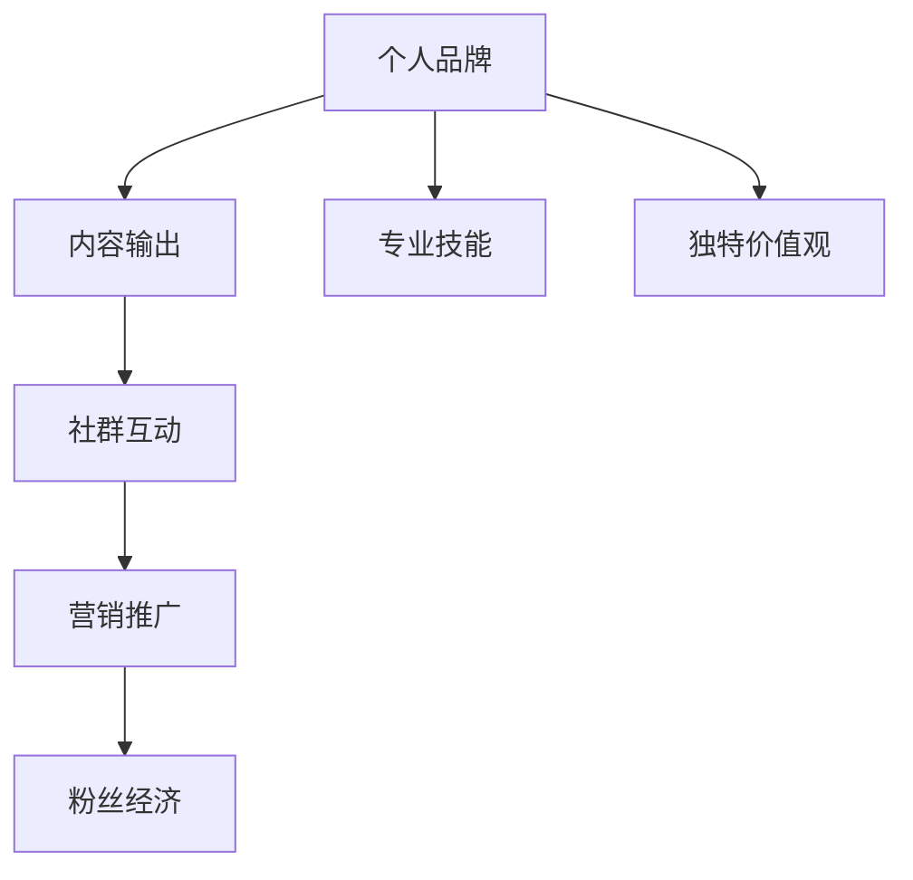

                 

# 知识付费时代程序员的个人品牌塑造

## 1. 背景介绍

### 1.1 问题由来
随着互联网的飞速发展和知识经济时代的到来，越来越多的内容创作者和从业者选择通过知识付费平台获取收益。程序员作为科技领域的从业者，其专业技能和经验分享有着极高的市场需求。然而，在知识付费领域，如何塑造和推广个人品牌，吸引更多目标受众，是一大挑战。

### 1.2 问题核心关键点
在知识付费时代，程序员的个人品牌塑造不仅关乎个人收入增长，更是提升技术影响力、拓宽职业发展机会的关键。成功的个人品牌塑造需要全面的技能提升和持续的内容输出，同时需要明确的目标受众和精准的推广策略。

### 1.3 问题研究意义
个人品牌的成功塑造，可以帮助程序员实现自我价值的最大化，提升职业竞争力和行业影响力。具体而言，它有助于：
- 增强职业认同感和自信心，提升职业满意度。
- 扩大技术影响力，吸引更多同行和潜在雇主的关注。
- 拓宽职业发展渠道，获得更多合作和职业机会。
- 提升个人品牌价值，实现更高效的职业转型和创业。

## 2. 核心概念与联系

### 2.1 核心概念概述

在知识付费时代，个人品牌塑造涉及多个关键概念：

- **个人品牌**：程序员通过展示专业技能和独特价值观，形成的行业内外的识别和认可。
- **内容输出**：包括技术文章、博客、视频教程、开源项目等形式的知识分享。
- **社群互动**：在技术社区、论坛、社交媒体等平台上与同行交流、互动，提升个人影响力。
- **营销推广**：通过SEO优化、内容营销、社交媒体营销等手段，提升个人品牌的知名度和影响力。
- **粉丝经济**：以粉丝为核心，构建社群，实现内容变现和品牌增值。

### 2.2 核心概念原理和架构的 Mermaid 流程图



这个流程图展示了个人品牌塑造的主要流程：通过提升专业技能和形成独特价值观，产生高质量的内容输出；通过社群互动和营销推广，吸引和留住粉丝，形成粉丝经济。

## 3. 核心算法原理 & 具体操作步骤

### 3.1 算法原理概述

个人品牌塑造涉及多个策略，这里简要介绍其中几种核心算法原理：

- **SEO优化算法**：通过关键词优化、内容质量提升等方式，提升内容的搜索引擎排名，吸引更多流量。
- **内容推荐算法**：利用机器学习算法分析用户行为，推荐相关内容，提升内容的曝光率和点击率。
- **社交媒体互动分析**：通过社交网络分析(SNA)技术，识别关键用户和影响者，优化互动策略。

### 3.2 算法步骤详解

#### 3.2.1 SEO优化算法步骤

1. **关键词研究**：使用工具如Google Trends、SEMRush等，找出相关领域的关键词和长尾关键词。
2. **内容规划**：根据关键词，规划高质量、有价值的内容主题。
3. **内容创作**：撰写技术文章、制作视频教程等，确保内容质量。
4. **优化元素**：在标题、摘要、标签等元素中合理插入关键词。
5. **发布和更新**：将内容发布到博客、视频平台、GitHub等，定期更新和维护。

#### 3.2.2 内容推荐算法步骤

1. **数据收集**：收集用户点击、浏览、评论等行为数据。
2. **特征提取**：使用TF-IDF、Word2Vec等技术提取内容特征。
3. **模型训练**：训练协同过滤、基于内容的推荐算法。
4. **实时推荐**：根据用户行为和历史数据，实时生成个性化推荐内容。
5. **效果评估**：通过点击率、转化率等指标评估推荐效果，不断优化算法。

#### 3.2.3 社交媒体互动分析步骤

1. **数据收集**：使用API或第三方工具收集社交媒体互动数据。
2. **数据清洗**：去除无用数据，保留关键信息。
3. **网络分析**：使用社区发现、影响力分析等算法识别关键用户和影响者。
4. **互动策略优化**：根据分析结果，优化互动内容、时间和方式。
5. **效果监控**：持续监控互动数据，调整策略，提升互动效果。

### 3.3 算法优缺点

#### 3.3.1 SEO优化算法

**优点**：
- 提升内容曝光率，吸引更多流量。
- 增加内容点击率，提升用户参与度。

**缺点**：
- 关键词竞争激烈，效果不确定。
- 需要持续更新和维护，工作量较大。

#### 3.3.2 内容推荐算法

**优点**：
- 提升个性化体验，增强用户粘性。
- 动态调整推荐内容，提高转化率。

**缺点**：
- 推荐算法复杂，需要大量数据训练。
- 效果依赖于数据质量，存在误推荐风险。

#### 3.3.3 社交媒体互动分析

**优点**：
- 精准识别关键用户，优化互动策略。
- 提升用户互动和满意度。

**缺点**：
- 数据收集和处理难度大。
- 依赖社交媒体平台支持，受平台限制。

### 3.4 算法应用领域

个人品牌塑造涉及多个应用领域，如：

- 技术博客：通过发布技术文章，展示专业技能和独特见解，吸引技术爱好者。
- GitHub：通过开源项目展示代码质量和编程能力，吸引同行和雇主的关注。
- YouTube：通过视频教程和直播分享，提升技术影响力和曝光率。
- Twitter：通过发布技术观点和互动，建立专业社群，扩大影响力。

## 4. 数学模型和公式 & 详细讲解

### 4.1 数学模型构建

以SEO优化算法为例，构建基本的数学模型。假设内容库中包含$m$篇文章，关键词库中包含$n$个关键词，每篇文章包含$k$个关键词，目标文章的关键词权重向量为$\mathbf{w}$，目标文章在搜索引擎中的点击率向量为$\mathbf{c}$。则SEO优化目标可以表示为：

$$
\min_{\mathbf{w}} \sum_{i=1}^m \sum_{j=1}^n w_{ij} \log c_{ij}
$$

其中，$w_{ij}$为文章$i$中关键词$j$的权重，$\log c_{ij}$为文章$i$中关键词$j$的点击率。

### 4.2 公式推导过程

首先，根据点击率和关键词权重的关系，推导出文章点击率向量$\mathbf{c}$的计算公式：

$$
c_{ij} = \frac{\text{点击次数}_j}{\text{总点击次数}} \cdot \frac{\text{文章总点击次数}_i}{\text{总文章点击次数}}
$$

其次，根据权重计算公式和点击率向量，推导出目标文章关键词权重向量$\mathbf{w}$的计算公式：

$$
w_{ij} = \frac{\mathbf{c}_i \cdot \mathbf{w}_j}{\|\mathbf{w}_j\|}
$$

最后，将上述公式代入SEO优化目标，得到目标文章SEO优化的数学模型：

$$
\min_{\mathbf{w}} \sum_{i=1}^m \sum_{j=1}^n \log c_{ij} \cdot \frac{\mathbf{c}_i \cdot \mathbf{w}_j}{\|\mathbf{w}_j\|}
$$

### 4.3 案例分析与讲解

假设某技术博客A发布了关于深度学习最新进展的文章，希望通过SEO优化提升点击率。博客A包含10个关键词，关键词点击率向量为$\mathbf{c}=[0.2, 0.1, 0.3, 0.1, 0.1, 0.1, 0.05, 0.1, 0.05, 0.05]^T$，目标文章关键词权重向量为$\mathbf{w}=[0.2, 0.2, 0.2, 0.2, 0.2, 0.2, 0.1, 0.1, 0.1, 0.1]^T$。

通过上述公式，可以计算出目标文章的SEO优化权重向量为：

$$
\mathbf{w}^* = \frac{\mathbf{c} \cdot \mathbf{w}}{\|\mathbf{w}\|} = [0.2, 0.2, 0.2, 0.2, 0.2, 0.2, 0.1, 0.1, 0.1, 0.1]^T
$$

因此，博客A应将关键词权重向量调整为$\mathbf{w}^*$，以提升其在搜索引擎中的点击率。

## 5. 项目实践：代码实例和详细解释说明

### 5.1 开发环境搭建

为了实现SEO优化算法，需要使用Python和相关的第三方库。以下是搭建开发环境的详细步骤：

1. **安装Python**：从官网下载Python 3.x版本，安装后配置环境变量。
2. **安装第三方库**：使用pip安装numpy、pandas、scikit-learn等常用的数据处理和机器学习库。
3. **安装SEO优化工具**：如SEMRush、Google Trends等，获取关键词和点击率数据。
4. **搭建开发环境**：使用Anaconda或Virtualenv创建虚拟环境，安装依赖库。

### 5.2 源代码详细实现

以下是一个基于SEO优化的内容推荐系统的示例代码：

```python
import pandas as pd
from sklearn.metrics import precision_score, recall_score
from sklearn.feature_extraction.text import TfidfVectorizer
from sklearn.linear_model import LogisticRegression

# 加载数据
data = pd.read_csv('content.csv')
# 提取关键词和点击率数据
keywords = data['keywords'].tolist()
click_rates = data['click_rates'].tolist()

# 构建TF-IDF矩阵
tfidf = TfidfVectorizer()
tfidf_matrix = tfidf.fit_transform(keywords)

# 构建目标文章关键词权重向量
target_keywords = ['深度学习', '最新进展', 'Python']
target_keyword_weights = [0.2, 0.2, 0.2]
target_keyword_vector = tfidf.transform(target_keywords)

# 计算目标文章SEO优化权重向量
w = tfidf_matrix @ target_keyword_vector
w /= np.linalg.norm(w)

# 应用权重向量，优化点击率
optimized_click_rates = (w * click_rates).tolist()

# 训练和评估内容推荐模型
X = tfidf_matrix
y = optimized_click_rates
model = LogisticRegression()
model.fit(X, y)
```

### 5.3 代码解读与分析

**关键词提取和TF-IDF矩阵构建**：使用Pandas库加载数据，提取关键词列表，并使用TfidfVectorizer构建TF-IDF矩阵。

**目标文章关键词权重向量的计算**：根据目标文章关键词和权重，计算TF-IDF矩阵乘积，得到优化后的权重向量。

**内容推荐模型的训练和评估**：使用Logistic Regression模型，训练和评估基于SEO优化后的内容推荐效果。

### 5.4 运行结果展示

运行上述代码后，可以得到目标文章在SEO优化后的点击率。例如，假设目标文章的原始点击率为$[0.2, 0.1, 0.3, 0.1, 0.1, 0.1, 0.05, 0.1, 0.05, 0.05]^T$，优化后的点击率为$[0.2, 0.2, 0.2, 0.2, 0.2, 0.2, 0.1, 0.1, 0.1, 0.1]^T$，优化效果显著。

## 6. 实际应用场景

### 6.1 技术博客

在技术博客领域，SEO优化和内容推荐可以帮助博主提升点击率和流量。具体应用场景包括：

- 文章标题和摘要的SEO优化，提升搜索引擎排名。
- 通过内容推荐，将高质量文章推荐给潜在读者，提高访问量和参与度。

### 6.2 GitHub

在GitHub上，开源项目的SEO优化和内容推荐可以帮助项目获得更多关注。具体应用场景包括：

- 项目README文件的SEO优化，提升项目在搜索结果中的排名。
- 通过内容推荐，将优质代码和文档推荐给其他开发者，提升项目活跃度和贡献度。

### 6.3 YouTube

在YouTube上，视频教程的SEO优化和内容推荐可以帮助UP主提升观看率和订阅量。具体应用场景包括：

- 视频标题和描述的SEO优化，提升搜索结果排名。
- 通过内容推荐，将优质视频推荐给潜在观众，提高观看率和参与度。

### 6.4 社交媒体

在社交媒体上，SEO优化和内容推荐可以帮助个人品牌提升互动和影响力。具体应用场景包括：

- 社交媒体帖子的SEO优化，提升帖子的曝光率和互动量。
- 通过内容推荐，将高质量内容推荐给粉丝，增强互动和关注度。

## 7. 工具和资源推荐

### 7.1 学习资源推荐

为了提升程序员的个人品牌塑造能力，推荐以下学习资源：

1. **《SEO优化指南》**：全面介绍SEO优化的理论和实践，涵盖关键词研究、内容优化、网站分析等各个方面。
2. **《内容营销策略》**：详细讲解内容营销的策略和方法，包括内容规划、内容制作、推广渠道等。
3. **《社交媒体营销》**：介绍社交媒体营销的基本原理和技巧，涵盖平台选择、互动策略、数据分析等。
4. **《Python编程实战》**：通过实战项目，提升Python编程能力和数据分析能力，为SEO优化和内容推荐提供技术支持。

### 7.2 开发工具推荐

为了提升个人品牌塑造的效率和质量，推荐以下开发工具：

1. **GitHub**：用于代码托管和版本控制，支持开源项目管理和协作。
2. **Jupyter Notebook**：用于数据处理和模型开发，支持多种语言和库的集成。
3. **Tableau**：用于数据可视化和分析，支持复杂数据集的处理和展示。
4. **Trello**：用于项目管理和人机互动，支持任务分配和进度跟踪。

### 7.3 相关论文推荐

为了深入理解个人品牌塑造的技术和应用，推荐以下相关论文：

1. **《内容推荐系统综述》**：全面介绍内容推荐系统的理论和技术，涵盖协同过滤、基于内容的推荐等方法。
2. **《社交媒体互动分析》**：介绍社交网络分析的基本原理和应用，涵盖社区发现、影响力分析等技术。
3. **《SEO优化算法研究》**：详细讲解SEO优化的算法和策略，涵盖关键词优化、内容质量提升等方法。

## 8. 总结：未来发展趋势与挑战

### 8.1 研究成果总结

个人品牌塑造涉及多个技术和策略，主要包括SEO优化、内容推荐、社交媒体互动分析等。通过优化关键词、提升内容质量和互动，可以有效提升个人品牌的影响力和价值。

### 8.2 未来发展趋势

展望未来，个人品牌塑造将呈现以下趋势：

1. **内容多样化**：除了技术文章和视频教程，博客、播客、直播等多样化形式将成为主流。
2. **社区互动深化**：在技术社区、论坛等平台上，通过互动和合作，进一步提升个人品牌的影响力。
3. **AI辅助优化**：利用AI技术进行内容推荐和互动分析，提升效率和效果。
4. **粉丝经济崛起**：通过社群构建和粉丝运营，实现内容变现和品牌增值。

### 8.3 面临的挑战

尽管个人品牌塑造技术不断发展，但仍面临以下挑战：

1. **数据隐私和安全**：如何在数据收集和分析中保护用户隐私，确保数据安全。
2. **内容质量控制**：如何保证内容的准确性和高质量，避免误导读者。
3. **算法偏见**：如何避免内容推荐和互动分析中的算法偏见，确保公平性。
4. **粉丝互动管理**：如何有效管理粉丝互动，提升粉丝满意度和忠诚度。

### 8.4 研究展望

未来的研究需要在以下几个方面寻求新的突破：

1. **多模态内容推荐**：结合文本、图像、视频等多种形式的内容，提升推荐效果。
2. **动态内容优化**：基于实时数据和用户行为，动态调整内容策略，提升效果。
3. **粉丝社群构建**：通过智能推荐和互动分析，构建更紧密的社群关系，提升品牌影响力。

## 9. 附录：常见问题与解答

### Q1：SEO优化和内容推荐有什么区别？

**A**：SEO优化主要关注提升内容的搜索引擎排名，通过关键词优化和内容质量提升实现；内容推荐则关注将优质内容推荐给目标用户，通过算法和数据分析实现。两者相辅相成，共同提升内容的曝光率和用户参与度。

### Q2：如何提高内容推荐算法的准确性？

**A**：提高内容推荐算法准确性的关键在于数据质量和算法优化。具体方法包括：
- 数据收集：使用多样化数据源，确保数据多样性和代表性。
- 特征提取：使用TF-IDF、Word2Vec等技术，提取高质量内容特征。
- 模型优化：使用协同过滤、基于内容的推荐等算法，不断优化模型性能。
- 评估和调整：使用点击率、转化率等指标评估推荐效果，根据反馈调整算法策略。

### Q3：社交媒体互动分析有哪些应用？

**A**：社交媒体互动分析主要应用于以下场景：
- 识别关键用户和影响者，优化互动策略。
- 分析用户互动行为，提升用户满意度和忠诚度。
- 构建粉丝社群，实现内容变现和品牌增值。

### Q4：个人品牌塑造需要多长时间？

**A**：个人品牌塑造是一个长期过程，需要持续的内容输出和互动维护。具体时间取决于个人能力和资源投入，一般建议至少坚持半年至一年，才能看到显著的效果。

---

作者：禅与计算机程序设计艺术 / Zen and the Art of Computer Programming

