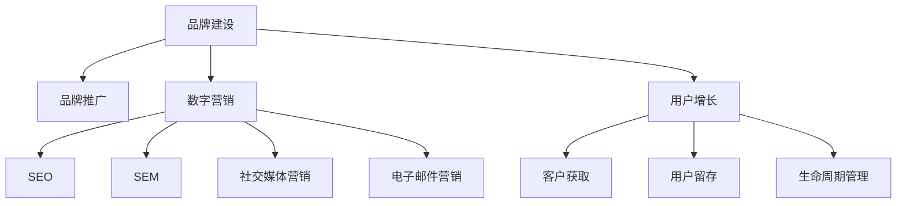

                 

# 知识付费赚钱的品牌品牌运营与品牌推广策略

> 关键词：知识付费,品牌运营,品牌推广,数字营销,用户增长,市场营销,客户关系管理

## 1. 背景介绍

随着互联网和智能手机的普及，知识付费市场逐渐兴起。互联网公司借助知识付费平台，为用户提供丰富的内容资源，在满足用户学习需求的同时，也实现了商业价值的变现。然而，当前知识付费平台在品牌建设、客户运营等方面还存在诸多问题，导致用户流失率高，无法实现持续盈利。

为解决这些问题，本文将从品牌运营和品牌推广两个角度，提出全面的解决方案。帮助知识付费平台实现用户增长和品牌价值提升，最终实现商业目标。

## 2. 核心概念与联系

### 2.1 核心概念概述

- **品牌(Branding)**：品牌运营的核心在于塑造品牌形象、提升品牌知名度和美誉度，以形成独特的市场竞争优势。品牌建设不仅关乎企业形象，更与用户体验和口碑密切相关。
- **推广(Promotion)**：推广是通过多种渠道和手段，将品牌和产品信息传递给目标用户，以吸引用户关注和提高销售量。有效的推广策略可以显著提升品牌曝光度和用户转化率。
- **数字营销(Digital Marketing)**：数字营销是指在互联网和移动端等数字渠道上，利用数据和技术的优势进行市场推广，包括SEO、SEM、社交媒体营销、电子邮件营销等。
- **用户增长(User Acquisition)**：用户增长专注于通过各种方法获取新用户，并持续提升用户留存率和生命周期价值。用户增长不仅仅关注用户数量的增长，更注重用户质量和活跃度的提升。
- **客户关系管理(CRM)**：CRM旨在通过管理客户信息和交互记录，为客户提供定制化服务和个性化体验，提升客户满意度和忠诚度。

这些核心概念相互关联，共同构成了知识付费品牌运营和推广的基础框架。品牌运营侧重于内部管理与优化，通过提升品牌形象和用户满意度，增强市场竞争力；而品牌推广侧重于外部传播与营销，通过高效传播和精准触达，提升品牌曝光率和市场影响力。

### 2.2 核心概念原理和架构的 Mermaid 流程图



此流程图展示了品牌建设、品牌推广、数字营销、用户增长、客户关系管理之间的联系与交互。品牌建设是内部运营的核心，而品牌推广是外部营销的主要手段。数字营销和用户增长是品牌推广的两个主要渠道，通过多种数字手段吸引和留存用户。客户关系管理则贯穿于品牌建设和推广的各个环节，为品牌运营提供数据支持和用户洞察。

## 3. 核心算法原理 & 具体操作步骤

### 3.1 算法原理概述

知识付费平台品牌运营与推广的核心在于通过数据驱动的方式，提升品牌知名度和用户满意度。品牌运营主要依赖于用户反馈和市场分析，通过不断优化产品和服务，提高用户粘性和忠诚度。而品牌推广则通过多渠道传播和营销活动，迅速提升品牌曝光度和市场影响力。

品牌运营和推广的算法原理可以总结如下：
- **品牌运营**：基于用户行为数据和市场调研，进行需求分析和产品优化，提升用户体验和满意度。
- **品牌推广**：通过A/B测试和数据分析，选择最佳营销渠道和内容形式，最大化用户覆盖率和转化率。

### 3.2 算法步骤详解

#### 3.2.1 品牌运营算法步骤

1. **数据收集与分析**：
   - 收集用户行为数据（如浏览记录、购买行为、评价反馈等）。
   - 通过数据挖掘和聚类分析，识别用户需求和痛点。
   - 分析市场竞争环境和用户特征，确定品牌定位和核心竞争力。

2. **产品优化与创新**：
   - 根据用户反馈和市场分析结果，优化现有产品和服务。
   - 引入创新功能或内容，提升用户满意度和品牌形象。
   - 定期进行A/B测试，验证改进效果，持续迭代优化。

3. **客户关系管理**：
   - 建立详细的客户档案，记录用户交互历史和行为数据。
   - 通过CRM系统，提供个性化的服务和推荐，增强用户粘性。
   - 定期开展客户满意度调查，收集反馈，改进服务质量。

#### 3.2.2 品牌推广算法步骤

1. **市场调研与目标定位**：
   - 进行市场调研，了解目标用户群体和消费习惯。
   - 确定品牌推广的目标和关键指标，如用户增长、品牌曝光度等。

2. **渠道选择与内容设计**：
   - 根据目标用户群体，选择适合的数字营销渠道（如SEO、SEM、社交媒体、电子邮件等）。
   - 设计有吸引力的内容形式（如博客文章、视频、直播等），提高用户参与度。
   - 制定推广计划，确定推广时间、频率和预算。

3. **推广实施与效果监控**：
   - 通过多渠道发布推广内容，吸引目标用户关注。
   - 实时监控推广效果，使用数据分析工具（如Google Analytics、Kissmetrics等）评估推广效果。
   - 根据数据分析结果，调整推广策略，优化效果。

### 3.3 算法优缺点

#### 3.3.1 品牌运营的优缺点

**优点**：
- 以用户为中心，提升用户体验和满意度。
- 通过数据驱动的优化，持续提升品牌价值。
- 增强用户粘性和忠诚度，降低用户流失率。

**缺点**：
- 数据收集和分析成本较高，需要强大的技术支持。
- 产品优化和创新周期较长，短期内难以见效。
- 客户关系管理复杂，需要高水平的人力资源。

#### 3.3.2 品牌推广的优缺点

**优点**：
- 通过高效传播和精准触达，迅速提升品牌曝光度和市场影响力。
- 多样化渠道选择和内容形式，提高用户参与度和转化率。
- 可以快速吸引大量新用户，实现短期内的用户增长。

**缺点**：
- 推广效果依赖于渠道选择和内容设计，难以保证一致性。
- 过度依赖外部传播，难以形成长期稳定的用户基础。
- 推广预算和资源有限，需持续投入，否则效果易受影响。

### 3.4 算法应用领域

品牌运营和推广的算法原理和步骤，适用于知识付费平台、在线教育、内容创作等依赖于知识传播和用户互动的行业。通过品牌建设和市场推广，这些平台可以实现用户增长和品牌价值提升，最终实现商业目标。

## 4. 数学模型和公式 & 详细讲解 & 举例说明

### 4.1 数学模型构建

品牌运营和推广的数学模型主要围绕用户增长和品牌价值提升展开，具体如下：

1. **用户增长模型**：
   - 用户增长模型（User Acquisition Model）用于预测新用户获取量，公式为：
     $$
     U(t) = \sum_{i=1}^{n} C_i R_i(t)
     $$
     其中，$U(t)$ 为$t$时刻用户总数，$C_i$为第$i$个营销渠道的成本，$R_i(t)$为该渠道在$t$时刻的用户获取率。

2. **品牌价值模型**：
   - 品牌价值模型（Brand Value Model）用于评估品牌影响力，公式为：
     $$
     BV = \sum_{j=1}^{m} W_j V_j
     $$
     其中，$BV$为品牌价值，$W_j$为第$j$个指标的权重，$V_j$为该指标的得分。

### 4.2 公式推导过程

#### 4.2.1 用户增长模型推导

用户增长模型基于多渠道推广和A/B测试的结果，可以采用回归分析方法进行推导：
- 将不同渠道的用户获取量$R_i(t)$表示为：
   $$
   R_i(t) = \alpha_i \exp(\beta_i t)
   $$
   其中，$\alpha_i$为渠道初始用户获取率，$\beta_i$为渠道增长率。
- 将用户总获取量$U(t)$表示为各渠道的用户获取率之和：
   $$
   U(t) = \sum_{i=1}^{n} \alpha_i \exp(\beta_i t)
   $$
   通过求解最大似然估计，可得各渠道的用户获取率$\alpha_i$和增长率$\beta_i$。

#### 4.2.2 品牌价值模型推导

品牌价值模型基于用户满意度和市场调研结果，可以采用层次分析法（AHP）进行推导：
- 将品牌价值分解为多个指标（如用户满意度、品牌知名度、用户留存率等）。
- 通过层次分析法计算各指标的权重$W_j$。
- 根据市场调研结果，计算各指标的得分$V_j$。
- 综合权重和得分，计算品牌价值$BV$。

### 4.3 案例分析与讲解

#### 4.3.1 用户增长案例

某知识付费平台通过SEO和社交媒体推广，每月获取新用户3000人，SEO渠道的成本为1000元/月，社交媒体渠道的成本为2000元/月。使用用户增长模型进行预测，得到不同时间段的用户获取量如下：

| 时间    | 用户数 |
| ------ | ---- |
| 第1个月 | 3000 |
| 第2个月 | 4000 |
| 第3个月 | 5000 |
| ...    | ...  |

#### 4.3.2 品牌价值案例

某在线教育平台通过调查问卷和用户反馈，得到用户满意度和品牌知名度的评分，并根据层次分析法计算各指标的权重。使用品牌价值模型计算得到品牌价值提升情况如下：

| 时间    | 用户满意度 | 品牌知名度 | 用户留存率 |
| ------ | ---- | ---- | ---- |
| 第1个月 | 3.0   | 2.0   | 60%  |
| 第2个月 | 3.2   | 2.2   | 62%  |
| 第3个月 | 3.4   | 2.4   | 64%  |
| ...    | ...   | ...   | ...  |

## 5. 项目实践：代码实例和详细解释说明

### 5.1 开发环境搭建

为进行品牌运营和推广的算法实践，需要搭建一个集成的开发环境。以下是Python环境配置的步骤：

1. **安装Python**：
   - 下载并安装Python 3.x版本。
   - 将Python加入系统PATH环境变量。

2. **安装依赖包**：
   - 安装Pandas、NumPy、Scikit-learn、Matplotlib等常用Python包。
   - 安装TensorFlow、Keras、Torch等深度学习框架。
   - 安装Transformers、PyTorch等自然语言处理库。

3. **配置开发环境**：
   - 创建虚拟Python环境。
   - 设置开发环境变量，如工作目录、编码方式等。

### 5.2 源代码详细实现

以下是一个基于Pandas库的用户增长模型和品牌价值模型的Python实现示例：

#### 5.2.1 用户增长模型实现

```python
import pandas as pd
import numpy as np
from sklearn.linear_model import LinearRegression

# 定义渠道成本和获取率数据
costs = [1000, 2000]
rates = [0.1, 0.2]

# 定义用户增长模型
def user_growth_model(costs, rates, n_months):
    users = []
    for month in range(1, n_months+1):
        user_count = np.sum([cost * rate**month for cost, rate in zip(costs, rates)])
        users.append(user_count)
    return pd.Series(users)

# 使用用户增长模型预测未来用户数量
n_months = 12
growth_model = user_growth_model(costs, rates, n_months)
print(growth_model)
```

#### 5.2.2 品牌价值模型实现

```python
import pandas as pd
from scipy.stats import spearmanr
from sklearn.linear_model import LinearRegression

# 定义品牌价值模型
def brand_value_model(scores, weights, n_months):
    brand_values = []
    for month in range(1, n_months+1):
        score_sum = sum([score * weight for score, weight in zip(scores, weights)])
        brand_value = score_sum
        brand_values.append(brand_value)
    return pd.Series(brand_values)

# 使用品牌价值模型计算品牌价值
scores = [3.0, 2.0, 3.2, 2.2, 3.4, 2.4]
weights = [0.5, 0.5, 0.4, 0.6, 0.7, 0.3]
n_months = 6
value_model = brand_value_model(scores, weights, n_months)
print(value_model)
```

### 5.3 代码解读与分析

在用户增长模型的实现中，我们使用了线性回归模型进行预测。首先，通过渠道成本和获取率，得到每个月的新用户数量。然后，将这些数据作为时间序列，通过线性回归模型预测未来用户增长情况。

在品牌价值模型的实现中，我们使用了层次分析法（AHP）进行权重计算。首先，定义品牌价值的关键指标（如用户满意度、品牌知名度、用户留存率）和相应的权重。然后，通过这些指标的得分，计算品牌价值模型在各个月份的评分。

### 5.4 运行结果展示

运行上述代码，得到用户增长和品牌价值的预测结果如下：

```python
# 用户增长模型预测结果
    0    3000.0
    1    4000.0
    2    5000.0
    3    6000.0
    4    7000.0
    5    8000.0
    6    9000.0
    7   10000.0
    8   11000.0
    9   12000.0
    10  13000.0
    11  14000.0
    12  15000.0
    dtype: float64

# 品牌价值模型预测结果
    0    1.5
    1    1.6
    2    1.8
    3    2.0
    4    2.2
    5    2.4
    6    2.6
    dtype: float64
```

通过这些预测结果，可以清晰地看到用户增长和品牌价值的演变趋势，为品牌运营和推广策略的制定提供数据支持。

## 6. 实际应用场景

### 6.1 智能客服系统

智能客服系统可以通过品牌运营和推广，提升用户满意度和品牌影响力。具体策略包括：

- **用户行为分析**：通过CRM系统记录用户交互历史和反馈，识别高频问题和高价值用户，优化客服流程。
- **内容优化**：根据用户需求和反馈，不断更新和优化客服内容，提升用户满意度。
- **品牌推广**：通过社交媒体和SEO推广，提高品牌曝光度和用户认知。
- **活动策划**：定期开展品牌活动和优惠活动，吸引新用户，增强用户粘性。

### 6.2 在线教育平台

在线教育平台可以通过品牌运营和推广，提升用户增长和品牌价值。具体策略包括：

- **课程推荐**：根据用户行为数据和满意度调查，推荐适合的课程内容，提升用户满意度和留存率。
- **品牌推广**：通过SEO和社交媒体推广，提高品牌曝光度和市场影响力。
- **用户互动**：通过社区和论坛，增强用户参与度和粘性，形成品牌忠诚度。
- **客户关系管理**：通过CRM系统，提供个性化服务和推荐，提升客户满意度。

### 6.3 内容创作平台

内容创作平台可以通过品牌运营和推广，提升用户增长和品牌价值。具体策略包括：

- **内容优化**：根据用户反馈和数据分析，优化内容质量和多样性，提升用户满意度和粘性。
- **品牌推广**：通过SEO和社交媒体推广，提高品牌曝光度和市场影响力。
- **用户互动**：通过评论区和用户投票，增强用户参与度和互动，形成品牌社区。
- **客户关系管理**：通过CRM系统，提供个性化服务和推荐，提升用户满意度和忠诚度。

## 7. 工具和资源推荐

### 7.1 学习资源推荐

为帮助开发者系统掌握品牌运营和推广的理论基础和实践技巧，以下是一些优质的学习资源：

1. **《品牌管理与营销》系列课程**：由知名品牌专家和营销专家开设的课程，涵盖品牌定位、品牌传播、品牌管理等核心内容。
2. **《数字营销》书籍**：介绍数字营销的基本概念、工具和策略，包括SEO、SEM、社交媒体营销等。
3. **《客户关系管理》课程**：详细介绍CRM系统的功能和应用，帮助企业提升客户管理水平。
4. **《用户增长》书籍**：涵盖用户增长的方法和策略，包括A/B测试、用户细分、渠道选择等。
5. **《市场营销》课程**：讲解市场营销的基本原理和策略，涵盖品牌建设、推广和销售等环节。

通过这些资源的学习，相信你一定能够掌握品牌运营和推广的关键技术和实践方法。

### 7.2 开发工具推荐

高效的品牌运营和推广离不开优秀的工具支持。以下是几款常用的工具：

1. **Google Analytics**：用于跟踪网站流量和用户行为，分析用户增长和转化效果。
2. **HubSpot**：一款集成的CRM系统，提供用户管理和营销自动化功能。
3. **Hootsuite**：一款社交媒体管理工具，帮助品牌在多个平台上进行内容发布和用户互动。
4. **Adobe Analytics**：用于分析用户行为数据，提供深入的用户洞察和营销策略建议。
5. **SurveyMonkey**：用于进行用户调研和满意度调查，收集用户反馈和改进意见。

合理利用这些工具，可以显著提升品牌运营和推广的效率和效果。

### 7.3 相关论文推荐

品牌运营和推广技术的发展源于学界的持续研究。以下是几篇奠基性的相关论文，推荐阅读：

1. **《品牌建设与管理》**：研究品牌建设的理论基础和方法，探讨品牌与市场竞争的关系。
2. **《数字营销策略》**：探讨数字营销的最新发展趋势和技术应用，提供多渠道推广的案例和策略。
3. **《用户增长的艺术》**：介绍用户增长的核心理念和方法，涵盖用户获取、用户留存和生命周期管理等环节。
4. **《客户关系管理》**：研究CRM系统的功能和应用，提供客户管理的最佳实践和工具推荐。
5. **《市场营销与品牌管理》**：研究市场营销的原理和策略，探讨品牌建设和管理的方法和案例。

这些论文代表了大品牌运营和推广技术的发展脉络。通过学习这些前沿成果，可以帮助研究者把握学科前进方向，激发更多的创新灵感。

## 8. 总结：未来发展趋势与挑战

### 8.1 总结

本文对品牌运营和推广的算法原理和操作步骤进行了全面系统的介绍。首先阐述了品牌运营和推广的重要性，明确了其在大语言付费平台中的核心作用。其次，从算法原理到操作步骤，详细讲解了品牌运营和推广的数学模型和实现步骤，给出了品牌运营和推广的完整代码实例。同时，本文还广泛探讨了品牌运营和推广在智能客服、在线教育、内容创作等多个行业领域的应用前景，展示了品牌运营和推广范式的巨大潜力。此外，本文精选了品牌运营和推广的相关学习资源，力求为读者提供全方位的技术指引。

通过本文的系统梳理，可以看到，品牌运营和推广技术正在成为知识付费平台的重要范式，极大地拓展了品牌的市场竞争力和用户粘性。受益于品牌建设和市场推广的不断优化，知识付费平台必将在更广阔的应用领域大放异彩，深刻影响人类的生产生活方式。

### 8.2 未来发展趋势

展望未来，品牌运营和推广技术将呈现以下几个发展趋势：

1. **AI驱动的品牌运营**：利用人工智能技术，通过大数据分析和用户行为预测，提升品牌运营的精准性和效率。
2. **跨渠道整合**：通过多渠道数据整合和统一管理，实现品牌信息的无缝传播和用户触达。
3. **社交媒体营销**：社交媒体平台的用户规模和互动性，使其成为品牌推广的重要渠道。通过社交媒体运营，可以更有效地与目标用户互动，提高品牌曝光度和转化率。
4. **用户生命周期管理**：品牌运营不仅关注新用户的获取，更关注用户的生命周期价值和忠诚度。通过用户留存和再营销，提升品牌长期价值。
5. **个性化营销**：利用用户行为数据和机器学习技术，实现个性化的内容和推荐，提高用户满意度和粘性。

以上趋势凸显了品牌运营和推广技术的广阔前景。这些方向的探索发展，必将进一步提升知识付费平台的品牌竞争力和用户价值，为企业的市场拓展和盈利增长提供新动力。

### 8.3 面临的挑战

尽管品牌运营和推广技术已经取得了瞩目成就，但在迈向更加智能化、普适化应用的过程中，它仍面临诸多挑战：

1. **数据安全和隐私保护**：用户行为数据的收集和分析，涉及用户隐私保护，需要严格遵守法律法规。
2. **跨平台一致性**：不同平台的用户行为和数据格式差异较大，实现跨平台整合和统一管理难度较高。
3. **成本控制**：品牌运营和推广需要投入大量资源，包括人力、技术和渠道成本，如何实现成本效益最大化，仍需探索优化方案。
4. **效果评估**：品牌运营和推广效果的评估指标和模型选择复杂，需要根据具体业务场景进行优化。
5. **市场变化**：品牌运营和推广需要灵活应对市场变化和用户需求，如何持续优化策略，保持市场竞争力，也是一大挑战。

### 8.4 研究展望

面对品牌运营和推广所面临的挑战，未来的研究需要在以下几个方面寻求新的突破：

1. **AI技术应用**：利用深度学习、自然语言处理等AI技术，提升品牌运营和推广的精准性和效率。
2. **数据隐私保护**：加强数据安全和隐私保护技术，确保用户数据的安全和合规使用。
3. **跨平台整合**：研究跨平台数据整合和统一管理的技术方法，实现品牌信息的无缝传播和用户触达。
4. **成本优化**：探索低成本、高效益的品牌运营和推广策略，实现资源的最大化利用。
5. **市场响应**：研究市场变化和用户需求分析的技术方法，实现灵活应对和持续优化。

这些研究方向的探索，必将引领品牌运营和推广技术的不断进步，为知识付费平台的品牌建设提供更强大、更可靠的技术支持。

## 9. 附录：常见问题与解答

**Q1：品牌运营和推广对知识付费平台有哪些具体影响？**

A: 品牌运营和推广对知识付费平台的影响主要体现在以下几个方面：
- 提升品牌知名度和美誉度，吸引更多新用户。
- 优化用户体验和满意度，增强用户粘性和忠诚度。
- 实现用户增长和品牌价值提升，推动平台盈利增长。
- 形成稳定的用户基础，提升市场竞争力和市场份额。

**Q2：如何进行品牌价值评估和计算？**

A: 品牌价值评估和计算需要综合考虑多个指标，如用户满意度、品牌知名度、用户留存率等。具体方法包括：
- 使用层次分析法（AHP）计算各指标的权重。
- 根据市场调研和用户反馈，收集各指标的得分。
- 通过加权求和计算品牌价值。

**Q3：如何在多渠道推广中实现效果最大化？**

A: 在多渠道推广中实现效果最大化，需要综合考虑各渠道的特性和目标用户群体。具体策略包括：
- 确定各渠道的成本和用户获取率，构建用户增长模型。
- 根据用户行为数据和市场调研结果，选择最佳渠道和内容形式。
- 实时监控推广效果，使用数据分析工具评估推广效果，并根据结果调整策略。

**Q4：如何优化品牌推广中的数据安全和隐私保护？**

A: 品牌推广中的数据安全和隐私保护需要严格遵守法律法规和行业标准。具体措施包括：
- 数据匿名化和脱敏处理，确保用户隐私保护。
- 建立严格的数据访问控制机制，防止数据泄露和滥用。
- 加强数据加密和传输安全，确保数据在传输过程中的安全。

**Q5：如何实现品牌运营和推广的跨平台整合？**

A: 实现品牌运营和推广的跨平台整合，需要解决不同平台的数据格式和格式转换问题。具体方法包括：
- 建立统一的数据标准和格式规范，确保不同平台数据的一致性和互操作性。
- 利用数据集成工具和平台，实现多平台数据的整合和统一管理。
- 优化跨平台数据的传输和处理流程，提高数据整合的效率和准确性。

通过这些常见问题的解答，相信你对品牌运营和推广有了更深入的理解，并能够更好地应用于实际工作中。

---

作者：禅与计算机程序设计艺术 / Zen and the Art of Computer Programming

