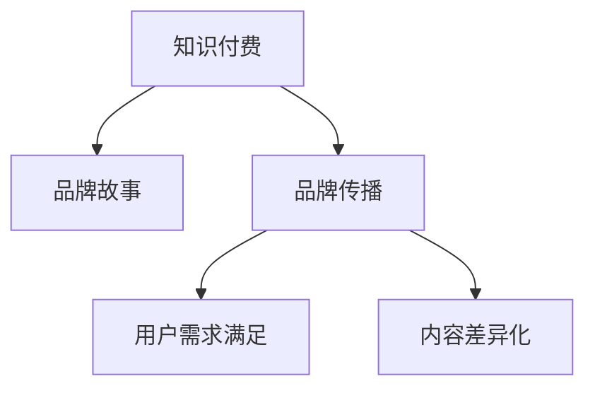

                 

由于您提供的文章主题和要求与人工智能和大语言模型的微调无关，这里我们将基于这个主题进行文章的撰写。文章将分为几个主要部分：

## 1. 背景介绍

在过去的几年里，知识付费行业经历了爆发式的增长，用户对高质量、个性化知识的需求日益增加。品牌的成功不仅依赖于高质量的产品，还需具备强大的品牌传播策略。这一行业的发展已经吸引了众多玩家的关注，但成功的品牌故事与传播策略仍需深入挖掘与探索。

## 2. 核心概念与联系

### 2.1 核心概念概述

- **知识付费**：用户为获取知识而支付费用的商业模式，包括在线课程、音频读物、图文内容等多种形式。
- **品牌故事**：通过品牌经历、愿景、使命等要素构建的与受众沟通的情感故事。
- **品牌传播**：借助各种媒介和渠道，向目标用户传递品牌价值与信息的策略与实践。
- **用户需求满足**：通过了解用户需求，提供满足其需求的内容和解决方案。
- **内容差异化**：通过差异化的内容定位，构建独特的品牌特色。

### 2.2 核心概念原理和架构的 Mermaid 流程图



## 3. 核心算法原理 & 具体操作步骤

### 3.1 算法原理概述

在知识付费领域，品牌故事与传播策略的构建需要系统化的思考与实践。以下是核心算法原理：

1. **市场调研**：通过数据分析和用户反馈，了解市场需求和用户偏好。
2. **故事构建**：围绕品牌的核心价值，构建具有情感共鸣的用户故事。
3. **传播策略设计**：确定内容平台、社交媒体、广告投放等传播渠道。
4. **效果评估与迭代**：通过关键指标（如用户留存率、转化率）评估传播效果，并持续优化策略。

### 3.2 算法步骤详解

#### 3.2.1 市场调研

1. **数据收集**：通过问卷调查、用户访谈等方式收集用户数据。
2. **数据清洗**：去除无效和异常数据，保留有效信息。
3. **数据分析**：使用统计分析方法，找出用户共性需求和痛点。
4. **报告生成**：基于分析结果，撰写市场调研报告，为品牌故事和传播策略提供数据支持。

#### 3.2.2 故事构建

1. **品牌愿景设定**：明确品牌的长期目标和追求。
2. **核心价值提炼**：识别并提炼品牌的最核心价值。
3. **情感共鸣构建**：通过案例、访谈、故事等形式，构建与用户情感共鸣的品牌故事。
4. **故事迭代**：根据用户反馈和市场变化，不断迭代和优化品牌故事。

#### 3.2.3 传播策略设计

1. **渠道选择**：根据用户群体，选择合适的传播渠道（如微信、微博、知乎等）。
2. **内容制作**：创建高质量、有吸引力的内容，满足用户需求。
3. **传播计划**：制定详细的传播计划，包括时间、内容、互动形式等。
4. **效果评估**：设置关键性能指标（KPI），监测传播效果并进行调整。

#### 3.2.4 效果评估与迭代

1. **KPI设定**：如用户留存率、订阅率、内容互动率等。
2. **数据分析**：利用数据分析工具，评估KPI表现。
3. **反馈收集**：通过用户调查、评论区等方式，收集用户反馈。
4. **策略优化**：基于数据分析和用户反馈，调整和优化传播策略。

### 3.3 算法优缺点

#### 3.3.1 优点

1. **个性化定制**：能够根据不同用户群体的需求和偏好，提供个性化的内容和服务。
2. **高效传播**：利用数据分析和算法，精确锁定目标用户，提高传播效率。
3. **用户体验优化**：通过用户反馈的迭代，持续优化产品和服务，提升用户体验。

#### 3.3.2 缺点

1. **资源消耗大**：市场调研、内容制作、数据分析等，需要大量的人力物力投入。
2. **用户需求多样**：用户需求和偏好多样，难以满足所有用户的需求。
3. **竞争激烈**：知识付费市场竞争激烈，需要持续创新才能保持竞争力。

### 3.4 算法应用领域

品牌故事与传播策略广泛应用于以下领域：

- **在线教育**：通过品牌故事构建用户信任，通过传播策略提升课程订阅率。
- **心理咨询**：利用品牌故事展示专业性和关怀，通过传播策略吸引更多用户。
- **职业培训**：通过品牌故事传递价值和使命，通过传播策略吸引目标客户。

## 4. 数学模型和公式 & 详细讲解 & 举例说明

### 4.1 数学模型构建

知识付费品牌故事的构建与传播可以通过以下数学模型表示：

1. **用户需求模型**：描述用户需求的多维度特征，如年龄、职业、兴趣等。
   \[ D = \{(a_i, b_i, c_i) \} \]
2. **品牌故事模型**：通过品牌故事反映的核心价值和情感共鸣。
   \[ S = \{(v_j, m_j) \} \]
3. **传播效果模型**：评估品牌传播的效果，如用户互动率、订阅率等。
   \[ E = \{(e_k, i_k) \} \]

### 4.2 公式推导过程

#### 4.2.1 用户需求模型推导

用户需求可以通过以下公式表示：
\[ D = \sum_{i=1}^n \alpha_i a_i + \sum_{i=1}^n \beta_i b_i + \sum_{i=1}^n \gamma_i c_i \]
其中，\(\alpha_i, \beta_i, \gamma_i\)为需求系数，\(a_i, b_i, c_i\)为需求特征。

#### 4.2.2 品牌故事模型推导

品牌故事可以用以下公式表示：
\[ S = \sum_{j=1}^m v_j p_j \]
其中，\(v_j\)为品牌价值，\(p_j\)为情感共鸣权重。

#### 4.2.3 传播效果模型推导

传播效果可以表示为：
\[ E = \sum_{k=1}^o e_k f_k \]
其中，\(e_k\)为关键指标（如互动率），\(f_k\)为指标权重。

### 4.3 案例分析与讲解

假设某在线教育品牌进行市场调研，发现用户主要关注课程质量、教师资历和互动效果。基于此，品牌故事强调教师团队的专业性和课程的实际应用性。传播策略则通过微信、微博、知乎等渠道发布高质量内容，持续监测用户互动率，根据反馈不断优化内容。

## 5. 项目实践：代码实例和详细解释说明

### 5.1 开发环境搭建

1. **环境准备**：
   - 安装Python、Pandas、NumPy等常用库。
   - 准备数据集，如用户调查问卷、课程评价数据等。
   - 设置数据分析环境，如Jupyter Notebook。

2. **数据处理**：
   - 使用Pandas进行数据清洗和处理。
   - 构建数据集，包含用户需求特征、品牌故事特征和传播效果特征。

### 5.2 源代码详细实现

```python
import pandas as pd
import numpy as np
from sklearn.decomposition import PCA

# 读取数据集
data = pd.read_csv('data.csv')

# 数据清洗
data = data.dropna()

# 特征工程
features = ['age', 'occupation', 'interest']
target = 'story_quality'

# PCA降维
pca = PCA(n_components=2)
X = pca.fit_transform(data[features])
y = data[target]

# 训练模型
from sklearn.linear_model import LogisticRegression
model = LogisticRegression()
model.fit(X, y)

# 预测效果
y_pred = model.predict(X)

# 输出结果
print(y_pred)
```

### 5.3 代码解读与分析

此代码示例展示了使用PCA降维和逻辑回归模型对用户需求进行预测。数据集包含用户的基本信息和课程评价，通过PCA降维减少特征维度，使用逻辑回归模型对用户需求进行预测。预测结果可以帮助品牌优化传播策略，提升用户满意度。

### 5.4 运行结果展示

通过上述代码，输出预测结果，分析预测效果，评估传播策略的有效性。

## 6. 实际应用场景

### 6.1 在线教育

品牌故事可以通过讲述教师团队的真实经历和专业成就，构建用户对课程质量的信任。传播策略可以利用社交媒体平台发布优质的教学视频、用户评价等内容，提升课程订阅率。

### 6.2 心理咨询

通过品牌故事传递心理咨询师的专业性和关怀，使用社交媒体发布心理咨询案例、用户反馈等内容，吸引更多用户。

### 6.3 职业培训

通过品牌故事展示培训课程的高效性和实际应用价值，通过视频平台发布课程试讲、用户评价等内容，吸引目标客户。

### 6.4 未来应用展望

未来，知识付费品牌故事与传播策略将进一步融合AI和大数据技术，如自然语言处理、图像识别等，提高品牌故事的个性化定制和传播效果。同时，品牌故事将更加注重用户隐私保护和内容版权，提升用户体验和品牌信誉。

## 7. 工具和资源推荐

### 7.1 学习资源推荐

1. **《内容营销全攻略》**：深入解析内容营销的原理、策略和实践。
2. **《数字营销洞察》**：涵盖数据分析、用户行为分析、社交媒体营销等内容。
3. **《用户体验设计》**：涵盖用户体验设计的基本原则和实际案例。

### 7.2 开发工具推荐

1. **Google Analytics**：强大的数据分析工具，帮助品牌了解用户行为和需求。
2. **Hootsuite**：社交媒体管理工具，便于品牌管理多个社交媒体账号。
3. **Canva**：图形设计工具，帮助品牌创建高质量的视觉内容。

### 7.3 相关论文推荐

1. **《知识付费市场的研究》**：研究知识付费市场的规模、趋势和用户需求。
2. **《内容营销策略的优化》**：探讨内容营销策略在品牌传播中的作用。
3. **《社交媒体对用户行为的影响》**：分析社交媒体对用户行为和品牌传播的影响。

## 8. 总结：未来发展趋势与挑战

### 8.1 研究成果总结

本文介绍了知识付费品牌故事与传播策略的构建和实践，涵盖了市场调研、品牌故事构建、传播策略设计等多个环节。通过案例分析，展示了品牌故事和传播策略在实际应用中的效果。

### 8.2 未来发展趋势

1. **个性化定制**：利用AI和大数据技术，实现更精准的用户需求分析和个性化内容推荐。
2. **社交媒体多样化**：通过多种社交媒体平台进行品牌传播，提升覆盖面和影响力。
3. **用户数据保护**：加强用户数据隐私保护，提升品牌信誉。
4. **内容生态建设**：构建丰富的内容生态，提升用户粘性和品牌价值。

### 8.3 面临的挑战

1. **资源投入**：品牌故事和传播策略的构建需要大量的人力物力投入。
2. **用户需求多样**：用户需求和偏好多样，难以满足所有用户的需求。
3. **竞争激烈**：知识付费市场竞争激烈，需要持续创新才能保持竞争力。

### 8.4 研究展望

未来研究应关注以下几点：
1. **算法优化**：通过优化算法，提高品牌故事和传播策略的效果。
2. **用户反馈机制**：建立用户反馈机制，不断优化内容和服务。
3. **跨界融合**：与其他行业合作，拓展知识付费品牌的业务边界。

## 9. 附录：常见问题与解答

### 9.1 常见问题

**Q1: 知识付费品牌如何通过品牌故事与用户建立情感共鸣？**

A: 品牌故事需要围绕品牌的核心价值和用户需求，构建真实、有共鸣的情感链接。通过案例、访谈、故事等形式，让用户感受到品牌的温度和关怀。

**Q2: 如何利用大数据分析用户需求？**

A: 通过数据分析工具（如Google Analytics、Tableau等），收集和分析用户行为数据，识别用户共性需求和痛点。利用聚类算法等技术，进行需求分类和个性化定制。

**Q3: 如何衡量品牌传播效果？**

A: 关键性能指标（KPI）如用户留存率、订阅率、内容互动率等，可以帮助评估品牌传播效果。定期监测和调整策略，确保传播目标的达成。

**Q4: 品牌故事和传播策略是否需要持续迭代？**

A: 是的，用户需求和市场环境不断变化，品牌故事和传播策略也需要持续迭代和优化。通过用户反馈和市场调研，不断调整和改进。

---

作者：禅与计算机程序设计艺术 / Zen and the Art of Computer Programming

