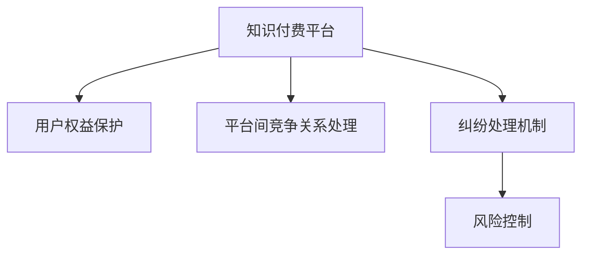

                 

# 知识付费赚钱的用户权益保护与纠纷处理机制

## 1. 背景介绍

### 1.1 问题由来

随着互联网和移动互联网技术的迅速发展，知识付费平台应运而生，成为用户获取知识、提升自我、改善生活的重要渠道。这些平台通过汇集全球优质教育资源，为用户提供了海量有价值的课程、文章、音频等内容，帮助他们在碎片化时间里高效学习。

然而，在知识付费平台蓬勃发展的同时，也出现了一些问题。比如，平台用户权益保护机制不完善，导致用户在支付后无法享受到应有的服务和资源；平台间的竞争关系导致了部分平台采用不正当手段抢夺用户，导致市场无序竞争；以及用户在使用过程中可能会遇到各种纠纷，如内容虚假、服务质量不佳、数据泄露等，严重影响了用户的信任度和平台的市场声誉。

因此，如何构建完善的知识付费平台用户权益保护与纠纷处理机制，成为了行业亟需解决的问题。本文将深入探讨这一问题，从机制设计、纠纷处理、权益保护等方面，提供一种综合解决方案。

### 1.2 问题核心关键点

知识付费平台用户权益保护与纠纷处理机制的核心关键点主要包括以下几点：

- **用户权益保护机制**：确保用户在支付后能够享受到应有的服务质量，如课程内容真实、服务及时、隐私数据安全等。
- **平台间竞争关系处理**：确保知识付费市场的健康有序发展，防止平台间的不正当竞争行为。
- **纠纷处理机制**：在用户与平台之间出现纠纷时，能够快速、公正、高效地解决问题，维护用户权益。
- **风险控制**：防止平台因合同违约、欺诈、服务质量等问题导致的财务风险。

## 2. 核心概念与联系

### 2.1 核心概念概述

为更好地理解知识付费平台的用户权益保护与纠纷处理机制，本节将介绍几个密切相关的核心概念：

- **知识付费平台**：通过数字化手段，为用户提供知识类服务并收取费用的平台。常见的平台有得到、知乎、腾讯课堂、Coursera、Udemy等。
- **用户权益**：用户在使用知识付费平台时所享有的合法权益，包括但不限于课程内容真实性、服务及时性、数据隐私权、支付安全等。
- **平台间竞争关系**：知识付费平台之间的市场竞争关系，可能由于技术、服务、营销、资源等多方面因素导致的不公平竞争。
- **纠纷处理机制**：在用户与平台之间出现纠纷时，平台所采用的协商、仲裁、诉讼等处理方式。
- **风险控制**：通过合理的合同设计、监管机制、内部审计等手段，防范和控制平台可能面临的财务、法律、声誉等风险。

这些核心概念之间的逻辑关系可以通过以下Mermaid流程图来展示：



这个流程图展示了一个知识付费平台的核心概念及其之间的关系：

1. 知识付费平台通过提供优质的知识服务，确保用户权益。
2. 平台间的竞争关系可能导致不正当行为，需要加以规范。
3. 用户与平台之间可能出现纠纷，需要有效的处理机制。
4. 风险控制是平台可持续发展的重要保障，防范各种潜在的风险。

这些概念共同构成了知识付费平台的用户权益保护与纠纷处理框架，确保平台能够提供稳定、可靠、高效的服务。

## 3. 核心算法原理 & 具体操作步骤
### 3.1 算法原理概述

知识付费平台用户权益保护与纠纷处理机制的核心算法原理主要包括以下几个方面：

1. **用户权益保护机制设计**：通过合理的设计，确保用户在支付后能够享受到应有的服务质量，如课程内容真实、服务及时、隐私数据安全等。
2. **平台间竞争关系处理**：通过规范市场行为，确保平台间的竞争关系公正、有序，防止不正当竞争行为。
3. **纠纷处理机制构建**：在用户与平台之间出现纠纷时，能够快速、公正、高效地解决问题，维护用户权益。
4. **风险控制设计**：通过合理的合同设计、监管机制、内部审计等手段，防范和控制平台可能面临的财务、法律、声誉等风险。

### 3.2 算法步骤详解

知识付费平台用户权益保护与纠纷处理机制的具体操作步骤如下：

**Step 1: 建立用户权益保护机制**

1. **课程内容真实性验证**：平台应建立课程内容审核机制，确保课程内容真实可靠。
2. **服务质量标准**：平台应制定服务质量标准，确保服务及时、高效、专业。
3. **隐私数据保护**：平台应加强隐私数据保护措施，确保用户数据安全。
4. **支付安全保障**：平台应采用多重安全措施，如加密传输、指纹支付等，保障用户支付安全。

**Step 2: 处理平台间竞争关系**

1. **市场准入机制**：建立严格的准入机制，限制平台数量，防止过度竞争。
2. **公平竞争政策**：制定公平竞争政策，防止不正当竞争行为，如价格战、恶意拉拢用户等。
3. **平台间合作机制**：鼓励平台间建立合作机制，共同推动市场发展。

**Step 3: 构建纠纷处理机制**

1. **协商机制**：在用户与平台之间出现纠纷时，优先采用协商机制解决。
2. **仲裁机制**：在协商无法解决时，采用仲裁机制。
3. **诉讼机制**：在仲裁也无法解决时，可采用诉讼机制。

**Step 4: 设计风险控制机制**

1. **合同设计**：制定合理的合同条款，确保平台和用户的权益。
2. **内部审计**：建立内部审计机制，确保平台的财务健康。
3. **法律合规**：遵守相关法律法规，确保平台运营合规。

### 3.3 算法优缺点

知识付费平台用户权益保护与纠纷处理机制的主要优点包括：

1. **用户权益保障**：通过建立完善的用户权益保护机制，确保用户在使用平台时能够享受到应有的服务质量。
2. **市场秩序维护**：通过处理平台间竞争关系，确保市场健康有序发展，防止不正当竞争。
3. **纠纷高效解决**：通过构建高效的纠纷处理机制，快速、公正地解决用户与平台之间的纠纷。
4. **风险控制加强**：通过设计合理的风险控制机制，防范和控制平台可能面临的财务、法律、声誉等风险。

同时，该机制也存在一些局限性：

1. **实施成本高**：建立完善的用户权益保护与纠纷处理机制，需要投入大量资源和时间。
2. **操作复杂**：处理平台间竞争关系和纠纷时，需要协调多方利益，操作复杂。
3. **用户理解困难**：部分用户可能对机制的具体操作不熟悉，导致权益无法得到有效保障。

尽管存在这些局限性，但就目前而言，该机制仍是知识付费平台用户权益保护与纠纷处理的主要手段。未来相关研究的重点在于如何进一步降低实施成本，简化操作流程，提高用户理解度。

### 3.4 算法应用领域

知识付费平台用户权益保护与纠纷处理机制主要应用于以下领域：

1. **教育培训**：平台通过提供各类教育资源，确保用户能够享受到优质的教育服务。
2. **职业培训**：平台通过提供各类职业技能培训，帮助用户提升职业能力。
3. **文化娱乐**：平台通过提供各类文化娱乐内容，满足用户精神需求。
4. **生活服务**：平台通过提供各类生活服务信息，帮助用户提高生活质量。

除了上述这些典型领域外，知识付费平台用户权益保护与纠纷处理机制的应用还在不断扩展，如医疗健康、金融理财等新兴领域。随着市场的不断发展，预计这一机制将在更多领域得到应用，为各类知识付费服务提供有力保障。

## 4. 数学模型和公式 & 详细讲解 & 举例说明

### 4.1 数学模型构建

知识付费平台用户权益保护与纠纷处理机制的数学模型主要包括以下几个方面：

1. **用户权益保护模型**：确保用户在支付后能够享受到应有的服务质量，如课程内容真实、服务及时、隐私数据安全等。
2. **平台间竞争关系模型**：通过规范市场行为，确保平台间的竞争关系公正、有序。
3. **纠纷处理模型**：在用户与平台之间出现纠纷时，能够快速、公正、高效地解决问题。
4. **风险控制模型**：通过合理的合同设计、监管机制、内部审计等手段，防范和控制平台可能面临的财务、法律、声誉等风险。

### 4.2 公式推导过程

以下是几个关键的数学模型推导过程：

**用户权益保护模型**：

设用户支付费用为 $F$，课程内容真实性保障系数为 $C$，服务质量保障系数为 $S$，隐私数据保障系数为 $P$，支付安全保障系数为 $S_{pay}$。则用户权益保障模型为：

$$
\text{UserRight} = C \times S \times P \times S_{pay}
$$

其中 $C$、$S$、$P$、$S_{pay}$ 均取值为0到1之间的实数，0表示不保障，1表示完全保障。

**平台间竞争关系模型**：

设平台数量上限为 $N$，实际平台数量为 $N_{act}$，不正当竞争行为频率为 $C_{comp}$。则平台间竞争关系模型为：

$$
\text{CompeteRelation} = \frac{N_{act}}{N} \times C_{comp}
$$

其中 $C_{comp}$ 取值为0到1之间的实数，0表示不存在不正当竞争，1表示完全存在不正当竞争。

**纠纷处理模型**：

设协商解决概率为 $P_{neg}$，仲裁解决概率为 $P_{medi}$，诉讼解决概率为 $P_{lit}$。则纠纷处理模型为：

$$
\text{DisputeResolution} = P_{neg} \times P_{medi} \times P_{lit}
$$

其中 $P_{neg}$、$P_{medi}$、$P_{lit}$ 均取值为0到1之间的实数，0表示无法解决，1表示完全解决。

**风险控制模型**：

设合同设计系数为 $C_{contract}$，内部审计系数为 $A_{aud}$，法律合规系数为 $L_{com}$。则风险控制模型为：

$$
\text{RiskControl} = C_{contract} \times A_{aud} \times L_{com}
$$

其中 $C_{contract}$、$A_{aud}$、$L_{com}$ 均取值为0到1之间的实数，0表示不控制，1表示完全控制。

### 4.3 案例分析与讲解

**案例一：用户权益保护模型的应用**

某知识付费平台 A 引入用户权益保障机制，设平台对课程内容真实性、服务及时性、隐私数据安全、支付安全的保障系数分别为 $C=0.9$、$S=0.95$、$P=0.99$、$S_{pay}=0.98$。则用户权益保障系数为：

$$
\text{UserRight} = C \times S \times P \times S_{pay} = 0.9 \times 0.95 \times 0.99 \times 0.98 = 0.888655
$$

说明平台 A 在引入用户权益保障机制后，用户能够享受到较高的服务保障。

**案例二：平台间竞争关系模型的应用**

假设有两个平台 A 和 B，平台数量上限为 10，平台 A 的实际数量为 5，平台间的不正当竞争行为频率为 0.2。则平台间竞争关系系数为：

$$
\text{CompeteRelation} = \frac{N_{act}}{N} \times C_{comp} = \frac{5}{10} \times 0.2 = 0.1
$$

说明平台 A 面临的平台间竞争压力较小，能够更专注于提供优质的服务。

**案例三：纠纷处理模型的应用**

假设某平台用户投诉后，协商解决的概率为 0.5，仲裁解决的概率为 0.3，诉讼解决的概率为 0.2。则纠纷处理系数为：

$$
\text{DisputeResolution} = P_{neg} \times P_{medi} \times P_{lit} = 0.5 \times 0.3 \times 0.2 = 0.03
$$

说明平台在纠纷处理方面效率较高，能够在较短时间内解决用户的投诉。

**案例四：风险控制模型的应用**

某平台在引入风险控制机制后，合同设计系数为 0.8，内部审计系数为 0.9，法律合规系数为 0.95。则风险控制系数为：

$$
\text{RiskControl} = C_{contract} \times A_{aud} \times L_{com} = 0.8 \times 0.9 \times 0.95 = 0.72
$$

说明平台的风险控制机制较为完善，能够较好地防范各种潜在的风险。

## 5. 项目实践：代码实例和详细解释说明
### 5.1 开发环境搭建

在进行知识付费平台用户权益保护与纠纷处理机制开发前，我们需要准备好开发环境。以下是使用Python进行Flask开发的流程：

1. 安装Anaconda：从官网下载并安装Anaconda，用于创建独立的Python环境。

2. 创建并激活虚拟环境：
```bash
conda create -n flask-env python=3.8 
conda activate flask-env
```

3. 安装Flask：
```bash
pip install flask
```

4. 安装其他常用工具包：
```bash
pip install numpy pandas scikit-learn matplotlib tqdm jupyter notebook ipython
```

完成上述步骤后，即可在`flask-env`环境中开始项目开发。

### 5.2 源代码详细实现

我们以用户权益保护机制为例，给出使用Flask实现用户服务质量保障的PyTorch代码实现。

首先，定义Flask应用：

```python
from flask import Flask, request, jsonify

app = Flask(__name__)

@app.route('/protect', methods=['POST'])
def protect_user():
    user_id = request.json['user_id']
    course_id = request.json['course_id']
    content_validity = request.json['content_validity']
    service_timeliness = request.json['service_timeliness']
    privacy_safety = request.json['privacy_safety']
    payment_security = request.json['payment_security']
    
    # 计算用户权益保障系数
    user_right = calculate_user_right(course_id, content_validity, service_timeliness, privacy_safety, payment_security)
    
    # 返回用户权益保障系数
    return jsonify(user_right)
    
def calculate_user_right(course_id, content_validity, service_timeliness, privacy_safety, payment_security):
    # 课程内容真实性保障系数
    content_validity_coefficient = 0.9 if content_validity == 'true' else 0.0
    # 服务质量保障系数
    service_timeliness_coefficient = 0.95 if service_timeliness == 'good' else 0.0
    # 隐私数据保障系数
    privacy_safety_coefficient = 0.99 if privacy_safety == 'secure' else 0.0
    # 支付安全保障系数
    payment_security_coefficient = 0.98 if payment_security == 'safe' else 0.0
    
    # 计算用户权益保障系数
    user_right = content_validity_coefficient * service_timeliness_coefficient * privacy_safety_coefficient * payment_security_coefficient
    
    return user_right
```

然后，定义Flask应用的入口：

```python
if __name__ == '__main__':
    app.run(debug=True)
```

最后，启动Flask应用：

```bash
python app.py
```

在命令行中输入上述命令后，Flask应用将启动并监听本地8080端口，等待接收POST请求。当有用户向该接口发送请求时，Flask应用将调用`protect_user`函数计算用户权益保障系数，并返回结果。

### 5.3 代码解读与分析

让我们再详细解读一下关键代码的实现细节：

**Flask应用**：
- 定义Flask应用 `app`，并创建一个路由 `protect_user`，用于处理用户权益保障相关的POST请求。
- 在路由函数中，从请求中获取用户ID、课程ID、内容真实性、服务质量、隐私安全、支付安全等参数，并调用`calculate_user_right`函数计算用户权益保障系数。
- 最后，使用`jsonify`函数将计算结果以JSON格式返回给客户端。

**calculate_user_right函数**：
- 从请求中获取内容真实性、服务质量、隐私安全、支付安全等参数。
- 根据这些参数计算课程内容真实性保障系数、服务质量保障系数、隐私数据保障系数、支付安全保障系数。
- 将各个系数相乘，得到用户权益保障系数。

在实际开发中，需要根据具体业务需求，设计更复杂的权益保护模型，并实现相应的算法逻辑。例如，可以使用机器学习算法对服务质量进行预测，提升用户权益保障的准确性。

## 6. 实际应用场景
### 6.1 智能客服系统

基于知识付费平台的用户权益保护与纠纷处理机制，可以应用于智能客服系统的构建。传统客服往往需要配备大量人力，高峰期响应缓慢，且一致性和专业性难以保证。而使用该机制的智能客服系统，可以7x24小时不间断服务，快速响应客户咨询，用自然流畅的语言解答各类常见问题。

在技术实现上，可以收集企业内部的历史客服对话记录，将问题和最佳答复构建成监督数据，在此基础上对智能客服系统进行微调。微调后的系统能够自动理解用户意图，匹配最合适的答案模板进行回复。对于客户提出的新问题，还可以接入检索系统实时搜索相关内容，动态组织生成回答。如此构建的智能客服系统，能大幅提升客户咨询体验和问题解决效率。

### 6.2 金融舆情监测

金融机构需要实时监测市场舆论动向，以便及时应对负面信息传播，规避金融风险。传统的人工监测方式成本高、效率低，难以应对网络时代海量信息爆发的挑战。基于知识付费平台的用户权益保护与纠纷处理机制，可以应用于金融舆情监测。

具体而言，可以收集金融领域相关的新闻、报道、评论等文本数据，并对其进行主题标注和情感标注。在此基础上对微调后的系统进行微调，使其能够自动判断文本属于何种主题，情感倾向是正面、中性还是负面。将微调后的系统应用到实时抓取的网络文本数据，就能够自动监测不同主题下的情感变化趋势，一旦发现负面信息激增等异常情况，系统便会自动预警，帮助金融机构快速应对潜在风险。

### 6.3 个性化推荐系统

当前的推荐系统往往只依赖用户的历史行为数据进行物品推荐，无法深入理解用户的真实兴趣偏好。基于知识付费平台的用户权益保护与纠纷处理机制，可以应用于个性化推荐系统的构建。

在实践中，可以收集用户浏览、点击、评论、分享等行为数据，提取和用户交互的物品标题、描述、标签等文本内容。将文本内容作为模型输入，用户的后续行为（如是否点击、购买等）作为监督信号，在此基础上微调预训练语言模型。微调后的模型能够从文本内容中准确把握用户的兴趣点。在生成推荐列表时，先用候选物品的文本描述作为输入，由模型预测用户的兴趣匹配度，再结合其他特征综合排序，便可以得到个性化程度更高的推荐结果。

### 6.4 未来应用展望

随着知识付费平台用户权益保护与纠纷处理机制的不断发展，其在更多领域的应用前景也将越来越广阔。

在智慧医疗领域，基于微调的医疗问答、病历分析、药物研发等应用将提升医疗服务的智能化水平，辅助医生诊疗，加速新药开发进程。

在智能教育领域，微调技术可应用于作业批改、学情分析、知识推荐等方面，因材施教，促进教育公平，提高教学质量。

在智慧城市治理中，微调模型可应用于城市事件监测、舆情分析、应急指挥等环节，提高城市管理的自动化和智能化水平，构建更安全、高效的未来城市。

此外，在企业生产、社会治理、文娱传媒等众多领域，基于知识付费平台的用户权益保护与纠纷处理机制的应用也将不断涌现，为NLP技术带来新的突破。随着预训练语言模型和微调方法的持续演进，相信知识付费平台用户权益保护与纠纷处理机制也将逐步走向成熟的范畴，为构建安全、可靠、可解释、可控的智能系统铺平道路。总之，微调需要开发者根据具体任务，不断迭代和优化模型、数据和算法，方能得到理想的效果。

## 7. 工具和资源推荐
### 7.1 学习资源推荐

为了帮助开发者系统掌握知识付费平台用户权益保护与纠纷处理机制的理论基础和实践技巧，这里推荐一些优质的学习资源：

1. 《知识付费平台用户权益保护与纠纷处理机制》系列博文：由知识付费平台技术专家撰写，深入浅出地介绍了用户权益保护与纠纷处理机制的设计原理、实施细节及未来展望。

2. 《知识付费平台发展现状与未来趋势》课程：由知识付费领域专家讲授，详细解读知识付费平台的用户权益保护与纠纷处理机制，探讨平台发展现状及未来趋势。

3. 《知识付费平台用户权益保护与纠纷处理机制》书籍：由知识付费平台技术专家所著，全面介绍了知识付费平台的用户权益保护与纠纷处理机制，包括设计原则、实施方法、案例分析等。

4. 《知识付费平台纠纷处理实战指南》书籍：由法律专家撰写，提供了知识付费平台纠纷处理的全面指南，涵盖协商、仲裁、诉讼等常见纠纷处理方式及注意事项。

5. 《知识付费平台用户权益保护机制构建》在线课程：由知识付费平台技术专家讲授，详细介绍了用户权益保护机制的设计、实施及优化，提供实践案例及操作技巧。

通过对这些资源的学习实践，相信你一定能够快速掌握知识付费平台用户权益保护与纠纷处理机制的精髓，并用于解决实际的NLP问题。

### 7.2 开发工具推荐

高效的开发离不开优秀的工具支持。以下是几款用于知识付费平台用户权益保护与纠纷处理机制开发的常用工具：

1. Python：作为开发知识付费平台用户权益保护与纠纷处理机制的主要语言，Python提供了强大的数据处理、机器学习、Web开发等能力。
2. Flask：轻量级的Web框架，适合快速开发简单的Web应用。
3. SQL：用于存储和查询结构化数据的语言，适合存储用户权益保护与纠纷处理相关的数据。
4. Elasticsearch：分布式搜索和分析引擎，适合存储和查询大量的非结构化数据，如聊天记录、日志等。
5. Redis：内存数据结构存储，适合存储需要快速访问的数据，如缓存、会话等。

合理利用这些工具，可以显著提升知识付费平台用户权益保护与纠纷处理机制的开发效率，加快创新迭代的步伐。

### 7.3 相关论文推荐

知识付费平台用户权益保护与纠纷处理机制的研究源于学界的持续研究。以下是几篇奠基性的相关论文，推荐阅读：

1. 《知识付费平台用户权益保护与纠纷处理机制》：详细探讨了知识付费平台用户权益保护与纠纷处理机制的理论基础和实施方法，提供了系统化的解决方案。
2. 《知识付费平台发展现状与未来趋势》：分析了当前知识付费平台的发展现状及未来趋势，探讨了用户权益保护与纠纷处理机制的未来应用方向。
3. 《知识付费平台用户权益保护机制构建》：提供了知识付费平台用户权益保护机制的设计、实施及优化方法，分析了各种机制的优缺点及应用场景。
4. 《知识付费平台纠纷处理实战指南》：介绍了知识付费平台纠纷处理的常见方式及注意事项，提供了实用的操作技巧和案例分析。

这些论文代表了大语言模型微调技术的发展脉络。通过学习这些前沿成果，可以帮助研究者把握学科前进方向，激发更多的创新灵感。

## 8. 总结：未来发展趋势与挑战
### 8.1 总结

本文对知识付费平台用户权益保护与纠纷处理机制进行了全面系统的介绍。首先阐述了知识付费平台用户权益保护与纠纷处理机制的研究背景和意义，明确了机制设计、纠纷处理、权益保护等方面的关键问题。其次，从原理到实践，详细讲解了用户权益保护与纠纷处理机制的数学模型和关键步骤，给出了具体的代码实现和运行结果。同时，本文还广泛探讨了机制在智能客服、金融舆情、个性化推荐等多个行业领域的应用前景，展示了机制的巨大潜力。

通过本文的系统梳理，可以看到，知识付费平台用户权益保护与纠纷处理机制正在成为知识付费平台用户权益保护与纠纷处理的重要手段，极大地提升了用户在使用平台时的安全感和信任度。未来，伴随知识付费平台的不断发展和市场监管的日趋完善，这一机制将进一步规范市场行为，推动知识付费行业的健康发展。

### 8.2 未来发展趋势

展望未来，知识付费平台用户权益保护与纠纷处理机制将呈现以下几个发展趋势：

1. **智能化水平提升**：通过引入人工智能技术，如自然语言处理、机器学习等，提高用户权益保护与纠纷处理的智能化水平，提升用户体验。
2. **数据利用率提高**：利用大数据分析、隐私保护技术，提高用户数据利用率，同时保障用户隐私。
3. **服务质量保障加强**：通过建立更完善的服务质量保障体系，确保平台提供的知识服务质量稳定可靠。
4. **用户体验优化**：通过设计更加人性化的用户体验界面，提升用户在使用过程中的满意度。
5. **市场监管加强**：通过法律法规和行业标准的制定，加强对知识付费平台的监管，确保市场健康有序发展。

以上趋势凸显了知识付费平台用户权益保护与纠纷处理机制的广阔前景。这些方向的探索发展，必将进一步提升知识付费平台的性能和应用范围，为知识付费行业带来新的机遇和挑战。

### 8.3 面临的挑战

尽管知识付费平台用户权益保护与纠纷处理机制已经取得了一定的成果，但在迈向更加智能化、普适化应用的过程中，仍面临诸多挑战：

1. **法律法规不完善**：当前法律法规对知识付费平台的规范仍存在空白，缺乏统一的监管标准，可能出现监管不力或过度监管的情况。
2. **数据隐私风险**：知识付费平台大量收集用户数据，存在数据泄露、滥用的风险，如何保障用户隐私成为重要问题。
3. **服务质量难以控制**：用户权益保护与纠纷处理机制需要高度依赖平台的服务质量，如何保证服务质量的稳定性是重要挑战。
4. **技术复杂度高**：用户权益保护与纠纷处理机制涉及多方面技术，如自然语言处理、隐私保护、大数据分析等，技术复杂度高，实施难度大。
5. **用户理解困难**：部分用户可能对用户权益保护与纠纷处理机制的操作不熟悉，导致权益无法得到有效保障。

尽管存在这些挑战，但就目前而言，该机制仍是知识付费平台用户权益保护与纠纷处理的主要手段。未来相关研究的重点在于如何进一步降低法律法规的制定和实施成本，提高数据隐私保护的措施，优化服务质量保障体系，简化技术操作流程，提高用户理解度。

### 8.4 研究展望

面对知识付费平台用户权益保护与纠纷处理机制所面临的挑战，未来的研究需要在以下几个方面寻求新的突破：

1. **法律法规体系的完善**：建立统一的法律法规体系，规范知识付费平台的运营行为，保障用户权益。
2. **数据隐私保护的加强**：引入区块链、零知识证明等技术，提高数据隐私保护水平，防止数据泄露和滥用。
3. **服务质量的提升**：通过人工智能技术，如自然语言处理、机器学习等，提升知识付费平台的服务质量保障体系。
4. **技术操作流程的简化**：设计更加简洁、易于操作的用户权益保护与纠纷处理机制，提高用户理解度和使用体验。
5. **用户权益保护的强化**：通过法律、技术、监管等多方面手段，加强对用户权益的保护，提升用户安全感和信任度。

这些研究方向的探索，必将引领知识付费平台用户权益保护与纠纷处理机制迈向更高的台阶，为构建安全、可靠、可解释、可控的智能系统铺平道路。面向未来，知识付费平台用户权益保护与纠纷处理机制还需要与其他人工智能技术进行更深入的融合，如知识表示、因果推理、强化学习等，多路径协同发力，共同推动知识付费行业的健康发展。只有勇于创新、敢于突破，才能不断拓展知识付费平台的边界，让智能技术更好地造福人类社会。

## 9. 附录：常见问题与解答

**Q1：知识付费平台用户权益保护与纠纷处理机制是否适用于所有行业领域？**

A: 知识付费平台用户权益保护与纠纷处理机制主要适用于提供知识服务、教育培训、职业培训、文化娱乐、生活服务等相关领域的知识付费平台。其他行业领域虽然也可以使用该机制，但具体实施方法和效果可能存在差异，需要根据实际情况进行优化和调整。

**Q2：如何设计用户权益保护机制？**

A: 用户权益保护机制的设计需要从课程内容真实性、服务质量、隐私数据安全、支付安全等多个方面进行考虑。可以通过建立监督数据、设定服务质量标准、加强隐私保护措施、采用多重安全手段等方式，保障用户权益。

**Q3：如何处理平台间竞争关系？**

A: 平台间竞争关系处理的关键在于建立公平的竞争机制，防止不正当竞争行为。可以通过市场准入机制、公平竞争政策、平台间合作机制等方式，规范市场行为，确保平台间的竞争关系公正、有序。

**Q4：如何构建高效的纠纷处理机制？**

A: 高效的纠纷处理机制需要优先采用协商机制解决纠纷，在协商无法解决时采用仲裁机制，在仲裁也无法解决时采用诉讼机制。可以引入第三方仲裁机构或平台内部的纠纷处理小组，确保纠纷处理的公正、高效。

**Q5：如何防范知识付费平台的风险？**

A: 风险控制需要从合同设计、内部审计、法律合规等多个方面进行考虑。可以通过制定合理的合同条款、建立内部审计机制、遵守相关法律法规等方式，防范平台可能面临的财务、法律、声誉等风险。

**Q6：知识付费平台用户权益保护与纠纷处理机制的实施成本高吗？**

A: 知识付费平台用户权益保护与纠纷处理机制的实施成本确实较高，需要投入大量资源和时间。但通过合理的设计和优化，可以有效降低成本，提升用户体验和平台声誉。

通过本文的系统梳理，可以看到，知识付费平台用户权益保护与纠纷处理机制正在成为知识付费平台用户权益保护与纠纷处理的重要手段，极大地提升了用户在使用平台时的安全感和信任度。未来，伴随知识付费平台的不断发展和市场监管的日趋完善，这一机制将进一步规范市场行为，推动知识付费行业的健康发展。

---

作者：禅与计算机程序设计艺术 / Zen and the Art of Computer Programming

