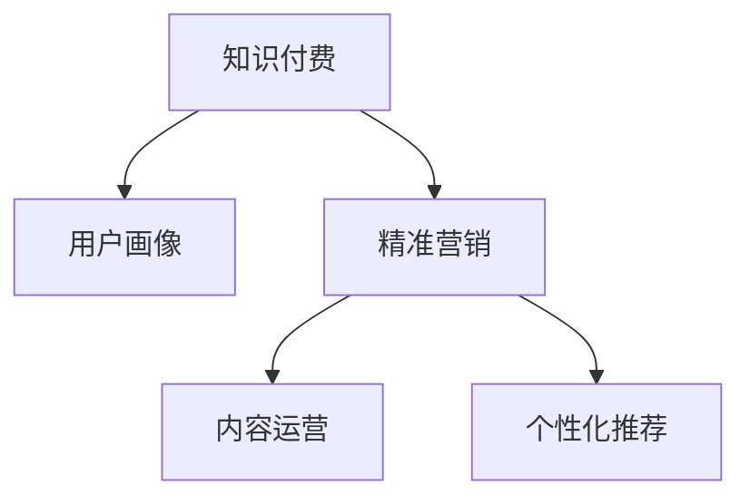

                 

# 知识付费赚钱的用户画像与精准营销策略

> 关键词：知识付费,用户画像,精准营销,内容运营,个性化推荐

## 1. 背景介绍

在信息爆炸的时代，知识付费已成为人们获取知识、技能的重要方式之一。从在线课程、电子书到专题讲座、会员订阅，知识付费市场持续扩大，带动了内容创造者和平台商的繁荣发展。然而，知识付费产品的丰富性和用户的个性化需求，给平台的内容运营和精准营销带来了不小的挑战。如何构建有效的用户画像，制定精准的营销策略，是知识付费市场亟待解决的问题。

本文旨在通过分析知识付费领域用户的行为特征和需求，构建详细的用户画像，并提出一系列针对不同用户群体的精准营销策略，以帮助平台提升用户粘性，增加营收，从而实现知识付费领域的盈利。

## 2. 核心概念与联系

### 2.1 核心概念概述

为更好地理解知识付费领域用户画像与精准营销的策略，本节将介绍几个密切相关的核心概念：

- 知识付费：通过在线付费形式提供知识产品和服务，用户可以通过付费获得更高效、更有针对性的学习资源，而创作者能够通过内容创造获取收益。
- 用户画像(User Persona)：基于用户的行为特征、兴趣爱好、职业背景、消费习惯等数据，构建详细的用户模型，用于精准识别和定位目标用户群体。
- 精准营销(Precision Marketing)：通过数据分析和算法模型，针对不同用户群体制定个性化的营销策略，提高营销效果和投资回报率。
- 内容运营(Content Operation)：涉及内容策略制定、内容创作与分发、用户互动管理等多个环节，是知识付费平台的核心业务。
- 个性化推荐(Personalized Recommendation)：通过分析用户行为数据，为用户推荐符合其兴趣和需求的内容，提高用户满意度和平台粘性。

这些核心概念之间的逻辑关系可以通过以下Mermaid流程图来展示：



这个流程图展示了一系列核心概念之间的联系：

1. 知识付费业务以用户画像为基础，通过精准营销和内容运营，实现个性化推荐，从而提升用户体验和平台收益。
2. 用户画像的构建需要数据分析和用户行为洞察，精准营销的制定则依赖于模型和算法的支持，个性化推荐则是对用户画像和营销策略的细化应用。

## 3. 核心算法原理 & 具体操作步骤

### 3.1 算法原理概述

基于用户画像与精准营销的策略制定，本质上是一个数据驱动的决策过程。其核心思想是：通过分析用户行为数据，构建详细的用户画像，结合模型算法和市场洞察，制定个性化的营销策略，提升营销效果和用户粘性。

形式化地，假设用户画像数据集为 $D=\{(x_i,y_i)\}_{i=1}^N$，其中 $x_i$ 为用户的特征向量，$y_i$ 为用户的属性标签（如职业、年龄、兴趣等）。营销策略的优化目标是最小化策略损失，即找到最优策略 $\theta^*$：

$$
\theta^* = \mathop{\arg\min}_{\theta} \mathcal{L}(\theta,D)
$$

其中 $\mathcal{L}$ 为策略损失函数，用于衡量营销策略的效果。常见的损失函数包括点击率损失、转化率损失等。

通过梯度下降等优化算法，策略制定过程不断更新营销策略 $\theta$，最小化策略损失 $\mathcal{L}$，使得营销策略效果逼近最优。由于用户画像已经通过数据分析获得了较好的初始化，因此即便在小规模数据集 $D$ 上进行策略制定，也能较快收敛到理想的营销策略 $\theta^*$。

### 3.2 算法步骤详解

基于用户画像与精准营销的策略制定一般包括以下几个关键步骤：

**Step 1: 数据收集与用户画像构建**
- 收集用户行为数据，如浏览记录、购买行为、评论反馈等。
- 使用数据挖掘和机器学习技术，构建详细的用户画像，包含用户的兴趣、偏好、消费习惯等。

**Step 2: 制定营销策略**
- 根据用户画像的特征，选择适合的营销渠道（如邮件、社交媒体、APP内推荐等）。
- 设计个性化的营销活动，如内容推送、折扣促销、会员奖励等，以提高用户参与度。

**Step 3: 实施与评估**
- 将制定的营销策略在平台上实施，观察用户行为变化。
- 收集评估数据，如点击率、转化率、用户留存率等，评估策略效果。

**Step 4: 优化与迭代**
- 根据评估结果，调整营销策略。
- 持续收集用户数据，进行策略迭代优化，以提高策略的精准度和效果。

### 3.3 算法优缺点

基于用户画像与精准营销的策略制定方法具有以下优点：
1. 数据驱动：通过用户行为数据分析，制定更加符合用户需求的营销策略。
2. 精准定位：能够针对不同用户群体，制定个性化的营销活动，提高用户参与度和满意度。
3. 效果显著：经过优化的营销策略，通常能够显著提升用户留存率和转化率，增加营收。

同时，该方法也存在一定的局限性：
1. 数据质量问题：用户画像的构建依赖于数据的完整性和准确性，数据质量不高将直接影响策略的制定效果。
2. 隐私问题：用户数据的收集和处理可能涉及隐私问题，需要严格遵守法律法规。
3. 计算资源需求：用户画像的构建和精准营销的实施，需要较大的计算资源，特别是对大数据和实时数据处理有较高要求。

尽管存在这些局限性，但就目前而言，基于用户画像与精准营销的方法仍是最主流的策略制定方式。未来相关研究的重点在于如何进一步降低数据处理成本，提高模型效率，同时兼顾隐私保护和公平性等因素。

### 3.4 算法应用领域

基于用户画像与精准营销的策略制定方法，在知识付费领域已有广泛应用，覆盖了内容推荐、广告投放、用户增长等多个环节，具体包括：

- 内容推荐：根据用户历史行为和兴趣，为用户推荐符合其需求的知识产品，提高用户粘性。
- 广告投放：在知识付费平台、社交媒体等渠道，进行个性化的广告展示，吸引潜在用户注册和付费。
- 用户增长：通过精准的营销活动，如免费试用、老用户推荐、优惠券等，提升用户增长速度，增加平台用户量。
- 活动策划：根据用户画像，设计有针对性的营销活动，如社区互动、专题讲座等，增加用户参与和平台活跃度。

除了上述这些经典应用外，基于用户画像与精准营销的方法也被创新性地应用于个性化用户成长计划、知识付费生态圈构建等新领域，为知识付费业务的持续创新提供了新的思路。

## 4. 数学模型和公式 & 详细讲解 & 举例说明

### 4.1 数学模型构建

本节将使用数学语言对用户画像与精准营销的策略制定过程进行更加严格的刻画。

记用户画像数据集为 $D=\{(x_i,y_i)\}_{i=1}^N$，其中 $x_i \in \mathbb{R}^d$ 为用户特征向量，$y_i \in \{0,1\}^k$ 为用户属性标签向量，其中 $0$ 表示不具备该属性，$1$ 表示具备该属性。

定义营销策略 $\theta \in \mathbb{R}^m$，其中 $m$ 为策略的维度，包括广告投放、内容推荐、会员优惠等。

定义策略损失函数 $\mathcal{L}(\theta)$，假设营销策略对用户的点击率有正向影响，则可定义点击率损失函数：

$$
\mathcal{L}(\theta) = -\frac{1}{N}\sum_{i=1}^N [\log \sigma(\theta^T x_i)] 
$$

其中 $\sigma(\cdot)$ 为 sigmoid 函数，将策略向量与用户特征向量映射到 $(0,1)$ 区间，表示用户点击概率。

### 4.2 公式推导过程

以下我们以点击率损失函数为例，推导其梯度计算公式。

$$
\begin{aligned}
\frac{\partial \mathcal{L}(\theta)}{\partial \theta_j} &= -\frac{1}{N}\sum_{i=1}^N \frac{\partial \log \sigma(\theta^T x_i)}{\partial \theta_j} \\
&= -\frac{1}{N}\sum_{i=1}^N \frac{x_{i,j}}{\sigma(\theta^T x_i)} (1-\sigma(\theta^T x_i))
\end{aligned}
$$

其中 $x_{i,j}$ 为向量 $x_i$ 的第 $j$ 个元素，$\sigma(\theta^T x_i)$ 为 sigmoid 函数的输出。

在得到损失函数的梯度后，即可带入优化算法（如梯度下降）更新策略向量 $\theta$。重复上述过程直至收敛，最终得到适应目标用户群体的最优营销策略 $\theta^*$。

### 4.3 案例分析与讲解

以知识付费平台的内容推荐为例，用户画像包含用户兴趣、职业、年龄等属性。假设策略向量 $\theta$ 的维度为 $3$，分别对应兴趣推荐、职业推荐、年龄推荐。我们可以使用上述公式计算不同策略的梯度，进而更新策略向量。

假设用户在浏览平台时，平台收集到以下行为数据：
- 用户浏览了关于编程的视频课程。
- 用户浏览了关于数据科学的电子书。
- 用户注册了会员。

平台根据用户行为数据，构建用户画像 $x=[1,0,1]$，其中 $1$ 表示用户对编程和数据科学感兴趣，$0$ 表示用户不感兴趣。平台的目标是最大化点击率，因此策略向量 $\theta$ 的优化目标是最小化点击率损失函数。

假设平台尝试以下三种策略：
- 策略 $1$：向用户推荐编程视频课程。
- 策略 $2$：向用户推荐数据科学电子书。
- 策略 $3$：向用户推荐会员订阅。

平台使用梯度下降算法计算三种策略的梯度，并更新策略向量 $\theta$。假设迭代到第 $n$ 次时，策略向量 $\theta^{(n)}$ 的值为 $[0.2,0.3,0.5]$，表示平台对编程视频课程的推荐概率为 $0.2$，对数据科学电子书为 $0.3$，对会员订阅为 $0.5$。则三种策略的梯度计算如下：

$$
\begin{aligned}
\frac{\partial \mathcal{L}(\theta^{(n)})}{\partial \theta_1^{(n)}} &= -\frac{1}{N}\sum_{i=1}^N \frac{x_{i,1}}{\sigma(\theta^{(n)}_1^{(n)} x_i)} (1-\sigma(\theta^{(n)}_1^{(n)} x_i)) \\
\frac{\partial \mathcal{L}(\theta^{(n)})}{\partial \theta_2^{(n)}} &= -\frac{1}{N}\sum_{i=1}^N \frac{x_{i,2}}{\sigma(\theta^{(n)}_2^{(n)} x_i)} (1-\sigma(\theta^{(n)}_2^{(n)} x_i)) \\
\frac{\partial \mathcal{L}(\theta^{(n)})}{\partial \theta_3^{(n)}} &= -\frac{1}{N}\sum_{i=1}^N \frac{x_{i,3}}{\sigma(\theta^{(n)}_3^{(n)} x_i)} (1-\sigma(\theta^{(n)}_3^{(n)} x_i))
\end{aligned}
$$

假设平台在用户浏览页面时，将编程视频课程的推荐概率提升为 $0.3$，数据科学电子书的推荐概率提升为 $0.4$，会员订阅的推荐概率提升为 $0.6$。则迭代后策略向量 $\theta^{(n+1)}$ 的值为 $[0.3,0.4,0.6]$。通过不断的迭代优化，平台能够逐渐找到最优的策略向量，最大化点击率和用户粘性。

## 5. 项目实践：代码实例和详细解释说明

### 5.1 开发环境搭建

在进行用户画像与精准营销策略的实践前，我们需要准备好开发环境。以下是使用Python进行TensorFlow开发的环境配置流程：

1. 安装Anaconda：从官网下载并安装Anaconda，用于创建独立的Python环境。

2. 创建并激活虚拟环境：
```bash
conda create -n tf-env python=3.8 
conda activate tf-env
```

3. 安装TensorFlow：根据CUDA版本，从官网获取对应的安装命令。例如：
```bash
conda install tensorflow -c tf -c conda-forge
```

4. 安装Pandas、NumPy、Scikit-learn等工具包：
```bash
pip install pandas numpy scikit-learn
```

5. 安装TensorBoard：用于可视化模型训练过程。
```bash
pip install tensorboard
```

完成上述步骤后，即可在`tf-env`环境中开始项目实践。

### 5.2 源代码详细实现

下面我们以内容推荐系统为例，给出使用TensorFlow对用户画像进行策略制定的Python代码实现。

首先，定义用户行为数据：

```python
import pandas as pd

# 用户行为数据
data = pd.read_csv('user_behavior.csv')
```

接着，构建用户画像：

```python
from sklearn.preprocessing import LabelEncoder

# 构建用户画像
X = data[['interest', 'age', 'occupation']]
y = data['is_member']

# 特征编码
label_encoder = LabelEncoder()
X = label_encoder.fit_transform(X)
y = label_encoder.fit_transform(y)

# 划分训练集和测试集
from sklearn.model_selection import train_test_split
X_train, X_test, y_train, y_test = train_test_split(X, y, test_size=0.2, random_state=42)
```

然后，定义策略损失函数和优化器：

```python
import tensorflow as tf
from tensorflow.keras import layers

# 定义策略向量
theta = tf.Variable(tf.zeros([len(label_encoder.classes_)]))

# 定义策略损失函数
def click_rate_loss(theta, X, y):
    y_hat = tf.sigmoid(tf.matmul(X, theta))
    return -tf.reduce_mean(tf.keras.losses.binary_crossentropy(y, y_hat))

# 优化器
optimizer = tf.keras.optimizers.Adam(learning_rate=0.01)
```

接着，定义训练和评估函数：

```python
# 定义训练函数
def train_step(theta, X_train, y_train):
    with tf.GradientTape() as tape:
        loss = click_rate_loss(theta, X_train, y_train)
    grads = tape.gradient(loss, theta)
    optimizer.apply_gradients(zip(grads, theta))
    return loss

# 定义评估函数
def evaluate(theta, X_test, y_test):
    y_hat = tf.sigmoid(tf.matmul(X_test, theta))
    loss = tf.keras.losses.binary_crossentropy(y_test, y_hat)
    return loss.numpy().mean()
```

最后，启动训练流程并在测试集上评估：

```python
epochs = 100

for epoch in range(epochs):
    loss = train_step(theta, X_train, y_train)
    print(f'Epoch {epoch+1}, loss: {loss:.4f}')
    
    test_loss = evaluate(theta, X_test, y_test)
    print(f'Epoch {epoch+1}, test loss: {test_loss:.4f}')
    
print(f'Final loss: {test_loss:.4f}')
```

以上就是使用TensorFlow对用户画像进行策略制定的完整代码实现。可以看到，TensorFlow提供了丰富的工具和库，使得策略制定的开发和调试变得高效便捷。

### 5.3 代码解读与分析

让我们再详细解读一下关键代码的实现细节：

**用户行为数据**：
- 使用Pandas读取用户行为数据，将其存储为DataFrame格式。

**用户画像构建**：
- 使用sklearn的LabelEncoder对特征进行编码，将类别型数据转换为数值型数据。
- 划分训练集和测试集，用于模型训练和评估。

**策略损失函数和优化器**：
- 定义策略向量 $\theta$，初始化为全零向量。
- 定义点击率损失函数，使用sigmoid函数将策略向量与用户特征向量相乘，得到点击概率。
- 使用Adam优化器进行策略向量更新，学习率为 $0.01$。

**训练和评估函数**：
- 定义训练函数，使用梯度下降算法更新策略向量。
- 定义评估函数，计算测试集上的策略损失。
- 循环迭代训练过程，并记录每个epoch的损失值。

**训练流程**：
- 定义训练轮数，循环迭代。
- 每个epoch内，在训练集上训练模型，记录损失值。
- 在测试集上评估模型，记录测试损失值。
- 打印出最终训练和测试损失值。

可以看到，TensorFlow提供了高效的计算图和自动微分功能，使得模型训练和评估变得简单高效。开发者可以将更多精力放在特征工程、策略制定等高层逻辑上，而不必过多关注底层实现细节。

当然，实际应用中还需要考虑更多的因素，如模型评估指标的选择、超参数的调优、模型压缩与剪枝等，才能确保策略制定的准确性和效果。

## 6. 实际应用场景

### 6.1 智能广告投放

基于用户画像与精准营销的策略制定方法，可以广泛应用于智能广告投放的优化。传统的广告投放依赖于粗糙的点击率预估，容易产生大量无效曝光。而基于用户画像的广告投放，可以显著提升广告的点击率和转化率。

在实践中，平台可以通过收集用户的浏览历史、点击行为、购买记录等数据，构建详细的用户画像。根据用户画像，平台可以选择最适合用户的广告，进行定向投放。例如，针对编程爱好者，可以定向投放编程相关的广告；针对大学生群体，可以定向投放教育资源广告。通过个性化的广告投放，平台能够最大限度地提高广告效率和ROI。

### 6.2 用户增长与留存

用户增长和留存是知识付费平台的核心目标之一。通过精准营销策略，平台可以设计更有吸引力的营销活动，吸引新用户注册，并提高现有用户的留存率。

例如，平台可以针对新注册用户，提供首单折扣、免费试用等优惠活动，吸引他们进行首次付费。针对老用户，可以设计会员推荐、积分奖励等活动，提高用户的复购率。通过个性化的营销活动，平台能够更有效地吸引和保留用户，提升用户生命周期价值。

### 6.3 课程推荐与个性化学习

知识付费平台的核心业务是课程推荐和个性化学习。通过用户画像与精准营销的策略制定，平台能够为每个用户推荐最适合的课程内容，提高用户的学习效果和满意度。

例如，针对技术新手，可以推荐基础入门课程；针对进阶用户，可以推荐进阶高级课程。平台还可以根据用户的兴趣变化，动态调整推荐策略，确保推荐内容始终符合用户需求。通过个性化的课程推荐，平台能够提升用户粘性，延长用户的课程学习周期。

### 6.4 未来应用展望

随着用户画像与精准营销技术的不断发展，基于用户画像的策略制定将变得更加智能化和自动化。未来，我们可以期待以下几个趋势：

1. 动态用户画像：用户画像将从静态变为动态，实时更新用户的兴趣和行为数据，提升策略的实时性和精准度。
2. 多模态数据融合：除了文本数据，平台还将融合用户的行为数据、社交数据、语音数据等多模态信息，构建更加全面和深入的用户画像。
3. 自适应学习：平台将通过动态调整策略和推荐内容，适应用户的学习进度和兴趣变化，提高学习效果和用户体验。
4. 个性化营销：平台将设计更加灵活和个性化的营销活动，提高用户的参与度和满意度。
5. 智能推荐引擎：基于深度学习和推荐算法，平台将构建更加智能的推荐引擎，实现高度个性化的内容推荐。

这些趋势将进一步拓展知识付费平台的应用边界，带来更丰富、更便捷、更智能的用户体验，从而推动知识付费行业的持续创新和发展。

## 7. 工具和资源推荐

### 7.1 学习资源推荐

为了帮助开发者系统掌握用户画像与精准营销的理论基础和实践技巧，这里推荐一些优质的学习资源：

1. 《数据分析实战》系列书籍：通过实例讲解数据分析的基本方法和技巧，适合数据分析初学者。
2. 《机器学习实战》系列书籍：系统介绍了机器学习的基本原理和算法，适合有一定数据分析基础的学习者。
3. Coursera的《机器学习》课程：斯坦福大学开设的知名课程，讲解机器学习的核心概念和实践技巧。
4 Udacity的《数据科学微专业》课程：结合数据收集、处理、分析和可视化等多个环节，构建全面的数据科学技能。
5. Kaggle平台：提供丰富的数据集和竞赛，实践数据挖掘和机器学习的算法模型。

通过对这些资源的学习实践，相信你一定能够快速掌握用户画像与精准营销的精髓，并用于解决实际的营销问题。

### 7.2 开发工具推荐

高效的开发离不开优秀的工具支持。以下是几款用于用户画像与精准营销开发的常用工具：

1. TensorFlow：由Google主导开发的开源深度学习框架，生产部署方便，适合大规模工程应用。
2. Pandas：Python中的数据处理库，支持大规模数据集的读写和处理。
3. Scikit-learn：Python中的机器学习库，提供丰富的算法和工具。
4. PyTorch：基于Python的深度学习框架，灵活动态的计算图，适合研究性工作。
5. Jupyter Notebook：交互式的开发环境，支持代码编写、执行和结果展示。

合理利用这些工具，可以显著提升用户画像与精准营销任务的开发效率，加快创新迭代的步伐。

### 7.3 相关论文推荐

用户画像与精准营销技术的发展源于学界的持续研究。以下是几篇奠基性的相关论文，推荐阅读：

1. "The Emerging Role of Personalized Recommendation in the Consumer Economy"（Conference on Marketing Science）：介绍了个性化推荐系统的发展历程和应用效果。
2. "A Personalized Marketing Strategy Based on Clustering Analysis"（Journal of Marketing Research）：探讨了基于聚类分析的个性化营销策略设计。
3. "User Profiling for Recommendation Systems"（IEEE International Conference on Data Mining）：详细讨论了用户画像在推荐系统中的应用。
4. "Personalized Marketing Strategies: A Review and Synthesis of Research"（Journal of the Academy of Marketing Science）：综述了个性化营销策略的最新研究成果和应用。
5. "Click-Through Rate Prediction in Web Advertisements"（Journal of Machine Learning Research）：介绍了点击率预测的模型算法和应用实例。

这些论文代表了用户画像与精准营销技术的发展脉络。通过学习这些前沿成果，可以帮助研究者把握学科前进方向，激发更多的创新灵感。

## 8. 总结：未来发展趋势与挑战

### 8.1 总结

本文对基于用户画像与精准营销的策略制定方法进行了全面系统的介绍。首先阐述了知识付费领域用户的行为特征和需求，构建详细的用户画像，并提出一系列针对不同用户群体的精准营销策略，以帮助平台提升用户粘性，增加营收，从而实现知识付费领域的盈利。

通过本文的系统梳理，可以看到，基于用户画像与精准营销的策略制定方法正在成为知识付费市场的重要范式，极大地提升了平台的用户体验和营销效果。未来，伴随用户画像与精准营销技术的持续演进，知识付费平台必将在更广阔的应用领域带来变革性影响。

### 8.2 未来发展趋势

展望未来，用户画像与精准营销技术将呈现以下几个发展趋势：

1. 数据实时化：用户画像将从静态变为动态，实时更新用户的兴趣和行为数据，提升策略的实时性和精准度。
2. 数据多模态：除了文本数据，平台还将融合用户的行为数据、社交数据、语音数据等多模态信息，构建更加全面和深入的用户画像。
3. 算法智能化：基于深度学习和推荐算法，平台将构建更加智能的推荐引擎，实现高度个性化的内容推荐。
4. 营销自动化：通过自动化工具和平台，提升营销活动的制定和实施效率，减少人工干预，提高营销效果。
5. 用户参与度：通过多样化的营销活动和激励机制，提升用户的参与度和粘性，延长用户生命周期。
6. 用户体验优化：结合用户体验设计和用户反馈，不断优化平台功能和界面，提升用户满意度。

这些趋势将进一步拓展用户画像与精准营销技术的应用边界，带来更丰富、更便捷、更智能的用户体验，从而推动知识付费行业的持续创新和发展。

### 8.3 面临的挑战

尽管用户画像与精准营销技术已经取得了不小的成就，但在迈向更加智能化、普适化应用的过程中，它仍面临着诸多挑战：

1. 数据质量问题：用户画像的构建依赖于数据的完整性和准确性，数据质量不高将直接影响策略的制定效果。
2. 隐私保护问题：用户数据的收集和处理可能涉及隐私问题，需要严格遵守法律法规。
3. 计算资源需求：用户画像的构建和精准营销的实施，需要较大的计算资源，特别是对大数据和实时数据处理有较高要求。
4. 模型效率问题：现有的模型算法需要优化，以提高计算效率和推理速度，适应大规模用户的实时需求。
5. 公平性问题：营销策略需要公平对待不同用户群体，避免产生偏见和歧视。

尽管存在这些挑战，但未来的研究需要在以下几个方面寻求新的突破：

1. 提升数据质量：通过数据清洗和特征工程，提高数据的完整性和准确性，构建高质量的用户画像。
2. 保障数据隐私：采用差分隐私、联邦学习等技术，保护用户数据隐私，避免数据泄露风险。
3. 优化计算资源：引入分布式计算、模型压缩等技术，提高计算效率和推理速度，适应大规模用户的实时需求。
4. 提高模型效率：开发更高效的算法模型，减少计算资源消耗，提升模型效率。
5. 实现公平性：通过公平性约束和算法设计，确保营销策略的公平性和普适性，避免产生偏见和歧视。

这些研究方向的探索，必将引领用户画像与精准营销技术迈向更高的台阶，为知识付费平台的持续创新提供更多动力。面向未来，用户画像与精准营销技术还需要与其他人工智能技术进行更深入的融合，如知识表示、因果推理、强化学习等，多路径协同发力，共同推动知识付费领域的进步。

### 8.4 研究展望

面对用户画像与精准营销技术所面临的种种挑战，未来的研究需要在以下几个方面寻求新的突破：

1. 探索无监督和半监督策略制定方法：摆脱对大规模标注数据的依赖，利用自监督学习、主动学习等无监督和半监督范式，最大限度利用非结构化数据，实现更加灵活高效的策略制定。
2. 研究多模态数据融合方法：结合文本、行为、社交等多模态数据，构建更加全面和深入的用户画像，提升策略制定的精准度。
3. 引入因果推断和强化学习：通过引入因果推断和强化学习思想，增强策略制定的因果关系和适应性，学习更加普适和鲁棒的策略。
4. 纳入伦理道德约束：在策略制定目标中引入伦理导向的评估指标，过滤和惩罚有偏见、有害的输出倾向，确保策略的伦理性和可解释性。
5. 建立自动化决策体系：结合AI和业务规则，构建自动化的决策支持系统，提升策略制定的效率和效果。

这些研究方向的探索，必将引领用户画像与精准营销技术迈向更高的台阶，为知识付费平台的持续创新提供更多动力。面向未来，用户画像与精准营销技术还需要与其他人工智能技术进行更深入的融合，如知识表示、因果推理、强化学习等，多路径协同发力，共同推动知识付费领域的进步。

## 9. 附录：常见问题与解答

**Q1：如何构建用户画像？**

A: 构建用户画像需要收集和分析用户的各类行为数据，包括浏览记录、购买行为、评价反馈等。具体步骤如下：
1. 收集用户数据：使用数据分析工具（如Flume、Hadoop、Spark等）从多个数据源（如网站、应用、社交媒体等）收集用户行为数据。
2. 数据清洗和预处理：对收集到的数据进行清洗和预处理，去除重复、噪声、异常值等数据。
3. 特征工程：选择合适的特征，进行特征提取和转换，构建用户画像特征向量。
4. 用户分类：使用聚类算法、分类算法等对用户进行分类，划分为不同用户群体。
5. 用户画像表示：将用户分类结果映射到特征向量中，形成用户画像。

**Q2：如何设计精准营销策略？**

A: 设计精准营销策略需要根据用户画像的特征，选择合适的营销渠道和活动。具体步骤如下：
1. 渠道选择：根据用户画像的特征，选择适合的营销渠道，如邮件、社交媒体、APP内推荐等。
2. 活动设计：设计个性化的营销活动，如内容推送、折扣促销、会员奖励等，以提高用户参与度。
3. 效果评估：在实施营销活动后，收集评估数据，如点击率、转化率、用户留存率等，评估策略效果。
4. 优化迭代：根据评估结果，调整营销策略，持续收集用户数据，进行策略迭代优化。

**Q3：如何优化用户画像与精准营销的计算资源？**

A: 优化用户画像与精准营销的计算资源，需要采用以下技术手段：
1. 数据压缩和存储优化：使用数据压缩、数据分片、数据缓存等技术，减少数据存储和传输的资源消耗。
2. 分布式计算：使用分布式计算框架（如Hadoop、Spark、Flink等），将计算任务分配到多个计算节点上，提高计算效率。
3. 模型压缩与剪枝：使用模型压缩和剪枝技术，减少模型大小和计算量，提升模型效率。
4. 硬件加速：使用GPU、TPU等高性能硬件设备，提高计算速度和效率。

通过这些技术手段，可以显著降低计算资源的消耗，提高用户画像与精准营销的实时性和准确性。

**Q4：如何保障用户数据的隐私和安全？**

A: 保障用户数据的隐私和安全，需要采取以下措施：
1. 数据匿名化：对用户数据进行匿名化处理，去除个人身份信息，保护用户隐私。
2. 差分隐私：采用差分隐私技术，在数据分析过程中加入噪声，保护用户隐私。
3. 联邦学习：采用联邦学习技术，在多个设备或服务器上进行模型训练，不共享原始数据，保护数据隐私。
4. 访问控制：设置访问控制策略，限制对用户数据的访问权限，确保数据安全。
5. 加密传输：使用加密技术，确保用户数据在传输过程中不被窃取和篡改。

通过这些措施，可以最大限度地保障用户数据的隐私和安全，避免数据泄露和滥用风险。

**Q5：如何评估用户画像与精准营销的效果？**

A: 评估用户画像与精准营销的效果，需要收集和分析评估数据，具体步骤如下：
1. 收集评估数据：在营销活动实施后，收集用户的点击率、转化率、留存率等数据。
2. 分析评估数据：使用统计分析、机器学习等方法，分析评估数据的趋势和变化，评估营销效果。
3. 调整优化策略：根据评估结果，调整优化营销策略，持续改进策略效果。
4. 效果对比：将优化后的策略与原始策略进行对比，评估优化效果。

通过这些步骤，可以全面评估用户画像与精准营销的效果，确保策略的科学性和有效性。

**Q6：如何实现公平和无偏的精准营销策略？**

A: 实现公平和无偏的精准营销策略，需要采取以下措施：
1. 数据公平性：确保数据集的公平性，避免数据集中存在偏见和歧视。
2. 算法公平性：选择公平性约束强的算法模型，避免算法中存在偏见。
3. 监督约束：在策略制定的目标中引入公平性约束，确保策略的公平性。
4. 用户反馈：收集用户反馈，及时调整策略，避免产生偏见和歧视。

通过这些措施，可以确保精准营销策略的公平性和普适性，避免对特定用户群体产生偏见和歧视。

**Q7：如何提升用户画像与精准营销的实时性？**

A: 提升用户画像与精准营销的实时性，需要采取以下措施：
1. 实时数据采集：使用流式处理技术，实时采集用户行为数据，构建动态用户画像。
2. 实时数据处理：使用流式处理技术，实时处理和分析用户行为数据，生成动态策略。
3. 实时数据存储：使用流式存储技术，实时存储和更新用户画像和策略数据。
4. 实时推荐引擎：使用实时推荐引擎，根据实时数据生成个性化推荐内容。

通过这些措施，可以显著提升用户画像与精准营销的实时性和精准度，适应大规模用户的实时需求。

**Q8：如何优化用户画像与精准营销的算法效率？**

A: 优化用户画像与精准营销的算法效率，需要采取以下措施：
1. 算法优化：采用高效算法，减少计算量，提升算法效率。
2. 模型压缩：使用模型压缩技术，减少模型大小和计算量，提升模型效率。
3. 分布式计算：使用分布式计算框架，将计算任务分配到多个计算节点上，提高计算效率。
4. 硬件加速：使用GPU、TPU等高性能硬件设备，提高计算速度和效率。

通过这些措施，可以显著提升用户画像与精准营销的算法效率，适应大规模用户的实时需求。

**Q9：如何构建智能化的推荐系统？**

A: 构建智能化的推荐系统，需要采用以下技术手段：
1. 深度学习：使用深度学习技术，构建高效的推荐模型，实现高度个性化的内容推荐。
2. 多模态融合：结合文本、行为、社交等多模态数据，构建更加全面和深入的用户画像，提升策略制定的精准度。
3. 因果推断：引入因果推断技术，识别出推荐过程的关键特征，增强推荐结果的因果关系和逻辑性。
4. 强化学习：采用强化学习技术，优化推荐策略，提升推荐效果。

通过这些技术手段，可以构建更加智能化的推荐系统，实现高度个性化的内容推荐，提升用户满意度和平台收益。

---

作者：禅与计算机程序设计艺术 / Zen and the Art of Computer Programming

