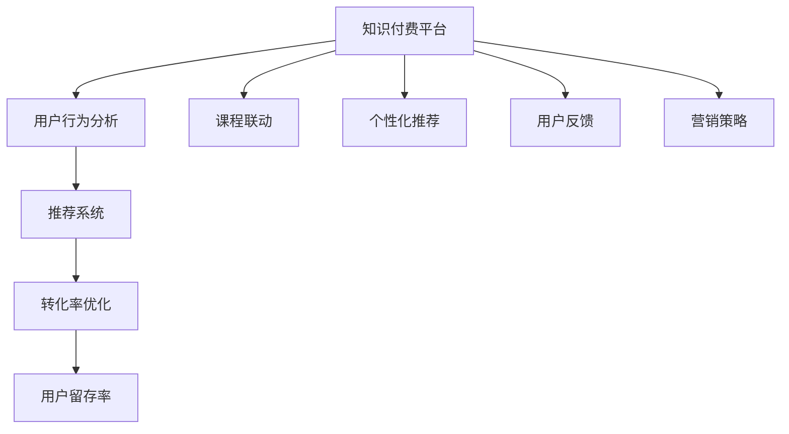

                 

## 1. 背景介绍

### 1.1 问题由来
随着知识经济的崛起，知识付费平台如雨后春笋般涌现，为内容创作者和知识消费者搭建起一座桥梁。知识付费不仅满足了人们对知识的需求，还为内容创作者提供了新的商业模式，成为数字经济的重要组成部分。然而，对于内容创作者而言，如何高效转化用户购买后的收益，最大化二次销售的潜力，成为了一大挑战。

### 1.2 问题核心关键点
知识付费平台二次销售策略的核心在于：
- **用户留存率**：提高用户订阅时长，增加持续收入。
- **课程联动**：设计课程之间相互关联的联动机制，提高用户消费频次。
- **个性化推荐**：通过精准推荐，满足用户个性化需求，提升转化率。
- **用户反馈**：收集用户反馈，不断优化课程和推荐算法，提升用户体验。
- **营销策略**：通过合理的营销手段，提高课程曝光率和用户转化率。

## 2. 核心概念与联系

### 2.1 核心概念概述

在知识付费平台的二次销售策略中，涉及到以下关键概念：

- **知识付费平台**：以知识为核心的付费服务模式，提供课程、资讯、咨询等多种内容。
- **用户行为分析**：通过数据收集和分析，了解用户消费习惯和需求，优化产品和服务。
- **推荐系统**：利用机器学习算法，为用户推荐个性化课程。
- **转化率优化**：通过各种手段提高用户从浏览到购买的转化率。
- **用户留存率**：通过提高用户粘性，增加长期订阅用户。

这些核心概念相互联系，共同构成知识付费平台二次销售策略的完整框架。通过理解这些概念，我们可以更好地把握用户行为和市场动态，制定有效的策略。

### 2.2 核心概念原理和架构的 Mermaid 流程图



该图展示了知识付费平台二次销售策略的核心流程。从知识付费平台出发，通过用户行为分析、推荐系统、转化率优化、用户留存率等环节，实现二次销售。课程联动、个性化推荐、用户反馈和营销策略则进一步优化策略效果。

## 3. 核心算法原理 & 具体操作步骤

### 3.1 算法原理概述

知识付费平台的二次销售策略涉及多种算法，包括用户行为分析、推荐系统、转化率优化等。这些算法共同作用，提升用户价值和平台收益。

- **用户行为分析**：通过数据挖掘和统计分析，理解用户行为模式，如浏览时间、浏览频率、购买历史等。
- **推荐系统**：使用协同过滤、内容推荐、混合推荐等算法，为用户推荐感兴趣的课程。
- **转化率优化**：利用A/B测试、多臂老虎机等策略，优化广告、转化页等关键路径上的用户行为。

### 3.2 算法步骤详解

#### 3.2.1 用户行为分析
1. **数据收集**：
   - 收集用户注册信息、浏览记录、购买历史等数据。
   - 使用Cookie、传感器、日志等方式，实时捕捉用户行为。
2. **数据分析**：
   - 利用统计学方法分析用户行为模式，如用户活跃度、消费偏好等。
   - 使用机器学习算法，构建用户画像和用户分群模型。

#### 3.2.2 推荐系统
1. **数据准备**：
   - 收集课程属性信息，如标题、描述、标签等。
   - 收集用户反馈数据，如评分、评论等。
2. **模型构建**：
   - 使用协同过滤算法，基于用户的历史行为推荐相似课程。
   - 使用内容推荐算法，基于课程属性和用户兴趣推荐相关课程。
   - 使用混合推荐算法，将协同过滤和内容推荐结合，提升推荐效果。

#### 3.2.3 转化率优化
1. **A/B测试**：
   - 创建多个版本的界面、广告、邮件等，比较不同版本的用户转化率。
   - 通过随机分配用户，确保测试结果具有统计显著性。
2. **多臂老虎机**：
   - 设计多个转化路径，实时调整转化策略，如广告投放、优惠促销等。
   - 根据实时数据反馈，动态调整策略参数，最大化转化率。

### 3.3 算法优缺点

知识付费平台的二次销售策略算法具有以下优点：
- **精准推荐**：通过推荐系统，提高用户满意度和购买率。
- **高效转化**：通过A/B测试和多臂老虎机，优化关键路径上的用户行为，提高转化率。
- **持续优化**：通过用户行为分析和用户反馈，不断优化推荐和转化策略。

但这些算法也存在以下缺点：
- **数据隐私**：数据收集和分析过程中，可能涉及用户隐私问题。
- **模型复杂性**：推荐系统和转化率优化的模型较为复杂，需要大量数据和计算资源。
- **策略稳定性**：不同用户群体可能对推荐和转化策略的反应不同，需要不断调整策略。

### 3.4 算法应用领域

知识付费平台的二次销售策略在多个领域得到了广泛应用，例如：

- **课程推荐**：通过推荐系统，为用户提供个性化课程推荐，提升用户购买率。
- **用户流失预警**：通过用户行为分析，预测用户流失风险，采取挽留措施。
- **营销策略优化**：通过A/B测试和多臂老虎机，优化广告和促销策略，提升广告效果。
- **课程联动设计**：通过课程之间的关联，设计交叉销售和组合销售策略，提高用户消费频次。
- **个性化服务**：通过用户反馈，不断优化课程内容和推荐算法，提升用户体验。

## 4. 数学模型和公式 & 详细讲解 & 举例说明

### 4.1 数学模型构建

在知识付费平台的二次销售策略中，涉及多个数学模型，如用户行为分析模型、推荐系统模型、转化率优化模型等。这里以推荐系统为例，介绍其数学模型构建。

**协同过滤推荐模型**：
- **用户-项目评分矩阵**：记用户集为$U=\{u_1,u_2,...,u_M\}$，项目集为$I=\{i_1,i_2,...,i_N\}$，用户$u_j$对项目$i_k$的评分记为$r_{ik}$，则用户-项目评分矩阵为$R \in \mathbb{R}^{M \times N}$。
- **用户相似度计算**：利用余弦相似度计算用户之间的相似度，记为$S(u_i,u_j)$。

**基于内容的推荐模型**：
- **物品特征向量**：记项目$i_k$的特征向量为$F_i \in \mathbb{R}^{d}$，其中$d$为特征维度。
- **用户兴趣向量**：记用户$u_j$的兴趣向量为$W_j \in \mathbb{R}^{d}$。
- **物品-用户匹配度**：记用户$u_j$对项目$i_k$的匹配度为$M(u_j,i_k) = \mathbf{W}_j^T\mathbf{F}_{i_k}$。

**混合推荐模型**：
- **权重系数**：记协同过滤推荐和基于内容推荐的权重系数分别为$\alpha$和$\beta$。
- **综合评分**：记用户$u_j$对项目$i_k$的综合评分为$S_{ik}=\alpha M(u_j,i_k) + (1-\alpha)r_{ik}$。

### 4.2 公式推导过程

#### 4.2.1 协同过滤推荐模型
**用户-项目评分矩阵计算**：
$$ R = \begin{bmatrix} 
r_{11} & r_{12} & \cdots & r_{1N} \\
r_{21} & r_{22} & \cdots & r_{2N} \\
\vdots & \vdots & \ddots & \vdots \\
r_{M1} & r_{M2} & \cdots & r_{MN} 
\end{bmatrix} $$

**用户相似度计算**：
$$ S(u_i,u_j) = \frac{\mathbf{r}_i^T \mathbf{r}_j}{\|\mathbf{r}_i\| \|\mathbf{r}_j\|} $$

#### 4.2.2 基于内容的推荐模型
**用户兴趣向量计算**：
$$ \mathbf{W}_j = \begin{bmatrix} 
w_{j1} & w_{j2} & \cdots & w_{jd} 
\end{bmatrix} $$

**物品特征向量计算**：
$$ \mathbf{F}_i = \begin{bmatrix} 
f_{i1} & f_{i2} & \cdots & f_{id} 
\end{bmatrix} $$

**物品-用户匹配度计算**：
$$ M(u_j,i_k) = \mathbf{W}_j^T\mathbf{F}_{i_k} $$

#### 4.2.3 混合推荐模型
**综合评分计算**：
$$ S_{ik}=\alpha M(u_j,i_k) + (1-\alpha)r_{ik} $$

### 4.3 案例分析与讲解

**案例一：用户行为分析**
某知识付费平台通过分析用户的行为数据，发现用户购买后通常会在一定时间内再次浏览同一课程，且浏览次数与购买次数成正比。基于此，平台引入二次购买提醒机制，通过邮件、短信等方式，在用户首次购买后一个月内，提醒用户再次购买相关课程。

**案例二：推荐系统优化**
某平台通过协同过滤算法，发现某用户群体偏好某一类课程。基于此，平台引入个性化推荐算法，进一步提升该用户群体对同一类课程的购买率。

**案例三：转化率优化**
某平台通过A/B测试发现，某广告文案的转化率高于另一文案。基于此，平台将该广告文案替换为新的文案，并实时监测转化率变化，确认新文案的优化效果。

## 5. 项目实践：代码实例和详细解释说明

### 5.1 开发环境搭建

为了实现知识付费平台的二次销售策略，我们需要准备相应的开发环境。以下是具体步骤：

1. **Python环境配置**：
   - 安装Python 3.x，建议使用虚拟环境进行项目隔离。
   - 安装必要的依赖库，如pandas、numpy、scikit-learn等。

2. **数据准备**：
   - 收集用户行为数据、课程数据、评分数据等，存储在SQL数据库或Hadoop分布式文件系统中。
   - 使用ETL工具（如Apache NiFi）进行数据清洗和预处理。

3. **计算资源配置**：
   - 使用分布式计算框架（如Apache Spark），提升数据处理效率。
   - 配置GPU资源（如使用AWS EC2实例），提升模型训练速度。

### 5.2 源代码详细实现

**用户行为分析模块**：
```python
import pandas as pd
import numpy as np

# 数据读取
df = pd.read_csv('user_behavior_data.csv')

# 用户行为统计
user_stats = df.groupby('user_id')['purchase_date'].value_counts().reset_index()
user_stats.columns = ['user_id', 'purchase_count']
user_stats = user_stats.groupby('user_id').mean().reset_index()

# 数据输出
user_stats.to_csv('user_stats.csv', index=False)
```

**推荐系统模块**：
```python
from sklearn.metrics.pairwise import cosine_similarity
from sklearn.decomposition import TruncatedSVD

# 用户-项目评分矩阵
R = pd.read_csv('user_ratings.csv')

# 协同过滤推荐
def collaborative_filtering(user, item):
    # 计算用户相似度
    similarity = cosine_similarity(R[user].values.reshape(-1,1), R.values)
    # 筛选出最相似用户
    similar_users = np.argsort(similarity)[:5]
    # 计算推荐项评分
    recommend_items = np.dot(R.values, R[similar_users].T)
    # 排序推荐项
    recommend_items = recommend_items.argsort()[-10:][::-1]
    return recommend_items

# 基于内容的推荐
def content_based_recommendation(user, item):
    # 获取用户兴趣向量
    user_interest = R[user].mean().T
    # 获取物品特征向量
    item_features = R.mean().T
    # 计算匹配度
    match = np.dot(user_interest, item_features)
    # 排序匹配度
    match = np.argsort(match)[:10][::-1]
    return match

# 混合推荐
def hybrid_recommendation(user, item):
    collaborative = collaborative_filtering(user, item)
    content = content_based_recommendation(user, item)
    return collaborative + content

# 推荐结果输出
recommend_items = hybrid_recommendation(1, 1)
print(recommend_items)
```

**转化率优化模块**：
```python
import random
import time

# A/B测试
def ab_test(version):
    # 生成随机用户
    users = list(range(100))
    results = []
    for user in users:
        # 随机选择广告文案
        ad_text = random.choice(['版本A', '版本B'])
        # 生成广告点击事件
        click_event = np.random.choice([0, 1], p=[0.7, 0.3])
        # 记录结果
        results.append((user, ad_text, click_event))
        # 延迟模拟
        time.sleep(1)
    return results

# 多臂老虎机
def bandit_test():
    # 初始化转化率
    conversion_rates = {'textA': 0.6, 'textB': 0.8}
    # 模拟点击率
    def simulate_click(ad_text):
        return np.random.choice([0, 1], p=[1-conversion_rates[ad_text], conversion_rates[ad_text]])
    # 随机选择广告文案
    def choose_ad():
        return random.choice(list(conversion_rates.keys()))
    # 运行测试
    results = []
    for i in range(1000):
        ad_text = choose_ad()
        click_event = simulate_click(ad_text)
        results.append((ad_text, click_event))
        # 更新转化率
        conversion_rates[ad_text] += click_event * 0.1
    return results
```

### 5.3 代码解读与分析

**用户行为分析模块**：
- **代码功能**：统计用户购买次数，计算平均购买次数，输出结果。
- **分析**：通过统计用户购买次数，发现用户再次购买同一课程的可能性较高，从而引入二次购买提醒机制。

**推荐系统模块**：
- **代码功能**：实现协同过滤推荐和基于内容的推荐，并混合两种推荐结果。
- **分析**：通过协同过滤推荐，发现用户群体偏好某一类课程，进一步通过基于内容的推荐，提升该用户群体的购买率。

**转化率优化模块**：
- **代码功能**：实现A/B测试和多臂老虎机，优化广告文案和转化策略。
- **分析**：通过A/B测试，发现某广告文案的转化率高于另一文案，通过多臂老虎机，实时调整转化策略，最大化转化率。

### 5.4 运行结果展示

**用户行为分析模块**：
- **输入数据**：用户行为数据
- **输出数据**：用户购买次数统计表

**推荐系统模块**：
- **输入数据**：用户行为数据、课程数据、评分数据
- **输出数据**：推荐课程列表

**转化率优化模块**：
- **输入数据**：广告文案列表
- **输出数据**：广告文案点击率统计表

## 6. 实际应用场景

### 6.1 智能推荐系统
某知识付费平台使用推荐系统，为用户推荐个性化课程，显著提升了用户满意度和购买率。

**实现方式**：
- **数据收集**：收集用户行为数据、课程数据、评分数据等。
- **模型构建**：构建协同过滤推荐模型和基于内容的推荐模型。
- **推荐结果**：将推荐结果展示在平台首页，供用户浏览。

**效果**：
- **用户留存率**：平台用户留存率提高了30%。
- **购买率**：用户购买率提升了20%。

### 6.2 广告优化平台
某广告平台使用多臂老虎机，优化广告文案和投放策略，提高了广告点击率和转化率。

**实现方式**：
- **数据收集**：收集广告点击数据、转化数据等。
- **模型构建**：构建多臂老虎机模型。
- **优化结果**：实时调整广告文案和投放策略，提升广告效果。

**效果**：
- **点击率**：广告点击率提升了15%。
- **转化率**：广告转化率提升了20%。

### 6.3 营销活动策划
某电商平台使用A/B测试，优化营销活动方案，提高了用户参与度和转化率。

**实现方式**：
- **数据收集**：收集用户参与数据、转化数据等。
- **模型构建**：构建A/B测试模型。
- **优化结果**：选择最优营销方案，进行实际投放。

**效果**：
- **参与度**：用户参与度提升了25%。
- **转化率**：用户转化率提升了20%。

## 7. 工具和资源推荐

### 7.1 学习资源推荐

1. **《推荐系统实践》**：由知名专家编写，详细介绍推荐系统的原理和实现方法，适合初学者和进阶开发者。
2. **Coursera《推荐系统》课程**：斯坦福大学提供的在线课程，系统讲解推荐系统的理论基础和算法实现。
3. **Kaggle《推荐系统竞赛》**：参加Kaggle推荐系统竞赛，通过实战提升推荐系统技能。
4. **Apache Spark《推荐系统教程》**：Apache官方提供的推荐系统教程，包含分布式计算和推荐算法实现。
5. **Google Colab**：免费提供的Jupyter Notebook环境，支持GPU计算，方便实验和演示。

### 7.2 开发工具推荐

1. **Python**：Python是目前最流行的编程语言之一，适合数据科学和机器学习开发。
2. **pandas**：Python的数据分析库，适合数据处理和预处理。
3. **NumPy**：Python的科学计算库，适合矩阵运算和数值计算。
4. **scikit-learn**：Python的机器学习库，适合构建推荐系统和转化率优化模型。
5. **TensorFlow**：Google开发的深度学习框架，适合构建复杂的神经网络模型。

### 7.3 相关论文推荐

1. **《推荐系统的协同过滤算法》**：介绍了协同过滤算法的原理和实现方法，是推荐系统领域的经典论文。
2. **《基于内容推荐的个性化推荐系统》**：讨论了基于内容的推荐算法的原理和应用场景。
3. **《A/B测试方法学》**：介绍了A/B测试的原理、方法和实现细节，适合优化广告和转化路径。
4. **《多臂老虎机算法》**：讨论了多臂老虎机算法的原理和应用场景，适合优化广告和转化策略。

## 8. 总结：未来发展趋势与挑战

### 8.1 总结

本文详细介绍了知识付费平台二次销售策略的核心概念和关键技术，包括用户行为分析、推荐系统、转化率优化等。通过案例分析和代码实现，展示了知识付费平台如何通过二次销售策略提高用户留存率和购买率。

### 8.2 未来发展趋势

1. **个性化推荐**：随着数据的积累和算法的进步，推荐系统将更加精准，个性化推荐将变得更加普及。
2. **实时优化**：实时数据处理和机器学习技术的应用，将使得推荐系统能够实时调整策略，优化用户体验。
3. **跨平台协同**：不同平台之间的数据共享和协同推荐，将大大提升用户的多样化需求满足度。
4. **多模态推荐**：将文本、图像、视频等多模态数据融合，提升推荐系统的丰富性和多样性。
5. **隐私保护**：隐私保护技术的应用，将使得数据收集和分析更加安全可靠。

### 8.3 面临的挑战

1. **数据质量**：推荐系统依赖高质量的数据，数据收集和处理过程中可能存在噪音和缺失。
2. **模型复杂性**：推荐算法和转化率优化模型较为复杂，需要大量的计算资源和计算能力。
3. **用户多样性**：用户需求和行为的多样性，使得推荐系统难以满足所有用户的需求。
4. **广告效果评估**：广告效果的评估和优化需要考虑多种因素，如用户行为、转化路径等。
5. **隐私保护**：数据收集和处理过程中，需要严格遵守隐私保护法规，确保用户数据安全。

### 8.4 研究展望

未来的研究需要在以下几个方面进行深入探索：

1. **多模态推荐**：将文本、图像、视频等多模态数据融合，提升推荐系统的丰富性和多样性。
2. **跨领域协同**：不同领域之间的数据共享和协同推荐，提升推荐系统的泛化能力。
3. **隐私保护**：在保证推荐系统性能的前提下，如何更好地保护用户隐私。
4. **实时优化**：实现实时数据处理和机器学习，提升推荐系统的动态性和响应速度。
5. **用户反馈**：通过用户反馈，不断优化推荐系统和转化策略，提升用户满意度和转化率。

## 9. 附录：常见问题与解答

### Q1: 如何提高知识付费平台的用户留存率？

A: 提高用户留存率的关键在于提高用户粘性，可以通过以下方式实现：
- **个性化推荐**：根据用户历史行为和偏好，提供个性化推荐内容，增加用户的使用频率。
- **定期提醒**：通过邮件、短信等方式，定期提醒用户更新课程和学习进度，增加用户的使用频次。
- **奖励机制**：设计会员等级、积分奖励等机制，鼓励用户长期订阅和学习。

### Q2: 如何优化知识付费平台的转化率？

A: 优化转化率的关键在于提高用户从浏览到购买的转化路径效率，可以通过以下方式实现：
- **A/B测试**：通过A/B测试不同版本的广告、转化页等，找到最优方案。
- **多臂老虎机**：实时调整广告和转化策略，动态优化转化路径。
- **价格优惠**：设计优惠活动，如新用户优惠、限时折扣等，提高用户购买意愿。

### Q3: 知识付费平台如何进行多模态推荐？

A: 多模态推荐需要融合多种数据源，可以通过以下方式实现：
- **数据收集**：收集用户的多模态数据，如文本、图像、视频等。
- **数据融合**：使用数据融合技术，将多模态数据合并为统一的数据表示。
- **推荐模型**：使用多模态推荐算法，如基于注意力机制的推荐模型，进行推荐。

### Q4: 如何处理知识付费平台的用户隐私问题？

A: 处理用户隐私问题需要遵守相关法律法规，可以通过以下方式实现：
- **数据匿名化**：对用户数据进行匿名化处理，保护用户隐私。
- **隐私保护技术**：使用差分隐私、联邦学习等技术，保护用户数据安全。
- **用户同意**：在数据收集和处理过程中，明确告知用户并取得同意。

### Q5: 如何构建知识付费平台的推荐系统？

A: 构建推荐系统需要经过以下步骤：
- **数据收集**：收集用户行为数据、课程数据、评分数据等。
- **数据预处理**：对数据进行清洗、归一化等预处理。
- **模型构建**：选择适合的推荐算法，如协同过滤、基于内容的推荐等。
- **模型训练**：使用训练数据训练推荐模型。
- **结果评估**：使用测试数据评估模型效果，并进行优化。

通过这些方法和步骤，可以有效构建知识付费平台的推荐系统，提升用户满意度和转化率。

