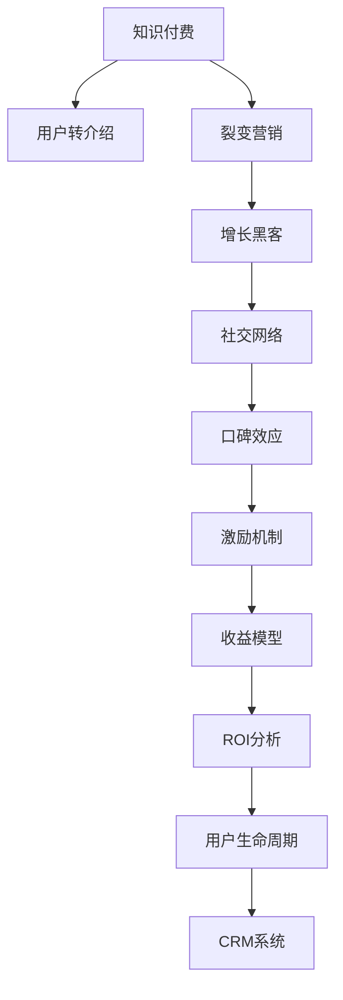

                 

# 知识付费赚钱的用户转介绍与裂变营销策略

> 关键词：知识付费,用户转介绍,裂变营销,增长黑客,社交网络,口碑效应,激励机制,收益模型,ROI分析,用户生命周期,CRM系统

## 1. 背景介绍

### 1.1 问题由来
随着知识付费的兴起，越来越多的企业和个人通过提供有价值的内容来赚钱。然而，获取新用户和提升收益的难度不断增加，单纯靠内容质量和推广很难持续增长。为了解决这个问题，用户转介绍和裂变营销成为一种高效、低成本的增长手段。本文将探讨如何通过用户转介绍和裂变营销策略，实现知识付费业务的持续增长。

### 1.2 问题核心关键点
用户转介绍和裂变营销的核心在于，通过构建良好的用户体验和激励机制，使现有用户自发推广新用户，形成良性循环。关键点包括：
- 设计有效的激励机制，如推荐奖励、专属优惠、好友折扣等。
- 建立基于社交网络的用户传播模型，利用口碑效应加速用户增长。
- 分析用户行为数据，制定精准的用户营销策略。
- 持续优化产品和服务，提高用户满意度和粘性。

### 1.3 问题研究意义
用户转介绍和裂变营销对于知识付费业务具有重要意义：
- 提升用户获取成本：通过用户自发推广，降低获取新用户的成本。
- 增强用户粘性：通过激励机制，提高用户对平台的依赖度，延长用户生命周期。
- 形成可持续增长：通过口碑效应，实现用户数量和收益的指数级增长。
- 提升品牌知名度：通过用户自发传播，提高品牌影响力和美誉度。

## 2. 核心概念与联系

### 2.1 核心概念概述

为更好地理解用户转介绍和裂变营销策略，本节将介绍几个关键概念：

- 知识付费（Knowledge Monetization）：指通过提供有价值的内容，如在线课程、电子书、音频视频等，收取费用以实现盈利。

- 用户转介绍（User Referral）：指现有用户向新用户推荐平台内容，新用户通过其推荐码注册并付费的行为。

- 裂变营销（Viral Marketing）：指利用用户自发传播的效应，通过特定的激励机制，使每个用户能够带来更多新用户，实现用户指数级增长。

- 增长黑客（Growth Hacker）：指通过数据驱动的方法，结合心理学、行为学等知识，设计和实施增长策略，快速提升业务增长。

- 社交网络（Social Network）：指用户通过社交媒体、社区平台等进行互动和信息传播的网络。

- 口碑效应（Word of Mouth Effect）：指用户通过口口相传，向他人推荐和传播信息，产生影响力和信任感。

- 激励机制（Incentive Mechanism）：指通过设计奖励、优惠等措施，激发用户参与推广的积极性。

- 收益模型（Revenue Model）：指根据不同的业务类型，制定合理的收费策略和收入计算方式。

- ROI分析（Return on Investment Analysis）：指通过计算投资回报率，评估营销活动的效果和收益。

- 用户生命周期（User Lifecycle）：指用户从初次接触到最终流失或升级的整个过程，包含获客、激活、留存、续订等多个阶段。

这些核心概念之间的逻辑关系可以通过以下Mermaid流程图来展示：



这个流程图展示了一个知识付费业务的用户转介绍和裂变营销策略的总体框架，其中各部分相互依赖和影响。

## 3. 核心算法原理 & 具体操作步骤
### 3.1 算法原理概述

用户转介绍和裂变营销的原理，是通过设计一系列激励机制，利用社交网络和口碑效应，让用户主动推广平台内容，实现用户指数级增长。

形式化地，假设平台有 $N$ 个用户，用户 $i$ 在推广平台内容后，能够带来 $p_i$ 个新用户。设 $P_i$ 为 $i$ 推荐给 $j$ 的概率，推广带来的收益为 $R$，每次推广的成本为 $C$。则平台通过用户转介绍和裂变营销的收益 $P$ 可表示为：

$$
P = \sum_{i=1}^N p_i \sum_{j=1}^N P_i \cdot R - C \cdot \sum_{i=1}^N \sum_{j=1}^N P_i
$$

通过最大化收益 $P$，可以推导出最优的激励机制和推广策略。

### 3.2 算法步骤详解

基于用户转介绍和裂变营销的原理，以下是一个典型的算法步骤：

**Step 1: 设计激励机制**
- 确定推荐奖励：如金钱奖励、积分奖励、会员特权等。
- 设定好友折扣：新用户通过好友推荐获得一定比例的优惠。
- 设计专属优惠：为新用户提供独家优惠或折扣。

**Step 2: 构建用户传播模型**
- 分析用户行为数据：通过统计分析，了解用户推荐偏好和传播渠道。
- 设计推荐算法：基于用户画像和行为数据，推荐用户感兴趣的内容。
- 构建推荐系统：使用机器学习模型，优化推荐效果。

**Step 3: 实施裂变营销**
- 制定推广计划：设定推广目标和时间表，确定推广策略。
- 发布推广内容：设计推广文案和渠道，如社交媒体、邮件营销等。
- 监测推广效果：实时跟踪推广数据，调整策略。

**Step 4: 分析推广效果**
- 计算ROI：通过收益和成本对比，评估推广效果。
- 优化推荐模型：根据推广效果，优化推荐算法和激励机制。
- 持续优化策略：不断调整推广计划和激励机制，提高推广效果。

### 3.3 算法优缺点

用户转介绍和裂变营销的优势在于：
- 低成本高效益：通过用户自发推广，降低获取新用户的成本。
- 用户粘性高：通过激励机制，提高用户对平台的依赖度。
- 效果显著：通过口碑效应，实现用户数量和收益的指数级增长。

同时，该方法也存在一些局限性：
- 激励机制设计复杂：需要结合心理学和行为学知识，设计有效的激励机制。
- 数据获取难度大：需要大量用户行为数据，难以快速获取和分析。
- 推广策略易失效：用户推广行为易受外部因素影响，策略效果不稳定。

尽管存在这些局限性，但就目前而言，用户转介绍和裂变营销是知识付费业务的重要增长手段。未来相关研究的重点在于如何进一步降低激励机制设计的复杂度，提高数据获取和分析的效率，同时兼顾推广策略的稳定性和可持续性。

### 3.4 算法应用领域

用户转介绍和裂变营销方法已经广泛应用于知识付费平台的各个领域，例如：

- 在线课程平台：如Coursera、Udemy、知乎live等，通过用户推荐和裂变营销，实现课程的广泛传播和订阅。
- 电子书和有声书平台：如Kindle、喜马拉雅等，利用用户推荐和专属优惠，提升电子书和有声书的销售量。
- 教育培训平台：如网易云课堂、腾讯课堂等，通过激励机制和口碑效应，提高平台的注册和转化率。

此外，用户转介绍和裂变营销也在企业培训、在线咨询、智能客服等多个领域得到了应用，为知识付费业务的发展提供了新的动力。

## 4. 数学模型和公式 & 详细讲解  
### 4.1 数学模型构建

本节将使用数学语言对用户转介绍和裂变营销的策略进行更加严格的刻画。

记平台有 $N$ 个用户，设每个用户推荐的平均新用户数为 $p$，推荐给新用户的概率为 $P$，推广带来的收益为 $R$，每次推广的成本为 $C$。则平台通过用户转介绍和裂变营销的收益 $P$ 可表示为：

$$
P = NpP(R - C)
$$

其中 $N$ 为平台用户数，$p$ 为每个用户平均推荐新用户数，$P$ 为推荐概率，$R$ 为每次推广收益，$C$ 为推广成本。

### 4.2 公式推导过程

通过上述模型，我们可以分析推广策略的效果。假设推广带来的平均收益为 $E[R]$，平均推广成本为 $E[C]$，则收益 $P$ 的期望为：

$$
E[P] = NE[pP(E[R] - E[C])]
$$

进一步分析，可以得出推广策略的ROI（投资回报率）为：

$$
ROI = \frac{E[P]}{E[C]} = E[\frac{pP(E[R] - E[C])}{E[C]}]
$$

### 4.3 案例分析与讲解

假设平台有 $N=10000$ 个用户，每个用户平均推荐 $p=2$ 个新用户，推荐概率 $P=0.1$，每次推广带来的平均收益 $E[R]=50$，平均推广成本 $E[C]=10$。则平台的期望收益为：

$$
E[P] = 10000 \cdot 2 \cdot 0.1 \cdot (50 - 10) = 900000
$$

推广策略的ROI为：

$$
ROI = \frac{900000}{10000 \cdot 10} = 9
$$

即每次推广的平均收益是成本的9倍，策略是可行的。

## 5. 项目实践：代码实例和详细解释说明
### 5.1 开发环境搭建

在进行用户转介绍和裂变营销实践前，我们需要准备好开发环境。以下是使用Python进行Django开发的环境配置流程：

1. 安装Python：从官网下载并安装Python，推荐使用最新稳定版。

2. 安装Django：通过命令行安装Django框架。
```bash
pip install django
```

3. 创建项目和应用：
```bash
django-admin startproject knowledge_market
cd knowledge_market
django-admin startapp referral
```

4. 安装第三方库：安装Django的第三方库，如django-allauth、django-crispy-forms等。
```bash
pip install django-allauth django-crispy-forms
```

5. 配置数据库：编辑settings.py文件，配置数据库连接。

完成上述步骤后，即可在项目中启动开发环境。

### 5.2 源代码详细实现

这里我们以一个简单的知识付费平台为例，实现用户转介绍和裂变营销的功能。

首先，定义用户和推荐记录模型：

```python
from django.db import models

class User(models.Model):
    username = models.CharField(max_length=50, unique=True)
    email = models.EmailField(unique=True)
    is_active = models.BooleanField(default=True)

    def __str__(self):
        return self.username

class Referral(models.Model):
    user = models.ForeignKey(User, on_delete=models.CASCADE)
    referred_user = models.ForeignKey(User, related_name='referrer', on_delete=models.CASCADE)
    created_at = models.DateTimeField(auto_now_add=True)
```

然后，实现用户转介绍的页面和功能：

```python
from django.shortcuts import render
from django.http import HttpResponse
from referral.models import User, Referral

def referral_view(request):
    if request.method == 'POST':
        user = User.objects.get(username=request.POST['username'])
        referred_user = User.objects.create_user(request.POST['email'], password=request.POST['password'])
        Referral.objects.create(user=user, referred_user=referred_user)
        return HttpResponse('User referred successfully.')
    else:
        return render(request, 'referral.html')
```

最后，在模板中渲染推荐页面：

```html
<!DOCTYPE html>
<html>
<head>
    <title>User Referral</title>
</head>
<body>
    <h1>Refer a User</h1>
    <form method="post">
        
        <label for="username">Username:</label>
        <input type="text" name="username"><br>
        <label for="email">Email:</label>
        <input type="email" name="email"><br>
        <input type="submit" value="Refer">
    </form>
</body>
</html>
```

通过上述代码，我们实现了一个简单的用户转介绍功能。用户填写被推荐用户的用户名和邮箱，提交后，系统创建被推荐用户，并记录推荐关系。

### 5.3 代码解读与分析

这里我们详细解读一下关键代码的实现细节：

**User和Referral模型**：
- `User`模型表示用户信息，包含用户名、邮箱和激活状态。
- `Referral`模型表示推荐记录，记录推荐用户和被推荐用户的信息，以及创建时间。

**referral_view函数**：
- 如果请求方法是POST，获取被推荐用户的用户名和邮箱，创建新用户，并记录推荐关系。
- 如果请求方法是GET，渲染推荐页面。

**模板代码**：
- 使用Django的模板语言，渲染推荐页面，包含表单输入字段。

通过上述代码，我们实现了用户转介绍的基本功能。当然，在实际应用中，还需要考虑更多因素，如激励机制、专属优惠、用户邀请码生成等，以实现更完善的裂变营销策略。

## 6. 实际应用场景
### 6.1 知识付费平台

用户转介绍和裂变营销在知识付费平台中的应用非常广泛。平台通过设计合理的激励机制，引导用户推广平台内容，实现用户快速增长。

在技术实现上，可以设计推荐奖励、专属优惠等激励机制，结合社交网络模型，通过邮件、短信等方式向用户发送推荐链接。同时，通过数据分析和A/B测试，不断优化推荐策略，提高用户转化率。

### 6.2 企业培训平台

企业培训平台可以利用用户转介绍和裂变营销，提高员工的参与度和学习效果。通过设计员工推荐奖励、课程专属优惠等激励机制，引导员工推荐同事参加培训课程，实现培训资源的快速传播和利用。

在技术实现上，可以设计推荐系统，根据员工的行为数据和兴趣偏好，推荐合适的课程。同时，通过记录推荐关系，分析推荐效果，不断优化推荐策略和激励机制。

### 6.3 在线咨询平台

在线咨询平台可以利用用户转介绍和裂变营销，提高平台的知名度和用户粘性。通过设计咨询师推荐奖励、咨询专属优惠等激励机制，引导咨询师推荐客户，实现客户资源的快速增长。

在技术实现上，可以设计推荐系统，根据咨询师和客户的行为数据和兴趣偏好，推荐合适的咨询师和咨询内容。同时，通过记录推荐关系，分析推荐效果，不断优化推荐策略和激励机制。

### 6.4 未来应用展望

随着用户转介绍和裂变营销技术的不断演进，其应用场景将更加丰富，覆盖更多行业。例如：

- 教育培训：在K12、成人教育等场景下，通过用户推荐和专属优惠，提高平台的课程覆盖面和用户参与度。
- 医疗健康：在在线问诊、健康管理等场景下，通过医生推荐和专属优惠，提高平台的医疗资源利用率。
- 在线金融：在理财规划、投资咨询等场景下，通过理财师推荐和专属优惠，提高平台的理财服务推广效果。

用户转介绍和裂变营销在未来将继续发挥重要作用，为各行各业的知识付费业务带来新的增长动力。

## 7. 工具和资源推荐
### 7.1 学习资源推荐

为了帮助开发者系统掌握用户转介绍和裂变营销的理论基础和实践技巧，这里推荐一些优质的学习资源：

1. 《增长黑客：用户增长方法论与实践》：介绍增长黑客的核心概念、方法论和实战案例，系统介绍用户转介绍和裂变营销策略。

2. 《社交网络分析：理论与应用》：介绍社交网络的基本概念、分析方法和应用场景，深入剖析用户传播模型。

3. 《用户体验设计：用设计思维提升产品价值》：介绍用户体验设计的核心方法和实战技巧，提升用户粘性和满意度。

4. 《数据驱动增长：增长黑客的数据分析与实战》：介绍数据分析在用户增长中的应用，通过数据驱动优化推广策略。

5. 《用户行为分析与优化：实战案例》：介绍用户行为分析的实用技巧和优化方法，提升用户转介绍和裂变营销效果。

通过对这些资源的学习实践，相信你一定能够快速掌握用户转介绍和裂变营销的精髓，并用于解决实际的推广问题。

### 7.2 开发工具推荐

高效的开发离不开优秀的工具支持。以下是几款用于用户转介绍和裂变营销开发的常用工具：

1. Django：Python开源的Web框架，提供快速开发、高效扩展的能力，适合开发复杂的前端页面和后端逻辑。

2. Allauth：Django的第三方库，提供用户注册、登录、授权等功能，方便实现用户管理和激励机制。

3. Crispy Forms：Django的第三方库，提供美观、易用的表单组件，提升用户体验和操作便捷性。

4. Redis：高性能的数据缓存系统，支持快速读写，适合存储用户行为数据和推荐记录。

5. Pandas：Python的数据分析库，支持快速数据处理和分析，适合分析用户行为数据和优化推广策略。

6. A/B Testing工具：如Optimizely、Google Optimize等，支持实验设计和效果评估，优化推广策略和激励机制。

合理利用这些工具，可以显著提升用户转介绍和裂变营销任务的开发效率，加快创新迭代的步伐。

### 7.3 相关论文推荐

用户转介绍和裂变营销的发展源于学界的持续研究。以下是几篇奠基性的相关论文，推荐阅读：

1. "Viral Marketing in Social Networks" by M. Easley and D. Kleinberg（2007）：介绍病毒式传播模型的基本概念和应用，分析用户转介绍和裂变营销的传播机制。

2. "How Viral Marketing Works" by J. B dynamic marketing (2011)：介绍病毒式营销的多种策略和案例，探讨如何通过激励机制提高用户传播效果。

3. "Social Contagion on Random Networks" by M. Easley and D. Kleinberg（2007）：分析社交网络中用户传播的传播机制和影响因素，为优化推广策略提供理论支持。

4. "Growth Hacking: A New Way to Develop Rapidly" by J. Bloom（2012）：介绍增长黑客的核心方法论，探讨如何通过数据驱动优化用户转介绍和裂变营销策略。

5. "Influence Maximization in Social Networks" by A. Arora et al.（2010）：介绍网络影响力最大化的基本概念和算法，优化用户推荐和传播策略。

这些论文代表了大语言模型微调技术的发展脉络。通过学习这些前沿成果，可以帮助研究者把握学科前进方向，激发更多的创新灵感。

## 8. 总结：未来发展趋势与挑战
### 8.1 总结

本文对用户转介绍和裂变营销方法进行了全面系统的介绍。首先阐述了用户转介绍和裂变营销的研究背景和意义，明确了其在知识付费业务中的独特价值。其次，从原理到实践，详细讲解了用户转介绍和裂变营销的数学模型和关键步骤，给出了详细的代码实现。同时，本文还广泛探讨了该方法在知识付费平台、企业培训、在线咨询等多个行业领域的应用前景，展示了其巨大的潜力。此外，本文精选了相关学习资源，力求为读者提供全方位的技术指引。

通过本文的系统梳理，可以看到，用户转介绍和裂变营销方法正在成为知识付费业务的重要增长手段，极大地拓展了平台的用户规模和收益。随着技术的不断发展，用户转介绍和裂变营销必将在更多领域得到应用，为知识付费业务带来新的增长动力。

### 8.2 未来发展趋势

展望未来，用户转介绍和裂变营销技术将呈现以下几个发展趋势：

1. 激励机制多样化：除了金钱奖励、积分奖励，未来的激励机制将更加多样化，如定制化产品、专享服务、社交认证等，进一步提升用户参与度。

2. 社交网络智能推荐：未来的社交网络推荐系统将更加智能，结合用户画像、兴趣偏好、行为数据等，实现更精准、个性化的用户推荐。

3. 多渠道推广融合：未来的用户推广将不仅仅局限于社交媒体，还将结合SEO、邮件营销、短信推送等多种渠道，实现多渠道协同推广。

4. 数据驱动优化：未来的推广策略将更加依赖数据驱动，通过机器学习算法和A/B测试，不断优化推荐策略和激励机制，实现最佳推广效果。

5. 全球化推广：未来的用户转介绍和裂变营销将更多地考虑全球化推广，结合不同地区和文化的用户特点，设计更有效的激励机制和推广策略。

以上趋势凸显了用户转介绍和裂变营销技术的广阔前景。这些方向的探索发展，必将进一步提升知识付费平台的增长速度，为更多企业带来成功案例。

### 8.3 面临的挑战

尽管用户转介绍和裂变营销方法已经取得了显著效果，但在实际应用中仍面临诸多挑战：

1. 激励机制设计复杂：需要综合考虑用户需求和平台成本，设计合理的激励机制。

2. 用户行为多变：用户行为受多种因素影响，推广策略的效果难以预测和控制。

3. 数据隐私保护：用户数据隐私保护是推广策略中的重要问题，如何在推广和隐私保护之间取得平衡，是关键挑战。

4. 跨平台推广难度大：不同平台的推广策略需要相互协调，确保推广效果一致性和协同性。

5. 成本效益分析：推广策略的成本和效益分析复杂，需要精确计算和实时跟踪。

尽管存在这些挑战，但通过不断优化策略、提升技术和数据分析能力，用户转介绍和裂变营销必将在未来取得更大成功。

### 8.4 研究展望

未来的研究需要在以下几个方面寻求新的突破：

1. 设计更加多样化和个性化的激励机制，结合用户画像和行为数据，提高用户参与度。

2. 开发智能推荐算法，结合用户兴趣偏好和行为数据，实现精准推荐。

3. 引入多渠道推广策略，结合社交媒体、SEO、邮件营销等多种渠道，实现多渠道协同推广。

4. 加强数据隐私保护，采用加密技术和匿名化处理，保护用户隐私。

5. 进行跨平台推广策略的优化，确保不同平台推广效果一致性。

6. 建立实时成本效益分析系统，精确计算推广策略的成本和效益，优化推广策略。

这些研究方向将推动用户转介绍和裂变营销技术的不断进步，实现知识付费业务的持续增长和优化。

## 9. 附录：常见问题与解答

**Q1：用户转介绍和裂变营销的核心关键点是什么？**

A: 用户转介绍和裂变营销的核心关键点在于设计有效的激励机制，利用社交网络和口碑效应，让用户自发推广平台内容，实现用户指数级增长。

**Q2：如何设计激励机制？**

A: 激励机制的设计需要结合用户需求和平台成本，设计合理的激励方式，如金钱奖励、积分奖励、专属优惠等。同时，需要考虑激励机制的持续性和可操作性，避免激励效果下降或难以实施。

**Q3：用户转介绍和裂变营销的数学模型是什么？**

A: 用户转介绍和裂变营销的数学模型可以通过计算推广收益和推广成本，分析推荐策略的效果。具体模型为 $P = NpP(R - C)$，其中 $N$ 为平台用户数，$p$ 为每个用户平均推荐新用户数，$P$ 为推荐概率，$R$ 为每次推广收益，$C$ 为推广成本。

**Q4：用户转介绍和裂变营销的实际应用场景有哪些？**

A: 用户转介绍和裂变营销在知识付费平台、企业培训、在线咨询等多个领域得到了应用，为这些平台的增长提供了新的动力。

**Q5：用户转介绍和裂变营销的开发工具有哪些？**

A: 用户转介绍和裂变营销的开发工具包括Django、Allauth、Crispy Forms、Redis、Pandas等，这些工具可以显著提升开发效率和推广效果。

通过以上分析和解释，相信你能够更好地理解和掌握用户转介绍和裂变营销的核心方法和应用技巧，为知识付费平台的持续增长提供有力支持。

