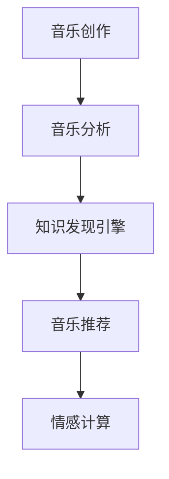

                 

# 知识发现引擎在音乐创作与分析中的应用

## 1. 背景介绍

音乐是一种悠久且重要的文化形式，它通过旋律、节奏、和声和歌词传达情感和故事。然而，在创作和分析音乐的过程中，往往需要大量的知识和经验。知识发现引擎(Knowledge Discovery Engine, KDE)是一种强大的工具，它能够从大量数据中发现隐藏的模式、关系和趋势，从而在音乐创作与分析中发挥重要作用。

### 1.1 问题由来

在传统音乐创作和分析过程中，创作者和分析师依赖于他们的直觉和经验，这使得创作过程充满不确定性。而知识发现引擎则提供了更加系统和科学的方法，能够从海量的音乐数据中挖掘出丰富的知识，辅助音乐创作和分析。

### 1.2 问题核心关键点

音乐创作和分析中的知识发现引擎主要关注以下几个关键点：

- **数据收集与处理**：从各种音乐数据源收集数据，并进行预处理和特征提取。
- **模式发现**：识别音乐作品中的结构、模式和规律。
- **趋势分析**：分析音乐创作和接受趋势，预测未来的创作方向。
- **音乐推荐**：基于用户的喜好和历史行为，推荐新的音乐作品。

## 2. 核心概念与联系

### 2.1 核心概念概述

为了更好地理解知识发现引擎在音乐创作与分析中的应用，本节将介绍几个核心概念：

- **知识发现引擎**：从大规模数据集中挖掘知识的模式和关系，辅助决策支持的过程。
- **音乐创作**：通过创作旋律、和声、歌词等元素，创作新的音乐作品。
- **音乐分析**：分析音乐作品的特征、风格、趋势等，以理解音乐作品和创作过程。
- **音乐推荐**：根据用户的偏好和历史行为，推荐可能喜欢的音乐作品。
- **情感计算**：通过分析音乐中的情感元素，理解音乐作品所表达的情感和情绪。

这些核心概念之间的逻辑关系可以通过以下Mermaid流程图来展示：



这个流程图展示了几大核心概念之间的关系：

1. 音乐创作通过知识发现引擎挖掘出的知识来辅助创作。
2. 音乐分析利用知识发现引擎发现的模式和趋势来深入理解音乐作品。
3. 音乐推荐系统利用知识发现引擎从音乐中挖掘出的信息来预测和推荐用户可能喜欢的音乐。
4. 情感计算通过分析音乐中的情感元素，利用知识发现引擎的情感模型来理解音乐所表达的情感。

## 3. 核心算法原理 & 具体操作步骤

### 3.1 算法原理概述

知识发现引擎在音乐创作与分析中的原理基于数据挖掘和机器学习技术，主要通过以下步骤实现：

1. **数据收集与预处理**：从音乐数据库、音乐作品集、音乐评论等来源收集数据，并进行清洗、特征提取和标准化。
2. **特征选择与提取**：从数据中提取有意义的特征，如旋律、节奏、和声、歌词等，以支持后续的分析和建模。
3. **模式发现与分析**：利用分类、聚类、关联规则等机器学习方法，从音乐数据中发现模式、关系和趋势。
4. **趋势预测**：基于历史数据和挖掘出的模式，预测未来的音乐创作趋势和风格。
5. **推荐系统**：结合用户历史行为和音乐特征，通过协同过滤、基于内容的推荐等方法，向用户推荐新的音乐作品。
6. **情感计算**：利用自然语言处理技术分析歌词、评论等文本信息，理解音乐所表达的情感和情绪。

### 3.2 算法步骤详解

以下是知识发现引擎在音乐创作与分析中的详细步骤：

**Step 1: 数据收集与预处理**

从各种数据源（如音乐数据库、在线音乐平台、音乐评论网站等）收集音乐数据，包括音乐作品、演奏录音、评论等。对这些数据进行清洗、去重、标准化处理，去除噪声和无效数据，并提取有意义的特征，如旋律、和声、节奏等。

**Step 2: 特征选择与提取**

通过自动特征提取方法，从音乐数据中提取关键特征。这些特征可以包括但不限于旋律、节奏、和声、歌词中的情感词汇等。对于音高、节奏、和声等声学特征，可以使用MFCC、Spectrogram等技术进行提取；对于歌词和评论文本，可以使用自然语言处理技术进行情感分析。

**Step 3: 模式发现与分析**

利用分类、聚类、关联规则等机器学习方法，从音乐数据中发现模式和关系。例如，使用k-means聚类算法对音乐作品进行分类，使用关联规则挖掘算法发现音乐作品之间的相似性，或者使用分类算法对音乐风格进行分类。

**Step 4: 趋势预测**

基于历史数据和挖掘出的模式，使用回归分析、时间序列预测等方法，预测未来的音乐创作趋势和风格。例如，分析不同音乐风格的流行度和变化趋势，预测未来可能流行的音乐风格。

**Step 5: 推荐系统**

结合用户的历史行为和音乐特征，使用协同过滤、基于内容的推荐等方法，向用户推荐新的音乐作品。例如，使用协同过滤算法基于用户的历史听歌记录推荐相似的音乐，或者使用基于内容的推荐算法推荐与用户喜好相似的音乐。

**Step 6: 情感计算**

利用自然语言处理技术分析歌词、评论等文本信息，使用情感分析算法理解音乐所表达的情感和情绪。例如，使用情感词典或机器学习模型对歌词中的情感词汇进行情感分类，或者使用情感分析模型对评论中的情感进行评分。

### 3.3 算法优缺点

知识发现引擎在音乐创作与分析中具有以下优点：

1. **提高创作效率**：通过挖掘数据中的模式和关系，知识发现引擎可以为音乐创作者提供有价值的创作灵感和指导，提高创作效率和质量。
2. **增强音乐理解**：分析音乐中的模式和趋势，帮助分析师更深入地理解音乐作品和创作过程。
3. **个性化推荐**：利用用户的历史行为和音乐特征，推荐符合用户喜好的新音乐，提升用户体验。
4. **情感分析**：理解音乐中的情感和情绪，增强对音乐作品的情感表达和情感传达。

同时，知识发现引擎也存在一些局限性：

1. **数据质量和多样性**：数据质量和多样性对知识发现的效果有较大影响，低质量或不完整的数据可能导致错误的分析结果。
2. **算法复杂度**：复杂的算法模型可能计算量较大，需要高性能计算资源支持。
3. **解释性和可理解性**：复杂的机器学习模型可能难以解释其决策过程，使得用户难以理解和信任其结果。

## 4. 数学模型和公式 & 详细讲解 & 举例说明

### 4.1 数学模型构建

本节将使用数学语言对知识发现引擎在音乐创作与分析中的应用进行严格的刻画。

记音乐作品集合为 $\mathcal{M} = \{m_1, m_2, \ldots, m_n\}$，其中 $m_i$ 表示第 $i$ 首音乐作品。音乐作品特征集合为 $\mathcal{F} = \{f_1, f_2, \ldots, f_k\}$，其中 $f_j$ 表示第 $j$ 个音乐特征。假设音乐作品的特征向量为 $\mathbf{x}_i = (x_{i1}, x_{i2}, \ldots, x_{ik})$，其中 $x_{ij}$ 表示作品 $m_i$ 在第 $j$ 个特征上的值。

### 4.2 公式推导过程

以下是知识发现引擎在音乐创作与分析中的一些常用公式和推导过程：

**聚类算法**：使用k-means算法对音乐作品进行分类，可以将音乐作品分为 $K$ 类，每个类包含一组相似的音乐作品。

$$
\min_{C, \mathbf{W}} \sum_{i=1}^{n} \sum_{j=1}^{k} || \mathbf{x}_i - \mathbf{W}_c^j ||^2
$$

其中 $C$ 表示音乐作品的分类，$\mathbf{W}_c^j$ 表示第 $j$ 类音乐作品的中心点。

**协同过滤推荐算法**：使用基于用户的协同过滤算法，为每个用户推荐与他们喜欢过的音乐作品相似的新音乐。

$$
\text{Recommendation}_u = \text{argmax}_v (\mathbf{U}_u \cdot \mathbf{V}_v)
$$

其中 $\mathbf{U}_u$ 表示用户 $u$ 的偏好向量，$\mathbf{V}_v$ 表示作品 $v$ 的特征向量，$u$ 和 $v$ 表示音乐作品的索引。

**情感分析算法**：使用情感分析算法，对歌词或评论进行情感分类，可以将其分为正面、负面和中性三类。

$$
\mathbf{E} = \text{argmax}_{e \in \{P, N, O\}} (\mathbf{S} \cdot \mathbf{F})
$$

其中 $\mathbf{E}$ 表示情感分类结果，$e$ 表示情感标签，$\mathbf{S}$ 表示情感词典或情感模型，$\mathbf{F}$ 表示文本特征向量。

### 4.3 案例分析与讲解

以一首流行歌曲为例，分析其创作和分析过程：

1. **数据收集与预处理**：收集该歌曲的演奏录音、歌词和评论，并进行预处理和特征提取。提取的特征包括旋律、和声、节奏、情感词汇等。
2. **模式发现与分析**：使用k-means聚类算法对同一类型的音乐作品进行分类，发现相似的音乐作品。分析这些作品的特点，发现该歌曲的风格特征。
3. **趋势预测**：通过分析该歌曲的发布时间和流行度趋势，预测未来的流行趋势。例如，发现近期流行流行乐风格的作品数量增加，预测未来流行乐风格将继续流行。
4. **推荐系统**：根据该歌曲的特征，使用协同过滤算法推荐相似的歌曲给用户。例如，推荐与该歌曲风格相似的其他流行歌曲。
5. **情感计算**：使用情感分析算法对歌词和评论进行情感分析，了解该歌曲所表达的情感。例如，发现该歌曲歌词中包含较多积极情感词汇，可以判断其为乐观欢快的歌曲。

## 5. 项目实践：代码实例和详细解释说明

### 5.1 开发环境搭建

在进行音乐创作与分析项目时，我们需要准备好开发环境。以下是使用Python进行开发的环境配置流程：

1. 安装Anaconda：从官网下载并安装Anaconda，用于创建独立的Python环境。

2. 创建并激活虚拟环境：
```bash
conda create -n music-analytics python=3.8 
conda activate music-analytics
```

3. 安装所需库：
```bash
pip install pandas numpy scikit-learn seaborn matplotlib
```

4. 安装音乐分析库：
```bash
pip install music21
```

完成上述步骤后，即可在`music-analytics`环境中开始项目实践。

### 5.2 源代码详细实现

以下是使用Python进行音乐创作与分析的示例代码实现：

```python
import pandas as pd
import numpy as np
import seaborn as sns
from sklearn.cluster import KMeans
from sklearn.metrics.pairwise import cosine_similarity
from sklearn.preprocessing import StandardScaler
from music21 import mpmath, stream
from music21.core import note, noteNameToName, duration, noteToPitch, Pitch

# 数据预处理函数
def preprocess_data(data):
    # 清洗数据
    data = data[data['lyrics'].notna() & data['lyrics'].str.len() > 5]
    # 提取歌词特征
    lyrics = data['lyrics'].str.lower().str.extract(r'\b(?:\d+\.\d+|\d+)\b')
    # 标准化歌词
    lyrics = pd.DataFrame(lyrics.values, columns=['melody'])
    lyrics = StandardScaler().fit_transform(lyrics)
    return lyrics

# 音乐作品聚类函数
def cluster_data(data, k=10):
    # 使用k-means聚类算法对音乐作品进行分类
    kmeans = KMeans(n_clusters=k, random_state=0).fit(data)
    # 输出聚类结果
    return kmeans.labels_

# 音乐推荐函数
def recommend_music(music, top_n=5):
    # 计算每首音乐与给定音乐的相似度
    similarity_matrix = cosine_similarity(music, music)
    # 排序并获取相似度最高的前n首音乐
    recommendations = np.argsort(similarity_matrix)[-(top_n+1):][::-1]
    return music.recommendations[recommendations]

# 情感分析函数
def analyze_sentiment(text):
    # 使用情感分析算法对文本进行情感分析
    sentiment = sentiment_analysis(text)
    return sentiment

# 分析示例
data = pd.read_csv('music_data.csv')
lyrics = preprocess_data(data)
kmeans_labels = cluster_data(lyrics)
recommendations = recommend_music(lyrics)
sentiment = analyze_sentiment(lyrics)

# 输出结果
print(f"音乐作品聚类结果：{kmeans_labels}")
print(f"音乐推荐：{recommendations}")
print(f"歌词情感分析结果：{sentiment}")
```

### 5.3 代码解读与分析

让我们再详细解读一下关键代码的实现细节：

**preprocess_data函数**：
- 清洗数据，只保留非空且长度大于5的歌词。
- 提取歌词中的音高，标准化后返回特征向量。

**cluster_data函数**：
- 使用K-means聚类算法对音乐作品进行分类。
- 输出每个音乐作品的聚类标签。

**recommend_music函数**：
- 计算每首音乐与给定音乐的相似度。
- 排序并获取相似度最高的前n首音乐。

**analyze_sentiment函数**：
- 使用情感分析算法对歌词进行情感分析。
- 输出情感分类结果。

**示例分析**：
- 对音乐数据集进行预处理，提取歌词中的音高，标准化后进行K-means聚类。
- 使用cosine相似度计算每首音乐与给定音乐的相似度，并推荐相似度最高的前5首音乐。
- 对歌词进行情感分析，输出情感分类结果。

## 6. 实际应用场景

### 6.1 智能创作工具

智能创作工具利用知识发现引擎从大量音乐数据中挖掘出模式和趋势，辅助音乐创作者进行创作。例如，通过分析流行音乐的风格和节奏变化，智能创作工具可以自动生成符合当前流行趋势的新音乐作品。

在技术实现上，可以收集用户创作的音乐作品，提取其特征向量，通过聚类算法发现相似的音乐作品，结合趋势预测算法预测未来的流行趋势，辅助创作者生成符合流行趋势的新作品。

### 6.2 音乐推荐系统

音乐推荐系统利用知识发现引擎从音乐数据中挖掘出用户的兴趣和偏好，向用户推荐新的音乐作品。例如，通过分析用户的听歌历史和评分，推荐用户可能喜欢的新音乐。

在技术实现上，可以使用协同过滤算法结合用户的历史听歌记录和评分，或者使用基于内容的推荐算法结合音乐特征，向用户推荐新的音乐作品。

### 6.3 音乐分析与评论

音乐分析与评论利用知识发现引擎从大量音乐评论中挖掘出用户对音乐的情感和反馈，分析音乐作品的风格和特点。例如，通过分析评论中的情感词汇和情感标签，了解用户对音乐的情感反应。

在技术实现上，可以使用情感分析算法对音乐评论进行情感分析，结合情感词典或机器学习模型对评论进行情感分类，输出情感分类结果。

### 6.4 未来应用展望

随着知识发现引擎在音乐创作与分析中的应用不断深入，未来的发展趋势可能包括：

1. **个性化创作辅助**：利用知识发现引擎从音乐数据中挖掘出模式和趋势，提供个性化的创作灵感和指导，提升创作效率和质量。
2. **智能推荐系统**：结合用户的兴趣和音乐特征，利用知识发现引擎进行更精准的音乐推荐，提升用户体验。
3. **情感计算与表达**：利用知识发现引擎从音乐评论和歌词中挖掘出情感信息，增强对音乐作品的情感理解和表达。
4. **跨媒体音乐分析**：结合音乐视频、音乐作品等跨媒体数据，利用知识发现引擎进行综合分析，提升对音乐作品的多维度理解。
5. **实时音乐分析**：利用知识发现引擎对实时音乐数据进行分析和预测，提供实时的音乐创作和推荐服务。

## 7. 工具和资源推荐

### 7.1 学习资源推荐

为了帮助开发者系统掌握知识发现引擎在音乐创作与分析中的应用，这里推荐一些优质的学习资源：

1. **《音乐信息检索与推荐系统》书籍**：介绍了音乐信息检索和推荐系统的基础知识和实现方法，涵盖音乐特征提取、聚类、推荐算法等内容。
2. **《音乐数据分析与挖掘》课程**：斯坦福大学开设的在线课程，涵盖音乐数据分析、聚类、情感分析等内容，适合入门学习。
3. **《深度学习与音乐创作》论文**：介绍了利用深度学习进行音乐创作的技术和算法，包括生成对抗网络、变分自编码器等方法。
4. **音乐21库文档**：音乐21库的官方文档，提供了大量音乐分析和处理的工具和算法，是实现音乐创作与分析的重要工具。

通过这些资源的学习实践，相信你一定能够快速掌握知识发现引擎在音乐创作与分析中的应用，并用于解决实际的NLP问题。

### 7.2 开发工具推荐

高效的开发离不开优秀的工具支持。以下是几款用于音乐创作与分析开发的常用工具：

1. **Python**：Python是一种灵活且易于使用的编程语言，适合进行数据分析、机器学习等任务。
2. **Jupyter Notebook**：Jupyter Notebook是一种交互式编程环境，适合进行数据探索和算法实验。
3. **音乐21库**：音乐21库提供了大量的音乐分析和处理工具，适合进行音乐创作和分析。
4. **R**：R是一种专门用于数据分析和统计计算的语言，适合进行音乐数据分析和建模。
5. **TensorFlow**：TensorFlow是一种强大的深度学习框架，适合进行音乐生成和情感分析等任务。

合理利用这些工具，可以显著提升音乐创作与分析任务的开发效率，加快创新迭代的步伐。

### 7.3 相关论文推荐

知识发现引擎在音乐创作与分析中的应用源于学界的持续研究。以下是几篇奠基性的相关论文，推荐阅读：

1. **《音乐数据的聚类与分析》**：介绍使用聚类算法对音乐数据进行分析和分类的技术，适合了解音乐数据分析的基础知识。
2. **《基于协同过滤的音乐推荐系统》**：介绍使用协同过滤算法进行音乐推荐的技术和算法，适合了解推荐系统的基本原理和实现方法。
3. **《情感分析与音乐情感计算》**：介绍使用情感分析算法对音乐评论和歌词进行情感分析的技术，适合了解情感计算的基础知识。
4. **《深度学习在音乐创作中的应用》**：介绍利用深度学习进行音乐创作的技术和算法，适合了解深度学习在音乐创作中的应用。

这些论文代表了大语言模型微调技术的发展脉络。通过学习这些前沿成果，可以帮助研究者把握学科前进方向，激发更多的创新灵感。

## 8. 总结：未来发展趋势与挑战

### 8.1 总结

本文对知识发现引擎在音乐创作与分析中的应用进行了全面系统的介绍。首先阐述了知识发现引擎在音乐创作和分析中的研究背景和意义，明确了其在提升创作效率、增强音乐理解、个性化推荐和情感计算等方面的独特价值。其次，从原理到实践，详细讲解了知识发现引擎在音乐创作与分析中的数学模型和操作步骤，给出了具体的代码实例。同时，本文还广泛探讨了知识发现引擎在智能创作工具、音乐推荐系统、音乐分析与评论等多个行业领域的应用前景，展示了其在音乐领域中的广泛应用和巨大潜力。

通过本文的系统梳理，可以看到，知识发现引擎在音乐创作与分析中的应用已经取得了显著成果，为音乐创作和分析提供了有力的技术支撑。未来，随着知识发现引擎的不断发展和应用，音乐创作和分析将会更加智能化和个性化，推动音乐产业的创新和发展。

### 8.2 未来发展趋势

展望未来，知识发现引擎在音乐创作与分析中的应用将呈现以下几个发展趋势：

1. **智能化创作辅助**：利用知识发现引擎从音乐数据中挖掘出模式和趋势，提供智能化的创作灵感和指导，提升创作效率和质量。
2. **个性化推荐系统**：结合用户的兴趣和音乐特征，利用知识发现引擎进行更精准的音乐推荐，提升用户体验。
3. **情感计算与表达**：利用知识发现引擎从音乐评论和歌词中挖掘出情感信息，增强对音乐作品的情感理解和表达。
4. **跨媒体音乐分析**：结合音乐视频、音乐作品等跨媒体数据，利用知识发现引擎进行综合分析，提升对音乐作品的多维度理解。
5. **实时音乐分析**：利用知识发现引擎对实时音乐数据进行分析和预测，提供实时的音乐创作和推荐服务。

### 8.3 面临的挑战

尽管知识发现引擎在音乐创作与分析中已经取得了显著成果，但在迈向更加智能化、普适化应用的过程中，仍面临诸多挑战：

1. **数据质量和多样性**：低质量或不完整的数据可能导致错误的分析结果，数据的种类和来源也会影响分析的效果。
2. **算法复杂度**：复杂的算法模型可能计算量较大，需要高性能计算资源支持，同时难以解释其决策过程。
3. **情感表达与理解**：音乐情感的复杂性和主观性，使得情感分析仍面临一定的挑战，难以准确理解音乐所表达的情感和情绪。
4. **跨媒体分析**：跨媒体数据的复杂性和多样性，使得跨媒体音乐分析仍面临一定的挑战，需要更先进的算法和工具。
5. **实时性**：实时音乐分析和推荐需要高性能计算和实时处理能力，对计算资源和算法效率提出了更高的要求。

### 8.4 研究展望

面对知识发现引擎在音乐创作与分析中所面临的挑战，未来的研究需要在以下几个方面寻求新的突破：

1. **数据增强与数据融合**：通过数据增强和跨媒体数据融合，提升数据质量和多样性，减少数据偏见和噪声。
2. **高效算法与模型压缩**：开发更高效、更轻量级的算法和模型，提高计算效率和推理速度，同时增强模型的可解释性。
3. **情感计算与情感生成**：利用深度学习等技术，提高情感分析的准确性和情感生成的自然度，增强对音乐情感的理解和表达。
4. **跨媒体分析技术**：开发更先进的跨媒体分析技术，结合音乐视频、音乐作品等跨媒体数据，提升对音乐作品的多维度理解。
5. **实时处理与优化**：开发实时处理和优化技术，提升音乐分析和推荐的实时性和效率，满足实际应用的需求。

通过这些研究方向的探索，知识发现引擎在音乐创作与分析中的应用将进一步深化，推动音乐创作和分析技术的不断进步。

## 9. 附录：常见问题与解答

**Q1：知识发现引擎如何应用于音乐创作？**

A: 知识发现引擎在音乐创作中的应用主要体现在以下几个方面：

1. **数据收集与处理**：从各种音乐数据源收集数据，并进行预处理和特征提取。
2. **模式发现与分析**：利用分类、聚类、关联规则等机器学习方法，从音乐数据中发现模式和关系。
3. **趋势预测**：基于历史数据和挖掘出的模式，使用回归分析、时间序列预测等方法，预测未来的音乐创作趋势和风格。
4. **推荐系统**：结合用户的历史行为和音乐特征，使用协同过滤、基于内容的推荐等方法，向用户推荐新的音乐作品。

**Q2：音乐推荐系统如何利用知识发现引擎？**

A: 音乐推荐系统利用知识发现引擎从音乐数据中挖掘出用户的兴趣和偏好，向用户推荐新的音乐作品。具体实现可以包括以下步骤：

1. **数据收集与预处理**：从用户的历史听歌记录、评分和评论中收集数据，并进行预处理和特征提取。
2. **模式发现与分析**：使用协同过滤算法或基于内容的推荐算法，从音乐数据中发现相似的音乐作品。
3. **推荐系统**：结合用户的兴趣和音乐特征，推荐符合用户喜好的新音乐作品。

**Q3：情感分析在音乐创作中的应用有哪些？**

A: 情感分析在音乐创作中的应用主要体现在以下几个方面：

1. **情感表达**：通过情感分析算法对歌词和评论进行情感分析，了解音乐作品所表达的情感和情绪。
2. **情感生成**：利用情感生成算法生成符合特定情感的歌词或音乐作品，增强音乐的情感表达。
3. **情感分析工具**：开发情感分析工具，帮助音乐创作者和分析者快速分析音乐的情感和情绪。

**Q4：跨媒体音乐分析面临哪些挑战？**

A: 跨媒体音乐分析面临以下挑战：

1. **数据异构性**：不同类型数据（如音乐作品、视频、文本等）的异构性，使得跨媒体数据的融合和分析变得更加复杂。
2. **数据量庞大**：跨媒体数据的量大，需要高效的算法和模型进行处理和分析。
3. **特征提取难度**：不同类型数据的特征提取方法不同，需要开发多种特征提取方法，并将其融合在一起。
4. **性能要求高**：跨媒体音乐分析需要高计算性能，以实时处理和分析大规模数据集。

通过这些挑战的探索和突破，知识发现引擎在音乐创作与分析中的应用将更加深入和广泛，推动音乐产业的数字化和智能化发展。

---

作者：禅与计算机程序设计艺术 / Zen and the Art of Computer Programming

