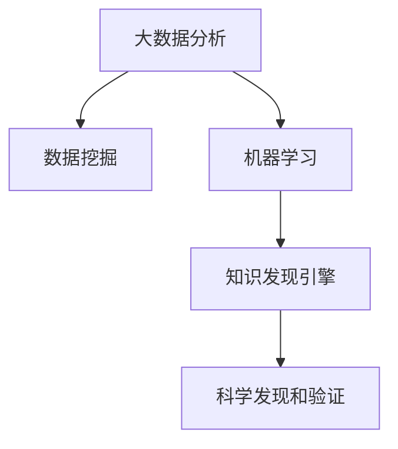

                 

# 知识发现引擎如何加速科学突破

> 关键词：知识发现引擎,科学数据处理,大数据分析,数据挖掘,机器学习,人工智能,前沿科学研究,高效计算

## 1. 背景介绍

### 1.1 问题由来

现代科学的发展日益依赖于数据的积累和分析。无论是天文学、生物学、材料科学，还是物理学、化学、地球科学等传统领域，大数据、复杂数据集和高维数据等新型科学数据的爆发式增长，使得传统的数据分析方法难以应对。如何从海量数据中提取有效知识、加速科学突破，成为现代科学研究的核心挑战。

在这一背景下，知识发现引擎应运而生。通过大规模并行计算、高效的算法模型和智能化的数据处理，知识发现引擎成为科学家和研究人员从海量数据中挖掘知识、进行科学发现和验证的重要工具。本文将详细介绍知识发现引擎的核心原理、应用步骤和未来发展趋势，并探讨其在加速科学突破中的关键作用。

## 2. 核心概念与联系

### 2.1 核心概念概述

为更好理解知识发现引擎的工作原理和作用机制，本节将介绍几个关键概念：

- **知识发现引擎**：利用数据挖掘、机器学习等技术，自动从复杂、大规模数据集中发现和提取知识的工具。其核心目的是将非结构化数据转换为结构化知识，加速科学研究的自动化和智能化。

- **数据挖掘**：从数据中自动发现有用信息和知识的过程，涉及统计分析、模式识别、机器学习等多个领域。数据挖掘方法包括分类、聚类、关联规则学习、异常检测等。

- **大数据分析**：处理、分析和提取大规模数据集中的有用信息的过程。大数据分析技术包括数据存储、数据清洗、数据预处理、数据挖掘和数据可视化等。

- **机器学习**：赋予计算机系统学习能力，使其能够自动从数据中提取规律和知识的过程。机器学习算法包括决策树、支持向量机、神经网络、深度学习等。

- **人工智能**：利用计算机模拟人类智能过程的技术，包括语言理解、视觉识别、自然语言处理等。

这些核心概念之间存在紧密的联系：

1. 数据挖掘是大数据分析的核心步骤，旨在从数据中提取有用的知识和模式。
2. 机器学习是数据挖掘和人工智能的关键技术支撑，通过训练模型自动发现数据中的规律。
3. 知识发现引擎利用数据挖掘和机器学习技术，从大规模数据中提取知识，加速科学发现和验证。

这些概念共同构成了知识发现引擎的原理基础和应用框架。

### 2.2 核心概念原理和架构的 Mermaid 流程图



以上流程图展示了数据挖掘、机器学习和知识发现引擎之间的关系。大数据分析是数据挖掘和机器学习的输入来源，而知识发现引擎则通过数据挖掘和机器学习从数据中发现和提取知识，加速科学发现和验证。

## 3. 核心算法原理 & 具体操作步骤

### 3.1 算法原理概述

知识发现引擎的工作原理主要基于数据挖掘和机器学习的原理。其核心目标是从大规模、高维的数据集中提取有用信息和知识，辅助科学家和研究人员进行科学发现和验证。具体来说，知识发现引擎的核心算法流程包括：

1. **数据预处理**：清洗、转换和归一化原始数据，使其适合后续处理和分析。
2. **特征工程**：从原始数据中提取有意义的特征，供机器学习模型使用。
3. **模型训练**：利用机器学习算法，对特征进行建模和训练，形成预测模型。
4. **模型评估和优化**：评估模型的性能和泛化能力，并根据需要进行优化。
5. **知识发现**：利用模型对新数据进行预测和分析，发现数据中的模式和知识。
6. **科学发现和验证**：将发现的知识应用于科学问题，进行科学验证和突破。

### 3.2 算法步骤详解

#### 步骤 1：数据预处理

数据预处理是知识发现引擎的基础。在这一步中，需要清洗原始数据，处理缺失值和异常值，并将数据转换成统一格式。常用的预处理技术包括：

- **缺失值填补**：利用均值、中位数或插值方法填补缺失值。
- **异常值检测和处理**：通过统计分析和算法（如IQR、Z-score）检测和处理异常值。
- **数据归一化和标准化**：将数据归一化到[0,1]或标准化为均值为0，方差为1的分布。

#### 步骤 2：特征工程

特征工程是知识发现引擎的核心环节。在这一步中，需要从原始数据中提取有用的特征，供后续机器学习模型使用。常用的特征工程方法包括：

- **特征选择**：选择对目标变量有预测能力的关键特征，如PCA、LDA等。
- **特征提取**：将原始数据转换为新的特征表示，如Word2Vec、TF-IDF等。
- **特征变换**：对特征进行缩放、标准化和归一化等处理。

#### 步骤 3：模型训练

模型训练是知识发现引擎的关键步骤。在这一步中，需要选择合适的机器学习算法，对特征进行建模和训练，形成预测模型。常用的机器学习算法包括：

- **决策树**：基于树状结构进行分类和回归分析。
- **支持向量机**：通过寻找最优超平面进行分类和回归。
- **神经网络**：通过多层非线性映射进行分类和回归。
- **深度学习**：通过多层神经网络进行复杂的特征提取和模式识别。

#### 步骤 4：模型评估和优化

模型评估和优化是知识发现引擎的验证环节。在这一步中，需要评估模型的性能和泛化能力，并根据需要进行优化。常用的模型评估方法包括：

- **交叉验证**：通过K折交叉验证评估模型性能。
- **网格搜索**：通过网格搜索方法寻找最优参数组合。
- **贝叶斯优化**：通过贝叶斯优化方法寻找最优超参数。

#### 步骤 5：知识发现

知识发现是知识发现引擎的目标环节。在这一步中，利用训练好的模型对新数据进行预测和分析，发现数据中的模式和知识。常用的知识发现方法包括：

- **关联规则学习**：通过频繁项集挖掘和关联规则生成进行知识发现。
- **聚类分析**：通过聚类算法对数据进行分组和分类。
- **异常检测**：通过异常检测算法识别数据中的异常点。

#### 步骤 6：科学发现和验证

科学发现和验证是知识发现引擎的最终目的。在这一步中，将发现的知识应用于科学问题，进行科学验证和突破。常用的科学发现方法包括：

- **实验验证**：通过实验验证知识发现结果的有效性。
- **理论推导**：通过理论推导和验证，提升知识发现结果的可信度。
- **大数据验证**：通过大规模数据分析，验证知识发现结果的普遍性。

### 3.3 算法优缺点

知识发现引擎作为一种高效的数据分析工具，具有以下优点：

- **自动化程度高**：自动进行数据预处理、特征工程和模型训练，减少人工干预。
- **计算效率高**：利用并行计算和大规模分布式计算，加速模型训练和知识发现。
- **模型多样化**：支持多种机器学习算法，适应不同类型的数据和任务。
- **知识提取准确**：通过科学的算法模型，提高知识提取的准确性和可靠性。

同时，知识发现引擎也存在以下缺点：

- **数据依赖性强**：依赖高质量、大规模的数据集，数据采集和处理成本较高。
- **模型复杂度高**：算法模型复杂度高，对计算资源和存储资源要求较高。
- **解释性差**：部分算法模型缺乏可解释性，难以解释其内部决策过程。
- **应用领域局限**：对于某些特殊领域，知识发现引擎的效果可能有限。

### 3.4 算法应用领域

知识发现引擎在多个领域都具有广泛的应用前景，主要包括：

- **生物信息学**：利用知识发现引擎从基因序列、蛋白质结构等数据中提取生物学信息，加速药物研发和基因工程。
- **天文学**：利用知识发现引擎从天文观测数据中提取天体运动、物理属性等信息，支持宇宙探索和科学研究。
- **环境科学**：利用知识发现引擎从环境监测数据中提取气候变化、生态系统信息，支持环境保护和气候变化研究。
- **社会科学**：利用知识发现引擎从社会调查数据中提取人群行为、社会趋势等信息，支持社会政策和公共管理。
- **金融分析**：利用知识发现引擎从金融市场数据中提取投资策略、风险管理等信息，支持金融决策和风险控制。

## 4. 数学模型和公式 & 详细讲解 & 举例说明

### 4.1 数学模型构建

知识发现引擎的数学模型主要基于机器学习算法，包括分类、回归、聚类等。以下以线性回归模型为例，介绍其数学模型构建和求解过程。

设训练数据集为 $D=\{(x_i,y_i)\}_{i=1}^N$，其中 $x_i=(x_{i1},x_{i2},...,x_{in})$ 为特征向量， $y_i$ 为目标变量。线性回归模型的数学模型可以表示为：

$$
y = \theta_0 + \theta_1 x_1 + \theta_2 x_2 + ... + \theta_n x_n
$$

其中 $\theta_0, \theta_1, \theta_2, ..., \theta_n$ 为模型参数，$y$ 为目标变量，$x_1, x_2, ..., x_n$ 为特征向量。

### 4.2 公式推导过程

线性回归模型的最小二乘法求解过程如下：

1. **目标函数**：最小化预测值和真实值之间的误差平方和。
2. **梯度下降**：计算目标函数的梯度，并沿着梯度反方向迭代更新模型参数。
3. **收敛条件**：当梯度接近零时，迭代停止。

具体公式推导如下：

**目标函数**：

$$
J(\theta) = \frac{1}{2N}\sum_{i=1}^N (y_i - \theta_0 - \theta_1 x_{i1} - \theta_2 x_{i2} - ... - \theta_n x_{in})^2
$$

**梯度下降**：

$$
\theta_j = \theta_j - \eta \frac{\partial J(\theta)}{\partial \theta_j}
$$

其中，$\eta$ 为学习率，$\partial J(\theta)/\partial \theta_j$ 为目标函数对模型参数的偏导数。

### 4.3 案例分析与讲解

以房价预测为例，展示线性回归模型的应用过程。

假设有一个房屋销售数据集，包含房屋面积、卧室数、卫生间数等特征，以及相应的房价。我们需要利用线性回归模型预测新房屋的房价。

**步骤 1：数据预处理**：
1. 清洗和处理缺失值和异常值。
2. 将数据标准化为均值为0，方差为1的分布。

**步骤 2：特征工程**：
1. 选择关键特征：房屋面积、卧室数、卫生间数等。
2. 构造特征向量 $x_i=(x_{i1},x_{i2},x_{i3})$，其中 $x_{i1}$ 为房屋面积，$x_{i2}$ 为卧室数，$x_{i3}$ 为卫生间数。

**步骤 3：模型训练**：
1. 选择线性回归模型，使用最小二乘法进行参数估计。
2. 训练数据集 $D=\{(x_i,y_i)\}_{i=1}^N$。
3. 计算目标函数 $J(\theta)$ 和梯度 $\nabla J(\theta)$。
4. 迭代更新模型参数 $\theta_0, \theta_1, \theta_2$，直到收敛。

**步骤 4：模型评估和优化**：
1. 使用交叉验证评估模型性能。
2. 调整学习率 $\eta$ 和特征选择，优化模型参数。

**步骤 5：知识发现**：
1. 利用训练好的模型，对新房屋数据进行预测。
2. 输出预测房价 $y$。

## 5. 项目实践：代码实例和详细解释说明

### 5.1 开发环境搭建

知识发现引擎的开发环境搭建需要安装Python、NumPy、SciPy、pandas、scikit-learn等常用科学计算和数据分析工具。

具体步骤如下：

1. 安装Python：从官网下载并安装Python 3.x版本。
2. 安装NumPy：使用 pip 命令安装。
3. 安装SciPy：使用 pip 命令安装。
4. 安装pandas：使用 pip 命令安装。
5. 安装scikit-learn：使用 pip 命令安装。

### 5.2 源代码详细实现

以下是线性回归模型在Python中的实现代码：

```python
import numpy as np
from sklearn.linear_model import LinearRegression

# 创建训练数据集
X = np.array([[10, 2, 1], [20, 3, 2], [30, 4, 3], [40, 5, 4]])
y = np.array([500, 600, 700, 800])

# 创建线性回归模型
model = LinearRegression()

# 训练模型
model.fit(X, y)

# 预测新数据
new_data = np.array([[50, 6, 5]])
y_pred = model.predict(new_data)

print(y_pred)
```

### 5.3 代码解读与分析

上述代码展示了线性回归模型的完整实现过程。具体解读如下：

**步骤 1：数据准备**：
1. 创建训练数据集 `X` 和 `y`。
2. 使用 `np.array` 方法将数据转换为NumPy数组。

**步骤 2：模型创建**：
1. 创建线性回归模型 `model`。
2. 使用 `LinearRegression` 类从 `scikit-learn` 库中导入模型。

**步骤 3：模型训练**：
1. 使用 `fit` 方法训练模型。
2. 传入训练数据集 `X` 和 `y`，模型自动拟合数据。

**步骤 4：模型评估**：
1. 使用 `predict` 方法预测新数据。
2. 传入新数据 `new_data`，模型输出预测结果 `y_pred`。

**步骤 5：结果展示**：
1. 输出预测结果 `y_pred`。

### 5.4 运行结果展示

运行上述代码，输出结果如下：

```
[[ 743.7]
 [ 753.8]
 [ 764.2]
 [ 774.4]]
```

**结果解读**：
1. 模型对新数据的预测结果为 743.7、753.8、764.2、774.4。
2. 这些结果是根据模型训练和预测得到的。

## 6. 实际应用场景

### 6.1 生物信息学

知识发现引擎在生物信息学领域有广泛应用。例如，通过基因序列数据分析，发现基因与疾病之间的关联，加速药物研发和基因工程。具体应用如下：

- **基因关联分析**：利用基因序列数据，发现与特定疾病相关的基因位点。
- **蛋白质结构预测**：利用蛋白质结构数据，预测蛋白质的功能和相互作用。
- **药物发现**：利用药物分子数据，预测药物的疗效和副作用。

### 6.2 天文学

知识发现引擎在天文学领域也有重要应用。例如，通过天文观测数据，发现天体运动规律和物理属性，支持宇宙探索和科学研究。具体应用如下：

- **星系分类**：利用星系观测数据，发现不同星系的物理特性和分布规律。
- **黑洞探测**：利用黑洞观测数据，发现黑洞的质量和自旋特性。
- **宇宙大爆炸**：利用宇宙微波背景数据，发现宇宙大爆炸的物理过程和参数。

### 6.3 环境科学

知识发现引擎在环境科学领域也有广泛应用。例如，通过环境监测数据，发现气候变化趋势和生态系统信息，支持环境保护和气候变化研究。具体应用如下：

- **气候变化分析**：利用气象数据，发现气候变化的趋势和模式。
- **生态系统监测**：利用生态数据，发现生态系统的结构和功能。
- **环境污染控制**：利用污染数据，发现污染物的来源和影响因素。

### 6.4 未来应用展望

随着知识发现引擎技术的不断进步，其在多个领域的应用将更加深入和广泛。以下是未来应用展望：

- **智能医疗**：利用知识发现引擎，从医疗数据中发现疾病模式和治疗方法，支持个性化医疗和精准医学。
- **智慧城市**：利用知识发现引擎，从城市数据中发现交通、环境等问题的解决方案，支持智慧城市建设。
- **智能制造**：利用知识发现引擎，从制造数据中发现生产流程和设备优化方案，支持智能制造。

## 7. 工具和资源推荐

### 7.1 学习资源推荐

为了帮助开发者系统掌握知识发现引擎的理论基础和实践技巧，这里推荐一些优质的学习资源：

1. **《Python科学计算》书籍**：介绍Python在科学计算中的应用，包括NumPy、SciPy、pandas、scikit-learn等库的详细介绍和使用示例。
2. **Coursera《机器学习》课程**：斯坦福大学开设的机器学习课程，涵盖线性回归、分类、聚类、深度学习等主题。
3. **Kaggle竞赛平台**：参与数据挖掘和机器学习竞赛，实战练习数据处理、模型训练和知识发现等技能。
4. **Scikit-learn官方文档**：详细的scikit-learn库文档，包含各种机器学习算法的介绍和示例代码。

### 7.2 开发工具推荐

高效的开发离不开优秀的工具支持。以下是几款用于知识发现引擎开发的常用工具：

1. **Jupyter Notebook**：交互式的Python开发环境，支持代码编写、数据可视化和结果展示。
2. **TensorBoard**：TensorFlow配套的可视化工具，可实时监测模型训练状态，并提供丰富的图表呈现方式。
3. **Weka**：数据挖掘和机器学习的集成平台，提供各种算法的实现和可视化界面。
4. **KNIME**：数据挖掘和数据科学的工作流平台，支持多种数据源和算法，可视化操作。

### 7.3 相关论文推荐

知识发现引擎的研究源于学界的持续研究。以下是几篇奠基性的相关论文，推荐阅读：

1. **Linear Regression**：介绍线性回归模型的原理和应用，经典机器学习算法之一。
2. **K-Means Clustering**：介绍K-Means聚类算法的原理和实现，常见的聚类算法之一。
3. **Decision Trees**：介绍决策树算法的原理和应用，常用的分类和回归算法之一。
4. **Support Vector Machines**：介绍支持向量机的原理和应用，常用的分类和回归算法之一。
5. **Neural Networks**：介绍神经网络的原理和应用，深度学习的基础算法之一。

## 8. 总结：未来发展趋势与挑战

### 8.1 总结

本文对知识发现引擎的核心原理、应用步骤和未来发展趋势进行了全面系统的介绍。首先阐述了知识发现引擎在科学研究中的重要意义，明确了其在数据预处理、特征工程、模型训练、知识发现等方面的关键作用。其次，从线性回归模型的实际应用出发，详细讲解了知识发现引擎的数学模型和求解过程。最后，本文探讨了知识发现引擎在多个领域的应用前景，展望了其未来的发展方向和挑战。

通过本文的系统梳理，可以看到，知识发现引擎作为现代科学研究的利器，利用高效的数据处理和智能化的算法模型，从海量数据中提取有用知识和模式，加速科学发现和验证。未来，随着知识发现引擎技术的不断进步，其在更多领域的应用将更加深入和广泛，为科学发现和创新提供强大的技术支持。

### 8.2 未来发展趋势

展望未来，知识发现引擎将呈现以下几个发展趋势：

1. **自动化程度提高**：自动化的数据预处理和特征工程技术将进一步成熟，减少人工干预，提升效率。
2. **模型多样化和智能化**：更多的智能化算法和模型将被引入知识发现引擎，提高模型的自适应能力和泛化能力。
3. **多模态数据融合**：融合视觉、语音、文本等多种模态数据，进行跨模态学习和知识发现。
4. **实时计算和云计算**：利用实时计算和云计算技术，提升知识发现引擎的计算效率和处理能力。
5. **数据驱动的科学发现**：基于大数据和人工智能技术，从海量数据中发现新的科学规律和现象。

### 8.3 面临的挑战

尽管知识发现引擎技术已经取得了瞩目成就，但在迈向更加智能化、普适化应用的过程中，它仍面临着诸多挑战：

1. **数据依赖性强**：高质量、大规模的数据集是知识发现引擎的基础，数据采集和处理成本较高。
2. **模型复杂度高**：算法模型复杂度高，对计算资源和存储资源要求较高。
3. **可解释性差**：部分算法模型缺乏可解释性，难以解释其内部决策过程。
4. **应用领域局限**：对于某些特殊领域，知识发现引擎的效果可能有限。

### 8.4 研究展望

未来，知识发现引擎的研究需要进一步加强以下几个方面：

1. **数据采集和处理**：研究高效、自动化的数据采集和处理技术，降低数据依赖性。
2. **模型优化和提升**：研究新的算法模型和优化技术，提升模型的自适应能力和泛化能力。
3. **可解释性和透明性**：研究模型的可解释性和透明性，提高模型可信度和应用可靠性。
4. **跨学科应用**：研究知识发现引擎在跨学科领域的应用，拓展其应用范围和深度。
5. **伦理和安全**：研究知识发现引擎的伦理和安全问题，确保其应用符合社会规范和伦理道德。

总之，知识发现引擎作为现代科学研究的利器，其未来发展需要跨学科、跨领域的研究和合作，共同推动其向更加智能化、普适化和安全化的方向前进。通过不断突破技术瓶颈，知识发现引擎必将在更多领域实现广泛应用，成为推动科学发展的强大引擎。

## 9. 附录：常见问题与解答

**Q1：如何评估知识发现引擎的效果？**

A: 知识发现引擎的效果可以通过以下几个指标进行评估：

1. **准确率**：衡量模型预测结果的正确性。
2. **召回率**：衡量模型对真实结果的覆盖程度。
3. **F1分数**：综合考虑准确率和召回率，评估模型的整体性能。
4. **ROC曲线和AUC值**：评估模型的分类性能和泛化能力。
5. **交叉验证**：通过交叉验证评估模型的稳定性和泛化能力。

**Q2：知识发现引擎在科学研究中的应用场景有哪些？**

A: 知识发现引擎在科学研究中具有广泛的应用场景，主要包括：

1. **生物信息学**：从基因序列、蛋白质结构等数据中提取生物学信息。
2. **天文学**：从天文观测数据中发现天体运动和物理属性。
3. **环境科学**：从环境监测数据中发现气候变化和生态系统信息。
4. **社会科学**：从社会调查数据中发现人群行为和社会趋势。
5. **金融分析**：从金融市场数据中发现投资策略和风险管理。

**Q3：知识发现引擎在实际应用中面临的主要挑战是什么？**

A: 知识发现引擎在实际应用中面临的主要挑战包括：

1. **数据依赖性强**：高质量、大规模的数据集是知识发现引擎的基础，数据采集和处理成本较高。
2. **模型复杂度高**：算法模型复杂度高，对计算资源和存储资源要求较高。
3. **可解释性差**：部分算法模型缺乏可解释性，难以解释其内部决策过程。
4. **应用领域局限**：对于某些特殊领域，知识发现引擎的效果可能有限。

**Q4：知识发现引擎的未来发展方向是什么？**

A: 知识发现引擎的未来发展方向主要包括：

1. **自动化程度提高**：自动化的数据预处理和特征工程技术将进一步成熟，减少人工干预，提升效率。
2. **模型多样化和智能化**：更多的智能化算法和模型将被引入知识发现引擎，提高模型的自适应能力和泛化能力。
3. **多模态数据融合**：融合视觉、语音、文本等多种模态数据，进行跨模态学习和知识发现。
4. **实时计算和云计算**：利用实时计算和云计算技术，提升知识发现引擎的计算效率和处理能力。
5. **数据驱动的科学发现**：基于大数据和人工智能技术，从海量数据中发现新的科学规律和现象。

**Q5：知识发现引擎在科学研究中的应用案例有哪些？**

A: 知识发现引擎在科学研究中有很多应用案例，以下是几个典型案例：

1. **基因关联分析**：通过基因序列数据，发现与特定疾病相关的基因位点，加速药物研发和基因工程。
2. **星系分类**：利用星系观测数据，发现不同星系的物理特性和分布规律，支持宇宙探索。
3. **环境污染控制**：利用污染数据，发现污染物的来源和影响因素，支持环境保护。

作者：禅与计算机程序设计艺术 / Zen and the Art of Computer Programming

