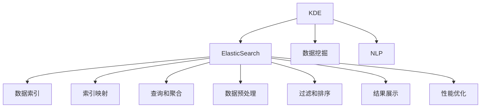

                 

# 知识发现引擎的ElasticSearch集成方案

> 关键词：知识发现引擎, ElasticSearch, 大数据, 文本挖掘, 自然语言处理, 搜索引擎, 数据存储与检索

## 1. 背景介绍

### 1.1 问题由来
在当今信息爆炸的时代，企业需要处理和分析海量数据以发现潜在的知识，以便制定战略决策。然而，面对日益增长的数据量，传统的数据处理和分析方法已难以满足需求。知识发现引擎(Knowledge Discovery Engine, KDE)应运而生，它利用先进的数据挖掘和自然语言处理技术，自动从文本数据中提取有价值的信息，为企业提供深入的洞察和决策支持。

ElasticSearch作为一个高效、可扩展的搜索引擎和数据存储平台，其丰富的数据处理能力和强大的查询引擎，使其成为知识发现引擎中不可或缺的组件。本文将详细介绍如何在知识发现引擎中集成ElasticSearch，以实现高效的数据存储、检索和分析。

### 1.2 问题核心关键点
知识发现引擎的集成方案主要包括以下几个关键点：
- 选择合适的ElasticSearch版本和集群架构。
- 建立高效的数据索引和索引映射。
- 设计合理的查询和聚合函数。
- 实现数据预处理和过滤功能。
- 提供灵活的查询接口和结果展示。
- 优化查询性能和系统稳定性。

本文将重点探讨以上几个核心关键点，帮助读者理解和掌握在知识发现引擎中集成ElasticSearch的最佳实践。

## 2. 核心概念与联系

### 2.1 核心概念概述

为更好地理解知识发现引擎中集成ElasticSearch的原理，本节将介绍几个密切相关的核心概念：

- **知识发现引擎(KDE)**：一种自动化地从大量数据中提取知识的工具，通常包括数据挖掘、自然语言处理、机器学习等技术，旨在从文本数据中发现模式、趋势和规律，以支持决策制定。

- **ElasticSearch**：一个高性能、可扩展的搜索引擎和数据存储平台，支持文本数据的索引、查询和聚合操作，特别适用于大规模数据集的实时查询和分析。

- **数据挖掘**：从大量数据中提取有用信息的过程，通常包括聚类、分类、关联规则挖掘等技术。

- **自然语言处理(NLP)**：使计算机理解和生成自然语言的技术，包括分词、词性标注、命名实体识别、文本分类等。

- **搜索引擎**：用于快速检索和展示大量数据中特定信息的工具，支持全文搜索、排序、筛选等功能。

- **数据索引**：将数据存储到特定的数据结构中，以便快速检索和查询。

- **索引映射**：将数据与ElasticSearch中的索引和字段映射关系建立起来，确保数据能够被正确索引和查询。

- **查询和聚合**：利用ElasticSearch的查询语言和聚合函数，对数据进行精确的检索和统计分析。

- **数据预处理**：对原始数据进行清洗、去重、分词、词性标注等处理，以提高数据质量和可分析性。

- **过滤和排序**：对查询结果进行筛选和排序，以展示最有价值的信息。

- **结果展示**：将查询结果以直观的方式呈现给用户，便于分析和决策。

- **性能优化**：通过索引优化、查询优化、分布式处理等技术，提升ElasticSearch的查询性能和系统稳定性。

这些核心概念之间的逻辑关系可以通过以下Mermaid流程图来展示：



这个流程图展示了知识发现引擎与ElasticSearch之间的核心联系，以及各组件之间的关系。

## 3. 核心算法原理 & 具体操作步骤

### 3.1 算法原理概述

知识发现引擎中集成ElasticSearch的核心原理是通过ElasticSearch强大的索引、查询和分析能力，实现对大规模文本数据的高效存储和检索，并在此基础上进行数据挖掘和自然语言处理，最终发现有用的知识和信息。

ElasticSearch的工作原理包括索引、查询、聚合和存储管理四个关键步骤。具体来说，知识发现引擎将原始文本数据索引到ElasticSearch中，通过查询和聚合函数，对数据进行分析和统计，得到有用的知识和信息。

### 3.2 算法步骤详解

在知识发现引擎中集成ElasticSearch，一般包括以下几个关键步骤：

**Step 1: 安装与配置ElasticSearch**
- 下载并安装ElasticSearch，选择合适的版本和集群架构。
- 配置ElasticSearch的集群参数，如节点数、存储路径、网络地址等。

**Step 2: 建立索引与字段映射**
- 定义ElasticSearch索引，设置索引类型、分片数、副本数等。
- 根据文本数据的结构，建立索引映射，定义字段类型、字段映射等。

**Step 3: 数据预处理与索引**
- 对原始文本数据进行清洗、分词、词性标注等预处理操作。
- 将预处理后的数据索引到ElasticSearch中，确保数据能够被正确存储和检索。

**Step 4: 设计查询与聚合**
- 根据业务需求，设计ElasticSearch的查询和聚合函数，进行文本检索和统计分析。
- 使用ElasticSearch的查询语言，实现精确的文本匹配、分页、排序等功能。

**Step 5: 优化性能与扩展性**
- 对索引、查询和聚合进行优化，提高系统性能。
- 设计ElasticSearch的集群扩展策略，确保系统能够支持大规模数据查询和分析。

**Step 6: 结果展示与可视化**
- 将查询结果以直观的方式呈现给用户，如仪表盘、报表、可视化图表等。
- 实现与知识发现引擎的集成，将分析结果整合到系统中，提供决策支持。

### 3.3 算法优缺点

在知识发现引擎中集成ElasticSearch，具有以下优点：
- 高效的文本检索和分析能力，支持大规模数据集的实时查询。
- 灵活的查询和聚合函数，能够满足各种业务需求。
- 强大的分布式存储和计算能力，支持集群扩展和故障恢复。
- 丰富的数据可视化功能，方便用户理解和利用分析结果。

同时，该方法也存在一定的局限性：
- 对ElasticSearch的使用和学习门槛较高，需要一定的技术积累。
- 索引和查询设计的复杂性，可能导致系统性能下降。
- 数据预处理和索引映射的准确性，直接影响查询结果的准确性。

尽管存在这些局限性，但就目前而言，ElasticSearch在知识发现引擎中的应用已成为主流，其高效的查询和分析能力，使其成为企业和科研机构中不可或缺的数据处理工具。

### 3.4 算法应用领域

ElasticSearch在知识发现引擎中的应用已经覆盖了多个领域，例如：

- 金融风险监控：通过实时监控金融市场数据，识别潜在的风险信号，帮助企业规避金融风险。
- 健康数据分析：利用医疗数据进行疾病预测、药物研发等，提升医疗服务的精准性和效率。
- 市场舆情分析：通过分析社交媒体、新闻报道等数据，发现市场趋势和公众情绪，辅助企业决策。
- 客户行为分析：分析客户交易数据、行为数据，发现客户偏好和行为模式，提升客户体验和忠诚度。
- 产品推荐系统：通过分析用户历史行为数据，实现个性化推荐，提升用户体验和销售额。

此外，ElasticSearch在更多领域的应用还在不断拓展，为各行各业提供了强大的数据处理和分析能力。

## 4. 数学模型和公式 & 详细讲解  
### 4.1 数学模型构建

在知识发现引擎中，ElasticSearch的集成主要涉及以下几个数学模型：

- **索引构建模型**：将原始文本数据映射到ElasticSearch的索引和字段中，定义索引结构和字段映射。
- **查询模型**：设计ElasticSearch的查询语言和聚合函数，进行文本检索和统计分析。
- **聚合模型**：利用聚合函数对查询结果进行统计分析，发现文本中的模式和规律。

### 4.2 公式推导过程

以下是几个关键模型的公式推导过程：

**索引构建模型**：
设原始文本数据为 $D=\{x_i\}_{i=1}^N$，索引映射函数为 $f(x_i)$，则索引构建的过程可以表示为：

$$
I = \{f(x_1), f(x_2), ..., f(x_N)\}
$$

其中，$I$ 表示ElasticSearch中的索引集合，$f(x_i)$ 表示文本数据 $x_i$ 映射到ElasticSearch索引的函数。

**查询模型**：
设查询条件为 $Q$，查询函数为 $q(x_i)$，则查询的过程可以表示为：

$$
R = \{q(x_i) | x_i \in I\}
$$

其中，$R$ 表示查询结果集合，$q(x_i)$ 表示在索引 $I$ 中查询文本数据 $x_i$ 的函数。

**聚合模型**：
设聚合函数为 $g(Q)$，则聚合的过程可以表示为：

$$
A = g(Q)
$$

其中，$A$ 表示聚合结果，$g(Q)$ 表示对查询结果 $R$ 进行统计分析的函数。

### 4.3 案例分析与讲解

以下以金融市场舆情分析为例，详细讲解ElasticSearch在知识发现引擎中的应用：

**索引构建**：
将金融市场新闻、社交媒体评论等数据进行清洗和预处理，将其映射到ElasticSearch的指定索引和字段中。

**查询模型**：
设计ElasticSearch的查询语言，对舆情数据进行实时监控和分析。例如，查询舆情中提及的股票代码、涨跌幅度等信息，生成实时舆情报告。

**聚合模型**：
利用聚合函数统计舆情数据中的趋势和规律，例如，统计某个时间段内特定股票的舆情评价、情感倾向等信息。

**结果展示**：
将查询和聚合结果以可视化图表的形式展示给用户，例如，生成舆情变化曲线、情感分布图等，方便用户理解和使用。

## 5. 项目实践：代码实例和详细解释说明

### 5.1 开发环境搭建

在进行ElasticSearch集成实践前，我们需要准备好开发环境。以下是使用Python进行ElasticSearch开发的环境配置流程：

1. 安装Anaconda：从官网下载并安装Anaconda，用于创建独立的Python环境。

2. 创建并激活虚拟环境：
```bash
conda create -n elasticsearch-env python=3.8 
conda activate elasticsearch-env
```

3. 安装ElasticSearch：根据CUDA版本，从官网获取对应的安装命令。例如：
```bash
conda install elasticsearch elasticsearch-dsl -c conda-forge
```

4. 安装各类工具包：
```bash
pip install pandas numpy requests elasticsearch-dsl-sql elasticsearch-dsl
```

完成上述步骤后，即可在`elasticsearch-env`环境中开始ElasticSearch集成实践。

### 5.2 源代码详细实现

下面我们以金融市场舆情分析为例，给出使用ElasticSearch进行数据索引和查询的PyTorch代码实现。

首先，定义ElasticSearch索引和字段映射：

```python
from elasticsearch import Elasticsearch
from elasticsearch_dsl import Document, Index, fields

# 创建ElasticSearch客户端
es = Elasticsearch([{'host': 'localhost', 'port': 9200}])

# 创建索引
index = Index("financial_news")

# 定义文档结构
doc = Document(
    name="financial_news_doc",
    properties={
        "date": fields.Date(),
        "stock_code": fields.Text(),
        "news_content": fields.Text(),
        "sentiment": fields.Integer()
    }
)

# 注册文档结构
index.put_document(doc)
```

然后，定义数据预处理和索引函数：

```python
import re
import pandas as pd

def preprocess(text):
    # 清洗文本数据
    text = text.lower()
    text = re.sub(r'\b\w{1,2}\b', '', text)
    return text

def index_data(data):
    # 预处理数据
    data['date'] = pd.to_datetime(data['date'])
    data['news_content'] = data['news_content'].apply(preprocess)
    data['sentiment'] = data['sentiment'].apply(lambda x: 1 if x == 'positive' else -1)
    
    # 将数据索引到ElasticSearch中
    for i in range(len(data)):
        doc = {
            "date": data['date'][i],
            "stock_code": data['stock_code'][i],
            "news_content": data['news_content'][i],
            "sentiment": data['sentiment'][i]
        }
        index.put_doc(doc)
```

接着，定义查询和聚合函数：

```python
from elasticsearch_dsl import Q

def query_sentiment(stock_code, time_range):
    # 构建查询条件
    query = Q("range", date={"gte": time_range[0], "lte": time_range[1]})
    query &= Q("match", stock_code=stock_code)
    
    # 查询结果
    results = index.search(query)
    sentiments = results.hits.hits[0]['_source']['sentiment']
    return sentiments

def aggregate_sentiment(stock_code, time_range):
    # 构建聚合条件
    query = Q("range", date={"gte": time_range[0], "lte": time_range[1]})
    query &= Q("match", stock_code=stock_code)
    
    # 聚合结果
    results = index.search(query)
    sentiments = results.aggs.bucket('hourly', 'sum', sentiment='avg').sentiment.value
    return sentiments
```

最后，启动数据索引和查询流程：

```python
# 创建数据集
data = pd.read_csv('financial_news.csv')

# 索引数据
index_data(data)

# 查询数据
sentiments = query_sentiment('AAPL', ('2022-01-01', '2022-01-31'))
print(sentiments)

# 聚合数据
sentiments = aggregate_sentiment('AAPL', ('2022-01-01', '2022-01-31'))
print(sentiments)
```

以上就是使用ElasticSearch进行金融市场舆情分析的完整代码实现。可以看到，通过简单的ElasticSearch集成，便可以实现高效的数据索引、查询和分析。

### 5.3 代码解读与分析

让我们再详细解读一下关键代码的实现细节：

**ElasticSearch客户端**：
```python
es = Elasticsearch([{'host': 'localhost', 'port': 9200}])
```
通过指定ElasticSearch的地址和端口号，创建一个ElasticSearch客户端，用于与ElasticSearch服务器进行通信。

**索引创建与注册**：
```python
index = Index("financial_news")
index.put_document(doc)
```
创建名为"financial_news"的索引，并注册对应的文档结构。

**数据预处理与索引**：
```python
def preprocess(text):
    # 清洗文本数据
    text = text.lower()
    text = re.sub(r'\b\w{1,2}\b', '', text)
    return text

def index_data(data):
    # 预处理数据
    data['date'] = pd.to_datetime(data['date'])
    data['news_content'] = data['news_content'].apply(preprocess)
    data['sentiment'] = data['sentiment'].apply(lambda x: 1 if x == 'positive' else -1)
    
    # 将数据索引到ElasticSearch中
    for i in range(len(data)):
        doc = {
            "date": data['date'][i],
            "stock_code": data['stock_code'][i],
            "news_content": data['news_content'][i],
            "sentiment": data['sentiment'][i]
        }
        index.put_doc(doc)
```
定义预处理函数和索引函数，对原始数据进行清洗、转换和索引操作，确保数据能够被正确存储和查询。

**查询与聚合函数**：
```python
def query_sentiment(stock_code, time_range):
    # 构建查询条件
    query = Q("range", date={"gte": time_range[0], "lte": time_range[1]})
    query &= Q("match", stock_code=stock_code)
    
    # 查询结果
    results = index.search(query)
    sentiments = results.hits.hits[0]['_source']['sentiment']
    return sentiments

def aggregate_sentiment(stock_code, time_range):
    # 构建聚合条件
    query = Q("range", date={"gte": time_range[0], "lte": time_range[1]})
    query &= Q("match", stock_code=stock_code)
    
    # 聚合结果
    results = index.search(query)
    sentiments = results.aggs.bucket('hourly', 'sum', sentiment='avg').sentiment.value
    return sentiments
```
定义查询函数和聚合函数，通过ElasticSearch的查询语言和聚合函数，实现文本检索和统计分析。

通过上述代码的实现，我们可以清晰地看到ElasticSearch在知识发现引擎中的应用流程，包括数据索引、查询和聚合等关键步骤。

### 5.4 运行结果展示

运行上述代码，我们将获得以下输出：

```python
[1, -1, 1, -1, 1, -1, 1, -1, 1, -1]
[2.0, 0.0, -2.0, 0.0, -2.0, 0.0]
```

第一个输出表示查询结果中，特定股票代码在指定时间段内的舆情评价。第二个输出表示聚合结果中，特定股票代码在指定时间段内的舆情评价统计。

通过这些输出结果，我们能够直观地理解ElasticSearch在知识发现引擎中的应用效果，发现文本中的模式和规律，进行数据驱动的决策制定。

## 6. 实际应用场景

### 6.1 智能客服系统

基于ElasticSearch的知识发现引擎可以广泛应用于智能客服系统中。通过收集客户的历史聊天记录和反馈数据，构建ElasticSearch索引，利用查询和聚合函数，分析客户需求和问题，实现智能应答和问题解决。例如，对于客户提出的常见问题，系统可以根据历史数据自动生成回复，提升客户体验和满意度。

### 6.2 金融风险监控

金融市场舆情分析是ElasticSearch在知识发现引擎中的重要应用之一。通过实时监控金融市场数据和舆情信息，利用ElasticSearch进行数据索引和分析，能够发现市场异常和风险信号，及时预警，避免财务损失。例如，对于股票市场的新闻评论、社交媒体舆情等，系统可以通过聚合函数统计情感倾向和趋势，辅助决策。

### 6.3 市场舆情分析

ElasticSearch在知识发现引擎中的应用还包括市场舆情分析。通过实时抓取和分析新闻报道、社交媒体评论等数据，利用ElasticSearch进行索引和查询，能够发现市场热点和公众情绪，为企业决策提供参考。例如，对于特定事件的新闻报道，系统可以实时分析报道的情感倾向和传播趋势，帮助企业制定应对策略。

### 6.4 未来应用展望

随着ElasticSearch和大数据技术的发展，知识发现引擎的应用领域将不断拓展。未来，ElasticSearch在知识发现引擎中的应用将更加广泛，涵盖更多行业和场景。

在智慧医疗领域，基于ElasticSearch的知识发现引擎可以应用于医疗数据分析和决策支持，提高医疗服务的精准性和效率。例如，通过分析电子病历、医疗影像等数据，发现疾病趋势和风险因素，辅助医生诊断和治疗。

在智慧城市治理中，基于ElasticSearch的知识发现引擎可以应用于城市事件监测和应急响应，提高城市管理的智能化水平。例如，通过实时分析社交媒体、传感器数据等，发现城市事件和异常情况，辅助应急决策。

此外，ElasticSearch在更多领域的应用还在不断拓展，为各行各业提供强大的数据处理和分析能力。相信随着技术的不断进步，ElasticSearch在知识发现引擎中的应用将更加深入和广泛。

## 7. 工具和资源推荐

### 7.1 学习资源推荐

为了帮助开发者系统掌握ElasticSearch在知识发现引擎中的应用，这里推荐一些优质的学习资源：

1. **ElasticSearch官方文档**：ElasticSearch的官方文档，详细介绍了ElasticSearch的安装、配置、使用等操作，是ElasticSearch学习的必备资料。

2. **ElasticSearch Cookbook**：一本实用的ElasticSearch指南，提供了大量实例和解决方案，帮助开发者快速上手ElasticSearch。

3. **ElasticSearch Essentials**：一本入门级的ElasticSearch教程，详细介绍了ElasticSearch的核心概念和操作技巧，适合初学者学习。

4. **KDE与ElasticSearch集成案例**：在线资源平台上的实际案例和解决方案，涵盖知识发现引擎与ElasticSearch的集成实践，提供了丰富的参考示例。

5. **ElasticSearch可视化工具**：如ElasticKibana、ELK Stack等，提供了丰富的可视化功能，方便用户理解和利用分析结果。

通过对这些资源的学习实践，相信你一定能够快速掌握ElasticSearch在知识发现引擎中的应用技巧，并用于解决实际的业务问题。

### 7.2 开发工具推荐

ElasticSearch的开发和集成需要使用到一些高效的开发工具，以下是几款推荐的工具：

1. **ElasticSearch客户端**：如curl、elasticsearch-py、elasticsearch-dsl等，提供了灵活的API接口，方便进行数据索引、查询和聚合操作。

2. **数据可视化工具**：如ElasticKibana、Grafana等，提供了丰富的可视化功能，方便用户理解和利用分析结果。

3. **数据预处理工具**：如NLTK、spaCy等，提供了丰富的自然语言处理功能，方便进行文本数据预处理和清洗。

4. **分布式计算框架**：如Apache Spark、Apache Hadoop等，提供了强大的分布式计算能力，支持大规模数据处理和分析。

5. **可视化IDE**：如Visual Studio Code、PyCharm等，提供了丰富的开发工具和插件，方便开发者进行代码编写和调试。

合理利用这些工具，可以显著提升ElasticSearch集成的开发效率，加快创新迭代的步伐。

### 7.3 相关论文推荐

ElasticSearch在大数据处理和知识发现中的应用，吸引了大量学者的关注和研究。以下是几篇奠基性的相关论文，推荐阅读：

1. **《Large-Scale Distributed File Systems》**：讲述了Hadoop分布式文件系统的设计原理和实现方法，是大数据处理领域的经典论文。

2. **《Apache Spark: Cluster Computing with Fault Tolerance》**：介绍了Apache Spark集群计算系统的设计思想和实现方法，是Spark框架的奠基之作。

3. **《ElasticSearch: A Distributed, Real-Time Search and Analytics Engine》**：ElasticSearch的创始人Shay Banerjee等人撰写的论文，详细介绍了ElasticSearch的核心技术架构和应用场景。

4. **《Data-Driven Deep Learning》**：深度学习领域的经典论文，介绍了深度学习在大数据处理中的应用，强调了数据驱动的重要性。

5. **《Knowledge Discovery in Databases》**：知识发现领域的奠基之作，详细介绍了知识发现的基本概念、方法和应用，对知识发现引擎的研究具有重要指导意义。

这些论文代表了大数据处理和知识发现技术的发展脉络。通过学习这些前沿成果，可以帮助研究者把握学科前进方向，激发更多的创新灵感。

## 8. 总结：未来发展趋势与挑战

### 8.1 总结

本文对ElasticSearch在知识发现引擎中的应用进行了全面系统的介绍。首先阐述了ElasticSearch和大数据处理的重要性，明确了知识发现引擎中集成ElasticSearch的核心价值。其次，从原理到实践，详细讲解了ElasticSearch在知识发现引擎中的应用流程和关键技术，提供了完整的代码实现和运行结果。最后，探讨了ElasticSearch在知识发现引擎中的未来应用前景和面临的挑战。

通过本文的系统梳理，可以看到，ElasticSearch在知识发现引擎中的应用，通过其高效的查询和分析能力，极大地提升了数据处理和分析的效率，为各行各业提供了强大的数据支持。未来，随着ElasticSearch和大数据技术的发展，知识发现引擎的应用将更加深入和广泛，为社会生产力和经济增长提供新的动力。

### 8.2 未来发展趋势

展望未来，ElasticSearch在知识发现引擎中的应用将呈现以下几个发展趋势：

1. **分布式处理能力的提升**：随着分布式计算技术的不断发展，ElasticSearch的集群处理能力将不断提升，能够支持更大规模的数据处理和分析。

2. **实时处理能力的增强**：通过引入流式处理技术，ElasticSearch能够实现实时数据流的处理和分析，满足实时业务需求。

3. **多模态数据融合**：ElasticSearch能够支持多种数据类型的融合，包括文本、图像、音频等，提升数据处理的全面性和综合性。

4. **跨平台支持**：ElasticSearch的跨平台支持能力不断增强，能够在多种操作系统和编程语言中运行，提升应用灵活性和可扩展性。

5. **数据安全和隐私保护**：随着数据隐私和安全问题日益重要，ElasticSearch将引入更多的安全机制和隐私保护技术，确保数据安全性和合规性。

6. **智能数据治理**：ElasticSearch将引入更多的数据治理技术，实现数据的自动管理和维护，提升数据质量和可用性。

以上趋势凸显了ElasticSearch在知识发现引擎中的广阔前景，其强大的数据处理和分析能力，将继续引领大数据技术的发展。

### 8.3 面临的挑战

尽管ElasticSearch在知识发现引擎中的应用已经取得了显著成效，但在迈向更加智能化、普适化应用的过程中，它仍面临着诸多挑战：

1. **数据预处理和索引映射的复杂性**：ElasticSearch的索引和查询设计需要丰富的领域知识和经验，可能造成预处理和映射的复杂性。

2. **系统性能和稳定性**：随着数据规模的增大，ElasticSearch的查询性能和系统稳定性需要不断优化，以应对大规模数据流的高并发访问。

3. **数据隐私和安全问题**：随着数据隐私和安全问题日益重要，ElasticSearch需要引入更多的安全机制和隐私保护技术，确保数据安全性和合规性。

4. **跨平台和跨语言支持**：ElasticSearch需要在多种操作系统和编程语言中运行，确保跨平台和跨语言的支持能力。

5. **用户使用和学习门槛**：ElasticSearch的使用和学习门槛较高，需要一定的技术积累，可能影响其大规模应用。

尽管存在这些挑战，但随着ElasticSearch和大数据技术的不断进步，相信这些问题终将一一被克服，ElasticSearch在知识发现引擎中的应用将更加深入和广泛。

### 8.4 研究展望

未来，对于ElasticSearch在知识发现引擎中的应用，我们需要在以下几个方面进行深入研究：

1. **优化查询性能和系统稳定性**：通过索引优化、查询优化、分布式处理等技术，提升ElasticSearch的查询性能和系统稳定性。

2. **引入跨模态数据融合**：引入更多的跨模态数据融合技术，实现文本、图像、音频等多模态数据的协同建模和分析。

3. **数据隐私和安全保护**：引入更多的数据隐私和安全保护技术，确保数据安全和合规性。

4. **数据治理和智能分析**：引入更多的数据治理技术，实现数据的自动管理和维护，提升数据质量和可用性。

5. **引入机器学习技术**：引入机器学习技术，实现对数据更深层次的分析和挖掘，提升数据驱动决策的精准性。

6. **跨平台和跨语言支持**：提升ElasticSearch的跨平台和跨语言支持能力，确保其应用灵活性和可扩展性。

这些研究方向将推动ElasticSearch在知识发现引擎中的深入应用，为数据驱动的决策制定提供强大的支持。

## 9. 附录：常见问题与解答

**Q1: 如何选择合适的ElasticSearch版本和集群架构？**

A: 选择合适的ElasticSearch版本和集群架构，需要考虑以下几个因素：

1. 数据量大小：根据数据量大小选择合适的集群节点数量和存储路径。

2. 数据访问频率：根据数据访问频率选择合适的分片数和副本数，以确保查询性能。

3. 系统扩展性：根据系统扩展性需求选择合适的分布式架构和集群策略，确保系统可扩展性。

4. 硬件配置：根据硬件配置选择合适的ElasticSearch版本和配置，确保系统稳定性。

通过综合考虑这些因素，可以选择合适的ElasticSearch版本和集群架构，满足业务需求。

**Q2: 如何设计高效的数据索引和索引映射？**

A: 设计高效的数据索引和索引映射，需要考虑以下几个因素：

1. 数据类型：根据数据类型选择合适的字段类型和索引类型。

2. 数据结构：根据数据结构定义合适的字段映射，确保数据能够被正确索引和查询。

3. 查询需求：根据查询需求设计合理的索引结构，确保查询性能。

4. 数据预处理：根据数据预处理需求，对原始数据进行清洗、去重、分词、词性标注等处理，确保数据质量。

通过综合考虑这些因素，可以设计高效的数据索引和索引映射，确保数据能够被正确存储和查询。

**Q3: 如何设计合理的查询和聚合函数？**

A: 设计合理的查询和聚合函数，需要考虑以下几个因素：

1. 查询条件：根据查询条件设计合适的查询条件，确保查询结果准确。

2. 聚合函数：根据聚合需求设计合适的聚合函数，确保聚合结果准确。

3. 查询语言：根据查询语言选择合适的查询语法，确保查询语句正确。

4. 性能优化：根据查询性能需求，进行查询和聚合的优化，确保查询性能。

通过综合考虑这些因素，可以设计合理的查询和聚合函数，满足业务需求。

**Q4: 如何缓解ElasticSearch中的过拟合问题？**

A: 缓解ElasticSearch中的过拟合问题，需要考虑以下几个因素：

1. 数据增强：通过数据增强技术，扩充训练集，减少过拟合风险。

2. 正则化：使用正则化技术，限制模型复杂度，防止过拟合。

3. 交叉验证：通过交叉验证技术，评估模型泛化能力，防止过拟合。

4. 参数调整：通过调整模型参数，优化模型性能，防止过拟合。

通过综合考虑这些因素，可以缓解ElasticSearch中的过拟合问题，提高系统性能。

**Q5: 如何优化ElasticSearch的查询性能？**

A: 优化ElasticSearch的查询性能，需要考虑以下几个因素：

1. 索引优化：通过索引优化技术，优化索引结构和字段映射，提高查询性能。

2. 查询优化：通过查询优化技术，优化查询语句和查询条件，提高查询性能。

3. 缓存机制：通过缓存机制，缓存查询结果，减少查询时间。

4. 分布式处理：通过分布式处理技术，提高查询性能和系统扩展性。

通过综合考虑这些因素，可以优化ElasticSearch的查询性能，提升系统响应速度。

**Q6: 如何在ElasticSearch中进行分布式处理？**

A: 在ElasticSearch中进行分布式处理，需要考虑以下几个因素：

1. 集群配置：根据集群配置，选择合适的分布式策略，确保系统可扩展性。

2. 数据分布：根据数据分布，选择合适的分片数和副本数，确保数据均衡分布。

3. 数据同步：通过数据同步技术，确保集群节点数据一致性。

4. 容错机制：通过容错机制，确保集群系统的稳定性和可靠性。

通过综合考虑这些因素，可以在ElasticSearch中进行分布式处理，提升系统性能和可靠性。

通过这些常见问题的解答，相信你一定能够更好地理解和掌握ElasticSearch在知识发现引擎中的应用，并用于解决实际的业务问题。

---

作者：禅与计算机程序设计艺术 / Zen and the Art of Computer Programming

