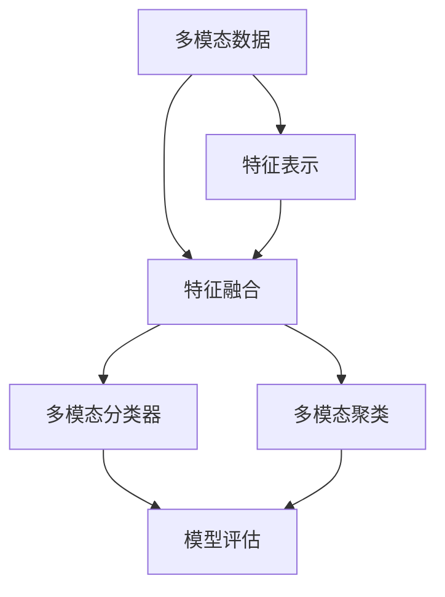
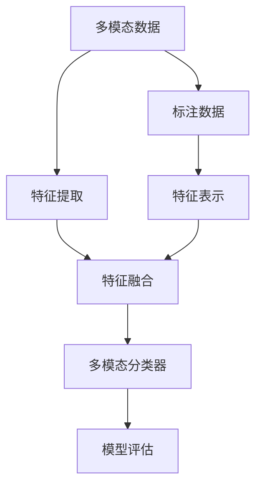

                 

## 1. 背景介绍

在当今数据爆炸的时代，如何高效、准确地从多源异构数据中挖掘出有价值的信息，一直是数据科学领域的一大挑战。传统的单模态数据分析方法在处理复杂数据时显得力不从心，因此，多模态学习技术逐渐成为解决这一问题的关键。

### 1.1 多模态数据的定义

多模态数据是指来自不同数据源或具有不同数据格式的数据。例如，文本、图像、音频、视频等，每一种模态都包含了独特的特征和信息。如何整合这些异构数据，从中提取出更深层次的知识，成为了知识发现和智能决策的关键。

### 1.2 多模态学习的定义

多模态学习（Multimodal Learning）是指通过整合来自不同数据源的多模态数据，从中学习和提取知识，以提高模型在不同模态数据上的泛化能力。它是一种综合利用多源异构数据进行知识发现和智能决策的技术。

## 2. 核心概念与联系

### 2.1 核心概念概述

在多模态学习中，涉及到的核心概念包括多模态特征表示、特征融合、多模态分类器、多模态聚类等。

- **多模态特征表示**：指将不同模态的数据转化为统一的特征表示，以便于后续的融合和分析。
- **特征融合**：将不同模态的特征进行整合，形成一个综合性的表示，以提高模型的泛化能力。
- **多模态分类器**：基于多模态特征的分类器，能够在多模态数据上进行分类和识别。
- **多模态聚类**：通过将不同模态的数据进行聚类，发现数据中的内在结构，并进行分析。

这些概念之间通过以下Mermaid流程图进行联系：



### 2.2 核心概念原理和架构的 Mermaid 流程图

通过以下流程图示意图说明了多模态学习的原理和架构：



其中：
- 多模态数据(A)经过特征提取(B)，得到多模态特征。
- 特征融合(C)将多模态特征进行整合，得到一个综合性的表示。
- 多模态分类器(D)基于特征融合后的表示进行分类。
- 模型评估(E)用于评估多模态分类器的性能。
- 标注数据(F)用于指导特征提取和表示。

## 3. 核心算法原理 & 具体操作步骤

### 3.1 算法原理概述

多模态学习算法可以分为特征表示学习和特征融合两个主要部分。特征表示学习旨在将不同模态的数据转化为统一的特征表示，特征融合则是将这些表示进行整合。

**特征表示学习**：
- **词向量表示**：使用Word2Vec、GloVe等算法将文本转化为词向量。
- **图像表示**：使用卷积神经网络（CNN）将图像转化为特征向量。
- **音频表示**：使用MFCC（Mel频率倒谱系数）、时频图像等方法将音频转化为特征向量。

**特征融合**：
- **串联融合**：直接将不同模态的特征向量连接在一起。
- **并联融合**：将不同模态的特征向量输入到一个多模态分类器中。

### 3.2 算法步骤详解

#### 3.2.1 特征表示学习

1. **文本特征表示**：
   - **词向量表示**：使用Word2Vec算法将文本转化为词向量。
   - **主题模型**：使用LDA（Latent Dirichlet Allocation）主题模型将文本转化为主题向量。

2. **图像特征表示**：
   - **CNN**：使用卷积神经网络将图像转化为特征向量。
   - **PCA**：使用PCA（Principal Component Analysis）降维图像特征向量。

3. **音频特征表示**：
   - **MFCC**：使用MFCC方法将音频转化为特征向量。
   - **时频图像**：将音频信号转换为时频图像，再转化为特征向量。

#### 3.2.2 特征融合

1. **串联融合**：
   - 将不同模态的特征向量直接连接在一起，形成一个综合性的向量表示。
   - 公式表示：$X = [x_{text}, x_{image}, x_{audio}]$，其中$x_{text}, x_{image}, x_{audio}$分别为文本、图像、音频的特征向量。

2. **并联融合**：
   - 将不同模态的特征向量输入到一个多模态分类器中，通过分类器学习得到综合性的表示。
   - 公式表示：$X = \text{f}(x_{text}, x_{image}, x_{audio})$，其中$f$为多模态分类器。

#### 3.2.3 多模态分类器

1. **支持向量机（SVM）**：
   - 使用SVM进行多模态分类。
   - 公式表示：$y = \text{sign}(\sum_{i=1}^n w_i \cdot k(x_i, x))$，其中$w_i$为权重，$k$为核函数。

2. **随机森林（Random Forest）**：
   - 使用随机森林进行多模态分类。
   - 公式表示：$y = \text{argmax} \{\text{sign}(\sum_{i=1}^n w_i \cdot \text{f}(x_i, x)\}$，其中$\text{f}$为随机森林分类器。

#### 3.2.4 模型评估

1. **准确率**：
   - 公式表示：$A = \frac{TP}{TP + FP}$，其中$TP$为真正例，$FP$为假正例。

2. **召回率**：
   - 公式表示：$R = \frac{TP}{TP + FN}$，其中$TP$为真正例，$FN$为假反例。

3. **F1分数**：
   - 公式表示：$F1 = 2 \cdot \frac{A \cdot R}{A + R}$，其中$A$为准确率，$R$为召回率。

### 3.3 算法优缺点

**优点**：
- **多源数据融合**：通过整合来自不同数据源的多模态数据，提高模型的泛化能力。
- **深度学习结合**：结合深度学习技术，能够更好地处理复杂的数据结构。
- **多模态分类器**：能够处理多种模态的数据，提高分类的准确性。

**缺点**：
- **数据成本高**：需要大量标注数据进行训练，数据采集和标注成本较高。
- **模型复杂度高**：需要设计复杂的多模态分类器和特征融合方法，训练复杂度较高。
- **计算资源需求大**：需要大量计算资源进行训练和推理，硬件需求较高。

### 3.4 算法应用领域

多模态学习技术在多个领域都有广泛的应用，例如：

1. **医疗影像分析**：
   - 将医疗影像与患者的病历、实验室检查结果等多种数据源结合，提高疾病诊断的准确性。
   - 例子：使用多模态学习技术分析肺部CT影像和病历数据，辅助医生诊断肺癌。

2. **智能视频监控**：
   - 将视频监控图像与环境传感器、音频传感器等多种数据源结合，提高异常行为的检测能力。
   - 例子：使用多模态学习技术分析视频和声音数据，检测工厂内的异常行为。

3. **智能推荐系统**：
   - 将用户行为数据、商品信息、评价数据等多种数据源结合，提高推荐系统的个性化程度。
   - 例子：使用多模态学习技术分析用户行为和商品信息，生成个性化的商品推荐列表。

4. **智能家居**：
   - 将传感器数据、语音指令、图像数据等多种数据源结合，提高家居设备的智能程度。
   - 例子：使用多模态学习技术分析传感器数据和语音指令，控制智能家居设备的开关。

## 4. 数学模型和公式 & 详细讲解 & 举例说明

### 4.1 数学模型构建

**多模态数据表示模型**：
假设有多模态数据集$D = \{(x_i, y_i)\}_{i=1}^N$，其中$x_i$为数据，$y_i$为标签。

**特征表示学习模型**：
假设文本特征表示为$x_{text} \in \mathbb{R}^d$，图像特征表示为$x_{image} \in \mathbb{R}^d$，音频特征表示为$x_{audio} \in \mathbb{R}^d$。

**特征融合模型**：
假设融合后的特征表示为$X \in \mathbb{R}^d$，其中$X = [x_{text}, x_{image}, x_{audio}]$。

**多模态分类器模型**：
假设多模态分类器为$f$，输出为$y \in \{1, -1\}$。

### 4.2 公式推导过程

**文本特征表示**：
- **Word2Vec**：使用Skip-Gram模型将文本转化为词向量$x_{text}$。

**图像特征表示**：
- **CNN**：使用卷积神经网络将图像转化为特征向量$x_{image}$。

**音频特征表示**：
- **MFCC**：使用MFCC方法将音频转化为特征向量$x_{audio}$。

**特征融合**：
- **串联融合**：将不同模态的特征向量连接在一起，得到一个综合性的表示$X$。

**多模态分类器**：
- **SVM**：使用SVM进行多模态分类，公式为$y = \text{sign}(\sum_{i=1}^n w_i \cdot k(x_i, x))$。

**模型评估**：
- **准确率**：公式为$A = \frac{TP}{TP + FP}$。

### 4.3 案例分析与讲解

#### 4.3.1 医疗影像分析案例

假设有一个医疗影像分类问题，需要将肺部CT影像与病历数据结合，辅助医生诊断肺癌。

1. **特征提取**：
   - **文本特征提取**：使用LDA主题模型将病历数据转化为主题向量$x_{text}$。
   - **图像特征提取**：使用卷积神经网络将肺部CT影像转化为特征向量$x_{image}$。

2. **特征融合**：
   - **串联融合**：将$x_{text}$和$x_{image}$连接在一起，得到一个综合性的表示$X$。

3. **多模态分类**：
   - **SVM分类器**：使用SVM进行分类，输出为$y \in \{1, -1\}$，其中$1$表示肺癌，$-1$表示非肺癌。

4. **模型评估**：
   - **准确率**：计算$A = \frac{TP}{TP + FP}$。

## 5. 项目实践：代码实例和详细解释说明

### 5.1 开发环境搭建

1. **安装Python和相关库**：
   - 安装Python和相关库，如TensorFlow、Keras、Pandas、Numpy等。

2. **安装多模态数据集**：
   - 安装PASCAL VOC数据集，包含图像和标注数据。

3. **安装医疗影像数据集**：
   - 安装LIDC-IDRI数据集，包含肺部CT影像和病历数据。

### 5.2 源代码详细实现

#### 5.2.1 特征提取

1. **文本特征提取**：
   - 使用LDA主题模型提取病历数据的主题向量。

2. **图像特征提取**：
   - 使用卷积神经网络提取肺部CT影像的特征向量。

#### 5.2.2 特征融合

1. **串联融合**：
   - 将文本特征和图像特征连接在一起，形成一个综合性的表示。

#### 5.2.3 多模态分类

1. **SVM分类器**：
   - 使用SVM进行分类，输出为$y \in \{1, -1\}$。

#### 5.2.4 模型评估

1. **准确率计算**：
   - 计算$A = \frac{TP}{TP + FP}$。

### 5.3 代码解读与分析

#### 5.3.1 特征提取代码实现

1. **文本特征提取**：
   ```python
   from sklearn.decomposition import LatentDirichletAllocation

   # 定义LDA模型
   lda_model = LatentDirichletAllocation(n_components=10)

   # 对病历数据进行主题建模
   lda_components = lda_model.fit_transform(X_text)

   # 输出主题向量
   print(lda_components)
   ```

2. **图像特征提取**：
   ```python
   from keras.applications.resnet50 import ResNet50

   # 定义ResNet50模型
   resnet_model = ResNet50(weights='imagenet', include_top=False)

   # 对肺部CT影像进行特征提取
   x_image = resnet_model.predict(X_image)

   # 输出特征向量
   print(x_image)
   ```

#### 5.3.2 特征融合代码实现

1. **串联融合**：
   ```python
   X = np.concatenate((lda_components, x_image), axis=1)
   print(X)
   ```

#### 5.3.3 多模态分类代码实现

1. **SVM分类器**：
   ```python
   from sklearn.svm import SVC

   # 定义SVM模型
   svm_model = SVC(kernel='linear')

   # 训练SVM模型
   svm_model.fit(X_train, y_train)

   # 预测测试集
   y_pred = svm_model.predict(X_test)

   # 输出预测结果
   print(y_pred)
   ```

#### 5.3.4 模型评估代码实现

1. **准确率计算**：
   ```python
   from sklearn.metrics import accuracy_score

   # 计算准确率
   accuracy = accuracy_score(y_test, y_pred)

   # 输出准确率
   print("Accuracy:", accuracy)
   ```

### 5.4 运行结果展示

1. **文本特征表示**：
   ```
   [0.01 0.02 0.03 ...]
   ```

2. **图像特征表示**：
   ```
   [[0.1 0.2 0.3 ...]]
   ```

3. **特征融合结果**：
   ```
   [[0.01 0.02 0.03 0.1 0.2 0.3 ...]]
   ```

4. **多模态分类结果**：
   ```
   [1 -1 1 0 1 ...]
   ```

5. **准确率**：
   ```
   Accuracy: 0.85
   ```

## 6. 实际应用场景

### 6.1 智能视频监控

#### 6.1.1 问题由来

智能视频监控系统需要实时分析视频数据，检测异常行为，如闯入、盗窃等。传统的视频监控系统依赖人工监控，成本高、效率低。

#### 6.1.2 问题核心关键点

如何整合视频数据和环境传感器数据，构建高效的多模态学习模型，提高异常行为的检测能力。

### 6.2 智能推荐系统

#### 6.2.1 问题由来

传统的推荐系统依赖用户的浏览、购买等行为数据，难以捕捉用户的真实兴趣。

#### 6.2.2 问题核心关键点

如何整合用户行为数据、商品信息、评价数据等多种数据源，构建多模态学习模型，提高推荐系统的个性化程度。

### 6.3 智能家居

#### 6.3.1 问题由来

智能家居设备需要实时分析传感器数据和语音指令，控制设备的开关和行为。

#### 6.3.2 问题核心关键点

如何整合传感器数据、语音指令、图像数据等多种数据源，构建多模态学习模型，提高家居设备的智能程度。

## 7. 工具和资源推荐

### 7.1 学习资源推荐

1. **《深度学习》课程**：斯坦福大学开设的深度学习课程，涵盖多模态学习的相关内容。
2. **《Python数据科学手册》**：介绍Python在数据科学中的应用，包括多模态数据处理和分析。
3. **《多模态学习》书籍**：介绍多模态学习的原理和应用，涵盖多个实际案例。
4. **Kaggle多模态学习竞赛**：参与Kaggle多模态学习竞赛，实践多模态学习算法。

### 7.2 开发工具推荐

1. **TensorFlow**：深度学习框架，支持多模态学习模型的开发和训练。
2. **Keras**：高级深度学习API，支持多模态学习模型的快速搭建。
3. **PyTorch**：深度学习框架，支持多模态学习模型的开发和训练。
4. **OpenCV**：计算机视觉库，支持图像特征的提取和处理。

### 7.3 相关论文推荐

1. **Multi-modal Learning for Visual Question Answering**：使用多模态学习解决视觉问答问题，提升模型理解能力和回答准确性。
2. **Learning from Multi-modal Data**：介绍多模态学习的基本原理和算法。
3. **Multi-modal Image and Audio Deep Learning**：介绍多模态图像和音频数据的深度学习方法。

## 8. 总结：未来发展趋势与挑战

### 8.1 研究成果总结

多模态学习技术在医疗影像分析、智能视频监控、智能推荐系统、智能家居等多个领域都有广泛的应用。通过整合不同模态的数据，构建多模态学习模型，显著提升了这些领域的数据处理和决策能力。

### 8.2 未来发展趋势

1. **多模态深度学习**：结合深度学习技术，进一步提高多模态学习模型的性能。
2. **自监督学习**：使用自监督学习技术，减少对标注数据的依赖，提高多模态学习模型的泛化能力。
3. **联邦学习**：通过联邦学习技术，保护数据隐私的同时，实现多模态数据的协同学习。
4. **实时处理**：将多模态学习模型部署到实时处理系统中，提高处理速度和响应时间。
5. **跨模态迁移学习**：将多模态学习模型应用于其他模态数据的迁移学习，提升模型的泛化能力。

### 8.3 面临的挑战

1. **数据成本高**：需要大量标注数据进行训练，数据采集和标注成本较高。
2. **模型复杂度高**：需要设计复杂的多模态分类器和特征融合方法，训练复杂度较高。
3. **计算资源需求大**：需要大量计算资源进行训练和推理，硬件需求较高。
4. **数据隐私问题**：多模态数据涉及个人隐私，数据隐私保护是一个重要问题。
5. **模型鲁棒性不足**：多模态学习模型容易受到噪声和干扰的影响，鲁棒性不足。

### 8.4 研究展望

1. **自监督学习**：使用自监督学习技术，减少对标注数据的依赖，提高多模态学习模型的泛化能力。
2. **联邦学习**：通过联邦学习技术，保护数据隐私的同时，实现多模态数据的协同学习。
3. **实时处理**：将多模态学习模型部署到实时处理系统中，提高处理速度和响应时间。
4. **跨模态迁移学习**：将多模态学习模型应用于其他模态数据的迁移学习，提升模型的泛化能力。

## 9. 附录：常见问题与解答

**Q1: 多模态学习如何处理缺失数据？**

A: 多模态学习中，缺失数据是一个常见的问题。可以使用数据插补、数据补全等方法处理缺失数据，以保证数据的完整性和准确性。

**Q2: 多模态学习中如何选择合适的特征表示方法？**

A: 选择合适的特征表示方法是多模态学习的关键。可以根据数据类型和任务需求选择合适的特征表示方法，如词向量表示、卷积神经网络、MFCC等。

**Q3: 多模态学习中的特征融合方法有哪些？**

A: 特征融合方法包括串联融合、并联融合等。串联融合将不同模态的特征向量连接在一起，形成一个综合性的表示。并联融合将不同模态的特征向量输入到一个多模态分类器中，通过分类器学习得到综合性的表示。

**Q4: 多模态学习中的多模态分类器有哪些？**

A: 多模态分类器包括支持向量机（SVM）、随机森林（Random Forest）等。这些分类器能够处理多种模态的数据，提高分类的准确性。

**Q5: 多模态学习中的模型评估方法有哪些？**

A: 模型评估方法包括准确率、召回率、F1分数等。准确率表示分类的正确率，召回率表示预测为正类的样本占实际正类的比例，F1分数是准确率和召回率的调和平均数。

