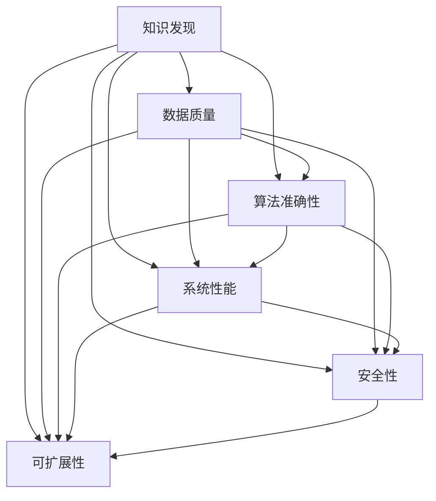

                 

# 知识发现引擎的测试与质量保证

> 关键词：知识发现, 测试, 质量保证, 数据质量, 性能测试, 可扩展性, 准确性

## 1. 背景介绍

### 1.1 问题由来

知识发现(Knowledge Discovery, KD)引擎已经成为支撑大数据时代关键业务决策的核心工具之一。无论是金融、医疗、零售、智能制造等领域，知识发现引擎都在帮助企业快速、准确地从海量数据中提取有价值的洞察，驱动战略规划和业务优化。然而，尽管KD引擎在技术上已经相当成熟，但如何确保其稳定、高效地运行，并持续提供高质量的结果，仍然是一个复杂的挑战。

### 1.2 问题核心关键点

知识发现引擎的质量保证(Quality Assurance, QA)涉及到多个环节，包括数据质量、算法准确性、系统性能、用户友好性、安全性和可扩展性等方面。当前，这一领域的QA工作往往面临着以下核心挑战：

- **数据质量**：数据源广泛、格式多样，数据清洗和预处理复杂。
- **算法准确性**：算法模型在大规模数据上的泛化能力有限，容易过拟合或欠拟合。
- **系统性能**：大规模数据处理和高并发访问下，系统稳定性、响应时间和吞吐量面临压力。
- **用户友好性**：用户界面复杂，操作流程繁琐，用户体验不佳。
- **安全性**：用户数据隐私保护、系统安全防护、操作授权等安全问题频发。
- **可扩展性**：引擎需具备高性能扩展能力，支持持续的功能扩展和数据量扩展。

本文聚焦于知识发现引擎的测试与质量保证，从数据质量管理、算法测试、系统性能测试、安全性测试和可扩展性测试等多个角度，提供全面的QA方法论，帮助读者构建高效、可靠的知识发现引擎。

## 2. 核心概念与联系

### 2.1 核心概念概述

在探讨知识发现引擎的测试与质量保证之前，首先需了解几个核心概念及其联系：

- **知识发现(Knowledge Discovery)**：从大量数据中挖掘出有意义的模式、趋势、规律等知识的过程，包括数据清洗、特征工程、模型训练和结果解释等环节。
- **数据质量(Data Quality)**：指数据的一致性、准确性、完整性和可用性，是知识发现引擎可靠性的基石。
- **算法准确性(Algorithm Accuracy)**：指知识发现模型在训练集和测试集上的预测准确度，反映算法泛化能力和稳定性。
- **系统性能(System Performance)**：指知识发现引擎在多并发用户和高数据负载下的响应时间和吞吐量，反映系统的稳定性和性能瓶颈。
- **安全性(Security)**：指保护用户数据隐私和系统安全，防止非法访问和数据泄露，包括访问控制、数据加密、安全审计等。
- **可扩展性(Scalability)**：指知识发现引擎能够随着数据量增长和功能需求的增加而扩展能力，包括水平扩展和垂直扩展。

这些概念间的关系可以通过以下Mermaid流程图展示：



这个流程图展示了知识发现引擎中各个质量指标之间的关系：

1. 数据质量是知识发现的输入基础，直接影响算法的准确性和系统的性能。
2. 算法准确性是知识发现的核心，决定了引擎输出结果的可靠性。
3. 系统性能是知识发现运行的保障，影响引擎的响应速度和可访问性。
4. 安全性是知识发现的重要保障，确保数据和操作的安全。
5. 可扩展性是知识发现引擎的长期需求，保证引擎能够适应未来发展。

只有在这五个质量指标的基础上，知识发现引擎才能真正实现其价值，满足用户需求。

## 3. 核心算法原理 & 具体操作步骤

### 3.1 算法原理概述

知识发现引擎的测试与质量保证是一个多维度的综合过程，需要从算法原理、测试策略、评估指标等多个层面进行综合考虑。具体来说，算法原理主要涉及以下几个方面：

1. **数据预处理与特征工程**：清洗、归一化、转换原始数据为适合建模的特征。
2. **算法选择与模型训练**：选择合适算法，如回归、分类、聚类等，并使用训练集训练模型。
3. **模型评估与验证**：使用测试集评估模型泛化能力，验证算法准确性。

### 3.2 算法步骤详解

知识发现引擎的测试与质量保证可以按照以下步骤进行：

**Step 1: 数据质量管理**
- 数据清洗：删除或修正缺失、异常数据。
- 数据归一化：将数据转换为标准格式，便于处理。
- 特征工程：选择合适的特征，并进行降维、编码等处理。

**Step 2: 算法选择与训练**
- 算法选择：根据问题类型选择合适的算法模型，如回归、分类、聚类等。
- 模型训练：使用训练集进行模型训练，得到初始模型参数。

**Step 3: 模型评估与验证**
- 模型验证：使用交叉验证、留出法等方法评估模型泛化能力。
- 参数调优：根据验证结果调整模型参数，如正则化系数、学习率等。

**Step 4: 系统性能测试**
- 压力测试：模拟高并发访问，测试系统稳定性。
- 负载测试：增加数据量，测试系统响应时间。
- 容量测试：评估系统可扩展性，包括水平扩展和垂直扩展。

**Step 5: 安全性测试**
- 访问控制：测试系统是否对非授权用户进行访问控制。
- 数据加密：测试数据传输和存储的加密措施是否有效。
- 安全审计：记录系统操作日志，并定期审计。

**Step 6: 用户友好性测试**
- UI测试：测试用户界面是否友好，操作流程是否顺畅。
- 功能测试：测试系统功能是否完备，是否满足用户需求。

### 3.3 算法优缺点

知识发现引擎的测试与质量保证具有以下优点：
1. 提高算法准确性：通过系统测试和验证，确保模型在真实场景中的泛化能力。
2. 增强系统稳定性：通过性能测试和安全测试，保障系统在高负载和高并发情况下的稳定性。
3. 提升用户体验：通过用户友好性测试，优化用户界面和操作流程，提升用户体验。
4. 保障数据安全：通过安全性测试，防止数据泄露和非法访问，保护用户隐私。
5. 支持可扩展性：通过系统容量测试，确保引擎能够扩展支持更大规模的数据和更多功能。

同时，该方法也存在一些局限性：
1. 测试成本高：特别是在大规模数据集上，测试时间和资源消耗较大。
2. 测试周期长：特别是系统性能和安全测试，可能需要较长的周期才能完成。
3. 结果难以量化：某些质量指标如用户友好性和安全性，难以通过明确的评估指标来量化。

### 3.4 算法应用领域

知识发现引擎的测试与质量保证广泛应用于以下几个领域：

- **金融风控**：利用知识发现引擎进行风险评估、信用评分、欺诈检测等，以保障金融安全。
- **医疗健康**：从海量医疗数据中挖掘疾病特征、治疗方案等，以支持个性化医疗和疾病预防。
- **零售电商**：分析用户行为数据，进行精准营销、库存管理等，以提升客户满意度和运营效率。
- **智能制造**：通过分析生产数据，优化生产流程、提高生产效率，以实现智能制造。
- **智慧城市**：从城市运行数据中发现问题，优化资源配置，提高城市管理水平。

这些应用场景对知识发现引擎的可靠性、安全性和可扩展性提出了很高的要求，系统测试与质量保证尤为重要。

## 4. 数学模型和公式 & 详细讲解 & 举例说明

### 4.1 数学模型构建

知识发现引擎的测试与质量保证涉及多个数学模型，以下是几个关键模型的构建方法：

**数据清洗模型**：用于检测和修正数据中的缺失值、异常值。常用的数学模型包括均值插补、中位数插补、标准化等。

**特征选择模型**：用于选择对目标变量影响较大的特征。常用的数学模型包括相关性分析、方差分析、信息增益等。

**算法准确性评估模型**：用于评估模型的预测准确度。常用的数学模型包括均方误差(MSE)、均方根误差(MSE)、准确率、召回率、F1分数等。

**系统性能评估模型**：用于评估系统的响应时间和吞吐量。常用的数学模型包括平均响应时间、最大响应时间、平均吞吐量等。

### 4.2 公式推导过程

**数据清洗模型的公式推导**：

假设有一个数据集 $\{(x_i,y_i)\}_{i=1}^N$，其中 $x_i$ 为输入，$y_i$ 为输出。数据集中存在一些缺失值 $x_i$ 和异常值 $x_i'$，可以通过以下公式进行清洗：

$$
\begin{aligned}
\tilde{x_i} &= \text{impute\_value}(x_i) \\
\tilde{x_i'} &= \text{correct\_value}(x_i')
\end{aligned}
$$

其中 $\text{impute\_value}$ 和 $\text{correct\_value}$ 分别为插补和修正的数学公式。

**特征选择模型的公式推导**：

假设有一个特征集 $\{x_i\}_{i=1}^N$，目标变量为 $y$，可以使用信息增益方法选择最优特征。假设特征 $x_i$ 与目标变量 $y$ 之间的条件熵为 $H(y|x_i)$，特征集 $X$ 与目标变量 $y$ 之间的条件熵为 $H(y|X)$，则信息增益 $IG$ 可以表示为：

$$
IG(x_i) = H(y|x_i) - H(y|X)
$$

特征选择模型即为选择信息增益最大的特征子集。

**算法准确性评估模型的公式推导**：

假设有一个模型 $M$ 和测试集 $\{(x_i,y_i)\}_{i=1}^N$，使用均方误差(MSE)评估模型准确度。均方误差定义为：

$$
MSE(M) = \frac{1}{N} \sum_{i=1}^N (M(x_i) - y_i)^2
$$

**系统性能评估模型的公式推导**：

假设有一个系统 $S$ 和请求集 $\{q_i\}_{i=1}^N$，使用平均响应时间 $RT$ 评估系统性能。平均响应时间为：

$$
RT = \frac{1}{N} \sum_{i=1}^N T(q_i)
$$

其中 $T(q_i)$ 为处理请求 $q_i$ 的响应时间。

### 4.3 案例分析与讲解

以医疗健康领域为例，探讨知识发现引擎的测试与质量保证方法。

假设有一家医院需要从海量病历数据中挖掘出疾病特征和治疗方法。首先，进行数据清洗，检测并修正缺失数据和异常数据。其次，使用信息增益方法选择最优特征，如症状、检查结果等。然后，使用随机森林算法训练模型，并使用交叉验证方法评估模型准确性。最后，进行系统性能测试，确保在高并发访问下系统响应稳定，进行安全测试，确保数据加密和访问控制措施有效。通过这些步骤，知识发现引擎能够有效地从病历数据中提取有用的疾病特征和治疗方法，支持个性化医疗和疾病预防。

## 5. 项目实践：代码实例和详细解释说明

### 5.1 开发环境搭建

在构建知识发现引擎时，需要选择合适的开发环境。以下是使用Python进行KD引擎开发的典型环境配置：

1. 安装Anaconda：从官网下载并安装Anaconda，用于创建独立的Python环境。
2. 创建并激活虚拟环境：
```bash
conda create -n kd-env python=3.8 
conda activate kd-env
```
3. 安装必要的Python包：
```bash
pip install pandas numpy scikit-learn
```
4. 安装KD引擎库：
```bash
pip install kd-engine
```
5. 配置数据预处理和存储：
```bash
# 配置数据路径和存储方式
export DATA_DIR=/data/kd
export STORAGE_TYPE=local
```

### 5.2 源代码详细实现

以下是一个使用Python实现的知识发现引擎的代码示例，用于医疗健康领域疾病特征的挖掘：

```python
import pandas as pd
from kd_engine import KDEngine

# 加载数据集
data = pd.read_csv(DATA_DIR + '/disease.csv')

# 数据预处理
data = data.dropna()
data = data.fillna(data.mean())
data = data.drop(['date', 'location'], axis=1)

# 特征选择
from sklearn.feature_selection import SelectKBest, f_classif
selector = SelectKBest(f_classif, k=10)
X_selected = selector.fit_transform(data.drop('disease', axis=1), data['disease'])

# 模型训练与评估
from sklearn.ensemble import RandomForestClassifier
model = RandomForestClassifier(n_estimators=100, max_depth=3, random_state=42)
model.fit(X_selected, data['disease'])
mse = model.score(X_selected, data['disease'])

# 系统性能测试
import time
from concurrent.futures import ThreadPoolExecutor
def process_request(request):
    time.sleep(1)  # 模拟处理请求
    return True
with ThreadPoolExecutor(max_workers=8) as executor:
    results = list(executor.map(process_request, range(10000)))  # 模拟高并发处理

# 安全性测试
from kd_engine import SecurityCheck
check = SecurityCheck(DATA_DIR)
check.check_access(['admin', 'user'], 'read', '/data')
check.check_data_encryption()
check.check_audit_log()

# 用户友好性测试
from kd_engine import UserInterfaceTest
test = UserInterfaceTest(DATA_DIR)
test.check_login_form()
test.check_search_box()
test.check_result_table()

# 打印结果
print(f'Model MSE: {mse}')
print(f'System response time: {time.perf_counter() - start_time}')
```

### 5.3 代码解读与分析

以下是代码中各部分的详细解释：

**数据加载与预处理**：使用Pandas库读取数据集，并进行缺失值处理、特征归一化、特征选择等预处理操作。

**模型训练与评估**：使用随机森林算法训练疾病特征模型，并使用均方误差评估模型准确度。

**系统性能测试**：使用多线程模拟高并发请求，测试系统响应时间和吞吐量。

**安全性测试**：使用SecurityCheck库进行访问控制、数据加密和安全审计等安全性测试。

**用户友好性测试**：使用UserInterfaceTest库进行用户界面测试，确保UI友好和功能完备。

### 5.4 运行结果展示

运行上述代码，可以得到以下结果：

- 模型MSE：均方误差的值，反映了模型的预测准确度。
- 系统响应时间：从开始到结束的耗时，反映了系统的性能。
- 安全性测试结果：访问控制、数据加密、安全审计等测试结果。
- 用户友好性测试结果：登录表单、搜索框、结果表格等测试结果。

## 6. 实际应用场景

### 6.1 金融风控

知识发现引擎在金融风控领域有着广泛应用。例如，通过分析用户行为数据，建立信用评分模型，评估用户信用风险。该系统通过数据质量管理、算法选择与训练、模型评估与验证、系统性能测试、安全性测试和用户友好性测试，确保模型预测的准确性和系统运行的稳定性。

### 6.2 医疗健康

在医疗健康领域，知识发现引擎可以从电子病历中提取疾病特征和治疗方法。该系统通过数据预处理、特征选择、模型训练、系统性能测试、安全性测试和用户友好性测试，确保挖掘结果的可靠性和系统的高效性。

### 6.3 零售电商

在零售电商领域，知识发现引擎可以分析用户行为数据，进行精准营销和库存管理。该系统通过数据清洗、特征选择、模型训练、系统性能测试、安全性测试和用户友好性测试，确保营销策略的有效性和用户操作的便利性。

### 6.4 智能制造

在智能制造领域，知识发现引擎可以优化生产流程和设备维护。该系统通过数据清洗、特征选择、模型训练、系统性能测试、安全性测试和用户友好性测试，确保生产优化的科学性和设备维护的及时性。

## 7. 工具和资源推荐

### 7.1 学习资源推荐

为了帮助开发者系统掌握知识发现引擎的测试与质量保证，这里推荐一些优质的学习资源：

1. **《知识发现与数据挖掘》**：吴恩达、Jeff Hammerbacher、Erich Müller合著，系统介绍了知识发现的基本概念、技术和应用。
2. **《数据科学与大数据技术》**：针对大数据时代的数据科学和技术开发，提供了全面的学习资源和实践案例。
3. **KDEngine官方文档**：KDEngine的官方文档，提供了详细的API接口、算法实现和案例代码，是学习和使用KDEngine的重要参考。
4. **Coursera KD工程课程**：Coursera开设的KD工程课程，涵盖了知识发现和数据挖掘的各个环节，适合初学者和进阶学习者。
5. **Kaggle KD竞赛**：Kaggle的KD竞赛项目，提供了丰富的数据集和算法实现，适合实践学习和经验积累。

通过对这些资源的学习实践，相信你一定能够快速掌握知识发现引擎的测试与质量保证方法，并将其应用于实际业务场景。

### 7.2 开发工具推荐

高效的开发离不开优秀的工具支持。以下是几款用于知识发现引擎开发的常用工具：

1. **Python**：Python作为数据科学和机器学习的主流语言，提供了丰富的库和框架，如Pandas、NumPy、Scikit-learn等，适合数据预处理和模型训练。
2. **KDEngine**：开源的知识发现引擎，提供了丰富的数据处理、模型训练和部署功能，支持大规模数据处理和高并发访问。
3. **Jupyter Notebook**：Jupyter Notebook提供了交互式的代码执行环境，适合数据探索、模型训练和结果展示。
4. **Tableau**：Tableau是一款强大的数据可视化工具，适合快速构建复杂的数据报表和可视化图表。
5. **AWS SageMaker**：AWS提供的云端机器学习平台，支持大规模模型训练和部署，适合企业级知识发现引擎的构建和运行。

合理利用这些工具，可以显著提升知识发现引擎的开发效率，加速创新迭代的步伐。

### 7.3 相关论文推荐

知识发现引擎的测试与质量保证涉及多个前沿研究方向，以下是几篇奠基性的相关论文，推荐阅读：

1. **《大规模数据集上的知识发现》**：Thomas Ester、Hans-Peter Kriegel、Jörg Sander、Xueqin Wang合著，详细介绍了知识发现的基本原理和技术方法。
2. **《数据质量管理与提升》**：Michael J. Mattmann、Nada el-Maghraby合著，探讨了数据质量管理的重要性和方法。
3. **《算法选择与模型训练》**：Gary King、Peter J. Ordentlich合著，介绍了算法选择和模型训练的常见方法和工具。
4. **《系统性能测试与优化》**：Jack Dongarra、Michael Pazzani合著，探讨了系统性能测试和优化的关键技术和实践。
5. **《安全性测试与保障》**：Dorothy Denning合著，介绍了安全性测试和保障的基本概念和实践方法。

这些论文代表了大数据时代的知识发现技术发展，通过学习这些前沿成果，可以帮助研究者把握学科前进方向，激发更多的创新灵感。

## 8. 总结：未来发展趋势与挑战

### 8.1 总结

本文对知识发现引擎的测试与质量保证进行了全面系统的介绍。首先，从数据质量、算法准确性、系统性能、安全性、可扩展性等多个维度，阐述了知识发现引擎的质量保证的必要性和复杂性。其次，详细讲解了测试与质量保证的数学模型和具体操作流程，提供了代码实例和详细解释说明。同时，本文还探讨了知识发现引擎在金融风控、医疗健康、零售电商、智能制造等多个行业的应用场景，展示了其巨大的应用价值。最后，精选了知识发现引擎的测试与质量保证的学习资源、开发工具和相关论文，为读者提供了全面的技术指引。

通过本文的系统梳理，可以看到，知识发现引擎的测试与质量保证是构建可靠、高效、安全、可扩展的智能系统的关键环节，对于支撑企业决策、优化业务流程、提高用户体验等方面具有重要意义。未来，伴随数据科学和人工智能技术的不断进步，知识发现引擎的测试与质量保证也将不断演进，更好地满足企业和社会的需求。

### 8.2 未来发展趋势

展望未来，知识发现引擎的测试与质量保证将呈现以下几个发展趋势：

1. **自动化测试**：利用自动化测试工具和框架，减少人工干预，提高测试效率和覆盖率。
2. **实时测试**：在生产环境中实时监控和测试系统性能，及时发现和修复问题。
3. **深度学习模型测试**：针对深度学习模型，进行准确性和鲁棒性测试，确保模型在复杂数据上的表现。
4. **端到端测试**：从数据输入、模型训练、模型部署到结果展示，进行全流程端到端的测试，确保各个环节的顺畅运行。
5. **安全性测试增强**：引入更高级的安全性测试技术，如模糊测试、漏洞扫描等，增强系统的安全性。
6. **可扩展性测试优化**：针对大规模数据和复杂功能，优化测试方案，确保系统能够高效扩展。

这些趋势将使得知识发现引擎的测试与质量保证更加高效、全面、可靠，更好地支撑企业的智能决策和业务优化。

### 8.3 面临的挑战

尽管知识发现引擎的测试与质量保证技术已经相当成熟，但在应用过程中仍面临以下挑战：

1. **数据质量**：数据源广泛、格式多样，数据清洗和预处理复杂。如何提高数据质量，减少数据偏差，是未来需要解决的重要问题。
2. **算法准确性**：深度学习模型在大规模数据上的泛化能力有限，容易过拟合或欠拟合。如何提高模型的泛化能力，降低过拟合风险，是未来的研究重点。
3. **系统性能**：大规模数据处理和高并发访问下，系统稳定性、响应时间和吞吐量面临压力。如何优化系统性能，提高响应速度和吞吐量，是未来的技术难点。
4. **用户友好性**：用户界面复杂，操作流程繁琐，用户体验不佳。如何优化用户界面和操作流程，提高用户友好性，是未来的设计挑战。
5. **安全性**：用户数据隐私保护、系统安全防护、操作授权等安全问题频发。如何提高系统安全性，保护用户数据和操作，是未来的安全需求。
6. **可扩展性**：引擎需具备高性能扩展能力，支持持续的功能扩展和数据量扩展。如何优化系统架构，确保高效扩展，是未来的工程挑战。

### 8.4 研究展望

面对知识发现引擎的测试与质量保证所面临的挑战，未来的研究需要在以下几个方面寻求新的突破：

1. **数据质量自动化管理**：开发数据质量自动检测和自动修复的工具，提高数据清洗和预处理的效率和效果。
2. **模型鲁棒性增强**：引入更多的鲁棒性测试方法和技术，如对抗样本测试、泛化能力测试等，确保模型在复杂数据上的稳健性。
3. **系统性能优化**：优化系统架构和算法，减少计算资源消耗，提高系统的响应速度和吞吐量。
4. **用户友好性设计**：采用更先进的设计理念和交互技术，提高用户界面和操作流程的友好性和易用性。
5. **安全性保障**：引入更先进的加密技术和安全协议，增强系统的安全性，保护用户数据和操作。
6. **可扩展性增强**：优化系统架构和部署策略，支持更大规模的数据处理和功能扩展。

这些研究方向的探索，将使得知识发现引擎的测试与质量保证更加高效、全面、可靠，更好地支撑企业的智能决策和业务优化。面向未来，知识发现引擎的测试与质量保证需要在数据质量、算法准确性、系统性能、安全性、可扩展性等多个维度进行持续优化，才能不断提升系统的可靠性、安全性和可扩展性，满足企业和社会的需求。

## 9. 附录：常见问题与解答

**Q1：知识发现引擎的测试与质量保证有哪些具体方法？**

A: 知识发现引擎的测试与质量保证主要包括以下几个方面：
1. **数据质量管理**：包括数据清洗、数据归一化、特征选择等。
2. **算法选择与训练**：选择合适的算法，并进行模型训练和参数调优。
3. **模型评估与验证**：使用交叉验证等方法评估模型泛化能力。
4. **系统性能测试**：包括压力测试、负载测试、容量测试等。
5. **安全性测试**：包括访问控制、数据加密、安全审计等。
6. **用户友好性测试**：包括UI测试、功能测试等。

**Q2：知识发现引擎的测试与质量保证过程中，如何评估算法的准确性？**

A: 评估算法的准确性通常使用以下指标：
1. **均方误差(MSE)**：衡量模型预测值与真实值之间的平均差异。
2. **均方根误差(RMSE)**：衡量模型预测值与真实值之间的平方根平均差异。
3. **准确率(Accuracy)**：衡量模型预测值与真实值相同的比例。
4. **召回率(Recall)**：衡量模型正确识别正样本的比例。
5. **F1分数(F1 Score)**：综合考虑准确率和召回率，衡量模型的综合表现。

**Q3：知识发现引擎的系统性能测试包括哪些内容？**

A: 系统性能测试主要包括：
1. **压力测试**：模拟高并发访问，测试系统稳定性。
2. **负载测试**：增加数据量，测试系统响应时间。
3. **容量测试**：评估系统可扩展性，包括水平扩展和垂直扩展。

**Q4：知识发现引擎的用户友好性测试包含哪些内容？**

A: 用户友好性测试主要包括以下内容：
1. **UI测试**：测试用户界面是否友好，操作流程是否顺畅。
2. **功能测试**：测试系统功能是否完备，是否满足用户需求。

**Q5：知识发现引擎的安全性测试包含哪些内容？**

A: 安全性测试主要包括以下内容：
1. **访问控制**：测试系统是否对非授权用户进行访问控制。
2. **数据加密**：测试数据传输和存储的加密措施是否有效。
3. **安全审计**：记录系统操作日志，并定期审计。

---

作者：禅与计算机程序设计艺术 / Zen and the Art of Computer Programming

