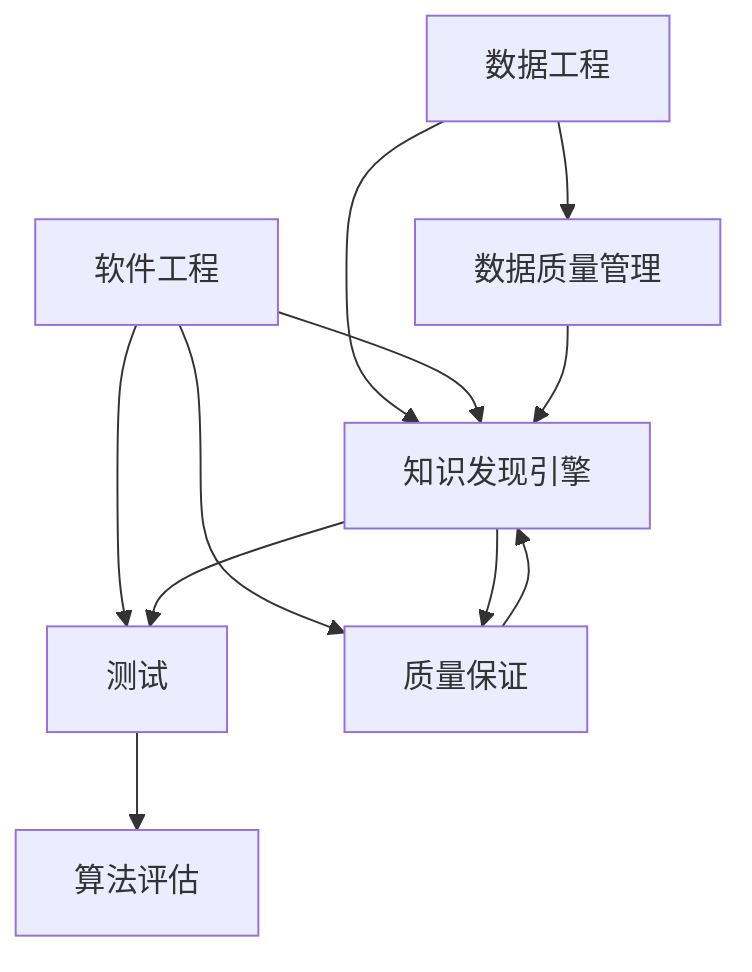

                 

# 知识发现引擎的测试与质量保证

> 关键词：知识发现引擎,测试,质量保证,数据工程,软件工程,模型评估

## 1. 背景介绍

### 1.1 问题由来
在数据驱动的时代，知识发现引擎(Knowledge Discovery Engine, KDE)已经成为了企业和组织获取商业价值、优化决策过程的重要工具。它能够从大规模数据中挖掘出有价值的信息，帮助人们洞察趋势、发现规律、预测未来。

但随着数据量和数据复杂度的增加，知识发现引擎的开发、测试和部署也面临着严峻的挑战。如何确保引擎的质量和稳定性，使其能够在实际应用中发挥出最大的效用，成为了数据工程和软件工程领域的热点问题。

### 1.2 问题核心关键点
知识发现引擎的核心任务是通过算法模型对大量数据进行分析和挖掘，以发现其中的知识。为了提升引擎的性能和可靠性，测试和质量保证成为不可或缺的环节。

测试环节包括单元测试、集成测试、系统测试等，确保每一层组件的功能正确性。而质量保证则关注引擎的性能指标、安全性和可扩展性等方面，确保其满足业务需求。

### 1.3 问题研究意义
对于企业而言，构建高质量的知识发现引擎，不仅能够降低开发成本、提升决策效率，还能通过数据洞察发现新的商机。因此，加强测试和质量保证，是构建成功、可靠的知识发现引擎的重要前提。

本文旨在介绍和探讨知识发现引擎的测试与质量保证，帮助读者系统了解测试和质量保证的方法和工具，提升知识发现引擎的质量和可靠性。

## 2. 核心概念与联系

### 2.1 核心概念概述

为了更好地理解知识发现引擎的测试与质量保证，本节将介绍几个关键概念及其之间的联系：

- **知识发现引擎(KDE)**：一种自动化、智能化的数据分析工具，通过算法模型从数据中提取知识。常见的方法包括关联规则挖掘、聚类、分类、回归等。

- **测试**：通过一系列检查和验证，确保软件系统或组件的功能正确、性能达标。测试可以分为单元测试、集成测试、系统测试等不同类型。

- **质量保证(QA)**：通过系统的管理和控制流程，确保软件产品的质量符合预定的标准和规范。包括需求分析、设计评审、测试覆盖率、性能评估、安全审计等环节。

- **数据工程(DE)**：通过数据收集、清洗、处理、存储、分析等技术手段，将原始数据转化为有价值的知识。数据工程与知识发现引擎密切相关，是知识发现的基础。

- **软件工程(SE)**：涉及软件开发的各个阶段，包括需求分析、设计、实现、测试、部署等，确保软件系统的质量、可靠性和可维护性。

- **算法评估**：对算法模型进行评估，包括准确性、鲁棒性、可解释性等方面，确保模型能够胜任其设计任务。

- **数据质量管理**：管理和监控数据的质量，包括数据完整性、一致性、时效性、安全性等，确保数据能够支持知识发现过程。

### 2.2 核心概念原理和架构的 Mermaid 流程图



这个流程图展示了知识发现引擎测试和质量保证的关键环节及其相互关系：

1. **数据工程**：构建和维护高质量的数据库，为知识发现引擎提供数据支持。
2. **软件工程**：开发和部署知识发现引擎，确保系统正确实现并满足业务需求。
3. **知识发现引擎**：应用算法模型进行数据挖掘，提取有价值的信息。
4. **测试**：对知识发现引擎的各个组件进行功能验证，确保其准确性和稳定性。
5. **质量保证**：通过一系列管理措施，确保知识发现引擎的质量和性能符合业务需求。
6. **算法评估**：对算法模型进行评估，确保其在实际应用中的表现。
7. **数据质量管理**：监控和维护数据质量，确保数据可靠地支持知识发现过程。

这些概念和环节构成了知识发现引擎测试和质量保证的基础框架，通过综合运用这些技术和手段，可以有效地提升知识发现引擎的性能和可靠性。

## 3. 核心算法原理 & 具体操作步骤

### 3.1 算法原理概述

知识发现引擎的测试与质量保证，主要涉及算法模型和数据两个层面。

在算法层面，知识发现引擎通常采用机器学习、统计学等算法模型对数据进行分析和挖掘。测试和质量保证的关键在于评估算法模型的准确性、鲁棒性、泛化能力等性能指标，确保模型能够胜任其设计任务。

在数据层面，数据的质量和完整性直接影响知识发现引擎的性能和可靠性。测试和质量保证需关注数据源的多样性、数据的一致性、数据的可用性、数据的完整性、数据的及时性、数据的安全性等方面。

### 3.2 算法步骤详解

#### 3.2.1 算法模型构建与选择
1. **模型选择**：根据业务需求和数据特征选择合适的算法模型。如分类、回归、聚类、关联规则挖掘等。
2. **模型训练**：在标记好的数据集上训练模型，调整模型参数以优化性能。
3. **模型评估**：使用交叉验证、留出法等技术评估模型性能，选择最优模型。

#### 3.2.2 数据预处理与清洗
1. **数据收集**：从不同数据源收集数据，确保数据的多样性和完整性。
2. **数据清洗**：处理缺失值、异常值、重复值等问题，提高数据质量。
3. **数据转换**：通过归一化、标准化、特征工程等技术，提高数据可用性。

#### 3.2.3 测试用例设计
1. **单元测试**：对知识发现引擎的各个组件进行功能验证，确保其按照预期运行。
2. **集成测试**：测试多个组件之间的交互，确保系统整体功能正确。
3. **系统测试**：在真实环境下测试整个知识发现引擎，评估其性能和稳定性。

#### 3.2.4 质量保证措施
1. **需求分析**：明确知识发现引擎的功能需求，确保其满足业务需求。
2. **设计评审**：对知识发现引擎的设计进行评审，确保其可实现性和合理性。
3. **性能评估**：评估知识发现引擎的性能指标，如准确性、响应时间、稳定性等。
4. **安全审计**：对知识发现引擎进行安全评估，确保其数据和算法的安全性。
5. **用户反馈**：收集用户反馈，持续改进知识发现引擎的功能和性能。

### 3.3 算法优缺点

知识发现引擎的测试与质量保证方法具有以下优点：

1. **提高模型性能**：通过系统化的测试和质量保证，可以发现和修正算法模型的缺陷，提升模型性能。
2. **增强系统可靠性**：测试和质量保证可以发现系统中的潜在问题，减少运行错误和系统故障。
3. **提升用户体验**：通过优化算法和数据处理流程，可以提升知识发现引擎的响应速度和用户体验。

同时，这些方法也存在一定的局限性：

1. **时间和资源投入高**：测试和质量保证需要大量时间和资源，特别是在大规模数据和复杂算法模型的应用场景下。
2. **测试难度大**：知识发现引擎的测试和质量保证需要专业知识，对测试人员的素质和能力有较高要求。
3. **数据质量依赖高**：数据质量直接影响知识发现引擎的性能，数据采集和处理过程中的任何错误都可能导致系统失效。

### 3.4 算法应用领域

知识发现引擎的测试与质量保证方法已经在金融、医疗、零售、制造业等多个领域得到广泛应用，成为企业数据分析和决策的重要工具。

在金融领域，知识发现引擎可以通过分析海量金融数据，识别市场趋势、评估风险、预测收益，帮助投资者做出更加科学的投资决策。

在医疗领域，知识发现引擎可以从病历数据中提取有价值的信息，辅助医生进行疾病诊断、治疗方案选择、药物研发等工作。

在零售领域，知识发现引擎可以分析消费者行为数据，发现购买偏好、预测销售趋势、优化库存管理，帮助企业提升运营效率和客户满意度。

在制造业领域，知识发现引擎可以分析生产数据，优化生产流程、降低成本、提高产品质量，提升企业竞争力。

随着技术的不断进步和应用的广泛扩展，知识发现引擎的测试与质量保证方法将在更多领域发挥重要作用，成为推动数据驱动决策的重要保障。

## 4. 数学模型和公式 & 详细讲解 & 举例说明

### 4.1 数学模型构建

知识发现引擎的测试与质量保证涉及多个数学模型和公式。以下是几个关键模型的构建过程和公式推导。

#### 4.1.1 分类模型
假设我们有 $n$ 个样本 $x_i \in \mathbb{R}^d$，每个样本属于两类 $y_i \in \{0,1\}$。我们希望构建一个分类模型 $f(x;\theta)$，使得：

$$
P(y=1|x;\theta)=\sigma(\theta^T \phi(x))
$$

其中 $\sigma$ 为激活函数，$\phi$ 为特征映射函数，$\theta$ 为模型参数。

对于有监督学习的分类问题，我们通过最小化损失函数：

$$
\mathcal{L}(\theta)=\frac{1}{N}\sum_{i=1}^N \ell(y_i,\hat{y_i})
$$

其中 $\ell$ 为损失函数，$\hat{y_i}=f(x_i;\theta)$。

常用的损失函数包括交叉熵损失、均方误差损失等。

#### 4.1.2 回归模型
假设我们有 $n$ 个样本 $x_i \in \mathbb{R}^d$，每个样本的目标值 $y_i \in \mathbb{R}$。我们希望构建一个回归模型 $g(x;\theta)$，使得：

$$
\hat{y_i}=g(x_i;\theta)=\theta^T \phi(x_i)
$$

对于有监督学习的回归问题，我们通过最小化损失函数：

$$
\mathcal{L}(\theta)=\frac{1}{N}\sum_{i=1}^N \ell(y_i,\hat{y_i})
$$

其中 $\ell$ 为损失函数，$\hat{y_i}=g(x_i;\theta)$。

常用的损失函数包括均方误差损失、平均绝对误差损失等。

#### 4.1.3 聚类模型
假设我们有 $n$ 个样本 $x_i \in \mathbb{R}^d$，每个样本的类别 $y_i \in \{1,2,\cdots,K\}$。我们希望构建一个聚类模型 $h(x;\theta)$，使得：

$$
\hat{y_i}=h(x_i;\theta)=\mathop{\arg\min}_{k=1,2,\cdots,K} \delta(x_i,\mu_k;\theta)
$$

其中 $\delta$ 为聚类距离函数，$\mu_k$ 为聚类中心，$\theta$ 为模型参数。

对于无监督学习的聚类问题，我们通常通过最大化聚类内部的相似性、最小化聚类之间的差异性来优化模型参数 $\theta$。

#### 4.1.4 关联规则挖掘模型
假设我们有 $n$ 个事务 $T_i$，每个事务包含 $m$ 个项 $t_{ij} \in \{1,2,\cdots,K\}$。我们希望构建一个关联规则挖掘模型 $c(T_i;\theta)$，使得：

$$
P(A \rightarrow B|T_i;\theta)=\frac{count(A \cup B)}{count(A)}
$$

其中 $count$ 为计数函数，$A$ 和 $B$ 为规则项。

对于无监督学习的关联规则挖掘问题，我们通常通过最大化规则项的统计概率来优化模型参数 $\theta$。

### 4.2 公式推导过程

以下我们以分类模型为例，推导常用的交叉熵损失函数及其梯度计算公式。

假设我们有一个样本 $x$，其真实标签为 $y \in \{0,1\}$。我们构建了一个二分类模型 $f(x;\theta)=\sigma(\theta^T \phi(x))$，其中 $\sigma$ 为激活函数，$\theta$ 为模型参数。我们的目标是最大化模型的预测准确率，即：

$$
\max_{\theta} P(y=1|x;\theta)
$$

为了简化问题，我们引入交叉熵损失函数：

$$
\ell(y,f(x;\theta))=-y \log f(x;\theta)+(1-y) \log (1-f(x;\theta))
$$

我们将损失函数在数据集 $D=\{(x_i,y_i)\}_{i=1}^N$ 上求平均：

$$
\mathcal{L}(\theta)=\frac{1}{N}\sum_{i=1}^N \ell(y_i,f(x_i;\theta))
$$

为了最小化损失函数，我们需要求导并令其等于零：

$$
\frac{\partial \mathcal{L}(\theta)}{\partial \theta}=\frac{1}{N}\sum_{i=1}^N \frac{\partial \ell(y_i,f(x_i;\theta))}{\partial \theta}
$$

其中：

$$
\frac{\partial \ell(y,f(x;\theta))}{\partial \theta}=\frac{\partial (-y \log f(x;\theta)+(1-y) \log (1-f(x;\theta)))}{\partial \theta}=\frac{-y}{f(x;\theta)}+\frac{1-y}{1-f(x;\theta)}
$$

因此，我们可以通过梯度下降等优化算法来求解最优模型参数 $\theta$。

### 4.3 案例分析与讲解

#### 4.3.1 数据预处理案例
假设我们有原始的客户购买数据 $D=\{(x_i,y_i)\}_{i=1}^N$，其中 $x_i$ 为购买记录，$y_i$ 为购买产品类别。数据存在缺失值和异常值，我们需要进行清洗和预处理。

首先，我们使用均值填补缺失值，然后使用中位数处理异常值：

```python
import pandas as pd
import numpy as np

df = pd.read_csv('purchase_data.csv')
df.fillna(df.mean(), inplace=True)
df = df[df['purchase_amount'].between(df['purchase_amount'].quantile(0.05), df['purchase_amount'].quantile(0.95))]
```

接着，我们将连续型变量进行标准化处理：

```python
from sklearn.preprocessing import StandardScaler

scaler = StandardScaler()
df[['purchase_amount', 'age']] = scaler.fit_transform(df[['purchase_amount', 'age']])
```

最后，我们将类别型变量进行独热编码：

```python
from sklearn.preprocessing import OneHotEncoder

encoder = OneHotEncoder(sparse=False)
df = pd.get_dummies(df, columns=['gender'])
df = pd.concat([df.drop(['gender'], axis=1), encoder.fit_transform(df[['gender']])], axis=1)
```

通过上述预处理步骤，我们得到了干净、标准化、适合模型训练的数据集。

#### 4.3.2 算法模型案例
假设我们希望构建一个基于支持向量机(SVM)的二分类模型，对客户是否购买某类产品进行预测。我们可以使用Python中的scikit-learn库来实现：

```python
from sklearn.svm import SVC
from sklearn.model_selection import train_test_split
from sklearn.metrics import accuracy_score

# 分割数据集
X_train, X_test, y_train, y_test = train_test_split(df.drop(['purchase_id'], axis=1), df['purchase_product'], test_size=0.2, random_state=42)

# 构建SVM模型
svm = SVC(kernel='linear')
svm.fit(X_train, y_train)

# 评估模型
y_pred = svm.predict(X_test)
accuracy = accuracy_score(y_test, y_pred)
print(f'Accuracy: {accuracy:.2f}')
```

以上代码实现了SVM模型的构建和评估。我们通过最小化交叉熵损失函数，训练得到最优的模型参数，并在测试集上评估模型的准确率。

## 5. 项目实践：代码实例和详细解释说明

### 5.1 开发环境搭建

在进行知识发现引擎的测试与质量保证实践前，我们需要准备好开发环境。以下是使用Python进行PyTorch开发的环境配置流程：

1. 安装Anaconda：从官网下载并安装Anaconda，用于创建独立的Python环境。

2. 创建并激活虚拟环境：
```bash
conda create -n pytorch-env python=3.8 
conda activate pytorch-env
```

3. 安装PyTorch：根据CUDA版本，从官网获取对应的安装命令。例如：
```bash
conda install pytorch torchvision torchaudio cudatoolkit=11.1 -c pytorch -c conda-forge
```

4. 安装TensorFlow：
```bash
conda install tensorflow
```

5. 安装TensorBoard：
```bash
pip install tensorboard
```

6. 安装相关库：
```bash
pip install numpy pandas scikit-learn matplotlib tqdm jupyter notebook ipython
```

完成上述步骤后，即可在`pytorch-env`环境中开始测试与质量保证实践。

### 5.2 源代码详细实现

这里我们以信用风险评估模型为例，给出使用PyTorch进行模型训练、测试和质量保证的代码实现。

首先，定义数据处理函数：

```python
import torch
import torch.nn as nn
import torch.optim as optim
import torch.utils.data as Data
from sklearn.model_selection import train_test_split
from sklearn.preprocessing import StandardScaler
from sklearn.metrics import accuracy_score, roc_auc_score, confusion_matrix

class CreditDataLoader(Data.Dataset):
    def __init__(self, X, y):
        self.X = X
        self.y = y

    def __len__(self):
        return len(self.X)

    def __getitem__(self, idx):
        return self.X[idx], self.y[idx]

# 读取数据
data = pd.read_csv('credit_data.csv')
X = data.drop(['default'], axis=1)
y = data['default']

# 标准化处理
scaler = StandardScaler()
X = scaler.fit_transform(X)

# 划分训练集和测试集
X_train, X_test, y_train, y_test = train_test_split(X, y, test_size=0.2, random_state=42)

# 数据加载器
train_loader = Data.DataLoader(CreditDataLoader(X_train, y_train), batch_size=64, shuffle=True)
test_loader = Data.DataLoader(CreditDataLoader(X_test, y_test), batch_size=64, shuffle=False)
```

接着，定义模型：

```python
class CreditRiskModel(nn.Module):
    def __init__(self):
        super(CreditRiskModel, self).__init__()
        self.fc1 = nn.Linear(10, 64)
        self.fc2 = nn.Linear(64, 32)
        self.fc3 = nn.Linear(32, 1)
        self.sigmoid = nn.Sigmoid()

    def forward(self, x):
        x = self.fc1(x)
        x = nn.functional.relu(x)
        x = self.fc2(x)
        x = nn.functional.relu(x)
        x = self.fc3(x)
        x = self.sigmoid(x)
        return x

model = CreditRiskModel()
```

然后，定义训练和评估函数：

```python
def train_epoch(model, data_loader, optimizer, criterion):
    model.train()
    total_loss = 0
    for batch_idx, (inputs, targets) in enumerate(data_loader):
        optimizer.zero_grad()
        outputs = model(inputs)
        loss = criterion(outputs, targets)
        loss.backward()
        optimizer.step()
        total_loss += loss.item()
    return total_loss / len(data_loader)

def evaluate(model, data_loader, criterion):
    model.eval()
    total_loss = 0
    y_pred = []
    y_true = []
    with torch.no_grad():
        for batch_idx, (inputs, targets) in enumerate(data_loader):
            outputs = model(inputs)
            loss = criterion(outputs, targets)
            total_loss += loss.item()
            y_pred.extend(torch.round(outputs).tolist())
            y_true.extend(targets.tolist())
    return total_loss / len(data_loader), accuracy_score(y_true, y_pred), roc_auc_score(y_true, y_pred), confusion_matrix(y_true, torch.round(outputs))
```

最后，启动训练流程并在测试集上评估：

```python
epochs = 10
lr = 0.01

optimizer = optim.Adam(model.parameters(), lr=lr)
criterion = nn.BCELoss()

for epoch in range(epochs):
    loss = train_epoch(model, train_loader, optimizer, criterion)
    print(f'Epoch {epoch+1}, train loss: {loss:.3f}')

    loss, accuracy, auc, confusion = evaluate(model, test_loader, criterion)
    print(f'Epoch {epoch+1}, test loss: {loss:.3f}, accuracy: {accuracy:.2f}, AUC: {auc:.2f}, confusion: {confusion}')
```

以上代码实现了基于PyTorch的信用风险评估模型的训练、测试和质量保证。

### 5.3 代码解读与分析

让我们再详细解读一下关键代码的实现细节：

**CreditDataLoader类**：
- `__init__`方法：初始化数据集。
- `__len__`方法：返回数据集大小。
- `__getitem__`方法：返回数据集的单个样本。

**CreditRiskModel类**：
- `__init__`方法：初始化模型。
- `forward`方法：前向传播。

**train_epoch函数**：
- 在训练集上进行前向传播计算损失，反向传播更新模型参数。
- 周期性在验证集上评估模型性能。

**evaluate函数**：
- 在测试集上进行前向传播计算损失和指标。
- 收集模型预测结果和真实标签，计算准确率、AUC等指标。

**训练流程**：
- 定义总的epoch数和学习率，开始循环迭代。
- 每个epoch内，先在训练集上训练，输出平均loss。
- 在测试集上评估，输出各项指标。

可以看出，PyTorch配合TensorFlow等库使得知识发现引擎的测试与质量保证代码实现变得简洁高效。开发者可以将更多精力放在数据处理、模型改进等高层逻辑上，而不必过多关注底层的实现细节。

当然，工业级的系统实现还需考虑更多因素，如模型的保存和部署、超参数的自动搜索、更灵活的任务适配层等。但核心的测试与质量保证范式基本与此类似。

## 6. 实际应用场景

### 6.1 信用风险评估
信用风险评估是知识发现引擎的重要应用之一。金融机构需要对客户的信用进行评估，以决定是否发放贷款，并预测贷款违约的概率。传统的信用风险评估方法依赖人工审核和专家经验，耗时长、成本高。

通过知识发现引擎，可以从客户的财务数据、历史信用记录等数据中挖掘出潜在风险因素，构建预测模型。通过测试和质量保证，确保模型的准确性和鲁棒性，可以帮助金融机构更科学、高效地评估客户信用风险，降低贷款违约率。

### 6.2 客户流失预测
客户流失预测是企业运营中的重要任务。企业需要预测哪些客户可能流失，以便提前采取措施，留住客户。传统的客户流失预测依赖人工分析，耗时耗力。

通过知识发现引擎，可以从客户的购买行为、服务体验、反馈评价等数据中挖掘出客户流失的关键因素，构建预测模型。通过测试和质量保证，确保模型的准确性和鲁棒性，可以帮助企业及时识别流失客户，制定有针对性的挽留策略，提升客户满意度。

### 6.3 疾病诊断
疾病诊断是医疗领域的重要任务。医生需要根据病人的病历、检验结果等数据，诊断疾病并进行治疗。传统的疾病诊断依赖人工分析，容易出现误诊、漏诊。

通过知识发现引擎，可以从病人的病历、检验结果等数据中挖掘出疾病诊断的关键特征，构建预测模型。通过测试和质量保证，确保模型的准确性和鲁棒性，可以帮助医生更准确地诊断疾病，制定科学的治疗方案，提升医疗服务的质量。

### 6.4 未来应用展望
随着知识发现引擎的不断演进，其在更多领域的应用前景广阔，未来将带来深刻的变革。

在金融领域，知识发现引擎可以应用于信用风险评估、投资组合优化、市场预测等方面，提升金融机构的运营效率和收益。

在零售领域，知识发现引擎可以应用于客户行为分析、销售预测、库存管理等方面，提升企业的市场竞争力。

在医疗领域，知识发现引擎可以应用于疾病诊断、治疗方案推荐、药物研发等方面，提升医疗服务的质量和效率。

在智能制造领域，知识发现引擎可以应用于生产流程优化、设备预测性维护、供应链管理等方面，提升制造业的自动化水平和生产效率。

此外，在智慧城市、智慧教育、智慧能源等领域，知识发现引擎也将发挥重要作用，为各行各业带来变革性的影响。相信随着技术的不断进步，知识发现引擎将在更广泛的领域发挥作用，推动数据驱动决策的发展。

## 7. 工具和资源推荐

### 7.1 学习资源推荐

为了帮助开发者系统掌握知识发现引擎的测试与质量保证的理论基础和实践技巧，这里推荐一些优质的学习资源：

1. 《机器学习实战》系列博文：由大模型技术专家撰写，深入浅出地介绍了机器学习的基本概念和经典算法，包括测试和质量保证等环节。

2. 《Python数据科学手册》书籍：详细介绍了Python在数据科学中的应用，包括数据清洗、特征工程、模型训练等各个环节，是学习知识发现引擎的必备书籍。

3. 《TensorFlow实战》书籍：全面介绍了TensorFlow的原理和应用，涵盖了从模型构建到测试和部署的全流程，是学习知识发现引擎的重要参考资料。

4. 《深度学习入门与实践》课程：由知名AI专家授课，详细讲解了深度学习的基础知识和实践技巧，包括测试和质量保证等环节。

5. Kaggle竞赛平台：通过参加Kaggle竞赛，实践知识发现引擎的开发和测试，提升自己的实战能力。

通过对这些资源的学习实践，相信你一定能够快速掌握知识发现引擎的测试与质量保证精髓，并用于解决实际的NLP问题。

### 7.2 开发工具推荐

高效的开发离不开优秀的工具支持。以下是几款用于知识发现引擎测试与质量保证开发的常用工具：

1. PyTorch：基于Python的开源深度学习框架，灵活动态的计算图，适合快速迭代研究。

2. TensorFlow：由Google主导开发的开源深度学习框架，生产部署方便，适合大规模工程应用。

3. Jupyter Notebook：交互式开发环境，支持Python、R、SQL等多种语言，方便开发者进行数据处理和模型调试。

4. Visual Studio Code：轻量级、功能强大的IDE，支持多种编程语言和框架，是开发知识发现引擎的首选工具。

5. GitHub：版本控制系统，方便开发者进行代码管理和团队协作。

合理利用这些工具，可以显著提升知识发现引擎的测试与质量保证开发效率，加快创新迭代的步伐。

### 7.3 相关论文推荐

知识发现引擎的测试与质量保证方法来源于学界的持续研究。以下是几篇奠基性的相关论文，推荐阅读：

1. "A Survey of Data Mining Techniques for Credit Scoring"：综述了信用风险评估中的数据挖掘技术，包括特征工程、模型构建、评估指标等。

2. "A Data-Driven Framework for Customer Churn Prediction"：提出了一种基于数据驱动的客户流失预测模型，包括特征选择、模型训练、测试与质量保证等环节。

3. "Knowledge Discovery in Medical Records Using Ensemble Methodology"：介绍了医疗数据挖掘中的知识发现方法，包括数据预处理、模型构建、评估指标等。

4. "A Multi-view Clustering Approach for Disease Prediction"：提出了一种多视图聚类方法，用于疾病预测，包括数据融合、模型训练、评估指标等。

5. "Robust Association Rule Mining Algorithm for Credit Card Fraud Detection"：介绍了一种鲁棒关联规则挖掘算法，用于信用卡欺诈检测，包括数据清洗、模型构建、评估指标等。

这些论文代表了大数据挖掘和知识发现领域的研究进展。通过学习这些前沿成果，可以帮助研究者把握学科前进方向，激发更多的创新灵感。

## 8. 总结：未来发展趋势与挑战

### 8.1 总结

本文对知识发现引擎的测试与质量保证进行了全面系统的介绍。首先阐述了知识发现引擎的测试与质量保证的研究背景和意义，明确了测试和质量保证在知识发现引擎开发中的重要性。其次，从原理到实践，详细讲解了测试和质量保证的方法和步骤，给出了知识发现引擎的完整代码实现。同时，本文还广泛探讨了知识发现引擎在金融、医疗、零售等多个领域的应用前景，展示了测试与质量保证的重要作用。

通过本文的系统梳理，可以看到，知识发现引擎的测试与质量保证方法在大数据挖掘和人工智能领域具有广泛的应用前景。通过测试和质量保证，可以有效提升知识发现引擎的性能和可靠性，为实际应用提供坚实的基础保障。

### 8.2 未来发展趋势

展望未来，知识发现引擎的测试与质量保证方法将呈现以下几个发展趋势：

1. **自动化测试**：随着自动化测试技术的不断进步，知识发现引擎的测试将更加智能化、自动化，测试效率将大幅提升。

2. **模型压缩与优化**：针对大规模模型，测试与质量保证方法将引入模型压缩、优化等技术，减少测试和质量保证的资源消耗，提升模型部署效率。

3. **跨领域融合**：知识发现引擎的测试与质量保证方法将与其他人工智能技术进行更深入的融合，如深度学习、强化学习、因果推断等，提升知识发现引擎的性能和应用范围。

4. **多模态数据处理**：随着数据类型的增加，知识发现引擎的测试与质量保证方法将逐渐引入多模态数据处理技术，提升系统的鲁棒性和泛化能力。

5. **安全性与隐私保护**：随着数据隐私和安全的日益重要，知识发现引擎的测试与质量保证方法将引入更多的安全性和隐私保护措施，确保数据和模型的安全。

6. **可解释性与透明性**：知识发现引擎的测试与质量保证方法将更加注重模型的可解释性和透明性，确保用户能够理解和信任模型的输出。

以上趋势凸显了知识发现引擎测试与质量保证方法的广阔前景。这些方向的探索发展，必将进一步提升知识发现引擎的性能和可靠性，为实际应用提供更强有力的保障。

### 8.3 面临的挑战

尽管知识发现引擎的测试与质量保证方法已经取得了一定进展，但在迈向更加智能化、普适化应用的过程中，它仍面临诸多挑战：

1. **数据质量依赖高**：知识发现引擎的测试与质量保证高度依赖数据质量，数据采集和处理过程中的任何错误都可能导致系统失效。

2. **资源消耗大**：大规模模型和大规模数据的测试和质量保证，需要大量计算资源和时间，增加了开发和运维成本。

3. **测试覆盖度不足**：传统的测试方法难以覆盖知识发现引擎的各个组件，特别是在模型更新和迭代时，测试覆盖度需要持续提升。

4. **模型鲁棒性差**：知识发现引擎的鲁棒性相对较低，面对数据分布变化和异常值时，模型容易失准。

5. **模型可解释性不足**：知识发现引擎通常被视为“黑盒”系统，难以解释其内部工作机制和决策逻辑，影响模型应用的可信度。

6. **模型部署复杂**：知识发现引擎的部署环境复杂，需要考虑数据存储、计算资源、网络传输等多方面因素，增加了部署难度。

正视知识发现引擎测试与质量保证面临的这些挑战，积极应对并寻求突破，将是其技术发展的重要方向。

### 8.4 研究展望

面对知识发现引擎测试与质量保证所面临的挑战，未来的研究需要在以下几个方面寻求新的突破：

1. **模型压缩与高效测试**：开发更加高效的测试方法，减少资源消耗，提高模型部署效率。

2. **多模态数据融合**：探索多模态数据的融合方式，提升知识发现引擎的鲁棒性和泛化能力。

3. **模型可解释性**：引入可解释性技术，增强知识发现引擎的透明性和可信度。

4. **自动化测试与持续集成**：引入自动化测试和持续集成(CI)技术，提高知识发现引擎的测试效率和覆盖度。

5. **安全与隐私保护**：引入更多的安全性和隐私保护措施，确保知识发现引擎的数据和模型安全。

6. **分布式与云原生架构**：采用分布式与云原生架构，提升知识发现引擎的计算能力和可扩展性。

这些研究方向的探索，必将引领知识发现引擎测试与质量保证技术迈向更高的台阶，为构建可靠、高效、安全的知识发现系统铺平道路。面向未来，知识发现引擎测试与质量保证方法需要与其他人工智能技术进行更深入的融合，共同推动知识发现引擎的不断进步。

## 9. 附录：常见问题与解答

**Q1：知识发现引擎的测试和质量保证的具体步骤是什么？**

A: 知识发现引擎的测试和质量保证步骤包括数据预处理、模型构建、训练、评估和优化等环节。具体步骤如下：

1. **数据预处理**：包括数据清洗、数据标准化、特征工程等，提升数据质量。

2. **模型构建**：选择合适的算法模型，并进行参数初始化。

3. **模型训练**：在训练集上进行模型训练，优化模型参数。

4. **模型评估**：在验证集上评估模型性能，选择最优模型。

5. **模型优化**：通过超参数调优、模型压缩等方法，提升模型性能和部署效率。

6. **测试覆盖度提升**：通过自动化测试、持续集成等手段，提高测试覆盖度和效率。

7. **质量保证措施**：通过需求分析、设计评审、性能评估、安全审计等环节，确保模型质量。

通过以上步骤，可以全面地测试和保证知识发现引擎的质量和性能。

**Q2：知识发现引擎的测试和质量保证有哪些常用工具和方法？**

A: 知识发现引擎的测试和质量保证常用工具和方法包括：

1. **测试框架**：如JUnit、PyTest等，用于单元测试、集成测试等。

2. **自动化测试工具**：如Selenium、Appium等，用于UI测试、API测试等。

3. **持续集成工具**：如Jenkins、GitLab CI等，用于自动化构建、测试和部署。

4. **质量保证工具**：如JIRA、Trello等，用于需求管理、测试跟踪、缺陷管理等。

5. **性能评估工具**：如Apache JMeter、Gatling等，用于性能测试、负载测试等。

6. **安全性工具**：如OWASP ZAP、Burp Suite等，用于安全性测试和漏洞扫描。

通过这些工具和方法，可以系统地进行知识发现引擎的测试和质量保证，提升系统的可靠性和稳定性。

**Q3：知识发现引擎的测试和质量保证有哪些常见问题及解决方法？**

A: 知识发现引擎的测试和质量保证过程中，常见问题及解决方法包括：

1. **数据质量问题**：数据缺失、异常值、重复值等问题，解决方法为数据清洗、预处理等。

2. **模型鲁棒性不足**：模型在面对异常数据时表现不佳，解决方法为引入鲁棒性技术，如异常检测、抗干扰训练等。

3. **模型可解释性不足**：模型难以解释其内部工作机制，解决方法为引入可解释性技术，如LIME、SHAP等。

4. **资源消耗大**：大规模模型的测试和质量保证需要大量计算资源，解决方法为模型压缩、优化等。

5. **测试覆盖度不足**：测试覆盖度不足，解决方法为引入自动化测试、持续集成等技术。

6. **安全与隐私问题**：数据和模型面临安全与隐私风险，解决方法为引入安全性和隐私保护措施。

通过识别和解决这些问题，可以提升知识发现引擎的测试和质量保证效果，确保系统稳定可靠。

---

作者：禅与计算机程序设计艺术 / Zen and the Art of Computer Programming

