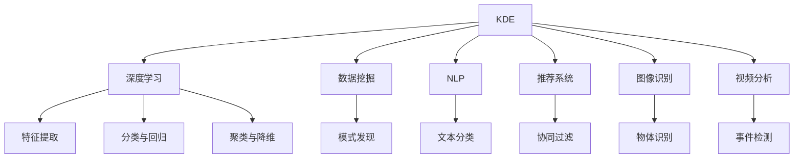

                 

# 知识发现引擎的深度学习技术应用

> 关键词：知识发现引擎,深度学习,数据挖掘,自然语言处理(NLP),推荐系统,图像识别,视频分析

## 1. 背景介绍

在当今数据爆炸的时代，知识的获取和应用变得比以往任何时候都更加重要。然而，知识并不是孤立存在的，而是隐藏在海量的数据中。如何高效地从这些数据中挖掘出有用的知识，并转化为可利用的信息，成为了信息时代的一项核心任务。这正是知识发现引擎所承担的重要使命。知识发现引擎（Knowledge Discovery Engine, KDE）旨在从结构化或非结构化数据中自动挖掘、发现和抽取知识，并为用户呈现可行的应用场景和推荐结果。

知识发现引擎的实现通常依赖于一系列先进的技术手段，如机器学习、数据挖掘、自然语言处理（NLP）、推荐系统等。而深度学习作为当前人工智能领域最为前沿的技术，凭借其强大的数据拟合能力、自主学习机制和泛化性能，在知识发现引擎的建设中扮演着至关重要的角色。本文将从深度学习的角度出发，深入探讨其在知识发现引擎中的应用，并通过具体案例，阐述深度学习技术的实际应用效果。

## 2. 核心概念与联系

在深入探讨深度学习在知识发现引擎中的应用之前，我们首先需要了解以下几个核心概念及其相互之间的联系：

- **知识发现引擎（KDE）**：从原始数据中挖掘、发现并抽取有用的知识和信息，并为用户提供可行的应用场景和推荐结果。
- **深度学习（Deep Learning）**：通过多层次的非线性变换，从数据中学习抽象的特征表示，实现对复杂模式的自动提取和分类。
- **数据挖掘（Data Mining）**：从大量数据中自动发现模式、规则、异常值和知识，并对这些知识进行抽取、总结和应用。
- **自然语言处理（NLP）**：使计算机能够理解、解释和生成人类语言，广泛应用于文本挖掘、信息检索和智能问答等领域。
- **推荐系统（Recommendation System）**：根据用户的行为和偏好，自动推荐相关信息，提升用户体验和满意度。
- **图像识别（Image Recognition）**：从图像中提取有用的特征，实现对物体的识别、分类和检测。
- **视频分析（Video Analysis）**：从视频流中提取关键信息，实现对视频内容的理解和分析。

这些概念之间的关系可以通过以下Mermaid流程图来展示：



这个流程图展示了知识发现引擎如何通过深度学习技术，从不同的数据类型中提取知识。深度学习通过特征提取、分类、回归、聚类等手段，从数据中学习出有用的模式和特征，而数据挖掘、自然语言处理、推荐系统、图像识别和视频分析则负责对知识进行抽取、总结和应用，从而构建出完整的知识发现引擎系统。

## 3. 核心算法原理 & 具体操作步骤

### 3.1 算法原理概述

在知识发现引擎中，深度学习主要通过以下几种算法实现知识抽取和推荐：

- **特征提取（Feature Extraction）**：深度学习模型通过自动学习输入数据的低维表示，实现对数据的特征提取。这一过程通常由卷积神经网络（CNN）、循环神经网络（RNN）或Transformer等模型完成。
- **分类与回归（Classification & Regression）**：通过深度学习模型对数据进行分类或回归预测，抽取有用的标签信息。常用的模型包括支持向量机（SVM）、随机森林（Random Forest）和深度神经网络（DNN）。
- **聚类与降维（Clustering & Dimensionality Reduction）**：通过深度学习模型实现数据的聚类分析和降维，抽取隐含的模式和结构。常见的算法包括K-Means、DBSCAN和Autoencoder。
- **关联规则学习（Association Rule Learning）**：通过深度学习模型发现数据中的关联规则，抽取潜在的模式和规律。这一过程通常由Apriori算法、FP-Growth算法和Deep Learning结合实现。
- **图像识别（Image Recognition）**：通过卷积神经网络（CNN）等模型实现图像的分类和标注，提取视觉特征和信息。
- **视频分析（Video Analysis）**：通过卷积神经网络（CNN）、循环神经网络（RNN）和Transformer等模型，对视频内容进行分类、标注和行为识别，抽取时间序列信息。

### 3.2 算法步骤详解

以下是深度学习在知识发现引擎中应用的典型步骤：

**Step 1: 数据收集与预处理**

- 收集结构化或非结构化数据，如文本、图像、视频等。
- 对数据进行清洗、归一化和特征工程，准备数据输入模型。

**Step 2: 模型构建与训练**

- 选择合适的深度学习模型，如CNN、RNN、Transformer等。
- 设计合适的网络结构、损失函数和优化算法，如Adam、SGD等。
- 使用标注数据进行模型训练，优化模型参数，提高模型性能。

**Step 3: 特征提取与模式发现**

- 使用训练好的深度学习模型对数据进行特征提取，学习数据的低维表示。
- 通过分类、回归、聚类等算法，发现数据中的模式和规律。

**Step 4: 知识抽取与推荐**

- 利用数据挖掘和自然语言处理技术，从数据中抽取有用的知识。
- 根据用户的行为和偏好，使用推荐系统算法，为用户推荐相关内容。

**Step 5: 结果展示与评估**

- 将抽取出的知识以图表、报告等形式展示给用户。
- 对推荐结果进行评估，不断优化算法，提高推荐效果。

### 3.3 算法优缺点

深度学习在知识发现引擎中的应用具有以下优点：

- **自动化特征提取**：深度学习能够自动学习数据的低维表示，无需手动设计特征，避免了人工特征工程的低效和不准确。
- **高泛化性能**：深度学习模型能够从大量数据中学习出通用的特征表示，具有较好的泛化能力，适用于复杂的非线性模式。
- **灵活性**：深度学习模型适用于多种数据类型和任务，包括文本、图像、视频等，具有广泛的适用性。
- **性能优越**：深度学习模型通常能够实现高精度的分类、回归、聚类等任务，显著提升了知识发现和推荐的准确性。

但深度学习也存在以下缺点：

- **计算资源要求高**：深度学习模型通常需要较大的计算资源和时间，训练过程复杂。
- **模型复杂度高**：深度学习模型结构复杂，难以解释其内部工作机制，存在一定的"黑盒"问题。
- **过拟合风险高**：深度学习模型容易过拟合，需要大量标注数据和正则化技术来防止过拟合。
- **高调参需求**：深度学习模型的性能高度依赖于超参数的设定，需要进行大量的调参工作。

### 3.4 算法应用领域

深度学习在知识发现引擎中的应用领域非常广泛，包括但不限于以下几个方面：

- **文本挖掘**：从文本中抽取情感、主题、关键词等信息，实现文本分类、情感分析和信息检索。
- **图像识别**：从图像中提取物体、场景、行为等信息，实现图像分类、目标检测和图像分割。
- **视频分析**：从视频中提取事件、行为、物体等信息，实现视频分类、行为识别和事件检测。
- **推荐系统**：根据用户行为和偏好，推荐相关商品、新闻、文章等信息，提升用户体验。
- **医疗知识发现**：从医疗数据中提取疾病、症状、治疗等信息，辅助临床决策和治疗方案设计。
- **金融知识发现**：从金融数据中提取市场趋势、风险信号等信息，辅助投资决策和风险管理。

## 4. 数学模型和公式 & 详细讲解 & 举例说明

### 4.1 数学模型构建

在知识发现引擎中，深度学习模型通常用于特征提取和分类/回归任务。以文本分类为例，我们可以使用如下数学模型：

设文本数据为 $x = \{x_1, x_2, ..., x_n\}$，其中 $x_i$ 表示第 $i$ 个文本样本。假设模型为 $f(x; \theta)$，其中 $\theta$ 为模型参数。则文本分类的目标是最小化损失函数：

$$
L(\theta) = -\frac{1}{N} \sum_{i=1}^N \sum_{y_i \in \{0, 1\}} [y_i \log f(x_i; \theta) + (1-y_i) \log (1-f(x_i; \theta))]
$$

其中，$y_i$ 表示文本的真实标签，$f(x_i; \theta)$ 表示模型对文本 $x_i$ 的预测概率。

### 4.2 公式推导过程

在上述文本分类的数学模型中，目标是最小化交叉熵损失函数。我们可以通过梯度下降等优化算法来求解最优参数 $\theta$。具体推导过程如下：

$$
\frac{\partial L(\theta)}{\partial \theta_k} = -\frac{1}{N} \sum_{i=1}^N \sum_{y_i \in \{0, 1\}} \frac{y_i f(x_i; \theta) - (1-y_i)(1-f(x_i; \theta))}{f(x_i; \theta)(1-f(x_i; \theta))} \frac{\partial f(x_i; \theta)}{\partial \theta_k}
$$

其中，$\frac{\partial f(x_i; \theta)}{\partial \theta_k}$ 为模型对文本 $x_i$ 的预测概率对模型参数 $\theta_k$ 的梯度，可以通过反向传播算法计算。

### 4.3 案例分析与讲解

以情感分析为例，我们可以使用LSTM模型进行特征提取和分类。假设输入文本为 $x = \{x_1, x_2, ..., x_n\}$，其中 $x_i$ 表示第 $i$ 个文本样本。LSTM模型的隐藏状态为 $h_t$，输出为 $y_t$，则情感分析的目标是最小化损失函数：

$$
L(\theta) = -\frac{1}{N} \sum_{i=1}^N \sum_{t=1}^{T} \log y_t
$$

其中，$y_t$ 表示模型对文本 $x_i$ 在时间步 $t$ 的情感预测，可以是0表示负面情感，1表示正面情感。通过反向传播算法，可以计算出模型参数 $\theta$ 的梯度，并进行优化。

## 5. 项目实践：代码实例和详细解释说明

### 5.1 开发环境搭建

在进行深度学习在知识发现引擎中的应用实践前，我们需要准备好开发环境。以下是使用Python进行TensorFlow开发的环境配置流程：

1. 安装Anaconda：从官网下载并安装Anaconda，用于创建独立的Python环境。

2. 创建并激活虚拟环境：
```bash
conda create -n tensorflow-env python=3.7 
conda activate tensorflow-env
```

3. 安装TensorFlow：根据CUDA版本，从官网获取对应的安装命令。例如：
```bash
conda install tensorflow -c conda-forge -c pytorch -c pypi
```

4. 安装各类工具包：
```bash
pip install numpy pandas scikit-learn matplotlib tqdm jupyter notebook ipython
```

完成上述步骤后，即可在`tensorflow-env`环境中开始深度学习在知识发现引擎中的应用实践。

### 5.2 源代码详细实现

下面以文本分类为例，给出使用TensorFlow进行LSTM模型训练的代码实现。

首先，定义文本分类的数据处理函数：

```python
import tensorflow as tf
from tensorflow.keras.preprocessing.text import Tokenizer
from tensorflow.keras.preprocessing.sequence import pad_sequences

class TextClassificationDataset(tf.data.Dataset):
    def __init__(self, texts, labels, tokenizer, max_len=128):
        self.texts = texts
        self.labels = labels
        self.tokenizer = tokenizer
        self.max_len = max_len
        
    def __len__(self):
        return len(self.texts)
    
    def __getitem__(self, item):
        text = self.texts[item]
        label = self.labels[item]
        
        encoding = self.tokenizer(text, max_length=self.max_len, truncation=True, padding='post')
        input_ids = tf.keras.preprocessing.sequence.pad_sequences(encoding['ids'], maxlen=self.max_len, padding='post', truncating='post')
        label = tf.keras.utils.to_categorical(label, num_classes=2)
        
        return {'input_ids': input_ids, 'labels': label}

tokenizer = Tokenizer(num_words=10000)
tokenizer.fit_on_texts(train_texts)
train_dataset = TextClassificationDataset(train_texts, train_labels, tokenizer, max_len=128)
```

然后，定义模型和优化器：

```python
from tensorflow.keras.layers import LSTM, Dense, Embedding
from tensorflow.keras.models import Sequential
from tensorflow.keras.optimizers import Adam

model = Sequential([
    Embedding(input_dim=10000, output_dim=128, input_length=max_len),
    LSTM(128),
    Dense(1, activation='sigmoid')
])

optimizer = Adam(learning_rate=0.001)
```

接着，定义训练和评估函数：

```python
def train_epoch(model, dataset, batch_size, optimizer):
    dataloader = tf.data.Dataset.from_generator(lambda: dataset, output_signature=dataset.element_spec)
    model.compile(optimizer=optimizer, loss='binary_crossentropy', metrics=['accuracy'])
    model.fit(dataloader, epochs=10, batch_size=batch_size, validation_split=0.2)
    
def evaluate(model, dataset, batch_size):
    dataloader = tf.data.Dataset.from_generator(lambda: dataset, output_signature=dataset.element_spec)
    model.evaluate(dataloader, batch_size=batch_size)
```

最后，启动训练流程并在测试集上评估：

```python
epochs = 10
batch_size = 32

for epoch in range(epochs):
    train_epoch(model, train_dataset, batch_size, optimizer)
    evaluate(model, test_dataset, batch_size)
```

以上就是使用TensorFlow对LSTM模型进行文本分类的完整代码实现。可以看到，利用TensorFlow框架，深度学习在知识发现引擎中的应用实现变得简单高效。

### 5.3 代码解读与分析

让我们再详细解读一下关键代码的实现细节：

**TextClassificationDataset类**：
- `__init__`方法：初始化文本、标签、分词器等关键组件，并准备数据集。
- `__len__`方法：返回数据集的样本数量。
- `__getitem__`方法：对单个样本进行处理，将文本输入转换为模型所需的张量，并进行pad处理。

**模型定义**：
- 使用TensorFlow的Sequential模型，定义了嵌入层、LSTM层和全连接层。
- 设置Adam优化器和二元交叉熵损失函数。

**训练和评估函数**：
- 使用TensorFlow的数据管道功能，构建数据集并加载。
- 使用模型的compile和fit方法进行模型训练，在测试集上使用evaluate方法进行模型评估。

通过上述步骤，我们可以快速搭建并训练LSTM模型，进行文本分类的任务。

## 6. 实际应用场景

### 6.1 医疗知识发现

医疗知识发现引擎能够从医疗数据中挖掘出有用的信息和知识，辅助临床决策和治疗方案设计。以电子病历（Electronic Health Record, EHR）为例，深度学习可以通过文本分类和情感分析等技术，从EHR中抽取医生对患者的诊断、治疗和病情变化等信息。

具体而言，可以收集医院的电子病历数据，并对其进行预处理，将其转化为结构化或非结构化数据。然后，使用深度学习模型对数据进行特征提取和分类，从中抽取医生的诊断和病情变化等信息。最后，将抽取出的知识以报告、图表等形式呈现给医生，帮助其快速做出诊断和治疗方案。

### 6.2 金融知识发现

金融知识发现引擎能够从金融数据中挖掘出市场趋势、风险信号等信息，辅助投资决策和风险管理。以股票市场为例，深度学习可以通过文本分类和情感分析等技术，从新闻、公告、社交媒体等数据中抽取市场动态和情感变化。

具体而言，可以收集金融市场的新闻、公告和社交媒体数据，并对其进行预处理，将其转化为结构化或非结构化数据。然后，使用深度学习模型对数据进行特征提取和分类，从中抽取市场动态和情感变化等信息。最后，将抽取出的知识以报告、图表等形式呈现给投资者，帮助其做出投资决策和风险管理。

### 6.3 推荐系统

推荐系统能够根据用户的行为和偏好，为用户推荐相关商品、新闻、文章等信息，提升用户体验。深度学习可以通过协同过滤和内容推荐等技术，实现高精度的推荐效果。

具体而言，可以收集用户的浏览、点击、购买等行为数据，并对其进行预处理，将其转化为结构化或非结构化数据。然后，使用深度学习模型对数据进行特征提取和分类，从中抽取用户的兴趣和行为模式。最后，将抽取出的知识用于推荐系统算法中，为用户推荐相关商品、新闻、文章等信息，提升用户体验。

### 6.4 未来应用展望

随着深度学习技术的发展，知识发现引擎在未来将具有更广泛的应用前景。以下是我们对未来应用的一些展望：

- **跨领域知识发现**：深度学习模型将能够跨越不同领域，进行知识抽取和融合，构建更加全面和通用的知识发现引擎。
- **实时知识发现**：通过流数据处理技术，深度学习模型将能够实现实时知识发现，提供动态的、实时的信息更新。
- **自适应知识发现**：深度学习模型将能够根据用户需求和环境变化，自动调整知识发现策略，提供更加个性化和智能的服务。
- **知识可视化**：通过数据可视化技术，深度学习模型将能够将抽取出的知识以更加直观和易懂的形式呈现给用户，增强用户体验。

## 7. 工具和资源推荐

### 7.1 学习资源推荐

为了帮助开发者系统掌握深度学习在知识发现引擎中的应用，这里推荐一些优质的学习资源：

1. **《深度学习》教材**：由Goodfellow等人编写，系统介绍了深度学习的理论基础和实践应用。
2. **CS231n《卷积神经网络》课程**：斯坦福大学开设的深度学习课程，讲解了卷积神经网络的原理和应用。
3. **CS224n《自然语言处理》课程**：斯坦福大学开设的NLP课程，介绍了自然语言处理的基本概念和前沿技术。
4. **Coursera《机器学习》课程**：由Andrew Ng教授开设，讲解了机器学习的基本原理和应用。
5. **TensorFlow官方文档**：TensorFlow的官方文档，提供了详尽的API文档和应用案例。

通过对这些资源的学习实践，相信你一定能够快速掌握深度学习在知识发现引擎中的应用，并用于解决实际的NLP问题。

### 7.2 开发工具推荐

高效的开发离不开优秀的工具支持。以下是几款用于深度学习在知识发现引擎中的应用开发的常用工具：

1. **TensorFlow**：由Google开发的深度学习框架，灵活动态的计算图，适合快速迭代研究。
2. **PyTorch**：由Facebook开发的深度学习框架，易于使用和调试，适合快速原型开发。
3. **Keras**：基于TensorFlow和Theano的高级深度学习框架，易于上手和扩展。
4. **Jupyter Notebook**：基于IPython的项目管理工具，支持Python、R等多种语言，适合研究和开发。
5. **TensorBoard**：TensorFlow配套的可视化工具，可实时监测模型训练状态，提供丰富的图表呈现方式。

合理利用这些工具，可以显著提升深度学习在知识发现引擎中的应用开发效率，加快创新迭代的步伐。

### 7.3 相关论文推荐

深度学习在知识发现引擎中的应用研究源于学界的持续研究。以下是几篇奠基性的相关论文，推荐阅读：

1. **ImageNet Classification with Deep Convolutional Neural Networks**：由AlexNet论文，引入了卷积神经网络，开启了深度学习在图像识别领域的应用。
2. **A Neural Probabilistic Language Model**：由Hinton等人提出的语言模型，展示了深度学习在自然语言处理中的应用。
3. **TensorFlow: A System for Large-Scale Machine Learning**：由TensorFlow论文，介绍了TensorFlow的框架结构和应用场景。
4. **Deep Learning for Healthcare**：由Goodfellow等人编写的深度学习在医疗领域的应用指南，介绍了深度学习在医疗知识发现中的应用。
5. **Adversarial Machine Learning**：由Biggio等人编写的深度学习对抗样本的研究指南，介绍了深度学习模型面临的对抗攻击问题。

这些论文代表了大深度学习在知识发现引擎中的应用发展的脉络。通过学习这些前沿成果，可以帮助研究者把握学科前进方向，激发更多的创新灵感。

## 8. 总结：未来发展趋势与挑战

### 8.1 总结

本文对深度学习在知识发现引擎中的应用进行了全面系统的介绍。首先阐述了知识发现引擎的核心概念和其与深度学习的联系，明确了深度学习在知识发现中的独特价值。其次，从原理到实践，详细讲解了深度学习在知识发现引擎中的数学模型和算法步骤，给出了深度学习在知识发现引擎中的应用代码实例。同时，本文还广泛探讨了深度学习在医疗知识发现、金融知识发现、推荐系统等领域的实际应用效果，展示了深度学习技术的实际应用前景。此外，本文精选了深度学习在知识发现引擎中的应用学习资源、开发工具和相关论文，力求为读者提供全方位的技术指引。

通过本文的系统梳理，可以看到，深度学习在知识发现引擎中的应用已经成为人工智能领域的重要范式，极大地拓展了知识发现引擎的应用边界，提升了知识发现的自动化和智能化水平。未来，伴随深度学习技术的不断进步，知识发现引擎必将在更广阔的应用领域大放异彩，深刻影响人类的生产生活方式。

### 8.2 未来发展趋势

展望未来，深度学习在知识发现引擎中的应用将呈现以下几个发展趋势：

- **自动特征提取**：深度学习模型将能够自动学习数据的高维表示，无需人工特征工程，显著提高数据处理的效率和精度。
- **跨模态知识发现**：深度学习模型将能够跨模态融合多种数据类型，实现更加全面和智能的知识发现。
- **实时知识发现**：通过流数据处理技术，深度学习模型将能够实现实时知识发现，提供动态的、实时的信息更新。
- **自适应知识发现**：深度学习模型将能够根据用户需求和环境变化，自动调整知识发现策略，提供更加个性化和智能的服务。
- **可解释性增强**：深度学习模型将能够提供更加透明和可解释的决策过程，增强系统的可信度和可控性。

以上趋势凸显了深度学习在知识发现引擎中的应用潜力，这些方向的探索发展，必将进一步提升知识发现引擎的性能和应用范围，为人类认知智能的进化带来深远影响。

### 8.3 面临的挑战

尽管深度学习在知识发现引擎中的应用已经取得了显著成效，但在迈向更加智能化、普适化应用的过程中，它仍面临着诸多挑战：

- **数据稀缺**：深度学习模型对数据量需求较高，某些领域数据获取难度较大。如何获取和利用更丰富、更全面、更多样化的数据，将是重要的研究方向。
- **模型复杂度高**：深度学习模型结构复杂，难以解释其内部工作机制，存在一定的"黑盒"问题。如何增强模型的可解释性，提供透明的决策过程，将是重要的研究方向。
- **计算资源要求高**：深度学习模型训练和推理计算资源需求较高，如何提高计算效率，降低计算成本，将是重要的研究方向。
- **模型鲁棒性不足**：深度学习模型对噪声和对抗攻击较为敏感，如何提高模型的鲁棒性，防止过拟合和对抗攻击，将是重要的研究方向。
- **用户隐私保护**：深度学习模型涉及大量敏感数据，如何保护用户隐私，确保数据安全，将是重要的研究方向。

### 8.4 研究展望

面对深度学习在知识发现引擎中面临的挑战，未来的研究需要在以下几个方面寻求新的突破：

- **无监督和半监督学习**：摆脱对大规模标注数据的依赖，利用自监督学习、主动学习等无监督和半监督范式，最大限度利用非结构化数据，实现更加灵活高效的特征提取。
- **多模态融合**：通过融合视觉、语音、文本等多种数据类型，实现跨模态的知识发现和融合，提升系统的综合性能。
- **实时数据处理**：通过流数据处理技术，实现实时知识发现，提供动态的、实时的信息更新。
- **模型解释与可控性**：通过引入可解释性增强技术，提供透明的决策过程，增强系统的可信度和可控性。
- **隐私保护与数据安全**：通过差分隐私、联邦学习等技术，保护用户隐私，确保数据安全。

这些研究方向将引领深度学习在知识发现引擎中的应用迈向更高的台阶，为构建安全、可靠、可解释、可控的智能系统铺平道路。面向未来，深度学习在知识发现引擎中的应用还需要与其他人工智能技术进行更深入的融合，如知识表示、因果推理、强化学习等，多路径协同发力，共同推动自然语言理解和智能交互系统的进步。只有勇于创新、敢于突破，才能不断拓展深度学习在知识发现引擎的应用边界，让智能技术更好地造福人类社会。

## 9. 附录：常见问题与解答

**Q1：深度学习在知识发现引擎中的应用是否适用于所有数据类型？**

A: 深度学习在知识发现引擎中的应用主要适用于结构化或非结构化数据，如文本、图像、视频等。但对于一些特定领域的数据，如基因组数据、时间序列数据等，需要结合其他深度学习模型或传统方法进行特征提取和分析。

**Q2：深度学习在知识发现引擎中的计算资源需求是否过高？**

A: 深度学习模型通常需要较大的计算资源和时间，训练过程复杂。但通过优化模型结构、使用GPU/TPU加速、采用分布式训练等方法，可以显著降低计算资源需求，提高训练效率。

**Q3：深度学习模型是否容易过拟合？**

A: 深度学习模型容易过拟合，特别是在数据量较小的情况下。为防止过拟合，可以采用正则化技术、数据增强、对抗训练等方法，提高模型的泛化能力。

**Q4：深度学习模型是否具有较好的可解释性？**

A: 深度学习模型通常被视为"黑盒"模型，难以解释其内部工作机制和决策逻辑。但通过引入可解释性增强技术，如可视化、规则提取、交互式解释等，可以提高模型的可解释性，增强系统的可信度和可控性。

**Q5：深度学习在知识发现引擎中的应用是否有未来？**

A: 深度学习在知识发现引擎中的应用具有广阔的前景。随着深度学习技术的不断进步，深度学习在知识发现引擎中的应用将更加智能化、普适化和自动化，为人类认知智能的进化带来深远影响。

---

作者：禅与计算机程序设计艺术 / Zen and the Art of Computer Programming

