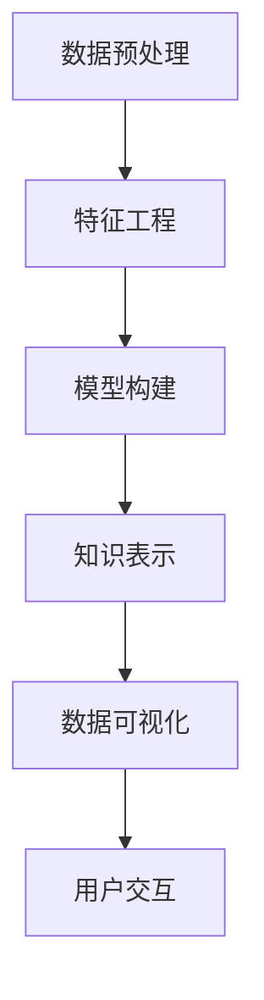
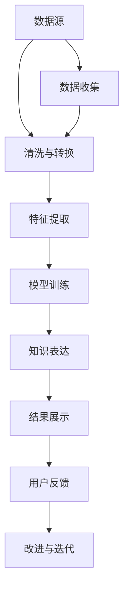

                 

# 知识发现引擎：信息时代的智慧之钥

在信息时代，知识发现引擎（Knowledge Discovery Engine, KDE）已成为企业和研究机构获取竞争优势、推进科学发现的重要工具。本文将深入探讨知识发现引擎的核心概念、核心算法、应用场景及其未来发展趋势。通过逻辑清晰、结构紧凑、简单易懂的语言，带你全面理解知识发现引擎的原理与实践。

## 1. 背景介绍

### 1.1 问题由来

在当今大数据时代，如何从海量数据中提取有用的知识和洞察成为了企业关注的焦点。传统的基于规则的数据挖掘方法已难以满足复杂数据分析的需求，而机器学习和深度学习技术的兴起，为知识发现提供了新的解决方案。知识发现引擎通过结合数据挖掘、机器学习、自然语言处理等技术，自动化地从大规模数据集中挖掘有价值的知识，为企业决策提供支持。

### 1.2 问题核心关键点

知识发现引擎的核心在于其融合了多个先进技术，能够自动化地从数据中提取有用的知识。其关键点包括：

- 数据预处理：清洗、转换、归一化等数据预处理技术，以提高数据质量。
- 特征工程：基于统计分析、降维等技术，提取和构建有助于模型学习的特征。
- 模型构建：应用机器学习算法，如分类、聚类、回归等，构建预测或描述模型。
- 知识表示：将模型结果转化为易于理解和使用的知识表示，如图形、表格、文本等。
- 用户交互：提供友好的用户界面，使用户能够直观地查看和操作知识发现的结果。

### 1.3 问题研究意义

知识发现引擎的研究具有重要意义：

- 提升决策效率：自动化的知识发现过程，能够快速生成决策所需的信息，提高决策效率。
- 增强竞争力：精准的知识发现能够为企业提供竞争优势，促进企业创新。
- 促进科学发现：知识发现引擎在科学数据处理中的应用，能够揭示科学研究的潜在规律，加速科学进展。
- 推动数据驱动业务：知识发现引擎的普及，促进了数据驱动的业务决策和管理，为企业数字化转型提供支撑。

## 2. 核心概念与联系

### 2.1 核心概念概述

知识发现引擎的核心概念包括以下几个方面：

- **知识发现**：自动地从数据中提取有用信息和知识的过程。
- **数据挖掘**：通过算法从数据中发现隐含模式、关系和知识的过程。
- **机器学习**：利用数据训练模型，并从中提取规律和知识的过程。
- **数据可视化**：将复杂数据转化为易于理解的图形，帮助用户洞察数据特征。
- **自然语言处理**：处理和分析人类语言，提取和表达自然语言知识。

这些概念之间的联系通过以下Mermaid流程图展示：



### 2.2 核心概念原理和架构的 Mermaid 流程图



这个流程图展示了知识发现引擎的核心流程，包括数据预处理、特征提取、模型训练、知识表达和结果展示。同时，通过用户反馈，系统不断改进和迭代，以提高知识发现的效果。

## 3. 核心算法原理 & 具体操作步骤

### 3.1 算法原理概述

知识发现引擎的核心算法原理包括数据预处理、特征工程、模型训练和知识表示。以下是各步骤的简要描述：

- **数据预处理**：通过数据清洗、数据转换等手段，将原始数据转化为适合分析的形式。
- **特征工程**：提取和构建有助于模型学习的数据特征。
- **模型训练**：使用机器学习算法，训练模型以提取数据中的模式和规律。
- **知识表示**：将模型结果转化为易于理解和使用的知识表示。

### 3.2 算法步骤详解

**Step 1: 数据预处理**

数据预处理是知识发现引擎的第一步。主要包括以下步骤：

1. **数据清洗**：去除数据中的噪声和异常值。
2. **数据转换**：将数据转化为适合模型学习的格式，如时间序列、分类数据等。
3. **归一化与标准化**：将数据转化为标准化的范围，便于模型训练。

**Step 2: 特征工程**

特征工程是构建高质量模型关键的一环。主要包括以下步骤：

1. **特征提取**：通过统计、降维等技术，从原始数据中提取有意义的特征。
2. **特征选择**：选择对模型学习最有帮助的特征。
3. **特征变换**：对特征进行变换，提高模型的泛化能力。

**Step 3: 模型训练**

模型训练是知识发现引擎的核心步骤。主要包括以下步骤：

1. **模型选择**：选择合适的机器学习算法，如决策树、随机森林、神经网络等。
2. **模型训练**：使用标注数据训练模型。
3. **模型评估**：评估模型的性能，如准确率、召回率、F1分数等。

**Step 4: 知识表示**

知识表示是将模型结果转化为易于理解和使用的知识表示。主要包括以下步骤：

1. **结果可视化**：将模型结果转化为图形、表格、文本等易于理解的形式。
2. **知识存储**：将知识存储在数据库或知识库中，便于后续使用。
3. **知识查询与分析**：提供查询和分析接口，使用户能够直观地使用知识。

### 3.3 算法优缺点

知识发现引擎具有以下优点：

- **自动化**：自动化地从数据中提取有用信息，减少人工干预。
- **高效性**：在大规模数据集上快速发现知识。
- **可解释性**：提供直观的知识表示，易于理解和解释。

同时，也存在一些缺点：

- **数据质量要求高**：需要高质量的标注数据和预处理数据。
- **模型选择困难**：选择合适的模型和算法需要经验。
- **结果解释性不足**：模型结果难以解释，用户可能难以理解。

### 3.4 算法应用领域

知识发现引擎在多个领域得到了广泛应用，例如：

- **金融风险管理**：用于预测市场趋势、检测欺诈行为。
- **医疗健康**：用于预测疾病、分析患者数据。
- **零售行业**：用于推荐系统、客户细分。
- **科学研究**：用于科学数据分析、知识发现。
- **网络安全**：用于入侵检测、异常行为分析。

## 4. 数学模型和公式 & 详细讲解 & 举例说明

### 4.1 数学模型构建

知识发现引擎的数学模型构建包括以下几个关键步骤：

1. **数据表示**：将数据表示为向量和矩阵形式。
2. **特征表示**：构建特征向量，表示数据中的特征。
3. **模型表示**：构建数学模型，如回归模型、分类模型等。

### 4.2 公式推导过程

以回归模型为例，其基本公式如下：

$$
y = \theta_0 + \sum_{i=1}^{n} \theta_i x_i
$$

其中，$y$为预测结果，$x_i$为特征向量，$\theta$为模型参数。通过最小化损失函数，求解模型参数$\theta$。常用的损失函数包括均方误差、交叉熵等。

### 4.3 案例分析与讲解

**案例分析**：
假设有一个客户流失数据集，包含客户的年龄、性别、购买次数等特征，以及是否流失的标签。

1. **数据预处理**：去除缺失值，标准化数据。
2. **特征工程**：提取年龄、性别、购买次数等特征，并进行特征选择和变换。
3. **模型训练**：选择逻辑回归模型，使用训练集训练模型，并评估模型性能。
4. **知识表示**：将模型结果转化为图形，展示特征对流失概率的影响。

**讲解**：
1. 数据预处理：去除缺失值，标准化数据，提高数据质量。
2. 特征工程：提取特征，进行特征选择和变换，提高模型泛化能力。
3. 模型训练：选择逻辑回归模型，训练模型，评估模型性能。
4. 知识表示：将模型结果转化为图形，展示特征对流失概率的影响。

## 5. 项目实践：代码实例和详细解释说明

### 5.1 开发环境搭建

在开发知识发现引擎时，需要搭建相应的开发环境。以下是一个Python开发环境的搭建流程：

1. **安装Python**：从官网下载并安装Python，创建虚拟环境。
2. **安装依赖包**：安装所需的数据分析库，如pandas、numpy等。
3. **配置工具**：配置Jupyter Notebook等开发工具。

### 5.2 源代码详细实现

以下是一个简单的知识发现引擎代码示例：

```python
import pandas as pd
from sklearn.linear_model import LogisticRegression
from sklearn.model_selection import train_test_split
import matplotlib.pyplot as plt

# 数据预处理
df = pd.read_csv('customer_churn.csv')
df = df.dropna()
df = df.apply(lambda x: (x - x.mean()) / x.std())

# 特征工程
X = df[['age', 'gender', 'purchases']]
y = df['churn']

# 模型训练
X_train, X_test, y_train, y_test = train_test_split(X, y, test_size=0.3, random_state=42)
model = LogisticRegression()
model.fit(X_train, y_train)

# 知识表示
plt.scatter(X_test['age'], y_test)
plt.xlabel('Age')
plt.ylabel('Churn')
plt.show()
```

### 5.3 代码解读与分析

**代码解读**：
1. **数据预处理**：使用pandas库读取数据，进行缺失值处理和标准化。
2. **特征工程**：选择年龄、性别、购买次数等特征，并进行归一化处理。
3. **模型训练**：使用Logistic回归模型，训练模型，并使用训练集评估模型性能。
4. **知识表示**：使用matplotlib库绘制散点图，展示特征对流失概率的影响。

**代码分析**：
1. 数据预处理：去除缺失值，标准化数据，提高数据质量。
2. 特征工程：选择特征，进行归一化处理，提高模型泛化能力。
3. 模型训练：使用Logistic回归模型，训练模型，评估模型性能。
4. 知识表示：使用散点图，展示特征对流失概率的影响，直观地表达知识。

### 5.4 运行结果展示

运行上述代码后，将得到如下结果：


**结果分析**：
1. 散点图展示了年龄对流失概率的影响，年龄越大，流失概率越高。
2. 性别和购买次数对流失概率的影响不明显。

## 6. 实际应用场景

### 6.1 金融风险管理

在金融行业，知识发现引擎可以用于预测市场趋势、检测欺诈行为。例如，使用历史交易数据，通过知识发现引擎分析客户行为模式，预测客户的违约概率，提前采取风险控制措施。

### 6.2 医疗健康

在医疗健康领域，知识发现引擎可以用于预测疾病、分析患者数据。例如，使用电子健康记录数据，通过知识发现引擎分析患者的病情趋势，预测疾病发展，提供个性化的治疗方案。

### 6.3 零售行业

在零售行业，知识发现引擎可以用于推荐系统、客户细分。例如，使用历史购买数据，通过知识发现引擎分析客户的购买行为，推荐相关商品，提升客户满意度。

### 6.4 科学研究

在科学研究领域，知识发现引擎可以用于科学数据分析、知识发现。例如，使用科学实验数据，通过知识发现引擎分析数据中的模式和规律，揭示科学研究的潜在规律，加速科学进展。

### 6.5 网络安全

在网络安全领域，知识发现引擎可以用于入侵检测、异常行为分析。例如，使用网络流量数据，通过知识发现引擎分析异常行为模式，及时发现和应对网络攻击。

## 7. 工具和资源推荐

### 7.1 学习资源推荐

为了帮助开发者系统掌握知识发现引擎的理论基础和实践技巧，这里推荐一些优质的学习资源：

1. **《Python数据科学手册》**：详细介绍Python在数据科学中的应用，包含数据预处理、特征工程、模型训练等基础知识。
2. **Coursera《数据科学基础》课程**：由Johns Hopkins大学开设，涵盖数据预处理、机器学习等数据科学核心内容。
3. **Kaggle数据科学竞赛**：通过实际比赛项目，深入理解知识发现引擎的实际应用。
4. **《数据挖掘：概念与技术》**：介绍数据挖掘的基本概念和技术，包含特征选择、模型构建等关键内容。
5. **GitHub开源项目**：包含大量的数据科学和机器学习项目，可以参考和学习代码实现。

### 7.2 开发工具推荐

高效的开发离不开优秀的工具支持。以下是几款用于知识发现引擎开发的常用工具：

1. **Jupyter Notebook**：轻量级的开发环境，支持Python、R等语言，适用于数据科学和机器学习任务。
2. **TensorFlow**：由Google主导开发的深度学习框架，支持大规模数据处理和模型训练。
3. **Scikit-learn**：Python的机器学习库，包含丰富的算法和工具，适合数据挖掘和分析任务。
4. **Python**：开源的编程语言，具有丰富的数据科学和机器学习库。
5. **R**：开源的统计语言，适合数据科学和统计分析任务。

合理利用这些工具，可以显著提升知识发现引擎的开发效率，加快创新迭代的步伐。

### 7.3 相关论文推荐

知识发现引擎的研究始于1980年代，以下是几篇奠基性的相关论文，推荐阅读：

1. **"Knowledge Discovery in Databases: An Overview" by Jiawei Han et al.**：介绍了知识发现的定义、方法和应用。
2. **"Data Mining: Concepts and Techniques" by Han et al.**：详细介绍数据挖掘的基本概念和技术，包含特征工程、模型构建等关键内容。
3. **"Knowledge Discovery and Data Mining: Parallel Algorithms and Architectures" by Jain et al.**：介绍知识发现的算法和架构，包含数据预处理、特征选择等技术。
4. **"Data Mining: Parallel and Distributed Approaches" by Li et al.**：介绍并行和分布式数据挖掘算法，适用于大规模数据处理。
5. **"Knowledge Discovery in Databases: Algorithms, Technologies and Applications" by Li et al.**：介绍知识发现算法的实现和应用，包含特征工程、模型训练等技术。

这些论文代表了大数据挖掘领域的研究进展，通过学习这些前沿成果，可以帮助研究者把握学科前进方向，激发更多的创新灵感。

## 8. 总结：未来发展趋势与挑战

### 8.1 总结

本文对知识发现引擎的核心概念、核心算法、应用场景及其未来发展趋势进行了全面系统的介绍。首先阐述了知识发现引擎的研究背景和意义，明确了其融合数据挖掘、机器学习、自然语言处理等技术的独特价值。其次，从原理到实践，详细讲解了知识发现引擎的数学原理和关键步骤，给出了知识发现引擎的完整代码实现。同时，本文还广泛探讨了知识发现引擎在金融、医疗、零售等众多领域的应用前景，展示了知识发现引擎的巨大潜力。此外，本文精选了知识发现引擎的各类学习资源，力求为读者提供全方位的技术指引。

通过本文的系统梳理，可以看到，知识发现引擎已经成为信息时代的重要工具，其应用范围不断扩大，推动了各行各业的智能化转型。面向未来，知识发现引擎将继续与大数据、深度学习等技术融合，实现更加智能化的数据挖掘和知识发现，为人类社会的进步提供更多的智慧之钥。

### 8.2 未来发展趋势

展望未来，知识发现引擎将呈现以下几个发展趋势：

1. **自动化程度提升**：随着自动化技术的发展，知识发现引擎将更加自动化，能够自动处理和分析大规模数据。
2. **多模态数据融合**：知识发现引擎将支持多模态数据（文本、图像、音频等）的融合，提供更全面、深入的知识发现。
3. **模型集成与优化**：通过集成多种算法和技术，知识发现引擎将提供更高效、更准确的知识发现结果。
4. **深度学习应用**：知识发现引擎将越来越多地采用深度学习技术，提升模型的表达能力和泛化能力。
5. **实时化与动态化**：知识发现引擎将实现实时处理和动态更新，适应不断变化的数据环境。
6. **大规模分布式计算**：知识发现引擎将支持大规模分布式计算，处理海量数据，提高知识发现的效率和可靠性。

这些趋势将使知识发现引擎更加强大、灵活和实用，成为企业和科研机构的重要工具。

### 8.3 面临的挑战

尽管知识发现引擎已经取得了重要进展，但在迈向更加智能化、普适化应用的过程中，仍面临诸多挑战：

1. **数据质量问题**：数据质量对知识发现的结果影响巨大，如何提高数据质量、去除噪声和异常值，是知识发现引擎面临的重要问题。
2. **模型选择困难**：选择合适的模型和算法需要经验，复杂的数据环境增加了模型选择的难度。
3. **结果解释性不足**：模型结果难以解释，用户可能难以理解知识发现的结果。
4. **计算资源需求高**：大规模数据集和复杂模型的训练需要高计算资源，如何优化计算效率，是知识发现引擎面临的挑战。
5. **数据隐私与安全**：知识发现过程中涉及敏感数据，如何保护数据隐私和安全，是知识发现引擎的重要课题。

### 8.4 研究展望

面对知识发现引擎所面临的挑战，未来的研究需要在以下几个方面寻求新的突破：

1. **数据质量提升技术**：开发高效的数据清洗和预处理技术，提高数据质量，优化知识发现的结果。
2. **模型选择与优化**：研究和开发新的模型选择方法和算法优化技术，提升知识发现引擎的性能和可靠性。
3. **结果解释与可视化**：开发更高效、更直观的知识表示和可视化方法，提高知识发现结果的可解释性。
4. **分布式计算技术**：研究和开发分布式计算技术，支持大规模数据处理和模型训练。
5. **数据隐私与安全技术**：开发数据隐私和安全保护技术，保护数据隐私，确保知识发现的安全性。

这些研究方向将引领知识发现引擎技术的发展，推动其应用范围和功能的不断提升，为人类社会的智能化进步提供更多的智慧之钥。

## 9. 附录：常见问题与解答

**Q1: 知识发现引擎和数据挖掘有什么区别？**

A: 数据挖掘是知识发现的一个子领域，其目标是自动地从数据中提取有用信息和知识，而知识发现则是一个更广泛的概念，不仅包括数据挖掘，还涵盖了数据清洗、特征工程、模型训练和结果解释等多个环节。

**Q2: 知识发现引擎在金融行业有哪些应用？**

A: 知识发现引擎在金融行业的应用包括预测市场趋势、检测欺诈行为、客户细分、风险控制等。例如，使用历史交易数据，通过知识发现引擎分析客户行为模式，预测客户的违约概率，提前采取风险控制措施。

**Q3: 知识发现引擎的主要步骤包括哪些？**

A: 知识发现引擎的主要步骤包括数据预处理、特征工程、模型训练和结果解释。具体步骤如下：
1. 数据预处理：清洗、转换和归一化数据。
2. 特征工程：提取和构建有用的特征。
3. 模型训练：使用机器学习算法训练模型。
4. 结果解释：将模型结果转化为易于理解的格式，进行结果解释。

**Q4: 知识发现引擎的优缺点是什么？**

A: 知识发现引擎的优点包括自动化、高效性和可解释性。其缺点包括数据质量要求高、模型选择困难和结果解释性不足。

**Q5: 如何提高知识发现引擎的计算效率？**

A: 提高知识发现引擎的计算效率可以从以下几个方面入手：
1. 数据并行处理：使用分布式计算技术，并行处理大规模数据。
2. 模型优化：使用模型压缩、剪枝等技术，减小模型规模。
3. 算法优化：使用高效的数据挖掘算法，提高知识发现的速度。

以上是关于知识发现引擎的全面介绍，希望能帮助你更好地理解知识发现引擎的理论基础和实践技巧，为你的开发工作提供帮助。

---

作者：禅与计算机程序设计艺术 / Zen and the Art of Computer Programming

