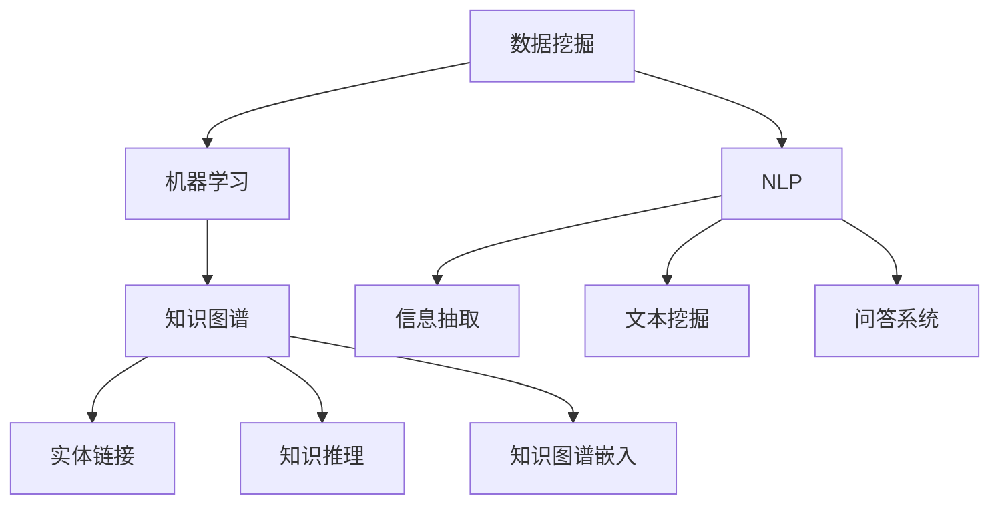

                 

# 知识发现引擎：开启人类知识新时代

## 1. 背景介绍

### 1.1 问题由来
随着大数据和人工智能技术的飞速发展，人类知识体量的积累和知识组织方式的革新，正在引发一场前所未有的知识革命。我们面临的不仅是信息量的爆炸式增长，还有如何有效组织、提炼、应用这些知识，以加速科学探索、技术创新、商业决策等各个领域的发展。传统的知识管理方式，如目录、词典、百科全书等，已无法适应当前的信息挑战。知识发现引擎（Knowledge Discovery Engine, KDE）应运而生，借助智能算法，自动挖掘、分析、总结海量数据中的知识，辅助人类全面、准确地理解世界。

### 1.2 问题核心关键点
知识发现引擎的核心在于利用数据挖掘、机器学习、自然语言处理等技术，从大规模数据中提取、分析和提炼知识。其关键点包括：
- **数据驱动**：以海量数据为驱动，自动发现知识规律。
- **智能学习**：利用机器学习算法，不断优化知识发现过程。
- **语言理解**：通过自然语言处理技术，提升对文本数据的处理能力。
- **跨领域应用**：在科学、工程、金融、医疗等多个领域有广泛应用。

## 2. 核心概念与联系

### 2.1 核心概念概述
知识发现引擎涉及多个核心概念，包括数据挖掘、机器学习、自然语言处理、知识图谱等。这些概念相互关联，共同构成知识发现的技术体系。

- **数据挖掘（Data Mining）**：从数据中提取有用信息的过程，涉及聚类、分类、关联规则等。
- **机器学习（Machine Learning）**：使计算机通过学习数据，自动提升性能和泛化能力。
- **自然语言处理（NLP）**：使计算机能够理解和处理自然语言文本，涉及文本挖掘、信息抽取、问答系统等。
- **知识图谱（Knowledge Graph）**：将知识表示为节点和边构成的图形结构，用于表示实体之间的关系。

这些核心概念之间的逻辑关系可以通过以下Mermaid流程图来展示：



这个流程图展示了数据挖掘、机器学习、自然语言处理、知识图谱之间的联系：

1. 数据挖掘是知识发现的基础，通过聚类、分类等技术，为机器学习提供数据准备。
2. 机器学习利用数据挖掘结果，自动学习和优化知识发现算法。
3. NLP技术通过解析文本数据，提升对信息的理解能力。
4. 知识图谱用于组织和表示知识，方便查询和推理。

## 3. 核心算法原理 & 具体操作步骤
### 3.1 算法原理概述
知识发现引擎的算法原理主要涉及以下几个方面：

- **数据预处理**：清洗、归一化、特征提取等，为后续分析提供高质量的数据输入。
- **特征选择**：从原始数据中选择最具代表性的特征，提升算法效率和效果。
- **模型训练**：利用机器学习算法，对数据进行建模和预测，发现数据中的规律。
- **文本分析**：利用NLP技术，提取文本中的实体、关系、情感等关键信息。
- **知识图谱构建**：将文本分析结果转化为知识图谱，形成结构化的知识表示。

### 3.2 算法步骤详解

**Step 1: 数据收集与预处理**

- 收集相关领域的数据，包括文本、图片、音频等，并进行预处理，如去除噪声、归一化处理等。
- 使用数据清洗技术，去除重复、缺失、错误的数据。
- 进行特征提取，将原始数据转换为可用于模型训练的形式。

**Step 2: 特征选择与模型训练**

- 使用特征选择算法（如主成分分析、信息增益等），选择对知识发现最有贡献的特征。
- 选择适合的机器学习算法（如决策树、随机森林、神经网络等），并利用数据集训练模型。
- 评估模型性能，选择最优模型进行后续步骤。

**Step 3: 文本分析与知识抽取**

- 利用NLP技术，进行分词、词性标注、命名实体识别等文本预处理。
- 利用信息抽取技术，从文本中提取出实体、关系、属性等关键信息。
- 利用情感分析技术，判断文本的情感倾向。

**Step 4: 知识图谱构建与推理**

- 将抽取的实体和关系转换为知识图谱中的节点和边。
- 利用知识图谱嵌入技术，将知识图谱中的节点映射为低维向量空间，方便计算和推理。
- 利用知识图谱推理算法，挖掘实体之间的关系和规律，形成知识网络。

**Step 5: 知识发现与应用**

- 基于知识图谱，构建知识查询系统，支持基于事实的问答、推荐等应用。
- 将知识图谱与搜索引擎、推荐系统等结合，形成智能应用。
- 不断更新和优化知识图谱，保持知识的实时性和准确性。

### 3.3 算法优缺点

知识发现引擎的主要优点包括：
- **自动性**：无需人工干预，自动发现数据中的知识。
- **高效性**：利用机器学习算法，高效处理大规模数据。
- **准确性**：通过多种技术结合，准确提取和表示知识。

然而，知识发现引擎也存在一些局限性：
- **数据依赖**：需要大量高质量的数据作为输入，数据质量直接影响结果。
- **技术门槛高**：涉及多种技术，需要跨领域的知识和技能。
- **模型复杂**：构建复杂知识图谱，需要强大的计算能力和存储资源。
- **解释性差**：算法过程复杂，难以解释和调试。

尽管存在这些局限性，知识发现引擎仍然是当前最前沿、最有效的知识获取和组织方式之一。未来相关研究将继续优化算法和技术，降低使用门槛，提升应用效果。

### 3.4 算法应用领域

知识发现引擎在多个领域有广泛应用，包括但不限于：

- **科学研究**：自动挖掘科学论文中的知识，辅助科研选题和论文写作。
- **工程设计**：提取设计文档中的信息，优化设计方案。
- **金融风控**：自动分析金融数据，预测市场走势，防范风险。
- **医疗诊断**：分析医疗记录，辅助疾病诊断和诊疗。
- **教育辅助**：通过分析教材和考试数据，发现知识结构和难点，辅助教学。
- **舆情分析**：分析社交媒体数据，挖掘舆情变化趋势。
- **企业决策**：利用知识图谱，辅助企业制定战略和决策。

## 4. 数学模型和公式 & 详细讲解 & 举例说明

### 4.1 数学模型构建

知识发现引擎的数学模型通常包括数据预处理、特征选择、模型训练、文本分析、知识图谱构建等多个环节。以下以文本分类任务为例，详细讲解其数学模型构建过程。

**Step 1: 数据预处理**

- **归一化处理**：将文本中的数字、日期等转换为标准格式，如将“10:30am”转换为“10:30”。
- **分词处理**：将文本分词，去除停用词，如“的”、“了”等。
- **向量化**：使用词袋模型或TF-IDF等方法，将文本转换为向量形式。

**Step 2: 特征选择**

- **信息增益**：计算每个特征的信息增益，选择增益最大的特征。
- **卡方检验**：计算特征与类别之间的卡方值，选择卡方值大的特征。
- **相关系数**：计算特征与目标变量之间的相关系数，选择相关性高的特征。

**Step 3: 模型训练**

- **决策树**：构建决策树模型，进行特征选择和分类。
- **随机森林**：集成多个决策树，提升分类效果。
- **神经网络**：使用多层感知机（MLP）、卷积神经网络（CNN）等进行文本分类。

**Step 4: 文本分析**

- **命名实体识别**：使用条件随机场（CRF）、最大熵模型等方法，从文本中识别出实体。
- **关系抽取**：使用基于规则或机器学习的方法，从文本中抽取实体之间的关系。
- **情感分析**：使用情感词典、情感分类器等方法，分析文本的情感倾向。

**Step 5: 知识图谱构建**

- **实体抽取**：从文本中抽取实体，如人名、地名、机构名等。
- **关系抽取**：从文本中抽取实体之间的关系，如“张三在李四的公司工作”。
- **知识嵌入**：使用Word2Vec、GloVe等方法，将实体映射为低维向量。
- **知识推理**：利用规则和算法，推理出实体之间的关系和规律。

### 4.2 公式推导过程

以下以文本分类任务为例，推导基于决策树模型的知识发现引擎的数学模型：

**Step 1: 数据预处理**

- **归一化处理**：将时间戳 $t$ 转换为 $t'$，$t'=(t-\mu)/\sigma$，其中 $\mu$ 为均值，$\sigma$ 为标准差。
- **分词处理**：将文本 $T$ 分解为词序列 $T_1, T_2, ..., T_n$。
- **向量化**：将词序列 $T$ 转换为向量 $V$，$V_i=\text{TF-IDF}(T_i)$，其中 $TF$ 为词频，$IDF$ 为逆文档频率。

**Step 2: 特征选择**

- **信息增益**：计算每个特征的信息增益 $IG(X,Y)=\sum_i p(y_i) IG(V_i|Y)$，选择增益最大的特征 $X$。
- **卡方检验**：计算 $X$ 和 $Y$ 之间的卡方值 $C(X,Y)=\sum_i \frac{(O_i - E_i)^2}{E_i}$，选择卡方值大的特征。
- **相关系数**：计算 $X$ 和 $Y$ 之间的相关系数 $C(X,Y)=\frac{\sum_i (V_i-E_i)(Y_i-E_Y)}{\sqrt{\sum_i (V_i-E_i)^2 \sum_i (Y_i-E_Y)^2}}$，选择相关性高的特征。

**Step 3: 模型训练**

- **决策树**：构建决策树模型，计算每个节点的信息增益，选择最优节点 $X$。
- **随机森林**：集成多个决策树，使用平均分类误差最小化原则，选择最优分类器。
- **神经网络**：使用多层感知机（MLP），$H(z)=\sigma(W_1z+b_1)$，其中 $\sigma$ 为激活函数，$W_1$ 为权重，$b_1$ 为偏置。

**Step 4: 文本分析**

- **命名实体识别**：使用条件随机场（CRF）模型，$P(Y|X)=\frac{P(X|Y)P(Y)}{P(X)}$，其中 $P(X|Y)$ 为条件概率，$P(Y)$ 为先验概率。
- **关系抽取**：使用最大熵模型，$P(Y|X)=\frac{P(X|Y)}{P(X)}$，其中 $P(X|Y)$ 为条件概率，$P(X)$ 为证据概率。
- **情感分析**：使用情感词典，$P(Y|X)=\frac{P(X|Y)P(Y)}{P(X)}$，其中 $P(X|Y)$ 为条件概率，$P(Y)$ 为先验概率。

**Step 5: 知识图谱构建**

- **实体抽取**：使用正则表达式匹配，$E=T_i=\{t_1, t_2, ..., t_n\}$，其中 $T_i$ 为文本中的实体，$t_i$ 为实体中的单词。
- **关系抽取**：使用基于规则的方法，$R=T_i=\{t_1, t_2, ..., t_n\}$，其中 $T_i$ 为文本中的关系，$t_i$ 为关系中的单词。
- **知识嵌入**：使用Word2Vec模型，$E'=V_i=\text{Word2Vec}(T_i)$，其中 $E'$ 为实体的低维向量表示，$V_i$ 为向量化后的词向量。
- **知识推理**：使用规则和算法，$K=E'+R'$，其中 $K$ 为知识图谱中的节点，$R'$ 为关系图谱中的边。

### 4.3 案例分析与讲解

**案例：金融风控中的知识发现引擎**

在金融风控领域，知识发现引擎被广泛应用于信用评分、欺诈检测、市场分析等任务。以欺诈检测为例，其具体实现流程如下：

1. **数据预处理**：收集用户历史交易数据，进行数据清洗、归一化处理，并将数据转换为文本形式。
2. **特征选择**：选择对欺诈检测最有贡献的特征，如交易金额、交易时间、交易地点等。
3. **模型训练**：使用随机森林算法，对交易数据进行分类，构建欺诈检测模型。
4. **文本分析**：从用户评论、聊天记录中抽取实体、关系、情感等关键信息。
5. **知识图谱构建**：将抽取的实体和关系转换为知识图谱，形成用户交易行为的网络图谱。
6. **知识推理**：利用知识图谱推理算法，挖掘用户行为模式，预测潜在的欺诈行为。

通过知识发现引擎，金融机构可以在大规模数据中自动发现欺诈特征，提升欺诈检测的准确性和效率。

## 5. 项目实践：代码实例和详细解释说明

### 5.1 开发环境搭建

在进行知识发现引擎的开发实践前，需要准备好开发环境。以下是使用Python进行TensorFlow和Scikit-learn开发的环境配置流程：

1. 安装Anaconda：从官网下载并安装Anaconda，用于创建独立的Python环境。
2. 创建并激活虚拟环境：
```bash
conda create -n tensorflow-env python=3.8 
conda activate tensorflow-env
```
3. 安装TensorFlow：根据CUDA版本，从官网获取对应的安装命令。例如：
```bash
conda install tensorflow -c conda-forge
```
4. 安装Scikit-learn：
```bash
pip install scikit-learn
```
5. 安装各类工具包：
```bash
pip install numpy pandas matplotlib tqdm jupyter notebook ipython
```
完成上述步骤后，即可在`tensorflow-env`环境中开始知识发现引擎的开发实践。

### 5.2 源代码详细实现

这里我们以金融风控领域的欺诈检测为例，给出使用TensorFlow和Scikit-learn进行知识发现引擎的PyTorch代码实现。

首先，定义数据处理函数：

```python
import pandas as pd
from sklearn.preprocessing import StandardScaler
from sklearn.feature_selection import SelectKBest, mutual_info_classif
from sklearn.ensemble import RandomForestClassifier

def preprocess_data(train_data, test_data):
    # 数据预处理
    train_data = train_data.dropna()
    test_data = test_data.dropna()
    
    # 特征选择
    features = train_data.columns
    target = 'fraud'
    
    # 标准化处理
    scaler = StandardScaler()
    train_data[features] = scaler.fit_transform(train_data[features])
    test_data[features] = scaler.transform(test_data[features])
    
    # 特征选择
    selector = SelectKBest(score_func=mutual_info_classif, k=10)
    train_data_selected = selector.fit_transform(train_data[features], train_data[target])
    test_data_selected = selector.transform(test_data[features])
    
    return train_data_selected, test_data_selected
```

然后，定义模型训练函数：

```python
def train_model(train_data, test_data):
    # 模型训练
    features = train_data.columns
    target = 'fraud'
    
    # 特征选择
    selector = SelectKBest(score_func=mutual_info_classif, k=10)
    train_data_selected = selector.fit_transform(train_data[features], train_data[target])
    test_data_selected = selector.transform(test_data[features])
    
    # 模型训练
    clf = RandomForestClassifier(n_estimators=100, max_depth=5, random_state=42)
    clf.fit(train_data_selected, train_data[target])
    
    # 模型评估
    accuracy = clf.score(test_data_selected, test_data[target])
    print(f'Accuracy: {accuracy:.3f}')
    return clf
```

最后，启动训练流程并在测试集上评估：

```python
# 数据准备
train_data = pd.read_csv('train_data.csv')
test_data = pd.read_csv('test_data.csv')

# 数据预处理
train_data_selected, test_data_selected = preprocess_data(train_data, test_data)

# 模型训练
clf = train_model(train_data_selected, test_data_selected)

# 测试集评估
accuracy = clf.score(test_data_selected, test_data[target])
print(f'Accuracy: {accuracy:.3f}')
```

以上就是使用TensorFlow和Scikit-learn对金融风控领域的欺诈检测任务进行知识发现引擎的完整代码实现。可以看到，TensorFlow和Scikit-learn的结合，使得知识发现引擎的代码实现变得简洁高效。

### 5.3 代码解读与分析

让我们再详细解读一下关键代码的实现细节：

**preprocess_data函数**：
- 对数据进行清洗、归一化处理，并使用信息增益方法进行特征选择。
- 对特征进行标准化处理，防止数据偏移对模型训练的影响。
- 使用信息增益方法选择对分类最有贡献的特征。

**train_model函数**：
- 使用随机森林算法，对数据进行分类，构建欺诈检测模型。
- 使用特征选择方法，选择对分类最有贡献的特征。
- 评估模型的准确率，输出结果。

**数据预处理**：
- 使用Pandas库，读取和处理CSV文件。
- 使用Scikit-learn库，进行数据预处理和特征选择。
- 使用TensorFlow库，构建和训练模型。

## 6. 实际应用场景

### 6.1 智能搜索

知识发现引擎可以应用于智能搜索系统中，通过分析用户查询和网页内容，自动推荐最相关的网页。例如，使用知识图谱嵌入技术，将查询词和网页内容映射为低维向量，通过余弦相似度计算匹配度，推荐最相关的网页。

### 6.2 智能推荐

在电商和社交媒体中，知识发现引擎可以用于推荐系统，自动分析用户行为和偏好，推荐个性化的商品、内容、新闻等。例如，利用知识图谱推理算法，从用户历史数据中提取行为模式，预测用户感兴趣的商品，实现个性化推荐。

### 6.3 智能客服

智能客服系统可以通过知识发现引擎，自动分析用户咨询的历史记录，构建知识图谱，实现自动化的问答和问题解答。例如，使用实体抽取和关系抽取技术，从聊天记录中提取关键信息，构建知识图谱，辅助客服系统自动回答用户问题。

### 6.4 未来应用展望

随着知识发现引擎技术的不断进步，其在各领域的落地应用将更加广泛，带来新的创新和突破。

- **科学研究**：自动分析学术论文，发现研究趋势和热点，辅助科研选题和论文写作。
- **工程设计**：分析设计文档，提取关键信息，优化设计方案。
- **金融风控**：自动化分析金融数据，预测市场走势，防范风险。
- **医疗诊断**：分析医疗记录，辅助疾病诊断和诊疗。
- **教育辅助**：分析教材和考试数据，发现知识结构和难点，辅助教学。
- **舆情分析**：分析社交媒体数据，挖掘舆情变化趋势。
- **企业决策**：利用知识图谱，辅助企业制定战略和决策。

## 7. 工具和资源推荐

### 7.1 学习资源推荐

为了帮助开发者系统掌握知识发现引擎的理论基础和实践技巧，这里推荐一些优质的学习资源：

1. 《深度学习》系列博文：由大模型技术专家撰写，深入浅出地介绍了深度学习的基本概念和前沿技术。
2. 斯坦福大学《深度学习》课程：涵盖深度学习的基础理论和实践应用，适合入门学习。
3. 《Knowledge Discovery and Data Mining》书籍：涵盖知识发现的基本概念和算法，适合进阶学习。
4. Coursera《Data Science》课程：涵盖数据科学的基本概念和实践应用，适合多领域知识学习。
5. Kaggle竞赛平台：提供大量数据集和竞赛项目，适合实践和提升技能。

通过对这些资源的学习实践，相信你一定能够快速掌握知识发现引擎的精髓，并用于解决实际的NLP问题。

### 7.2 开发工具推荐

高效的开发离不开优秀的工具支持。以下是几款用于知识发现引擎开发的常用工具：

1. TensorFlow：基于Python的开源深度学习框架，灵活动态的计算图，适合快速迭代研究。
2. Scikit-learn：Python的科学计算库，提供多种机器学习算法和工具。
3. PyTorch：基于Python的开源深度学习框架，动态计算图，适合研究和部署。
4. Jupyter Notebook：交互式编程环境，支持Python和R等多种编程语言。
5. Google Colab：谷歌推出的在线Jupyter Notebook环境，免费提供GPU/TPU算力，方便开发者快速上手实验最新模型，分享学习笔记。

合理利用这些工具，可以显著提升知识发现引擎的开发效率，加快创新迭代的步伐。

### 7.3 相关论文推荐

知识发现引擎的研究源于学界的持续研究。以下是几篇奠基性的相关论文，推荐阅读：

1. 《Knowledge Discovery in Databases》书籍：介绍了知识发现的基本概念和算法，涵盖了各种经典方法。
2. 《Information Retrieval》书籍：介绍了信息检索的基本概念和技术，适合了解知识发现的基础。
3. 《Semantic Web Technologies》书籍：介绍了语义网的基本概念和技术，适合了解知识图谱的基础。
4. 《Machine Learning Yearning》书籍：介绍了机器学习的基本概念和实践应用，适合了解知识发现的基础。
5. 《Neural Network and Deep Learning》书籍：介绍了深度学习的基本概念和技术，适合了解知识发现的基础。

这些论文代表了大语言模型微调技术的发展脉络。通过学习这些前沿成果，可以帮助研究者把握学科前进方向，激发更多的创新灵感。

## 8. 总结：未来发展趋势与挑战

### 8.1 总结

本文对知识发现引擎进行了全面系统的介绍。首先阐述了知识发现引擎的背景和重要性，明确了其在数据驱动、智能学习、语言理解、跨领域应用等方面的核心价值。其次，从原理到实践，详细讲解了知识发现引擎的数学模型构建和算法步骤，给出了知识发现引擎任务开发的完整代码实例。同时，本文还广泛探讨了知识发现引擎在智能搜索、智能推荐、智能客服等多个领域的应用前景，展示了其在实际应用中的巨大潜力。

通过对本文的系统梳理，可以看到，知识发现引擎正在成为当前最前沿、最有效的知识获取和组织方式之一。它在科学研究、工程设计、金融风控、医疗诊断等多个领域展现了广泛的应用前景，显著提升了数据处理和知识提取的效率和准确性。未来，伴随知识发现引擎技术的不断演进，其在各领域的落地应用将更加广泛，为人类认知智能的进化带来深远影响。

### 8.2 未来发展趋势

展望未来，知识发现引擎将呈现以下几个发展趋势：

1. **数据融合**：将多源异构数据进行融合，提升知识发现的效果和准确性。
2. **模型集成**：集成多种机器学习模型，提升知识发现的泛化能力和鲁棒性。
3. **跨模态融合**：将文本、图像、音频等多模态数据进行融合，提升知识发现的全面性。
4. **交互式学习**：利用交互式学习技术，提升知识发现的效率和效果。
5. **联邦学习**：利用联邦学习技术，保护数据隐私，提升知识发现的可信度。
6. **元学习**：利用元学习技术，提升知识发现的迁移能力和适应性。

这些趋势凸显了知识发现引擎技术的广阔前景。这些方向的探索发展，必将进一步提升知识发现引擎的性能和应用效果，为人工智能技术在各领域的落地应用提供新的支持。

### 8.3 面临的挑战

尽管知识发现引擎技术已经取得了瞩目成就，但在迈向更加智能化、普适化应用的过程中，它仍面临着诸多挑战：

1. **数据质量**：知识发现引擎的性能高度依赖数据质量，低质量的数据可能导致错误的结果。
2. **算法复杂**：知识发现引擎涉及多种算法和技术，算法复杂度较高，难以调试和优化。
3. **计算资源**：知识发现引擎涉及大规模数据处理和模型训练，需要大量的计算资源。
4. **知识表示**：知识图谱等知识表示方式复杂，难以构建和维护。
5. **解释性差**：知识发现引擎的算法过程复杂，难以解释和调试。
6. **跨领域应用**：不同领域的知识发现需求不同，难以统一建模和分析。

尽管存在这些挑战，知识发现引擎技术的未来发展依然值得期待。相信随着学界和产业界的共同努力，这些挑战终将一一克服，知识发现引擎必将在构建人机协同的智能系统中扮演越来越重要的角色。

### 8.4 研究展望

面对知识发现引擎所面临的种种挑战，未来的研究需要在以下几个方面寻求新的突破：

1. **数据治理**：建立数据治理机制，提升数据质量，减少数据噪声和偏差。
2. **算法优化**：开发更高效的算法和技术，提升知识发现的效率和效果。
3. **模型压缩**：采用模型压缩技术，减小知识图谱的规模和复杂度。
4. **知识共享**：建立知识共享平台，促进不同领域之间的知识交流和协作。
5. **跨模态融合**：开发跨模态融合技术，提升知识发现的全面性和鲁棒性。
6. **元学习**：利用元学习技术，提升知识发现的迁移能力和适应性。

这些研究方向的探索，必将引领知识发现引擎技术迈向更高的台阶，为构建安全、可靠、可解释、可控的智能系统铺平道路。面向未来，知识发现引擎技术还需要与其他人工智能技术进行更深入的融合，如知识表示、因果推理、强化学习等，多路径协同发力，共同推动自然语言理解和智能交互系统的进步。只有勇于创新、敢于突破，才能不断拓展知识发现引擎的边界，让智能技术更好地造福人类社会。

## 9. 附录：常见问题与解答

**Q1: 知识发现引擎的原理是什么？**

A: 知识发现引擎的原理主要包括数据预处理、特征选择、模型训练、文本分析、知识图谱构建等多个环节。其中，数据预处理和特征选择用于提升数据质量，模型训练用于发现数据中的规律，文本分析用于理解文本信息，知识图谱构建用于组织和表示知识。

**Q2: 知识发现引擎有哪些应用场景？**

A: 知识发现引擎在多个领域有广泛应用，包括科学研究、工程设计、金融风控、医疗诊断、教育辅助、舆情分析、企业决策等。例如，在金融风控领域，知识发现引擎可以用于欺诈检测、信用评分等任务；在医疗诊断领域，可以用于辅助疾病诊断和诊疗；在教育辅助领域，可以用于分析教材和考试数据，发现知识结构和难点，辅助教学。

**Q3: 如何构建知识图谱？**

A: 知识图谱的构建包括实体抽取、关系抽取、知识嵌入等步骤。首先，从文本中抽取实体和关系，然后利用Word2Vec等技术将实体映射为低维向量，最后利用规则和算法构建知识图谱。例如，可以使用条件随机场（CRF）模型从文本中识别实体，使用最大熵模型抽取实体之间的关系，使用Word2Vec模型将实体映射为低维向量，使用规则和算法构建知识图谱。

**Q4: 如何优化知识发现引擎的性能？**

A: 知识发现引擎的性能优化可以从多个方面进行，包括数据预处理、特征选择、模型训练、算法优化等。例如，可以使用归一化处理、标准化处理等方法提升数据质量；使用特征选择算法选择对分类最有贡献的特征；使用随机森林、神经网络等算法进行模型训练；使用梯度下降等优化算法优化模型性能。

**Q5: 知识发现引擎的局限性有哪些？**

A: 知识发现引擎的局限性包括数据依赖、技术门槛高、计算资源需求大、模型复杂、解释性差、跨领域应用复杂等。例如，知识发现引擎的性能高度依赖数据质量，需要大量高质量的数据作为输入；知识发现引擎涉及多种技术，算法复杂度较高，难以调试和优化；知识发现引擎涉及大规模数据处理和模型训练，需要大量的计算资源；知识发现引擎的算法过程复杂，难以解释和调试；不同领域的知识发现需求不同，难以统一建模和分析。

正视知识发现引擎面临的这些挑战，积极应对并寻求突破，将是其迈向成熟的关键。相信随着学界和产业界的共同努力，这些挑战终将一一克服，知识发现引擎必将在构建安全、可靠、可解释、可控的智能系统中扮演越来越重要的角色。

