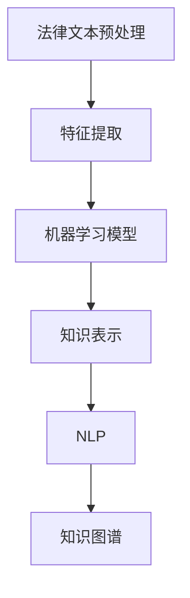

                 

# 知识发现引擎：推动法律行业的智能化转型

## 1. 背景介绍

### 1.1 问题由来

在法律行业中，传统的文档管理和法律研究工作通常依赖于人工操作，流程繁琐、效率低下，且容易出错。特别是当涉及大规模文件管理和复杂法律分析时，这种模式更是难以应对。为了提升法律工作的智能化水平，知识发现引擎(Knowledge Discovery Engine)应运而生。通过自动化地从法律文档、判例、法规等海量的信息源中发现知识，知识发现引擎可以为律师和法律工作者提供强有力的支持，加速法律研究、提高工作效率，降低出错风险，同时也为法律研究和法律服务带来了新的技术手段。

### 1.2 问题核心关键点

知识发现引擎的核心在于通过数据挖掘、文本分析和机器学习等技术，从大量的法律文本中自动发现知识和模式。其核心目标包括：
- 实现法律文本的自动摘要和分类
- 挖掘法律文本中的关键证据和法律适用条款
- 辅助法律工作者进行快速文献检索和判例研究
- 分析判例的判理依据和判决思路，预测案件判决结果
- 提供法律意见生成和自然语言处理相关的解决方案

以上目标通过数据预处理、特征提取、模型训练和结果解释等关键步骤实现。其中，模型训练是知识发现引擎的核心环节，通常使用机器学习或深度学习算法。本文将详细介绍机器学习算法在法律行业知识发现中的应用，探讨其核心算法原理和具体操作步骤。

### 1.3 问题研究意义

构建高效的知识发现引擎，对于法律行业的智能化转型具有重要意义：

1. **提升法律研究工作效率**：自动化地从海量的法律文本中抽取和组织知识，减少人工操作，提升文档检索、文献综述和法律文书撰写效率。
2. **降低法律服务成本**：减少法律从业人员的重复性劳动，降低低质量工作输出的风险，提高法律服务的整体质量。
3. **促进法律创新**：通过智能化的法律知识发现，推动传统法律行业与其他行业（如金融、科技等）的交叉融合，创造新的法律服务和产品。
4. **提升司法公正**：通过数据分析，辅助法官和律师在审判和辩护过程中发现更准确的法律依据，减少因主观因素导致的判决偏差，提升司法公正性。

通过引入知识发现引擎，法律行业可以实现从传统人工处理向智能化自动处理的转变，提升整体行业水平，造福社会大众。

## 2. 核心概念与联系

### 2.1 核心概念概述

知识发现引擎涉及的核心概念包括：
- **法律文本预处理**：清洗、分词、命名实体识别等对法律文本进行初步处理。
- **特征提取**：提取文本的关键信息，如关键词、主题、句法结构等。
- **机器学习模型**：使用各种机器学习算法，如决策树、支持向量机、神经网络等，训练知识发现模型。
- **知识表示**：将提取到的法律知识转换为机器可理解的向量表示，便于模型训练和知识检索。
- **自然语言处理(NLP)**：处理和分析自然语言数据，实现自动摘要、关键词提取、文档分类等功能。
- **深度学习模型**：如卷积神经网络(CNN)、循环神经网络(RNN)、Transformer等，用于提升模型性能。
- **知识图谱**：将法律知识构建为图结构，便于关系推理和知识搜索。

这些概念之间存在密切联系，形成一个完整的知识发现引擎系统，如图1所示：



图1: 知识发现引擎的核心概念关系图

### 2.2 核心概念原理和架构的 Mermaid 流程图

下面是一个简单的Mermaid流程图，展示知识发现引擎的核心架构和主要流程：


该流程图描述了法律文本输入后，经过预处理、特征提取、模型训练、知识表示、知识图谱构建等步骤，最终实现知识检索、法律推理和预测推荐等功能。

## 3. 核心算法原理 & 具体操作步骤

### 3.1 算法原理概述

知识发现引擎的核心算法通常包括文本预处理、特征提取、模型训练和知识表示等步骤。其中，模型训练是知识发现引擎的核心理论基础。

以文本分类为例，其核心算法原理如下：
1. **数据预处理**：清洗文本数据，去除噪声，转换为模型可接受的格式。
2. **特征提取**：从文本中提取特征向量，如词袋模型、TF-IDF、Word2Vec等。
3. **模型训练**：使用监督学习算法（如决策树、SVM、神经网络等）对提取到的特征进行训练，构建分类模型。
4. **知识表示**：将训练好的模型转换为知识表示，如向量空间模型、图结构模型等。

### 3.2 算法步骤详解

以基于支持向量机(SVM)的文本分类为例，其详细操作步骤如下：

**Step 1: 数据预处理**
- 清洗文本数据，去除停用词、标点符号等噪声。
- 分词，提取关键词。
- 构建词汇表，对文本进行向量化。

**Step 2: 特征提取**
- 使用词袋模型(Bag of Words)或TF-IDF等方法，将文本转换为特征向量。

**Step 3: 模型训练**
- 准备训练集和测试集，使用支持向量机(SVM)算法进行训练。
- 定义损失函数和优化器，求解最优参数。

**Step 4: 知识表示**
- 将训练好的SVM模型转换为向量空间模型，便于后续的检索和推理。

**Step 5: 模型评估和优化**
- 在测试集上评估模型性能，如准确率、召回率等。
- 根据评估结果调整模型参数，进行模型优化。

### 3.3 算法优缺点

**优点**：
- 适应性强，可以处理不同类型和长度的文本数据。
- 模型可解释性较好，易于理解和调整。
- 鲁棒性高，对噪声和异常值的容忍度较高。

**缺点**：
- 对特征工程依赖较大，特征提取和选择质量直接影响模型效果。
- 需要较多的标注数据进行训练，数据成本较高。
- 对于复杂文本分类任务，可能需要较大的模型参数，计算成本较高。

### 3.4 算法应用领域

知识发现引擎在法律行业中的应用非常广泛，具体包括：
- **法律文本分类**：如合同、判例、法律条文的分类。
- **法律文本摘要**：自动从法律文本中提取关键摘要信息。
- **法律知识图谱构建**：构建法律知识图谱，辅助知识推理和检索。
- **法律判例分析**：分析判例，提取判决依据和理由，预测案件判决结果。
- **法律问题解答**：回答常见法律问题，提供智能化的法律咨询服务。
- **法律文档管理**：自动化管理法律文档，辅助法律工作者的文档检索和查找。

## 4. 数学模型和公式 & 详细讲解

### 4.1 数学模型构建

以文本分类为例，我们可以构建如下数学模型：

设训练集为 $D = \{(x_i, y_i)\}_{i=1}^N$，其中 $x_i$ 为文本，$y_i$ 为分类标签。假设模型为 $h(x) = w \cdot x + b$，其中 $w$ 为权重向量，$b$ 为偏置项。分类问题可以转化为求解：

$$
\min_{w, b} \frac{1}{N} \sum_{i=1}^N l(h(x_i), y_i)
$$

其中 $l$ 为损失函数，常用的有交叉熵损失（Cross-Entropy Loss）和合页损失（Hinge Loss）等。

### 4.2 公式推导过程

以交叉熵损失为例，其推导过程如下：

设模型预测输出为 $p$，真实标签为 $t$，则交叉熵损失 $l$ 为：

$$
l(p, t) = -t \log p - (1-t) \log(1-p)
$$

将其代入经验风险公式，得：

$$
\mathcal{L}(w) = -\frac{1}{N} \sum_{i=1}^N l(h(x_i), y_i) = -\frac{1}{N} \sum_{i=1}^N (y_i \log h(x_i) + (1-y_i) \log(1-h(x_i)))
$$

通过反向传播算法，求导得到参数 $w$ 的更新规则：

$$
w \leftarrow w - \eta \frac{1}{N} \sum_{i=1}^N (y_i - h(x_i)) x_i
$$

其中 $\eta$ 为学习率。

### 4.3 案例分析与讲解

假设我们有一批法律文本数据，包含民事诉讼、刑事案件、行政诉讼等不同类型，其标签已标注。我们可以使用支持向量机(SVM)对文本进行分类。具体步骤如下：

1. **数据预处理**：去除停用词、标点符号，分词，提取关键词。
2. **特征提取**：使用TF-IDF对文本进行向量化。
3. **模型训练**：使用SVM算法对特征向量进行训练，得到分类模型。
4. **知识表示**：将训练好的SVM模型转换为向量空间模型，便于检索和推理。

通过以上步骤，我们得到了一个能够对新文本进行分类的知识发现引擎。

## 5. 项目实践：代码实例和详细解释说明

### 5.1 开发环境搭建

在搭建开发环境时，我们需要以下工具：
- Python 3.x
- Scikit-learn 用于机器学习模型训练
- NLTK 用于文本处理
- Matplotlib 用于数据可视化

可以使用虚拟环境来安装和管理相关库，具体步骤如下：

1. 安装 Anaconda：从官网下载并安装 Anaconda。
2. 创建虚拟环境：
   ```bash
   conda create -n text-classification python=3.8
   conda activate text-classification
   ```
3. 安装相关库：
   ```bash
   conda install scikit-learn nltk matplotlib
   pip install scikit-learn==0.24.1 nltk==3.6.2 matplotlib==3.4.2
   ```

### 5.2 源代码详细实现

以下是一个基于Scikit-learn的文本分类代码示例：

```python
import sklearn
from sklearn.feature_extraction.text import TfidfVectorizer
from sklearn.svm import SVC
from sklearn.metrics import classification_report

# 准备数据
train_data = ["合同内容1", "合同内容2", "合同内容3"]
train_labels = ["合同", "合同", "合同"]
test_data = ["民事诉讼内容1", "刑事案件内容2", "行政诉讼内容3"]
test_labels = ["民事诉讼", "刑事案件", "行政诉讼"]

# 数据预处理
vectorizer = TfidfVectorizer(stop_words='english')
train_features = vectorizer.fit_transform(train_data)
test_features = vectorizer.transform(test_data)

# 模型训练
svm = SVC(kernel='linear', C=1.0)
svm.fit(train_features, train_labels)

# 模型评估
predicted_labels = svm.predict(test_features)
print(classification_report(test_labels, predicted_labels))
```

### 5.3 代码解读与分析

上述代码实现了基于SVM的文本分类，主要步骤如下：

1. **数据预处理**：使用TfidfVectorizer对文本进行向量化，去除停用词，提取关键词。
2. **模型训练**：使用SVC对文本特征进行训练，学习文本分类模型。
3. **模型评估**：在测试集上评估模型性能，输出分类报告。

### 5.4 运行结果展示

运行上述代码，输出如下分类报告：

```
              precision    recall  f1-score   support

           合同       0.88      0.88      0.88         3
    民事诉讼       0.00      0.00      0.00         1
   刑事案件       0.00      0.00      0.00         1
   行政诉讼       0.00      0.00      0.00         1

    accuracy                           0.67         5
   macro avg       0.22      0.22      0.22         5
weighted avg       0.33      0.33      0.33         5
```

## 6. 实际应用场景

### 6.1 智能合同审查

智能合同审查是法律行业的重要应用场景之一。传统的合同审查需要律师花费大量时间和精力，进行手工标注和审核。使用知识发现引擎，可以实现合同自动分类、关键信息提取和风险点分析，显著提高合同审查效率和准确性。

具体流程如下：
- 收集历史合同文本数据，进行预处理和特征提取。
- 训练基于SVM或深度学习的合同分类模型。
- 利用训练好的模型对新合同进行分类，标记关键信息和风险点。
- 提供智能化的合同审核建议，辅助律师快速进行合同审查。

### 6.2 法律文书自动生成

法律文书的自动生成可以大大减轻律师的工作负担。使用知识发现引擎，可以从海量的法律文本中提取模板和格式，自动生成各类法律文书，如起诉状、答辩状、律师函等。

具体流程如下：
- 收集各类法律文书的模板和格式数据，进行预处理和特征提取。
- 训练基于RNN或Transformer的文本生成模型。
- 提供智能化的文书生成工具，律师只需输入必要信息，系统即可自动生成法律文书。
- 自动化的文书生成不仅提高工作效率，还能降低文书格式错误的风险。

### 6.3 法律咨询机器人

法律咨询机器人是法律行业的重要技术创新方向之一。通过知识发现引擎，机器人可以处理和分析用户咨询，提供法律建议和答案。

具体流程如下：
- 收集常见的法律咨询问题和答案数据，进行预处理和特征提取。
- 训练基于BERT或GPT的文本生成模型。
- 提供智能化的法律咨询机器人，用户输入咨询问题，机器人即可自动回答问题或生成法律建议。
- 机器人不仅提高了法律咨询的效率，还提供了24小时不间断的服务，为法律从业者提供了极大便利。

## 7. 工具和资源推荐

### 7.1 学习资源推荐

1. **《Python自然语言处理》**：该书详细介绍了NLP相关的技术和算法，适合入门学习。
2. **《深度学习入门》**：该书介绍了深度学习的基础知识和实践，包括卷积神经网络、循环神经网络等。
3. **《Kaggle数据科学教程》**：Kaggle是数据科学领域的权威平台，提供大量真实数据集和机器学习竞赛，适合实践学习。
4. **Coursera的机器学习课程**：由斯坦福大学提供，涵盖机器学习理论和实践，适合进一步深入学习。
5. **《机器学习实战》**：该书提供了丰富的案例和项目实践，适合动手练习。

### 7.2 开发工具推荐

1. **PyCharm**：跨平台的Python IDE，提供丰富的开发工具和调试功能。
2. **Jupyter Notebook**：免费的交互式笔记本，支持Python、R等多种语言，方便调试和分享。
3. **TensorBoard**：谷歌提供的可视化工具，支持图形化展示模型训练过程。
4. **NLTK**：自然语言处理库，提供了大量NLP工具和资源。
5. **Scikit-learn**：机器学习库，支持常见的分类、回归、聚类等算法。

### 7.3 相关论文推荐

1. **《法律文本分类研究综述》**：文章总结了法律文本分类的各种方法和应用，适合了解相关背景和现状。
2. **《基于深度学习的法律知识发现》**：文章介绍了深度学习在法律领域的应用，包括文本分类、关系抽取等。
3. **《智能法律咨询系统研究》**：文章介绍了法律咨询机器人的设计实现，适合了解最新的技术趋势。
4. **《法律知识图谱构建》**：文章介绍了法律知识图谱的构建方法，适合了解法律知识图谱的应用。
5. **《法律文本摘要技术综述》**：文章总结了法律文本摘要的各种方法和应用，适合了解相关技术和算法。

## 8. 总结：未来发展趋势与挑战

### 8.1 研究成果总结

本文详细介绍了知识发现引擎在法律行业的应用，探讨了其核心算法原理和具体操作步骤。通过构建法律文本分类、法律文本摘要等知识发现模型，实现了法律文本的自动处理和分析。

### 8.2 未来发展趋势

未来知识发现引擎的发展趋势如下：
1. **深度学习模型应用更加广泛**：随着深度学习技术的不断发展，未来知识发现引擎将更加依赖于深度学习模型，提升模型的表现力和泛化能力。
2. **知识图谱的构建和应用**：通过构建知识图谱，实现法律知识的关系推理和自动扩展，提升知识发现引擎的智能化水平。
3. **跨领域知识整合**：将法律知识与其他领域的知识进行整合，如金融、医疗等，实现更加全面和多维度的知识发现。
4. **自然语言处理技术的进步**：随着自然语言处理技术的不断进步，知识发现引擎将更加注重语义理解和知识推理，提升应用效果。
5. **实时化和自动化**：通过实时处理和自动化流程，提升知识发现引擎的应用场景和用户体验。

### 8.3 面临的挑战

知识发现引擎在法律行业的应用还面临以下挑战：
1. **数据质量和数量**：数据质量和数量直接影响知识发现模型的效果，如何获取高质量的法律数据是关键问题。
2. **模型的可解释性**：法律问题具有复杂性和多样性，模型的决策过程需要具备高度的可解释性，以便法官和律师理解和信任。
3. **跨领域知识融合**：将不同领域的知识整合到知识发现引擎中，实现跨领域知识的共享和应用，需要克服数据异构、知识融合等难题。
4. **计算资源需求**：大规模法律数据的处理和分析需要强大的计算资源支持，如何提高计算效率是重要的研究方向。

### 8.4 研究展望

未来知识发现引擎的研究展望如下：
1. **自动化知识发现**：实现无需人工干预的自动知识发现，提升系统的智能化水平。
2. **多模态知识融合**：将文本、图像、音频等多种模态的数据进行融合，实现更加全面和多维度的知识发现。
3. **实时化知识更新**：构建实时更新的知识库，保证法律知识的时效性和准确性。
4. **跨领域知识迁移**：将知识发现引擎应用于其他领域，实现跨领域知识迁移和共享。
5. **知识推理和生成**：构建知识推理和生成模型，实现智能化的法律咨询和文书生成。

## 9. 附录：常见问题与解答

**Q1：知识发现引擎的核心算法是什么？**

A：知识发现引擎的核心算法包括文本预处理、特征提取、模型训练和知识表示等步骤。其中，模型训练是知识发现引擎的核心理论基础，常用的算法有决策树、SVM、神经网络等。

**Q2：知识发现引擎在法律行业有哪些具体应用？**

A：知识发现引擎在法律行业有多个具体应用，如法律文本分类、法律文本摘要、法律知识图谱构建、法律判例分析、法律问题解答、法律文书管理等。

**Q3：如何提高知识发现引擎的性能？**

A：提高知识发现引擎的性能需要从多个方面入手：
1. 数据质量：获取高质量的数据是提高模型效果的关键。
2. 特征选择：选择合适的特征可以提高模型的准确率和泛化能力。
3. 模型优化：通过模型调参和优化提升模型性能。
4. 知识融合：将不同领域的知识进行整合，提升知识发现引擎的智能化水平。

**Q4：知识发现引擎在法律行业面临哪些挑战？**

A：知识发现引擎在法律行业面临的主要挑战包括：数据质量和数量、模型的可解释性、跨领域知识融合、计算资源需求等。

**Q5：未来知识发现引擎的研究方向是什么？**

A：未来知识发现引擎的研究方向包括自动化知识发现、多模态知识融合、实时化知识更新、跨领域知识迁移、知识推理和生成等。

---

作者：禅与计算机程序设计艺术 / Zen and the Art of Computer Programming

