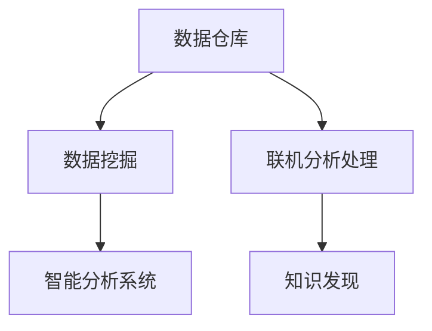
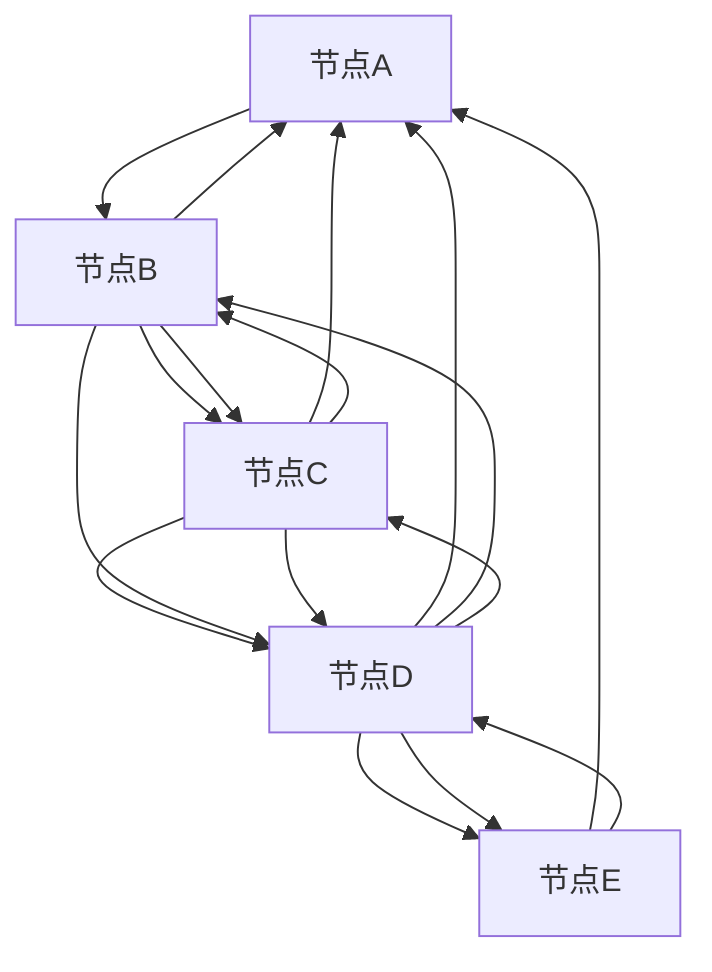

                 

## 1. 背景介绍

### 1.1 问题由来
科学研究是人类进步的基石，其核心是探索和发现新知识。然而，现代科学研究面临前所未有的数据挑战：数据量大、种类繁多、分布复杂，需要复杂的方法来提取和分析。传统的数据分析方法已难以适应这种数据环境。因此，研究者们亟需一种能够高效、全面地发现新知识的知识发现引擎。

### 1.2 问题核心关键点
知识发现引擎，通常指一种集数据管理、数据挖掘和数据分析为一体的技术平台。它能够自动从海量数据中挖掘出有用的知识，辅助研究人员解决实际问题。其核心关键点包括：

1. **数据管理**：提供高效的数据存储和管理方案，支持大规模数据的分布式存储和快速检索。
2. **数据挖掘**：具备自动化数据挖掘功能，能够发现数据中的模式、关系和趋势。
3. **数据分析**：提供丰富的分析工具，支持统计、可视化、机器学习等技术手段，帮助研究人员得出深刻的洞察。

### 1.3 问题研究意义
研究知识发现引擎对于推动科学研究具有重要意义：

1. **提升研究效率**：通过自动化的知识发现过程，研究人员可以节省大量时间，专注于更深入的研究工作。
2. **拓展研究范围**：复杂的分析工具和技术手段，能够处理更多类型的数据，拓展科学研究的边界。
3. **降低研究门槛**：不需要高超的数据分析技能，普通研究人员也能高效使用知识发现引擎进行数据探索。
4. **促进科学创新**：新发现的知识和洞察，能够激发研究者的创新思维，推动科学研究的不断进步。

## 2. 核心概念与联系

### 2.1 核心概念概述

为更好地理解知识发现引擎的核心概念，本节将介绍几个密切相关的核心概念：

- **数据仓库(Data Warehouse)**：一种数据存储和管理技术，用于集中存储来自各种数据源的结构化数据。
- **数据挖掘(Data Mining)**：从数据中自动提取有用信息和知识的过程，包括分类、聚类、关联规则等技术。
- **联机分析处理(OLAP)**：一种数据查询技术，用于多维数据集的复杂分析，支持切片、切块、旋转等操作。
- **知识发现(Knowledge Discovery)**：自动地从数据中发现有用知识的过程，旨在发现数据中的模式、规则和趋势。
- **智能分析系统(Intelligent Analysis System)**：集成多种分析技术的系统，支持自动化的数据挖掘和分析。

这些核心概念之间的逻辑关系可以通过以下Mermaid流程图来展示：



这个流程图展示了一些核心概念之间的联系：

1. 数据仓库用于集中存储结构化数据。
2. 数据挖掘从数据仓库中提取有用信息。
3. OLAP用于多维数据分析。
4. 知识发现从数据中发现模式和规则。
5. 智能分析系统集成多种分析技术。

## 3. 核心算法原理 & 具体操作步骤
### 3.1 算法原理概述

知识发现引擎通常基于以下算法原理：

- **聚类算法**：如K-Means、层次聚类等，将数据分为不同的群组，发现数据的内在结构。
- **分类算法**：如决策树、随机森林、神经网络等，将数据分类到预定义的类别中。
- **关联规则挖掘**：如Apriori算法、FP-growth算法，发现数据中的相关性和关联性。
- **序列模式挖掘**：如AprioriFP算法，发现数据中的序列和趋势。

知识发现引擎的核心目标是自动从数据中挖掘出有用的知识，其算法步骤一般包括以下几个环节：

1. **数据预处理**：包括数据清洗、转换、归一化等步骤，确保数据质量。
2. **数据探索**：使用数据可视化工具，对数据进行初步探索，发现数据中的异常值和潜在模式。
3. **数据挖掘**：应用聚类、分类、关联规则等算法，发现数据中的有用知识。
4. **模型评估**：通过交叉验证等方法，评估挖掘模型的性能，确保模型的泛化能力。
5. **知识展示**：将挖掘结果以图表、报告等形式展示，供研究人员理解和应用。

### 3.2 算法步骤详解

以下以K-Means聚类算法为例，详细讲解其操作步骤：

1. **选择聚类算法**：选择K-Means算法作为数据挖掘工具。
2. **选择聚类中心**：随机选择K个数据点作为初始聚类中心。
3. **计算距离**：计算每个数据点到聚类中心的距离。
4. **分配数据点**：将数据点分配到最近的聚类中心。
5. **更新聚类中心**：计算每个簇的均值，更新聚类中心。
6. **重复迭代**：重复步骤3-5，直到聚类中心不再变化或达到预设迭代次数。

### 3.3 算法优缺点

知识发现引擎的算法具备以下优点：

1. **自动化**：自动从数据中挖掘出有用知识，减少人工干预。
2. **灵活性**：支持多种数据分析方法，适应不同类型的数据。
3. **可扩展性**：可以处理大规模数据集，适应数据量的增长。

同时，该算法也存在一些局限性：

1. **结果可解释性**：聚类、分类等算法往往难以解释其内部的决策过程，影响结果的可信度。
2. **模型过拟合**：在处理噪声数据或小型数据集时，可能出现过拟合现象。
3. **对数据质量依赖**：算法对数据的完整性和质量要求较高，不适合处理缺失数据。

### 3.4 算法应用领域

知识发现引擎的应用领域广泛，包括但不限于以下几个方面：

- **生物信息学**：从基因序列和蛋白质结构数据中发现生物分子间的相互作用和功能。
- **金融市场分析**：从股票、期货等市场数据中发现价格趋势和交易模式。
- **医学研究**：从电子病历和基因数据中发现疾病的病因和疗效。
- **市场营销**：从消费者数据中发现购买行为和偏好。
- **社会网络分析**：从社交网络数据中发现社交关系和群体特征。

## 4. 数学模型和公式 & 详细讲解
### 4.1 数学模型构建

知识发现引擎的数学模型通常基于以下几类：

- **聚类模型**：如K-Means算法，目标是最小化数据点与聚类中心的距离。
- **分类模型**：如决策树，目标是最小化预测误差。
- **关联规则模型**：如Apriori算法，目标是最小化支持度和置信度。

以K-Means算法为例，其数学模型如下：

目标函数为：
$$
\min_{\mu_k} \sum_{i=1}^n \sum_{k=1}^K d(x_i, \mu_k)^2
$$
其中 $d$ 为距离函数，$\mu_k$ 为聚类中心，$n$ 为数据点数量，$K$ 为聚类数目。

### 4.2 公式推导过程

以K-Means算法的公式推导为例：

1. **选择初始聚类中心**：随机选择 $K$ 个数据点作为初始聚类中心 $\mu_k$。
2. **分配数据点**：对于每个数据点 $x_i$，计算其与每个聚类中心的距离 $d(x_i, \mu_k)$，将其分配到距离最近的聚类中心。
3. **更新聚类中心**：对于每个簇，计算其均值，更新聚类中心 $\mu_k = \frac{1}{|C_k|} \sum_{x_i \in C_k} x_i$。
4. **重复迭代**：重复步骤2-3，直到聚类中心不再变化或达到预设迭代次数。

### 4.3 案例分析与讲解

以社交网络分析为例，通过知识发现引擎可以发现网络中的社区结构，如下所示：



通过聚类算法，可以发现节点A、B、C、D、E形成一个紧密联系的社区，而其他节点与之距离较远。

## 5. 项目实践：代码实例和详细解释说明
### 5.1 开发环境搭建

在进行知识发现引擎开发前，我们需要准备好开发环境。以下是使用Python进行Pandas和Scikit-Learn开发的环境配置流程：

1. 安装Anaconda：从官网下载并安装Anaconda，用于创建独立的Python环境。

2. 创建并激活虚拟环境：
```bash
conda create -n pd-env python=3.8 
conda activate pd-env
```

3. 安装Pandas和Scikit-Learn：
```bash
conda install pandas scikit-learn
```

4. 安装各类工具包：
```bash
pip install numpy matplotlib seaborn joblib
```

完成上述步骤后，即可在`pd-env`环境中开始知识发现引擎的开发实践。

### 5.2 源代码详细实现

下面以K-Means聚类算法为例，给出使用Pandas和Scikit-Learn进行聚类分析的Python代码实现。

```python
import pandas as pd
from sklearn.cluster import KMeans
import matplotlib.pyplot as plt

# 读取数据集
data = pd.read_csv('data.csv')

# 数据预处理
data = data.dropna()

# 使用K-Means进行聚类分析
kmeans = KMeans(n_clusters=3, random_state=42)
kmeans.fit(data)

# 获取聚类中心和标签
centers = kmeans.cluster_centers_
labels = kmeans.labels_

# 绘制聚类结果
plt.scatter(data.iloc[:, 0], data.iloc[:, 1], c=labels)
plt.scatter(centers[:, 0], centers[:, 1], s=200, c='red')
plt.show()
```

### 5.3 代码解读与分析

让我们再详细解读一下关键代码的实现细节：

**数据读取**：
- 使用Pandas的`read_csv`方法读取数据集。

**数据预处理**：
- 使用`dropna`方法去除缺失数据。

**聚类分析**：
- 使用Scikit-Learn的`KMeans`类进行聚类分析，其中`n_clusters`指定聚类数目，`random_state`设置随机种子以保证结果可复现。

**可视化展示**：
- 使用Matplotlib绘制聚类结果，其中`plt.scatter`方法用于绘制散点图，`c`参数指定颜色。

通过以上代码，可以简单实现K-Means聚类分析，并在可视化图表中直观展示聚类结果。

## 6. 实际应用场景
### 6.1 医疗诊断

知识发现引擎在医疗诊断中具有重要应用。通过分析电子病历、基因数据、影像数据等，知识发现引擎可以从大量数据中挖掘出疾病的诊断依据和病因机制。例如，通过分析患者的历史病历数据，可以发现与某种疾病相关的高危因素，从而提供个性化的诊疗方案。

### 6.2 金融风险管理

在金融领域，知识发现引擎可以用于风险管理和欺诈检测。通过分析交易数据、客户行为数据等，知识发现引擎可以发现潜在的风险因素和欺诈行为，帮助金融机构制定更精准的风险控制策略。

### 6.3 市场营销

市场营销领域，知识发现引擎可以通过分析消费者数据，发现潜在客户和市场趋势，制定更有效的营销策略。例如，通过分析客户购买历史和行为数据，可以发现不同客户群体的消费特征和偏好，从而实现精准营销。

### 6.4 未来应用展望

随着技术的发展，知识发现引擎的未来应用场景将更加广泛，涵盖了更多的行业和领域。例如：

- **智能制造**：通过分析生产数据，发现设备故障的预测和预防措施。
- **智能交通**：通过分析交通数据，发现交通拥堵和事故的规律，优化交通管理。
- **智能农业**：通过分析气象和土壤数据，提供精准的农业建议和预警。

## 7. 工具和资源推荐
### 7.1 学习资源推荐

为了帮助开发者系统掌握知识发现引擎的理论基础和实践技巧，这里推荐一些优质的学习资源：

1. 《数据挖掘导论》书籍：详细介绍了数据挖掘的基本概念、算法和工具，适合初学者学习。
2. 《Python数据科学手册》书籍：介绍了Python在数据科学中的应用，涵盖数据预处理、数据探索、机器学习等知识点。
3. Coursera《数据挖掘与统计学习》课程：由斯坦福大学开设，涵盖数据挖掘和统计学习的核心内容，适合在线学习。
4. Kaggle数据科学竞赛：通过参与实际的数据挖掘竞赛，积累实践经验，提升解决问题的能力。
5. Scikit-Learn官方文档：提供了详细的算法实现和案例分析，适合深入学习。

通过对这些资源的学习实践，相信你一定能够快速掌握知识发现引擎的核心技术，并用于解决实际的数据挖掘问题。

### 7.2 开发工具推荐

高效的开发离不开优秀的工具支持。以下是几款用于知识发现引擎开发的常用工具：

1. Python：一种高级编程语言，易于学习和使用，支持丰富的数据分析和机器学习库。
2. Pandas：数据处理和分析库，提供了高效的数据结构和数据操作函数。
3. Scikit-Learn：机器学习库，提供了多种经典算法，易于集成使用。
4. Matplotlib：数据可视化库，支持丰富的图表绘制功能。
5. TensorFlow：深度学习框架，支持大规模机器学习任务。
6. Apache Spark：大数据处理框架，支持分布式数据处理和分析。

合理利用这些工具，可以显著提升知识发现引擎的开发效率，加快创新迭代的步伐。

### 7.3 相关论文推荐

知识发现引擎的研究源于学界的持续探索。以下是几篇奠基性的相关论文，推荐阅读：

1. A Fast Parallel Clustering Algorithm（K-Means算法）：提出了一种高效的并行K-Means算法，适用于大规模数据集。
2. Association Rules in Multi-Relational Databases（关联规则挖掘）：提出了Apriori算法，用于发现多维数据中的关联规则。
3. A Systematic Guide to Support Vector Machines（SVM分类算法）：系统介绍了支持向量机算法，适用于各种分类任务。
4. On the Surprising Behavior of K-Nearest Neighbor in High-Dimensional Space（KNN聚类算法）：探讨了高维空间中的KNN聚类算法，分析了其表现和改进方法。
5. A Machine Learning Approach to Predicting Stock Market Crashes（金融风险预测）：利用机器学习算法预测股票市场崩溃，提供了数据挖掘在金融领域的应用案例。

这些论文代表了大数据挖掘技术的发展脉络。通过学习这些前沿成果，可以帮助研究者把握学科前进方向，激发更多的创新灵感。

## 8. 总结：未来发展趋势与挑战

### 8.1 总结

本文对知识发现引擎进行了全面系统的介绍。首先阐述了知识发现引擎的背景和意义，明确了其在科学研究中的重要性。其次，从原理到实践，详细讲解了知识发现引擎的核心算法和操作步骤，提供了完整的代码实现。同时，本文还探讨了知识发现引擎在实际应用中的广泛场景，展示了其在不同领域的应用潜力。最后，本文推荐了相关学习资源和工具，力求为读者提供全方位的技术指引。

通过本文的系统梳理，可以看到，知识发现引擎已经成为了数据挖掘和科学研究的必备工具，极大地提升了研究者的数据分析能力。未来，伴随算力、数据和技术的不断进步，知识发现引擎必将在更多领域发挥更大作用，成为推动科学研究的智慧伙伴。

### 8.2 未来发展趋势

展望未来，知识发现引擎将呈现以下几个发展趋势：

1. **自动化程度提升**：自动化算法和工具的普及，使得知识发现过程更加便捷高效。
2. **跨领域融合**：与其他人工智能技术如机器学习、深度学习、自然语言处理等深度融合，拓展知识发现的应用场景。
3. **实时性增强**：通过流数据处理和大数据技术，实现实时知识发现和分析。
4. **隐私保护加强**：在处理敏感数据时，引入隐私保护技术，确保数据安全和隐私。
5. **可解释性增强**：引入可解释性技术，增强模型的决策过程可解释性，提升信任度。
6. **多模态分析**：将不同类型的数据（如文本、图像、视频等）进行联合分析，提升知识发现的效果。

以上趋势凸显了知识发现引擎的发展方向，这些方向的研究将进一步提升知识发现的准确性和效率，推动科学研究的不断进步。

### 8.3 面临的挑战

尽管知识发现引擎已经取得了显著成就，但在迈向更加智能化、普适化应用的过程中，它仍面临着诸多挑战：

1. **数据质量问题**：数据的质量和完整性直接影响知识发现的准确性。处理缺失、噪声和异常数据是知识发现的难点之一。
2. **算法复杂性**：复杂的算法模型需要高计算资源和专业知识，难以在大规模数据集上高效运行。
3. **隐私保护问题**：在处理敏感数据时，如何保护数据隐私和安全，是一个重要挑战。
4. **可解释性问题**：知识发现引擎的算法模型往往难以解释其内部决策过程，影响结果的可信度和应用范围。
5. **实时性问题**：大规模数据的实时处理需要高效的计算和存储技术，如何提高实时性是一个重要的研究方向。

### 8.4 研究展望

面对知识发现引擎所面临的挑战，未来的研究需要在以下几个方面寻求新的突破：

1. **改进数据预处理技术**：研究新的数据清洗、转换和归一化方法，提升数据质量。
2. **优化算法模型**：开发更加高效、可解释的算法模型，提升算法的性能和可解释性。
3. **引入隐私保护技术**：研究隐私保护和数据匿名化方法，确保数据的安全和隐私。
4. **提升实时性**：研究流数据处理和分布式计算技术，提升知识发现的实时性。
5. **多模态数据融合**：研究多模态数据联合分析方法，提升知识发现的效果。

这些研究方向的探索，必将引领知识发现引擎技术迈向更高的台阶，为构建更加智能、普适、可信的知识发现系统提供有力支持。

## 9. 附录：常见问题与解答

**Q1：知识发现引擎与数据挖掘的区别是什么？**

A: 知识发现引擎和数据挖掘密切相关，但并非完全相同。数据挖掘是从数据中自动发现有用信息的过程，而知识发现引擎则是一种集成数据管理、数据挖掘和数据分析的平台，能够自动化地发现知识，提供更广泛的应用场景。

**Q2：知识发现引擎的优势有哪些？**

A: 知识发现引擎的优势主要包括：
1. **自动化**：自动从数据中发现有用知识，减少人工干预。
2. **灵活性**：支持多种数据分析方法，适应不同类型的数据。
3. **可扩展性**：能够处理大规模数据集，适应数据量的增长。
4. **可解释性**：提供可视化工具和报告，帮助研究人员理解和应用挖掘结果。

**Q3：如何使用知识发现引擎进行疾病预测？**

A: 使用知识发现引擎进行疾病预测，需要收集大量的患者数据，包括病历、基因数据、影像数据等。通过数据预处理、聚类分析和分类模型等技术手段，可以从数据中挖掘出疾病的预测依据和病因机制。例如，使用K-Means算法进行聚类，将患者分为不同的疾病类型；使用决策树或随机森林进行分类，预测新患者的疾病类型。

**Q4：知识发现引擎在市场营销中的应用有哪些？**

A: 知识发现引擎在市场营销中的应用主要包括：
1. 消费者行为分析：通过分析消费者的购买历史和行为数据，发现潜在客户和市场趋势。
2. 市场细分：通过聚类算法，将消费者分为不同的细分市场，制定有针对性的营销策略。
3. 产品推荐：通过关联规则挖掘，发现不同产品之间的关联性，提供个性化的产品推荐。

**Q5：知识发现引擎的开发过程中需要注意哪些问题？**

A: 知识发现引擎的开发过程中需要注意以下问题：
1. 数据预处理：确保数据质量和完整性，处理缺失、噪声和异常数据。
2. 算法选择：根据数据类型和业务需求选择合适的算法模型。
3. 可解释性：确保算法模型的可解释性，提升结果的可信度。
4. 实时性：确保算法模型的实时性，适应数据的实时变化。
5. 隐私保护：确保数据的安全和隐私，避免数据泄露和滥用。

通过回答这些问题，可以帮助开发者更好地理解知识发现引擎的开发流程和注意事项，提高开发效率和结果质量。

---

作者：禅与计算机程序设计艺术 / Zen and the Art of Computer Programming

