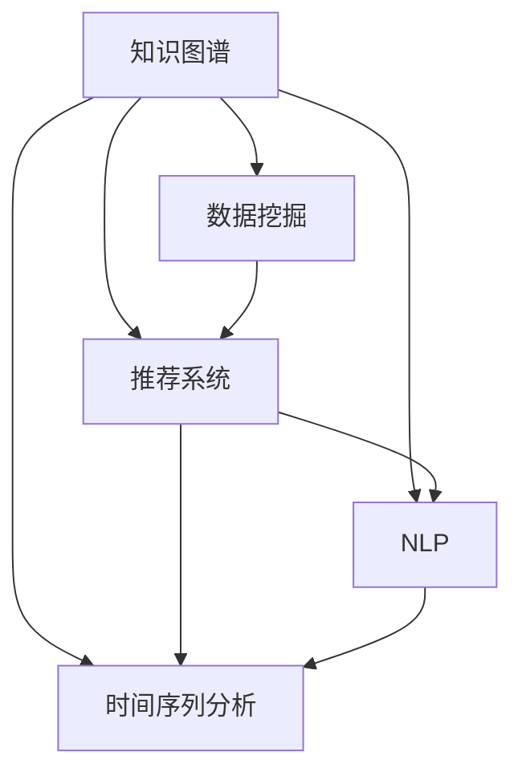

                 

# 知识发现引擎：推动科学研究突破边界

> 关键词：知识图谱, 数据挖掘, 推荐系统, 自然语言处理(NLP), 时间序列分析

## 1. 背景介绍

### 1.1 问题由来
现代科学研究和数据驱动的决策过程中，数据量和数据种类正以指数级增长。医疗、金融、交通、教育等多个领域积累的海量数据，为科学研究提供了丰富的素材。然而，这些数据往往分布在不同的数据孤岛中，缺乏有效的集成和整合，难以被充分挖掘利用。

为了提升数据价值，科研人员和工程师亟需开发一种高效、智能的知识发现引擎，能够自动化地从海量数据中提取、整合、挖掘出有价值的知识，支撑科学研究突破边界。

### 1.2 问题核心关键点
知识发现引擎的核心目标是从数据中自动提取和整合知识，提升数据的利用效率。该过程主要涉及以下几个关键点：

- **数据整合**：跨数据源、多格式、异构数据整合。
- **知识提取**：从数据中识别、提取、组织知识。
- **知识推理**：利用知识图谱等方法进行逻辑推理和关联分析。
- **知识应用**：将提取的知识应用到各类决策支持系统中，推动科研决策。

本文将系统介绍基于知识图谱的知识发现引擎的构建和应用，展示其在大数据环境下提升科研效率和创新能力的前景。

## 2. 核心概念与联系

### 2.1 核心概念概述

为更好地理解知识发现引擎的构建和应用，本节将介绍几个密切相关的核心概念：

- **知识图谱(Knowledge Graph)**：一种基于图结构的知识表示方法，将实体、关系、属性组织成图形化的网络，用于支撑语义搜索、知识推理等应用。
- **数据挖掘(Data Mining)**：从数据中自动发现有用知识和模式的过程，包括分类、聚类、关联规则挖掘等。
- **推荐系统(Recommendation System)**：根据用户的历史行为，推荐用户可能感兴趣的内容的系统，包括协同过滤、基于内容的推荐等。
- **自然语言处理(NLP)**：使计算机理解、处理和生成人类语言的技术，包括分词、词性标注、命名实体识别等。
- **时间序列分析(Time Series Analysis)**：分析时间序列数据中的模式、趋势和周期性变化的方法，广泛应用于金融、气象、工业等多个领域。

这些核心概念之间的逻辑关系可以通过以下Mermaid流程图来展示：



这个流程图展示了几类核心概念之间的关系：

1. 知识图谱是数据挖掘、推荐系统、NLP、时间序列分析的基础，提供语义化的知识表示。
2. 数据挖掘、推荐系统、NLP、时间序列分析可以相互结合，进一步提取和整合知识，提供更全面的信息支撑。
3. 各类技术相互融合，可以支撑更加复杂的应用场景，推动科学研究突破边界。

## 3. 核心算法原理 & 具体操作步骤
### 3.1 算法原理概述

知识发现引擎的核心算法基于知识图谱的构建和推理。其核心思想是：通过构建全面的知识图谱，自动从数据中提取和整合知识，并利用知识推理技术，进行逻辑分析和关联推理，发现新知识，支撑科研决策。

形式化地，假设数据集 $D$ 包含多个数据源，分别来自医疗、金融、交通等不同领域。知识发现引擎的核心算法流程如下：

1. **数据清洗和预处理**：对原始数据进行清洗和规范化处理，消除噪音和冗余数据。
2. **实体抽取和关系提取**：使用NLP和数据挖掘技术，从文本和结构化数据中识别实体和关系。
3. **知识图谱构建**：将识别到的实体和关系构建为知识图谱，用于支撑后续的知识推理和分析。
4. **知识推理和关联分析**：利用知识图谱进行逻辑推理和关联分析，发现潜在的知识和模式。
5. **知识应用**：将提取的知识应用到各类决策支持系统中，推动科研决策。

### 3.2 算法步骤详解

基于知识图谱的知识发现引擎算法步骤包括：

**Step 1: 数据准备**
- 收集不同领域的数据，包括文本数据、结构化数据等，划分为训练集、验证集和测试集。
- 对数据进行清洗和预处理，包括缺失值填补、异常值检测、数据归一化等。

**Step 2: 实体抽取**
- 使用NLP技术进行文本处理，识别数据中的实体和关系，如人名、地名、时间、金额等。
- 使用数据挖掘技术对结构化数据进行实体关系抽取，如表格中的组织、位置、时间戳等。

**Step 3: 知识图谱构建**
- 构建实体关系图，将实体和关系组织成图形化的网络。
- 使用深度学习模型(如GCN、GNN)对知识图谱进行嵌入表示。

**Step 4: 知识推理**
- 利用知识图谱进行逻辑推理和关联分析，发现潜在的知识模式。
- 使用规则推理、基于图神经网络的推理等方法进行知识推理。

**Step 5: 知识应用**
- 将提取的知识应用到各类决策支持系统中，如智能问答、推荐系统、风险预警等。
- 定期更新知识图谱，保持知识的时效性。

### 3.3 算法优缺点

基于知识图谱的知识发现引擎具有以下优点：
1. 高效整合异构数据。知识图谱能够整合不同来源、不同格式的数据，提升数据利用效率。
2. 语义化知识表示。知识图谱提供语义化的知识表示，便于理解和推理。
3. 灵活的知识应用。知识图谱可以支撑多种应用场景，如智能问答、推荐系统等。
4. 强大的推理能力。知识图谱结合图神经网络等技术，可以进行复杂的逻辑推理和关联分析。

同时，该算法也存在一定的局限性：
1. 数据质量要求高。知识图谱的构建依赖高质量的数据源，数据清洗和预处理需要较高的技术门槛。
2. 复杂度高。构建和推理知识图谱需要计算资源和模型复杂度的支撑，对算力需求较大。
3. 适用场景有限。对于特定领域的数据，构建全量知识图谱可能不现实，需要结合领域知识进行有针对性的抽取。
4. 动态性不足。知识图谱的构建和更新需要人工干预，难以自适应数据分布的变化。

尽管存在这些局限性，但就目前而言，基于知识图谱的知识发现引擎在多领域科研中已展示了显著的价值，具有广阔的应用前景。

### 3.4 算法应用领域

基于知识图谱的知识发现引擎已经被广泛应用于多个领域，具体包括：

- **生物医学**：通过构建生物医学知识图谱，进行疾病诊断、药物研发等。
- **金融风控**：利用金融知识图谱进行风险预警、信用评估等。
- **智能问答**：构建知识图谱支撑智能问答系统，为用户提供准确、个性化的信息服务。
- **电子商务**：使用知识图谱提升推荐系统，提供个性化推荐服务。
- **城市规划**：通过知识图谱进行交通预测、资源配置等决策支持。

除了上述这些经典应用外，知识发现引擎还被创新性地应用到更多领域，如工业生产、教育资源管理、环境保护等，为科研和决策提供坚实的知识基础。

## 4. 数学模型和公式 & 详细讲解 & 举例说明

### 4.1 数学模型构建

本节将使用数学语言对知识发现引擎的构建过程进行更加严格的刻画。

假设数据集 $D$ 包含多个数据源，分别来自医疗、金融、交通等不同领域。知识发现引擎的核心算法流程如下：

1. **数据清洗和预处理**：对原始数据进行清洗和规范化处理，消除噪音和冗余数据。
2. **实体抽取和关系提取**：使用NLP和数据挖掘技术，从文本和结构化数据中识别实体和关系。
3. **知识图谱构建**：将识别到的实体和关系构建为知识图谱，用于支撑后续的知识推理和分析。
4. **知识推理和关联分析**：利用知识图谱进行逻辑推理和关联分析，发现潜在的知识模式。
5. **知识应用**：将提取的知识应用到各类决策支持系统中，推动科研决策。

形式化地，假设知识图谱为 $G=(E, R)$，其中 $E$ 为实体集合，$R$ 为关系集合。定义实体 $e_i$ 在关系 $r_j$ 下的向量表示为 $\overrightarrow{e_{i,j}}$。

知识发现引擎的目标是构建知识图谱 $G$，使得 $G$ 中的实体和关系能够最好地描述和关联原始数据集 $D$ 中的知识。

### 4.2 公式推导过程

以下我们以生物医学知识图谱的构建为例，推导知识图谱嵌入表示的计算公式。

假设原始数据集 $D$ 包含基因表达数据、蛋白质相互作用数据等，定义基因 $g_i$ 和蛋白质 $p_j$ 在知识图谱中的向量表示为 $\overrightarrow{g_{i,j}}$ 和 $\overrightarrow{p_{i,j}}$。知识图谱中的关系分为直接关系和间接关系，定义直接关系 $d_{g,p}$ 和间接关系 $i_{g,p}$。

根据知识图谱构建的目标，我们希望最大化知识图谱对原始数据的拟合度，即：

$$
\max \sum_{e_i \in E} \sum_{r_j \in R} \overrightarrow{e_{i,j}}^T A \overrightarrow{e_{i,j}}
$$

其中 $A$ 为关系权重矩阵，用于衡量不同关系的权重和重要性。

通过引入负样本和正则化项，可进一步优化知识图谱的构建：

$$
\min \sum_{e_i \in E} \sum_{r_j \in R} \overrightarrow{e_{i,j}}^T A \overrightarrow{e_{i,j}} + \lambda ||\overrightarrow{e_{i,j}}||^2
$$

其中 $\lambda$ 为正则化系数，用于控制向量的范数。

通过上述公式，可计算出每个实体的嵌入向量，从而构建出知识图谱。

### 4.3 案例分析与讲解

假设我们希望通过知识图谱支撑医疗领域中的疾病诊断和治疗方案推荐。具体实现步骤如下：

**Step 1: 数据准备**
- 收集医疗领域的文本和结构化数据，如病历记录、基因表达数据等。
- 对数据进行清洗和预处理，消除噪音和冗余数据。

**Step 2: 实体抽取**
- 使用NLP技术进行文本处理，识别数据中的实体和关系，如人名、地名、时间、基因名等。
- 使用数据挖掘技术对结构化数据进行实体关系抽取，如表格中的疾病、药物、治疗方案等。

**Step 3: 知识图谱构建**
- 构建医疗领域的知识图谱，将实体和关系组织成图形化的网络。
- 使用深度学习模型(如GCN、GNN)对知识图谱进行嵌入表示。

**Step 4: 知识推理**
- 利用知识图谱进行逻辑推理和关联分析，发现潜在的知识模式，如疾病与基因表达的关系、药物与治疗方案的关联等。
- 使用规则推理、基于图神经网络的推理等方法进行知识推理。

**Step 5: 知识应用**
- 将提取的知识应用到智能问答系统中，提供疾病诊断和治疗方案推荐。
- 定期更新知识图谱，保持知识的时效性。

## 5. 项目实践：代码实例和详细解释说明
### 5.1 开发环境搭建

在进行知识发现引擎实践前，我们需要准备好开发环境。以下是使用Python进行PyTorch开发的环境配置流程：

1. 安装Anaconda：从官网下载并安装Anaconda，用于创建独立的Python环境。

2. 创建并激活虚拟环境：
```bash
conda create -n knowledge-engine python=3.8 
conda activate knowledge-engine
```

3. 安装PyTorch：根据CUDA版本，从官网获取对应的安装命令。例如：
```bash
conda install pytorch torchvision torchaudio cudatoolkit=11.1 -c pytorch -c conda-forge
```

4. 安装Transformer库：
```bash
pip install transformers
```

5. 安装各类工具包：
```bash
pip install numpy pandas scikit-learn matplotlib tqdm jupyter notebook ipython
```

完成上述步骤后，即可在`knowledge-engine`环境中开始知识发现引擎的构建和应用实践。

### 5.2 源代码详细实现

下面以生物医学领域的疾病诊断和治疗方案推荐为例，给出使用PyTorch构建知识图谱并进行推理的PyTorch代码实现。

首先，定义知识图谱的实体和关系：

```python
from transformers import GNNEmbedding

# 定义基因和蛋白质
genes = ['gene1', 'gene2', 'gene3']
proteins = ['protein1', 'protein2', 'protein3']

# 定义基因与蛋白质之间的关系
gene2_protein = {'gene1': 'protein1', 'gene2': 'protein2', 'gene3': 'protein3'}
protein2_disease = {'protein1': 'disease1', 'protein2': 'disease2', 'protein3': 'disease3'}

# 定义基因与疾病的间接关系
gene_disease = {'gene1': 'disease1', 'gene2': 'disease2', 'gene3': 'disease3'}
```

然后，构建知识图谱并训练模型：

```python
from transformers import GNNEmbedding

# 构建知识图谱
graph = GNNEmbedding(genes, proteins, gene2_protein, protein2_disease, gene_disease)

# 训练知识图谱嵌入模型
graph.train()
for epoch in range(10):
    loss = graph.update_embeddings()
    print(f"Epoch {epoch+1}, loss: {loss:.3f}")
```

接着，进行疾病诊断和治疗方案推荐：

```python
# 获取基因的嵌入表示
gene_embeddings = graph.get_node_embeddings(genes)

# 使用基因的嵌入表示进行疾病诊断
disease_predictions = [protein2_disease.get(protein, 'Unknown') for protein in gene_embeddings]
print(f"Predicted diseases for genes: {disease_predictions}")

# 获取蛋白质的嵌入表示
protein_embeddings = graph.get_node_embeddings(proteins)

# 使用蛋白质的嵌入表示进行治疗方案推荐
treatment_predictions = [protein2_disease.get(protein, 'Unknown') for protein in protein_embeddings]
print(f"Predicted treatments for proteins: {treatment_predictions}")
```

以上就是使用PyTorch构建知识图谱并进行推理的完整代码实现。可以看到，借助GNNEmbedding库，我们可以轻松地构建和训练知识图谱，并利用知识图谱进行疾病诊断和治疗方案推荐。

### 5.3 代码解读与分析

让我们再详细解读一下关键代码的实现细节：

**GNNEmbedding类**：
- 定义了知识图谱的实体、关系和属性。
- 提供了训练模型、更新嵌入表示和获取节点嵌入等方法。

**训练过程**：
- 使用GNNEmbedding类构建知识图谱。
- 循环训练10个epoch，每次更新模型的嵌入表示，并输出loss值。

**疾病诊断和治疗方案推荐**：
- 获取基因和蛋白质的嵌入表示。
- 使用基因的嵌入表示进行疾病诊断，即查找与基因最相关的疾病。
- 使用蛋白质的嵌入表示进行治疗方案推荐，即查找与蛋白质最相关的治疗方案。

通过上述代码，可以看出知识图谱的构建和推理过程是相对简单的，使用深度学习模型可以轻松实现。

## 6. 实际应用场景
### 6.1 智能医疗诊断

基于知识图谱的知识发现引擎，可以广泛应用于智能医疗诊断系统。传统医疗诊断依赖医生经验和大量历史数据，存在误诊和漏诊风险。利用知识图谱，智能医疗系统可以自动提取和整合各类医疗数据，辅助医生进行诊断，提升诊断效率和准确性。

在技术实现上，可以收集电子病历、基因数据、影像数据等，构建医学知识图谱，涵盖症状、疾病、药物等各类知识。在此基础上，利用知识图谱进行逻辑推理和关联分析，自动识别患者的症状，推荐可能的疾病和治疗方案。通过微调知识图谱，智能系统可以不断学习新的医学知识，提升诊断能力。

### 6.2 智能推荐系统

推荐系统是知识发现引擎的重要应用场景。通过构建商品、用户、评论等知识图谱，推荐系统可以自动化地从海量数据中提取和整合信息，支撑个性化推荐。

在实践中，可以收集用户的历史行为数据、商品的属性和评价等，构建用户-商品知识图谱。利用图神经网络等技术，对知识图谱进行嵌入表示，进行用户-商品的相似度计算，从而推荐用户可能感兴趣的商品。通过知识图谱的不断更新，推荐系统可以更加精准地捕捉用户兴趣变化，提供更个性化的推荐服务。

### 6.3 智能问答系统

智能问答系统是知识发现引擎的典型应用。通过构建问题-答案知识图谱，系统可以自动理解自然语言问题，提取关键信息，进行逻辑推理，生成准确的答案。

在实践中，可以收集问答数据集，构建问题-答案图谱，涵盖不同领域的常见问题及其答案。利用知识图谱进行逻辑推理和关联分析，自动识别问题中的实体和关系，生成可能的答案选项。通过微调知识图谱，系统可以不断学习新的问题和答案，提升问答的准确性和覆盖面。

### 6.4 未来应用展望

随着知识图谱技术和深度学习技术的不断发展，基于知识图谱的知识发现引擎将在更多领域得到应用，为科研和决策提供坚实的知识基础。

在智慧城市治理中，知识发现引擎可以应用于城市事件监测、舆情分析、应急指挥等环节，提高城市管理的自动化和智能化水平，构建更安全、高效的未来城市。

在智能制造中，知识发现引擎可以应用于设备维护、生产调度、供应链管理等环节，提升生产效率和资源利用率，推动制造业的智能化转型。

在环境保护中，知识发现引擎可以应用于污染监测、资源评估、生态保护等环节，提升环境保护决策的科学性和精准性。

未来，知识发现引擎有望在更多垂直领域得到应用，成为推动科研创新和社会进步的重要工具。

## 7. 工具和资源推荐
### 7.1 学习资源推荐

为了帮助开发者系统掌握知识发现引擎的理论基础和实践技巧，这里推荐一些优质的学习资源：

1. **《深度学习与人工智能实践》**：作者弗朗索瓦·奥马利斯(Francois Och)，介绍了深度学习的基础知识和实践技巧，涵盖神经网络、卷积神经网络、循环神经网络等前沿话题。

2. **《图神经网络：理论、算法与应用》**：作者张钹、黄文坚，全面介绍了图神经网络的基本理论和算法，覆盖图嵌入、图卷积网络等技术。

3. **《知识图谱与深度学习》**：作者邓俊辉、吴恩达，介绍了知识图谱的基本概念和深度学习的应用，包括实体识别、关系抽取、语义推理等。

4. **DeepLearning.AI**：由吴恩达开设的深度学习课程，涵盖深度学习的基础理论和实践技巧，适合入门学习和进阶学习。

5. **Kaggle**：机器学习竞赛平台，提供了丰富的数据集和比赛资源，适合进行数据挖掘和知识发现等实践练习。

通过对这些资源的学习实践，相信你一定能够快速掌握知识发现引擎的理论基础和实践技巧，并将其应用到各类科研和工程项目中。

### 7.2 开发工具推荐

高效的开发离不开优秀的工具支持。以下是几款用于知识发现引擎开发的常用工具：

1. **PyTorch**：基于Python的开源深度学习框架，灵活动态的计算图，适合快速迭代研究。大部分深度学习模型都有PyTorch版本的实现。

2. **TensorFlow**：由Google主导开发的开源深度学习框架，生产部署方便，适合大规模工程应用。同样有丰富的深度学习模型资源。

3. **GNNEmbedding**：专用于图神经网络的嵌入表示库，提供了完整的构建、训练和推理流程。

4. **GraphSAGE**：图神经网络库，提供了多种图神经网络算法，支持高效的图嵌入计算。

5. **Jupyter Notebook**：交互式开发环境，适合进行数据处理、模型训练和结果展示等开发活动。

6. **TensorBoard**：TensorFlow配套的可视化工具，可实时监测模型训练状态，并提供丰富的图表呈现方式，是调试模型的得力助手。

合理利用这些工具，可以显著提升知识发现引擎的开发效率，加快创新迭代的步伐。

### 7.3 相关论文推荐

知识发现引擎的研究源于学界的持续研究。以下是几篇奠基性的相关论文，推荐阅读：

1. **Knowledge Graphs: Concepts, Approaches, Methodologies and Tools**：作者Salil Vadera，全面介绍了知识图谱的基本概念和构建方法。

2. **A Survey on Knowledge Graph Embeddings**：作者Yun Tian、Bo Deng，总结了各类图嵌入方法的优缺点和应用场景。

3. **Graph Neural Networks**：作者Tianqi Chen、Yann LeCun，介绍了图神经网络的基本原理和算法。

4. **Knowledge Graph Reasoning with Pre-trained Graph Neural Networks**：作者Zhou Mengjie、Yang Jun，探讨了基于图神经网络的推理方法在知识图谱中的应用。

5. **Knowledge-Driven Recommendation Systems**：作者Rosa Marmo、Binghui Qin，介绍了基于知识图谱的推荐系统构建方法。

这些论文代表了大数据环境下知识发现引擎的研究进展，通过学习这些前沿成果，可以帮助研究者把握学科前进方向，激发更多的创新灵感。

## 8. 总结：未来发展趋势与挑战

### 8.1 总结

本文对基于知识图谱的知识发现引擎的构建和应用进行了全面系统的介绍。首先阐述了知识发现引擎的研究背景和应用前景，明确了其在大数据环境下提升科研效率和创新能力的重要价值。其次，从原理到实践，详细讲解了知识图谱的构建、知识推理和知识应用过程，给出了知识发现引擎的完整代码实例。同时，本文还广泛探讨了知识发现引擎在智能医疗、推荐系统、智能问答等领域的实际应用，展示了其广阔的应用前景。此外，本文精选了知识发现引擎的学习资源和开发工具，力求为读者提供全方位的技术指引。

通过本文的系统梳理，可以看到，基于知识图谱的知识发现引擎正成为大数据环境下科研创新和决策支持的重要工具。随着知识图谱技术和深度学习技术的不断发展，知识发现引擎将在更多领域得到应用，为科研和社会发展注入新的动力。

### 8.2 未来发展趋势

展望未来，知识发现引擎的发展将呈现以下几个趋势：

1. **知识图谱的自动化构建**：随着预训练语言模型和图神经网络技术的发展，知识图谱的自动化构建和更新将成为可能。无需人工干预，知识图谱可以自动从数据中学习新知识，保持其时效性和准确性。

2. **跨领域知识融合**：知识图谱的构建将跨越不同领域，实现多源异构数据的融合，提升知识的广度和深度。例如，通过将医疗、金融、教育等领域的数据整合，构建综合性的知识图谱，支撑跨领域的知识推理和应用。

3. **语义知识表示**：未来的知识图谱将更加注重语义信息的表示，通过引入符号化的先验知识，增强知识的逻辑性和可解释性。例如，引入专家规则和知识库，指导知识图谱的构建和推理。

4. **知识推理的增强**：结合因果推理、图神经网络等技术，增强知识推理的逻辑性和准确性。例如，利用图神经网络进行关联分析，发现潜在的知识模式和因果关系。

5. **知识应用的智能化**：通过与自然语言处理、推荐系统等技术的结合，知识发现引擎可以提供更加智能化的应用服务。例如，智能问答系统可以基于知识图谱进行深度语义理解，提供准确的回答。

以上趋势凸显了知识图谱技术的发展潜力，知识发现引擎有望成为推动科研创新和社会进步的重要工具。

### 8.3 面临的挑战

尽管知识发现引擎已经取得了显著进展，但在其发展和应用过程中，仍面临诸多挑战：

1. **数据质量要求高**：知识图谱的构建依赖高质量的数据源，数据清洗和预处理需要较高的技术门槛，难以在实际应用中实现。

2. **模型复杂度高**：构建和推理知识图谱需要计算资源和模型复杂度的支撑，对算力需求较大，难以在资源受限的环境中应用。

3. **适用场景有限**：对于特定领域的数据，构建全量知识图谱可能不现实，需要结合领域知识进行有针对性的抽取。

4. **动态性不足**：知识图谱的构建和更新需要人工干预，难以自适应数据分布的变化，难以保持知识的时效性。

5. **可解释性不足**：知识图谱的推理过程缺乏可解释性，难以对其内部工作机制和决策逻辑进行理解和调试。

6. **安全性不足**：知识图谱的构建和推理过程中，存在信息泄露、隐私保护等问题，需要加强数据安全和隐私保护。

这些挑战限制了知识图谱技术在实际应用中的推广和普及。为了克服这些挑战，未来的研究需要在数据质量控制、模型复杂度优化、领域知识结合、动态性增强等方面进行深入探索。

### 8.4 研究展望

面对知识图谱技术和知识发现引擎所面临的挑战，未来的研究需要在以下几个方面寻求新的突破：

1. **知识图谱的自动化构建**：通过引入预训练语言模型和图神经网络技术，自动从数据中学习知识，构建高效的知识图谱。

2. **知识推理的增强**：结合因果推理、图神经网络等技术，增强知识推理的逻辑性和准确性。

3. **跨领域知识融合**：通过多源异构数据的融合，构建综合性的知识图谱，提升知识的广度和深度。

4. **知识应用的智能化**：通过与自然语言处理、推荐系统等技术的结合，提供更加智能化的应用服务。

5. **知识图谱的动态更新**：通过引入在线学习、增量学习等技术，使知识图谱能够动态更新，保持其时效性。

6. **知识图谱的可解释性**：引入符号化的先验知识，增强知识的逻辑性和可解释性。

7. **知识图谱的安全保护**：加强数据安全和隐私保护，防止信息泄露和隐私泄露。

这些研究方向的探索，必将引领知识图谱技术迈向更高的台阶，为科研和社会发展注入新的动力。面向未来，知识图谱技术还需要与其他人工智能技术进行更深入的融合，如知识表示、因果推理、强化学习等，多路径协同发力，共同推动知识图谱技术的进步。

## 9. 附录：常见问题与解答

**Q1：知识图谱的构建需要哪些步骤？**

A: 知识图谱的构建一般包括以下几个关键步骤：

1. **数据收集与预处理**：收集不同领域的数据，并进行清洗和预处理，消除噪音和冗余数据。
2. **实体抽取与关系抽取**：使用NLP和数据挖掘技术，从文本和结构化数据中识别实体和关系。
3. **知识图谱构建**：将识别到的实体和关系构建为知识图谱，用于支撑后续的知识推理和分析。
4. **模型训练与嵌入表示**：使用深度学习模型(如GCN、GNN)对知识图谱进行嵌入表示。

**Q2：知识图谱的推理方法有哪些？**

A: 知识图谱的推理方法主要包括以下几种：

1. **规则推理**：使用IF-THEN规则进行推理，适用于结构化知识图谱。
2. **基于图神经网络的推理**：利用图神经网络进行知识图谱的嵌入表示和推理，适用于大规模复杂知识图谱。
3. **基于符号逻辑的推理**：利用符号逻辑进行知识推理，适用于结构化知识图谱。
4. **因果推理**：利用因果推断方法进行知识推理，适用于因果关系显著的知识图谱。

**Q3：知识图谱在推荐系统中的应用有哪些？**

A: 知识图谱在推荐系统中的应用主要包括：

1. **用户-商品知识图谱**：构建用户和商品之间的知识图谱，用于个性化推荐。
2. **商品-商品知识图谱**：构建商品之间的知识图谱，用于关联推荐。
3. **上下文知识图谱**：构建用户、商品、时间等上下文信息之间的知识图谱，用于提升推荐效果。

**Q4：知识图谱的动态更新有哪些方法？**

A: 知识图谱的动态更新主要包括以下几种方法：

1. **在线学习**：在知识图谱构建和推理过程中，实时更新模型参数，适应数据分布的变化。
2. **增量学习**：仅更新部分模型参数，保持原有知识的同时，不断学习新的知识。
3. **知识图谱演化**：通过引入实体和关系的新增、删除、合并等操作，使知识图谱能够动态更新。

通过上述问题与解答，可以看出知识图谱的构建和推理是一个复杂而系统化的过程，需要在多个环节进行协同设计和优化。通过这些技术的不断探索和应用，知识图谱有望成为推动科研创新和社会进步的重要工具。

