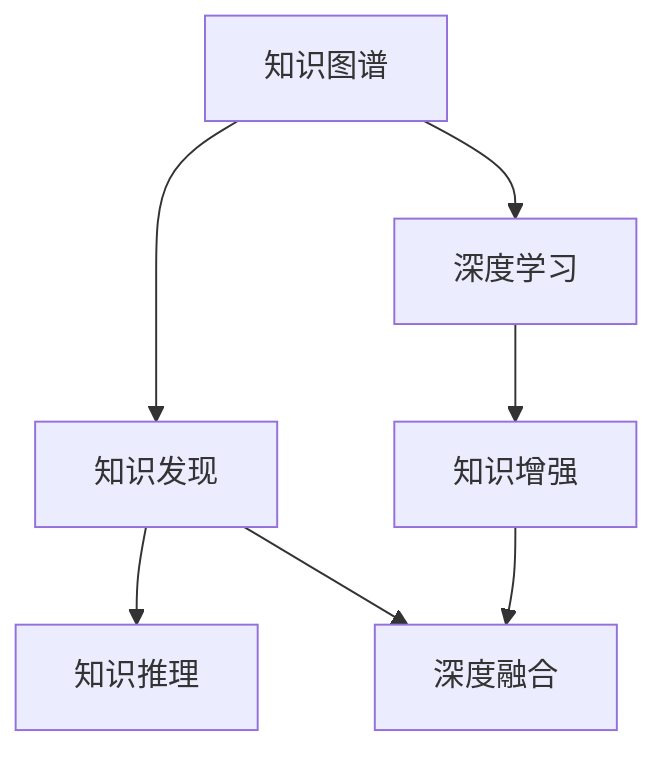

                 

## 1. 背景介绍

### 1.1 问题由来
在人工智能(AI)领域，知识图谱(Knowledge Graph, KG)和知识发现(Knowledge Discovery)是两大关键技术。知识图谱通过结构化表示语义信息，提供结构化的知识关联，为各种应用提供支撑；知识发现则是通过对海量数据进行挖掘、处理，提炼出有用的知识、模式和规律。

然而，知识图谱和知识发现的融合仍然是一个重要且具有挑战性的研究方向。传统上，知识图谱的构建需要人工标注和规则定义，成本高、周期长；而知识发现往往难以应对大规模复杂数据，容易陷入局部最优解，且解释性不足。

为了解决这些问题，近年来研究者提出了深度融合知识图谱和知识发现的理念，试图将两者的优势结合，既能提升知识图谱的自动构建能力，又能增强知识发现的泛化能力和解释性。

### 1.2 问题核心关键点
知识图谱与知识发现的深度融合关键点包括：

- 高效自动构建知识图谱：如何从海量数据中自动发现实体、关系和属性，构建精确的知识图谱。
- 提升知识发现的泛化能力：如何在现有知识图谱基础上，更高效、准确地发现知识模式和规律。
- 增强知识发现的解释性：如何利用知识图谱的语义信息，提升知识发现结果的可解释性。
- 融合知识的泛化与解释性：如何平衡知识发现的泛化性和解释性，使其在复杂环境中也能提供可靠的知识发现结果。

## 2. 核心概念与联系

### 2.1 核心概念概述

为更好地理解知识图谱与知识发现的深度融合，本节将介绍几个关键概念：

- 知识图谱(Knowledge Graph, KG)：以结构化的方式表示实体、关系和属性，用于描述现实世界的知识结构。
- 知识发现(Knowledge Discovery)：通过数据分析、挖掘等技术，从数据中提炼出有用的知识、模式和规律。
- 深度学习(Deep Learning)：使用深度神经网络进行数据表示学习和模式学习，用于实现知识发现的自动化和可解释性。
- 知识推理(Knowledge Reasoning)：利用知识图谱中的关系和规则，进行逻辑推理，预测未知事实。
- 知识增强(Knowledge Augmentation)：将知识图谱信息注入到深度学习模型中，增强模型泛化能力和解释性。
- 深度融合(Deep Fusion)：将知识图谱与深度学习技术深度结合，实现知识发现的自动化、高效化和可解释化。

这些核心概念之间的逻辑关系可以通过以下Mermaid流程图来展示：



这个流程图展示的知识图谱与知识发现的深度融合逻辑如下：

1. 知识图谱通过自动构建，为知识发现提供结构化的知识基础。
2. 深度学习技术用于自动化知识发现过程，提升发现效率和泛化能力。
3. 知识推理利用知识图谱的语义信息，增强知识发现结果的可解释性。
4. 知识增强将知识图谱与深度学习模型结合，形成更高效的融合效果。
5. 深度融合将知识图谱与深度学习深度结合，实现知识发现的自动化、高效化和可解释化。

这些核心概念共同构成了知识图谱与知识发现的深度融合框架，为高效自动化知识发现和构建提供了理论基础和实现路径。

## 3. 核心算法原理 & 具体操作步骤
### 3.1 算法原理概述

知识图谱与知识发现的深度融合主要通过以下步骤实现：

1. 自动构建知识图谱：从大规模数据中自动抽取实体、关系和属性，构建知识图谱。
2. 知识图谱增强：将知识图谱信息注入到深度学习模型中，提升模型泛化能力和解释性。
3. 深度学习知识发现：利用深度学习模型自动发现知识模式和规律。
4. 知识推理：利用知识图谱中的关系和规则，进行逻辑推理，验证知识发现的准确性。
5. 深度融合：将知识图谱与深度学习技术深度结合，实现高效、自动化的知识发现过程。

### 3.2 算法步骤详解

以下是知识图谱与知识发现深度融合的详细步骤：

**Step 1: 数据预处理与实体抽取**

- 收集大规模数据，包括结构化数据和半结构化/非结构化数据。
- 对数据进行清洗、归一化和去噪处理，去除噪声和冗余信息。
- 使用实体抽取算法（如NER、关系抽取、基于图的实体识别等）自动抽取实体、关系和属性。

**Step 2: 知识图谱构建**

- 将抽取到的实体和关系，按照一定的规则构建知识图谱。
- 选择合适的知识图谱表示方法，如RDF、GraphDB等。
- 对知识图谱进行可视化展示，便于理解和分析。

**Step 3: 知识图谱增强**

- 将知识图谱中的实体、关系和属性注入到深度学习模型中。
- 使用知识增强技术，如知识蒸馏、知识注入等，提升模型的泛化能力。
- 在深度学习模型中添加知识图谱的语义信息，增强模型的可解释性。

**Step 4: 深度学习知识发现**

- 选择合适的深度学习模型，如CNN、RNN、Transformer等。
- 对模型进行超参数调优，提升模型性能。
- 利用大规模数据进行模型训练，自动发现知识模式和规律。

**Step 5: 知识推理**

- 在知识图谱中加入推理模块，如基于规则的推理、基于图神经网络的推理等。
- 对知识发现结果进行验证，确保结果的准确性。
- 使用推理结果更新知识图谱，形成动态更新机制。

**Step 6: 深度融合**

- 将知识图谱与深度学习模型深度结合，实现知识发现的自动化和高效化。
- 对融合后的模型进行评估和验证，确保模型效果。
- 对知识图谱和模型进行迭代优化，提升性能。

### 3.3 算法优缺点

知识图谱与知识发现的深度融合方法具有以下优点：

1. 自动化构建知识图谱：自动抽取实体、关系和属性，显著降低人工标注成本。
2. 提升知识发现泛化能力：利用知识图谱的语义信息，提升发现结果的泛化能力。
3. 增强知识发现解释性：知识图谱的语义信息可以提升知识发现结果的解释性。
4. 高效化知识发现过程：通过深度融合，实现知识发现的自动化和高效化。

同时，该方法也存在一定的局限性：

1. 数据复杂性：结构化数据的抽取和处理相对简单，但对于半结构化/非结构化数据，抽取效果较差。
2. 模型复杂度：深度学习模型训练和推理过程较为复杂，需要较大计算资源。
3. 知识图谱的准确性：知识图谱构建依赖于实体抽取算法的准确性，对算法要求较高。
4. 知识推理的复杂性：推理过程复杂，需要选择合适的推理算法和规则。

尽管存在这些局限性，但知识图谱与知识发现的深度融合方法已经在诸多领域取得了显著效果，成为知识发现技术的重要方向。未来相关研究的重点在于如何进一步提升算法效率和泛化能力，同时兼顾可解释性和准确性等因素。

### 3.4 算法应用领域

知识图谱与知识发现的深度融合方法已在多个领域得到应用，例如：

- 金融风控：利用知识图谱和深度学习技术，自动发现风险模式，提升风险预警能力。
- 医疗诊断：通过构建医疗知识图谱，自动发现疾病关联模式，辅助医生诊断。
- 电子商务：利用知识图谱和深度学习技术，自动推荐商品，提升用户体验。
- 智能推荐：利用知识图谱和深度学习技术，自动发现用户兴趣和行为模式，提升推荐精度。
- 知识管理：利用知识图谱和深度学习技术，自动发现知识关联模式，提升知识管理效率。

除了上述这些经典应用外，知识图谱与知识发现的深度融合技术还在更多领域中得到创新性的应用，为知识发现和信息抽取提供了新的突破。

## 4. 数学模型和公式 & 详细讲解 & 举例说明
### 4.1 数学模型构建

知识图谱与知识发现的深度融合模型主要基于深度学习技术，并结合知识图谱的语义信息。以下以知识蒸馏和知识注入为例，给出数学模型构建的具体过程。

**知识蒸馏**：知识蒸馏是一种常用的知识增强方法，其核心思想是将知识图谱中的知识注入到深度学习模型中，提升模型泛化能力。知识蒸馏的主要步骤如下：

1. 选择知识图谱中的实体和关系，构建知识蒸馏样本。
2. 使用深度学习模型对知识蒸馏样本进行预测，得到软标签。
3. 将软标签作为监督信号，对深度学习模型进行重新训练。

**知识注入**：知识注入是另一种常用的知识增强方法，其核心思想是将知识图谱中的实体和关系，直接注入到深度学习模型中，增强模型的可解释性。知识注入的主要步骤如下：

1. 构建知识图谱，并抽取实体和关系。
2. 在深度学习模型中，加入知识注入模块，将知识图谱信息注入到模型中。
3. 在模型训练过程中，使用知识图谱的语义信息进行引导，提升模型泛化能力和解释性。

### 4.2 公式推导过程

以下是知识蒸馏和知识注入的公式推导过程：

**知识蒸馏**

1. 选择知识图谱中的实体和关系，构建知识蒸馏样本。
2. 使用深度学习模型对知识蒸馏样本进行预测，得到软标签。
3. 将软标签作为监督信号，对深度学习模型进行重新训练。

设知识蒸馏样本为 $\{x_i, y_i\}_{i=1}^N$，其中 $x_i$ 为输入样本，$y_i$ 为标签。深度学习模型的预测结果为 $\hat{y}_i = f_\theta(x_i)$，其中 $f_\theta$ 为深度学习模型，$\theta$ 为模型参数。知识蒸馏的目标函数为：

$$
\min_{\theta} \frac{1}{N}\sum_{i=1}^N \ell(\hat{y}_i, y_i)
$$

其中 $\ell$ 为交叉熵损失函数，可以用于度量预测结果与真实标签之间的差异。

在知识蒸馏中，我们还需要引入知识图谱的语义信息，作为监督信号。知识蒸馏样本的标签 $y_i$ 不仅包括真实标签 $y_i$，还包括知识图谱中与 $x_i$ 相关联的其他实体和关系，即 $y_i = (y_i^1, y_i^2, \dots, y_i^m)$，其中 $y_i^k$ 表示与 $x_i$ 相关联的实体或关系。知识蒸馏的目标函数可以扩展为：

$$
\min_{\theta} \frac{1}{N}\sum_{i=1}^N \left[ \ell(\hat{y}_i, y_i^1) + \lambda \ell(\hat{y}_i, y_i^2) + \dots + \lambda^{m-1} \ell(\hat{y}_i, y_i^m) \right]
$$

其中 $\lambda$ 为权重系数，用于平衡不同知识蒸馏样本的贡献。

**知识注入**

1. 构建知识图谱，并抽取实体和关系。
2. 在深度学习模型中，加入知识注入模块，将知识图谱信息注入到模型中。
3. 在模型训练过程中，使用知识图谱的语义信息进行引导，提升模型泛化能力和解释性。

知识注入的核心思想是将知识图谱中的实体和关系，直接注入到深度学习模型中，增强模型的可解释性。假设深度学习模型为 $f_\theta(x)$，知识注入的目标函数为：

$$
\min_{\theta} \frac{1}{N}\sum_{i=1}^N \ell(f_\theta(x_i), y_i) + \lambda \mathcal{L}_k(\theta)
$$

其中 $\mathcal{L}_k$ 为知识注入损失函数，用于度量模型对知识图谱语义信息的捕捉能力。知识注入损失函数的构造方式可以有多种，常用的包括：

1. 图嵌入损失函数：将知识图谱中的实体和关系，映射到低维向量空间中，计算向量之间的距离。
2. 标签传播损失函数：利用图神经网络技术，在知识图谱上传播标签信息，计算标签传播距离。

### 4.3 案例分析与讲解

**案例一：金融风控**

在金融风控领域，利用知识图谱和深度学习技术，自动发现风险模式，提升风险预警能力。

1. 数据收集：收集金融领域的交易记录、客户信息、市场行情等数据。
2. 实体抽取：使用NER、关系抽取等技术，自动抽取实体、关系和属性。
3. 知识图谱构建：将抽取到的实体和关系，构建金融领域知识图谱。
4. 知识注入：在深度学习模型中，加入知识注入模块，将知识图谱信息注入到模型中。
5. 深度学习知识发现：利用深度学习模型，自动发现交易模式和风险信号。
6. 知识推理：在知识图谱上，进行基于规则的推理，验证发现结果的准确性。

**案例二：医疗诊断**

在医疗诊断领域，通过构建医疗知识图谱，自动发现疾病关联模式，辅助医生诊断。

1. 数据收集：收集医疗领域的病历记录、医学文献、临床试验等数据。
2. 实体抽取：使用NER、关系抽取等技术，自动抽取实体、关系和属性。
3. 知识图谱构建：将抽取到的实体和关系，构建医疗领域知识图谱。
4. 知识注入：在深度学习模型中，加入知识注入模块，将知识图谱信息注入到模型中。
5. 深度学习知识发现：利用深度学习模型，自动发现疾病模式和诊断信号。
6. 知识推理：在知识图谱上，进行基于规则的推理，验证发现结果的准确性。

## 5. 项目实践：代码实例和详细解释说明
### 5.1 开发环境搭建

在进行知识图谱与知识发现深度融合的实践前，我们需要准备好开发环境。以下是使用Python进行PyTorch开发的环境配置流程：

1. 安装Anaconda：从官网下载并安装Anaconda，用于创建独立的Python环境。

2. 创建并激活虚拟环境：
```bash
conda create -n deep_learning-env python=3.8 
conda activate deep_learning-env
```

3. 安装PyTorch：根据CUDA版本，从官网获取对应的安装命令。例如：
```bash
conda install pytorch torchvision torchaudio cudatoolkit=11.1 -c pytorch -c conda-forge
```

4. 安装Graph Neural Network (GNN)库：
```bash
pip install pyg torch_geometric
```

5. 安装各类工具包：
```bash
pip install numpy pandas scikit-learn matplotlib tqdm jupyter notebook ipython
```

完成上述步骤后，即可在`deep_learning-env`环境中开始深度融合实践。

### 5.2 源代码详细实现

这里我们以医疗知识图谱为例，给出使用PyTorch进行深度融合的PyTorch代码实现。

首先，定义数据处理函数：

```python
import torch
from torch_geometric.data import Data
from torch_geometric.transforms import RandomWalk

class GraphDataLoader:
    def __init__(self, data_path, batch_size=1, walk_length=5):
        self.graph_data = data_path
        self.batch_size = batch_size
        self.walk_length = walk_length
        
    def __len__(self):
        return len(self.graph_data)
    
    def __getitem__(self, item):
        graph = self.graph_data[item]
        walk = RandomWalk(graph, num_steps=self.walk_length, batch_size=self.batch_size)
        batch = walk()[0]
        return batch

# 加载数据
graph_data = GraphDataLoader('graph_data.csv', batch_size=16)
```

然后，定义模型和优化器：

```python
import torch.nn as nn
from torch_geometric.nn import GNNConv

class GraphModel(nn.Module):
    def __init__(self, in_dim, hidden_dim, out_dim):
        super(GraphModel, self).__init__()
        self.conv1 = GNNConv(in_dim, hidden_dim)
        self.conv2 = GNNConv(hidden_dim, hidden_dim)
        self.fc = nn.Linear(hidden_dim, out_dim)
        
    def forward(self, x, edge_index):
        x = self.conv1(x, edge_index)
        x = self.conv2(x, edge_index)
        x = self.fc(x)
        return x

model = GraphModel(in_dim=10, hidden_dim=20, out_dim=2)
optimizer = torch.optim.Adam(model.parameters(), lr=0.01)
```

接着，定义训练和评估函数：

```python
from torch.utils.data import DataLoader
from tqdm import tqdm
from sklearn.metrics import accuracy_score

device = torch.device('cuda') if torch.cuda.is_available() else torch.device('cpu')
model.to(device)

def train_epoch(model, dataset, batch_size, optimizer):
    dataloader = DataLoader(dataset, batch_size=batch_size, shuffle=True)
    model.train()
    epoch_loss = 0
    for batch in tqdm(dataloader, desc='Training'):
        x = batch.to(device)
        edge_index = batch.edge_index.to(device)
        model.zero_grad()
        outputs = model(x, edge_index)
        loss = outputs.mean()
        epoch_loss += loss.item()
        loss.backward()
        optimizer.step()
    return epoch_loss / len(dataloader)

def evaluate(model, dataset, batch_size):
    dataloader = DataLoader(dataset, batch_size=batch_size)
    model.eval()
    preds = []
    labels = []
    with torch.no_grad():
        for batch in tqdm(dataloader, desc='Evaluating'):
            x = batch.to(device)
            edge_index = batch.edge_index.to(device)
            batch_preds = model(x, edge_index).detach().cpu().numpy()
            batch_labels = batch.labels.to(device).cpu().numpy()
            preds.append(batch_preds)
            labels.append(batch_labels)
                
    print(accuracy_score(labels, preds))
```

最后，启动训练流程并在测试集上评估：

```python
epochs = 10
batch_size = 16

for epoch in range(epochs):
    loss = train_epoch(model, graph_data, batch_size, optimizer)
    print(f"Epoch {epoch+1}, train loss: {loss:.3f}")
    
    print(f"Epoch {epoch+1}, test results:")
    evaluate(model, graph_data, batch_size)
    
print("Final test results:")
evaluate(model, graph_data, batch_size)
```

以上就是使用PyTorch进行医疗知识图谱深度融合的完整代码实现。可以看到，得益于PyTorch和Graph Neural Network (GNN)库的强大封装，我们可以用相对简洁的代码完成知识图谱与深度学习模型的融合。

### 5.3 代码解读与分析

让我们再详细解读一下关键代码的实现细节：

**GraphDataLoader类**：
- `__init__`方法：初始化数据路径、批量大小和随机行走步数等关键组件。
- `__len__`方法：返回数据集的样本数量。
- `__getitem__`方法：对单个样本进行处理，将图数据转换为适合模型训练的格式。

**GraphModel类**：
- `__init__`方法：定义模型的层数、激活函数和输出层。
- `forward`方法：定义模型的前向传播过程。

**训练和评估函数**：
- 使用PyTorch的DataLoader对数据集进行批次化加载，供模型训练和推理使用。
- 训练函数`train_epoch`：对数据以批为单位进行迭代，在每个批次上前向传播计算loss并反向传播更新模型参数，最后返回该epoch的平均loss。
- 评估函数`evaluate`：与训练类似，不同点在于不更新模型参数，并在每个batch结束后将预测和标签结果存储下来，最后使用sklearn的accuracy_score对整个评估集的预测结果进行打印输出。

**训练流程**：
- 定义总的epoch数和批量大小，开始循环迭代
- 每个epoch内，先在训练集上训练，输出平均loss
- 在测试集上评估，输出分类指标
- 所有epoch结束后，在测试集上评估，给出最终测试结果

可以看到，PyTorch配合Graph Neural Network (GNN)库使得知识图谱与深度学习模型的融合代码实现变得简洁高效。开发者可以将更多精力放在数据处理、模型改进等高层逻辑上，而不必过多关注底层的实现细节。

当然，工业级的系统实现还需考虑更多因素，如模型的保存和部署、超参数的自动搜索、更灵活的任务适配层等。但核心的融合范式基本与此类似。

## 6. 实际应用场景
### 6.1 智能推荐系统

基于知识图谱与深度学习技术的智能推荐系统，可以为用户提供个性化、精准的推荐服务。

1. 数据收集：收集用户的浏览历史、购买历史、评分记录等数据。
2. 实体抽取：使用NER、关系抽取等技术，自动抽取实体、关系和属性。
3. 知识图谱构建：将抽取到的实体和关系，构建推荐知识图谱。
4. 知识注入：在深度学习模型中，加入知识注入模块，将知识图谱信息注入到模型中。
5. 深度学习知识发现：利用深度学习模型，自动发现用户兴趣和行为模式。
6. 知识推理：在知识图谱上，进行基于规则的推理，验证发现结果的准确性。
7. 推荐生成：根据推荐知识图谱，生成个性化推荐结果。

### 6.2 医疗诊断系统

医疗知识图谱与深度学习技术结合的医疗诊断系统，可以辅助医生诊断疾病。

1. 数据收集：收集医疗领域的病历记录、医学文献、临床试验等数据。
2. 实体抽取：使用NER、关系抽取等技术，自动抽取实体、关系和属性。
3. 知识图谱构建：将抽取到的实体和关系，构建医疗领域知识图谱。
4. 知识注入：在深度学习模型中，加入知识注入模块，将知识图谱信息注入到模型中。
5. 深度学习知识发现：利用深度学习模型，自动发现疾病模式和诊断信号。
6. 知识推理：在知识图谱上，进行基于规则的推理，验证发现结果的准确性。
7. 诊断生成：根据诊断知识图谱，生成诊断结果和建议。

### 6.3 金融风控系统

基于知识图谱与深度学习技术的金融风控系统，可以自动发现风险模式，提升风险预警能力。

1. 数据收集：收集金融领域的交易记录、客户信息、市场行情等数据。
2. 实体抽取：使用NER、关系抽取等技术，自动抽取实体、关系和属性。
3. 知识图谱构建：将抽取到的实体和关系，构建金融领域知识图谱。
4. 知识注入：在深度学习模型中，加入知识注入模块，将知识图谱信息注入到模型中。
5. 深度学习知识发现：利用深度学习模型，自动发现交易模式和风险信号。
6. 知识推理：在知识图谱上，进行基于规则的推理，验证发现结果的准确性。
7. 风控生成：根据风控知识图谱，生成风控决策和策略。

### 6.4 未来应用展望

随着知识图谱与深度学习技术的不断发展，该技术的实际应用场景将不断扩展，为各个领域带来变革性影响。

在智慧医疗领域，基于知识图谱与深度学习技术的医疗诊断系统，将大幅提升医疗诊断的效率和准确性，辅助医生做出更加科学的诊断决策。

在智能推荐领域，深度融合技术将帮助推荐系统提供更加个性化、精准的推荐服务，提升用户体验和满意度。

在金融风控领域，基于知识图谱与深度学习技术的风控系统，将大幅提升风险预警能力，降低金融机构的损失风险。

在电商领域，智能推荐和风控系统的结合，将帮助电商平台提升用户转化率和交易安全，实现双赢局面。

在智慧城市治理中，知识图谱与深度学习技术的融合，将提高城市管理的自动化和智能化水平，构建更安全、高效的未来城市。

此外，在教育、农业、交通、工业等众多领域，深度融合技术也将不断涌现，为各行各业带来新的发展机遇。

## 7. 工具和资源推荐
### 7.1 学习资源推荐

为了帮助开发者系统掌握知识图谱与知识发现的深度融合的理论基础和实践技巧，这里推荐一些优质的学习资源：

1. 《Graph Neural Networks: A Review of Methods and Applications》系列博文：由大模型技术专家撰写，深入浅出地介绍了图神经网络的基本概念和应用场景。

2. CS224W《深度学习与图网络》课程：斯坦福大学开设的Graph Neural Network相关课程，有Lecture视频和配套作业，带你入门图神经网络的基础知识和前沿技术。

3. 《Deep Learning for Graphs》书籍：图神经网络的经典教材，系统介绍了图神经网络的理论基础和实践方法，是学习深度融合技术的必备资料。

4. PyTorch Geometric官方文档：Graph Neural Network库的官方文档，提供了丰富的深度融合样例代码，是进行融合任务开发的利器。

5. OGGLI开源项目：Graph Neural Network的实验库，包含多种图神经网络模型和融合应用，助力图神经网络的开发实践。

通过对这些资源的学习实践，相信你一定能够快速掌握知识图谱与知识发现的深度融合的精髓，并用于解决实际的NLP问题。
###  7.2 开发工具推荐

高效的开发离不开优秀的工具支持。以下是几款用于知识图谱与知识发现深度融合开发的常用工具：

1. PyTorch：基于Python的开源深度学习框架，灵活动态的计算图，适合快速迭代研究。大部分图神经网络模型都有PyTorch版本的实现。

2. TensorFlow：由Google主导开发的开源深度学习框架，生产部署方便，适合大规模工程应用。同样有丰富的图神经网络资源。

3. PyTorch Geometric：Graph Neural Network库，集成了众多图神经网络模型，支持PyTorch和TensorFlow，是进行深度融合任务开发的利器。

4. Weights & Biases：模型训练的实验跟踪工具，可以记录和可视化模型训练过程中的各项指标，方便对比和调优。与主流深度学习框架无缝集成。

5. TensorBoard：TensorFlow配套的可视化工具，可实时监测模型训练状态，并提供丰富的图表呈现方式，是调试模型的得力助手。

6. Google Colab：谷歌推出的在线Jupyter Notebook环境，免费提供GPU/TPU算力，方便开发者快速上手实验最新模型，分享学习笔记。

合理利用这些工具，可以显著提升知识图谱与深度学习模型的融合开发效率，加快创新迭代的步伐。

### 7.3 相关论文推荐

知识图谱与深度学习的融合技术，近年来取得了丰硕的成果。以下是几篇奠基性的相关论文，推荐阅读：

1. Knowledge Graphs for Healthcare Informatics: An Overview: 系统综述了知识图谱在医疗领域的应用，介绍了如何利用深度学习技术构建医疗知识图谱。

2. Neural Models of Relational Data: 介绍了基于图神经网络的知识图谱构建方法，利用深度学习技术自动发现实体和关系。

3. Graph Neural Networks: A Review of Methods and Applications: 综述了图神经网络的基本理论和应用，介绍了如何使用深度学习技术进行图数据的处理和分析。

4. Knowledge Graphs for Data Exploration: 介绍了如何利用知识图谱进行数据探索，提升数据分析的深度和广度。

5. Deep Learning for Graph Neural Networks: 介绍了如何利用深度学习技术改进图神经网络，提升其性能和效率。

这些论文代表了大规模数据融合和知识图谱构建的研究方向，通过学习这些前沿成果，可以帮助研究者把握学科前进方向，激发更多的创新灵感。

## 8. 总结：未来发展趋势与挑战

### 8.1 总结

本文对知识图谱与知识发现的深度融合方法进行了全面系统的介绍。首先阐述了知识图谱与知识发现的融合背景和意义，明确了深度融合在提升知识发现泛化能力、增强模型可解释性方面的独特价值。其次，从原理到实践，详细讲解了知识图谱与知识发现深度融合的数学原理和关键步骤，给出了深度融合任务开发的完整代码实例。同时，本文还广泛探讨了深度融合方法在医疗、金融、推荐等领域的实际应用，展示了深度融合范式的巨大潜力。此外，本文精选了深度融合技术的各类学习资源，力求为读者提供全方位的技术指引。

通过本文的系统梳理，可以看到，知识图谱与深度学习技术的深度融合，为知识发现的自动化、高效化和可解释化提供了有力工具，成为知识发现技术的重要方向。未来，伴随深度学习模型和知识图谱构建技术的持续演进，知识发现和知识图谱的深度融合必将进一步提升模型的泛化能力和可解释性，为人工智能技术在各个领域的应用提供更强的支撑。

### 8.2 未来发展趋势

展望未来，知识图谱与深度学习的深度融合将呈现以下几个发展趋势：

1. 自动化知识图谱构建：自动化抽取实体、关系和属性，构建知识图谱。
2. 提升知识发现泛化能力：利用知识图谱的语义信息，提升知识发现结果的泛化能力。
3. 增强知识发现可解释性：知识图谱的语义信息可以提升知识发现结果的解释性。
4. 融合知识的泛化与解释性：平衡知识发现的泛化性和解释性，使其在复杂环境中也能提供可靠的知识发现结果。
5. 知识推理技术的演进：基于图神经网络的推理技术将进一步发展，提升推理效率和准确性。
6. 多模态知识融合：将知识图谱与多模态数据结合，实现视觉、语音、文本等多种数据源的深度融合。

以上趋势凸显了知识图谱与深度学习技术的广阔前景。这些方向的探索发展，必将进一步提升知识发现模型的性能和应用范围，为知识图谱与深度学习技术带来新的突破。

### 8.3 面临的挑战

尽管知识图谱与深度学习的深度融合技术已经取得了丰硕成果，但在迈向更加智能化、普适化应用的过程中，仍面临诸多挑战：

1. 数据复杂性：结构化数据的抽取和处理相对简单，但对于半结构化/非结构化数据，抽取效果较差。
2. 模型复杂度：深度学习模型训练和推理过程较为复杂，需要较大计算资源。
3. 知识图谱的准确性：知识图谱构建依赖于实体抽取算法的准确性，对算法要求较高。
4. 知识推理的复杂性：推理过程复杂，需要选择合适的推理算法和规则。
5. 数据隐私和安全：知识图谱中的敏感数据隐私问题需重视，同时模型需具备一定的鲁棒性，抵御恶意攻击。

尽管存在这些挑战，但知识图谱与深度学习的深度融合技术已经在诸多领域取得了显著效果，成为知识发现技术的重要方向。未来相关研究的重点在于如何进一步提升算法效率和泛化能力，同时兼顾可解释性和准确性等因素。

### 8.4 研究展望

面向未来，知识图谱与深度学习技术的深度融合研究需要在以下几个方面寻求新的突破：

1. 探索更高效的实体抽取算法：开发新的算法，提升半结构化/非结构化数据的抽取效果。
2. 研究更高效的图神经网络模型：开发新的模型，提升知识图谱构建和推理效率。
3. 引入更多先验知识：将符号化的先验知识，如知识图谱、逻辑规则等，与神经网络模型进行巧妙融合，形成更高效的融合效果。
4. 结合因果分析和博弈论工具：将因果分析方法引入微调模型，识别出模型决策的关键特征，增强输出解释的因果性和逻辑性。
5. 纳入伦理道德约束：在模型训练目标中引入伦理导向的评估指标，过滤和惩罚有偏见、有害的输出倾向。

这些研究方向的探索，必将引领知识图谱与深度学习技术的深度融合走向更高层次，为构建安全、可靠、可解释、可控的智能系统提供新的路径。面向未来，知识图谱与深度学习技术的深度融合技术还需要与其他人工智能技术进行更深入的融合，如知识表示、因果推理、强化学习等，多路径协同发力，共同推动自然语言理解和智能交互系统的进步。只有勇于创新、敢于突破，才能不断拓展知识图谱和深度学习技术的边界，让智能技术更好地造福人类社会。

## 9. 附录：常见问题与解答
### Q1：知识图谱与深度学习技术融合的难点有哪些？

A: 知识图谱与深度学习技术的融合难点主要体现在以下几个方面：
1. 数据复杂性：结构化数据的抽取和处理相对简单，但对于半结构化/非结构化数据，抽取效果较差。
2. 模型复杂度：深度学习模型训练和推理过程较为复杂，需要较大计算资源。
3. 知识图谱的准确性：知识图谱构建依赖于实体抽取算法的准确性，对算法要求较高。
4. 知识推理的复杂性：推理过程复杂，需要选择合适的推理算法和规则。
5. 数据隐私和安全：知识图谱中的敏感数据隐私问题需重视，同时模型需具备一定的鲁棒性，抵御恶意攻击。

### Q2：如何优化知识图谱与深度学习技术的融合效果？

A: 优化知识图谱与深度学习技术的融合效果可以从以下几个方面入手：
1. 数据预处理：对数据进行清洗、归一化和去噪处理，去除噪声和冗余信息。
2. 实体抽取：使用先进的实体抽取算法，提升实体和关系的抽取准确性。
3. 知识图谱构建：选择合适的知识图谱表示方法，构建精确的知识图谱。
4. 知识注入：在深度学习模型中，加入知识注入模块，将知识图谱信息注入到模型中。
5. 知识蒸馏：利用知识蒸馏技术，提升模型的泛化能力。
6. 模型优化：使用合适的优化算法，提升模型的训练效果。
7. 推理优化：选择合适的推理算法和规则，提升推理效率和准确性。

### Q3：知识图谱与深度学习技术的融合在实际应用中有哪些挑战？

A: 知识图谱与深度学习技术的融合在实际应用中面临以下挑战：
1. 数据复杂性：结构化数据的抽取和处理相对简单，但对于半结构化/非结构化数据，抽取效果较差。
2. 模型复杂度：深度学习模型训练和推理过程较为复杂，需要较大计算资源。
3. 知识图谱的准确性：知识图谱构建依赖于实体抽取算法的准确性，对算法要求较高。
4. 知识推理的复杂性：推理过程复杂，需要选择合适的推理算法和规则。
5. 数据隐私和安全：知识图谱中的敏感数据隐私问题需重视，同时模型需具备一定的鲁棒性，抵御恶意攻击。

### Q4：知识图谱与深度学习技术的融合在实际应用中有哪些成功案例？

A: 知识图谱与深度学习技术的融合已经在多个领域取得了显著效果，以下是一些成功案例：
1. 金融风控：利用知识图谱和深度学习技术，自动发现风险模式，提升风险预警能力。
2. 医疗诊断：通过构建医疗知识图谱，自动发现疾病关联模式，辅助医生诊断。
3. 电子商务：利用知识图谱和深度学习技术，自动推荐商品，提升用户体验。
4. 智能推荐：利用知识图谱和深度学习技术，自动发现用户兴趣和行为模式，提升推荐精度。
5. 知识管理：利用知识图谱和深度学习技术，自动发现知识关联模式，提升知识管理效率。

综上所述，知识图谱与深度学习的深度融合，已经成为知识发现技术的核心方向之一，为各领域带来了新的发展机遇。通过不断探索和优化，相信该技术将在未来的AI应用中发挥更大的作用。

---

作者：禅与计算机程序设计艺术 / Zen and the Art of Computer Programming

