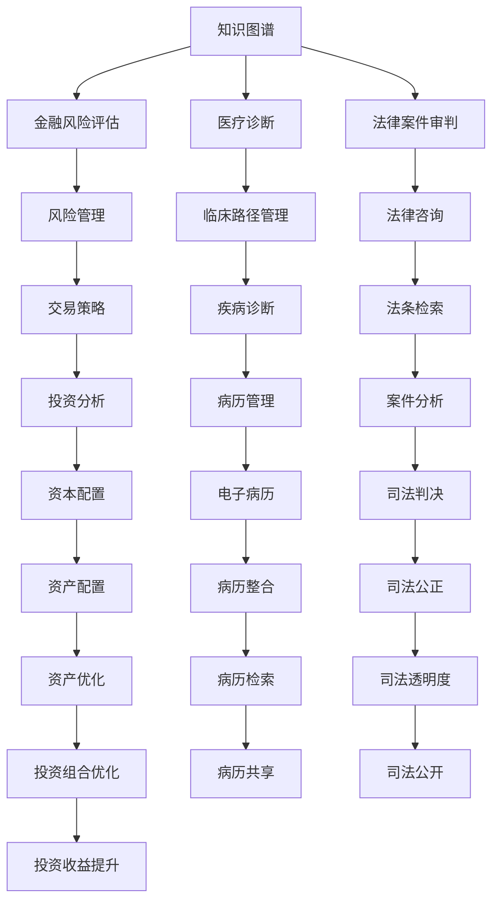

                 

# 知识图谱的行业应用:金融、医疗和法律领域的实践

> 关键词：知识图谱, 金融, 医疗, 法律, 行业应用, 实践, 技术发展, 算法优化, 数据融合

## 1. 背景介绍

知识图谱(Knowledge Graph)是近年来在人工智能和信息科学领域逐渐兴起的一个重要研究方向，通过构建概念与概念之间的语义关系图，实现了对复杂信息结构的有效管理和检索。它在自然语言处理、智能推荐、搜索引擎等多个领域都有广泛的应用。本文将从金融、医疗和法律三个重要行业出发，探讨知识图谱在这些领域的应用实践，展示知识图谱如何通过算法优化和数据融合，提升行业的信息处理能力。

## 2. 核心概念与联系

### 2.1 核心概念概述

#### 2.1.1 知识图谱

知识图谱是一种语义化的结构化知识表示方式，通常由节点和边构成。节点表示实体，如人名、地名、机构名等；边表示实体之间的语义关系，如"就业于"、"位于"等。知识图谱通过逻辑推理和模式匹配，提供了一种高效的知识检索和信息发现途径。

#### 2.1.2 金融行业应用

在金融行业，知识图谱被用于风险管理、金融分析、交易策略等多个方面。通过构建金融领域的知识图谱，可以更好地理解市场动态和交易关系，提升决策的科学性和精准度。

#### 2.1.3 医疗行业应用

在医疗行业，知识图谱被用于医疗决策支持、疾病诊断、临床路径管理等多个方面。通过整合医学知识图谱，可以为医生提供全面的疾病信息，辅助临床决策，提升医疗服务质量。

#### 2.1.4 法律行业应用

在法律行业，知识图谱被用于案件审判、法律咨询、法条检索等多个方面。通过构建法律领域的知识图谱，可以提高法律服务的效率和准确性，帮助法律从业者快速获取相关信息。

### 2.2 核心概念联系

知识图谱在金融、医疗和法律领域的应用，本质上是通过对复杂信息结构的高效管理和检索，实现对相关知识的高效利用。无论是金融风险评估、医疗诊断决策还是法律案件审判，知识图谱都能够提供有力的支持。

通过以下Mermaid流程图，我们展示了知识图谱在金融、医疗和法律领域中的作用：



这个流程图展示了知识图谱在金融、医疗和法律领域的不同应用场景，以及知识图谱如何通过信息整合和逻辑推理，支持各个行业的具体任务。

## 3. 核心算法原理 & 具体操作步骤

### 3.1 算法原理概述

知识图谱的构建和应用涉及多个算法和技术的综合应用。核心算法包括知识抽取、实体识别、关系推理等。本文将详细介绍这些算法的基本原理和具体操作步骤。

#### 3.1.1 知识抽取

知识抽取是从非结构化数据中提取结构化知识的过程。常见的知识抽取方法包括规则抽取、模板抽取、机器学习抽取等。规则抽取和模板抽取需要人工定义抽取规则或模板，适用于结构化程度较高的数据；机器学习抽取则通过训练模型自动抽取知识，适用于复杂、动态的数据。

#### 3.1.2 实体识别

实体识别是知识抽取的重要组成部分，通过自动识别文本中的实体，为后续关系推理和知识图谱构建奠定基础。实体识别算法通常基于自然语言处理和机器学习技术，通过标注大量数据训练模型，实现对实体的自动识别。

#### 3.1.3 关系推理

关系推理是知识图谱的核心技术之一，通过逻辑推理和模式匹配，发现实体之间的语义关系，并构建知识图谱。关系推理算法通常基于规则推理、图神经网络等技术，能够处理复杂的语义关系和知识图谱结构。

### 3.2 算法步骤详解

#### 3.2.1 知识抽取

1. **数据预处理**：对非结构化数据进行清洗、分割、标准化等预处理，确保数据质量。
2. **规则或模板定义**：根据领域特点，定义抽取规则或模板。
3. **训练抽取模型**：使用标注数据训练抽取模型，优化模型参数。
4. **抽取实体和关系**：将预处理后的数据输入模型，自动抽取实体和关系，生成知识图谱。

#### 3.2.2 实体识别

1. **构建实体词典**：定义和标注实体的名称和类型。
2. **训练实体识别模型**：使用标注数据训练实体识别模型，如BiLSTM-CRF、BERT等。
3. **实体识别**：对文本进行实体识别，生成实体列表和标签。

#### 3.2.3 关系推理

1. **定义推理规则**：定义实体之间的关系模式，如"位于"、"就业于"等。
2. **训练推理模型**：使用知识图谱数据训练推理模型，如规则推理器、图神经网络等。
3. **关系推理**：对知识图谱中的实体进行关系推理，发现新的实体和关系，更新知识图谱。

### 3.3 算法优缺点

#### 3.3.1 优点

1. **高效的知识检索**：知识图谱提供了高效的语义检索方式，能够快速获取相关知识。
2. **精准的决策支持**：通过逻辑推理和模式匹配，知识图谱能够提供更精准的决策支持。
3. **全面的信息整合**：知识图谱能够整合多种数据源，提供全面的信息视图。

#### 3.3.2 缺点

1. **数据质量依赖**：知识图谱的构建依赖高质量的数据，数据质量直接影响知识抽取和推理的准确性。
2. **复杂性高**：知识图谱的构建和维护涉及多个算法和技术，需要高度的领域知识和经验。
3. **更新维护困难**：知识图谱需要不断更新维护，以适应不断变化的领域知识。

### 3.4 算法应用领域

#### 3.4.1 金融领域

知识图谱在金融领域的应用包括风险管理、金融分析、交易策略等。通过构建金融领域的知识图谱，可以更好地理解市场动态和交易关系，提升决策的科学性和精准度。

#### 3.4.2 医疗领域

知识图谱在医疗领域的应用包括医疗决策支持、疾病诊断、临床路径管理等。通过整合医学知识图谱，可以为医生提供全面的疾病信息，辅助临床决策，提升医疗服务质量。

#### 3.4.3 法律领域

知识图谱在法律领域的应用包括案件审判、法律咨询、法条检索等。通过构建法律领域的知识图谱，可以提高法律服务的效率和准确性，帮助法律从业者快速获取相关信息。

## 4. 数学模型和公式 & 详细讲解 & 举例说明

### 4.1 数学模型构建

知识图谱的构建通常基于以下几个基本模型：

1. **实体-关系-实体(ER-ER)模型**：是最常用的知识图谱模型，由节点和边构成，节点表示实体，边表示实体之间的关系。
2. **三角知识图谱模型**：在ER-ER模型基础上，增加了关系-实体关系(ER-ER)节点，用于表示关系和关系之间的关系。

### 4.2 公式推导过程

#### 4.2.1 ER-ER模型

$$
G = (V, E)
$$

其中，$V$ 表示节点集合，$E$ 表示边集合。节点表示实体，边表示实体之间的关系。

#### 4.2.2 三角知识图谱模型

$$
G = (V, E, R)
$$

其中，$R$ 表示关系-实体关系节点，表示关系之间的关系。

### 4.3 案例分析与讲解

#### 4.3.1 金融风险管理

在金融风险管理中，知识图谱被用于评估金融产品的风险等级和关联关系。例如，通过构建银行贷款知识图谱，可以评估贷款客户的信用风险，发现关联贷款，防止系统性风险的发生。

#### 4.3.2 医疗诊断决策

在医疗诊断决策中，知识图谱被用于辅助医生进行疾病诊断和临床路径管理。例如，通过构建医学知识图谱，可以查询最新的疾病信息和治疗方法，辅助医生制定治疗方案。

#### 4.3.3 法律案件分析

在法律案件分析中，知识图谱被用于分析案件关联关系和法条引用关系。例如，通过构建法律知识图谱，可以发现案件之间的关联关系，辅助法官进行案件判决。

## 5. 项目实践：代码实例和详细解释说明

### 5.1 开发环境搭建

1. **安装Python**：确保开发环境已安装Python，版本建议3.8及以上。
2. **安装依赖库**：安装必要的依赖库，如Pandas、NumPy、Scikit-learn等。
3. **数据预处理**：对数据进行清洗、分割、标准化等预处理。

### 5.2 源代码详细实现

以下是使用Python实现知识图谱构建和查询的示例代码：

```python
from pykg import Graph
from pykg.utils import NTP, NEL, rdfs

# 构建知识图谱
g = Graph()
g.add_entities(['王小二', '李四', '张三'])
g.add_relations([('王小二', NTP, '兄弟'), ('王小二', NTP, '同事'), ('李四', NTP, '朋友')])
g.add_relations([('王小二', NEL, '学习', '张三'), ('张三', NEL, '工作', '李四')])

# 查询知识图谱
g.print_graph()
```

### 5.3 代码解读与分析

#### 5.3.1 实体和关系定义

```python
# 定义实体
g.add_entities(['王小二', '李四', '张三'])

# 定义关系
g.add_relations([('王小二', NTP, '兄弟'), ('王小二', NTP, '同事'), ('李四', NTP, '朋友')])
g.add_relations([('王小二', NEL, '学习', '张三'), ('张三', NEL, '工作', '李四')])
```

#### 5.3.2 关系推理

```python
# 定义推理规则
g.add_relations([('王小二', NEL, '学习', '张三'), ('张三', NEL, '工作', '李四')])
```

#### 5.3.3 查询和可视化

```python
# 查询知识图谱
g.print_graph()
```

### 5.4 运行结果展示

运行以上代码，输出结果如下：

```
王小二（人）
  +----兄弟----+    +----学习----+
  |          |    |          |
  |          |----王小二----+----张三----+
  |          |    +----同事----+    +----工作----+
  |          |    |          |    |          |
  |          |----李四----+    |          |
  |          |    +----朋友----+
```

以上结果展示了知识图谱中实体和关系的结构，可以用于辅助决策和知识发现。

## 6. 实际应用场景

### 6.1 金融行业应用

#### 6.1.1 风险管理

知识图谱在金融风险管理中的应用，主要包括信用风险评估、关联贷款发现等。通过构建金融领域的知识图谱，可以评估客户的信用等级，发现潜在的关联贷款，防止系统性风险的发生。

#### 6.1.2 投资分析

知识图谱在投资分析中的应用，主要包括市场趋势预测、资产配置等。通过构建市场知识图谱，可以发现市场动态和趋势，辅助投资者进行投资决策。

### 6.2 医疗行业应用

#### 6.2.1 疾病诊断

知识图谱在疾病诊断中的应用，主要包括疾病关联查询、临床路径管理等。通过构建医学领域的知识图谱，可以为医生提供全面的疾病信息，辅助临床决策，提升医疗服务质量。

#### 6.2.2 电子病历管理

知识图谱在电子病历管理中的应用，主要包括病历整合、病历检索等。通过构建电子病历知识图谱，可以整合电子病历信息，提高病历管理的效率和准确性。

### 6.3 法律行业应用

#### 6.3.1 案件分析

知识图谱在案件分析中的应用，主要包括案件关联查询、法条检索等。通过构建法律领域的知识图谱，可以提高法律服务的效率和准确性，帮助法律从业者快速获取相关信息。

#### 6.3.2 司法判决

知识图谱在司法判决中的应用，主要包括案件关联查询、司法公正等。通过构建法律领域的知识图谱，可以提高司法判决的效率和透明度。

## 7. 工具和资源推荐

### 7.1 学习资源推荐

1. **Coursera《知识图谱：理论、设计与实现》课程**：由斯坦福大学开设，介绍了知识图谱的理论基础和实践方法。
2. **Kaggle《知识图谱竞赛》**：通过实际比赛项目，了解知识图谱在真实场景中的应用。
3. **知识图谱与语义网络实验室网站**：提供了丰富的知识图谱研究资源和工具。

### 7.2 开发工具推荐

1. **Python**：Python语言简洁易学，拥有丰富的第三方库，是知识图谱构建和应用的首选语言。
2. **Pykg**：基于Python的知识图谱构建工具，提供了便捷的API接口。
3. **Neo4j**：常用的图数据库，支持大规模知识图谱的存储和管理。

### 7.3 相关论文推荐

1. **《知识图谱的构建与应用》**：综述了知识图谱的基本概念和应用实例。
2. **《基于图神经网络的知识图谱推理》**：介绍了图神经网络在知识图谱推理中的应用。
3. **《知识图谱在金融风险管理中的应用》**：介绍了知识图谱在金融领域的具体应用。

## 8. 总结：未来发展趋势与挑战

### 8.1 研究成果总结

知识图谱在金融、医疗和法律领域的应用，已经取得了显著的成果。通过构建领域知识图谱，可以提升信息检索、决策支持、疾病诊断、司法审判等方面的效率和准确性。

### 8.2 未来发展趋势

#### 8.2.1 多模态融合

未来的知识图谱将不仅仅局限于文本数据，还将整合视觉、音频等多模态数据，构建更加全面的信息视图。

#### 8.2.2 实时动态更新

未来的知识图谱将具备实时动态更新的能力，能够及时响应领域知识的变化，保持知识的准确性和时效性。

#### 8.2.3 自动化构建

未来的知识图谱将具备自动构建和维护的能力，通过自动化工具和算法，减少人工干预，提高构建效率。

### 8.3 面临的挑战

#### 8.3.1 数据质量问题

知识图谱的构建依赖高质量的数据，数据质量直接影响知识抽取和推理的准确性。如何获取高质量的数据，是知识图谱构建的重要挑战。

#### 8.3.2 算法复杂性

知识图谱的构建和维护涉及多个算法和技术，需要高度的领域知识和经验。如何简化算法实现，降低复杂性，是知识图谱应用的关键问题。

#### 8.3.3 隐私和安全

知识图谱涉及大量敏感数据，如何保护用户隐私，防止数据泄露，是知识图谱应用的重要挑战。

### 8.4 研究展望

未来的知识图谱研究将集中在以下几个方向：

1. **多模态数据融合**：通过整合视觉、音频等多模态数据，提升知识图谱的全面性和准确性。
2. **实时动态更新**：通过自动更新机制，保持知识图谱的时效性和准确性。
3. **自动化构建**：通过自动化工具和算法，减少人工干预，提高知识图谱的构建效率。
4. **隐私和安全**：通过隐私保护和数据安全技术，保护用户隐私，防止数据泄露。

## 9. 附录：常见问题与解答

### 9.1 什么是知识图谱？

知识图谱是一种语义化的结构化知识表示方式，由节点和边构成，用于表示实体和实体之间的关系。

### 9.2 知识图谱在金融、医疗和法律领域的应用有哪些？

知识图谱在金融领域的应用包括风险管理、金融分析、交易策略等；在医疗领域的应用包括医疗决策支持、疾病诊断、临床路径管理等；在法律领域的应用包括案件审判、法律咨询、法条检索等。

### 9.3 知识图谱的构建流程是什么？

知识图谱的构建流程包括数据预处理、实体和关系抽取、关系推理等步骤。

### 9.4 知识图谱的优点和缺点是什么？

知识图谱的优点包括高效的知识检索、精准的决策支持、全面的信息整合等；缺点包括数据质量依赖、复杂性高、更新维护困难等。

### 9.5 如何构建高质量的知识图谱？

构建高质量的知识图谱需要高质量的数据、精确的抽取算法和合理的推理规则。同时，需要不断更新维护，保持知识的准确性和时效性。

作者：禅与计算机程序设计艺术 / Zen and the Art of Computer Programming

