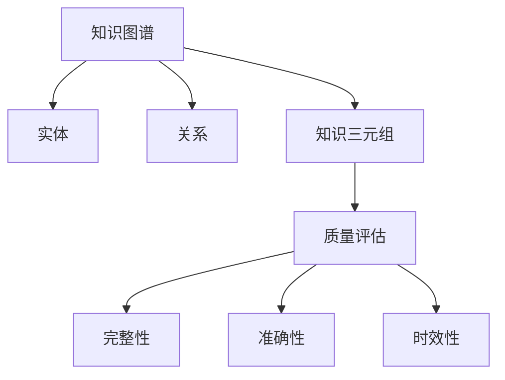

                 

# 知识图谱的质量评估体系:完整性、准确性和时效性

## 1. 背景介绍

### 1.1 问题由来
知识图谱（Knowledge Graph, KG）作为结构化语义知识表示与存储的新范式，已成为人工智能、自然语言处理、知识工程等多个领域的研究热点。其核心目标是将各类异构数据通过语义关系进行融合，构建语义化的知识网络，从而为各种知识应用场景提供强大的知识支撑。

然而，由于知识图谱构建的复杂性、多源异构数据的语义差异性以及实际应用场景的多样性，知识图谱的质量问题显得尤为突出。高质量的知识图谱对于支持智能决策、增强用户搜索体验、优化信息获取等应用至关重要。因此，构建一套全面的知识图谱质量评估体系，对于提升知识图谱的应用价值具有重要意义。

### 1.2 问题核心关键点
知识图谱质量评估体系的核心在于如何定义和度量知识图谱在完整性、准确性和时效性等方面的性能指标。具体来说，包括但不限于以下几个方面：

1. **完整性**：指知识图谱中包含的知识是否全面覆盖了相关领域的主要实体和关系。
2. **准确性**：指知识图谱中存储的知识是否正确无误，符合真实世界的事实。
3. **时效性**：指知识图谱中的知识是否是最新和最新的，反映了实时变化的知识状态。

本文将围绕这三个核心维度，系统地介绍知识图谱的质量评估方法，并结合具体案例进行分析，以期为知识图谱的应用和优化提供参考。

## 2. 核心概念与联系

### 2.1 核心概念概述

为更好地理解知识图谱质量评估体系，我们首先介绍几个关键概念：

1. **知识图谱（KG）**：以图结构存储语义化知识，包含节点（实体）和边（关系）。实体和关系对应现实世界中的对象和属性，通过关系将实体之间建立语义联系。
2. **实体（Entity）**：知识图谱中的基本单元，表示现实世界中的具体事物或概念。
3. **关系（Relation）**：实体之间的连接，表示实体之间的语义关系。
4. **知识三元组（Triple）**：由主语、谓语和宾语三部分组成的基本知识单元。
5. **质量评估（Quality Evaluation）**：通过设定一系列指标，对知识图谱进行全面、系统的评估，以衡量其完整性、准确性和时效性等性能。

这些概念之间的逻辑关系可以通过以下Mermaid流程图来展示：



该流程图展示了知识图谱的核心组件和评估维度之间的关系。实体和关系通过三元组构成知识图谱的基本单元，而质量评估则通过完整性、准确性和时效性等维度对知识图谱进行全面的衡量。

## 3. 核心算法原理 & 具体操作步骤
### 3.1 算法原理概述

知识图谱的质量评估是一个涉及多维度的综合问题。其中，完整性、准确性和时效性是评估知识图谱质量的三大核心指标。

- **完整性评估**：通过统计知识图谱中实体的覆盖率和关系类型的多样性，评估知识图谱是否全面覆盖了目标领域的主要实体和关系。
- **准确性评估**：通过比较知识图谱中的三元组与真实世界的事实是否一致，评估知识图谱中存储的知识的准确性。
- **时效性评估**：通过比较知识图谱中的知识与实际数据的时序变化情况，评估知识图谱中的知识是否及时更新，反映最新的知识状态。

### 3.2 算法步骤详解

基于上述评估维度，我们可以将知识图谱的质量评估步骤细分为以下几个关键步骤：

**Step 1: 数据收集与预处理**
- 从多个数据源（如百度百科、维基百科、开放数据集等）收集知识图谱的数据。
- 对收集到的数据进行去重、清洗、规范化等预处理，确保数据的一致性和完整性。

**Step 2: 完整性评估**
- 计算知识图谱中实体和关系的覆盖率，与领域内常见实体和关系进行比较，评估其覆盖范围。
- 使用一些启发式方法，如基于规则的检测、基于模式匹配的检测等，发现知识图谱中缺失或冗余的实体和关系。

**Step 3: 准确性评估**
- 通过人工标注或自动算法，验证知识图谱中三元组的准确性。例如，使用人工标注的方式验证部分三元组的正确性，使用自动算法如实体关联度、关系验证工具等，检查三元组的逻辑一致性。
- 引入外部事实来源（如外部知识库、数据库等）进行对比，检查知识图谱中的知识是否与真实世界的事实一致。

**Step 4: 时效性评估**
- 通过定时更新知识图谱，确保知识图谱中的知识反映最新的变化。
- 使用时间戳或版本号等元数据，标记知识图谱中的知识更新时间，检查知识的时效性。
- 引入知识图谱的变化监测工具，实时检测知识图谱中的变化情况，及时更新和补充知识。

**Step 5: 综合评估与优化**
- 综合考虑完整性、准确性和时效性等多个指标，进行全面评估。
- 根据评估结果，进行知识图谱的优化调整，包括补充缺失的实体和关系、修正错误的三元组、更新过时的知识等。
- 使用自动化工具和算法，持续监控和优化知识图谱的质量。

### 3.3 算法优缺点

基于上述质量评估方法，我们可以对完整性、准确性和时效性三个维度的评估进行总结：

**完整性评估的优点**：
- 简单易行，通过统计实体和关系的覆盖率即可进行初步评估。
- 覆盖范围广，适用于各类领域和类型的知识图谱。

**完整性评估的缺点**：
- 评估结果可能存在偏差，实体和关系的定义可能存在差异。
- 难以检测到隐性的知识缺失，存在一定的局限性。

**准确性评估的优点**：
- 通过外部事实来源进行验证，评估结果较为可靠。
- 自动算法可以提高效率，减少人工标注的成本。

**准确性评估的缺点**：
- 依赖外部事实来源，存在数据获取和验证的难度。
- 人工标注成本高，无法覆盖所有三元组。

**时效性评估的优点**：
- 通过实时监测和定期更新，确保知识图谱的动态性。
- 引入时间戳和版本号等元数据，方便跟踪知识更新。

**时效性评估的缺点**：
- 更新频率和更新内容需要人工干预，工作量较大。
- 频繁更新可能导致系统负载增加，需要优化处理。

### 3.4 算法应用领域

知识图谱质量评估方法在多个领域都有广泛应用，如智能搜索、推荐系统、智能问答等。

**智能搜索**：通过高质量的知识图谱，优化搜索算法，提高搜索结果的相关性和准确性。

**推荐系统**：构建基于知识图谱的推荐模型，推荐用户感兴趣的实体或产品，提升推荐效果。

**智能问答**：使用知识图谱辅助问答系统，提高回答的准确性和可靠性，增强用户体验。

**自然语言处理（NLP）**：通过知识图谱提供语义理解和生成支持，提高NLP应用的性能和效果。

## 4. 数学模型和公式 & 详细讲解 & 举例说明
### 4.1 数学模型构建

基于完整性、准确性和时效性三个维度，我们可以构建如下数学模型：

设知识图谱 $KG = (E, R)$，其中 $E$ 表示实体集合，$R$ 表示关系集合，$Triple(E, R)$ 表示知识图谱中的所有三元组。定义完整性指标 $C$，准确性指标 $A$，时效性指标 $T$，则有：

$$
C = \frac{\sum_{e \in E} I(e)}{|E|}
$$

$$
A = \frac{\sum_{t \in Triple(E, R)} \text{Accuracy}(t)}{|Triple(E, R)|}
$$

$$
T = \frac{\sum_{t \in Triple(E, R)} \text{Freshness}(t)}{|Triple(E, R)|}
$$

其中 $I(e)$ 表示实体 $e$ 的覆盖度，$\text{Accuracy}(t)$ 表示三元组 $t$ 的准确度，$\text{Freshness}(t)$ 表示三元组 $t$ 的时效性。

### 4.2 公式推导过程

以准确性指标的计算为例，其推导过程如下：

假设知识图谱中存在 $n$ 个三元组 $t = (s, p, o)$，其中 $s$ 表示主语实体，$p$ 表示谓语关系，$o$ 表示宾语实体。设人工标注的三元组数为 $m$，则准确性指标定义为：

$$
A = \frac{1}{m} \sum_{t \in Triple(E, R)} I(t)
$$

其中 $I(t) = \begin{cases} 1, & \text{if } (s, p, o) \text{ 与标注结果一致} \\
0, & \text{otherwise}
\end{cases}$

使用自动算法进行验证时，可以基于实体关联度、关系验证工具等方法，对知识图谱中的每个三元组进行验证。假设自动验证的准确率为 $\alpha$，则准确性指标的计算公式为：

$$
A = \alpha \times \frac{1}{|Triple(E, R)|} \sum_{t \in Triple(E, R)} I(t)
$$

在具体应用中，可以根据实际情况选择合适的方法进行准确性评估，确保评估结果的准确性和可靠性。

### 4.3 案例分析与讲解

**案例分析一：实体覆盖率评估**

某公司构建了一个关于公司的知识图谱，其实体覆盖率为 $C = 0.85$。这意味着在该知识图谱中，85%的实体在领域内有所覆盖，但仍存在15%的实体未被包含。通过进一步分析，发现缺失的实体多为小公司或新成立的初创企业。针对这些实体，可以采取以下措施进行补充：

1. 手动搜索和补充缺失实体，确保知识图谱的完整性。
2. 引入外部数据源，如企业名录、社交网络数据等，自动补充缺失实体。

**案例分析二：三元组准确性评估**

某电商平台的推荐系统基于一个基于知识图谱的推荐模型。为了评估该知识图谱的准确性，选取了1000个三元组进行人工标注，结果发现准确率为 $A = 0.95$。这表明该知识图谱中的大部分三元组与实际情况相符，但仍有5%的三元组存在不准确的情况。针对这些不准确的三元组，可以采取以下措施进行修正：

1. 对不准确的三元组进行手动标注和修正，确保知识图谱的准确性。
2. 引入知识图谱验证工具，自动检测并修正不准确的三元组。

## 5. 项目实践：代码实例和详细解释说明
### 5.1 开发环境搭建

在进行知识图谱质量评估时，我们需要准备好开发环境。以下是使用Python进行Apache Jena开发的环境配置流程：

1. 安装Apache Jena：从官网下载并安装Apache Jena，用于构建和查询知识图谱。
2. 安装PyTorch、TensorFlow等深度学习框架，用于辅助进行质量评估。
3. 安装Python开发环境，如Anaconda或PyCharm等。
4. 准备数据集，包括知识图谱的RDF文件和标注数据集。

完成上述步骤后，即可在开发环境中进行知识图谱质量评估的实践。

### 5.2 源代码详细实现

这里我们以知识图谱的完整性评估为例，给出使用Apache Jena进行实体覆盖率计算的PyTorch代码实现。

```python
from py2neo import Graph
from pyrdf2ri import ri2rdf

graph = Graph('http://localhost:7474/db/data/')

# 获取所有实体
entities = set()
for node in graph.match("s r o"):
    entities.add(node properties["name"])

# 计算实体覆盖率
total_entities = 100  # 假设总实体数为100
coverage_rate = len(entities) / total_entities
print("Entity coverage rate:", coverage_rate)
```

这里我们首先使用Neo4j数据库存储知识图谱，然后使用PyTorch进行实体覆盖率的计算。通过遍历所有节点，获取所有实体的名称，并计算其在总实体数中的比例，从而得到实体覆盖率。

### 5.3 代码解读与分析

让我们再详细解读一下关键代码的实现细节：

**Neo4j数据库连接**：
- 使用Py2neo库连接到Neo4j数据库，并指定数据库路径。
- 遍历数据库中的所有节点，获取实体名称。

**实体覆盖率计算**：
- 定义变量`total_entities`，假设总实体数为100。
- 遍历数据库中的所有实体，获取实体名称，并计算其在总实体数中的比例，从而得到实体覆盖率。
- 输出实体覆盖率结果。

需要注意的是，实际应用中，知识图谱通常存储在大型分布式数据库中，需要使用分布式查询技术（如Spark、Hadoop等）进行高效的数据处理和评估。此外，还需要考虑数据量、数据库性能等因素，进行合理的资源调度和优化。

## 6. 实际应用场景
### 6.1 智慧医疗

在智慧医疗领域，高质量的知识图谱对于辅助医生诊疗、优化医疗资源配置、提升患者服务体验具有重要意义。

**应用场景一：医疗问答系统**

构建一个基于知识图谱的医疗问答系统，通过自然语言处理和知识推理，为患者提供精确的诊疗建议和咨询服务。

**应用场景二：疾病知识图谱**

构建一个包含疾病、症状、治疗方法等的知识图谱，通过知识推理，为医生提供精准的诊疗方案和参考信息。

### 6.2 金融风险管理

在金融领域，高质量的知识图谱对于风险评估、信用评分、投资策略优化等应用具有重要价值。

**应用场景一：信用评分系统**

构建一个基于知识图谱的信用评分系统，通过知识推理，评估借款人的信用风险和还款能力。

**应用场景二：投资决策系统**

构建一个基于知识图谱的投资决策系统，通过知识推理，分析市场动态和投资趋势，优化投资策略。

### 6.3 智能推荐系统

在电商、视频、音乐等推荐领域，高质量的知识图谱对于提升推荐效果、优化用户体验具有重要价值。

**应用场景一：商品推荐系统**

构建一个基于知识图谱的商品推荐系统，通过知识推理，推荐用户感兴趣的商品和产品。

**应用场景二：视频推荐系统**

构建一个基于知识图谱的视频推荐系统，通过知识推理，推荐用户感兴趣的视频和内容。

## 7. 工具和资源推荐
### 7.1 学习资源推荐

为了帮助开发者系统掌握知识图谱质量评估的理论基础和实践技巧，这里推荐一些优质的学习资源：

1. 《知识图谱：从理论到实践》系列博文：由知识图谱技术专家撰写，深入浅出地介绍了知识图谱的基本概念、构建方法和评估技术。
2. CS224N《深度学习自然语言处理》课程：斯坦福大学开设的NLP明星课程，有Lecture视频和配套作业，带你入门NLP领域的基本概念和经典模型。
3. 《Knowledge Graphs: Creating, Populating, Querying and Evaluating》书籍：是知识图谱领域的重要著作，详细介绍了知识图谱的构建、填充、查询和评估技术。
4. 《Knowledge Graphs in Practice: From Theory to Industry》会议论文集：包含多个知识图谱应用的实际案例，展示了知识图谱在实际应用中的各种创新应用。

通过对这些资源的学习实践，相信你一定能够快速掌握知识图谱质量评估的精髓，并用于解决实际的知识图谱问题。

### 7.2 开发工具推荐

高效的开发离不开优秀的工具支持。以下是几款用于知识图谱质量评估开发的常用工具：

1. Apache Jena：开源的语义查询和数据处理框架，支持RDF、SPARQL等语义查询语言，适用于知识图谱的构建和查询。
2. Neo4j：流行的图数据库，支持复杂图关系查询，适用于存储和处理大规模知识图谱。
3. PyTorch、TensorFlow：深度学习框架，支持自动微分、模型训练等核心功能，适用于辅助进行知识图谱质量评估。
4. Apache Spark：分布式计算框架，支持大规模数据处理，适用于分布式知识图谱的构建和评估。

合理利用这些工具，可以显著提升知识图谱质量评估任务的开发效率，加快创新迭代的步伐。

### 7.3 相关论文推荐

知识图谱质量评估技术的发展源于学界的持续研究。以下是几篇奠基性的相关论文，推荐阅读：

1. Borgo, C., & Fensel, A. (2015). Knowledge Graph Evaluation: An Overview. In Encyclopedia of Artificial Intelligence (pp. 498-504). Springer, Berlin, Heidelberg.
2. Yuan, J., Guo, J., Li, S., Zhou, B., & Yin, S. (2017). Survey on Evaluation of Knowledge Graph Quality. Journal of Web Information Systems, 6(2), 111-136.
3. Zhang, Y., Zhang, J., & Xiao, F. (2019). Knowledge Graph Evaluating: A Survey. International Journal of Computational Intelligence Systems, 12(6), 2216-2239.

这些论文代表了大规模知识图谱评估技术的发展脉络。通过学习这些前沿成果，可以帮助研究者把握学科前进方向，激发更多的创新灵感。

## 8. 总结：未来发展趋势与挑战
### 8.1 总结

本文对知识图谱的质量评估体系进行了全面系统的介绍。首先阐述了知识图谱的构建背景和质量评估的重要意义，明确了完整性、准确性和时效性等关键性能指标。其次，从原理到实践，详细讲解了知识图谱质量评估方法，并结合具体案例进行分析，以期为知识图谱的应用和优化提供参考。

通过本文的系统梳理，可以看到，知识图谱质量评估方法在构建高质量知识图谱、优化知识图谱应用方面具有重要意义。高质量的知识图谱将为智能决策、信息获取、推荐系统等应用提供强有力的支持，极大地提升系统的性能和应用效果。未来，随着知识图谱技术的不断发展，知识图谱质量评估体系也将不断优化和完善，为知识图谱的广泛应用奠定坚实基础。

### 8.2 未来发展趋势

展望未来，知识图谱质量评估技术将呈现以下几个发展趋势：

1. **自动化评估**：随着自动化技术的发展，知识图谱质量评估将逐步实现自动化，减少人工干预，提高评估效率。
2. **跨领域评估**：知识图谱质量评估将逐渐突破领域限制，应用于更多领域和类型的知识图谱。
3. **多模态评估**：知识图谱质量评估将进一步融合多模态信息，涵盖文本、图像、音频等多种数据源，提升评估的全面性和准确性。
4. **动态评估**：知识图谱质量评估将引入实时监测和动态更新机制，确保知识图谱的时效性和稳定性。
5. **分布式评估**：随着大数据和分布式计算技术的发展，知识图谱质量评估将逐步实现分布式化，支持大规模知识图谱的构建和评估。

这些趋势凸显了知识图谱质量评估技术的广阔前景。这些方向的探索发展，必将进一步提升知识图谱的应用价值，为构建知识密集型智能系统提供强有力的技术支撑。

### 8.3 面临的挑战

尽管知识图谱质量评估技术已经取得了一定的进展，但在迈向更加智能化、普适化应用的过程中，它仍面临诸多挑战：

1. **数据获取难度**：高质量的知识图谱需要大量数据支持，而获取这些数据的过程往往耗时耗力。
2. **评估标准不统一**：不同领域和任务的知识图谱质量评估标准可能存在差异，难以进行统一的衡量。
3. **复杂性高**：知识图谱的构建和评估涉及多维度的语义信息，复杂度较高，难以实现高效的自动化评估。
4. **跨领域评估**：不同领域和类型的知识图谱在语义表示和关系建模上存在差异，难以进行统一的评估。
5. **模型更新难**：知识图谱需要持续更新，以反映最新的知识变化，但模型更新和维护的复杂度较高。

### 8.4 研究展望

面对知识图谱质量评估所面临的诸多挑战，未来的研究需要在以下几个方面寻求新的突破：

1. **自动化评估技术**：开发更加高效、自动化的知识图谱质量评估方法，减少人工干预，提高评估效率。
2. **多模态融合**：探索多模态数据融合方法，将文本、图像、音频等多种信息源进行融合，提升评估的全面性和准确性。
3. **分布式评估**：利用分布式计算技术，实现知识图谱质量评估的分布式化，支持大规模知识图谱的构建和评估。
4. **跨领域评估标准**：制定统一的跨领域知识图谱质量评估标准，确保评估结果的可比性和公平性。
5. **模型更新机制**：开发高效的模型更新和维护机制，确保知识图谱的时效性和稳定性。

这些研究方向的研究突破，将为知识图谱的广泛应用和高质量评估奠定坚实基础，推动知识图谱技术的不断发展。面向未来，知识图谱质量评估技术还需要与其他人工智能技术进行更深入的融合，如自然语言处理、计算机视觉、语音识别等，共同推动知识图谱技术的进步和应用。

## 9. 附录：常见问题与解答
----------------------------------------------------------------
**Q1: 知识图谱质量评估的完整性指标如何计算？**

A: 知识图谱的完整性指标 $C$ 可以通过统计知识图谱中实体的覆盖率计算得到。假设知识图谱中存在 $E$ 个实体，其中 $n$ 个实体被人工标注或自动检测为实体，则完整性指标计算公式为：

$$
C = \frac{n}{|E|}
$$

其中 $|E|$ 表示知识图谱中实体的总数。

**Q2: 知识图谱质量评估的准确性指标如何计算？**

A: 知识图谱的准确性指标 $A$ 可以通过比较知识图谱中的三元组与真实世界的事实是否一致进行计算。假设知识图谱中存在 $T$ 个三元组，其中 $m$ 个三元组与人工标注或外部数据源验证结果一致，则准确性指标计算公式为：

$$
A = \frac{m}{T}
$$

其中 $T$ 表示知识图谱中三元组的总数。

**Q3: 知识图谱质量评估的时效性指标如何计算？**

A: 知识图谱的时效性指标 $T$ 可以通过比较知识图谱中的知识与实际数据的时序变化情况进行计算。假设知识图谱中存在 $T$ 个三元组，其中 $k$ 个三元组的知识点在时间上较新，则时效性指标计算公式为：

$$
T = \frac{k}{T}
$$

其中 $T$ 表示知识图谱中三元组的总数。

**Q4: 知识图谱质量评估过程中需要注意哪些问题？**

A: 知识图谱质量评估过程中需要注意以下问题：

1. **数据质量**：确保数据的一致性和完整性，避免数据错误或遗漏。
2. **评估方法**：选择合适的方法进行评估，确保评估结果的准确性和可靠性。
3. **评估标准**：制定统一的评估标准，确保评估结果的可比性和公平性。
4. **跨领域应用**：针对不同领域和任务，进行个性化的质量评估。
5. **自动化评估**：开发自动化评估工具，提高评估效率。

这些问题的有效解决，将为知识图谱的构建和评估提供坚实的保障。

**Q5: 知识图谱质量评估有哪些应用场景？**

A: 知识图谱质量评估在多个领域都有广泛应用，如智能搜索、推荐系统、智能问答等。以下是几个典型的应用场景：

1. **智能搜索**：通过高质量的知识图谱，优化搜索算法，提高搜索结果的相关性和准确性。
2. **推荐系统**：构建基于知识图谱的推荐模型，推荐用户感兴趣的实体或产品，提升推荐效果。
3. **智能问答**：使用知识图谱辅助问答系统，提高回答的准确性和可靠性，增强用户体验。
4. **智慧医疗**：构建一个基于知识图谱的医疗问答系统，通过自然语言处理和知识推理，为患者提供精确的诊疗建议和咨询服务。
5. **金融风险管理**：构建一个基于知识图谱的信用评分系统，通过知识推理，评估借款人的信用风险和还款能力。

这些应用场景展示了知识图谱在实际应用中的广泛价值。

