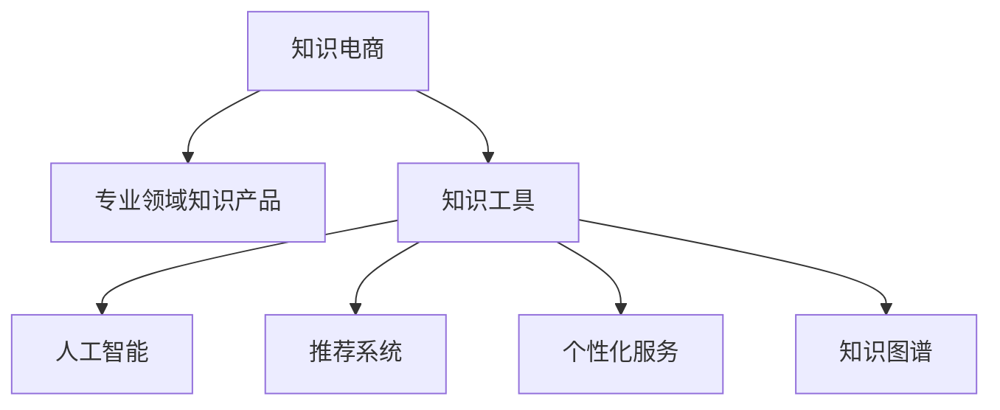

                 

# 知识电商提供专业领域的知识产品和工具

> 关键词：知识电商, 专业领域, 知识产品, 知识工具, 人工智能, 机器学习, 自然语言处理, 推荐系统, 个性化服务, 知识图谱

## 1. 背景介绍

在数字经济迅猛发展的今天，知识电商已成为推动产业发展、创新创业的重要引擎。随着互联网技术的发展和普及，越来越多的企业和个人开始通过知识分享和获取实现商业价值。然而，现有电商平台普遍存在知识结构化程度不高、知识推荐机制单一、用户体验不够个性化等问题。

在这样的背景下，探索和实践专业领域的知识产品和工具，构建能够提供精准知识服务、满足用户个性化需求的电商系统，成为知识电商领域的重要任务。本文将从理论到实践，详细探讨如何基于人工智能技术，为知识电商提供高效、智能的知识产品和工具。

## 2. 核心概念与联系

为了更好地理解知识电商中专业领域知识产品和工具的设计与实现，本节将介绍几个核心概念，并说明它们之间的联系。

### 2.1 核心概念概述

- **知识电商**：基于互联网和电子商务平台，提供知识分享和获取服务的模式。旨在通过知识传播和应用，驱动经济增长和社会进步。

- **专业领域知识产品**：在特定行业或学科内，提供深度、权威的知识内容，如专业论文、技术白皮书、案例分析等。

- **知识工具**：辅助知识生产和传播的智能化工具，如知识图谱构建工具、语义分析工具、推荐系统等。

- **人工智能**：包括机器学习、深度学习、自然语言处理等技术，用于提取、分析和生成知识。

- **推荐系统**：根据用户行为和兴趣，推荐个性化知识内容的系统，广泛应用于电商、社交、新闻等领域。

- **个性化服务**：通过数据分析和算法，实现精准、个性化的知识推荐，提升用户体验。

- **知识图谱**：将知识以图形化的方式表示，通过节点和边描述知识实体及其关系，用于知识的关联和推理。

这些核心概念之间的关系，可以通过以下Mermaid流程图来展示：



这个流程图展示了一个典型的知识电商系统，由专业领域知识产品、知识工具、人工智能、推荐系统、个性化服务和知识图谱等核心组件构成。这些组件相互配合，共同为用户提供高效、智能的知识服务。

## 3. 核心算法原理 & 具体操作步骤
### 3.1 算法原理概述

知识电商中的知识产品和工具，通常基于以下算法原理：

- **人工智能**：利用机器学习和深度学习技术，从大规模数据中提取和分析知识，生成高质量的知识内容。
- **自然语言处理(NLP)**：通过语义分析、文本分类、实体识别等技术，理解和生成自然语言文本。
- **推荐系统**：通过协同过滤、内容推荐、混合推荐等算法，为用户推荐个性化的知识内容。
- **个性化服务**：利用用户行为数据，构建用户画像，实现精准的知识推荐和个性化服务。
- **知识图谱**：通过构建知识图谱，实现知识的多维度关联和推理，提高知识的准确性和应用效果。

这些算法原理构成了知识电商系统的核心，使得系统能够高效地生产和传播知识，满足用户的个性化需求。

### 3.2 算法步骤详解

基于人工智能技术的知识电商系统，通常包括以下几个关键步骤：

1. **数据收集与预处理**：从各类来源收集知识数据，并进行清洗、格式化和标注。

2. **知识抽取与生成**：利用自然语言处理技术，从原始文本中抽取实体、关系和属性，生成结构化的知识。

3. **知识组织与存储**：通过知识图谱等工具，将知识组织成结构化的形式，存储到数据库或知识库中。

4. **知识推荐**：利用推荐系统算法，根据用户行为和兴趣，为用户推荐个性化的知识内容。

5. **个性化服务**：通过数据分析和算法，实现精准、个性化的知识推荐和个性化服务，提升用户体验。

6. **系统集成与部署**：将各组件集成到电商系统中，部署到云平台或本地服务器，供用户访问使用。

### 3.3 算法优缺点

基于人工智能技术的知识电商系统，具有以下优点：

- **效率高**：利用算法自动化知识抽取、推荐和生成，节省了大量人力成本。
- **精度高**：通过机器学习和大数据分析，生成的知识更加精准、权威。
- **个性化**：通过推荐系统和个性化服务，实现精准的知识推荐，提升用户体验。
- **易扩展**：利用云平台和微服务架构，方便系统扩展和升级。

同时，也存在一些缺点：

- **数据依赖**：系统的质量和效果很大程度上依赖于数据的质量和多样性。
- **技术复杂**：涉及多个领域的算法和技术，实现难度较大。
- **安全风险**：知识电商可能涉及敏感信息，需要重视数据安全和隐私保护。
- **用户接受度**：部分用户可能对自动化推荐和生成知识存疑，需要增加透明度和可解释性。

### 3.4 算法应用领域

基于人工智能技术的知识电商系统，已经在多个领域得到应用，例如：

- **医学领域**：提供疾病知识、药物信息、病例分析等。
- **金融领域**：提供金融报告、市场分析、投资建议等。
- **科技领域**：提供技术白皮书、专利分析、技术趋势等。
- **教育领域**：提供课程学习资料、教师备课资源、学生知识图谱等。
- **制造业领域**：提供设备维护指南、生产流程优化、供应链管理等。

## 4. 数学模型和公式 & 详细讲解 & 举例说明

### 4.1 数学模型构建

在知识电商系统中，常见的数学模型包括：

- **协同过滤模型**：用于推荐系统中的基于用户行为和物品相似度的推荐算法。
- **内容推荐模型**：基于物品特征和用户兴趣，推荐相关内容。
- **混合推荐模型**：结合协同过滤和内容推荐，提高推荐效果。

### 4.2 公式推导过程

以协同过滤模型为例，其基本思想是通过用户行为数据，构建用户和物品的相似度矩阵，实现个性化推荐。协同过滤模型的数学表达式为：

$$
\hat{y} = \alpha (u_i^T K u_j + \beta)
$$

其中，$u_i$和$u_j$分别为用户$i$和物品$j$的特征向量，$K$为相似度矩阵，$\alpha$和$\beta$为调节参数。

### 4.3 案例分析与讲解

在实际应用中，协同过滤模型常用于电商平台的商品推荐。例如，某电商网站通过分析用户浏览和购买行为，构建用户和商品的相似度矩阵，预测用户可能感兴趣的商品，并进行推荐。这种推荐方法简单高效，但需要大量的用户行为数据进行训练。

## 5. 项目实践：代码实例和详细解释说明
### 5.1 开发环境搭建

在进行知识电商系统开发前，我们需要准备好开发环境。以下是使用Python进行Flask开发的简单配置流程：

1. 安装Python和Flask：
```bash
sudo apt-get install python3 python3-pip
pip3 install flask
```

2. 创建Flask应用：
```python
from flask import Flask

app = Flask(__name__)

@app.route('/')
def index():
    return "Hello, World!"
```

3. 运行Flask应用：
```bash
export FLASK_APP=app.py
flask run --host=0.0.0.0
```

完成上述步骤后，即可在本地运行Flask应用，并在浏览器中访问`http://localhost:5000`。

### 5.2 源代码详细实现

这里我们以基于推荐系统的电商推荐系统为例，给出Flask应用的代码实现。

```python
from flask import Flask, request
import pandas as pd

app = Flask(__name__)

# 加载用户行为数据
data = pd.read_csv('user_behavior.csv')

@app.route('/recommend', methods=['POST'])
def recommend():
    user_id = request.json['user_id']
    item_ids = request.json['item_ids']
    similarity_matrix = compute_similarity_matrix(user_id, item_ids)
    predicted_item_ids = predict_top_items(similarity_matrix)
    return {'predicted_item_ids': predicted_item_ids}

def compute_similarity_matrix(user_id, item_ids):
    # 计算用户和物品的相似度矩阵
    # 具体实现略
    pass

def predict_top_items(similarity_matrix):
    # 根据相似度矩阵，预测用户可能感兴趣的商品
    # 具体实现略
    pass

if __name__ == '__main__':
    app.run(host='0.0.0.0', port=5000)
```

### 5.3 代码解读与分析

让我们再详细解读一下关键代码的实现细节：

**Flask应用**：
- `index`方法：定义了一个简单的首页，返回"Hello, World!"。
- `recommend`方法：接收用户ID和商品ID列表，调用`compute_similarity_matrix`和`predict_top_items`方法，返回预测的商品ID列表。

**用户行为数据**：
- `user_behavior.csv`：包含用户浏览、购买等行为数据的CSV文件。

**相似度矩阵计算**：
- `compute_similarity_matrix`方法：根据用户ID和商品ID，计算用户和商品的相似度矩阵。

**商品推荐预测**：
- `predict_top_items`方法：根据相似度矩阵，预测用户可能感兴趣的商品ID列表。

### 5.4 运行结果展示

在运行上述代码后，可以通过以下URL访问推荐系统：
```
http://localhost:5000/recommend
```

接收POST请求，格式如下：
```json
{
    "user_id": 123,
    "item_ids": [1, 2, 3, 4, 5]
}
```

返回结果格式如下：
```json
{
    "predicted_item_ids": [3, 4, 5]
}
```

这意味着对于用户ID为123，浏览过商品ID为1, 2, 3, 4, 5，推荐系统预测其可能感兴趣的商品ID为3, 4, 5。

## 6. 实际应用场景
### 6.1 医学知识推荐

医学知识推荐系统，可以为用户提供疾病知识、药物信息、病例分析等专业内容，帮助医生和患者更好地理解和治疗疾病。

在技术实现上，可以收集医院病历、病例分析、医学文献等数据，构建知识图谱，并利用推荐算法为用户推荐相关内容。例如，某患者被诊断为某种疾病，系统可以根据其病情、过往病史和医生建议，推荐相关治疗方案、药物副作用等信息，帮助其做出科学决策。

### 6.2 金融市场分析

金融市场分析系统，可以为用户提供市场行情、投资建议、风险评估等专业内容，帮助投资者做出更明智的投资决策。

在技术实现上，可以收集金融市场数据、公司财报、分析师报告等，构建知识图谱，并利用推荐算法为用户推荐相关内容。例如，某投资者关注某一股票，系统可以根据其投资偏好和历史交易记录，推荐相关的市场分析报告、投资策略等信息，帮助其优化投资组合。

### 6.3 科技趋势预测

科技趋势预测系统，可以为用户提供最新的技术进展、创新应用、技术路线图等专业内容，帮助开发者和企业了解科技前沿动态。

在技术实现上，可以收集技术专利、论文、会议报告等，构建知识图谱，并利用推荐算法为用户推荐相关内容。例如，某开发者关注某一技术领域，系统可以根据其兴趣和关注点，推荐最新的技术论文、专利、项目案例等信息，帮助其跟踪技术发展趋势。

## 7. 工具和资源推荐
### 7.1 学习资源推荐

为了帮助开发者系统掌握知识电商系统的理论基础和实践技巧，这里推荐一些优质的学习资源：

1. **《深度学习理论与实践》**：讲解深度学习的基本原理和应用，适合初学者和中级开发者。

2. **《自然语言处理与深度学习》**：介绍自然语言处理技术的基本概念和应用，包括文本分类、情感分析、命名实体识别等。

3. **《推荐系统算法》**：讲解推荐系统的基本原理和算法，包括协同过滤、内容推荐、混合推荐等。

4. **《人工智能与大数据》**：讲解人工智能和大数据技术的基本原理和应用，适合全面了解人工智能技术的开发者。

5. **Kaggle数据科学竞赛平台**：提供大量数据集和算法竞赛，帮助开发者实践和提升技能。

6. **Coursera在线课程**：提供各种人工智能和数据科学的课程，包括Python、机器学习、深度学习等。

通过对这些资源的学习实践，相信你一定能够快速掌握知识电商系统的精髓，并用于解决实际的电商问题。

### 7.2 开发工具推荐

高效的开发离不开优秀的工具支持。以下是几款用于知识电商系统开发的常用工具：

1. **Flask**：基于Python的Web框架，简单易用，适合快速搭建Web应用。

2. **Django**：基于Python的Web框架，功能强大，适合构建复杂Web应用。

3. **TensorFlow**：由Google主导开发的深度学习框架，适合大规模模型训练和推理。

4. **PyTorch**：Facebook开源的深度学习框架，适合动态图模型训练和推理。

5. **Keras**：高层次的深度学习框架，适合快速搭建和测试深度学习模型。

6. **Elasticsearch**：开源的分布式搜索与分析引擎，适合构建知识图谱和推荐系统。

7. **Jupyter Notebook**：开源的交互式编程环境，适合数据科学和机器学习实践。

合理利用这些工具，可以显著提升知识电商系统的开发效率，加快创新迭代的步伐。

### 7.3 相关论文推荐

知识电商系统的研究和实践，离不开学界的持续探索和支持。以下是几篇奠基性的相关论文，推荐阅读：

1. **《深度学习中的协同过滤》**：讲解协同过滤算法的原理和应用，适合了解推荐系统基础。

2. **《基于知识图谱的推荐系统》**：介绍知识图谱在推荐系统中的应用，适合深入了解知识图谱技术。

3. **《深度学习在自然语言处理中的应用》**：介绍深度学习在自然语言处理中的应用，适合了解NLP技术。

4. **《机器学习在金融市场分析中的应用》**：介绍机器学习在金融市场分析中的应用，适合了解金融领域的数据分析和推荐系统。

5. **《深度学习在医学知识推荐中的应用》**：介绍深度学习在医学知识推荐中的应用，适合了解医疗领域的数据分析和推荐系统。

这些论文代表了大语言模型微调技术的发展脉络。通过学习这些前沿成果，可以帮助研究者把握学科前进方向，激发更多的创新灵感。

## 8. 总结：未来发展趋势与挑战
### 8.1 总结

本文对知识电商中基于人工智能的知识产品和工具进行了全面系统的介绍。首先阐述了知识电商的研究背景和意义，明确了知识产品和工具在提升用户个性化体验、促进产业发展方面的独特价值。其次，从理论到实践，详细讲解了知识产品和工具的设计与实现过程，给出了具体的代码实现和运行结果展示。同时，本文还广泛探讨了知识产品和工具在医学、金融、科技等不同领域的应用前景，展示了知识电商的广阔潜力。此外，本文精选了知识产品和工具的学习资源和开发工具，力求为开发者提供全方位的技术指引。

通过本文的系统梳理，可以看到，基于人工智能的知识电商系统正在成为电商领域的重要趋势，极大地拓展了电商系统的应用边界，催生了更多的落地场景。受益于人工智能技术的发展，知识电商必将在智慧城市、智能医疗、智慧金融等垂直行业大放异彩，为经济社会的发展注入新的动力。

### 8.2 未来发展趋势

展望未来，知识电商系统将呈现以下几个发展趋势：

1. **数据多样化和实时化**：随着物联网、智能穿戴设备等技术的普及，知识电商将采集更多类型的数据，实现实时化的知识推荐。

2. **个性化服务的深度定制**：利用用户画像和行为数据，实现更加精准、个性化的推荐和服务。

3. **跨领域知识的融合**：知识电商将整合跨领域的知识，构建更加全面、系统的知识图谱，提升知识推荐的准确性和广度。

4. **算法和模型的优化**：不断优化推荐算法和模型，提升知识推荐的效果和速度，降低计算成本。

5. **智能化的决策支持**：知识电商将结合人工智能技术，实现智能化的决策支持，帮助用户做出更好的选择。

6. **多模态知识的融合**：知识电商将整合视觉、听觉、文本等多模态信息，提升知识推荐的效果。

以上趋势凸显了知识电商系统的广阔前景。这些方向的探索发展，必将进一步提升知识电商系统的性能和应用范围，为电商系统注入新的活力。

### 8.3 面临的挑战

尽管知识电商系统已经取得了瞩目成就，但在迈向更加智能化、普适化应用的过程中，它仍面临着诸多挑战：

1. **数据获取和标注成本高**：知识电商需要大量高质量的数据进行训练和优化，数据获取和标注成本高昂。

2. **算法复杂度高**：知识电商系统涉及多个领域的算法和技术，实现难度较大。

3. **用户隐私保护**：知识电商系统需要处理大量用户数据，隐私保护和安全问题不容忽视。

4. **算法可解释性差**：知识电商系统中的推荐算法和模型往往是"黑盒"系统，难以解释其内部工作机制和决策逻辑。

5. **模型泛化能力弱**：知识电商系统需要在不同场景下保持一致的效果，但目前许多模型在迁移学习方面仍存在不足。

6. **技术更新快**：知识电商系统需要不断更新技术和算法，才能跟上技术发展的步伐。

### 8.4 研究展望

面对知识电商系统所面临的挑战，未来的研究需要在以下几个方面寻求新的突破：

1. **提升数据获取和标注效率**：探索无监督学习、半监督学习等方法，降低数据标注成本。

2. **简化算法和模型结构**：开发更加高效、易于理解和解释的算法和模型，降低实现难度。

3. **强化隐私保护和数据安全**：引入隐私保护和数据安全技术，保障用户数据的安全。

4. **提高算法的可解释性**：利用可解释性技术，如LIME、SHAP等，增强算法的透明性和可理解性。

5. **增强模型的泛化能力**：探索迁移学习和多模态学习技术，提升模型的泛化性能。

6. **利用最新技术和算法**：不断引入最新的人工智能技术和算法，提升知识电商系统的性能和应用效果。

这些研究方向的探索，必将引领知识电商系统迈向更高的台阶，为构建智能化的电商系统铺平道路。面向未来，知识电商系统还需要与其他人工智能技术进行更深入的融合，如知识表示、因果推理、强化学习等，多路径协同发力，共同推动电商系统的创新和进步。只有勇于创新、敢于突破，才能不断拓展知识电商系统的边界，让智能技术更好地服务于用户和社会。

## 9. 附录：常见问题与解答

**Q1：知识电商系统的核心是什么？**

A: 知识电商系统的核心是利用人工智能技术，为电商系统提供高效、智能的知识产品和工具。这些产品包括专业领域的知识内容、知识图谱、推荐系统等，能够帮助用户获取和理解知识，提升电商系统的用户粘性和价值。

**Q2：知识电商系统的关键技术是什么？**

A: 知识电商系统的关键技术包括自然语言处理、推荐系统、知识图谱等。这些技术共同构成了知识电商系统的技术框架，能够高效地生成和推荐知识内容，满足用户的个性化需求。

**Q3：知识电商系统的主要应用场景是什么？**

A: 知识电商系统在医学、金融、科技等领域有广泛的应用场景。例如，医学知识推荐系统、金融市场分析系统、科技趋势预测系统等，能够为用户提供专业的知识内容和服务，帮助其做出更明智的决策。

**Q4：知识电商系统的开发流程是什么？**

A: 知识电商系统的开发流程包括以下几个步骤：
1. 数据收集与预处理。从各类来源收集知识数据，并进行清洗、格式化和标注。
2. 知识抽取与生成。利用自然语言处理技术，从原始文本中抽取实体、关系和属性，生成结构化的知识。
3. 知识组织与存储。通过知识图谱等工具，将知识组织成结构化的形式，存储到数据库或知识库中。
4. 知识推荐。利用推荐系统算法，根据用户行为和兴趣，为用户推荐个性化的知识内容。
5. 个性化服务。通过数据分析和算法，实现精准、个性化的知识推荐和个性化服务，提升用户体验。

**Q5：知识电商系统的发展趋势是什么？**

A: 知识电商系统的发展趋势包括以下几个方面：
1. 数据多样化和实时化。随着物联网、智能穿戴设备等技术的普及，知识电商将采集更多类型的数据，实现实时化的知识推荐。
2. 个性化服务的深度定制。利用用户画像和行为数据，实现更加精准、个性化的推荐和服务。
3. 跨领域知识的融合。知识电商将整合跨领域的知识，构建更加全面、系统的知识图谱，提升知识推荐的准确性和广度。
4. 算法和模型的优化。不断优化推荐算法和模型，提升知识推荐的效果和速度，降低计算成本。
5. 智能化的决策支持。知识电商将结合人工智能技术，实现智能化的决策支持，帮助用户做出更好的选择。
6. 多模态知识的融合。知识电商将整合视觉、听觉、文本等多模态信息，提升知识推荐的效果。

**Q6：知识电商系统的挑战是什么？**

A: 知识电商系统面临以下挑战：
1. 数据获取和标注成本高。知识电商需要大量高质量的数据进行训练和优化，数据获取和标注成本高昂。
2. 算法复杂度高。知识电商系统涉及多个领域的算法和技术，实现难度较大。
3. 用户隐私保护。知识电商系统需要处理大量用户数据，隐私保护和安全问题不容忽视。
4. 算法可解释性差。知识电商系统中的推荐算法和模型往往是"黑盒"系统，难以解释其内部工作机制和决策逻辑。
5. 模型泛化能力弱。知识电商系统需要在不同场景下保持一致的效果，但目前许多模型在迁移学习方面仍存在不足。
6. 技术更新快。知识电商系统需要不断更新技术和算法，才能跟上技术发展的步伐。

**Q7：知识电商系统的未来展望是什么？**

A: 知识电商系统的未来展望包括以下几个方面：
1. 提升数据获取和标注效率。探索无监督学习、半监督学习等方法，降低数据标注成本。
2. 简化算法和模型结构。开发更加高效、易于理解和解释的算法和模型，降低实现难度。
3. 强化隐私保护和数据安全。引入隐私保护和数据安全技术，保障用户数据的安全。
4. 提高算法的可解释性。利用可解释性技术，如LIME、SHAP等，增强算法的透明性和可理解性。
5. 增强模型的泛化能力。探索迁移学习和多模态学习技术，提升模型的泛化性能。
6. 利用最新技术和算法。不断引入最新的人工智能技术和算法，提升知识电商系统的性能和应用效果。

**Q8：知识电商系统的应用前景是什么？**

A: 知识电商系统的应用前景广阔，主要包括：
1. 医学知识推荐。提供疾病知识、药物信息、病例分析等专业内容，帮助医生和患者更好地理解和治疗疾病。
2. 金融市场分析。提供市场行情、投资建议、风险评估等专业内容，帮助投资者做出更明智的投资决策。
3. 科技趋势预测。提供最新的技术进展、创新应用、技术路线图等专业内容，帮助开发者和企业了解科技前沿动态。
4. 教育资源推荐。提供课程学习资料、教师备课资源、学生知识图谱等，帮助学生更好地学习。
5. 企业知识管理。提供内部知识分享和检索，帮助企业知识管理，提升知识转化效率。

**Q9：知识电商系统的开发工具有哪些？**

A: 知识电商系统的开发工具包括：
1. Flask。基于Python的Web框架，简单易用，适合快速搭建Web应用。
2. Django。基于Python的Web框架，功能强大，适合构建复杂Web应用。
3. TensorFlow。由Google主导开发的深度学习框架，适合大规模模型训练和推理。
4. PyTorch。Facebook开源的深度学习框架，适合动态图模型训练和推理。
5. Keras。高层次的深度学习框架，适合快速搭建和测试深度学习模型。
6. Elasticsearch。开源的分布式搜索与分析引擎，适合构建知识图谱和推荐系统。
7. Jupyter Notebook。开源的交互式编程环境，适合数据科学和机器学习实践。

作者：禅与计算机程序设计艺术 / Zen and the Art of Computer Programming

