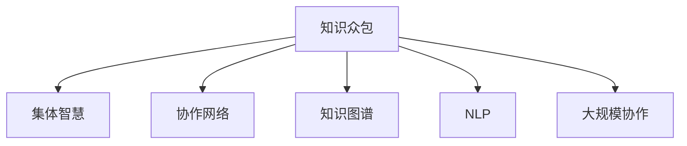

                 

# 知识的众包与协作：集体智慧的力量

> 关键词：知识众包,集体智慧,协作网络,知识图谱,自然语言处理,大规模协作

## 1. 背景介绍

### 1.1 问题由来
随着互联网和社交媒体的普及，全球范围内的知识和智慧以前所未有的速度被生产、传播和利用。这种知识生产的爆炸式增长，不仅改变了人类的认知方式，也带来了全新的合作方式：知识众包。

知识众包（Knowledge Crowdsourcing）是一种新兴的协作模式，它通过网络平台汇聚全球的智慧，共同解决复杂问题，实现知识的协同生产和应用。与传统知识生产方式相比，知识众包不仅速度更快，成本更低，而且更加灵活、民主、透明。

在知识众包的过程中，每个参与者都是知识的生产者，他们通过网络平台，以协作的方式共同完成特定的任务，分享自己的见解和知识，从而推动整个社会知识系统的进步。这种集体智慧的力量，正在逐步改变传统的知识生产和应用方式，推动各行各业的变革与创新。

### 1.2 问题核心关键点
知识众包的核心关键点在于如何利用集体智慧，高效、透明、低成本地进行知识的生产、共享和应用。这涉及到以下几个关键问题：
- 如何构建一个高效的知识生产平台，以吸引和组织全球的知识生产者？
- 如何设计合理的知识共享机制，促进知识的传播和利用？
- 如何构建大规模的知识协作网络，实现知识生产者之间的有效互动？
- 如何通过数据分析和机器学习技术，提升知识生产的效率和质量？

这些问题涉及到了平台设计、机制设计、网络构建、技术应用等多个层面，需要综合运用系统工程、社会网络分析、大数据、人工智能等多种技术手段。

### 1.3 问题研究意义
研究知识众包的概念和实现方式，对于推动知识生产的民主化、透明化和高效化，具有重要的理论和实践意义：

1. 促进知识共享。通过知识众包平台，可以跨越地域、文化和语言障碍，实现知识的全球共享，打破信息孤岛，促进知识交流。
2. 加速知识创新。集体的智慧汇聚可以带来新的视角和方法，加速知识的生产与创新，推动技术进步和产业升级。
3. 降低知识获取成本。知识众包平台提供了一种低成本的知识获取方式，降低了企业的研发和运营成本。
4. 提升知识生产的灵活性。知识众包模式具有高度的灵活性，可以根据任务需求动态组织知识生产者，快速响应市场变化。
5. 推动社会公平。知识众包为普通人提供了一种新的参与社会知识生产的方式，缩小了知识获取的差距，推动社会公平。

## 2. 核心概念与联系

### 2.1 核心概念概述

为了更好地理解知识众包的概念和实现方式，本节将介绍几个密切相关的核心概念：

- 知识众包(Knowledge Crowdsourcing)：通过网络平台汇聚全球的智慧，共同解决复杂问题，实现知识的协同生产和应用。
- 集体智慧(Collective Intelligence)：由多个智慧体共同作用产生的一种集体性智慧，具有更高的创新性和适应性。
- 协作网络(Collaborative Network)：知识生产者之间的互动网络，通过网络结构传递知识和智慧，实现信息的高效流动。
- 知识图谱(Knowledge Graph)：将知识以图谱的形式组织和呈现，构建出知识之间的关联和层次，促进知识的发现和应用。
- 自然语言处理(Natural Language Processing, NLP)：通过计算机技术处理和理解自然语言，实现知识抽取、关系推理等任务。
- 大规模协作(Massive Collaboration)：在高度分工的现代社会中，通过网络和平台实现大规模的协作，共同完成复杂任务。

这些核心概念之间的逻辑关系可以通过以下Mermaid流程图来展示：



这个流程图展示了一系列关键概念及其之间的关系：

1. 知识众包是集体智慧的实现方式之一，通过平台汇聚智慧，实现协同生产。
2. 协作网络是知识众包的基础设施，通过网络结构传递智慧。
3. 知识图谱是知识组织和呈现的方式，有助于知识的发现和应用。
4. NLP是实现知识众包的重要技术手段，通过自然语言处理技术，实现知识的抽取和推理。
5. 大规模协作是知识众包的前提条件，只有大规模协作才能实现知识的协同生产和应用。

这些概念共同构成了知识众包的框架，使其能够在不同的应用场景下发挥强大的协同作用。

## 3. 核心算法原理 & 具体操作步骤
### 3.1 算法原理概述

知识众包的核心算法原理在于利用集体智慧，高效、透明地进行知识的生产和应用。其核心思想是：将复杂的问题分解成小的子任务，通过网络平台汇聚全球的知识生产者，共同完成这些子任务，并将生产结果进行整合，形成最终的知识成果。

形式化地，假设知识生产的任务为 $T$，网络平台汇聚的知识生产者集合为 $P$，每个生产者 $p_i$ 的贡献为 $c_i$，最终的知识成果为 $K$。知识众包的优化目标是最小化生产成本 $C$，同时最大化知识成果 $K$ 的质量。

$$
\min_{p_i} C \quad \text{s.t.} \quad K = f(T, c_1, c_2, \dots, c_n)
$$

其中 $f$ 为知识生产函数，将知识生产任务和生产者贡献整合为知识成果。

### 3.2 算法步骤详解

知识众包的过程通常包括以下几个关键步骤：

**Step 1: 任务分解与设计**
- 将复杂的知识生产任务分解成小的子任务，并定义明确的任务目标和评价标准。
- 设计合适的激励机制和评估指标，吸引知识生产者参与，并激励其高效完成任务。

**Step 2: 知识生产者招募与组织**
- 通过网络平台汇聚全球的知识生产者，并对其进行筛选和培训，确保其具备完成任务所需的技能和素质。
- 组织生产者进行分组协作，形成高效的知识生产团队。

**Step 3: 知识生产与整合**
- 每个知识生产者独立完成任务，并上传结果到平台。
- 平台对上传结果进行整合，通过数据清洗、质量控制等手段，形成高质量的知识成果。

**Step 4: 知识应用与推广**
- 将知识成果应用于具体的场景中，验证其有效性和可靠性。
- 通过网络平台推广知识成果，促进知识的传播和应用。

### 3.3 算法优缺点

知识众包作为一种新兴的协作模式，具有以下优点：
1. 高效性。通过汇聚全球智慧，可以快速完成复杂任务，提高知识生产效率。
2. 成本低。相比于传统知识生产方式，知识众包平台的运营成本较低，可以快速回收收益。
3. 灵活性。可以根据任务需求动态组织生产者，灵活应对市场变化。
4. 民主性。知识众包平台为每个人提供了平等的参与机会，促进了知识的民主化。
5. 透明性。知识生产过程和结果在平台上公开透明，便于监管和改进。

同时，知识众包也存在一些局限性：
1. 质量控制难度大。由于知识生产者背景不同，水平参差不齐，需要设计合理的质量控制机制。
2. 激励机制复杂。设计有效的激励机制，吸引高质量的生产者，并避免激励过度导致质量下降。
3. 数据隐私风险。平台需要收集和处理大量个人数据，存在数据隐私和安全的风险。
4. 协同效率低。知识生产者之间可能存在沟通不畅、协作低效等问题，影响整体效果。

尽管存在这些局限性，但就目前而言，知识众包仍然是一种非常有效和有潜力的协作模式，值得进一步研究和推广。

### 3.4 算法应用领域

知识众包的应用领域非常广泛，涉及各行各业。以下是几个典型的应用场景：

- **科学研究**：通过知识众包平台，汇集全球科学家的智慧，共同解决复杂科研问题，推动科学进步。
- **软件开发**：利用知识众包模式，快速获取高质量的软件测试用例，提高软件质量和开发效率。
- **疾病治疗**：在医疗领域，通过知识众包平台汇聚全球医生的智慧，共同研究和开发新疗法，提升医疗水平。
- **教育培训**：利用知识众包模式，汇聚全球教育工作者的智慧，开发高质量的教育资源和课程，提升教育质量。
- **城市治理**：在城市管理中，通过知识众包平台，汇聚全球市民的智慧，共同解决城市治理中的问题，提升城市管理水平。
- **社会创新**：在社会创新中，通过知识众包平台，汇聚全球创业者和创新者的智慧，共同推动社会创新和变革。

## 4. 数学模型和公式 & 详细讲解 & 举例说明

### 4.1 数学模型构建

本节将使用数学语言对知识众包的过程进行更加严格的刻画。

假设知识生产任务为 $T$，网络平台汇聚的知识生产者集合为 $P$，每个生产者 $p_i$ 的贡献为 $c_i$，最终的知识成果为 $K$。定义知识生产过程为 $f$，则知识众包的优化目标为：

$$
\min_{p_i} C \quad \text{s.t.} \quad K = f(T, c_1, c_2, \dots, c_n)
$$

其中 $C$ 为知识生产成本，$K$ 为知识成果的质量。

### 4.2 公式推导过程

以下我们以一个简单的知识生产任务为例，推导知识生产函数 $f$ 的计算公式。

假设知识生产任务 $T$ 为生成一篇关于 "人工智能" 的文章，每个生产者 $p_i$ 的贡献 $c_i$ 为写作时间，最终的知识成果 $K$ 为文章质量。生产函数 $f$ 可以表示为：

$$
K = \sum_{i=1}^N c_i \cdot g_i(T)
$$

其中 $g_i$ 为第 $i$ 个生产者的质量函数，用于评估其贡献的质量。

将生产函数代入优化目标，得到：

$$
\min_{p_i} C \quad \text{s.t.} \quad K = \sum_{i=1}^N c_i \cdot g_i(T)
$$

其中 $C = \sum_{i=1}^N c_i$ 为知识生产成本。

根据链式法则，知识生产函数对参数 $c_i$ 的梯度为：

$$
\frac{\partial K}{\partial c_i} = g_i(T)
$$

将梯度代入优化目标，得到优化目标的梯度公式：

$$
\frac{\partial C}{\partial c_i} = -g_i(T)
$$

使用梯度下降等优化算法，不断更新每个生产者 $p_i$ 的贡献 $c_i$，直至达到最优生产成本和知识成果质量。

### 4.3 案例分析与讲解

假设有一个在线教育平台，需要生产高质量的教学资源。平台通过知识众包模式，汇聚全球教师的智慧，共同完成这一任务。具体步骤如下：

1. **任务分解与设计**：将教学资源生产任务分解成小的子任务，如编写课程大纲、编写教案、录制视频等，并定义明确的任务目标和评价标准。

2. **知识生产者招募与组织**：通过网络平台，公开招募全球教师，并对参与者进行筛选和培训，确保其具备完成任务所需的技能和素质。

3. **知识生产与整合**：每个教师独立完成任务，并上传结果到平台。平台对上传结果进行整合，通过数据清洗、质量控制等手段，形成高质量的教学资源。

4. **知识应用与推广**：将教学资源应用于具体的课程中，验证其有效性和可靠性。通过网络平台推广教学资源，促进知识的传播和应用。

在这个案例中，知识众包模式通过汇聚全球教师的智慧，快速生产出高质量的教学资源，提升了在线教育的质量和效率。

## 5. 项目实践：代码实例和详细解释说明
### 5.1 开发环境搭建

在进行知识众包项目的实践前，我们需要准备好开发环境。以下是使用Python进行Flask开发的开发环境配置流程：

1. 安装Anaconda：从官网下载并安装Anaconda，用于创建独立的Python环境。

2. 创建并激活虚拟环境：
```bash
conda create -n flask-env python=3.8 
conda activate flask-env
```

3. 安装Flask：
```bash
pip install Flask
```

4. 安装必要的依赖：
```bash
pip install Jinja2 gunicorn Flask-RESTful
```

5. 安装MySQL数据库连接库：
```bash
pip install mysql-connector-python
```

完成上述步骤后，即可在`flask-env`环境中开始知识众包项目的开发。

### 5.2 源代码详细实现

下面我们以一个简单的知识众包平台为例，给出使用Flask和MySQL实现的知识生产任务管理系统的代码实现。

首先，定义MySQL数据库连接信息：

```python
import mysql.connector

config = {
    'host': 'localhost',
    'user': 'root',
    'password': 'password',
    'database': 'knowledge_crowdsourcing'
}
```

然后，定义Flask应用：

```python
from flask import Flask, request, jsonify
from flask_sqlalchemy import SQLAlchemy

app = Flask(__name__)
app.config['SQLALCHEMY_DATABASE_URI'] = 'mysql+mysqlconnector://{}:{}@{}/{}'
app.config['SQLALCHEMY_TRACK_MODIFICATIONS'] = False
db = SQLAlchemy(app)
```

接着，定义MySQL数据模型：

```python
class Task(db.Model):
    id = db.Column(db.Integer, primary_key=True)
    name = db.Column(db.String(255))
    description = db.Column(db.Text)
    creator_id = db.Column(db.Integer)
    status = db.Column(db.String(50))

class Contribution(db.Model):
    id = db.Column(db.Integer, primary_key=True)
    task_id = db.Column(db.Integer, db.ForeignKey('task.id'))
    producer_id = db.Column(db.Integer)
    contribution_time = db.Column(db.DateTime)
    contribution_content = db.Column(db.Text)
    quality_score = db.Column(db.Float)
```

定义数据库迁移：

```python
from flask_migrate import Migrate
migrate = Migrate(app, db)
```

定义路由和业务逻辑：

```python
@app.route('/tasks', methods=['GET', 'POST'])
def task_list():
    tasks = Task.query.all()
    return jsonify([{'id': t.id, 'name': t.name, 'description': t.description, 'creator_id': t.creator_id, 'status': t.status} for t in tasks])

@app.route('/tasks/<int:id>', methods=['GET', 'DELETE'])
def task_detail(id):
    task = Task.query.filter_by(id=id).first_or_404()
    db.session.delete(task)
    db.session.commit()
    return jsonify({'message': 'Task deleted successfully'})

@app.route('/tasks/<int:id>/contributions', methods=['POST'])
def task_contribute(id):
    contribution = Contribution(task_id=id, producer_id=request.json['producer_id'], contribution_time=request.json['contribution_time'], contribution_content=request.json['contribution_content'], quality_score=request.json['quality_score'])
    db.session.add(contribution)
    db.session.commit()
    return jsonify({'message': 'Contribution added successfully'})

@app.route('/tasks/<int:id>/contributions', methods=['GET'])
def task_contributions(id):
    task = Task.query.filter_by(id=id).first_or_404()
    contributions = Contribution.query.filter_by(task_id=id).all()
    return jsonify([{'id': c.id, 'producer_id': c.producer_id, 'contribution_time': c.contribution_time, 'contribution_content': c.contribution_content, 'quality_score': c.quality_score} for c in contributions])
```

最后，启动Flask应用：

```python
if __name__ == '__main__':
    app.run(debug=True)
```

完成上述步骤后，即可通过Flask开发知识众包平台，实现任务管理、贡献上传等功能。

### 5.3 代码解读与分析

让我们再详细解读一下关键代码的实现细节：

**MySQL数据库连接信息**：
- 使用 `mysql.connector` 库连接到 MySQL 数据库，定义连接参数和数据库名。

**Flask应用**：
- 使用 `Flask` 框架创建应用对象，并设置 MySQL 数据库连接信息。

**数据模型**：
- 定义 `Task` 和 `Contribution` 两个数据模型，分别表示任务和贡献信息。
- 使用 `db.Column` 定义模型属性，其中 `id` 为主键，`name` 为任务名称，`description` 为任务描述，`creator_id` 为任务创建者ID，`status` 为任务状态。
- 定义 `Contribution` 模型时，除上述属性外，还添加了 `quality_score` 属性，用于评估贡献质量。

**数据库迁移**：
- 使用 `Flask-Migrate` 库进行数据库迁移，生成数据库迁移脚本。

**路由和业务逻辑**：
- 定义 `/tasks` 路由，用于获取所有任务列表。
- 定义 `/task/<int:id>` 路由，用于获取、删除任务详情。
- 定义 `/tasks/<int:id>/contributions` 路由，用于上传、获取任务贡献信息。
- 在业务逻辑中，使用 `Task.query` 和 `Contribution.query` 进行数据库查询和操作。

**启动Flask应用**：
- 使用 `app.run` 方法启动Flask应用，并在开发模式下运行。

可以看到，Flask框架提供了强大的路由和视图机制，使得知识众包平台的开发变得简单高效。开发者可以通过简单的代码实现复杂的功能，从而快速构建知识众包系统。

当然，工业级的系统实现还需考虑更多因素，如任务调度、贡献审核、质量评估、统计分析等。但核心的知识众包逻辑基本与此类似。

## 6. 实际应用场景
### 6.1 科学研究

在科学研究领域，知识众包模式具有广泛的应用前景。传统的科研往往需要多年的积累和大量的人力物力，而知识众包模式可以大大缩短科研周期，提高科研效率。

例如，基因组学领域需要大量的数据分析和验证工作，传统的科研团队难以快速完成。通过知识众包平台，可以汇聚全球科学家共同参与，快速处理基因组数据，推动基因组学研究的发展。

在制药领域，新药研发周期漫长、成本高昂，知识众包平台可以为药企提供快速、低成本的新药筛选和验证方案，加速新药的研发进程。

### 6.2 软件开发

在软件开发领域，知识众包模式可以用于快速获取高质量的测试用例和代码修复方案，提高软件质量和开发效率。

例如，GitHub上的开源项目通常需要社区成员的积极参与和贡献，通过知识众包模式，可以汇聚全球程序员共同完成测试用例的编写和代码修复，提升代码质量和项目成熟度。

企业级应用项目中也常采用知识众包模式，通过众包平台汇聚程序员的智慧，快速解决开发中遇到的复杂问题。

### 6.3 城市治理

在城市治理领域，知识众包模式可以用于收集和处理市民意见，提升城市管理水平。

例如，智慧城市项目需要大量的市民参与和数据采集，通过知识众包平台，可以汇聚全球市民共同参与城市治理，提升城市服务的质量和效率。

城市规划项目中，知识众包平台可以用于收集市民的意见和建议，帮助城市规划师制定科学合理的规划方案，提升城市的可持续发展能力。

### 6.4 未来应用展望

随着知识众包模式的发展和普及，其应用范围将进一步拓展，涵盖更多的领域和行业。未来，知识众包将可能应用于以下几个领域：

- **教育培训**：在教育领域，知识众包平台可以用于开发高质量的教育资源和课程，提升教育质量。

- **医疗健康**：在医疗领域，知识众包平台可以用于汇聚全球医生的智慧，共同研究和开发新疗法，提升医疗水平。

- **金融财经**：在金融领域，知识众包平台可以用于金融舆情监测、智能投顾、风险评估等，提升金融决策的科学性和准确性。

- **文化艺术**：在文化艺术领域，知识众包平台可以用于收集和处理各类文化艺术作品，推动文化艺术的发展。

- **环境治理**：在环境保护领域，知识众包平台可以用于环保数据采集、环境监测、污染治理等，提升环境保护的效果和效率。

随着技术的进步和应用的普及，知识众包模式将逐步深入到各个领域，推动社会进步和经济发展。

## 7. 工具和资源推荐
### 7.1 学习资源推荐

为了帮助开发者系统掌握知识众包的概念和实现方式，这里推荐一些优质的学习资源：

1. 《分布式人工智能：构建大规模协作平台》一书：详细介绍了知识众包和分布式人工智能的相关概念和技术，适合初学者和进阶开发者阅读。

2. 《大规模协作系统设计》课程：由多伦多大学开设的课程，深入浅出地讲解了知识众包系统的设计原理和实践方法。

3. 《知识众包：集体智慧的力量》论文：全面介绍了知识众包的理论基础和应用案例，适合学术界和产业界的研究人员参考。

4. 《大规模知识图谱构建与查询》课程：由斯坦福大学开设的课程，介绍了知识图谱的构建和查询技术，适合数据科学家和知识工程师学习。

5. 《自然语言处理基础》课程：由Coursera平台开设的课程，介绍了自然语言处理的基本概念和应用方法，适合初学者和NLP工程师学习。

通过对这些资源的学习实践，相信你一定能够快速掌握知识众包的概念和实现方式，并用于解决实际的NLP问题。

### 7.2 开发工具推荐

高效的开发离不开优秀的工具支持。以下是几款用于知识众包开发的常用工具：

1. Flask：轻量级的Web框架，支持Python，适用于快速开发知识众包平台。

2. MySQL：开源的关系型数据库，适用于存储和管理知识众包数据。

3. Git：分布式版本控制系统，适用于管理知识众包平台上的代码和数据版本。

4. Jupyter Notebook：交互式编程环境，适用于进行数据分析和机器学习任务。

5. TensorFlow：开源的深度学习框架，适用于构建知识众包平台上的机器学习模型。

6. Grafana：开源的可视化工具，适用于监控和管理知识众包平台上的系统指标。

合理利用这些工具，可以显著提升知识众包项目的开发效率，加快创新迭代的步伐。

### 7.3 相关论文推荐

知识众包和集体智慧的研究涉及了多个学科领域，以下是几篇具有代表性的论文，推荐阅读：

1. 《Knowledge Crowdsourcing: A Survey》：综述了知识众包领域的研究进展和应用案例，适合了解该领域的最新动态。

2. 《Collective Intelligence: Principles and Opportunities》：探讨了集体智慧的理论基础和实现方法，适合深入理解该概念。

3. 《Massive Online Collaborative Innovation Platforms》：介绍了大规模在线协作平台的设计原理和实践方法，适合参考实际应用。

4. 《Knowledge Graphs: Concepts, Approaches, Challenges》：详细介绍了知识图谱的概念、技术和应用，适合了解该领域的最新进展。

5. 《Natural Language Processing》：全面介绍了自然语言处理的基本概念和应用方法，适合学习该领域的核心技术。

这些论文代表了大规模协作和知识众包的研究方向，通过学习这些前沿成果，可以帮助研究者把握学科前进方向，激发更多的创新灵感。

## 8. 总结：未来发展趋势与挑战
### 8.1 总结

本文对知识众包的概念和实现方式进行了全面系统的介绍。首先阐述了知识众包的背景和意义，明确了知识众包在提高知识生产效率、降低成本、促进知识民主化等方面的重要作用。其次，从原理到实践，详细讲解了知识众包的数学模型和关键步骤，给出了知识众包任务开发的完整代码实例。同时，本文还广泛探讨了知识众包在科研、软件开发、城市治理等多个领域的应用前景，展示了知识众包模式的巨大潜力。

通过对这些资源的学习实践，相信你一定能够快速掌握知识众包的概念和实现方式，并用于解决实际的NLP问题。

### 8.2 未来发展趋势

展望未来，知识众包模式将呈现以下几个发展趋势：

1. **智能化水平提升**。随着人工智能技术的不断进步，知识众包平台将越来越智能化，能够更好地分析和处理大规模数据，提升知识生产的效率和质量。

2. **社交网络的融合**。知识众包平台将越来越多地融合社交网络的功能，通过社交网络加速知识的传播和应用。

3. **数据驱动决策**。知识众包平台将更加依赖数据驱动决策，通过数据分析和机器学习技术，优化知识生产过程，提升知识成果的质量。

4. **跨领域协同**。知识众包平台将更加注重跨领域协同，通过融合不同领域的专业知识，提升知识生产的全面性和深度。

5. **本地化与全球化结合**。知识众包平台将更加注重本地化与全球化的结合，既能够充分发挥本地知识生产者的优势，又能够利用全球智慧，提升知识生产的水平和效果。

6. **开放与隐私保护**。知识众包平台将更加注重开放与隐私保护，既要保障知识的开放共享，又要保护知识生产者的隐私和权益。

以上趋势凸显了知识众包模式的发展前景，通过智能化、社交化、数据化、跨领域化、本地化与全球化、开放与隐私保护等多方面的改进和创新，知识众包将进一步提升知识生产的效率和质量，推动社会进步和经济发展。

### 8.3 面临的挑战

尽管知识众包模式具有广泛的应用前景，但在迈向更加智能化、普适化应用的过程中，仍然面临一些挑战：

1. **激励机制设计复杂**。设计有效的激励机制，吸引高质量的知识生产者，并避免激励过度导致质量下降。

2. **数据隐私和安全**。平台需要收集和处理大量个人数据，存在数据隐私和安全的风险。

3. **知识质量控制**。由于知识生产者背景不同，水平参差不齐，需要设计合理的质量控制机制。

4. **协同效率低**。知识生产者之间可能存在沟通不畅、协作低效等问题，影响整体效果。

5. **知识整合困难**。不同领域的知识整合难度大，需要设计合适的知识图谱和整合机制。

6. **技术门槛高**。知识众包平台需要依赖多种先进技术，开发和维护成本较高，需要高水平的技术团队支持。

正视知识众包面临的这些挑战，积极应对并寻求突破，将是大规模协作和知识众包走向成熟的必由之路。相信随着学界和产业界的共同努力，这些挑战终将一一被克服，知识众包模式必将在构建智能社会中发挥更加重要的作用。

### 8.4 研究展望

面向未来，知识众包的研究需要在以下几个方面寻求新的突破：

1. **激励机制优化**。探索更加公平、透明的激励机制，提高知识生产者的积极性和效率。

2. **数据隐私保护**。研究数据隐私和安全技术，保障知识生产者的隐私权益，确保知识共享的安全性。

3. **知识质量控制**。设计合理的知识质量控制机制，确保知识生产的高质量和高效率。

4. **跨领域协同**。探索跨领域协同的技术和方法，促进不同领域知识的融合和整合。

5. **智能化知识生产**。引入人工智能技术，提升知识生产的智能化水平，降低人工干预的难度和成本。

6. **开放与隐私保护结合**。研究开放与隐私保护相结合的技术，既保障知识的开放共享，又保护知识生产者的隐私权益。

这些研究方向的探索，必将引领知识众包模式迈向更高的台阶，为构建智能社会提供更加高效、普适、公平、安全、开放的知识生产平台。通过技术创新和机制设计，知识众包模式将能够更好地服务于社会进步和经济发展，推动人类社会的智能化和全球化进程。

## 9. 附录：常见问题与解答

**Q1：知识众包平台如何确保知识的质量？**

A: 知识众包平台通过以下几个方面确保知识的质量：

1. **激励机制设计**：设计合理的激励机制，吸引高质量的知识生产者，并激励其高效完成任务。

2. **质量控制机制**：设计合理的质量控制机制，对知识生产结果进行审核和评估，确保知识的准确性和可靠性。

3. **数据清洗和预处理**：对知识生产结果进行数据清洗和预处理，去除噪声和冗余信息，提升知识的质量。

4. **用户反馈和评价**：引入用户反馈和评价机制，通过用户评价和反馈，优化知识生产和审核流程。

5. **多样性设计**：设计多样化的任务类型和参与方式，吸引不同背景和技能的知识生产者，提升知识的多样性和全面性。

通过上述措施，知识众包平台可以确保知识生产的质量和可靠性，提升知识成果的应用效果。

**Q2：知识众包平台如何处理大量数据？**

A: 知识众包平台通常需要处理大量数据，通过以下方法可以有效提升数据处理效率：

1. **分布式计算**：使用分布式计算框架，如Hadoop、Spark等，并行处理大规模数据，提升数据处理速度。

2. **数据压缩**：对数据进行压缩和优化，减少存储空间和传输带宽的占用。

3. **数据缓存**：使用数据缓存技术，将常用数据缓存在本地，减少数据读取和处理的延迟。

4. **流式处理**：使用流式处理技术，实时处理和分析数据，提高数据处理的时效性。

5. **数据分片**：将数据分片处理，提高数据处理的并行性和效率。

6. **数据索引**：建立数据索引，快速定位和检索数据，提升数据查询和分析的效率。

通过上述方法，知识众包平台可以高效地处理大量数据，提升数据处理效率和效果。

**Q3：知识众包平台如何保护用户隐私？**

A: 知识众包平台需要保护用户隐私，通过以下方法可以有效保障用户隐私：

1. **数据匿名化**：对用户数据进行匿名化处理，去除敏感信息，保护用户隐私。

2. **加密传输**：使用加密传输技术，保障用户数据在传输过程中的安全性。

3. **访问控制**：使用访问控制技术，限制用户数据访问权限，防止数据泄露和滥用。

4. **隐私保护协议**：制定隐私保护协议，明确数据使用和保护的责任和义务，保障用户隐私权益。

5. **数据审计**：定期进行数据审计，发现和纠正数据隐私问题，保障数据使用的合规性和安全性。

通过上述措施，知识众包平台可以有效保护用户隐私，保障用户权益。

**Q4：知识众包平台如何保证知识生产的透明性？**

A: 知识众包平台需要保证知识生产的透明性，通过以下方法可以有效保障知识的透明性：

1. **公开任务描述**：将任务描述和目标公开，确保所有参与者能够清晰理解任务要求。

2. **透明贡献评价**：将贡献评价过程公开透明，确保贡献评估的公正性和客观性。

3. **贡献公开展示**：将贡献结果公开展示，便于其他用户评价和参考。

4. **用户反馈机制**：引入用户反馈机制，通过用户反馈和评价，优化任务设计和贡献流程。

5. **平台审计和监管**：定期进行平台审计和监管，发现和纠正平台问题，保障知识生产的透明性。

通过上述措施，知识众包平台可以保障知识生产的透明性，提升知识生产的公正性和公开性。

**Q5：知识众包平台如何确保知识生产的公平性？**

A: 知识众包平台需要确保知识生产的公平性，通过以下方法可以有效保障公平性：

1. **公平激励机制**：设计公平合理的激励机制，确保知识生产者的贡献得到公正评价。

2. **平等参与机会**：确保所有用户都有平等参与知识生产的机会，防止资源垄断和信息不对称。

3. **多样性设计**：设计多样化的任务类型和参与方式，吸引不同背景和技能的知识生产者，提升知识的多样性和全面性。

4. **透明贡献评价**：将贡献评价过程公开透明，确保贡献评估的公正性和客观性。

5. **用户反馈机制**：引入用户反馈机制，通过用户反馈和评价，优化任务设计和贡献流程。

6. **平台审计和监管**：定期进行平台审计和监管，发现和纠正平台问题，保障知识生产的公平性。

通过上述措施，知识众包平台可以确保知识生产的公平性，提升知识生产的公正性和公开性。

---

作者：禅与计算机程序设计艺术 / Zen and the Art of Computer Programming

