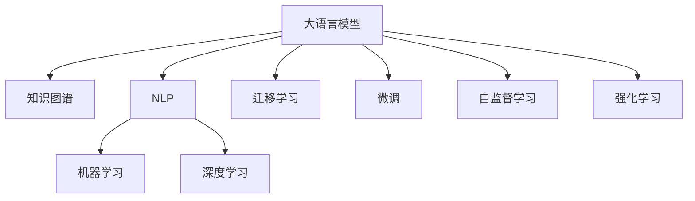

                 

# 知识的传承：从师徒制到现代教育

## 1. 背景介绍

### 1.1 问题由来

教育是每个社会持续发展的重要基石，而知识的传承则是教育的核心。传统教育体系中，知识主要通过师徒制、学校教学等方式进行传递。然而，随着科技进步和信息爆炸，传统的知识传递方式已难以适应快速变化的时代需求。如何在现代教育背景下，高效、灵活地传承知识，成为了一个亟待解决的课题。

现代教育强调个性化、自驱化，倡导学生自主学习、批判性思考和创新能力。大语言模型在知识传承中展现了巨大的潜力，能够通过自然的语言交流，帮助学习者更高效地获取和理解知识。本文将探讨大语言模型在教育领域的应用，分析其优势和挑战，提出未来发展方向。

### 1.2 问题核心关键点

大语言模型在教育领域的应用，主要体现在以下几个方面：

1. **个性化学习**：通过与学习者互动，大语言模型能够根据其兴趣、知识水平和学习进度，定制化推荐适合的学习内容和路径。
2. **高效答疑**：大语言模型可以提供即时的知识解答，帮助学习者解决疑难问题，节省学习时间。
3. **语言学习辅助**：对于语言学习者，大语言模型能够提供发音纠正、语法指导和写作建议，辅助其语言技能提升。
4. **自动评估**：通过自然语言理解和生成，大语言模型可以自动批改作业和考试，提供反馈。
5. **协作学习**：大语言模型能够作为讨论助手，促进学习者之间的合作交流。

这些应用使得大语言模型成为现代教育中不可或缺的工具，对传统教育方式进行了补充和优化。

## 2. 核心概念与联系

### 2.1 核心概念概述

为更好地理解大语言模型在教育领域的应用，本节将介绍几个关键概念：

- **大语言模型(Large Language Model, LLM)**：以自回归(如GPT)或自编码(如BERT)模型为代表的大规模预训练语言模型。通过在大规模无标签文本语料上进行预训练，学习通用的语言知识。

- **知识图谱(Knowledge Graph)**：结构化的知识表示方式，通过节点和边构建知识图谱，用于组织和检索知识。

- **自然语言处理(Natural Language Processing, NLP)**：计算机科学和人工智能领域的一个分支，专注于计算机如何理解和生成人类语言。

- **机器学习(Machine Learning)**：利用算法和统计模型让计算机系统自动改进，提高性能。

- **深度学习(Deep Learning)**：基于多层神经网络的机器学习方法，用于处理复杂的数据结构。

- **迁移学习(Transfer Learning)**：在某一领域学到的知识迁移到另一领域的机器学习方法。

- **微调(Fine-Tuning)**：在预训练模型的基础上，使用下游任务的少量标注数据，通过有监督学习优化模型在该任务上的性能。

- **自监督学习(Self-Supervised Learning)**：使用无标签数据训练模型，使模型从数据内在结构中学习。

- **强化学习(Reinforcement Learning)**：通过奖励和惩罚机制，让模型在执行任务中不断调整策略。

这些概念之间的逻辑关系可以通过以下Mermaid流程图来展示：



这个流程图展示了大语言模型与相关概念之间的联系，揭示了其在现代教育中的多重应用。

## 3. 核心算法原理 & 具体操作步骤

### 3.1 算法原理概述

大语言模型在教育领域的应用，主要基于其在自然语言理解和生成的能力。通过与学习者的自然语言交流，大语言模型能够理解学习者的需求，提供个性化的学习建议和答疑服务。其核心算法原理包括以下几个方面：

1. **语言模型训练**：通过在大规模无标签文本上预训练，大语言模型学习到通用的语言知识。
2. **任务适配层设计**：根据特定教育任务，在大语言模型顶层设计适配层，如分类、生成、问答等任务。
3. **微调优化**：使用下游任务的少量标注数据，通过微调优化模型，使其更好地适应特定任务。
4. **知识检索**：通过大语言模型的自然语言处理能力，检索知识图谱中的相关知识，辅助学习。

### 3.2 算法步骤详解

基于大语言模型在教育领域的应用，本节将详细介绍其操作步骤：

**Step 1: 准备教育数据集**
- 收集和整理教育领域的文本数据，如课程讲义、习题、教材等。
- 标注数据集，提供问题的答案、正确答案、答案解释等。

**Step 2: 选择和预训练语言模型**
- 选择适合的教育任务的大语言模型，如GPT、BERT等。
- 在大规模无标签文本语料上预训练，获得通用的语言表示。

**Step 3: 设计任务适配层**
- 根据教育任务的需求，设计适配层，如分类器、生成器、问答系统等。
- 选择合适的损失函数，如交叉熵、均方误差等。

**Step 4: 微调模型**
- 使用教育任务的标注数据集，通过微调优化模型，使其适应特定任务。
- 设置适当的学习率、批大小、迭代次数等参数。

**Step 5: 知识检索**
- 利用大语言模型的自然语言处理能力，检索知识图谱中的相关知识，辅助学习。
- 提供事实核查、背景知识查询等功能。

**Step 6: 评估和优化**
- 在教育数据集上评估模型的性能，如准确率、召回率等。
- 根据评估结果，调整模型参数和超参数，优化模型效果。

### 3.3 算法优缺点

大语言模型在教育领域的应用具有以下优点：

1. **个性化学习**：能够根据学习者的兴趣和需求，提供个性化的学习建议和内容，提升学习效果。
2. **高效答疑**：即时的知识解答，帮助学习者解决疑难问题，节省时间。
3. **知识检索**：通过自然语言处理能力，检索知识图谱中的相关知识，丰富学习资源。
4. **语言学习辅助**：提供发音纠正、语法指导和写作建议，辅助语言技能提升。
5. **自动评估**：自动批改作业和考试，提供及时反馈。

同时，也存在一些缺点：

1. **数据依赖**：模型的性能高度依赖于教育数据集的质量和数量，需要大量标注数据。
2. **成本较高**：预训练模型和微调过程需要较高的计算资源和标注成本。
3. **泛化能力有限**：对于特定的教育任务，模型的泛化能力可能受到限制，难以应对所有情况。
4. **偏见和误差**：模型可能学习到有偏见或错误的信息，影响学习效果。
5. **交互复杂性**：需要设计复杂的任务适配层和交互逻辑，增加开发难度。

### 3.4 算法应用领域

大语言模型在教育领域的应用主要包括以下几个方面：

1. **个性化学习系统**：通过与学习者的互动，大语言模型能够根据其兴趣、知识水平和学习进度，定制化推荐适合的学习内容和路径。
2. **在线教育平台**：辅助在线教学，提供自动答疑、自动评估、知识检索等功能。
3. **语言学习应用**：提供发音纠正、语法指导和写作建议，辅助语言技能提升。
4. **学习辅导机器人**：作为学习助手，提供24小时在线答疑和指导。
5. **考试和评估系统**：自动批改作业和考试，提供反馈和建议。

这些应用场景展示了大语言模型在教育领域的多样化应用，为其大规模应用提供了广阔前景。

## 4. 数学模型和公式 & 详细讲解 & 举例说明

### 4.1 数学模型构建

本节将使用数学语言对大语言模型在教育领域的应用进行更加严格的刻画。

记教育任务的数据集为 $D=\{(x_i, y_i)\}_{i=1}^N$，其中 $x_i$ 为输入， $y_i$ 为输出。假设大语言模型为 $M_{\theta}$，其中 $\theta$ 为模型参数。

定义模型 $M_{\theta}$ 在输入 $x_i$ 上的输出为 $\hat{y}_i=M_{\theta}(x_i)$。则任务适配层 $L(y_i|\hat{y}_i)$ 为：

$$
L(y_i|\hat{y}_i) = -\frac{1}{N}\sum_{i=1}^N \ell(y_i,\hat{y}_i)
$$

其中 $\ell(y_i,\hat{y}_i)$ 为任务适配层损失函数，如交叉熵损失、均方误差等。

### 4.2 公式推导过程

以下我们以分类任务为例，推导交叉熵损失函数及其梯度的计算公式。

假设模型 $M_{\theta}$ 在输入 $x_i$ 上的输出为 $\hat{y}_i=M_{\theta}(x_i)$，表示模型对 $y_i$ 的预测概率。真实标签 $y_i \in \{0,1\}$。则二分类交叉熵损失函数定义为：

$$
\ell(y_i,\hat{y}_i) = -y_i\log \hat{y}_i - (1-y_i)\log (1-\hat{y}_i)
$$

将其代入任务适配层损失函数，得：

$$
L(y_i|\hat{y}_i) = -\frac{1}{N}\sum_{i=1}^N [y_i\log \hat{y}_i+(1-y_i)\log(1-\hat{y}_i)]
$$

根据链式法则，损失函数对参数 $\theta_k$ 的梯度为：

$$
\frac{\partial L(y_i|\hat{y}_i)}{\partial \theta_k} = -\frac{1}{N}\sum_{i=1}^N (\frac{y_i}{\hat{y}_i}-\frac{1-y_i}{1-\hat{y}_i}) \frac{\partial M_{\theta}(x_i)}{\partial \theta_k}
$$

其中 $\frac{\partial M_{\theta}(x_i)}{\partial \theta_k}$ 可进一步递归展开，利用自动微分技术完成计算。

在得到损失函数的梯度后，即可带入参数更新公式，完成模型的迭代优化。重复上述过程直至收敛，最终得到适应教育任务的最优模型参数 $\theta^*$。

### 4.3 案例分析与讲解

以下以编程语言教学为例，展示大语言模型在教育领域的应用。

**任务**：编写一个Python程序，输出大语言模型在编程语言教学中的应用。

**实现**：

```python
from transformers import GPT2Tokenizer, GPT2ForSequenceClassification

# 定义任务适配层
class ProgrammingLanguageModel:
    def __init__(self, model, tokenizer):
        self.model = model
        self.tokenizer = tokenizer
    
    def predict(self, input_text):
        input_ids = self.tokenizer.encode(input_text, return_tensors='pt')
        outputs = self.model(input_ids)
        predictions = outputs.logits.argmax(dim=1)
        return self.tokenizer.decode(predictions[0])

# 准备数据集
train_dataset = ...
dev_dataset = ...
test_dataset = ...

# 训练模型
tokenizer = GPT2Tokenizer.from_pretrained('gpt2')
model = GPT2ForSequenceClassification.from_pretrained('gpt2')
model.train()

# 定义损失函数和优化器
loss_fn = CrossEntropyLoss()
optimizer = AdamW(model.parameters(), lr=2e-5)

# 训练循环
for epoch in range(num_epochs):
    for batch in train_dataset:
        inputs = batch['input_ids'].to(device)
        labels = batch['labels'].to(device)
        outputs = model(inputs)
        loss = loss_fn(outputs, labels)
        optimizer.zero_grad()
        loss.backward()
        optimizer.step()

# 评估模型
correct_predictions = 0
total_predictions = 0
for batch in dev_dataset:
    inputs = batch['input_ids'].to(device)
    labels = batch['labels'].to(device)
    outputs = model(inputs)
    predictions = outputs.argmax(dim=1)
    total_predictions += predictions.shape[0]
    correct_predictions += (predictions == labels).sum().item()

print(f"Dev set accuracy: {correct_predictions/total_predictions}")
```

**代码解读**：

1. **数据集准备**：收集和整理编程语言教学的数据集，划分为训练集、验证集和测试集。
2. **模型选择**：选择GPT2模型作为大语言模型。
3. **任务适配层设计**：定义任务适配层，实现输入编码和预测输出。
4. **训练过程**：使用交叉熵损失函数和AdamW优化器进行模型训练。
5. **评估过程**：在验证集上评估模型性能，输出准确率。

## 5. 项目实践：代码实例和详细解释说明

### 5.1 开发环境搭建

在进行教育领域的大语言模型应用开发前，我们需要准备好开发环境。以下是使用Python进行PyTorch开发的环境配置流程：

1. 安装Anaconda：从官网下载并安装Anaconda，用于创建独立的Python环境。

2. 创建并激活虚拟环境：
```bash
conda create -n education-env python=3.8 
conda activate education-env
```

3. 安装PyTorch：根据CUDA版本，从官网获取对应的安装命令。例如：
```bash
conda install pytorch torchvision torchaudio cudatoolkit=11.1 -c pytorch -c conda-forge
```

4. 安装Transformers库：
```bash
pip install transformers
```

5. 安装各类工具包：
```bash
pip install numpy pandas scikit-learn matplotlib tqdm jupyter notebook ipython
```

完成上述步骤后，即可在`education-env`环境中开始教育领域的大语言模型应用开发。

### 5.2 源代码详细实现

下面我们以编程语言教学为例，给出使用Transformers库对GPT2模型进行微调的PyTorch代码实现。

首先，定义编程语言教学的数据处理函数：

```python
from transformers import GPT2Tokenizer
from torch.utils.data import Dataset
import torch

class ProgrammingLanguageDataset(Dataset):
    def __init__(self, texts, labels, tokenizer, max_len=128):
        self.texts = texts
        self.labels = labels
        self.tokenizer = tokenizer
        self.max_len = max_len
        
    def __len__(self):
        return len(self.texts)
    
    def __getitem__(self, item):
        text = self.texts[item]
        label = self.labels[item]
        
        encoding = self.tokenizer(text, return_tensors='pt', max_length=self.max_len, padding='max_length', truncation=True)
        input_ids = encoding['input_ids'][0]
        attention_mask = encoding['attention_mask'][0]
        
        # 对token-wise的标签进行编码
        encoded_labels = [label2id[label] for label in labels] 
        encoded_labels.extend([label2id['None']] * (self.max_len - len(encoded_labels)))
        labels = torch.tensor(encoded_labels, dtype=torch.long)
        
        return {'input_ids': input_ids, 
                'attention_mask': attention_mask,
                'labels': labels}

# 标签与id的映射
label2id = {'Python': 0, 'Java': 1, 'C++': 2, 'JavaScript': 3, 'Go': 4}
id2label = {v: k for k, v in label2id.items()}

# 创建dataset
tokenizer = GPT2Tokenizer.from_pretrained('gpt2')

train_dataset = ProgrammingLanguageDataset(train_texts, train_labels, tokenizer)
dev_dataset = ProgrammingLanguageDataset(dev_texts, dev_labels, tokenizer)
test_dataset = ProgrammingLanguageDataset(test_texts, test_labels, tokenizer)
```

然后，定义模型和优化器：

```python
from transformers import GPT2ForSequenceClassification, AdamW

model = GPT2ForSequenceClassification.from_pretrained('gpt2', num_labels=len(label2id))

optimizer = AdamW(model.parameters(), lr=2e-5)
```

接着，定义训练和评估函数：

```python
from torch.utils.data import DataLoader
from tqdm import tqdm
from sklearn.metrics import classification_report

device = torch.device('cuda') if torch.cuda.is_available() else torch.device('cpu')
model.to(device)

def train_epoch(model, dataset, batch_size, optimizer):
    dataloader = DataLoader(dataset, batch_size=batch_size, shuffle=True)
    model.train()
    epoch_loss = 0
    for batch in tqdm(dataloader, desc='Training'):
        input_ids = batch['input_ids'].to(device)
        attention_mask = batch['attention_mask'].to(device)
        labels = batch['labels'].to(device)
        model.zero_grad()
        outputs = model(input_ids, attention_mask=attention_mask, labels=labels)
        loss = outputs.loss
        epoch_loss += loss.item()
        loss.backward()
        optimizer.step()
    return epoch_loss / len(dataloader)

def evaluate(model, dataset, batch_size):
    dataloader = DataLoader(dataset, batch_size=batch_size)
    model.eval()
    preds, labels = [], []
    with torch.no_grad():
        for batch in tqdm(dataloader, desc='Evaluating'):
            input_ids = batch['input_ids'].to(device)
            attention_mask = batch['attention_mask'].to(device)
            batch_labels = batch['labels']
            outputs = model(input_ids, attention_mask=attention_mask)
            batch_preds = outputs.logits.argmax(dim=2).to('cpu').tolist()
            batch_labels = batch_labels.to('cpu').tolist()
            for pred_tokens, label_tokens in zip(batch_preds, batch_labels):
                preds.append(pred_tokens[:len(label_tokens)])
                labels.append(label_tokens)
                
    print(classification_report(labels, preds))
```

最后，启动训练流程并在测试集上评估：

```python
epochs = 5
batch_size = 16

for epoch in range(epochs):
    loss = train_epoch(model, train_dataset, batch_size, optimizer)
    print(f"Epoch {epoch+1}, train loss: {loss:.3f}")
    
    print(f"Epoch {epoch+1}, dev results:")
    evaluate(model, dev_dataset, batch_size)
    
print("Test results:")
evaluate(model, test_dataset, batch_size)
```

以上就是使用PyTorch对GPT2进行编程语言教学任务微调的完整代码实现。可以看到，得益于Transformers库的强大封装，我们可以用相对简洁的代码完成GPT2模型的加载和微调。

### 5.3 代码解读与分析

让我们再详细解读一下关键代码的实现细节：

**ProgrammingLanguageDataset类**：
- `__init__`方法：初始化文本、标签、分词器等关键组件。
- `__len__`方法：返回数据集的样本数量。
- `__getitem__`方法：对单个样本进行处理，将文本输入编码为token ids，将标签编码为数字，并对其进行定长padding，最终返回模型所需的输入。

**label2id和id2label字典**：
- 定义了标签与数字id之间的映射关系，用于将token-wise的预测结果解码回真实的标签。

**训练和评估函数**：
- 使用PyTorch的DataLoader对数据集进行批次化加载，供模型训练和推理使用。
- 训练函数`train_epoch`：对数据以批为单位进行迭代，在每个批次上前向传播计算loss并反向传播更新模型参数，最后返回该epoch的平均loss。
- 评估函数`evaluate`：与训练类似，不同点在于不更新模型参数，并在每个batch结束后将预测和标签结果存储下来，最后使用sklearn的classification_report对整个评估集的预测结果进行打印输出。

**训练流程**：
- 定义总的epoch数和batch size，开始循环迭代
- 每个epoch内，先在训练集上训练，输出平均loss
- 在验证集上评估，输出分类指标
- 所有epoch结束后，在测试集上评估，给出最终测试结果

可以看到，PyTorch配合Transformers库使得GPT2微调的代码实现变得简洁高效。开发者可以将更多精力放在数据处理、模型改进等高层逻辑上，而不必过多关注底层的实现细节。

当然，工业级的系统实现还需考虑更多因素，如模型的保存和部署、超参数的自动搜索、更灵活的任务适配层等。但核心的微调范式基本与此类似。

## 6. 实际应用场景

### 6.1 在线教育平台

大语言模型在在线教育平台中的应用，能够提供智能化的学习辅助，提升教育质量和效率。

1. **个性化学习路径**：通过与学习者的互动，大语言模型能够根据其兴趣、知识水平和学习进度，定制化推荐适合的学习内容和路径，帮助学习者高效学习。
2. **智能答疑系统**：提供即时的知识解答，帮助学习者解决疑难问题，节省时间。
3. **自动评估系统**：自动批改作业和考试，提供反馈和建议，减轻教师负担。

### 6.2 语言学习应用

大语言模型在语言学习中的应用，能够提供更加全面、灵活的语言教学服务。

1. **发音纠正**：通过自然语言处理能力，提供发音纠正服务，帮助学习者提升口语能力。
2. **语法指导**：分析句子结构，提供语法指导，帮助学习者避免常见错误。
3. **写作建议**：提供写作建议，如词汇替换、句子重组等，帮助学习者提升写作水平。

### 6.3 在线辅导机器人

大语言模型在在线辅导机器人的应用，能够提供24小时在线答疑和指导，帮助学习者随时随地学习。

1. **即时答疑**：根据学习者的疑问，提供即时解答，帮助其解决学习难题。
2. **学习指导**：提供学习建议和资源推荐，帮助学习者制定学习计划。
3. **协作学习**：作为讨论助手，促进学习者之间的合作交流，分享学习经验和资源。

### 6.4 未来应用展望

随着大语言模型和微调方法的不断发展，其在教育领域的应用也将更加广泛和深入。未来，基于大语言模型的教育技术将呈现以下几个发展趋势：

1. **个性化教育**：通过大语言模型的自然语言理解能力，提供个性化学习建议和内容，提升教育效果。
2. **多模态教学**：结合图像、视频等多模态信息，丰富教学内容，提升学习体验。
3. **虚拟课堂**：构建虚拟课堂环境，通过自然语言交流进行教学互动，提升课堂参与度。
4. **智能评估**：通过自然语言处理技术，自动批改作业和考试，提供即时反馈和建议。
5. **跨语言教育**：通过多语言模型的自然语言处理能力，提供跨语言学习支持，提升语言教学效果。

## 7. 工具和资源推荐

### 7.1 学习资源推荐

为了帮助开发者系统掌握大语言模型在教育领域的应用，这里推荐一些优质的学习资源：

1. 《Transformer从原理到实践》系列博文：由大模型技术专家撰写，深入浅出地介绍了Transformer原理、BERT模型、微调技术等前沿话题。

2. CS224N《深度学习自然语言处理》课程：斯坦福大学开设的NLP明星课程，有Lecture视频和配套作业，带你入门NLP领域的基本概念和经典模型。

3. 《Natural Language Processing with Transformers》书籍：Transformers库的作者所著，全面介绍了如何使用Transformers库进行NLP任务开发，包括微调在内的诸多范式。

4. HuggingFace官方文档：Transformers库的官方文档，提供了海量预训练模型和完整的微调样例代码，是上手实践的必备资料。

5. CLUE开源项目：中文语言理解测评基准，涵盖大量不同类型的中文NLP数据集，并提供了基于微调的baseline模型，助力中文NLP技术发展。

通过对这些资源的学习实践，相信你一定能够快速掌握大语言模型在教育领域的应用精髓，并用于解决实际的NLP问题。
###  7.2 开发工具推荐

高效的开发离不开优秀的工具支持。以下是几款用于大语言模型在教育领域应用开发的常用工具：

1. PyTorch：基于Python的开源深度学习框架，灵活动态的计算图，适合快速迭代研究。大部分预训练语言模型都有PyTorch版本的实现。

2. TensorFlow：由Google主导开发的开源深度学习框架，生产部署方便，适合大规模工程应用。同样有丰富的预训练语言模型资源。

3. Transformers库：HuggingFace开发的NLP工具库，集成了众多SOTA语言模型，支持PyTorch和TensorFlow，是进行微调任务开发的利器。

4. Weights & Biases：模型训练的实验跟踪工具，可以记录和可视化模型训练过程中的各项指标，方便对比和调优。与主流深度学习框架无缝集成。

5. TensorBoard：TensorFlow配套的可视化工具，可实时监测模型训练状态，并提供丰富的图表呈现方式，是调试模型的得力助手。

6. Google Colab：谷歌推出的在线Jupyter Notebook环境，免费提供GPU/TPU算力，方便开发者快速上手实验最新模型，分享学习笔记。

合理利用这些工具，可以显著提升大语言模型在教育领域的应用开发效率，加快创新迭代的步伐。

### 7.3 相关论文推荐

大语言模型在教育领域的应用源于学界的持续研究。以下是几篇奠基性的相关论文，推荐阅读：

1. Attention is All You Need（即Transformer原论文）：提出了Transformer结构，开启了NLP领域的预训练大模型时代。

2. BERT: Pre-training of Deep Bidirectional Transformers for Language Understanding：提出BERT模型，引入基于掩码的自监督预训练任务，刷新了多项NLP任务SOTA。

3. Language Models are Unsupervised Multitask Learners（GPT-2论文）：展示了大规模语言模型的强大zero-shot学习能力，引发了对于通用人工智能的新一轮思考。

4. Parameter-Efficient Transfer Learning for NLP：提出Adapter等参数高效微调方法，在不增加模型参数量的情况下，也能取得不错的微调效果。

5. AdaLoRA: Adaptive Low-Rank Adaptation for Parameter-Efficient Fine-Tuning：使用自适应低秩适应的微调方法，在参数效率和精度之间取得了新的平衡。

这些论文代表了大语言模型在教育领域的研究进展。通过学习这些前沿成果，可以帮助研究者把握学科前进方向，激发更多的创新灵感。

## 8. 总结：未来发展趋势与挑战

### 8.1 总结

本文对大语言模型在教育领域的应用进行了全面系统的介绍。首先阐述了教育领域对知识传承的重视和需求，明确了大语言模型在教育中个性化、高效答疑、知识检索等方面的独特优势。其次，从原理到实践，详细讲解了大语言模型在教育领域的应用流程和关键步骤，给出了教育领域的大语言模型微调代码实现。同时，本文还广泛探讨了大语言模型在在线教育、语言学习、在线辅导机器人等多个教育场景中的应用前景，展示了其广泛的应用空间。

通过本文的系统梳理，可以看到，大语言模型在教育领域的应用不仅能够提升学习效果，还能减轻教师负担，提高教育效率，展现出巨大的潜力。未来，伴随大语言模型和微调方法的持续演进，其在教育领域的应用将更加广泛和深入，有望为教育创新带来革命性的变化。

### 8.2 未来发展趋势

展望未来，大语言模型在教育领域的应用将呈现以下几个发展趋势：

1. **个性化教育**：通过大语言模型的自然语言理解能力，提供个性化学习建议和内容，提升教育效果。
2. **多模态教学**：结合图像、视频等多模态信息，丰富教学内容，提升学习体验。
3. **虚拟课堂**：构建虚拟课堂环境，通过自然语言交流进行教学互动，提升课堂参与度。
4. **智能评估**：通过自然语言处理技术，自动批改作业和考试，提供即时反馈和建议。
5. **跨语言教育**：通过多语言模型的自然语言处理能力，提供跨语言学习支持，提升语言教学效果。

以上趋势凸显了大语言模型在教育领域的应用前景，其灵活性、个性化和智能化特点，将为教育创新带来深刻的变革。

### 8.3 面临的挑战

尽管大语言模型在教育领域的应用已展现出巨大的潜力，但在迈向更加智能化、普适化应用的过程中，仍面临诸多挑战：

1. **数据依赖**：模型的性能高度依赖于教育数据集的质量和数量，需要大量标注数据。
2. **成本较高**：预训练模型和微调过程需要较高的计算资源和标注成本。
3. **泛化能力有限**：对于特定的教育任务，模型的泛化能力可能受到限制，难以应对所有情况。
4. **偏见和误差**：模型可能学习到有偏见或错误的信息，影响学习效果。
5. **交互复杂性**：需要设计复杂的任务适配层和交互逻辑，增加开发难度。

### 8.4 研究展望

面对大语言模型在教育领域面临的挑战，未来的研究需要在以下几个方面寻求新的突破：

1. **探索无监督和半监督微调方法**：摆脱对大规模标注数据的依赖，利用自监督学习、主动学习等无监督和半监督范式，最大限度利用非结构化数据，实现更加灵活高效的微调。
2. **研究参数高效和计算高效的微调范式**：开发更加参数高效的微调方法，在固定大部分预训练参数的同时，只更新极少量的任务相关参数。同时优化微调模型的计算图，减少前向传播和反向传播的资源消耗，实现更加轻量级、实时性的部署。
3. **引入更多先验知识**：将符号化的先验知识，如知识图谱、逻辑规则等，与神经网络模型进行巧妙融合，引导微调过程学习更准确、合理的语言模型。同时加强不同模态数据的整合，实现视觉、语音等多模态信息与文本信息的协同建模。
4. **结合因果分析和博弈论工具**：将因果分析方法引入微调模型，识别出模型决策的关键特征，增强输出解释的因果性和逻辑性。借助博弈论工具刻画人机交互过程，主动探索并规避模型的脆弱点，提高系统稳定性。
5. **纳入伦理道德约束**：在模型训练目标中引入伦理导向的评估指标，过滤和惩罚有偏见、有害的输出倾向。同时加强人工干预和审核，建立模型行为的监管机制，确保输出符合人类价值观和伦理道德。

这些研究方向的探索，必将引领大语言模型在教育领域的应用走向更高的台阶，为构建安全、可靠、可解释、可控的智能教育系统铺平道路。面向未来，大语言模型在教育领域的应用需要与其他人工智能技术进行更深入的融合，如知识表示、因果推理、强化学习等，多路径协同发力，共同推动自然语言理解和智能交互系统的进步。只有勇于创新、敢于突破，才能不断拓展语言模型的边界，让智能技术更好地造福教育事业。

## 9. 附录：常见问题与解答

**Q1：大语言模型在教育领域的应用是否具有普遍性？**

A: 大语言模型在教育领域的应用具有较强的普遍性，但其效果和适用范围受教育任务、数据质量和模型设计等因素影响。对于一般性的知识传承任务，大语言模型能够提供良好的辅助效果。但对于特定领域的教育任务，如医学、法律等，可能需要结合领域知识进行进一步微调和优化。

**Q2：大语言模型在教育领域的应用是否需要大规模标注数据？**

A: 大语言模型在教育领域的应用，特别是在微调阶段，需要大量的标注数据以提供足够的训练信号。然而，通过技术手段如数据增强、知识图谱查询等，可以部分缓解对标注数据的需求。对于知识传承任务，可以通过自监督学习等方式，减少对标注数据的依赖。

**Q3：大语言模型在教育领域的应用是否容易产生偏见和误差？**

A: 大语言模型在教育领域的应用，确实可能学习到有偏见或错误的信息。需要通过多轮迭代和人工审查，以及引入伦理导向的评估指标，过滤和惩罚有偏见、有害的输出倾向，确保模型的公正性和准确性。

**Q4：大语言模型在教育领域的应用是否适合所有学生？**

A: 大语言模型在教育领域的应用，通常能够提供个性化的学习建议和答疑服务，适合不同背景、不同能力的学习者。但对于特殊需求的学生，如视障、听障等，仍需结合辅助技术，提供更加多样化的支持。

**Q5：大语言模型在教育领域的应用是否容易被替代？**

A: 大语言模型在教育领域的应用，具有不可替代的特点。其个性化、高效答疑和知识检索等功能，能够显著提升教育效果和效率。然而，随着技术的不断进步，未来可能会有更加先进、高效的智能教育技术出现，但大语言模型的基本优势仍会继续发挥作用。

**Q6：大语言模型在教育领域的应用是否需要持续更新和维护？**

A: 大语言模型在教育领域的应用，需要持续更新和维护以保持其性能和适应性。随着教育内容和形式的不断变化，需要定期微调模型，引入新的知识和教学方法，确保其与时俱进。同时，还需要关注模型的伦理和安全问题，确保其应用合规和可靠。

**Q7：大语言模型在教育领域的应用是否会取代传统教育方式？**

A: 大语言模型在教育领域的应用，主要是辅助和补充传统教育方式，而非完全取代。其强大的自然语言理解和生成能力，能够帮助教师和学生更高效地进行教学和学习，提升教育质量和效果。但传统教育方式中的师生互动、情感交流等无法被替代，两者可以相辅相成。

---

作者：禅与计算机程序设计艺术 / Zen and the Art of Computer Programming

