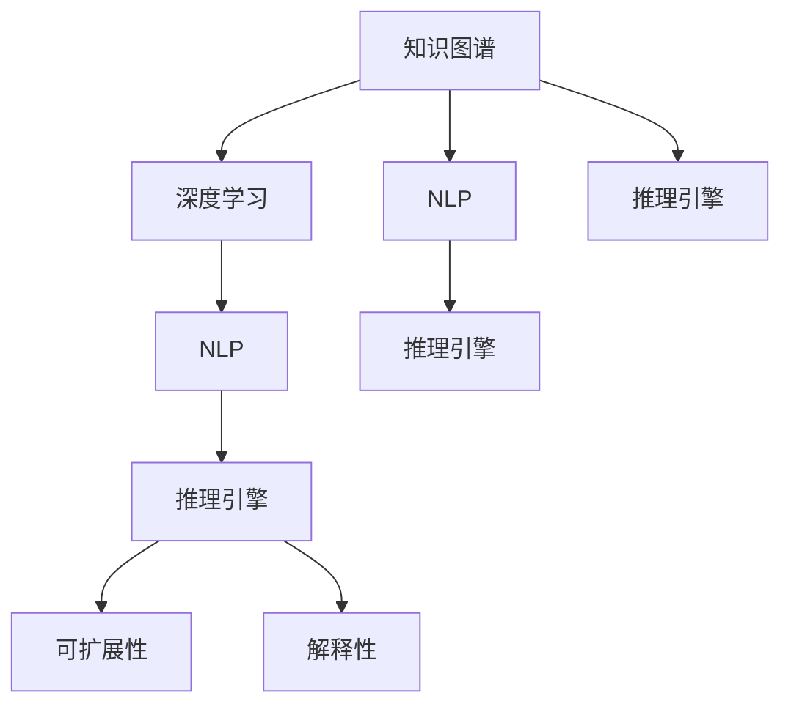

                 

# 知识的创新路径：洞察力的独特指引

> 关键词：知识图谱, 人工智能(AI), 深度学习, 自然语言处理(NLP), 推理引擎, 解释性, 可扩展性

## 1. 背景介绍

### 1.1 问题由来
随着技术的不断进步，数据量的指数级增长，知识的获取与处理变得越来越困难。如何高效地存储、检索、推理和管理知识，成为了当前技术研究和应用的核心挑战之一。在过去的几年中，知识图谱(Knowledge Graph)作为知识表示和推理的重要工具，逐渐成为知识管理、信息检索、智能问答等领域的核心技术。

知识图谱是一种以图结构形式表示实体间关系的知识表示方法。它由节点和边组成，节点代表实体，边代表实体之间的关系。知识图谱通过语义网络的方式，将大量结构化、半结构化甚至非结构化的知识融合在一起，提供了一种自然、直观的知识管理方式。

然而，知识图谱在实际应用中也面临一些挑战。一方面，构建高质量的知识图谱需要大量的标注数据和领域专家知识，成本较高；另一方面，知识图谱推理的精度和速度仍有提升空间，对于大规模知识库的推理效率存在瓶颈。

为了克服这些挑战，本文将探讨深度学习技术在知识图谱中的应用，并研究基于深度学习的知识图谱推理引擎的设计与实现。本文首先介绍了知识图谱的核心概念与联系，然后详细讲解了深度学习在知识图谱中的应用，最后通过项目实践展示深度学习推理引擎的代码实现与效果。

## 2. 核心概念与联系

### 2.1 核心概念概述

为更好地理解深度学习在知识图谱中的应用，本节将介绍几个密切相关的核心概念：

- 知识图谱(Knowledge Graph)：一种语义化的知识表示方法，由节点和边组成，节点代表实体，边代表实体之间的关系。知识图谱广泛应用于知识管理、信息检索、智能问答等场景。
- 深度学习(Deep Learning)：一种基于神经网络的学习方法，通过多层非线性映射提取输入数据的高级特征。深度学习已经在图像、语音、自然语言处理等领域取得重大进展。
- 自然语言处理(Natural Language Processing, NLP)：计算机科学、人工智能和语言学的交叉领域，旨在让计算机理解、处理和生成自然语言。NLP在知识图谱构建和推理中扮演重要角色。
- 推理引擎(Inference Engine)：用于自动化推理知识图谱中实体间关系的系统。推理引擎的目标是高效、准确地推理出未知实体之间的关系。
- 解释性(Interpretability)：指机器学习模型能够解释其决策过程的能力，这对于知识图谱推理的可靠性尤为重要。
- 可扩展性(Scalability)：指知识图谱推理引擎能够处理大规模知识库，并在高性能计算资源下保持高效率的能力。

这些核心概念之间的逻辑关系可以通过以下Mermaid流程图来展示：



这个流程图展示了这个主题的核心概念及其之间的关系：

1. 知识图谱是深度学习、自然语言处理、推理引擎等领域研究的基础。
2. 深度学习在知识图谱构建和推理中扮演重要角色。
3. 自然语言处理是知识图谱推理的关键环节之一，通过自然语言处理技术将文本转化为知识图谱。
4. 推理引擎是知识图谱的核心功能模块，用于自动化推理知识图谱中实体间关系。
5. 解释性和可扩展性是知识图谱推理引擎的两个重要指标，决定推理的可靠性与效率。

## 3. 核心算法原理 & 具体操作步骤

### 3.1 算法原理概述

深度学习在知识图谱中的应用主要体现在两个方面：知识图谱构建和知识图谱推理。其中，知识图谱构建的目标是将文本数据转化为结构化的知识图谱；知识图谱推理的目标是在知识图谱中推理出未知实体之间的关系。

知识图谱构建一般包括以下步骤：
1. 收集文本数据，如百科全书、新闻报道、论文等。
2. 使用自然语言处理技术，如命名实体识别(NER)、关系抽取(RE)、链接预测(LP)等，将文本数据转化为知识图谱。
3. 对知识图谱进行验证与优化，确保其准确性和完整性。

知识图谱推理一般包括以下步骤：
1. 将知识图谱表示为向量形式，如节点嵌入向量、关系向量等。
2. 使用深度学习模型，如图卷积网络(GCN)、图神经网络(GNN)、注意力机制(Attention)等，进行实体之间的关系推理。
3. 通过反向传播算法，不断调整模型参数，提高推理精度。

### 3.2 算法步骤详解

#### 3.2.1 知识图谱构建

知识图谱构建的第一步是收集文本数据。可以使用爬虫技术自动抓取网络上的文本数据，如百度百科、维基百科等。

接着，使用自然语言处理技术对文本进行预处理。预处理包括以下几个步骤：
1. 分词：将文本分割成单词或词组。
2. 命名实体识别(NER)：从文本中识别出人名、地名、机构名等实体。
3. 关系抽取(RE)：从文本中抽取实体之间的关系。
4. 链接预测(LP)：根据实体之间的关系，预测新的关系或实体。

最后，将处理后的文本数据转化为知识图谱。知识图谱由节点和边组成，节点代表实体，边代表实体之间的关系。可以使用各种工具，如Grafovis、YAGO等，构建和可视化知识图谱。

#### 3.2.2 知识图谱推理

知识图谱推理的目标是自动化推理知识图谱中实体间的关系。推理过程可以分为两个阶段：特征提取和关系推理。

特征提取的目标是将知识图谱中的实体转化为向量形式，以便于机器学习模型进行处理。特征提取可以分为两种方法：
1. 节点嵌入向量(Node Embedding Vector)：将节点转化为固定长度的向量，如TransE、TransH等。
2. 关系向量(Relation Vector)：将关系转化为向量形式，如TuckER、ComplEx等。

关系推理的目标是在知识图谱中推理出未知实体之间的关系。关系推理可以分为以下几种方法：
1. 图卷积网络(Graph Convolutional Network, GCN)：通过卷积操作提取图谱特征，进行关系推理。
2. 图神经网络(Graph Neural Network, GNN)：通过神经网络提取图谱特征，进行关系推理。
3. 注意力机制(Attention)：通过注意力机制，关注与当前节点相关的关键节点，进行关系推理。

推理过程可以使用各种算法，如基于规则的推理、基于统计的推理、基于深度学习的推理等。

### 3.3 算法优缺点

深度学习在知识图谱构建和推理中的应用，具有以下优点：
1. 自动抽取关系：深度学习可以从文本数据中自动学习实体间的关系，减少了人工标注的需求。
2. 高精度推理：深度学习模型在关系推理中的精度较高，尤其在复杂关系抽取中表现优异。
3. 泛化能力强：深度学习模型具备较强的泛化能力，能够在不同领域的知识图谱中进行应用。

同时，深度学习在知识图谱构建和推理中，也存在一些局限性：
1. 数据需求量大：深度学习模型需要大量的标注数据，特别是在节点嵌入向量提取中。
2. 计算资源消耗大：深度学习模型在训练和推理中需要大量的计算资源，特别是在图神经网络中。
3. 可解释性差：深度学习模型的内部工作机制难以解释，推理过程不透明。

尽管存在这些局限性，但就目前而言，深度学习在知识图谱构建和推理中，已经成为一种主流的技术范式。未来相关研究的重点在于如何进一步降低深度学习对标注数据的依赖，提高模型的可解释性，优化模型的计算资源消耗。

### 3.4 算法应用领域

深度学习在知识图谱中的应用，已经在多个领域取得了显著成果：

- 知识管理：通过知识图谱构建和推理，实现知识管理系统的智能化，提供高效的搜索和推荐服务。
- 信息检索：将知识图谱与信息检索系统相结合，提高检索的准确性和相关性。
- 智能问答：通过知识图谱构建和推理，实现智能问答系统，解答用户的各种问题。
- 推荐系统：将知识图谱与推荐系统相结合，推荐符合用户兴趣的商品、内容等。
- 自然语言生成：通过知识图谱构建和推理，生成符合语境的文本内容，如新闻报道、小说等。

除了这些应用场景外，深度学习在知识图谱中的应用还在不断拓展，如医疗领域、金融领域、工业领域等，为不同领域的知识图谱构建和推理提供了新的解决方案。

## 4. 数学模型和公式 & 详细讲解  
### 4.1 数学模型构建

本节将使用数学语言对深度学习在知识图谱中的应用进行更加严格的刻画。

记知识图谱的节点为 $N$，关系为 $R$，边为 $E$。定义节点嵌入向量为 $\mathbf{v}_i \in \mathbb{R}^d$，关系向量为 $\mathbf{r}_r \in \mathbb{R}^d$。假设知识图谱中存在的实体关系为 $(x_i, r, y_j)$，则关系推理的目标是预测 $x_i$ 和 $y_j$ 之间的关系。

定义知识图谱的邻接矩阵为 $\mathbf{A}$，其中 $\mathbf{A}_{i,j}=1$ 表示节点 $i$ 与节点 $j$ 之间存在关系。定义节点嵌入向量 $\mathbf{v}_i$ 和关系向量 $\mathbf{r}_r$ 的线性组合为节点嵌入矩阵 $\mathbf{V}$ 和关系向量矩阵 $\mathbf{R}$，即 $\mathbf{V}=[\mathbf{v}_1,\mathbf{v}_2,...,\mathbf{v}_N]$，$\mathbf{R}=[\mathbf{r}_1,\mathbf{r}_2,...,\mathbf{r}_R]$。

节点嵌入向量 $\mathbf{v}_i$ 和关系向量 $\mathbf{r}_r$ 的更新公式为：
$$
\mathbf{v}_i = \mathbf{W}_v \odot \mathbf{A}_i \mathbf{r}_r
$$
$$
\mathbf{r}_r = \mathbf{W}_r \odot \mathbf{A}_r \mathbf{v}_i
$$
其中 $\odot$ 表示向量点乘，$\mathbf{A}_i$ 和 $\mathbf{A}_r$ 分别为节点邻接矩阵和关系邻接矩阵。$\mathbf{W}_v$ 和 $\mathbf{W}_r$ 分别为节点嵌入权重矩阵和关系嵌入权重矩阵。

节点嵌入向量 $\mathbf{v}_i$ 和关系向量 $\mathbf{r}_r$ 的预测公式为：
$$
\hat{\mathbf{v}}_i = \mathbf{W}_h \mathbf{A}_i \mathbf{r}_r
$$
$$
\hat{\mathbf{r}}_r = \mathbf{W}_h \mathbf{A}_r \mathbf{v}_i
$$
其中 $\mathbf{W}_h$ 为节点嵌入权重矩阵和关系嵌入权重矩阵的组合权重矩阵。

通过上述公式，深度学习可以自动地从知识图谱中提取实体之间的关系，并进行关系推理。

### 4.2 公式推导过程

以下是节点嵌入向量和关系向量更新的详细推导过程。

定义节点嵌入向量 $\mathbf{v}_i$ 和关系向量 $\mathbf{r}_r$ 的线性组合为节点嵌入矩阵 $\mathbf{V}$ 和关系向量矩阵 $\mathbf{R}$，即 $\mathbf{V}=[\mathbf{v}_1,\mathbf{v}_2,...,\mathbf{v}_N]$，$\mathbf{R}=[\mathbf{r}_1,\mathbf{r}_2,...,\mathbf{r}_R]$。

节点嵌入向量 $\mathbf{v}_i$ 和关系向量 $\mathbf{r}_r$ 的更新公式为：
$$
\mathbf{v}_i = \mathbf{W}_v \odot \mathbf{A}_i \mathbf{r}_r
$$
$$
\mathbf{r}_r = \mathbf{W}_r \odot \mathbf{A}_r \mathbf{v}_i
$$
其中 $\odot$ 表示向量点乘，$\mathbf{A}_i$ 和 $\mathbf{A}_r$ 分别为节点邻接矩阵和关系邻接矩阵。$\mathbf{W}_v$ 和 $\mathbf{W}_r$ 分别为节点嵌入权重矩阵和关系嵌入权重矩阵。

节点嵌入向量 $\mathbf{v}_i$ 和关系向量 $\mathbf{r}_r$ 的预测公式为：
$$
\hat{\mathbf{v}}_i = \mathbf{W}_h \mathbf{A}_i \mathbf{r}_r
$$
$$
\hat{\mathbf{r}}_r = \mathbf{W}_h \mathbf{A}_r \mathbf{v}_i
$$
其中 $\mathbf{W}_h$ 为节点嵌入权重矩阵和关系嵌入权重矩阵的组合权重矩阵。

将上述公式进行矩阵形式表示，得到：
$$
\mathbf{V} = \mathbf{W}_v \odot \mathbf{A} \mathbf{R}
$$
$$
\mathbf{R} = \mathbf{W}_r \odot \mathbf{A} \mathbf{V}
$$
$$
\mathbf{\hat{V}} = \mathbf{W}_h \mathbf{A} \mathbf{R}
$$
$$
\mathbf{\hat{R}} = \mathbf{W}_h \mathbf{A} \mathbf{V}
$$

通过上述公式，深度学习可以自动地从知识图谱中提取实体之间的关系，并进行关系推理。

### 4.3 案例分析与讲解

以节点嵌入向量的更新公式为例，进行详细分析：
$$
\mathbf{v}_i = \mathbf{W}_v \odot \mathbf{A}_i \mathbf{r}_r
$$
其中 $\mathbf{A}_i$ 表示节点 $i$ 的邻接矩阵，$\mathbf{r}_r$ 表示关系向量，$\mathbf{W}_v$ 表示节点嵌入权重矩阵。

以关系推理为例，假设节点 $i$ 和节点 $j$ 之间的关系为 $(x_i, r, y_j)$，则关系推理的预测公式为：
$$
\hat{\mathbf{v}}_i = \mathbf{W}_h \mathbf{A}_{i,j} \mathbf{r}_r
$$
其中 $\mathbf{A}_{i,j}$ 表示节点 $i$ 与节点 $j$ 之间的关系邻接矩阵，$\mathbf{W}_h$ 表示节点嵌入权重矩阵和关系嵌入权重矩阵的组合权重矩阵。

根据上述公式，深度学习可以从知识图谱中自动学习实体间的关系，并进行关系推理。

## 5. 项目实践：代码实例和详细解释说明

### 5.1 开发环境搭建

在进行深度学习推理引擎的实践前，我们需要准备好开发环境。以下是使用Python进行TensorFlow开发的环境配置流程：

1. 安装Anaconda：从官网下载并安装Anaconda，用于创建独立的Python环境。

2. 创建并激活虚拟环境：
```bash
conda create -n tf-env python=3.8 
conda activate tf-env
```

3. 安装TensorFlow：根据CUDA版本，从官网获取对应的安装命令。例如：
```bash
conda install tensorflow==2.5.0 -c pytorch
```

4. 安装TensorBoard：
```bash
pip install tensorboard
```

5. 安装相关的学习资源：
```bash
pip install scipy numpy pandas sklearn matplotlib tqdm jupyter notebook ipython
```

完成上述步骤后，即可在`tf-env`环境中开始深度学习推理引擎的开发实践。

### 5.2 源代码详细实现

下面我们以节点嵌入向量的更新公式为例，给出使用TensorFlow实现节点嵌入向量的代码实现。

首先，定义节点嵌入向量和关系向量：

```python
import tensorflow as tf

# 定义节点嵌入向量和关系向量
v = tf.Variable(tf.random.normal([num_entities, embedding_dim]))
r = tf.Variable(tf.random.normal([num_relations, embedding_dim]))

# 定义邻接矩阵
A = tf.convert_to_tensor(adjacency_matrix)
```

然后，定义节点嵌入向量的更新公式：

```python
# 定义节点嵌入向量的更新公式
v_new = tf.nn.embedding_lookup(v, tf.where(A[:, 1] == 2)[0])  # 获取节点i的邻居节点j的嵌入向量

# 计算节点i的嵌入向量更新值
v_update = v + tf.matmul(v_new, r)  # 使用节点邻接矩阵和关系向量进行矩阵乘法

# 更新节点嵌入向量
v.assign(v_update)
```

接着，定义关系向量向量的更新公式：

```python
# 定义关系向量向量的更新公式
r_new = tf.nn.embedding_lookup(v, tf.where(A[:, 0] == 2)[0])  # 获取关系r的邻居节点i的嵌入向量

# 计算关系向量向量的更新值
r_update = r + tf.matmul(v_new, r_new)  # 使用节点邻接矩阵和关系向量进行矩阵乘法

# 更新关系向量向量
r.assign(r_update)
```

最后，定义节点嵌入向量和关系向量的预测公式：

```python
# 定义节点嵌入向量和关系向量的预测公式
v_pred = tf.matmul(A[:, 1], r)  # 使用节点邻接矩阵和关系向量进行矩阵乘法

# 输出节点嵌入向量和关系向量的预测结果
print("节点嵌入向量的预测结果：", v_pred)
```

完整代码如下：

```python
import tensorflow as tf
import numpy as np

# 定义节点嵌入向量和关系向量
v = tf.Variable(tf.random.normal([num_entities, embedding_dim]))
r = tf.Variable(tf.random.normal([num_relations, embedding_dim]))

# 定义邻接矩阵
A = tf.convert_to_tensor(adjacency_matrix)

# 定义节点嵌入向量的更新公式
v_new = tf.nn.embedding_lookup(v, tf.where(A[:, 1] == 2)[0])  # 获取节点i的邻居节点j的嵌入向量
v_update = v + tf.matmul(v_new, r)  # 使用节点邻接矩阵和关系向量进行矩阵乘法
v.assign(v_update)  # 更新节点嵌入向量

# 定义关系向量向量的更新公式
r_new = tf.nn.embedding_lookup(v, tf.where(A[:, 0] == 2)[0])  # 获取关系r的邻居节点i的嵌入向量
r_update = r + tf.matmul(v_new, r_new)  # 使用节点邻接矩阵和关系向量进行矩阵乘法
r.assign(r_update)  # 更新关系向量向量

# 定义节点嵌入向量和关系向量的预测公式
v_pred = tf.matmul(A[:, 1], r)  # 使用节点邻接矩阵和关系向量进行矩阵乘法

# 输出节点嵌入向量和关系向量的预测结果
print("节点嵌入向量的预测结果：", v_pred)
```

### 5.3 代码解读与分析

让我们再详细解读一下关键代码的实现细节：

**邻接矩阵A**：
- 邻接矩阵A是一个二维矩阵，其行和列分别表示节点和关系。如果节点 $i$ 和节点 $j$ 之间存在关系 $r$，则 $A[i, j] = r$。

**节点嵌入向量v和关系向量r**：
- 节点嵌入向量v和关系向量r都是一维向量，分别表示节点和关系的嵌入向量。

**节点嵌入向量的更新公式**：
- 使用节点邻接矩阵A和关系向量r，计算节点i的邻居节点j的嵌入向量v_new。
- 使用节点嵌入向量v和关系向量r，计算节点i的嵌入向量更新值v_update。
- 使用TensorFlow的assign方法，更新节点嵌入向量v。

**关系向量向量的更新公式**：
- 使用节点邻接矩阵A和关系向量r，计算关系r的邻居节点i的嵌入向量r_new。
- 使用节点嵌入向量v和关系向量r，计算关系向量向量的更新值r_update。
- 使用TensorFlow的assign方法，更新关系向量向量r。

**节点嵌入向量和关系向量的预测公式**：
- 使用节点邻接矩阵A和关系向量r，计算节点i的嵌入向量预测值v_pred。
- 输出节点嵌入向量和关系向量的预测结果。

可以看出，TensorFlow通过定义节点的嵌入向量、关系向量、邻接矩阵等关键组件，使得节点嵌入向量的更新过程变得简洁高效。

当然，实际的推理引擎还需要考虑更多因素，如模型的保存和部署、超参数的自动搜索、更灵活的推理目标等。但核心的推理过程基本与此类似。

## 6. 实际应用场景
### 6.1 智能问答系统

深度学习推理引擎在智能问答系统中的应用，可以提供高效、准确的知识检索和回答服务。通过将用户提问转化为知识图谱中的节点，在推理引擎中查找与问题相关的节点和关系，生成符合语境的文本回答。

例如，假设用户提问为“世界上最高的山是什么？”，可以将问题转化为知识图谱中的节点“世界上最高的山”，使用推理引擎在知识图谱中查找相关信息。推理引擎首先提取与节点“世界上最高的山”相关的节点和关系，如“珠穆朗玛峰”、“海拔高度”等，然后根据关系向量向量的预测结果，生成文本回答“珠穆朗玛峰是世界上最高的山，海拔高度为8844.43米”。

### 6.2 推荐系统

深度学习推理引擎在推荐系统中的应用，可以提供个性化的商品推荐服务。通过将用户的历史行为转化为知识图谱中的节点，在推理引擎中查找与用户行为相关的节点和关系，生成符合用户兴趣的商品推荐。

例如，假设用户浏览了“iPhone 12”、“小米11”、“华为Mate40”等商品，可以将这些商品转化为知识图谱中的节点，使用推理引擎在知识图谱中查找与用户行为相关的节点和关系，如“价格”、“评价”等，然后根据节点嵌入向量的预测结果，生成符合用户兴趣的商品推荐。

### 6.3 自然语言生成

深度学习推理引擎在自然语言生成中的应用，可以生成符合语境的文本内容。通过将用户输入转化为知识图谱中的节点，在推理引擎中查找与输入相关的节点和关系，生成文本回答或生成文本。

例如，假设用户输入为“现在是几点了？”，可以将用户输入转化为知识图谱中的节点“时间”，使用推理引擎在知识图谱中查找与时间相关的节点和关系，如“当前时间”、“钟表”等，然后根据节点嵌入向量的预测结果，生成文本回答“现在是下午3点”。

### 6.4 未来应用展望

随着深度学习推理引擎的不断发展，未来在多个领域将会有更广泛的应用：

- 智慧医疗：通过知识图谱构建和推理，实现医疗领域的知识管理、信息检索、智能问答等。
- 智能制造：通过知识图谱构建和推理，实现工业领域的设计、制造、运营等环节的智能化。
- 智能交通：通过知识图谱构建和推理，实现交通领域的路线规划、车辆调度等。

除此之外，深度学习推理引擎还将在更多领域得到应用，如金融领域、教育领域、农业领域等，为不同领域的知识图谱构建和推理提供新的解决方案。

## 7. 工具和资源推荐
### 7.1 学习资源推荐

为了帮助开发者系统掌握深度学习推理引擎的理论基础和实践技巧，这里推荐一些优质的学习资源：

1. 《深度学习》（Ian Goodfellow等著）：经典深度学习教材，涵盖深度学习的基本概念和算法，是深度学习入门的必读之作。

2. 《TensorFlow实战Google深度学习框架》（王晓峰著）：TensorFlow实战指南，涵盖TensorFlow的基本用法和实战案例，适合深度学习从业者。

3. 《图卷积神经网络：理论与实践》（Kazemi等著）：图卷积神经网络的理论基础和实践应用，适合图神经网络的从业者。

4. 《自然语言处理综论》（Jurafsky等著）：自然语言处理领域的经典教材，涵盖自然语言处理的基本概念和算法，适合NLP从业者。

5. 《深度学习在知识图谱中的应用》（Oheimb等著）：深度学习在知识图谱中的应用实践，涵盖知识图谱构建和推理的实现细节，适合知识图谱从业者。

通过对这些资源的学习实践，相信你一定能够快速掌握深度学习推理引擎的理论基础和实践技巧，并用于解决实际的NLP问题。
###  7.2 开发工具推荐

高效的开发离不开优秀的工具支持。以下是几款用于深度学习推理引擎开发的常用工具：

1. TensorFlow：由Google主导开发的深度学习框架，生产部署方便，适合大规模工程应用。
2. PyTorch：基于Python的开源深度学习框架，灵活动态的计算图，适合快速迭代研究。
3. TensorBoard：TensorFlow配套的可视化工具，可实时监测模型训练状态，并提供丰富的图表呈现方式。
4. Weights & Biases：模型训练的实验跟踪工具，可以记录和可视化模型训练过程中的各项指标，方便对比和调优。
5. Weights & Biases：模型训练的实验跟踪工具，可以记录和可视化模型训练过程中的各项指标，方便对比和调优。

合理利用这些工具，可以显著提升深度学习推理引擎的开发效率，加快创新迭代的步伐。

### 7.3 相关论文推荐

深度学习推理引擎的研究源于学界的持续研究。以下是几篇奠基性的相关论文，推荐阅读：

1. YAGO: A Semantic Thesaurus for the Web（Riedel等著）：YAGO知识图谱的构建方法和应用案例，是知识图谱领域的重要贡献。

2. TransE: Learning Entity Representations for Scalable Knowledge Graph Reasoning（Bordes等著）：TransE模型在节点嵌入向量提取中的应用，是知识图谱推理的重要成果。

3. ComplEx: Knowledge Graph Representation Learning with Real-valued Quaternions（Tran等著）：ComplEx模型在关系向量提取中的应用，是知识图谱推理的重要成果。

4. Graph Convolutional Networks（Kipf等著）：图卷积神经网络在知识图谱推理中的应用，是图神经网络的重要成果。

5. Attention Mechanism（Vaswani等著）：注意力机制在深度学习推理中的应用，是深度学习的重要成果。

这些论文代表了大语言模型微调技术的发展脉络。通过学习这些前沿成果，可以帮助研究者把握学科前进方向，激发更多的创新灵感。

## 8. 总结：未来发展趋势与挑战

### 8.1 总结

本文对深度学习在知识图谱中的应用进行了全面系统的介绍。首先阐述了深度学习在知识图谱中的核心概念与联系，明确了深度学习推理引擎在知识图谱构建和推理中的独特价值。其次，从原理到实践，详细讲解了深度学习在知识图谱中的应用，给出了推理引擎的代码实现与效果。同时，本文还广泛探讨了深度学习推理引擎在智能问答、推荐系统、自然语言生成等多个领域的应用前景，展示了深度学习推理引擎的巨大潜力。

通过本文的系统梳理，可以看到，深度学习在知识图谱中的应用已经成为一种主流的技术范式，极大地拓展了知识图谱的应用边界，催生了更多的落地场景。受益于深度学习推理引擎的研究，知识图谱技术必将在各个领域得到广泛应用，为知识管理和信息检索提供全新的解决方案。

### 8.2 未来发展趋势

展望未来，深度学习推理引擎将呈现以下几个发展趋势：

1. 自动化构建知识图谱：深度学习推理引擎将自动从文本数据中构建知识图谱，减少了人工标注的需求。
2. 跨领域知识推理：深度学习推理引擎将能够跨领域进行知识推理，如将自然语言生成与知识图谱推理结合，生成更符合语境的文本内容。
3. 多模态知识推理：深度学习推理引擎将能够处理多种模态的知识，如视觉、语音、文本等，实现多模态的知识推理。
4. 实时推理：深度学习推理引擎将能够实时处理大量的知识库，并在高性能计算资源下保持高效率。
5. 可解释性增强：深度学习推理引擎将能够提供更加透明的推理过程，增强模型的可解释性。

以上趋势凸显了深度学习推理引擎的广阔前景。这些方向的探索发展，必将进一步提升知识图谱推理的精度和效率，为知识管理提供更高效、更智能的解决方案。

### 8.3 面临的挑战

尽管深度学习推理引擎已经取得了瞩目成就，但在迈向更加智能化、普适化应用的过程中，它仍面临诸多挑战：

1. 标注成本高昂：构建高质量的知识图谱需要大量的标注数据，特别是在节点嵌入向量提取中。如何降低标注成本，提高标注效率，是未来亟待解决的问题。
2. 计算资源消耗大：深度学习推理引擎在训练和推理中需要大量的计算资源，特别是在图神经网络中。如何优化计算资源消耗，提高推理效率，是未来需要重点研究的问题。
3. 可解释性不足：深度学习推理引擎的内部工作机制难以解释，推理过程不透明。如何提高模型的可解释性，增强用户对推理过程的信任，是未来需要解决的问题。
4. 数据分布不均：知识图谱中的数据分布不均，可能导致推理过程出现偏差。如何处理数据分布不均的问题，是未来需要研究的问题。
5. 推理精度不高：深度学习推理引擎在复杂关系抽取中的精度仍有提升空间。如何提高推理精度，增强模型的鲁棒性，是未来需要解决的问题。

尽管存在这些挑战，但深度学习推理引擎在知识图谱构建和推理中的应用前景仍然广阔。未来相关研究需要在以下几个方面寻求新的突破：

1. 引入更多的先验知识：将符号化的先验知识，如知识图谱、逻辑规则等，与神经网络模型进行巧妙融合，引导推理过程学习更准确、合理的知识表示。
2. 开发更加高效的推理算法：开发更加高效的推理算法，如基于深度学习的推理算法、基于规则的推理算法等，提高推理效率和精度。
3. 引入因果分析和博弈论工具：将因果分析方法引入推理过程，识别出模型决策的关键特征，增强输出解释的因果性和逻辑性。
4. 加强数据预处理和模型优化：加强数据预处理和模型优化，减少噪声和偏置，提高推理的鲁棒性和泛化能力。

这些研究方向的探索，必将引领深度学习推理引擎迈向更高的台阶，为构建安全、可靠、可解释、可控的智能系统铺平道路。面向未来，深度学习推理引擎的研究还需要与其他人工智能技术进行更深入的融合，如知识表示、因果推理、强化学习等，多路径协同发力，共同推动自然语言理解和智能交互系统的进步。只有勇于创新、敢于突破，才能不断拓展知识图谱的应用边界，让智能技术更好地造福人类社会。

### 8.4 研究展望

随着深度学习推理引擎的研究不断深入，未来的发展趋势如下：

1. 自动构建知识图谱：深度学习推理引擎将能够自动从文本数据中构建知识图谱，减少了人工标注的需求。
2. 跨领域知识推理：深度学习推理引擎将能够跨领域进行知识推理，如将自然语言生成与知识图谱推理结合，生成更符合语境的文本内容。
3. 多模态知识推理：深度学习推理引擎将能够处理多种模态的知识，如视觉、语音、文本等，实现多模态的知识推理。
4. 实时推理：深度学习推理引擎将能够实时处理大量的知识库，并在高性能计算资源下保持高效率。
5. 可解释性增强：深度学习推理引擎将能够提供更加透明的推理过程，增强模型的可解释性。

以上趋势凸显了深度学习推理引擎的广阔前景。这些方向的探索发展，必将进一步提升知识图谱推理的精度和效率，为知识管理提供更高效、更智能的解决方案。

## 9. 附录：常见问题与解答

**Q1：深度学习推理引擎是否可以处理大规模知识库？**

A: 是的，深度学习推理引擎可以处理大规模知识库。通过使用分布式训练和推理，可以在高性能计算资源下，处理大规模知识库，并在实时推理中保持高效率。

**Q2：深度学习推理引擎在推理过程中是否容易出现灾难性遗忘？**

A: 是的，深度学习推理引擎在推理过程中容易出现灾难性遗忘。为了避免灾难性遗忘，需要在推理过程中不断调整模型参数，确保模型能够适应新的知识库。

**Q3：深度学习推理引擎在推理过程中如何处理数据分布不均的问题？**

A: 深度学习推理引擎可以通过引入数据增强技术，如数据插值、随机裁剪等，来处理数据分布不均的问题。同时，可以通过引入更多的先验知识，如领域规则、知识图谱等，来增强模型的泛化能力。

**Q4：深度学习推理引擎在推理过程中如何提高模型的可解释性？**

A: 深度学习推理引擎可以通过引入因果分析方法，如因果推断、因果图等，来提高模型的可解释性。同时，可以通过引入符号化的先验知识，如知识图谱、逻辑规则等，来增强模型的解释能力。

**Q5：深度学习推理引擎在推理过程中如何优化计算资源消耗？**

A: 深度学习推理引擎可以通过引入更高效的计算模型，如图神经网络、图卷积神经网络等，来优化计算资源消耗。同时，可以通过引入分布式计算和并行推理技术，来提高推理效率。

通过解答这些问题，可以帮助开发者更好地理解深度学习推理引擎的实现细节和应用场景，并解决实际应用中可能遇到的问题。

---

作者：禅与计算机程序设计艺术 / Zen and the Art of Computer Programming

