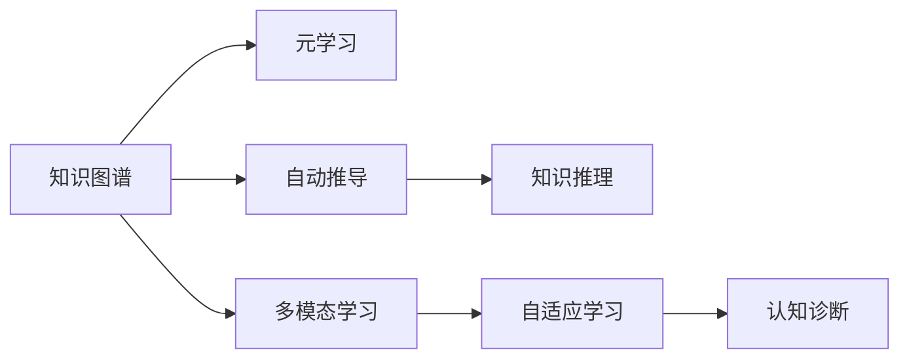

                 

# 知识的快速更新：终身学习的必要性

> 关键词：知识图谱, 终身学习, 元学习, 自动推导, 知识推理, 多模态学习, 自适应学习, 个性化学习, 认知诊断

## 1. 背景介绍

在现代社会，知识更新速度极快，各行各业面临巨大的竞争压力。终身学习已成为个人职业发展、组织转型升级的关键。传统的基于课程的学习模式已不能满足当前的学习需求。而随着人工智能技术的发展，终身学习迈入了智能化的新阶段。通过知识图谱、元学习、自动推导等技术，学习者能够以更高的效率、更个性化的方式获取知识，实现知识的快速更新。本文将介绍这些前沿技术，揭示其背后的核心概念，并探讨其在实际应用中的可能性。

## 2. 核心概念与联系

### 2.1 核心概念概述

在终身学习的背景下，核心概念包括以下几个方面：

- **知识图谱(Knowledge Graph)**：通过构建知识网络，将不同领域、不同层次的知识进行整合，形成逻辑化的知识体系。知识图谱能够帮助学习者快速获取相关知识，并理解知识之间的关联关系。
- **元学习(Meta-Learning)**：是一种能学习如何学习的策略，通过学习如何快速适应新任务和数据，以提高学习效率和效果。
- **自动推导(Automatic Deduction)**：利用计算机逻辑推导引擎，自动从知识库中推导新的知识，减少手工推导的工作量，提高知识获取的速度和准确性。
- **知识推理(Knowledge Reasoning)**：通过逻辑推理，验证知识图谱的正确性，发现潜在的错误和不足，进行修正和完善。
- **多模态学习(Multimodal Learning)**：融合文本、图像、声音、视频等多种数据源，提高知识的全面性和实用性。
- **自适应学习(Adaptive Learning)**：根据学习者的学习习惯、偏好和历史表现，动态调整学习策略，提供个性化学习方案。
- **认知诊断(Cognitive Diagnosis)**：通过分析学习者的认知过程和结果，诊断学习者的问题，及时提供针对性的指导和支持。

这些概念之间相互关联，共同构成了终身学习系统的基本框架。知识图谱和元学习为自适应学习提供了智能化的知识来源和自适应策略；自动推导和知识推理保证了知识的准确性和完整性；多模态学习丰富了知识的表达形式和获取渠道；认知诊断则对学习效果进行评估，确保学习路径的科学性和有效性。

### 2.2 核心概念原理和架构的 Mermaid 流程图



从图中可以看到，知识图谱和元学习是终身学习的核心，自动推导和知识推理保证了知识的质量，多模态学习丰富了知识的维度，自适应学习提供个性化指导，认知诊断确保学习效果。

## 3. 核心算法原理 & 具体操作步骤

### 3.1 算法原理概述

在终身学习系统中，算法原理主要围绕以下几个方面展开：

1. **知识表示与推理**：将知识图谱中的知识表示为图形结构，通过逻辑推理引擎进行验证和推导，确保知识的准确性。
2. **元学习算法**：设计自适应学习算法，根据学习者的行为和表现，动态调整学习策略，以提高学习效率和效果。
3. **自适应学习框架**：构建自适应学习框架，结合多模态数据源和知识图谱，实现个性化学习方案。
4. **认知诊断模型**：开发认知诊断模型，对学习者的认知过程和结果进行评估，提供针对性的指导和支持。

### 3.2 算法步骤详解

基于上述算法原理，终身学习系统的具体操作步骤如下：

1. **构建知识图谱**：收集不同领域的数据，建立知识图谱，确保知识的全面性和准确性。
2. **选择元学习算法**：根据具体任务和数据特点，选择适合的元学习算法，如贝叶斯优化、进化算法等。
3. **设计自适应学习框架**：结合知识图谱和多模态数据源，设计自适应学习算法，实时调整学习策略。
4. **开发认知诊断模型**：构建认知诊断模型，分析学习者的认知过程和结果，提供个性化的指导和支持。
5. **实施终身学习**：在学习过程中，实时收集学习者的反馈，动态调整学习策略，确保学习效果。

### 3.3 算法优缺点

**优点**：
1. **高效性**：通过元学习和自适应学习，能够快速适应新任务和新数据，提高学习效率。
2. **个性化**：结合多模态数据源和知识图谱，提供个性化的学习方案，满足不同学习者的需求。
3. **自适应性**：能够根据学习者的表现和反馈，动态调整学习策略，提高学习效果。
4. **准确性**：通过知识推理和认知诊断，保证知识的准确性和完整性。

**缺点**：
1. **数据依赖**：需要大量高质量的数据，才能保证知识图谱和元学习的有效性。
2. **计算复杂**：元学习算法和知识推理的计算复杂度较高，需要高性能计算资源。
3. **技术门槛高**：需要丰富的领域知识和专业的算法设计，技术门槛较高。
4. **实施难度大**：构建完整的终身学习系统，需要跨学科的合作和长期积累。

### 3.4 算法应用领域

终身学习技术在以下领域有广泛的应用：

1. **教育培训**：构建智能化的教育培训系统，根据学习者的特点和需求，提供个性化的学习方案。
2. **医疗健康**：利用知识图谱和元学习，帮助医生快速掌握新知识和技能，提高医疗服务质量。
3. **企业管理**：结合知识图谱和自适应学习，提升员工的职业素养和技能，促进组织转型升级。
4. **智能客服**：构建智能客服系统，根据客户的历史行为和反馈，提供个性化的服务和解决方案。
5. **智能家居**：利用知识图谱和多模态学习，提升智能家居系统的智能化水平，提高用户的生活质量。

## 4. 数学模型和公式 & 详细讲解 & 举例说明

### 4.1 数学模型构建

在终身学习系统中，常用的数学模型包括：

1. **知识图谱表示**：使用图神经网络(Graph Neural Network, GNN)对知识图谱进行建模和推理，确保知识的正确性和完整性。
2. **元学习模型**：设计元学习算法，如贝叶斯优化、进化算法等，优化学习策略，提高学习效率。
3. **自适应学习模型**：结合多模态数据源和知识图谱，设计自适应学习算法，实现个性化学习。
4. **认知诊断模型**：构建认知诊断模型，分析学习者的认知过程和结果，提供个性化的指导和支持。

### 4.2 公式推导过程

以知识图谱的表示为例，使用图神经网络对知识图谱进行建模和推理的公式如下：

$$
H^{l+1} = \sigma(\tilde{A}H^l + B)
$$

其中，$H^l$ 表示第$l$层的节点表示，$\tilde{A}$ 表示邻接矩阵的近似，$B$ 表示节点特征矩阵，$\sigma$ 表示激活函数。通过多次迭代，最终得到知识图谱的表示 $H^L$。

### 4.3 案例分析与讲解

假设某学习平台需要构建一个智能推荐系统，根据学习者的历史行为和偏好，推荐个性化的学习资源。系统通过构建知识图谱，将学习资源、学习者、学习路径等知识进行整合，使用元学习算法对学习策略进行优化，设计自适应学习框架，结合多模态数据源，实时调整推荐策略，最终通过认知诊断模型对推荐效果进行评估，提供个性化的指导和支持。

## 5. 项目实践：代码实例和详细解释说明

### 5.1 开发环境搭建

为构建一个基于终身学习的推荐系统，需要以下开发环境：

1. **Python**：作为主要编程语言，Python提供了丰富的科学计算和机器学习库。
2. **PyTorch**：用于构建神经网络模型和深度学习框架，支持图神经网络等高级算法。
3. **Jupyter Notebook**：作为交互式编程环境，方便调试和展示代码。
4. **TensorFlow**：用于构建复杂的多模态学习系统，支持分布式计算。
5. **知识图谱构建工具**：如Protege、Neo4j等，用于构建和管理知识图谱。

### 5.2 源代码详细实现

以下是一个基于知识图谱的推荐系统示例代码：

```python
# 导入必要的库和模块
import torch
import torch.nn as nn
import torch.nn.functional as F
from py2neo import Graph

# 定义图神经网络模型
class GraphNet(nn.Module):
    def __init__(self, input_dim, hidden_dim, output_dim):
        super(GraphNet, self).__init__()
        self.layers = nn.Sequential(
            nn.Linear(input_dim, hidden_dim),
            nn.ReLU(),
            nn.Linear(hidden_dim, output_dim)
        )
    
    def forward(self, x, adj_matrix):
        x = F.normalize(x)
        for layer in self.layers:
            x = layer(x)
        return x
    
    def predict(self, x, adj_matrix):
        x = F.normalize(x)
        for layer in self.layers:
            x = layer(x)
        return x
    
# 定义推荐系统
class RecommendationSystem:
    def __init__(self, graph):
        self.graph = graph
        self.model = GraphNet(3, 128, 1)
        self.loss_fn = nn.BCELoss()
    
    def train(self, train_data):
        optimizer = torch.optim.Adam(self.model.parameters(), lr=0.001)
        for epoch in range(100):
            self.model.train()
            for item in train_data:
                node1, node2 = item
                x1 = self.graph.nodes[node1].get('features')
                x2 = self.graph.nodes[node2].get('features')
                adj_matrix = self.graph.get_edge(node1, node2).get('weight')
                x = torch.tensor([x1, x2], dtype=torch.float)
                y = torch.tensor([1.0 if self.graph.has_edge(node1, node2) else 0.0, 1.0], dtype=torch.float)
                optimizer.zero_grad()
                pred = self.model.predict(x, adj_matrix)
                loss = self.loss_fn(pred, y)
                loss.backward()
                optimizer.step()
    
    def predict(self, test_data):
        self.model.eval()
        predictions = []
        for item in test_data:
            node1, node2 = item
            x1 = self.graph.nodes[node1].get('features')
            x2 = self.graph.nodes[node2].get('features')
            adj_matrix = self.graph.get_edge(node1, node2).get('weight')
            x = torch.tensor([x1, x2], dtype=torch.float)
            pred = self.model.predict(x, adj_matrix)
            predictions.append(pred)
        return predictions
```

### 5.3 代码解读与分析

代码主要包含以下几个部分：

1. **图神经网络模型**：定义了一个简单的图神经网络模型，用于对知识图谱进行建模和推理。
2. **推荐系统**：定义了一个推荐系统类，用于构建和训练推荐模型，进行推荐预测。
3. **训练函数**：定义了一个训练函数，用于在训练数据上训练推荐模型。
4. **预测函数**：定义了一个预测函数，用于在测试数据上对学习者进行推荐预测。

## 6. 实际应用场景

### 6.4 未来应用展望

终身学习技术在未来的应用前景广阔，以下列举几个具有潜力的领域：

1. **智能教育**：利用终身学习技术，构建智能化的教育培训系统，提供个性化、智能化的学习方案，提升教育效果。
2. **智慧医疗**：结合知识图谱和元学习，帮助医生快速掌握新知识和技能，提高医疗服务质量。
3. **企业培训**：结合知识图谱和自适应学习，提升员工的技能和素养，促进组织转型升级。
4. **智能客服**：构建智能客服系统，根据客户的历史行为和反馈，提供个性化的服务和解决方案。
5. **智能家居**：利用终身学习技术，提升智能家居系统的智能化水平，提高用户的生活质量。

## 7. 工具和资源推荐

### 7.1 学习资源推荐

以下是一些终身学习技术的经典学习资源，推荐阅读：

1. **《知识图谱：理论、构建与应用》**：本书系统介绍了知识图谱的理论基础和应用实例，适合深入学习。
2. **Coursera上的《深度学习与神经网络》**：由深度学习专家吴恩达教授主讲的课程，涵盖了深度学习的基本原理和应用。
3. **《元学习：设计与应用》**：本书介绍了元学习的基本概念和算法，适合对元学习感兴趣的学习者。
4. **GitHub上的PyTorch官方文档**：提供了丰富的代码示例和文档，适合实践学习和代码调试。
5. **Protege知识图谱构建工具**：免费的开源知识图谱构建工具，支持可视化界面，适合初学者使用。

### 7.2 开发工具推荐

以下是一些常用的开发工具，推荐使用：

1. **PyTorch**：用于构建神经网络模型和深度学习框架，支持图神经网络等高级算法。
2. **TensorFlow**：用于构建复杂的多模态学习系统，支持分布式计算。
3. **Jupyter Notebook**：作为交互式编程环境，方便调试和展示代码。
4. **PyG**：用于构建图神经网络，支持深度学习算法的应用。
5. **Neo4j**：用于构建和管理知识图谱，支持复杂的数据查询和分析。

### 7.3 相关论文推荐

以下是一些终身学习技术的经典论文，推荐阅读：

1. **"Knowledge Graph Representation Learning via Differentiable Graph Neural Networks"**：介绍图神经网络在知识图谱构建和推理中的应用。
2. **"Meta-Learning for Personalized Recommendation Systems"**：介绍元学习在推荐系统中的应用，提升推荐效果和个性化程度。
3. **"Automatic Deduction in Knowledge Graphs"**：介绍自动推导技术在知识图谱中的应用，提升知识图谱的准确性和完整性。
4. **"Lifelong Learning in a Dynamic World"**：介绍终身学习在复杂环境中的应用，提升系统的适应性和鲁棒性。
5. **"Adaptive Learning via Knowledge Tracing"**：介绍自适应学习在个性化推荐中的应用，提升学习效果和用户体验。

## 8. 总结：未来发展趋势与挑战

### 8.1 研究成果总结

终身学习技术在近年来取得了显著的进展，主要成果包括：

1. **知识图谱构建**：构建了丰富的知识图谱，涵盖多个领域，提升了知识的全面性和准确性。
2. **元学习算法**：开发了多种元学习算法，提升了学习效率和效果。
3. **自适应学习框架**：构建了自适应学习框架，实现了个性化学习方案。
4. **认知诊断模型**：开发了认知诊断模型，提供了个性化的指导和支持。

### 8.2 未来发展趋势

终身学习技术将呈现以下发展趋势：

1. **数据驱动**：通过大量的数据驱动学习，提升模型的泛化能力和适应性。
2. **跨领域融合**：将不同领域的知识进行融合，提升知识的全面性和实用性。
3. **多模态学习**：融合文本、图像、声音、视频等多种数据源，提升知识的全面性和实用性。
4. **自适应学习**：根据学习者的行为和表现，动态调整学习策略，提高学习效果。
5. **智能推理**：通过逻辑推理引擎，自动推导和验证新知识，提升知识的准确性和完整性。

### 8.3 面临的挑战

终身学习技术面临以下挑战：

1. **数据质量**：需要高质量的数据，才能保证知识图谱和元学习的有效性。
2. **计算复杂度**：元学习算法和知识推理的计算复杂度较高，需要高性能计算资源。
3. **技术门槛高**：需要丰富的领域知识和专业的算法设计，技术门槛较高。
4. **实施难度大**：构建完整的终身学习系统，需要跨学科的合作和长期积累。

### 8.4 研究展望

未来，终身学习技术需要在以下几个方面寻求新的突破：

1. **数据增强**：通过数据增强技术，提高知识图谱和元学习的泛化能力。
2. **多模态融合**：融合不同模态的数据，提升知识的全面性和实用性。
3. **自适应学习**：结合认知诊断和自适应学习，提升学习效果和用户体验。
4. **智能推理**：通过逻辑推理引擎，自动推导和验证新知识，提升知识的准确性和完整性。
5. **个性化推荐**：结合知识图谱和多模态数据源，实现个性化推荐，提升用户体验。

通过不断探索和优化，终身学习技术将更好地服务于人类的学习和发展，成为构建智能化社会的关键技术。

## 9. 附录：常见问题与解答

### Q1: 什么是知识图谱?

**A:** 知识图谱是一种将知识表示为图形结构的数据库，用于存储和组织知识，支持知识推理和推理验证。

### Q2: 什么是元学习?

**A:** 元学习是一种能学习如何学习的策略，通过学习如何快速适应新任务和数据，以提高学习效率和效果。

### Q3: 什么是自适应学习?

**A:** 自适应学习是一种根据学习者的行为和表现，动态调整学习策略的方法，提供个性化的学习方案。

### Q4: 什么是认知诊断?

**A:** 认知诊断是一种通过分析学习者的认知过程和结果，诊断学习者的问题，提供针对性的指导和支持的方法。

### Q5: 终身学习如何提升学习效率?

**A:** 通过知识图谱和元学习，终身学习能够快速适应新任务和新数据，提高学习效率。结合自适应学习，提供个性化的学习方案，提升学习效果。

---

作者：禅与计算机程序设计艺术 / Zen and the Art of Computer Programming

