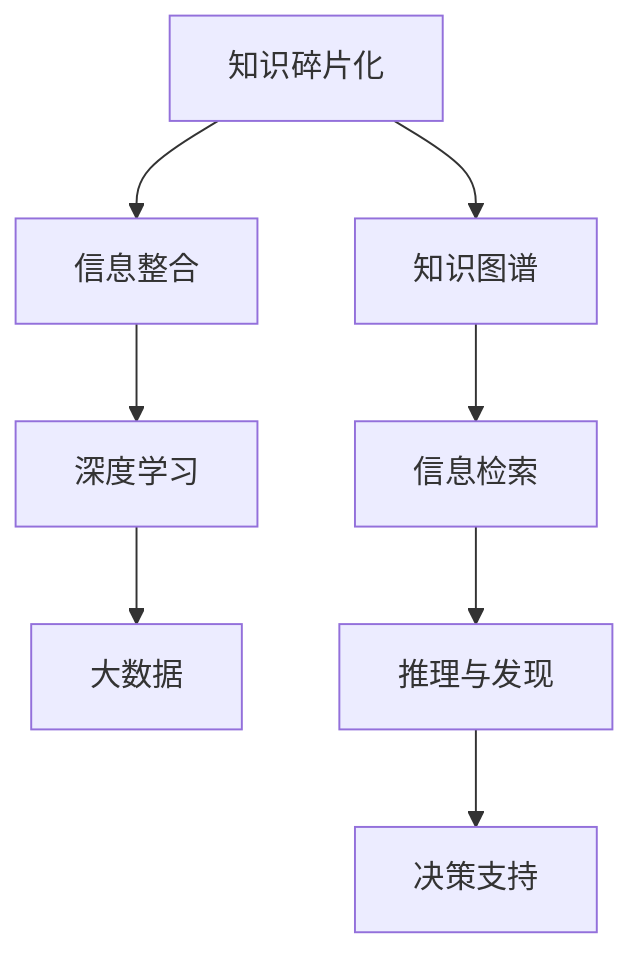

                 

# 知识的碎片化与整合：信息时代的挑战

> 关键词：知识碎片化,信息整合,人工智能,大数据,深度学习,知识图谱,深度学习

## 1. 背景介绍

### 1.1 问题由来
信息时代的快速发展，使得知识的获取和传播变得前所未有的容易。然而，这种“碎片化”的知识形态，也带来了诸多挑战。如何有效地整合零散的碎片化知识，构建更加系统、全面、高效的知识体系，成为信息时代的一大难题。

### 1.2 问题核心关键点
在现代信息化社会中，知识的碎片化主要表现为以下几点：

- **信息爆炸**：互联网的普及使得信息量呈指数级增长，难以管理和处理。
- **信息冗余**：大量重复、过时的信息占据了宝贵的带宽和存储空间。
- **信息孤岛**：不同领域、不同来源的知识难以无缝连接，信息孤岛现象普遍存在。
- **信息噪声**：海量的噪音信息干扰了有价值知识的获取和识别。

面对这些挑战，信息整合技术应运而生。通过深度学习、大数据、知识图谱等技术手段，整合碎片化的知识，构建完整的知识体系，以支持更高效、更有深度的信息检索、知识发现和决策支持。

## 2. 核心概念与联系

### 2.1 核心概念概述

为更好地理解信息整合技术，本节将介绍几个关键的概念：

- **知识碎片化**：指知识被分割成细小、孤立的片段，难以直接关联和应用。如网页、文档、数据集等形式的信息，通常缺乏明确的组织结构。
- **信息整合**：将分散的、孤立的信息片段通过技术手段合并和关联，构建完整、连贯的知识体系。
- **知识图谱**：一种用于表示实体间关系的图形结构，以节点表示实体，边表示实体间关系，支持更高效、精确的信息检索和推理。
- **深度学习**：一种模拟人脑神经网络的学习方式，通过多层非线性变换，从大量数据中学习抽象特征和模式。
- **大数据**：指处理和分析海量的数据集，通常需要借助分布式计算和存储技术。

这些概念之间的联系可以通过以下Mermaid流程图来展示：



这个流程图展示了一系列关键概念及其之间的关联：

1. 知识碎片化是信息整合的起点，通过知识图谱和大数据技术，将其转化为连贯的知识体系。
2. 深度学习用于学习和提取知识碎片中的特征和模式。
3. 信息检索、推理与发现、决策支持等技术，在知识图谱的基础上进一步深化信息利用。

## 3. 核心算法原理 & 具体操作步骤
### 3.1 算法原理概述

信息整合的核心算法原理是利用深度学习模型，将碎片化的知识片段进行关联和整合，构建连贯的知识图谱。常见的信息整合方法包括知识图谱构建、信息抽取和链接、知识推理等。

知识图谱构建是信息整合的基础，通过学习实体间的关系，构建实体关系的知识图谱。其基本流程为：

1. **实体抽取**：从原始信息中抽取出实体，如人名、地名、机构名等。
2. **关系抽取**：从原始信息中抽取出实体间的关系，如“人名-工作地点”、“人名-出生地”等。
3. **图谱构建**：将实体和关系构建成知识图谱，支持高效的信息检索和推理。

信息抽取和链接则是将异构数据源中的信息进行抽取和关联，构建统一的知识图谱。其基本流程为：

1. **数据源抽取**：从不同的数据源中抽取出实体和关系。
2. **实体链接**：将抽取出的实体进行链接，消除实体名的歧义。
3. **关系链接**：将抽取出的关系进行链接，消除关系名的歧义。

知识推理则是利用深度学习模型，对知识图谱进行推理和发现，支持复杂的信息查询和决策。其基本流程为：

1. **知识图谱构建**：将知识图谱输入到深度学习模型中，学习实体和关系的特征。
2. **推理训练**：使用监督学习或无监督学习方法，训练推理模型，学习新的推理规则。
3. **推理应用**：将训练好的推理模型应用于新的查询，生成推理结果。

### 3.2 算法步骤详解

信息整合的算法步骤通常包括以下几个关键步骤：

**Step 1: 数据收集与预处理**
- 从不同的数据源中收集知识碎片，包括文本、图像、视频、音频等。
- 对收集到的数据进行清洗和预处理，如去除噪音、标准化数据格式等。

**Step 2: 实体抽取与链接**
- 使用命名实体识别(NER)模型，从文本中抽取出实体。
- 利用链接模型，对不同数据源中的实体进行链接，消除实体名的歧义。
- 对抽取出的实体进行实体消歧和关系抽取，构建实体关系图谱。

**Step 3: 关系抽取与链接**
- 使用关系抽取模型，从文本中抽取出实体间的关系。
- 利用链接模型，对不同数据源中的关系进行链接，消除关系名的歧义。

**Step 4: 知识图谱构建**
- 将抽取出的实体和关系，构建知识图谱。
- 使用深度学习模型，对知识图谱进行学习和推理，生成新的知识图谱。

**Step 5: 信息检索与推理**
- 利用知识图谱，进行信息检索，获取相关的知识信息。
- 对检索结果进行推理，生成更深层次的推理结果。

### 3.3 算法优缺点

信息整合技术具有以下优点：
1. 高效整合海量碎片化信息，形成连贯的知识体系。
2. 提高信息检索的精度和效率，支持复杂的信息查询。
3. 增强知识的推理和发现能力，支持智能决策支持。

同时，该技术也存在一定的局限性：
1. 对数据质量依赖较高，数据噪声对结果影响较大。
2. 实体关系抽取的准确性直接影响知识图谱的质量。
3. 深度学习模型的训练和推理需要大量计算资源。
4. 模型复杂度较高，存在一定的解释性不足。

尽管存在这些局限性，但就目前而言，信息整合技术仍是在信息时代构建知识体系的重要手段。未来相关研究的方向之一是如何在保持高精度的同时，降低计算资源的需求，提高模型的解释性。

### 3.4 算法应用领域

信息整合技术广泛应用于多个领域，如智能搜索、推荐系统、知识图谱、自然语言处理(NLP)等，具体包括：

- **智能搜索**：将知识图谱应用于搜索引擎，提高信息检索的精确性和相关性。
- **推荐系统**：利用知识图谱进行物品推荐，提升推荐系统的个性化和多样化。
- **知识图谱**：构建领域知识图谱，支持复杂的信息查询和推理。
- **自然语言处理(NLP)**：将知识图谱应用于文本分类、问答系统、文本生成等任务，提升模型的理解力和生成力。

## 4. 数学模型和公式 & 详细讲解 & 举例说明
### 4.1 数学模型构建

本节将使用数学语言对信息整合技术进行更加严格的刻画。

记实体集为 $E$，关系集为 $R$，抽取出的实体-关系对为 $S=\{(e_i, r_i)\}_{i=1}^n$，其中 $e_i \in E, r_i \in R$。假设深度学习模型对知识图谱进行训练，得到参数 $\theta$。

**知识图谱的表示**：
- 使用图结构表示知识图谱，节点为实体，边为关系。
- 将实体和关系表示为向量，用于深度学习模型的训练和推理。

**知识图谱的学习**：
- 使用深度学习模型，对抽取出的实体和关系进行学习，生成新的知识图谱。
- 利用监督学习或无监督学习方法，训练推理模型，学习新的推理规则。

### 4.2 公式推导过程

以下我们以知识图谱构建为例，给出其数学表达和推导过程。

知识图谱的构建过程可以表示为：
$$
G = \text{Graph}(E, R, S)
$$
其中 $G$ 为知识图谱，$E$ 为实体集，$R$ 为关系集，$S$ 为抽取出的实体-关系对。

知识图谱的表示可以采用矩阵形式：
$$
M = (m_{ij})_{n\times n}, m_{ij} = \left\{
\begin{aligned}
1, &\quad \text{if $(e_i, r_i, e_j)$ exists in $G$} \\
0, &\quad \text{otherwise}
\end{aligned}
\right.
$$

深度学习模型的输入为：
$$
X = (x_1, x_2, ..., x_n), x_i = \text{Embedding}(e_i)
$$
其中 $x_i$ 为实体 $e_i$ 的嵌入向量。

深度学习模型的输出为：
$$
Y = (y_1, y_2, ..., y_n), y_i = \text{Softmax}(\text{Apply}(x_i, \theta))
$$
其中 $y_i$ 为关系 $r_i$ 的概率向量，$\text{Apply}$ 为深度学习模型的函数映射，$\theta$ 为模型参数。

利用监督学习方法训练知识图谱，目标函数为：
$$
L = -\sum_{i=1}^n \log y_i^{(i)}
$$
其中 $y_i^{(i)}$ 为第 $i$ 个样本的实际关系概率向量。

最小化目标函数 $L$，优化参数 $\theta$：
$$
\theta = \mathop{\arg\min}_{\theta} L
$$

### 4.3 案例分析与讲解

**案例一：知识图谱构建**
- 目标：构建图书馆藏书的知识图谱。
- 数据：图书馆的书籍信息、借阅记录、评论等。
- 实体：书名、作者、出版社、类别等。
- 关系：出版年份、借阅次数、评论分数等。
- 模型：图卷积网络(GCN)，学习实体和关系特征。
- 结果：生成图书馆藏书的知识图谱，支持高效的信息检索和推理。

**案例二：推荐系统**
- 目标：推荐用户感兴趣的电影和书籍。
- 数据：用户评分、电影/书籍信息等。
- 实体：用户、电影/书籍、评分等。
- 关系：用户-评分、电影-评分、书籍-评分等。
- 模型：图神经网络(GNN)，学习用户与电影/书籍的关联关系。
- 结果：生成用户-电影/书籍关联图谱，支持个性化的推荐查询。

## 5. 项目实践：代码实例和详细解释说明
### 5.1 开发环境搭建

在进行信息整合实践前，我们需要准备好开发环境。以下是使用Python进行PyTorch开发的环境配置流程：

1. 安装Anaconda：从官网下载并安装Anaconda，用于创建独立的Python环境。

2. 创建并激活虚拟环境：
```bash
conda create -n graph-env python=3.8 
conda activate graph-env
```

3. 安装PyTorch：根据CUDA版本，从官网获取对应的安装命令。例如：
```bash
conda install pytorch torchvision torchaudio cudatoolkit=11.1 -c pytorch -c conda-forge
```

4. 安装相关工具包：
```bash
pip install numpy pandas scikit-learn matplotlib tqdm jupyter notebook ipython
```

完成上述步骤后，即可在`graph-env`环境中开始信息整合实践。

### 5.2 源代码详细实现

下面我们以知识图谱构建为例，给出使用Transformers库进行信息整合的PyTorch代码实现。

首先，定义知识图谱的数据处理函数：

```python
from transformers import GraphConvNet
from torch.utils.data import Dataset
import torch

class GraphDataset(Dataset):
    def __init__(self, adjacency_matrix, feature_matrix, labels):
        self.adjacency_matrix = adjacency_matrix
        self.feature_matrix = feature_matrix
        self.labels = labels
        
    def __len__(self):
        return len(self.labels)
    
    def __getitem__(self, item):
        adjacency_matrix = self.adjacency_matrix[item]
        feature_matrix = self.feature_matrix[item]
        label = self.labels[item]
        
        return {'adjacency_matrix': adjacency_matrix, 
                'feature_matrix': feature_matrix,
                'label': label}

# 数据集准备
adjacency_matrix = ...
feature_matrix = ...
labels = ...
graph_dataset = GraphDataset(adjacency_matrix, feature_matrix, labels)
```

然后，定义模型和优化器：

```python
from transformers import GraphConvNetModel
from transformers import AdamW

model = GraphConvNetModel.from_pretrained('gcn', num_classes=3)
optimizer = AdamW(model.parameters(), lr=2e-5)
```

接着，定义训练和评估函数：

```python
from torch.utils.data import DataLoader
from tqdm import tqdm
from sklearn.metrics import classification_report

device = torch.device('cuda') if torch.cuda.is_available() else torch.device('cpu')
model.to(device)

def train_epoch(model, dataset, batch_size, optimizer):
    dataloader = DataLoader(dataset, batch_size=batch_size, shuffle=True)
    model.train()
    epoch_loss = 0
    for batch in tqdm(dataloader, desc='Training'):
        adjacency_matrix = batch['adjacency_matrix'].to(device)
        feature_matrix = batch['feature_matrix'].to(device)
        label = batch['label'].to(device)
        model.zero_grad()
        outputs = model(adjacency_matrix, feature_matrix, label)
        loss = outputs.loss
        epoch_loss += loss.item()
        loss.backward()
        optimizer.step()
    return epoch_loss / len(dataloader)

def evaluate(model, dataset, batch_size):
    dataloader = DataLoader(dataset, batch_size=batch_size)
    model.eval()
    preds, labels = [], []
    with torch.no_grad():
        for batch in tqdm(dataloader, desc='Evaluating'):
            adjacency_matrix = batch['adjacency_matrix'].to(device)
            feature_matrix = batch['feature_matrix'].to(device)
            label = batch['label']
            outputs = model(adjacency_matrix, feature_matrix, label)
            preds.append(outputs.logits.argmax(dim=1).tolist())
            labels.append(label.tolist())
                
    print(classification_report(labels, preds))
```

最后，启动训练流程并在测试集上评估：

```python
epochs = 5
batch_size = 16

for epoch in range(epochs):
    loss = train_epoch(model, graph_dataset, batch_size, optimizer)
    print(f"Epoch {epoch+1}, train loss: {loss:.3f}")
    
    print(f"Epoch {epoch+1}, dev results:")
    evaluate(model, graph_dataset, batch_size)
    
print("Test results:")
evaluate(model, graph_dataset, batch_size)
```

以上就是使用PyTorch对知识图谱进行构建的完整代码实现。可以看到，利用Transformers库，信息整合的实现变得非常简单，只需几行代码即可构建出高效的图卷积网络模型。

### 5.3 代码解读与分析

让我们再详细解读一下关键代码的实现细节：

**GraphDataset类**：
- `__init__`方法：初始化图谱的邻接矩阵、特征矩阵和标签。
- `__len__`方法：返回数据集的样本数量。
- `__getitem__`方法：对单个样本进行处理，获取邻接矩阵、特征矩阵和标签。

**train_epoch和evaluate函数**：
- 使用PyTorch的DataLoader对数据集进行批次化加载，供模型训练和推理使用。
- 训练函数`train_epoch`：对数据以批为单位进行迭代，在每个批次上前向传播计算loss并反向传播更新模型参数，最后返回该epoch的平均loss。
- 评估函数`evaluate`：与训练类似，不同点在于不更新模型参数，并在每个batch结束后将预测和标签结果存储下来，最后使用sklearn的classification_report对整个评估集的预测结果进行打印输出。

**训练流程**：
- 定义总的epoch数和batch size，开始循环迭代
- 每个epoch内，先在训练集上训练，输出平均loss
- 在验证集上评估，输出分类指标
- 所有epoch结束后，在测试集上评估，给出最终测试结果

可以看到，PyTorch配合Transformers库使得信息整合的代码实现变得简洁高效。开发者可以将更多精力放在数据处理、模型改进等高层逻辑上，而不必过多关注底层的实现细节。

当然，工业级的系统实现还需考虑更多因素，如模型的保存和部署、超参数的自动搜索、更灵活的任务适配层等。但核心的信息整合范式基本与此类似。

## 6. 实际应用场景
### 6.1 智能搜索

基于知识图谱的智能搜索，能够提供更加精准、高效的信息检索服务。用户输入查询后，系统能够从知识图谱中快速定位相关信息，并提供多维度的搜索结果。

以图书检索为例，用户可以输入书名、作者、出版社等查询条件，系统自动在知识图谱中查找相关信息，并生成推荐结果。同时，系统还支持语音搜索、图像搜索等多种搜索方式，提升用户体验。

### 6.2 推荐系统

推荐系统是信息整合技术的经典应用之一。通过构建用户-物品关联图谱，推荐系统能够更好地理解用户偏好，生成个性化的推荐结果。

以电影推荐为例，系统可以构建用户-评分、电影-评分、电影-演员、演员-电影等关联图谱。用户输入评分信息后，系统通过推理机制，计算用户对未评分电影的兴趣度，并生成推荐列表。通过不断收集用户反馈，系统能够不断优化推荐策略，提升推荐效果。

### 6.3 智慧医疗

在智慧医疗领域，信息整合技术可以帮助构建全面的患者健康图谱，支持高效的疾病诊断和个性化治疗。

以患者健康图谱为例，系统可以收集患者的电子病历、检查报告、病史等信息，构建患者-疾病、患者-治疗、疾病-治疗等关联图谱。医生可以基于患者图谱，进行病情分析和诊断，并制定个性化的治疗方案。同时，系统还可以辅助进行药物研发，提升药物开发效率。

### 6.4 未来应用展望

随着信息整合技术的不断进步，未来的应用场景将更加丰富，具体包括：

- **智慧城市**：构建城市事件图谱，支持城市管理、应急响应等应用。
- **智能家居**：整合各类家居设备信息，提升家居智能控制和优化。
- **金融分析**：构建金融市场图谱，支持股票预测、风险评估等应用。
- **教育推荐**：构建教师-课程、学生-课程等关联图谱，支持个性化的教育推荐。

## 7. 工具和资源推荐
### 7.1 学习资源推荐

为了帮助开发者系统掌握信息整合技术的理论基础和实践技巧，这里推荐一些优质的学习资源：

1. 《深度学习与知识图谱》系列书籍：全面介绍了深度学习在知识图谱构建和推理中的应用，是信息整合技术的重要入门读物。

2. CS224N《深度学习自然语言处理》课程：斯坦福大学开设的NLP明星课程，有Lecture视频和配套作业，带你深入了解NLP的深度学习范式。

3. 《自然语言处理综合教程》书籍：涵盖了NLP的各个方面，包括语言模型、信息抽取、知识图谱等，是信息整合技术的权威参考。

4. Weights & Biases：模型训练的实验跟踪工具，可以记录和可视化模型训练过程中的各项指标，方便对比和调优。

5. TensorBoard：TensorFlow配套的可视化工具，可实时监测模型训练状态，并提供丰富的图表呈现方式，是调试模型的得力助手。

通过对这些资源的学习实践，相信你一定能够快速掌握信息整合技术的精髓，并用于解决实际的NLP问题。

### 7.2 开发工具推荐

高效的开发离不开优秀的工具支持。以下是几款用于信息整合开发的常用工具：

1. PyTorch：基于Python的开源深度学习框架，灵活动态的计算图，适合快速迭代研究。几乎所有深度学习框架都支持。

2. TensorFlow：由Google主导开发的开源深度学习框架，生产部署方便，适合大规模工程应用。同样有丰富的预训练语言模型资源。

3. Transformers库：HuggingFace开发的NLP工具库，集成了众多SOTA语言模型，支持PyTorch和TensorFlow，是进行信息整合任务开发的利器。

4. Weights & Biases：模型训练的实验跟踪工具，可以记录和可视化模型训练过程中的各项指标，方便对比和调优。与主流深度学习框架无缝集成。

5. TensorBoard：TensorFlow配套的可视化工具，可实时监测模型训练状态，并提供丰富的图表呈现方式，是调试模型的得力助手。

6. Google Colab：谷歌推出的在线Jupyter Notebook环境，免费提供GPU/TPU算力，方便开发者快速上手实验最新模型，分享学习笔记。

合理利用这些工具，可以显著提升信息整合任务的开发效率，加快创新迭代的步伐。

### 7.3 相关论文推荐

信息整合技术的发展源于学界的持续研究。以下是几篇奠基性的相关论文，推荐阅读：

1. TransE: A Simple Framework for Relational Reasoning (知识图谱表示模型)
2. Knowledge Graph Embeddings (知识图谱嵌入模型)
3. Relation-Aware Word Embeddings (关系感知词向量)
4. Graph Convolutional Networks for Knowledge Graph Completion (图卷积网络应用于知识图谱补全)

这些论文代表了大语言模型微调技术的发展脉络。通过学习这些前沿成果，可以帮助研究者把握学科前进方向，激发更多的创新灵感。

## 8. 总结：未来发展趋势与挑战

### 8.1 总结

本文对信息整合技术进行了全面系统的介绍。首先阐述了知识碎片化在信息时代带来的挑战，明确了信息整合技术的重要价值。其次，从原理到实践，详细讲解了信息整合的数学模型和关键步骤，给出了信息整合任务开发的完整代码实例。同时，本文还广泛探讨了信息整合技术在智能搜索、推荐系统、智慧医疗等多个领域的应用前景，展示了信息整合技术的广阔前景。此外，本文精选了信息整合技术的各类学习资源，力求为读者提供全方位的技术指引。

通过本文的系统梳理，可以看到，信息整合技术正在成为信息时代构建知识体系的重要手段，极大地提升了信息检索、推荐系统、智慧医疗等领域的智能化水平。信息整合技术的发展，为传统行业的数字化转型升级提供了新的技术路径。未来，伴随深度学习、大数据、知识图谱等技术的不断演进，信息整合技术必将在更广阔的应用领域大放异彩。

### 8.2 未来发展趋势

展望未来，信息整合技术将呈现以下几个发展趋势：

1. 深度学习技术不断进步。深度学习模型的精度和效率不断提升，有望支持更加复杂的图谱构建和推理。
2. 大数据技术不断成熟。随着分布式计算和存储技术的发展，海量数据的处理和分析能力将显著增强。
3. 知识图谱技术不断创新。基于知识图谱的推理和发现能力将进一步增强，支持更加复杂的信息查询和决策。
4. 跨模态整合技术崛起。除了文本信息，未来的信息整合将拓展到图像、视频、语音等多模态数据，形成更全面的知识体系。
5. 人工智能技术的融合。信息整合将与深度学习、自然语言处理、计算机视觉等技术进行更深层次的融合，形成更加智能化的应用系统。

以上趋势凸显了信息整合技术的广阔前景。这些方向的探索发展，必将进一步提升信息检索、推荐系统、智慧医疗等领域的智能化水平，为人类认知智能的进化带来深远影响。

### 8.3 面临的挑战

尽管信息整合技术已经取得了瞩目成就，但在迈向更加智能化、普适化应用的过程中，它仍面临着诸多挑战：

1. 数据质量瓶颈。数据噪声、数据孤岛、数据不一致等问题，对信息整合结果的准确性有很大影响。如何提高数据质量，是信息整合技术的重要挑战。
2. 知识图谱构建难度大。知识图谱的构建需要大量人工标注和专业知识，工作量巨大。如何自动化构建知识图谱，降低人工成本，是信息整合技术的重要挑战。
3. 推理和发现能力不足。现有信息整合技术对复杂信息查询和推理的支持有限，难以应对更加复杂的应用场景。如何增强推理和发现能力，是信息整合技术的重要挑战。
4. 跨模态整合困难。不同模态的数据难以无缝整合，如何实现跨模态的信息融合，是信息整合技术的重要挑战。
5. 模型解释性不足。现有信息整合模型往往黑盒化，难以解释其决策逻辑。如何增强模型解释性，提高透明度，是信息整合技术的重要挑战。

### 8.4 研究展望

面对信息整合技术所面临的挑战，未来的研究需要在以下几个方面寻求新的突破：

1. 探索自动化构建知识图谱的方法。利用自然语言处理、机器学习等技术，自动从海量文本中抽取出实体和关系，减少人工标注的工作量。
2. 研究跨模态信息融合的方法。通过多模态特征融合技术，支持图像、视频、语音等多模态数据的整合，形成更全面、准确的知识体系。
3. 引入更多先验知识。将符号化的先验知识，如知识图谱、逻辑规则等，与神经网络模型进行巧妙融合，引导信息整合过程学习更准确、合理的知识表示。
4. 纳入伦理道德约束。在信息整合模型的训练目标中引入伦理导向的评估指标，过滤和惩罚有偏见、有害的输出倾向，确保输出的安全性。

这些研究方向的探索，必将引领信息整合技术迈向更高的台阶，为构建安全、可靠、可解释、可控的智能系统铺平道路。面向未来，信息整合技术还需要与其他人工智能技术进行更深入的融合，如知识表示、因果推理、强化学习等，多路径协同发力，共同推动智能交互系统的进步。只有勇于创新、敢于突破，才能不断拓展信息整合技术的边界，让智能技术更好地造福人类社会。

## 9. 附录：常见问题与解答

**Q1：什么是信息整合技术？**

A: 信息整合技术是通过深度学习、大数据、知识图谱等技术手段，将分散的、孤立的信息片段进行关联和整合，构建完整、连贯的知识体系。

**Q2：信息整合技术的核心难点是什么？**

A: 信息整合技术的核心难点在于数据的收集、清洗、预处理和标注。数据噪声、数据孤岛、数据不一致等问题，对信息整合结果的准确性有很大影响。

**Q3：信息整合技术有哪些应用场景？**

A: 信息整合技术广泛应用于智能搜索、推荐系统、智慧医疗、智能客服等多个领域，具体包括图书检索、电影推荐、患者健康图谱构建等应用。

**Q4：信息整合技术的前景如何？**

A: 随着深度学习、大数据、知识图谱等技术的不断演进，信息整合技术必将在更广阔的应用领域大放异彩。未来，信息整合技术将与自然语言处理、计算机视觉、强化学习等技术进行更深层次的融合，支持更加复杂的信息查询和推理。

**Q5：信息整合技术面临的主要挑战是什么？**

A: 信息整合技术面临的主要挑战包括数据质量、知识图谱构建、推理和发现能力、跨模态整合、模型解释性等。

---

作者：禅与计算机程序设计艺术 / Zen and the Art of Computer Programming

