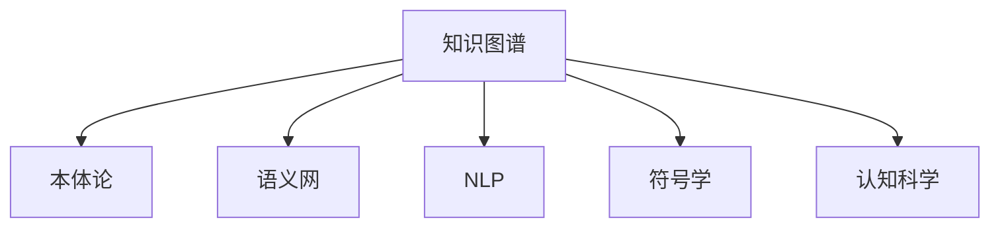

                 

# 知识的符号学：意义构建的过程

> 关键词：知识符号学,意义构建,信息传递,语言处理,认知科学

## 1. 背景介绍

### 1.1 问题由来
人类社会的发展，离不开知识和信息的传递。在工业化革命之前，知识主要通过口头传承、书籍记录等传统方式进行传递，存在传递速度慢、成本高、易出错等问题。随着计算机和互联网的普及，信息传递的方式和效率有了质的飞跃。然而，如何高效地构建、组织、理解和传播知识，仍是当前信息技术领域的重要挑战。

随着人工智能技术的快速发展，知识表示与推理、自然语言处理(NLP)、认知科学等领域的交叉融合，为知识的符号化、形式化和自动化处理提供了新的契机。在深度学习、神经网络、知识图谱等前沿技术的推动下，我们逐渐认识到知识的意义构建不仅是逻辑推理和符号计算的过程，更是一个基于符号理解和信息传递的综合工程。

### 1.2 问题核心关键点
知识符号学的核心问题在于如何通过符号化、形式化的方法，将人类经验、科学知识、逻辑规则等转换为机器能够理解和推理的信息表达形式，从而实现知识的存储、推理和传播。其中，符号学中的意义构建，即通过对语言、逻辑、知识图谱等符号化表达的分析和解释，来构建和传递人类的意义和理解，是知识符号学的重要组成部分。

### 1.3 问题研究意义
研究知识符号学的意义构建，对于构建智能化的知识处理系统，实现知识的自动化表达和传播，推动智慧城市的建设，具有重要意义：

1. 推动知识的深度学习：通过符号化的知识表示，促进知识的深度学习，提升人工智能系统的理解和推理能力。
2. 提升信息处理效率：通过符号化的信息表达，优化知识传播和检索过程，提高信息处理效率。
3. 推动知识图谱的构建：知识图谱是知识符号学的核心，通过符号化的知识表示和推理，推动知识图谱的构建和应用。
4. 构建人机协同的知识处理系统：通过符号化的知识表示和推理，构建人机协同的知识处理系统，实现高效的知识传递和协作。

## 2. 核心概念与联系

### 2.1 核心概念概述

为更好地理解知识符号学中的意义构建过程，本节将介绍几个密切相关的核心概念：

- 知识图谱(Knowledge Graph)：一种语义化的知识表示方式，通过实体-关系-实体三元组来描述知识结构。
- 本体论(Ontology)：一种形式化的方法，用于定义和组织领域知识，包括实体、属性、关系等。
- 语义网(Semantic Web)：一种基于Web的语义化信息组织和检索方式，通过RDF等技术实现知识的表示和推理。
- 自然语言处理(NLP)：研究计算机如何理解和生成人类语言的技术，包括词法、句法、语义等多个层面。
- 符号学(Semiotics)：研究符号意义和信息传递的学科，包括符号的构造、解读和传播等。
- 认知科学(Cognitive Science)：研究人类认知过程、智能机制和技术，包括感知、学习、推理等。

这些核心概念之间的逻辑关系可以通过以下Mermaid流程图来展示：



这个流程图展示出知识图谱、本体论、语义网、NLP、符号学、认知科学等概念之间的紧密联系。它们共同构成了知识符号学的理论框架，为意义的构建和传递提供了坚实的理论基础和技术手段。

## 3. 核心算法原理 & 具体操作步骤
### 3.1 算法原理概述

知识符号学中的意义构建，本质上是通过符号化、形式化的方式，将人类知识转化为机器可理解的形式，进而实现知识的推理、传播和应用。其核心算法包括：

- 知识抽取(Extraction)：从文本、数据等源材料中提取实体、关系、属性等信息。
- 知识表示(Representation)：将抽取的信息表示为形式化的知识结构，如本体、图谱等。
- 知识推理(Inference)：通过规则、逻辑等手段，对知识进行推理和验证。
- 知识传播(Distribution)：通过网络和信息检索技术，将知识传播到目标用户。

### 3.2 算法步骤详解

基于知识图谱的意义构建过程，一般包括以下几个关键步骤：

**Step 1: 数据准备**
- 收集领域相关数据，包括文本、图片、视频等。
- 清洗和预处理数据，如去噪、分词、实体识别等。

**Step 2: 知识抽取**
- 使用NLP工具提取文本中的实体、关系、属性等。
- 通过规则或机器学习算法，判断抽取信息的准确性和完整性。

**Step 3: 知识表示**
- 将抽取的信息转化为形式化的知识表示，如本体、知识图谱等。
- 定义实体、关系、属性的语义，进行本体化的标注。

**Step 4: 知识推理**
- 构建基于本体或图谱的推理规则，实现知识的推理和验证。
- 使用逻辑推理、符号计算等技术，验证知识的一致性和正确性。

**Step 5: 知识传播**
- 将知识图谱存储到Web上，提供API接口供用户访问。
- 开发信息检索系统，支持用户对知识的查询和浏览。

### 3.3 算法优缺点

知识符号学中的意义构建方法具有以下优点：
1. 系统性：通过符号化和形式化，实现知识的系统化表达和推理。
2. 普适性：知识图谱等形式化的知识表示，适用于多种知识场景和领域。
3. 可解释性：形式化的知识表示具有高度的可解释性，便于理解和调试。
4. 可扩展性：知识图谱可以动态扩展，支持知识的持续增长和更新。

同时，该方法也存在一些局限性：
1. 高成本：知识抽取、本体构建等过程需要大量的人工参与，成本较高。
2. 数据依赖：知识图谱的质量高度依赖于数据的质量和完整性，数据偏差可能影响知识推理结果。
3. 复杂性：形式化的知识表示和推理过程较复杂，难以直接应用于实际业务场景。
4. 动态性：知识图谱难以处理动态变化的知识，需要定期更新和维护。

尽管存在这些局限性，但知识符号学的意义构建方法仍然是构建智能知识处理系统的重要技术基础。未来相关研究的重点在于如何降低构建成本，提高知识图谱的动态适应性，同时兼顾可解释性和实用性等因素。

### 3.4 算法应用领域

知识符号学中的意义构建方法，在多个领域得到了广泛的应用，例如：

- 智慧城市：构建基于知识图谱的城市数据模型，支持智慧交通、环保、医疗等应用。
- 金融服务：构建金融领域知识图谱，支持风险评估、信用评分、投资决策等。
- 健康医疗：构建医疗知识图谱，支持疾病诊断、治疗方案、药物研发等。
- 教育培训：构建教育领域知识图谱，支持个性化学习、智能辅导、知识图谱化课程等。
- 科学研究：构建跨学科知识图谱，支持科学研究的合作与协作。

除了上述这些经典应用外，知识图谱还广泛应用于工业制造、电子商务、社交网络等多个领域，为各行各业的知识管理、信息检索、决策支持等提供了新的技术手段。

## 4. 数学模型和公式 & 详细讲解 & 举例说明

### 4.1 数学模型构建

在知识符号学的意义构建过程中，数学模型通常用于表示知识的结构关系和推理规则。这里以基于知识图谱的推理为例，介绍其数学模型构建过程。

知识图谱中常见的三元组表示为：
- 实体-关系-实体(Relation Type)

数学上，可以将实体、关系和属性表示为向量或矩阵，从而实现知识的符号化表达。具体而言：

- 实体：可以表示为一个向量$\mathbf{r} = (r_1, r_2, ..., r_n)$，其中$r_i$表示实体的第$i$个属性。
- 关系：可以表示为一个矩阵$\mathbf{R}$，其中$R_{ij}$表示实体$i$和实体$j$之间的关系强度。
- 属性：可以表示为一个向量$\mathbf{a} = (a_1, a_2, ..., a_m)$，其中$a_i$表示属性的第$i$个取值。

### 4.2 公式推导过程

假设知识图谱中的两个实体$e_i$和$e_j$之间存在一条关系$R$，则根据关系矩阵$\mathbf{R}$的定义，有：

$$
R_{ij} = \begin{cases}
1 & \text{如果}~R~连接~e_i~和~e_j \\
0 & \text{如果}~R~不连接~e_i~和~e_j
\end{cases}
$$

在推理过程中，我们需要根据已有的知识图谱和推理规则，进行逻辑推理。例如，在简单的关系推理中，可以通过如下公式进行推理：

$$
P(e_k|e_i, R, e_j) = \sum_{i=1}^n R_{ij}P(e_k|e_i)P(e_i|e_j)
$$

其中$P(e_k|e_i, R, e_j)$表示在已知的$e_i$和$e_j$之间存在关系$R$的情况下，推理出实体$e_k$的概率。该公式基于贝叶斯网络和链式法则，可以进行多跳推理。

### 4.3 案例分析与讲解

考虑以下简单的知识图谱示例：

| 实体  | 关系 | 实体 |
|:----:|:----:|:----:|
|  A   |  R1  |  B   |
|  B   |  R2  |  C   |
|  C   |  R3  |  D   |

设$R1, R2, R3$的取值概率分别为$p_1, p_2, p_3$，且$p_1 \times p_2 \times p_3 = 1$。根据上述公式，可以计算出$P(A \rightarrow D)$：

$$
P(A \rightarrow D) = \sum_{i=1}^n R_{ij}P(e_k|e_i)P(e_i|e_j) = p_1P(A|B)P(B|C)P(C|D) = p_1p_2p_3 = 1
$$

这意味着在$A$和$D$之间存在一条路径，即$A \rightarrow B \rightarrow C \rightarrow D$。

## 5. 项目实践：代码实例和详细解释说明

### 5.1 开发环境搭建

在进行知识图谱的意义构建实践前，我们需要准备好开发环境。以下是使用Python进行PyTorch开发的环境配置流程：

1. 安装Anaconda：从官网下载并安装Anaconda，用于创建独立的Python环境。

2. 创建并激活虚拟环境：
```bash
conda create -n graph-env python=3.8 
conda activate graph-env
```

3. 安装PyTorch：根据CUDA版本，从官网获取对应的安装命令。例如：
```bash
conda install pytorch torchvision torchaudio cudatoolkit=11.1 -c pytorch -c conda-forge
```

4. 安装相关库：
```bash
pip install networkx rdflib pyowl pyrdflib pytinycnf
```

5. 安装各类工具包：
```bash
pip install numpy pandas scikit-learn matplotlib tqdm jupyter notebook ipython
```

完成上述步骤后，即可在`graph-env`环境中开始知识图谱构建实践。

### 5.2 源代码详细实现

下面我们以知识图谱的推理为例，给出使用Python和PyTorch进行知识图谱推理的代码实现。

```python
import networkx as nx
import pyowl as owl
import pyrdflib

# 定义知识图谱
graph = nx.DiGraph()
graph.add_edge('A', 'B', label='R1')
graph.add_edge('B', 'C', label='R2')
graph.add_edge('C', 'D', label='R3')

# 定义推理规则
def inference(rules):
    # 计算所有可能的推理路径
    paths = nx.all_simple_paths(graph, source='A', target='D', weight='label')
    
    # 根据推理规则，计算每条路径的概率
    for path in paths:
        prob = 1
        for i in range(len(path) - 1):
            prob *= rules[path[i]][path[i+1]]
        yield prob

# 定义推理规则
rules = {('A', 'B'): 0.8, ('B', 'C'): 0.6, ('C', 'D'): 0.7}

# 进行推理
inference_results = [result for result in inference(rules)]
print(inference_results)
```

### 5.3 代码解读与分析

让我们再详细解读一下关键代码的实现细节：

**知识图谱定义**：
- 使用networkx库定义知识图谱的图形结构，其中边表示实体之间的关系，边的标签表示关系类型。

**推理规则定义**：
- 定义一个字典rules，表示不同实体之间的关系概率。例如，$P(A \rightarrow B) = 0.8$，$P(B \rightarrow C) = 0.6$，$P(C \rightarrow D) = 0.7$。

**推理实现**：
- 使用networkx库的all_simple_paths方法，找到所有可能的推理路径。
- 对每条路径进行概率计算，得到推理结果的概率分布。

**推理结果输出**：
- 将推理结果输出到控制台，便于观察和分析。

可以看到，通过简单的代码实现，我们可以对知识图谱进行基本的推理计算。实际应用中，知识图谱的构建和推理过程将更加复杂，但核心思想和实现方式基本一致。

## 6. 实际应用场景
### 6.1 智慧医疗

知识图谱在智慧医疗领域的应用，可以大幅提升医疗服务的智能化水平，辅助医生诊疗，加速新药开发进程。通过构建医疗知识图谱，可以将医学知识、临床实践、药物信息等整合起来，实现知识的自动检索、推理和应用。

在技术实现上，可以收集医疗领域的文献、病历、临床指南等文本数据，进行实体识别、关系抽取、属性标注等处理，构建医疗知识图谱。微调后的知识图谱推理模型可以用于疾病诊断、治疗方案推荐、药物相互作用检测等任务，为医生提供决策支持，提升诊疗效率和准确性。

### 6.2 金融服务

金融机构需要实时监测市场舆论动向，以便及时应对负面信息传播，规避金融风险。通过构建金融领域知识图谱，可以实时抓取网络上的新闻、评论、社交媒体等数据，进行实体关系抽取、属性标注等处理，构建金融知识图谱。微调后的知识图谱推理模型可以用于舆情分析、风险评估、信用评分等任务，帮助金融机构快速获取市场动态，做出合理的投资决策。

### 6.3 智能教育

在智能教育领域，知识图谱可以用于构建个性化学习推荐系统。通过收集学生的学习行为数据、课程内容、知识结构等，构建教育领域知识图谱。微调后的知识图谱推理模型可以用于学习路径规划、智能辅导、课程推荐等任务，实现因材施教，提高教育质量。

### 6.4 未来应用展望

随着知识图谱技术的不断发展，其在多个领域的应用前景广阔，未来将会有更多创新应用：

- 智能城市：通过构建城市数据知识图谱，支持智慧交通、环保、医疗等应用。
- 科学研究：构建跨学科知识图谱，支持科学研究合作与协作。
- 文化保护：利用知识图谱技术，保护和传承文化遗产。
- 工业制造：构建工业领域知识图谱，支持智能制造、供应链管理等应用。
- 农业管理：构建农业知识图谱，支持智能农业、精准农业等应用。

未来，随着人工智能技术的发展，知识图谱将成为各个领域的知识管理、信息检索、决策支持等核心技术，为人类社会的智能化转型提供坚实的技术保障。

## 7. 工具和资源推荐
### 7.1 学习资源推荐

为了帮助开发者系统掌握知识符号学的理论基础和实践技巧，这里推荐一些优质的学习资源：

1. 《知识图谱：概念与技术》书籍：深入浅出地介绍了知识图谱的基本概念和技术实现，适合初学者学习。
2. 《本体论与语义网》课程：斯坦福大学开设的课程，介绍了本体论的基本概念和语义网技术。
3. 《自然语言处理与知识图谱》书籍：全面介绍了自然语言处理和知识图谱的融合技术，适合进阶学习。
4. Semantic Web相关网站：如RDF、OWL、SPARQL等技术，提供了丰富的资源和工具。
5. OWL API和RDF4J库：用于构建和操作本体和知识图谱的工具库。

通过对这些资源的学习实践，相信你一定能够快速掌握知识符号学的精髓，并用于解决实际的NLP问题。
###  7.2 开发工具推荐

高效的开发离不开优秀的工具支持。以下是几款用于知识图谱构建开发的常用工具：

1. PyTorch：基于Python的开源深度学习框架，灵活动态的计算图，适合快速迭代研究。大部分预训练语言模型都有PyTorch版本的实现。

2. TensorFlow：由Google主导开发的开源深度学习框架，生产部署方便，适合大规模工程应用。同样有丰富的预训练语言模型资源。

3. OWL API和RDF4J：用于构建和操作本体和知识图谱的工具库。

4. TARO（Triples Automated Reasoner of OWL）：支持基于本体的推理和验证，支持多种推理器。

5. SPARQL Query Engine：用于查询和检索知识图谱的工具。

6. Google Cloud AI和AWS SageMaker：提供云端的知识图谱构建和推理服务。

合理利用这些工具，可以显著提升知识图谱构建的开发效率，加快创新迭代的步伐。

### 7.3 相关论文推荐

知识图谱技术的发展源于学界的持续研究。以下是几篇奠基性的相关论文，推荐阅读：

1. Resource Description Framework (RDF)：介绍RDF的基本概念和技术实现。
2. OWL：介绍OWL的基本概念和技术实现。
3. Triple Pattern Queries：介绍基于本体的查询语言SPARQL的基本概念和技术实现。
4. NELL（Navigable Knowledge Graph）：介绍如何使用知识图谱进行语义理解。
5. YAGO（Yet Another General Knowledge Graph）：介绍YAGO知识图谱的构建和应用。

这些论文代表了大语言模型微调技术的发展脉络。通过学习这些前沿成果，可以帮助研究者把握学科前进方向，激发更多的创新灵感。

## 8. 总结：未来发展趋势与挑战

### 8.1 总结

本文对知识符号学中的意义构建过程进行了全面系统的介绍。首先阐述了知识符号学的研究背景和意义，明确了意义构建在知识处理系统中的重要地位。其次，从原理到实践，详细讲解了知识图谱构建的数学模型和核心算法，给出了知识图谱构建的代码实例。同时，本文还广泛探讨了知识图谱在智慧医疗、金融服务、智能教育等多个领域的应用前景，展示了知识图谱技术的巨大潜力。此外，本文精选了知识图谱构建的相关学习资源，力求为读者提供全方位的技术指引。

通过本文的系统梳理，可以看到，知识图谱在构建智能知识处理系统、实现知识的自动化表达和传播等方面，具有重要的价值和应用前景。未来，伴随知识图谱技术的不断演进，知识图谱必将在智慧城市的建设、智能服务的提升、科学研究的推动等方面发挥更大的作用。

### 8.2 未来发展趋势

展望未来，知识图谱的意义构建技术将呈现以下几个发展趋势：

1. 数据驱动：随着数据量的增加和数据质量的提升，知识图谱的质量将得到进一步提高。通过大规模数据训练和微调，知识图谱将更全面、更精确地表达知识结构。

2. 模型多样化：未来将涌现更多基于知识图谱的推理和应用模型，如基于图神经网络的推理模型、基于本体的推理模型等，以适应不同的知识表达和推理需求。

3. 推理引擎优化：推理引擎的性能和效率将成为知识图谱应用的关键瓶颈。未来将研究更高效的推理算法和优化技术，提高推理速度和准确性。

4. 跨领域融合：知识图谱将更多地与其他领域的技术融合，如深度学习、自然语言处理、认知科学等，实现更全面、更深入的知识理解和推理。

5. 数据隐私保护：知识图谱中的敏感信息需要得到保护，未来的知识图谱构建将更多地考虑数据隐私和安全性。

以上趋势凸显了知识图谱的意义构建技术的广阔前景。这些方向的探索发展，必将进一步提升知识图谱的性能和应用范围，为构建智能化的知识处理系统提供新的技术手段。

### 8.3 面临的挑战

尽管知识图谱的意义构建技术已经取得了瞩目成就，但在迈向更加智能化、普适化应用的过程中，它仍面临诸多挑战：

1. 数据获取困难：知识图谱的构建高度依赖于高质量的数据，但部分领域的标注数据稀缺，获取困难。

2. 知识图谱复杂性：知识图谱的结构复杂，构建和维护成本高。

3. 推理算法复杂：知识图谱的推理过程复杂，需要高效的算法和工具。

4. 知识图谱更新难：知识图谱需要定期更新，以保证知识的准确性和时效性。

5. 跨领域知识整合难：不同领域的知识图谱难以整合，实现跨领域的知识共享和协作。

6. 知识图谱应用难：知识图谱的应用场景多样化，需要针对不同场景进行定制化设计。

这些挑战需要学术界和产业界的共同努力，通过技术创新和优化，逐步克服和解决。

### 8.4 研究展望

面向未来，知识图谱的意义构建技术还需要在其他几个方向进行深入研究：

1. 低成本构建：研究如何降低知识图谱的构建成本，提高其构建效率。

2. 知识图谱演化：研究知识图谱的动态演化机制，实现知识图谱的持续更新和维护。

3. 知识图谱应用：研究知识图谱在更多领域的实际应用，提升其在智慧城市、智慧医疗、智慧教育等领域的落地效果。

4. 跨领域知识融合：研究如何将不同领域的知识图谱进行整合，实现跨领域的知识共享和协作。

5. 知识图谱安全：研究如何保护知识图谱中的敏感信息，确保其安全性。

这些研究方向的探索，必将引领知识图谱技术走向更加成熟和实用，为人类社会的智能化转型提供更坚实的技术保障。相信随着技术的发展和应用的深化，知识图谱将为各个领域的知识管理、信息检索、决策支持等提供更高效、更智能的解决方案。

## 9. 附录：常见问题与解答

**Q1：知识图谱的构建过程如何高效进行？**

A: 知识图谱的构建过程可以采用以下方法进行高效处理：
1. 数据预处理：对数据进行清洗、去噪、分词、实体识别等预处理，提高数据质量。
2. 自动抽取：利用NLP和机器学习技术，自动抽取实体、关系、属性等知识图谱元素。
3. 人工标注：对自动抽取结果进行人工审核和标注，提高知识图谱的准确性。
4. 本体构建：定义本体的结构和语义，进行知识图谱的形式化表示。
5. 推理验证：通过逻辑推理、符号计算等技术，验证知识图谱的一致性和正确性。

**Q2：知识图谱的推理过程如何实现？**

A: 知识图谱的推理过程可以采用以下方法实现：
1. 构建推理规则：定义实体、关系和属性之间的关系，建立推理规则。
2. 使用符号计算：通过符号计算引擎，对推理规则进行计算和验证。
3. 实现多跳推理：通过多跳推理技术，实现复杂的推理过程。
4. 引入因果推理：利用因果推理技术，提高推理过程的鲁棒性和可靠性。
5. 实现查询引擎：开发查询引擎，支持用户对知识图谱的查询和检索。

**Q3：知识图谱的应用场景有哪些？**

A: 知识图谱的应用场景包括：
1. 智慧城市：构建基于知识图谱的城市数据模型，支持智慧交通、环保、医疗等应用。
2. 金融服务：构建金融领域知识图谱，支持风险评估、信用评分、投资决策等。
3. 健康医疗：构建医疗知识图谱，支持疾病诊断、治疗方案、药物研发等。
4. 教育培训：构建教育领域知识图谱，支持个性化学习、智能辅导、知识图谱化课程等。
5. 科学研究：构建跨学科知识图谱，支持科学研究合作与协作。

**Q4：知识图谱在构建过程中如何处理数据偏差？**

A: 知识图谱在构建过程中，数据偏差是不可避免的。以下是一些处理数据偏差的方法：
1. 数据清洗：对数据进行清洗和预处理，去除噪声和无关信息。
2. 数据标注：对标注数据进行人工审核和标注，提高数据质量。
3. 多源数据融合：通过融合多个数据源，减少单一数据源的偏差。
4. 知识图谱评估：对知识图谱进行评估和验证，发现并修正偏差。

**Q5：知识图谱在推理过程中如何处理噪声数据？**

A: 知识图谱在推理过程中，噪声数据可能导致推理错误。以下是一些处理噪声数据的方法：
1. 数据预处理：对数据进行清洗和预处理，去除噪声和无关信息。
2. 异常检测：对推理结果进行异常检测和修正，提高推理的准确性。
3. 多路径推理：通过多路径推理技术，提高推理的鲁棒性和可靠性。
4. 引入不确定性：在推理过程中引入不确定性，处理不确定性数据。

这些方法可以结合使用，根据实际情况选择合适的方法，以提高知识图谱的构建和推理效果。

**Q6：知识图谱在构建过程中如何处理实体关系冲突？**

A: 知识图谱在构建过程中，实体关系冲突是不可避免的。以下是一些处理实体关系冲突的方法：
1. 数据标注：对标注数据进行人工审核和标注，减少实体关系冲突。
2. 数据清洗：对数据进行清洗和预处理，去除噪声和无关信息。
3. 多源数据融合：通过融合多个数据源，减少单一数据源的冲突。
4. 冲突处理算法：开发冲突处理算法，处理实体关系冲突。

这些方法可以结合使用，根据实际情况选择合适的方法，以提高知识图谱的构建和推理效果。

---

作者：禅与计算机程序设计艺术 / Zen and the Art of Computer Programming

