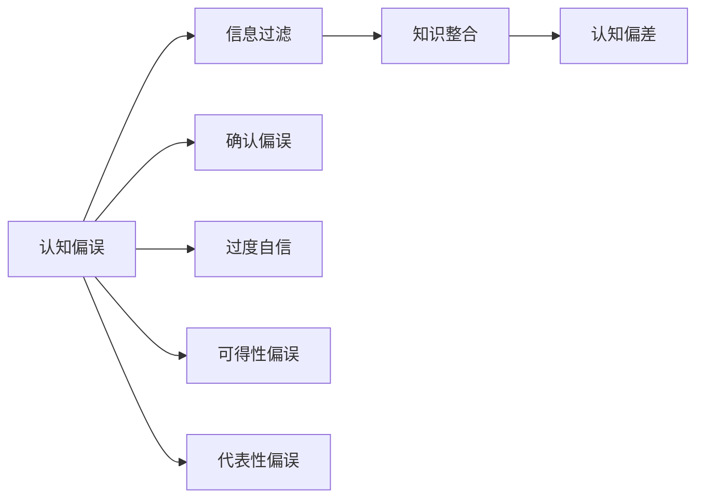

                 

## 1. 背景介绍

在信息爆炸的时代，知识的获取和传播变得前所未有的简单。人们可以在瞬间获得海量的信息，但同时，这些信息也容易被错误的认知和思维陷阱所扭曲。作为一名AI专家，我将从三个主要方面探讨知识的误区：认知偏误、信息过滤、知识整合。

## 2. 核心概念与联系

### 2.1 核心概念概述

1. **认知偏误（Cognitive Bias）**：人类在获取、处理、分析信息时，由于固有的心理和认知模式，容易产生系统性偏差。常见的认知偏误包括确认偏误、过度自信、可得性偏误、代表性偏误等。

2. **信息过滤（Information Filtering）**：在海量信息中，人们往往通过各种机制，有选择地接收、处理、记忆信息，以符合自身的认知图式和价值观。信息过滤可能导致信息茧房、认知泡泡等问题。

3. **知识整合（Knowledge Integration）**：在复杂、多样化的信息源中，将不同知识进行有效整合、理解和应用，是认知过程的重要一环。知识的整合需要依赖于逻辑推理、类比推理、归纳推理等多种认知工具。

### 2.2 核心概念原理和架构的 Mermaid 流程图



## 3. 核心算法原理 & 具体操作步骤

### 3.1 算法原理概述

认知偏误、信息过滤和知识整合，本质上都是人类认知过程的体现。在信息时代，这些认知过程可以通过算法进行建模和分析，从而揭示其中的误区和陷阱。

### 3.2 算法步骤详解

1. **数据收集与预处理**：收集各类认知偏误的数据，包括确认偏误、过度自信等。对数据进行预处理，去除噪音，标准化处理。

2. **特征提取与建模**：使用自然语言处理、图像识别等技术，从文本、图片等数据中提取特征，建立认知偏误的数学模型。

3. **数据分析与验证**：利用统计学方法，分析模型结果，验证其对认知偏误的解释和预测能力。

4. **算法优化与部署**：根据模型性能，优化算法参数。将模型部署到实际应用中，实时监控和更新模型。

### 3.3 算法优缺点

**优点**：
- 系统化分析认知偏误、信息过滤和知识整合，揭示深层次的认知误区。
- 实时监控和更新模型，提高认知偏误检测和纠正的效率。

**缺点**：
- 模型需要大量的标注数据和计算资源进行训练，初期成本较高。
- 模型的解释性有限，难以全面理解复杂的认知过程。
- 模型的预测准确性受限于数据的全面性和质量，存在误判风险。

### 3.4 算法应用领域

认知偏误分析在心理学、市场研究、法律等领域具有广泛应用。信息过滤和知识整合在智能推荐系统、搜索引擎、个性化新闻推荐等场景中也有重要应用。

## 4. 数学模型和公式 & 详细讲解 & 举例说明

### 4.1 数学模型构建

假设有一个含有 $n$ 个认知偏误的数据集，每个数据点包含 $m$ 个特征 $x_1, x_2, ..., x_m$，和 $p$ 个可能的心理状态 $y_1, y_2, ..., y_p$。

目标模型为：

$$
\hat{y} = \arg\max_y \sum_{i=1}^n P(y_i|x_1, x_2, ..., x_m)
$$

其中 $P(y_i|x_1, x_2, ..., x_m)$ 是条件概率模型，通常采用高斯混合模型或深度神经网络进行建模。

### 4.2 公式推导过程

以确认偏误为例，确认偏误的定义为：个体倾向于寻找证据支持已有信念，而忽视相反的证据。

假设信念 $b$ 和证据 $e$，确认偏误的概率模型为：

$$
P(e|b) = P(e) + \beta P(b|e)
$$

其中 $\beta$ 是确认偏误的强度系数。当 $\beta$ 较大时，确认偏误严重。

### 4.3 案例分析与讲解

在市场研究中，确认偏误可能导致广告投放策略失误。例如，一家公司基于历史数据发现某种广告创意效果较好，但在新市场投放时，却忽视了新市场消费者偏好不同的可能性，导致广告效果不佳。

## 5. 项目实践：代码实例和详细解释说明

### 5.1 开发环境搭建

需要以下环境：
- Python 3.8+
- TensorFlow 2.7+
- Keras 2.5+
- pandas
- numpy
- scikit-learn

```bash
conda create -n cognitive-bias-env python=3.8
conda activate cognitive-bias-env
pip install tensorflow==2.7.0
pip install keras==2.5.0
pip install pandas numpy scikit-learn
```

### 5.2 源代码详细实现

```python
import numpy as np
import pandas as pd
import tensorflow as tf
from tensorflow import keras
from sklearn.model_selection import train_test_split

# 加载数据
data = pd.read_csv('cognitive_biases.csv')

# 数据预处理
features = data[['feature1', 'feature2', ...]]
labels = data['label']

# 数据分割
train_features, test_features, train_labels, test_labels = train_test_split(features, labels, test_size=0.2)

# 构建模型
model = keras.Sequential([
    keras.layers.Dense(64, activation='relu', input_shape=(features.shape[1],)),
    keras.layers.Dense(64, activation='relu'),
    keras.layers.Dense(p, activation='softmax')
])

# 编译模型
model.compile(optimizer='adam', loss='sparse_categorical_crossentropy', metrics=['accuracy'])

# 训练模型
model.fit(train_features, train_labels, epochs=10, validation_data=(test_features, test_labels))
```

### 5.3 代码解读与分析

以上代码展示了如何使用Keras搭建一个简单的认知偏误分类模型。

- 数据加载和预处理：使用pandas加载CSV文件，并进行特征提取和标签提取。
- 模型构建：采用全连接神经网络，包含两个隐藏层和一个输出层。
- 模型编译：选择Adam优化器和交叉熵损失函数。
- 模型训练：使用训练集进行模型训练，并在测试集上进行验证。

### 5.4 运行结果展示

训练完成后，可以使用以下代码对模型进行评估：

```python
test_loss, test_acc = model.evaluate(test_features, test_labels)
print(f'Test accuracy: {test_acc:.2f}')
```

## 6. 实际应用场景

### 6.1 心理诊断

认知偏误分析可以应用于心理诊断和治疗。例如，通过分析患者的认知偏误，识别出确认偏误、过度自信等问题，设计针对性的心理治疗方案。

### 6.2 广告投放优化

在广告投放中，通过分析广告受众的认知偏误，优化广告创意和投放策略，提高广告效果和ROI。

### 6.3 法律决策

在法律审判中，分析证人和陪审团的认知偏误，识别出可得性偏误、代表性偏误等，提供科学的决策建议。

### 6.4 未来应用展望

随着AI技术的发展，认知偏误分析将更广泛地应用于人类行为预测、市场研究、政策制定等领域，揭示和矫正认知误区，提升决策质量。

## 7. 工具和资源推荐

### 7.1 学习资源推荐

- 《认知心理学》书籍：深入介绍认知偏误的基本理论和实验方法。
- 《信息过滤》课程：讲解信息过滤和信息茧房的概念及应对策略。
- Kaggle：提供各类认知偏误数据集和算法竞赛，实战练习。

### 7.2 开发工具推荐

- Jupyter Notebook：数据处理和模型构建的好工具。
- TensorFlow：强大的深度学习框架，支持各类认知偏误模型。
- Scikit-learn：提供简单易用的机器学习工具，快速实现算法。

### 7.3 相关论文推荐

- 《认知偏误理论》：详细介绍各类认知偏误的概念和影响。
- 《信息过滤与认知泡泡》：分析信息过滤对认知过程的影响。
- 《知识整合与逻辑推理》：探讨不同认知工具在知识整合中的作用。

## 8. 总结：未来发展趋势与挑战

### 8.1 研究成果总结

认知偏误分析、信息过滤和知识整合，是大数据和AI技术的重要应用方向。通过系统化的方法，揭示认知误区，优化信息处理和知识应用，具有广阔的应用前景。

### 8.2 未来发展趋势

1. **数据驱动**：利用大数据技术，挖掘更多认知偏误数据，提升模型的预测准确性。
2. **跨学科融合**：将心理学、神经科学、社会学等多学科知识融入认知偏误分析，提高模型的解释力和实用性。
3. **个性化应用**：针对不同场景和用户，定制化开发认知偏误检测和纠正工具，实现智能辅助决策。

### 8.3 面临的挑战

1. **数据稀缺**：认知偏误数据稀缺且难以获取，需要更多有效的数据收集方法。
2. **算法复杂性**：认知偏误和信息过滤问题复杂多样，需要开发更高效的算法模型。
3. **解释性不足**：模型难以全面解释复杂的认知过程，需要更多解释性强的算法和模型。
4. **伦理隐私**：认知偏误分析涉及大量个人信息，需要严格保护用户隐私和数据安全。

### 8.4 研究展望

未来，认知偏误分析将更多地融入AI系统，实时监控和纠正认知误区，提高决策科学性和公正性。跨学科的合作和融合，将推动认知偏误研究进入新的阶段。

## 9. 附录：常见问题与解答

**Q1：什么是认知偏误？**

A：认知偏误（Cognitive Bias）指人类在获取、处理、分析信息时，由于固有的心理和认知模式，容易产生系统性偏差。常见的认知偏误包括确认偏误、过度自信、可得性偏误、代表性偏误等。

**Q2：如何避免信息过滤？**

A：避免信息过滤的策略包括：
1. 多样化信息来源：从多个角度获取信息，避免信息茧房。
2. 主动搜索信息：定期搜索不同领域的信息，保持知识更新。
3. 批判性思维：对信息进行多角度分析和验证，避免片面判断。

**Q3：什么是知识整合？**

A：知识整合（Knowledge Integration）是指在复杂、多样化的信息源中，将不同知识进行有效整合、理解和应用，是认知过程的重要一环。知识的整合需要依赖于逻辑推理、类比推理、归纳推理等多种认知工具。

**Q4：如何提高知识整合的效率？**

A：提高知识整合效率的策略包括：
1. 建立知识图谱：将不同知识进行图形化表示，便于理解关联和融合。
2. 使用自动化工具：利用知识图谱和推荐系统，自动化推荐相关知识。
3. 实践和反馈：通过实际应用和反馈，不断调整和优化知识整合方法。

**Q5：认知偏误分析的应用场景有哪些？**

A：认知偏误分析在心理学、市场研究、法律等领域具有广泛应用。例如，通过分析广告受众的认知偏误，优化广告创意和投放策略，提高广告效果和ROI；在法律审判中，分析证人和陪审团的认知偏误，提供科学的决策建议。

