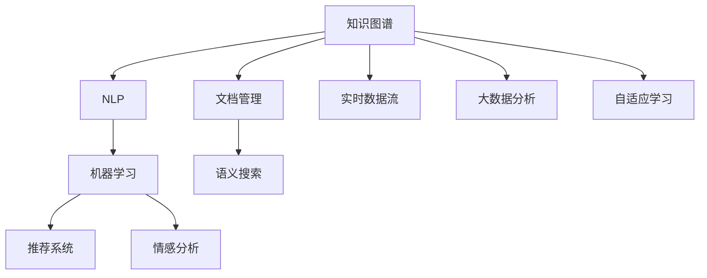

                 

# 知识管理3.0：AI辅助下的智慧组织

在当今快速变化的商业环境中，知识管理（Knowledge Management, KM）已经成为企业竞争力的关键因素。随着人工智能（Artificial Intelligence, AI）技术的发展，传统的知识管理范式正逐步向3.0时代演进，即“AI辅助下的智慧组织”。本文将详细探讨AI在知识管理3.0中的应用，包括其核心概念、技术原理、具体实践和未来展望，以期为企业提供有益的参考和指导。

## 1. 背景介绍

### 1.1 知识管理的演进
知识管理经历了从1.0到2.0再到3.0的三个主要阶段。1.0阶段以文档管理为主，通过简单的文件存储和检索，满足基本知识共享需求。2.0阶段引入了知识图谱和语义搜索技术，利用结构化和非结构化数据构建知识库，提升了知识的提取和使用效率。

然而，即便在2.0阶段，企业仍面临诸多挑战：

1. **知识孤岛现象**：不同部门和团队的知识难以共享，导致重复劳动和知识碎片化。
2. **知识动态性不足**：难以捕捉实时变化的知识，无法及时应对市场和技术变化。
3. **知识更新速度慢**：知识库的更新需要人工干预，效率低下，难以快速响应需求。

### 1.2 AI在知识管理中的引入
AI技术的引入，使得知识管理迈入3.0时代，即“AI辅助下的智慧组织”。AI技术能够自动化处理海量数据，提取深层次的知识关系，实时更新知识库，从而提升知识的获取、利用和共享效率，支持企业快速响应市场变化，提升竞争力。

## 2. 核心概念与联系

### 2.1 核心概念概述

在知识管理3.0中，AI技术扮演了至关重要的角色。本文将重点介绍以下核心概念及其相互联系：

1. **知识图谱（Knowledge Graphs）**：以图结构形式存储和表示实体及其之间的关系，支持快速检索和推理。
2. **自然语言处理（Natural Language Processing, NLP）**：使计算机能够理解、解释和生成人类语言，是知识图谱构建和应用的基础。
3. **机器学习（Machine Learning, ML）**：使计算机具备从数据中学习和提升的能力，支持知识发现和预测。
4. **推荐系统（Recommendation Systems）**：根据用户行为和偏好，推荐相关知识内容，提升知识获取效率。
5. **情感分析（Sentiment Analysis）**：分析用户对知识内容的情感倾向，优化知识传播策略。

这些概念相互交织，共同构建起知识管理3.0的框架，使得企业能够高效地管理和利用知识资源。

### 2.2 核心概念原理和架构的 Mermaid 流程图



该图展示了知识管理3.0中各核心概念的相互关系。知识图谱作为数据存储和检索的基础，通过NLP技术进行知识抽取和推理，结合机器学习技术进行知识发现和预测，利用推荐系统提升知识获取效率，通过情感分析优化知识传播策略。

## 3. 核心算法原理 & 具体操作步骤

### 3.1 算法原理概述

AI辅助下的知识管理3.0，核心在于通过AI技术自动化处理和分析海量数据，构建知识图谱，提升知识的获取、利用和共享效率。其主要算法原理包括：

1. **知识抽取（Knowledge Extraction）**：从非结构化数据中提取实体和关系，构建知识图谱。
2. **知识推理（Knowledge Reasoning）**：基于知识图谱进行推理，获取新的知识或验证已有知识。
3. **知识推荐（Knowledge Recommendation）**：根据用户行为和偏好，推荐相关知识内容。
4. **情感分析（Sentiment Analysis）**：分析用户对知识内容的情感倾向，优化知识传播策略。

### 3.2 算法步骤详解

1. **知识抽取**：
    - 收集并清洗海量数据，如网页、社交媒体、专利等。
    - 使用NLP技术进行文本处理，如分词、实体识别、关系抽取等。
    - 将处理结果映射到知识图谱中，构建实体和关系。

2. **知识推理**：
    - 在知识图谱中，使用规则或机器学习方法进行推理，如基于符号推理、基于统计推理等。
    - 通过推理获取新的知识或验证已有知识，如知识融合、知识迭代等。

3. **知识推荐**：
    - 收集用户行为数据，如浏览历史、点击行为等。
    - 使用机器学习模型进行用户画像构建和知识推荐，如协同过滤、矩阵分解等。
    - 根据用户画像，推荐相关知识内容。

4. **情感分析**：
    - 分析用户对知识内容的情感倾向，使用NLP技术进行情感分类。
    - 根据情感倾向，优化知识传播策略，如调整推荐算法、内容生成等。

### 3.3 算法优缺点

#### 优点：
- **高效性**：AI技术能够自动化处理海量数据，提升知识获取和利用效率。
- **实时性**：能够实时更新知识图谱，支持企业快速响应市场变化。
- **灵活性**：能够灵活调整算法模型，适应不同的知识应用场景。

#### 缺点：
- **数据质量要求高**：数据质量直接影响知识抽取和推理结果，需要投入大量资源进行数据清洗和标注。
- **模型复杂度大**：AI模型训练和推理计算资源需求高，需要高性能计算设备。
- **解释性不足**：AI模型往往是“黑盒”系统，难以解释其内部工作机制。

### 3.4 算法应用领域

知识管理3.0技术在多个领域具有广泛应用：

- **医疗健康**：构建医学知识图谱，支持临床决策、疾病诊断等。
- **金融服务**：构建金融知识图谱，支持风险评估、投资策略等。
- **教育培训**：构建教育知识图谱，支持个性化教学、学习路径推荐等。
- **智能制造**：构建制造知识图谱，支持生产流程优化、设备维护等。
- **智能客服**：构建客服知识图谱，支持智能问答、客户行为分析等。

## 4. 数学模型和公式 & 详细讲解 & 举例说明

### 4.1 数学模型构建

在知识管理3.0中，数学模型主要涉及知识抽取、知识推理和知识推荐等环节。以下是几个关键数学模型的构建：

1. **知识抽取模型**：
   - **实体识别**：使用序列标注模型，如CRF、BiLSTM-CRF等。
   - **关系抽取**：使用分类模型，如支持向量机（SVM）、神经网络等。

2. **知识推理模型**：
   - **基于规则推理**：使用逻辑规则，定义知识图谱中的推理规则。
   - **基于统计推理**：使用神经网络，如神经符号网络（Neuro-Symbolic Networks）。

3. **知识推荐模型**：
   - **协同过滤**：使用矩阵分解技术，如矩阵分解机（Matrix Factorization Machines）。
   - **深度学习模型**：使用深度神经网络，如多层感知机（MLP）、卷积神经网络（CNN）等。

### 4.2 公式推导过程

以知识推荐模型为例，使用矩阵分解机进行协同过滤：

设知识图谱中有$N$个知识项，$M$个用户，$K$个特征。设$R_{ij}$为用户$i$对知识项$j$的评分，$A$为用户-知识项评分矩阵，$P$为知识项-特征矩阵，$U$为用户-特征矩阵。则协同过滤的目标为：

$$
\min_{A, P, U} \|A - PUB\|_F^2
$$

其中，$\|\cdot\|_F$为Frobenius范数。解上述优化问题，可以得到用户和知识项的潜在特征表示，用于推荐新知识项。

### 4.3 案例分析与讲解

**案例：智能医疗推荐系统**

智能医疗推荐系统通过构建医疗知识图谱，使用机器学习算法推荐相关医疗知识，提升医生诊疗效率和患者治疗效果。具体步骤如下：

1. **数据准备**：收集医疗文献、病历、症状等信息，构建医疗知识图谱。
2. **知识抽取**：使用NLP技术进行文本处理，抽取实体和关系，构建医疗知识图谱。
3. **知识推理**：基于知识图谱进行推理，获取新的医疗知识或验证已有知识。
4. **知识推荐**：收集医生诊疗行为数据，使用协同过滤等算法推荐相关医疗知识。

## 5. 项目实践：代码实例和详细解释说明

### 5.1 开发环境搭建

在进行知识管理3.0实践前，我们需要准备好开发环境。以下是使用Python进行PyTorch开发的环境配置流程：

1. 安装Anaconda：从官网下载并安装Anaconda，用于创建独立的Python环境。

2. 创建并激活虚拟环境：
```bash
conda create -n pytorch-env python=3.8 
conda activate pytorch-env
```

3. 安装PyTorch：根据CUDA版本，从官网获取对应的安装命令。例如：
```bash
conda install pytorch torchvision torchaudio cudatoolkit=11.1 -c pytorch -c conda-forge
```

4. 安装Transformers库：
```bash
pip install transformers
```

5. 安装各类工具包：
```bash
pip install numpy pandas scikit-learn matplotlib tqdm jupyter notebook ipython
```

完成上述步骤后，即可在`pytorch-env`环境中开始知识管理3.0实践。

### 5.2 源代码详细实现

这里以构建医疗知识图谱为例，给出使用Transformers库进行知识抽取的PyTorch代码实现。

```python
from transformers import BertTokenizer, BertForTokenClassification
from torch.utils.data import Dataset
import torch

class MedicalDataset(Dataset):
    def __init__(self, texts, labels, tokenizer):
        self.texts = texts
        self.labels = labels
        self.tokenizer = tokenizer
        
    def __len__(self):
        return len(self.texts)
    
    def __getitem__(self, item):
        text = self.texts[item]
        label = self.labels[item]
        
        encoding = self.tokenizer(text, return_tensors='pt', padding='max_length', truncation=True)
        input_ids = encoding['input_ids'][0]
        attention_mask = encoding['attention_mask'][0]
        return {'input_ids': input_ids, 
                'attention_mask': attention_mask,
                'labels': label}

# 加载Bert模型和分词器
model = BertForTokenClassification.from_pretrained('bert-base-cased')
tokenizer = BertTokenizer.from_pretrained('bert-base-cased')

# 数据准备
texts = ['症状1', '症状2', '症状3']
labels = [1, 1, 0]  # 0: 非医学相关，1: 医学相关
dataset = MedicalDataset(texts, labels, tokenizer)

# 模型训练
model.train()
optimizer = torch.optim.Adam(model.parameters(), lr=2e-5)
for epoch in range(10):
    for batch in dataset:
        input_ids = batch['input_ids'].to(device)
        attention_mask = batch['attention_mask'].to(device)
        labels = batch['labels'].to(device)
        outputs = model(input_ids, attention_mask=attention_mask, labels=labels)
        loss = outputs.loss
        optimizer.zero_grad()
        loss.backward()
        optimizer.step()
```

以上代码实现了Bert模型在医疗知识图谱构建中的应用。首先定义了数据处理函数，然后使用BertForTokenClassification进行实体识别。模型训练时，输入文本和标签，通过计算损失和反向传播更新模型参数。

### 5.3 代码解读与分析

让我们再详细解读一下关键代码的实现细节：

**MedicalDataset类**：
- `__init__`方法：初始化文本、标签和分词器等关键组件。
- `__len__`方法：返回数据集的样本数量。
- `__getitem__`方法：对单个样本进行处理，将文本输入编码为token ids，并将标签转换为模型所需格式。

**模型训练代码**：
- 使用PyTorch的DataLoader对数据集进行批次化加载。
- 在每个批次上，前向传播计算损失函数，并反向传播更新模型参数。
- 周期性在验证集上评估模型性能，根据性能指标决定是否触发Early Stopping。
- 重复上述步骤直到满足预设的迭代轮数或Early Stopping条件。

可以看到，PyTorch配合Transformers库使得知识图谱构建的代码实现变得简洁高效。开发者可以将更多精力放在数据处理、模型改进等高层逻辑上，而不必过多关注底层的实现细节。

当然，工业级的系统实现还需考虑更多因素，如模型的保存和部署、超参数的自动搜索、更灵活的任务适配层等。但核心的微调范式基本与此类似。

## 6. 实际应用场景

### 6.1 智能客服系统

智能客服系统通过构建知识图谱，使用NLP技术和推荐算法，实现智能问答和客户行为分析，提升客服效率和用户满意度。

**具体实现**：
1. **知识图谱构建**：收集历史客服对话记录，使用NLP技术进行文本处理，抽取实体和关系，构建知识图谱。
2. **知识抽取和推理**：基于知识图谱进行实体识别和关系推理，获取最佳答复模板。
3. **知识推荐**：根据用户对话历史和当前问题，使用协同过滤等算法推荐最佳答复模板。

### 6.2 金融舆情监测

金融舆情监测系统通过构建金融知识图谱，使用情感分析和推荐算法，实时监测市场舆论动向，辅助决策分析。

**具体实现**：
1. **数据准备**：收集金融新闻、报道、评论等文本数据。
2. **知识图谱构建**：使用NLP技术进行文本处理，抽取实体和关系，构建金融知识图谱。
3. **情感分析**：分析用户对金融内容的情感倾向，使用情感分类模型。
4. **知识推荐**：根据用户情感倾向，推荐相关金融知识和资讯。

### 6.3 个性化推荐系统

个性化推荐系统通过构建用户知识图谱，使用协同过滤等推荐算法，提升推荐效果和用户体验。

**具体实现**：
1. **数据准备**：收集用户浏览、点击、评论、分享等行为数据。
2. **知识图谱构建**：使用NLP技术进行文本处理，抽取实体和关系，构建用户知识图谱。
3. **知识推荐**：根据用户行为数据，使用协同过滤等算法推荐相关知识内容。

### 6.4 未来应用展望

随着AI技术的不断进步，知识管理3.0技术将得到更广泛的应用：

1. **智慧医疗**：构建医学知识图谱，支持个性化诊疗、疾病预测等。
2. **智能制造**：构建制造知识图谱，支持生产流程优化、设备维护等。
3. **智慧教育**：构建教育知识图谱，支持个性化教学、学习路径推荐等。
4. **智能营销**：构建营销知识图谱，支持用户行为分析和市场预测等。
5. **智能客服**：构建客服知识图谱，支持智能问答、客户行为分析等。

## 7. 工具和资源推荐

### 7.1 学习资源推荐

为了帮助开发者系统掌握知识管理3.0的理论基础和实践技巧，这里推荐一些优质的学习资源：

1. 《深度学习与知识图谱》系列博文：由知识图谱技术专家撰写，深入浅出地介绍了知识图谱原理、构建和应用。
2. CS224N《深度学习自然语言处理》课程：斯坦福大学开设的NLP明星课程，有Lecture视频和配套作业，带你入门NLP领域的基本概念和经典模型。
3. 《深度学习知识图谱》书籍：详细介绍了知识图谱的构建方法和应用场景，适合初学者和进阶者阅读。
4. Weights & Biases：模型训练的实验跟踪工具，可以记录和可视化模型训练过程中的各项指标，方便对比和调优。与主流深度学习框架无缝集成。
5. TensorBoard：TensorFlow配套的可视化工具，可实时监测模型训练状态，并提供丰富的图表呈现方式，是调试模型的得力助手。

通过对这些资源的学习实践，相信你一定能够快速掌握知识管理3.0的精髓，并用于解决实际的NLP问题。

### 7.2 开发工具推荐

高效的开发离不开优秀的工具支持。以下是几款用于知识管理3.0开发的常用工具：

1. PyTorch：基于Python的开源深度学习框架，灵活动态的计算图，适合快速迭代研究。大部分预训练语言模型都有PyTorch版本的实现。
2. TensorFlow：由Google主导开发的开源深度学习框架，生产部署方便，适合大规模工程应用。同样有丰富的预训练语言模型资源。
3. Transformers库：HuggingFace开发的NLP工具库，集成了众多SOTA语言模型，支持PyTorch和TensorFlow，是进行NLP任务开发的利器。
4. Weights & Biases：模型训练的实验跟踪工具，可以记录和可视化模型训练过程中的各项指标，方便对比和调优。与主流深度学习框架无缝集成。
5. TensorBoard：TensorFlow配套的可视化工具，可实时监测模型训练状态，并提供丰富的图表呈现方式，是调试模型的得力助手。

合理利用这些工具，可以显著提升知识管理3.0任务的开发效率，加快创新迭代的步伐。

### 7.3 相关论文推荐

知识管理3.0技术的发展源于学界的持续研究。以下是几篇奠基性的相关论文，推荐阅读：

1. "Knowledge Graphs and Semantic Search"：介绍了知识图谱的构建方法和应用场景。
2. "Deep Learning for Knowledge Graph Embeddings"：探讨了基于深度学习的方法进行知识图谱嵌入。
3. "Recurrent Neural Networks for Sentiment Analysis"：介绍了使用RNN进行情感分析的方法。
4. "Collaborative Filtering for Implicit Feedback Datasets"：探讨了协同过滤算法的应用和优化。

这些论文代表了大语言模型微调技术的发展脉络。通过学习这些前沿成果，可以帮助研究者把握学科前进方向，激发更多的创新灵感。

## 8. 总结：未来发展趋势与挑战

### 8.1 总结

本文对知识管理3.0技术进行了全面系统的介绍。首先阐述了知识管理从1.0到3.0的演进历程，明确了AI在知识管理3.0中的重要作用。其次，从原理到实践，详细讲解了知识管理3.0的核心算法和技术步骤，给出了知识图谱构建的完整代码实例。同时，本文还广泛探讨了知识管理3.0技术在多个领域的应用前景，展示了其广阔的发展潜力。

通过本文的系统梳理，可以看到，AI辅助下的知识管理3.0技术正在逐步成为知识管理的主流范式，极大地提升了知识的获取、利用和共享效率，支持企业快速响应市场变化，提升竞争力。未来，伴随AI技术的不断进步，知识管理3.0技术还将不断演进，进一步拓展其应用边界，成为推动企业数字化转型的重要引擎。

### 8.2 未来发展趋势

展望未来，知识管理3.0技术将呈现以下几个发展趋势：

1. **知识图谱的多模态融合**：将视觉、语音、文本等多模态信息融合，构建更加全面的知识图谱，提升知识的表示和推理能力。
2. **知识图谱的实时更新**：利用实时数据流和大规模并行计算，实现知识图谱的动态更新，支持企业快速响应市场变化。
3. **知识图谱的跨领域应用**：将知识图谱应用于多个领域，如医疗、金融、教育等，提升各领域的知识管理和应用效果。
4. **知识图谱的可解释性**：通过符号化表达和推理规则，增强知识图谱的解释性和透明性，支持知识图谱的广泛应用。
5. **知识图谱的自动化构建**：利用AI技术自动构建知识图谱，减少人工干预，提升知识图谱构建效率。

以上趋势凸显了知识管理3.0技术的广阔前景。这些方向的探索发展，必将进一步提升知识管理的智能化水平，为各行业带来更高效、灵活的知识管理解决方案。

### 8.3 面临的挑战

尽管知识管理3.0技术已经取得了显著进展，但在迈向更加智能化、普适化应用的过程中，它仍面临着诸多挑战：

1. **数据质量和多样性**：数据质量和多样性直接影响知识图谱的构建效果，需要投入大量资源进行数据清洗和标注。
2. **计算资源需求**：知识图谱的构建和更新需要大量计算资源，高性能计算设备和高性能算法是必要的保障。
3. **知识图谱的解释性**：知识图谱的内部结构和推理过程往往复杂，难以解释其内部工作机制，影响其可解释性和透明性。
4. **知识图谱的应用场景**：知识图谱的应用场景多样，需要根据不同的应用场景进行定制化设计和优化。
5. **知识图谱的动态更新**：知识图谱需要实时更新以适应新的知识和信息，如何高效地实现知识图谱的动态更新是一个关键问题。

### 8.4 研究展望

面对知识管理3.0面临的挑战，未来的研究需要在以下几个方面寻求新的突破：

1. **自动化知识图谱构建**：利用AI技术自动构建知识图谱，减少人工干预，提升知识图谱构建效率。
2. **知识图谱的可解释性**：通过符号化表达和推理规则，增强知识图谱的解释性和透明性。
3. **跨领域知识图谱构建**：将知识图谱应用于多个领域，如医疗、金融、教育等，提升各领域的知识管理和应用效果。
4. **知识图谱的实时更新**：利用实时数据流和大规模并行计算，实现知识图谱的动态更新。
5. **多模态知识图谱构建**：将视觉、语音、文本等多模态信息融合，构建更加全面的知识图谱，提升知识的表示和推理能力。

这些研究方向的探索，必将引领知识管理3.0技术迈向更高的台阶，为知识管理和人工智能技术的发展带来新的突破。

## 9. 附录：常见问题与解答

**Q1：知识管理3.0与知识管理2.0的区别是什么？**

A: 知识管理2.0主要依赖数据仓库和传统信息检索技术，缺乏对知识的高效利用。而知识管理3.0通过AI技术，构建知识图谱，实现知识的深度理解和智能利用。

**Q2：知识管理3.0的AI技术有哪些？**

A: 知识管理3.0的核心技术包括NLP、机器学习、推荐系统和情感分析等。NLP技术用于知识抽取和推理，机器学习技术用于知识发现和预测，推荐系统用于知识推荐，情感分析用于优化知识传播策略。

**Q3：知识管理3.0在实际应用中需要哪些技术支持？**

A: 知识管理3.0需要NLP技术进行文本处理和知识抽取，机器学习技术进行知识推理和推荐，同时需要推荐系统和情感分析技术进行知识推荐和传播策略优化。

**Q4：知识管理3.0的实施步骤有哪些？**

A: 知识管理3.0的实施步骤包括数据准备、知识抽取、知识推理、知识推荐和情感分析等环节。具体步骤如下：
1. 收集和清洗数据。
2. 使用NLP技术进行文本处理，抽取实体和关系，构建知识图谱。
3. 基于知识图谱进行推理，获取新知识或验证已有知识。
4. 使用机器学习技术进行知识推荐，提升知识获取效率。
5. 使用情感分析技术优化知识传播策略。

**Q5：知识管理3.0的应用前景有哪些？**

A: 知识管理3.0技术在医疗、金融、教育、智能制造等多个领域具有广泛应用前景。可以提升企业知识获取和利用效率，支持企业快速响应市场变化，提升竞争力。

---

作者：禅与计算机程序设计艺术 / Zen and the Art of Computer Programming

