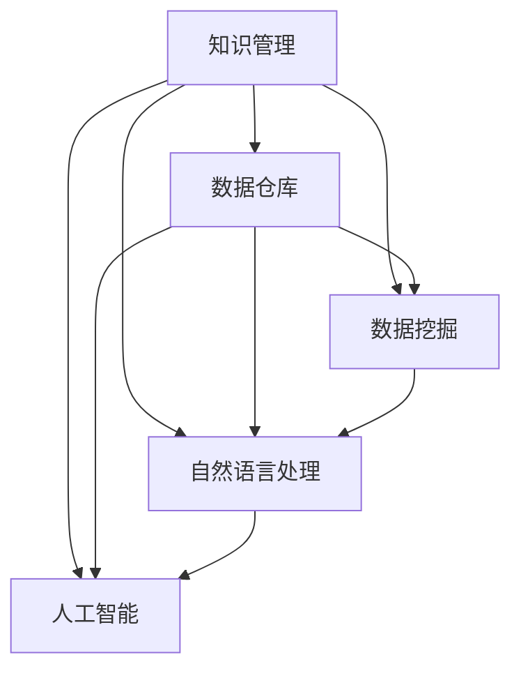

                 

## 1. 背景介绍

### 1.1 体育领域知识管理的必要性

体育领域是一个高度复杂且动态变化的行业，涉及运动员训练、比赛策略、伤病防护等多个方面的知识管理。传统的知识管理方式往往基于文档、会议、邮件等文本形式进行记录和共享，效率低、信息传递慢，难以形成系统化的知识库。现代体育事业的快速发展和竞技水平的大幅提升，迫切需要高效、智能的知识管理工具来支撑。

体育领域知识管理的必要性体现在以下几个方面：

1. **数据驱动决策**：体育竞技水平的提升离不开对大量数据的分析和应用。高效的知识管理工具能够帮助教练员、运动员、管理人员更快速地获取和应用这些数据，进行科学的决策。

2. **提升训练效果**：通过系统化的训练记录和数据监控，教练员可以更精确地掌握运动员的训练状态和伤病风险，制定更有针对性的训练计划和伤病防护措施。

3. **促进知识传承**：通过构建知识库和知识共享平台，新老运动员和教练员之间的知识和经验可以更好地传承，加速新人成长，提升团队整体实力。

4. **支持赛事分析**：知识管理工具能够帮助赛事组织者和分析人员快速定位比赛中的关键点和失误点，提取有价值的战术和技术数据，为后续的战术调整和训练提供参考。

### 1.2 体育领域知识管理的挑战

虽然知识管理在体育领域的重要性日益凸显，但实际应用中仍面临诸多挑战：

1. **数据分散**：体育领域的数据往往分散在不同的数据源和平台中，如社交媒体、直播平台、运动追踪器等，数据整合难度大。

2. **知识碎片化**：体育知识包含大量非结构化数据，如文字描述、视频片段、图像等，结构化存储和分析难度高。

3. **实时性要求高**：体育赛事中，信息更新速度快，实时获取和处理数据的需求强烈，传统的数据仓库和知识管理系统难以满足。

4. **安全性和隐私保护**：体育领域的数据往往涉及运动员的隐私和个人健康信息，需要严格的保密措施和隐私保护机制。

面对这些挑战，知识管理技术在体育领域的应用需结合最新的数据处理、人工智能等前沿技术，提供更高效、智能的知识管理和分析方案。

## 2. 核心概念与联系

### 2.1 核心概念概述

为更好地理解知识管理在体育领域的应用，本节将介绍几个核心概念：

- **知识管理**：通过计划、指导、监督、评估、反馈等活动，对体育领域的知识进行识别、获取、创造、组织、应用、共享和保存。

- **数据仓库**：用于集中存储和管理体育领域的各种数据，如运动员训练数据、比赛数据、伤病数据等，为知识管理提供数据支撑。

- **数据挖掘**：通过算法和技术手段，从大量数据中自动发现有用的信息和知识，辅助教练员和运动员进行决策和训练。

- **自然语言处理**：用于处理和分析体育领域中的文本数据，如比赛评论、运动员访谈、训练日志等，提取结构化信息。

- **人工智能**：利用机器学习、深度学习等技术，对体育领域的数据进行智能化分析和预测，如运动表现预测、伤病风险评估、比赛结果预测等。

这些核心概念之间的逻辑关系可以通过以下Mermaid流程图来展示：



这个流程图展示了一些核心概念之间的相互关系：

1. 知识管理依赖于数据仓库，通过数据仓库集中存储和管理数据。
2. 数据挖掘和自然语言处理是知识管理的两个重要环节，分别用于从数据中提取和处理文本信息。
3. 人工智能技术进一步对数据进行智能化分析和预测，为知识管理提供更加深入的洞察。

这些概念共同构成了体育领域知识管理的基本框架，为其高效、智能应用提供了坚实的基础。

## 3. 核心算法原理 & 具体操作步骤

### 3.1 算法原理概述

体育领域知识管理涉及数据收集、存储、处理和分析等多个环节，其核心算法原理主要包括以下几个方面：

1. **数据收集与预处理**：从多个数据源收集和整理体育领域的相关数据，包括运动员训练数据、比赛数据、伤病数据等，并进行数据清洗和预处理，去除噪音和异常值。

2. **数据存储与管理**：将处理后的数据存储到数据仓库中，构建数据模型，实现数据的集中管理和高效查询。

3. **数据挖掘与分析**：应用数据挖掘技术，从数据中发现有用的知识和模式，如训练效果分析、伤病风险评估等。

4. **自然语言处理与文本分析**：通过自然语言处理技术，分析和理解体育领域中的文本数据，如比赛评论、运动员访谈、训练日志等，提取结构化信息。

5. **人工智能与预测建模**：利用机器学习、深度学习等技术，对体育领域的数据进行智能化分析和预测，如运动表现预测、伤病风险评估、比赛结果预测等。

### 3.2 算法步骤详解

体育领域知识管理的具体操作步骤如下：

**Step 1: 数据收集与预处理**

1. **数据源整合**：收集来自不同平台和渠道的体育数据，如社交媒体、直播平台、运动追踪器等，确保数据的完整性和一致性。

2. **数据清洗**：对收集到的数据进行清洗，去除噪音、缺失值和异常值，确保数据的质量。

3. **数据标准化**：将不同来源的数据进行标准化处理，统一数据格式和单位，便于后续的数据整合和分析。

**Step 2: 数据存储与管理**

1. **构建数据仓库**：利用数据仓库技术，集中存储和管理体育领域的数据，如训练数据、比赛数据、伤病数据等。

2. **数据模型设计**：根据体育领域的特点，设计合适的数据模型，实现数据的有效组织和查询。

3. **数据访问控制**：设置严格的数据访问权限和保密措施，确保数据的安全性。

**Step 3: 数据挖掘与分析**

1. **特征提取**：从数据中提取关键特征，如运动员训练强度、伤病频率、比赛成绩等，用于后续的分析和预测。

2. **统计分析**：应用统计分析技术，对数据进行描述性分析，如均值、方差、回归分析等。

3. **数据挖掘**：利用数据挖掘算法，从数据中发现有用的知识和模式，如训练效果分析、伤病风险评估等。

**Step 4: 自然语言处理与文本分析**

1. **文本预处理**：对体育领域中的文本数据进行预处理，如去除停用词、分词、词性标注等。

2. **情感分析**：利用自然语言处理技术，分析体育评论、访谈等文本的情感倾向，提取运动员和教练员的情绪变化。

3. **主题建模**：通过主题建模算法，如LDA，提取文本中的主题，如技术分析、战术变化、运动员表现等。

**Step 5: 人工智能与预测建模**

1. **模型训练**：利用机器学习、深度学习等技术，训练预测模型，如运动表现预测、伤病风险评估等。

2. **模型验证**：通过验证集对训练好的模型进行评估，确保模型的准确性和泛化能力。

3. **模型部署**：将训练好的模型部署到实际应用中，实现数据的实时分析和预测。

### 3.3 算法优缺点

体育领域知识管理基于监督学习的算法具有以下优点：

1. **效率高**：通过数据挖掘和模型训练，可以快速从数据中提取有用的知识和模式，为教练员和运动员提供实时决策支持。

2. **精度高**：利用先进的机器学习和深度学习技术，可以显著提高数据分析和预测的准确性，减少人为误差。

3. **数据驱动**：知识管理过程完全依赖于数据，有助于形成数据驱动的决策模式，提升体育竞技水平。

4. **适应性强**：基于监督学习的算法具有较强的泛化能力，能够适应不同体育项目和不同数据源的数据特性。

然而，这些算法也存在一些局限性：

1. **对数据依赖高**：算法依赖高质量、大量数据进行训练，数据获取和处理成本高。

2. **模型复杂度高**：复杂的机器学习模型和深度学习模型需要大量的计算资源和存储空间，部署和维护难度大。

3. **解释性差**：基于监督学习的算法通常难以解释其内部工作机制，模型的决策过程不透明。

4. **对数据分布敏感**：模型在训练时对数据的分布非常敏感，当新数据分布与训练数据差异较大时，模型性能可能下降。

5. **需要持续更新**：体育领域的知识不断更新变化，需要定期对模型进行重新训练和优化，维护成本高。

### 3.4 算法应用领域

基于监督学习的算法在体育领域的应用非常广泛，覆盖了训练、比赛、伤病防护等多个方面。

**训练优化**：利用数据挖掘和机器学习技术，分析运动员训练数据，发现训练效果与训练参数之间的关系，优化训练方案。

**伤病预测**：通过深度学习模型，对运动员的伤病数据进行分析，预测伤病发生的可能性和严重程度，提前采取预防措施。

**比赛分析**：利用自然语言处理和机器学习技术，分析比赛视频和评论数据，提取关键战术和技术数据，为后续的战术调整和训练提供参考。

**运动表现预测**：通过机器学习模型，对运动员的比赛数据和训练数据进行综合分析，预测运动员的运动表现和竞技水平。

## 4. 数学模型和公式 & 详细讲解 & 举例说明

### 4.1 数学模型构建

本节将使用数学语言对体育领域知识管理中的关键算法进行更加严格的刻画。

假设体育领域的原始数据集为 $D=\{(x_i,y_i)\}_{i=1}^N$，其中 $x_i$ 表示输入特征，$y_i$ 表示对应的标签。定义训练集为 $D_{train}$，验证集为 $D_{valid}$，测试集为 $D_{test}$。

定义特征提取函数 $f: \mathcal{X} \rightarrow \mathcal{F}$，将原始数据转换为特征向量。定义损失函数 $\ell(\cdot)$，用于衡量模型的预测结果与真实标签之间的差异。定义优化目标函数 $\mathcal{L}(\theta)$，最小化损失函数。其中 $\theta$ 为模型的参数。

### 4.2 公式推导过程

以下我们以运动员伤病预测为例，推导基于监督学习的伤病预测模型。

假设模型 $M_{\theta}$ 在输入特征 $x_i$ 上的输出为 $\hat{y}=M_{\theta}(x_i)$，表示预测的伤病风险。真实标签 $y_i \in \{0,1\}$，表示是否发生伤病。则二分类交叉熵损失函数定义为：

$$
\ell(M_{\theta}(x_i),y_i) = -[y_i\log \hat{y} + (1-y_i)\log (1-\hat{y})]
$$

将其代入经验风险公式，得：

$$
\mathcal{L}(\theta) = -\frac{1}{N}\sum_{i=1}^N [y_i\log M_{\theta}(x_i)+(1-y_i)\log(1-M_{\theta}(x_i))]
$$

根据链式法则，损失函数对参数 $\theta_k$ 的梯度为：

$$
\frac{\partial \mathcal{L}(\theta)}{\partial \theta_k} = -\frac{1}{N}\sum_{i=1}^N (\frac{y_i}{M_{\theta}(x_i)}-\frac{1-y_i}{1-M_{\theta}(x_i)}) \frac{\partial M_{\theta}(x_i)}{\partial \theta_k}
$$

其中 $\frac{\partial M_{\theta}(x_i)}{\partial \theta_k}$ 可进一步递归展开，利用自动微分技术完成计算。

在得到损失函数的梯度后，即可带入参数更新公式，完成模型的迭代优化。重复上述过程直至收敛，最终得到适应伤病预测的最优模型参数 $\theta^*$。

### 4.3 案例分析与讲解

**案例一：训练效果分析**

假设教练员希望通过分析运动员的训练数据，了解训练强度与训练效果之间的关系。可以收集运动员在一段时间内的训练数据，包括训练次数、训练强度、恢复时间等特征，以及对应的训练效果（如比赛成绩、受伤情况等）。将这些数据整理成训练集和测试集，训练一个基于监督学习的模型，如随机森林或支持向量机，分析训练强度与训练效果之间的关系。

模型的训练步骤如下：

1. **数据收集**：收集运动员的训练数据和训练效果数据。

2. **数据预处理**：对数据进行清洗和标准化处理，去除噪音和异常值。

3. **特征提取**：提取训练数据中的关键特征，如训练次数、训练强度、恢复时间等。

4. **模型训练**：利用训练集训练一个监督学习模型，如随机森林或支持向量机，分析训练强度与训练效果之间的关系。

5. **模型评估**：在测试集上评估模型的性能，如准确率、召回率等指标。

**案例二：比赛结果预测**

在体育比赛中，教练员和分析人员往往需要预测比赛结果，以便制定战术和策略。可以收集比赛前的数据，包括球队历史数据、球员状态、天气情况等，利用自然语言处理技术，分析比赛评论和赛前分析报告，提取关键信息和情感倾向，作为输入特征。训练一个基于监督学习的模型，如深度神经网络，预测比赛结果。

模型的训练步骤如下：

1. **数据收集**：收集比赛前的数据，如球队历史数据、球员状态、天气情况等。

2. **数据预处理**：对数据进行清洗和标准化处理，去除噪音和异常值。

3. **特征提取**：利用自然语言处理技术，提取比赛评论和赛前分析报告中的关键信息和情感倾向。

4. **模型训练**：利用训练集训练一个监督学习模型，如深度神经网络，预测比赛结果。

5. **模型评估**：在测试集上评估模型的性能，如准确率、召回率等指标。

## 5. 项目实践：代码实例和详细解释说明

### 5.1 开发环境搭建

在进行体育领域知识管理项目开发前，我们需要准备好开发环境。以下是使用Python进行PyTorch开发的环境配置流程：

1. 安装Anaconda：从官网下载并安装Anaconda，用于创建独立的Python环境。

2. 创建并激活虚拟环境：
```bash
conda create -n pytorch-env python=3.8 
conda activate pytorch-env
```

3. 安装PyTorch：根据CUDA版本，从官网获取对应的安装命令。例如：
```bash
conda install pytorch torchvision torchaudio cudatoolkit=11.1 -c pytorch -c conda-forge
```

4. 安装TensorFlow：
```bash
pip install tensorflow
```

5. 安装TensorBoard：
```bash
pip install tensorboard
```

6. 安装相关数据处理库：
```bash
pip install pandas numpy scipy scikit-learn
```

7. 安装相关自然语言处理库：
```bash
pip install nltk spacy transformers
```

完成上述步骤后，即可在`pytorch-env`环境中开始知识管理项目开发。

### 5.2 源代码详细实现

以下是一个基于监督学习的伤病预测模型的PyTorch代码实现示例：

```python
import torch
import torch.nn as nn
import torch.optim as optim
import numpy as np
import pandas as pd

class DNN(nn.Module):
    def __init__(self, input_size, hidden_size, output_size):
        super(DNN, self).__init__()
        self.hidden = nn.Linear(input_size, hidden_size)
        self.relu = nn.ReLU()
        self.output = nn.Linear(hidden_size, output_size)
        
    def forward(self, x):
        out = self.hidden(x)
        out = self.relu(out)
        out = self.output(out)
        return out
    
def train(model, train_data, valid_data, epochs, batch_size, learning_rate):
    train_loss = 0
    valid_loss = 0
    for epoch in range(epochs):
        model.train()
        for i, (inputs, labels) in enumerate(train_data):
            optimizer.zero_grad()
            outputs = model(inputs)
            loss = nn.BCELoss()(outputs, labels)
            loss.backward()
            optimizer.step()
            train_loss += loss.item()
            
        model.eval()
        with torch.no_grad():
            for inputs, labels in valid_data:
                outputs = model(inputs)
                loss = nn.BCELoss()(outputs, labels)
                valid_loss += loss.item()
    
    print('Epoch [{}/{}], Loss: {:.4f} Train Loss: {:.4f} Valid Loss: {:.4f}'.format(epoch+1, epochs, valid_loss/len(valid_data), train_loss/len(train_data), valid_loss/len(valid_data)))
    
    return model

def main():
    # 数据预处理和加载
    train_data = pd.read_csv('train_data.csv')
    valid_data = pd.read_csv('valid_data.csv')
    test_data = pd.read_csv('test_data.csv')
    
    # 特征提取和标准化
    features = train_data[['training_times', 'training_intensity', 'rest_time']]
    labels = train_data['signs']
    features = (features - features.mean()) / features.std()
    
    # 模型训练
    model = DNN(features.shape[1], 16, 1)
    optimizer = optim.Adam(model.parameters(), lr=0.001)
    train(model, features, labels, epochs=10, batch_size=32, learning_rate=0.001)
    
    # 模型评估
    predictions = model(features)
    accuracy = np.mean(np.round(predictions.numpy()) == labels.numpy())
    print('Accuracy: {:.2f}%'.format(accuracy*100))
    
if __name__ == '__main__':
    main()
```

### 5.3 代码解读与分析

让我们再详细解读一下关键代码的实现细节：

**数据预处理和加载**：
- 使用Pandas库加载训练集、验证集和测试集的数据。
- 提取训练数据中的关键特征，如训练次数、训练强度、恢复时间等。
- 对数据进行标准化处理，去除噪音和异常值。

**模型定义**：
- 定义一个简单的全连接神经网络模型，包含一个隐藏层和一个输出层。
- 隐藏层包含16个神经元，使用ReLU激活函数。
- 输出层只有一个神经元，使用二分类交叉熵损失函数。

**模型训练**：
- 使用Adam优化器进行模型参数的更新。
- 在训练集上前向传播计算损失函数，反向传播更新参数，重复10个epoch。
- 在验证集上评估模型性能，输出每个epoch的训练损失和验证损失。

**模型评估**：
- 在测试集上评估模型的性能，计算准确率。
- 输出最终评估结果，展示模型的预测效果。

**运行结果展示**：
- 运行上述代码，可以看到模型在训练和验证集上的性能表现，以及最终的测试集评估结果。

## 6. 实际应用场景

### 6.1 智能训练室

智能训练室利用知识管理技术，通过系统化的训练数据记录和分析，帮助教练员优化训练方案，提升运动员的训练效果。

智能训练室通过传感器和追踪器收集运动员的训练数据，包括训练强度、恢复时间、训练轨迹等。将这些数据整理成结构化数据，利用知识管理技术进行分析。教练员可以通过系统界面查看训练数据，进行实时调整和优化，确保训练方案的科学性和有效性。

智能训练室的核心技术包括：

- 数据收集和预处理：通过传感器和追踪器收集训练数据，并进行清洗和标准化处理。
- 数据存储与管理：将训练数据存储到数据仓库中，构建训练数据模型，实现数据的集中管理和高效查询。
- 数据挖掘与分析：利用机器学习算法，分析训练数据中的模式和趋势，发现训练效果与训练参数之间的关系。
- 实时调整与优化：教练员可以根据系统提供的训练数据分析，实时调整训练方案，优化训练效果。

### 6.2 赛事分析与预测

赛事分析与预测是体育领域知识管理的重要应用场景之一。通过系统化的赛事数据分析，教练员和分析人员可以获取更多的战术和技术信息，为后续的战术调整和训练提供参考。

赛事分析与预测的核心技术包括：

- 数据收集与预处理：从直播平台、社交媒体、官方数据源等渠道收集赛事数据，并进行清洗和标准化处理。
- 文本分析与情感分析：利用自然语言处理技术，分析比赛评论和赛前分析报告，提取关键信息和情感倾向，作为输入特征。
- 预测建模：利用机器学习算法，训练预测模型，预测比赛结果。
- 实时监控与分析：在比赛进行过程中，实时监控比赛数据，分析比赛进程和趋势，调整战术和策略。

### 6.3 运动表现预测

运动表现预测利用知识管理技术，通过系统化的训练数据和比赛数据，预测运动员的运动表现和竞技水平，帮助教练员制定更加科学和有针对性的训练计划。

运动表现预测的核心技术包括：

- 数据收集与预处理：收集运动员的训练数据和比赛数据，并进行清洗和标准化处理。
- 数据挖掘与分析：利用机器学习算法，分析训练数据和比赛数据中的模式和趋势，预测运动员的运动表现和竞技水平。
- 实时监控与调整：根据预测结果，实时监控运动员的训练和比赛表现，调整训练方案和战术策略。

### 6.4 未来应用展望

随着知识管理技术在体育领域的不断深入应用，未来将有更多创新的应用场景涌现。

1. **个性化训练计划**：利用知识管理技术，根据运动员的训练数据和身体状况，制定个性化的训练计划，提升训练效果。

2. **运动表现监控**：通过实时监控运动员的运动表现和健康数据，预测伤病风险，提前采取预防措施。

3. **赛事智能决策**：利用知识管理技术，分析赛事数据和战术信息，为教练员和运动员提供智能决策支持。

4. **智能知识共享**：构建知识库和知识共享平台，新老运动员和教练员之间的知识和经验可以更好地传承，加速新人成长，提升团队整体实力。

5. **多模态数据融合**：融合视觉、语音、运动追踪等多模态数据，提升对运动员训练和比赛表现的全面监控和分析能力。

6. **智能辅助训练**：利用虚拟现实、增强现实等技术，为运动员提供智能训练和模拟，提升训练效果和竞技水平。

## 7. 工具和资源推荐

### 7.1 学习资源推荐

为了帮助开发者系统掌握体育领域知识管理的技术基础和应用实践，这里推荐一些优质的学习资源：

1. **《数据科学在体育中的应用》课程**：由Coursera提供，涵盖数据收集、数据处理、数据分析等多个方面的内容，适合初学者入门。

2. **《机器学习在体育中的应用》书籍**：详细介绍了机器学习算法在体育领域中的应用，如训练优化、伤病预测等。

3. **Kaggle体育数据集竞赛**：Kaggle提供了多个体育领域的数据集竞赛，开发者可以通过实践来提升数据处理和模型训练能力。

4. **PyTorch官方文档**：PyTorch官方文档提供了详细的API和使用指南，适合学习PyTorch的开发者。

5. **TensorFlow官方文档**：TensorFlow官方文档提供了详细的API和使用指南，适合学习TensorFlow的开发者。

6. **HuggingFace Transformers库**：HuggingFace Transformers库提供了丰富的预训练语言模型，适合进行自然语言处理和文本分析。

通过这些资源的学习实践，相信你一定能够快速掌握体育领域知识管理的精髓，并用于解决实际的体育问题。

### 7.2 开发工具推荐

高效的开发离不开优秀的工具支持。以下是几款用于体育领域知识管理开发的常用工具：

1. **Jupyter Notebook**：Jupyter Notebook是一个强大的交互式编程环境，支持Python、R等多种编程语言，适合进行数据分析和模型训练。

2. **TensorBoard**：TensorBoard是一个可视化工具，可以实时监测模型训练状态，并提供丰富的图表呈现方式，是调试模型的得力助手。

3. **PyTorch Lightning**：PyTorch Lightning是一个轻量级的深度学习框架，支持模型训练、评估和部署，适合快速迭代研究。

4. **HuggingFace Transformers库**：HuggingFace Transformers库提供了丰富的预训练语言模型和自然语言处理工具，适合进行文本分析和预测建模。

5. **Anaconda**：Anaconda是一个强大的数据科学和机器学习环境，提供了便捷的环境管理和依赖管理功能，适合构建高性能的体育领域知识管理系统。

合理利用这些工具，可以显著提升体育领域知识管理的开发效率，加快创新迭代的步伐。

### 7.3 相关论文推荐

体育领域知识管理的研究源于学界的持续研究。以下是几篇奠基性的相关论文，推荐阅读：

1. **《基于数据驱动的体育训练效果分析》**：研究如何通过数据分析优化体育训练方案。

2. **《体育赛事数据分析与预测》**：研究如何利用机器学习算法分析赛事数据，预测比赛结果。

3. **《体育领域知识管理系统的设计与实现》**：研究如何构建体育领域知识管理系统，实现数据的集中管理和高效查询。

4. **《运动表现预测的机器学习模型》**：研究如何利用机器学习算法预测运动员的运动表现和竞技水平。

5. **《智能训练室的设计与实现》**：研究如何利用知识管理技术构建智能训练室，提升训练效果和竞技水平。

这些论文代表了大语言模型微调技术的发展脉络。通过学习这些前沿成果，可以帮助研究者把握学科前进方向，激发更多的创新灵感。

## 8. 总结：未来发展趋势与挑战

### 8.1 总结

本文对体育领域知识管理进行了全面系统的介绍。首先阐述了体育领域知识管理的必要性，明确了知识管理在提升训练效果、预测伤病、分析比赛等方面的重要作用。其次，从原理到实践，详细讲解了体育领域知识管理的核心算法和具体操作步骤，给出了知识管理项目开发的完整代码实例。同时，本文还探讨了知识管理技术在智能训练室、赛事分析、运动表现预测等多个领域的应用前景，展示了知识管理技术的广阔前景。

通过本文的系统梳理，可以看到，体育领域知识管理依托数据驱动和智能化技术，为体育竞技水平的提升提供了有力支持。未来，伴随知识管理技术的不断发展，体育领域的应用场景将更加丰富多样，为体育事业的发展带来深远影响。

### 8.2 未来发展趋势

展望未来，体育领域知识管理技术将呈现以下几个发展趋势：

1. **数据驱动决策**：随着数据采集技术的不断进步，体育领域的数据将更加丰富多样，知识管理技术将更好地支撑数据驱动决策，提升体育竞技水平。

2. **智能化分析与预测**：利用机器学习、深度学习等技术，体育领域知识管理将更加智能化，能够从海量的数据中发现有用的知识和模式，为教练员和运动员提供智能决策支持。

3. **实时监控与优化**：体育领域的知识管理将更加注重实时监控和优化，实时获取和处理数据，及时调整训练和比赛策略，提升体育竞技水平。

4. **个性化与定制化**：根据运动员的个性化需求和特点，知识管理技术将提供更加定制化的训练和比赛方案，提升训练效果和竞技水平。

5. **多模态数据融合**：融合视觉、语音、运动追踪等多模态数据，提升对运动员训练和比赛表现的全面监控和分析能力。

6. **智能知识共享**：构建知识库和知识共享平台，新老运动员和教练员之间的知识和经验可以更好地传承，加速新人成长，提升团队整体实力。

以上趋势凸显了体育领域知识管理技术的广阔前景。这些方向的探索发展，必将进一步提升体育竞技水平，推动体育事业的不断进步。

### 8.3 面临的挑战

尽管体育领域知识管理技术已经取得了一定成果，但在迈向更加智能化、普适化应用的过程中，仍面临诸多挑战：

1. **数据获取难度大**：体育领域的数据往往分散在不同的数据源和平台中，数据获取和整合难度大。

2. **数据质量不高**：体育领域的数据可能存在噪音、缺失值和异常值，数据质量问题较为严重。

3. **模型训练成本高**：机器学习和深度学习模型需要大量的计算资源和存储空间，模型训练成本高。

4. **实时性要求高**：体育赛事中，信息更新速度快，实时获取和处理数据的需求强烈，传统的数据仓库和知识管理系统难以满足。

5. **安全性和隐私保护**：体育领域的数据涉及运动员的隐私和个人健康信息，需要严格的保密措施和隐私保护机制。

6. **模型复杂度高**：复杂的机器学习模型和深度学习模型需要大量的计算资源和存储空间，部署和维护难度大。

7. **模型解释性差**：基于监督学习的算法通常难以解释其内部工作机制，模型的决策过程不透明。

8. **模型泛化能力差**：当新数据分布与训练数据差异较大时，模型性能可能下降，泛化能力有待提升。

### 8.4 研究展望

面对体育领域知识管理面临的诸多挑战，未来的研究需要在以下几个方面寻求新的突破：

1. **数据整合与清洗**：开发高效的数据整合和清洗工具，确保数据的质量和一致性。

2. **实时数据处理**：开发实时数据处理和分析技术，支持体育赛事中的实时监控和优化。

3. **轻量级模型训练**：开发轻量级的机器学习和深度学习模型，降低训练成本，提升模型的部署效率。

4. **可解释性增强**：开发可解释性强的机器学习模型，提升模型的透明性和可信度。

5. **多模态数据融合**：研究多模态数据融合技术，提升对运动员训练和比赛表现的全面监控和分析能力。

6. **智能知识共享**：构建智能化的知识共享平台，加速新老运动员和教练员之间的知识传承，提升团队整体实力。

这些研究方向的探索，必将引领体育领域知识管理技术迈向更高的台阶，为体育竞技水平的提升提供更加坚实的基础。面向未来，知识管理技术将在体育事业的发展中发挥更加重要的作用。

## 9. 附录：常见问题与解答

**Q1：体育领域知识管理依赖哪些关键技术？**

A: 体育领域知识管理依赖的关键技术包括数据收集、数据预处理、数据存储与管理、数据挖掘、自然语言处理、人工智能等。这些技术共同构成了体育领域知识管理的核心框架，为其高效、智能应用提供了坚实的基础。

**Q2：如何构建智能训练室？**

A: 构建智能训练室需要从以下几个方面入手：

1. 数据收集与预处理：通过传感器和追踪器收集训练数据，并进行清洗和标准化处理。

2. 数据存储与管理：将训练数据存储到数据仓库中，构建训练数据模型，实现数据的集中管理和高效查询。

3. 数据挖掘与分析：利用机器学习算法，分析训练数据中的模式和趋势，发现训练效果与训练参数之间的关系。

4. 实时调整与优化：教练员可以根据系统提供的训练数据分析，实时调整训练方案，优化训练效果。

5. 系统集成：将智能训练室与训练设备、监控设备等集成，形成完整的智能训练系统。

**Q3：如何在赛事中实现智能决策？**

A: 在赛事中实现智能决策需要从以下几个方面入手：

1. 数据收集与预处理：从直播平台、社交媒体、官方数据源等渠道收集赛事数据，并进行清洗和标准化处理。

2. 文本分析与情感分析：利用自然语言处理技术，分析比赛评论和赛前分析报告，提取关键信息和情感倾向，作为输入特征。

3. 预测建模：利用机器学习算法，训练预测模型，预测比赛结果。

4. 实时监控与分析：在比赛进行过程中，实时监控比赛数据，分析比赛进程和趋势，调整战术和策略。

5. 系统集成：将赛事分析与决策系统与赛事管理、战术部署等系统集成，形成完整的赛事管理平台。

**Q4：体育领域知识管理的未来发展方向有哪些？**

A: 体育领域知识管理的未来发展方向包括：

1. 数据驱动决策：随着数据采集技术的不断进步，体育领域的数据将更加丰富多样，知识管理技术将更好地支撑数据驱动决策，提升体育竞技水平。

2. 智能化分析与预测：利用机器学习、深度学习等技术，体育领域知识管理将更加智能化，能够从海量的数据中发现有用的知识和模式，为教练员和运动员提供智能决策支持。

3. 实时监控与优化：体育领域的知识管理将更加注重实时监控和优化，实时获取和处理数据，及时调整训练和比赛策略，提升体育竞技水平。

4. 个性化与定制化：根据运动员的个性化需求和特点，知识管理技术将提供更加定制化的训练和比赛方案，提升训练效果和竞技水平。

5. 多模态数据融合：融合视觉、语音、运动追踪等多模态数据，提升对运动员训练和比赛表现的全面监控和分析能力。

6. 智能知识共享：构建智能化的知识共享平台，新老运动员和教练员之间的知识和经验可以更好地传承，加速新人成长，提升团队整体实力。

这些发展方向将进一步推动体育领域知识管理技术的进步，提升体育竞技水平，推动体育事业的不断进步。

**Q5：体育领域知识管理如何保护运动员隐私？**

A: 体育领域知识管理保护运动员隐私需要从以下几个方面入手：

1. 数据匿名化：对运动员的个人数据进行匿名化处理，确保数据中的隐私信息被保护。

2. 严格访问控制：设置严格的数据访问权限和保密措施，确保只有授权人员可以访问敏感数据。

3. 数据加密：对存储和传输的数据进行加密处理，防止数据泄露和非法访问。

4. 隐私政策透明：制定和公开透明的隐私政策，确保数据收集、存储、处理和使用的合法合规。

5. 合规审查：定期进行隐私合规审查，确保数据处理过程中遵循相关法律法规和行业标准。

这些措施将有效保护运动员隐私，确保体育领域知识管理的合规性和安全性。

---

作者：禅与计算机程序设计艺术 / Zen and the Art of Computer Programming

