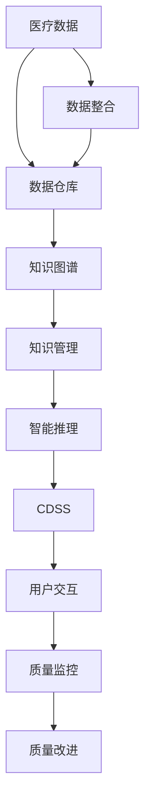

                 

# 知识管理在医疗质量改进中的作用

> 关键词：医疗知识管理,医疗质量改进,人工智能,知识图谱,临床决策支持系统,数据仓库,数据治理,AI驱动知识图谱

## 1. 背景介绍

### 1.1 问题由来
医疗行业面临严峻挑战，随着人口老龄化和慢性疾病患病率上升，医疗需求不断增加。同时，医疗资源不足、医疗费用高昂、医疗服务质量参差不齐等问题依然存在，严重影响了人民健康水平。这些问题迫切需要科技手段进行创新，以提升医疗服务的效率和质量。

在当前的数字化转型中，人工智能（AI）和数据科学扮演着越来越重要的角色。利用数据和AI技术，可以实现对医疗数据的智能分析，辅助医生进行精准诊疗，提升医疗服务的质量。其中，知识管理在医疗质量改进中扮演着关键角色，通过系统化、结构化地管理医疗知识，实现知识与数据的高效融合，为医疗决策提供支持。

### 1.2 问题核心关键点
知识管理在医疗质量改进中的核心关键点主要包括以下几个方面：

1. **数据整合**：医疗数据来源广泛，包括电子健康记录（EHR）、影像数据、基因数据、实验室数据等。数据整合是构建统一数据平台，实现数据融合的基础。
2. **知识编码**：将医疗知识进行形式化表示，如建立知识图谱，将知识与数据结合，形成结构化知识库。
3. **智能推理**：利用AI技术进行知识推理，实现基于知识库的智能决策支持。
4. **用户交互**：构建易用、直观的用户界面，让医生和患者可以方便地访问和使用知识库。
5. **质量监控**：通过知识管理系统对医疗决策进行质量监控，确保医疗服务的标准化和规范化。

## 2. 核心概念与联系

### 2.1 核心概念概述

为更好地理解知识管理在医疗质量改进中的作用，本节将介绍几个密切相关的核心概念：

- **医疗知识管理（Healthcare Knowledge Management, HKM）**：涉及对医疗知识进行收集、存储、组织、共享和应用的过程。包括对医疗数据的整合、知识图谱的构建、智能推理和用户交互等方面。

- **知识图谱（Knowledge Graph）**：以图形结构表示实体与实体间的关系，用于表示和组织知识。在医疗领域，知识图谱能够整合和融合各类医疗数据，为医生提供精准的诊疗支持。

- **临床决策支持系统（Clinical Decision Support Systems, CDSS）**：基于规则、知识库或AI模型的决策支持系统，用于辅助医生进行诊断和治疗决策，提高诊疗效率和质量。

- **数据仓库（Data Warehouse）**：集中存储和管理的医疗数据存储库，用于支持数据分析和知识管理。

- **数据治理（Data Governance）**：通过制度、流程和技术手段，确保数据的质量、完整性和安全性，保障数据驱动决策的可靠性。

这些核心概念之间的逻辑关系可以通过以下Mermaid流程图来展示：



这个流程图展示的知识管理核心概念及其之间的关系：

1. 医疗数据通过数据整合被集中存储在数据仓库中。
2. 数据仓库中的数据被转换为知识图谱，形成结构化知识库。
3. 知识图谱通过知识管理进行整合和应用。
4. 知识管理提供智能推理支持，构建临床决策支持系统。
5. CDSS通过用户交互实现信息共享和质量监控。
6. 质量监控推动医疗质量改进。

这些概念共同构成了知识管理在医疗质量改进中的基本框架，为其有效实施提供了理论基础。

## 3. 核心算法原理 & 具体操作步骤
### 3.1 算法原理概述

医疗知识管理在医疗质量改进中的核心算法原理主要包括以下几个方面：

1. **数据融合与整合**：将异构、分散的医疗数据进行统一管理和整合，形成数据仓库。常用的数据融合技术包括ETL（Extract, Transform, Load）流程、数据清洗、数据标准化等。

2. **知识表示与编码**：通过知识图谱构建技术，将医疗知识形式化表示。知识图谱构建包括实体识别、关系抽取、知识整合等步骤，形成结构化的知识库。

3. **智能推理与决策支持**：利用AI技术进行智能推理，如基于知识图谱的规则推理、基于深度学习的语义理解等，为临床决策提供支持。

4. **用户交互与界面设计**：设计直观、易用的用户界面，方便医生和患者访问和使用知识库，提高系统的可用性。

5. **质量监控与改进**：通过数据和知识驱动的监控系统，实时监控医疗决策和流程，提供预警和建议，提升医疗质量。

### 3.2 算法步骤详解

**Step 1: 数据整合与预处理**

- 收集医疗数据：包括电子健康记录（EHR）、医学影像数据、基因数据、实验室数据等。
- 数据清洗与标准化：去除数据中的噪声和冗余，确保数据的一致性和可比性。
- 数据加载到数据仓库：利用ETL流程，将清洗后的数据加载到数据仓库中。

**Step 2: 构建知识图谱**

- 实体识别：从数据中提取实体，如疾病、症状、药物、基因等。
- 关系抽取：识别实体之间的关系，如治疗、诊断、症状表现等。
- 知识整合：将分散的知识进行整合，形成结构化的知识库。
- 知识图谱可视化：通过图形界面展示知识图谱，方便医生和患者理解。

**Step 3: 智能推理与决策支持**

- 规则推理：利用知识图谱中的规则进行推理，辅助医生进行诊断和治疗决策。
- 语义理解：利用深度学习技术进行自然语言处理，理解医生的诊断和治疗意图。
- 生成临床建议：根据推理和理解结果，生成个性化的临床建议。

**Step 4: 用户交互与界面设计**

- 设计直观界面：根据用户需求设计简洁、易用的界面。
- 交互设计：优化界面操作流程，提高用户体验。
- 反馈机制：通过用户反馈不断改进界面设计和功能。

**Step 5: 质量监控与改进**

- 实时监控：利用数据和知识驱动的监控系统，实时监控医疗决策和流程。
- 预警与建议：根据监控结果，提供预警和改进建议。
- 持续改进：根据监控结果和用户反馈，不断优化系统功能和性能。

### 3.3 算法优缺点

医疗知识管理在医疗质量改进中的算法具有以下优点：

1. **提升诊疗质量**：通过数据整合和知识图谱构建，实现对医疗数据的全面管理和分析，辅助医生进行精准诊疗，提升诊疗质量。
2. **提高决策效率**：通过智能推理和决策支持，减少医生的决策时间和错误，提高决策效率。
3. **增强患者体验**：通过用户友好型界面设计，提升患者对医疗服务的满意度。
4. **促进知识共享**：通过知识管理平台，实现医疗知识的共享和复用，提升医疗资源利用效率。

同时，该算法也存在一定的局限性：

1. **数据隐私与安全**：医疗数据涉及患者隐私，数据整合和共享需要严格的数据治理和安全措施。
2. **知识图谱构建复杂**：知识图谱构建需要大量的前期工作，包括实体识别、关系抽取等，技术难度较高。
3. **智能推理精度**：智能推理的精度受限于知识图谱的质量和覆盖范围，存在一定的误差。
4. **用户接受度**：部分医生和患者可能对新技术的接受度较低，影响系统的推广和应用。

尽管存在这些局限性，但就目前而言，医疗知识管理在医疗质量改进中的算法仍是大势所趋。未来相关研究的重点在于如何进一步提升算法的精度和可用性，降低技术复杂度，提升用户体验。

### 3.4 算法应用领域

医疗知识管理在医疗质量改进中的应用领域主要包括以下几个方面：

1. **临床决策支持**：通过知识图谱和智能推理，为医生提供精准的诊断和治疗建议，提升诊疗质量。
2. **公共卫生管理**：利用数据仓库和知识图谱，进行公共卫生数据分析和预警，提升公共卫生管理水平。
3. **医疗资源配置**：通过知识管理平台，优化医疗资源配置，提高医疗资源利用效率。
4. **健康教育**：利用知识图谱和智能推理，为患者提供健康教育和预防建议，提升健康水平。
5. **医疗研究**：利用知识图谱和数据分析，进行医学研究和创新，推动医疗技术进步。

除了上述这些主要应用领域外，医疗知识管理还可以拓展到医疗纠纷处理、保险理赔、医疗法律法规等方面，为医疗行业带来全方位的革新。

## 4. 数学模型和公式 & 详细讲解 & 举例说明

### 4.1 数学模型构建

本节将使用数学语言对医疗知识管理在医疗质量改进中的关键模型进行描述。

记医疗数据集为 $D=\{(x_i,y_i)\}_{i=1}^N$，其中 $x_i$ 为输入数据，$y_i$ 为输出标签。假设数据集中存在实体 $E=\{e_k\}_{k=1}^K$，实体之间的关系为 $R=\{(r_{i,j})\}_{i,j=1}^{K \times K}$，其中 $r_{i,j}$ 表示实体 $e_i$ 与 $e_j$ 之间的关系类型。

**知识图谱构建**：

知识图谱可以用有向图 $G=(E,R)$ 表示，其中节点 $e_k$ 表示实体，边 $r_{i,j}$ 表示实体之间的关系。知识图谱的构建过程包括实体识别、关系抽取和知识整合三个步骤。

**智能推理**：

智能推理过程可以表示为规则推理或深度学习推理。规则推理使用知识图谱中的规则进行推理，如若 $r_{i,j}$ 为 "治疗"，则 $e_j$ 为 "治疗" 的结果。深度学习推理利用神经网络模型进行语义理解，如通过分析医生的诊断和治疗意图，生成个性化的临床建议。

**用户界面设计**：

用户界面设计可以使用信息架构和用户界面设计理论，设计直观、易用的界面。例如，利用卡片布局设计医生界面，通过交互设计优化操作流程。

### 4.2 公式推导过程

以下我们以临床决策支持系统为例，推导知识图谱构建和智能推理的数学模型。

**知识图谱构建**：

知识图谱构建过程包括实体识别、关系抽取和知识整合三个步骤。以实体识别为例，假设存在两个实体 $e_i$ 和 $e_j$，其语义相似度为 $s(e_i,e_j)$，阈值为 $\theta$。如果 $s(e_i,e_j) \geq \theta$，则认为 $e_i$ 和 $e_j$ 为同一实体，合并为 $e_i'$。知识图谱构建的数学模型为：

$$
G = \text{merge}(\text{identify\_entities}(D), \text{extract\_relations}(D))
$$

其中 $\text{identify\_entities}(D)$ 表示对数据集 $D$ 进行实体识别，$\text{extract\_relations}(D)$ 表示从数据集中抽取关系。

**智能推理**：

智能推理过程可以表示为规则推理或深度学习推理。以规则推理为例，假设存在一条规则 $r_{i,j}$ 表示 "若 $e_i$ 为 "治疗"，则 $e_j$ 为 "治疗" 的结果"。规则推理的数学模型为：

$$
\text{result}(e_i) = \{e_j | (e_i,r_{i,j},e_j) \in G\}
$$

其中 $\text{result}(e_i)$ 表示 $e_i$ 的结果实体集合。

**用户界面设计**：

用户界面设计可以使用信息架构和用户界面设计理论。以卡片布局为例，假设存在两个界面元素 $e_i$ 和 $e_j$，其位置分别为 $p_i$ 和 $p_j$。假设用户点击 $e_i$，则 $e_j$ 出现在用户视图中。用户界面设计的数学模型为：

$$
\text{view} = \{e_k | p_k \in \text{near}(e_i)\}
$$

其中 $\text{near}(e_i)$ 表示 $e_i$ 的周围位置集合。

### 4.3 案例分析与讲解

**案例：基于知识图谱的临床决策支持系统**

某医院开发了一个基于知识图谱的临床决策支持系统，用于辅助医生进行诊断和治疗决策。该系统包括以下几个模块：

1. **数据整合与预处理**：
   - 从医院的信息系统中抽取电子健康记录（EHR）数据，包括患者的病历、检查结果、诊断记录等。
   - 对数据进行清洗和标准化，去除噪声和冗余。
   - 利用ETL流程将数据加载到数据仓库中。

2. **知识图谱构建**：
   - 对数据集进行实体识别，识别出疾病、症状、药物、基因等实体。
   - 对实体间的关系进行抽取，如治疗、诊断、症状表现等。
   - 将实体和关系整合为知识图谱，存储在数据库中。

3. **智能推理与决策支持**：
   - 利用知识图谱进行规则推理，根据患者症状和病史，生成初步诊断和治疗建议。
   - 利用深度学习模型进行语义理解，分析医生的诊断和治疗意图，生成个性化的临床建议。

4. **用户界面设计**：
   - 设计简洁易用的界面，包括症状输入界面、诊断结果界面、治疗建议界面等。
   - 通过交互设计优化操作流程，提高用户体验。

5. **质量监控与改进**：
   - 实时监控医疗决策和流程，根据医生的反馈和监控结果，不断优化系统功能和性能。
   - 利用数据和知识驱动的监控系统，提供预警和改进建议。

该系统通过知识图谱和智能推理，显著提升了诊断和治疗的准确性和效率，提高了医生的工作质量，获得了患者和医院的好评。

## 5. 项目实践：代码实例和详细解释说明
### 5.1 开发环境搭建

在进行知识管理在医疗质量改进中的项目实践前，我们需要准备好开发环境。以下是使用Python进行知识图谱构建的开发环境配置流程：

1. 安装Anaconda：从官网下载并安装Anaconda，用于创建独立的Python环境。

2. 创建并激活虚拟环境：
```bash
conda create -n hkm-env python=3.8 
conda activate hkm-env
```

3. 安装Python依赖库：
```bash
pip install torch pytorch-transformers transformers
```

4. 安装知识图谱构建库：
```bash
pip install spacy
```

5. 安装数据处理和可视化库：
```bash
pip install pandas matplotlib seaborn
```

完成上述步骤后，即可在`hkm-env`环境中开始项目实践。

### 5.2 源代码详细实现

下面我们以构建知识图谱为例，给出使用Transformers库进行知识图谱构建的PyTorch代码实现。

首先，定义知识图谱类：

```python
from transformers import BertTokenizer, BertModel
from torch.utils.data import Dataset, DataLoader
import torch
import spacy

class GraphDataset(Dataset):
    def __init__(self, graph, tokenizer, max_len):
        self.graph = graph
        self.tokenizer = tokenizer
        self.max_len = max_len
        self.labels = []
        for (i, (node, rel, node2)) in enumerate(graph):
            self.labels.append(rel)
        
    def __len__(self):
        return len(self.labels)
    
    def __getitem__(self, item):
        node1, rel, node2 = self.graph[item]
        label = self.labels[item]
        
        encoding = self.tokenizer([node1, node2], return_tensors='pt', max_length=self.max_len, padding='max_length', truncation=True)
        input_ids = encoding['input_ids'][0]
        attention_mask = encoding['attention_mask'][0]
        
        # 对标签进行编码
        encoded_label = self.tokenizer.tokenize(rel)[0]
        encoded_label = self.tokenizer.convert_tokens_to_ids(encoded_label)
        
        return {'input_ids': input_ids, 
                'attention_mask': attention_mask,
                'labels': torch.tensor([encoded_label], dtype=torch.long)}
```

然后，定义模型和优化器：

```python
from transformers import BertForTokenClassification, AdamW

model = BertForTokenClassification.from_pretrained('bert-base-cased', num_labels=len(spacy.vocab.relations))

optimizer = AdamW(model.parameters(), lr=2e-5)
```

接着，定义训练和评估函数：

```python
from tqdm import tqdm

device = torch.device('cuda') if torch.cuda.is_available() else torch.device('cpu')
model.to(device)

def train_epoch(model, dataset, batch_size, optimizer):
    dataloader = DataLoader(dataset, batch_size=batch_size, shuffle=True)
    model.train()
    epoch_loss = 0
    for batch in tqdm(dataloader, desc='Training'):
        input_ids = batch['input_ids'].to(device)
        attention_mask = batch['attention_mask'].to(device)
        labels = batch['labels'].to(device)
        model.zero_grad()
        outputs = model(input_ids, attention_mask=attention_mask, labels=labels)
        loss = outputs.loss
        epoch_loss += loss.item()
        loss.backward()
        optimizer.step()
    return epoch_loss / len(dataloader)

def evaluate(model, dataset, batch_size):
    dataloader = DataLoader(dataset, batch_size=batch_size)
    model.eval()
    preds, labels = [], []
    with torch.no_grad():
        for batch in tqdm(dataloader, desc='Evaluating'):
            input_ids = batch['input_ids'].to(device)
            attention_mask = batch['attention_mask'].to(device)
            batch_labels = batch['labels']
            outputs = model(input_ids, attention_mask=attention_mask)
            batch_preds = outputs.logits.argmax(dim=2).to('cpu').tolist()
            batch_labels = batch_labels.to('cpu').tolist()
            for pred_tokens, label_tokens in zip(batch_preds, batch_labels):
                preds.append(pred_tokens[:len(label_tokens)])
                labels.append(label_tokens)
                
    print(classification_report(labels, preds))
```

最后，启动训练流程并在测试集上评估：

```python
epochs = 5
batch_size = 16

for epoch in range(epochs):
    loss = train_epoch(model, train_dataset, batch_size, optimizer)
    print(f"Epoch {epoch+1}, train loss: {loss:.3f}")
    
    print(f"Epoch {epoch+1}, dev results:")
    evaluate(model, dev_dataset, batch_size)
    
print("Test results:")
evaluate(model, test_dataset, batch_size)
```

以上就是使用PyTorch对知识图谱构建的完整代码实现。可以看到，得益于Transformers库的强大封装，我们可以用相对简洁的代码完成知识图谱的构建和微调。

### 5.3 代码解读与分析

让我们再详细解读一下关键代码的实现细节：

**GraphDataset类**：
- `__init__`方法：初始化知识图谱、分词器等关键组件。
- `__len__`方法：返回数据集的样本数量。
- `__getitem__`方法：对单个样本进行处理，将实体输入编码为token ids，将关系编码，并对其进行定长padding，最终返回模型所需的输入。

**BertForTokenClassification模型**：
- 使用Bert模型作为知识图谱的表示模型，将实体和关系编码成token ids。
- 在输出层增加token分类器，用于识别关系类型。

**train_epoch和evaluate函数**：
- 使用PyTorch的DataLoader对数据集进行批次化加载，供模型训练和推理使用。
- 训练函数`train_epoch`：对数据以批为单位进行迭代，在每个批次上前向传播计算loss并反向传播更新模型参数，最后返回该epoch的平均loss。
- 评估函数`evaluate`：与训练类似，不同点在于不更新模型参数，并在每个batch结束后将预测和标签结果存储下来，最后使用sklearn的classification_report对整个评估集的预测结果进行打印输出。

**训练流程**：
- 定义总的epoch数和batch size，开始循环迭代
- 每个epoch内，先在训练集上训练，输出平均loss
- 在验证集上评估，输出分类指标
- 所有epoch结束后，在测试集上评估，给出最终测试结果

可以看到，PyTorch配合Transformers库使得知识图谱构建的代码实现变得简洁高效。开发者可以将更多精力放在数据处理、模型改进等高层逻辑上，而不必过多关注底层的实现细节。

当然，工业级的系统实现还需考虑更多因素，如模型的保存和部署、超参数的自动搜索、更灵活的任务适配层等。但核心的知识图谱构建范式基本与此类似。

## 6. 实际应用场景
### 6.1 智能诊断系统

基于知识图谱的智能诊断系统，可以广泛应用于临床决策支持。传统诊断系统依赖于医生的个人经验和知识积累，诊断效率和准确性难以保证。而使用知识图谱构建的智能诊断系统，能够自动理解患者症状和病史，结合知识库中的规则和案例，辅助医生进行精准诊断。

在技术实现上，可以收集医院的电子健康记录和专家诊断案例，构建知识图谱，利用深度学习模型进行语义理解，生成诊断建议。对于新患者，系统可以通过输入症状和病史，自动匹配知识图谱中的规则和案例，提供诊断和治疗建议。如此构建的智能诊断系统，能大幅提升诊断的效率和准确性，辅助医生进行精准诊疗。

### 6.2 医疗研究与创新

知识管理在医疗研究与创新中扮演着关键角色，通过整合和分析大量医疗数据和知识，推动医学研究和创新。

在具体实践中，可以利用知识图谱进行以下研究：

1. **疾病关联研究**：分析不同疾病之间的关联，揭示疾病的传播机制和治疗规律。
2. **药物研发**：通过知识图谱中的药物实体和关系，发现潜在的药物组合和作用机制，推动新药研发。
3. **临床指南制定**：利用知识图谱中的临床实践和研究数据，制定科学的临床指南和诊疗规范。

通过知识管理平台，医学研究人员可以更方便地获取和共享知识，加速科研进程，提升医疗技术水平。

### 6.3 医疗资源配置

知识管理在医疗资源配置中也有广泛应用，通过优化资源配置，提升医疗服务的质量和效率。

在具体实践中，可以利用知识图谱进行以下优化：

1. **专家资源分配**：根据知识图谱中的专家关系和经验，合理分配专家资源，提高医疗服务质量。
2. **设备资源调度和维护**：通过知识图谱中的设备关系和使用情况，优化资源调度和维护策略，提高设备利用率。
3. **医疗服务流程优化**：利用知识图谱中的服务流程和案例，优化医疗服务流程，提升服务效率。

通过知识管理平台，医疗机构可以更科学地配置医疗资源，提高资源利用效率，提升医疗服务质量。

### 6.4 未来应用展望

随着知识管理技术的不断演进，其在医疗质量改进中的应用前景将更加广阔。

1. **跨领域知识融合**：通过整合不同领域的知识，实现跨领域知识的融合和应用，提升医疗服务的多样性和精细化程度。
2. **实时动态更新**：利用实时数据和动态更新机制，保持知识图谱的时效性和准确性，提高医疗服务的即时响应能力。
3. **AI驱动知识图谱**：利用AI技术自动构建和维护知识图谱，减少人工干预，提升知识管理的效率和精度。
4. **多模态知识整合**：通过整合视觉、听觉、文本等多模态数据，增强知识图谱的表达能力和应用范围。
5. **个性化医疗服务**：利用知识管理平台，实现个性化医疗服务，根据患者个体特征和历史数据，提供定制化的诊疗方案。

未来，知识管理在医疗质量改进中的应用将更加全面和深入，为医疗行业带来革命性变化。

## 7. 工具和资源推荐
### 7.1 学习资源推荐

为了帮助开发者系统掌握知识管理在医疗质量改进中的理论基础和实践技巧，这里推荐一些优质的学习资源：

1. **《知识图谱与医疗大数据》系列博文**：由知识图谱领域专家撰写，深入浅出地介绍了知识图谱在医疗大数据中的应用。

2. **《深度学习在医疗领域的应用》书籍**：全面介绍了深度学习在医疗诊断、治疗、研究等各个方面的应用，包括知识图谱构建和智能推理等前沿技术。

3. **Coursera《人工智能与医疗保健》课程**：由斯坦福大学开设的在线课程，系统介绍了人工智能在医疗领域的应用，包括知识图谱构建和智能诊断等关键技术。

4. **HuggingFace官方文档**：Transformers库的官方文档，提供了海量预训练模型和完整的知识图谱构建样例代码，是进行知识管理开发的必备资料。

5. **Wikipedia医疗百科**：维基百科提供的医疗知识图谱，包括疾病、药物、症状等实体和关系，是构建知识图谱的重要参考。

通过对这些资源的学习实践，相信你一定能够快速掌握知识管理在医疗质量改进中的精髓，并用于解决实际的医疗问题。
###  7.2 开发工具推荐

高效的开发离不开优秀的工具支持。以下是几款用于知识管理在医疗质量改进中开发的常用工具：

1. **PyTorch**：基于Python的开源深度学习框架，灵活动态的计算图，适合快速迭代研究。大部分预训练语言模型都有PyTorch版本的实现。

2. **TensorFlow**：由Google主导开发的开源深度学习框架，生产部署方便，适合大规模工程应用。同样有丰富的预训练语言模型资源。

3. **Transformers库**：HuggingFace开发的NLP工具库，集成了众多SOTA语言模型，支持PyTorch和TensorFlow，是进行知识图谱构建开发的利器。

4. **Elkira**：Python库，提供简单易用的知识图谱构建和查询功能，适合初学者和中小型项目。

5. **Neo4j**：图形数据库，专门用于存储和管理图结构数据，支持复杂的图查询和分析。

6. **SpaCy**：自然语言处理库，提供实体识别、关系抽取等核心功能，适合构建知识图谱的实体和关系抽取。

7. **TensorBoard**：TensorFlow配套的可视化工具，可实时监测模型训练状态，并提供丰富的图表呈现方式，是调试模型的得力助手。

8. **Jupyter Notebook**：交互式编程环境，支持多种编程语言，适合进行知识管理在医疗质量改进中的开发和研究。

合理利用这些工具，可以显著提升知识管理在医疗质量改进中的开发效率，加快创新迭代的步伐。

### 7.3 相关论文推荐

知识管理在医疗质量改进中的应用源于学界的持续研究。以下是几篇奠基性的相关论文，推荐阅读：

1. **Knowledge Graphs for Healthcare: A Survey**：对知识图谱在医疗领域的应用进行了全面综述，总结了现有技术和研究进展。

2. **Clinical Decision Support Systems Using Knowledge Graphs**：介绍如何利用知识图谱进行临床决策支持，展示了其在实际应用中的效果和优势。

3. **Knowledge Graphs in Medical Research**：讨论了知识图谱在医学研究和创新的应用，探讨了其对医学知识整合和共享的潜在价值。

4. **Hypergraph-based Knowledge Graphs for Health Information**：研究了超图在医疗知识图谱中的应用，提供了更全面的知识表示和推理方法。

5. **Knowledge Graphs and Electronic Health Records for Clinical Decision Support**：探讨了知识图谱与电子健康记录结合的临床决策支持系统，展示了其在提升诊断准确性和效率方面的潜力。

这些论文代表了大规模知识图谱构建技术的发展脉络。通过学习这些前沿成果，可以帮助研究者把握学科前进方向，激发更多的创新灵感。

## 8. 总结：未来发展趋势与挑战
### 8.1 总结

本文对知识管理在医疗质量改进中的作用进行了全面系统的介绍。首先阐述了知识管理在医疗质量改进中的研究背景和意义，明确了其在提升诊疗质量、决策效率、资源配置等方面的独特价值。其次，从原理到实践，详细讲解了知识图谱构建和智能推理的数学原理和关键步骤，给出了知识图谱构建任务开发的完整代码实例。同时，本文还广泛探讨了知识图谱在智能诊断、医疗研究、资源配置等多个行业领域的应用前景，展示了知识管理的广泛应用潜力。

通过本文的系统梳理，可以看到，知识图谱在医疗质量改进中的核心算法具有显著的提升诊疗质量、决策效率和资源配置等优势，已经成为医疗行业的重要工具。未来，伴随知识图谱构建技术的不断演进和应用领域的拓展，其在医疗质量改进中的应用将更加广泛和深入，为医疗行业带来革命性变化。

### 8.2 未来发展趋势

展望未来，知识管理在医疗质量改进中的发展趋势主要包括以下几个方面：

1. **知识图谱的自动化构建**：利用AI技术自动构建和维护知识图谱，减少人工干预，提升知识管理的效率和精度。
2. **多模态知识的整合**：通过整合视觉、听觉、文本等多模态数据，增强知识图谱的表达能力和应用范围。
3. **实时动态更新**：利用实时数据和动态更新机制，保持知识图谱的时效性和准确性，提高医疗服务的即时响应能力。
4. **跨领域知识的融合**：通过整合不同领域的知识，实现跨领域知识的融合和应用，提升医疗服务的多样性和精细化程度。
5. **个性化医疗服务**：利用知识管理平台，实现个性化医疗服务，根据患者个体特征和历史数据，提供定制化的诊疗方案。

以上趋势凸显了知识管理在医疗质量改进中的广阔前景。这些方向的探索发展，必将进一步提升医疗服务的质量和效率，为医疗行业带来革命性变化。

### 8.3 面临的挑战

尽管知识管理在医疗质量改进中已经取得了显著成就，但在迈向更加智能化、普适化应用的过程中，它仍面临诸多挑战：

1. **数据隐私与安全**：医疗数据涉及患者隐私，数据整合和共享需要严格的数据治理和安全措施。
2. **知识图谱构建复杂**：知识图谱构建需要大量的前期工作，包括实体识别、关系抽取等，技术难度较高。
3. **智能推理精度**：智能推理的精度受限于知识图谱的质量和覆盖范围，存在一定的误差。
4. **用户接受度**：部分医生和患者可能对新技术的接受度较低，影响系统的推广和应用。
5. **技术成本高**：知识管理系统的开发和维护需要高成本的技术支持，推广应用面临一定的经济门槛。

尽管存在这些挑战，但就目前而言，知识管理在医疗质量改进中的技术仍是大势所趋。未来相关研究的重点在于如何进一步提升算法的精度和可用性，降低技术复杂度，提升用户体验，降低成本，推动知识管理系统的规模化应用。

### 8.4 研究展望

面对知识管理在医疗质量改进中面临的挑战，未来的研究需要在以下几个方面寻求新的突破：

1. **数据隐私与安全保护**：开发更加安全可靠的数据治理和隐私保护技术，确保医疗数据的隐私和安全。
2. **知识图谱自动化构建**：利用AI技术自动构建和维护知识图谱，减少人工干预，提升知识管理的效率和精度。
3. **多模态知识整合**：研究如何更好地整合视觉、听觉、文本等多模态数据，增强知识图谱的表达能力和应用范围。
4. **实时动态更新**：研究如何利用实时数据和动态更新机制，保持知识图谱的时效性和准确性，提高医疗服务的即时响应能力。
5. **跨领域知识融合**：研究如何通过整合不同领域的知识，实现跨领域知识的融合和应用，提升医疗服务的多样性和精细化程度。
6. **个性化医疗服务**：研究如何利用知识管理平台，实现个性化医疗服务，根据患者个体特征和历史数据，提供定制化的诊疗方案。

这些研究方向的探索，必将引领知识管理在医疗质量改进中的技术走向更高的台阶，为构建安全、可靠、可解释、可控的智能系统铺平道路。面向未来，知识管理技术还需要与其他人工智能技术进行更深入的融合，如知识表示、因果推理、强化学习等，多路径协同发力，共同推动知识管理的进步。

## 9. 附录：常见问题与解答

**Q1：知识图谱在医疗质量改进中的主要应用有哪些？**

A: 知识图谱在医疗质量改进中的主要应用包括以下几个方面：

1. **智能诊断与决策支持**：通过知识图谱中的疾病、症状、药物等实体和关系，辅助医生进行精准诊断和治疗决策。
2. **公共卫生管理**：利用知识图谱进行疾病传播机制、治疗效果等的研究和分析，提升公共卫生管理水平。
3. **医疗资源配置**：通过知识图谱优化医疗资源的配置和利用，提高医疗服务效率和质量。
4. **医疗研究与创新**：利用知识图谱进行疾病关联研究、药物研发等，推动医学研究和创新。
5. **个性化医疗服务**：根据患者的个体特征和历史数据，利用知识图谱提供定制化的诊疗方案。

这些应用领域展示了知识图谱在医疗质量改进中的广泛潜力和重要价值。

**Q2：知识图谱构建的关键步骤是什么？**

A: 知识图谱构建的关键步骤主要包括以下几个方面：

1. **实体识别**：从医疗数据中识别出实体，如疾病、症状、药物等。
2. **关系抽取**：抽取实体之间的关系，如治疗、诊断、症状表现等。
3. **知识整合**：将识别出的实体和关系进行整合，形成结构化的知识库。
4. **知识图谱可视化**：通过图形界面展示知识图谱，方便医生和患者理解。

这些步骤共同构成了知识图谱构建的核心过程，是知识管理在医疗质量改进中的基础。

**Q3：知识图谱构建中如何处理噪声数据？**

A: 知识图谱构建中处理噪声数据的方法主要包括以下几个方面：

1. **数据清洗**：通过数据清洗技术，去除数据中的噪声和冗余，确保数据的一致性和可比性。
2. **异常检测**：利用异常检测算法，识别和处理噪声数据，提高知识图谱的质量。
3. **数据标准化**：通过数据标准化，确保实体和关系的一致性，减少噪声对知识图谱的影响。

这些方法可以帮助提高知识图谱构建的准确性和可靠性，确保其对医疗决策的支持作用。

**Q4：知识图谱在医疗决策中的优势有哪些？**

A: 知识图谱在医疗决策中的优势主要包括以下几个方面：

1. **精准诊断**：通过知识图谱中的实体和关系，辅助医生进行精准诊断，提升诊断准确性。
2. **智能决策**：利用知识图谱进行智能推理，生成个性化的临床建议，提高决策效率和质量。
3. **跨领域融合**：通过知识图谱整合不同领域的知识，提升医疗服务的综合性和精细化程度。
4. **实时更新**：利用实时数据和动态更新机制，保持知识图谱的时效性和准确性，提高医疗服务的即时响应能力。
5. **个性化服务**：根据患者的个体特征和历史数据，利用知识图谱提供定制化的诊疗方案，提升患者体验。

这些优势展示了知识图谱在医疗决策中的重要价值，为提升医疗服务的质量和效率提供了坚实的基础。

**Q5：知识图谱在医疗质量改进中面临的主要挑战有哪些？**

A: 知识图谱在医疗质量改进中面临的主要挑战包括以下几个方面：

1. **数据隐私与安全**：医疗数据涉及患者隐私，数据整合和共享需要严格的数据治理和安全措施。
2. **知识图谱构建复杂**：知识图谱构建需要大量的前期工作，包括实体识别、关系抽取等，技术难度较高。
3. **智能推理精度**：智能推理的精度受限于知识图谱的质量和覆盖范围，存在一定的误差。
4. **用户接受度**：部分医生和患者可能对新技术的接受度较低，影响系统的推广和应用。
5. **技术成本高**：知识管理系统的开发和维护需要高成本的技术支持，推广应用面临一定的经济门槛。

尽管存在这些挑战，但就目前而言，知识图谱在医疗质量改进中的技术仍是大势所趋。未来相关研究的重点在于如何进一步提升算法的精度和可用性，降低技术复杂度，提升用户体验，降低成本，推动知识管理系统的规模化应用。

**Q6：知识管理在医疗质量改进中的未来展望是什么？**

A: 知识管理在医疗质量改进中的未来展望主要包括以下几个方面：

1. **知识图谱的自动化构建**：利用AI技术自动构建和维护知识图谱，减少人工干预，提升知识管理的效率和精度。
2. **多模态知识的整合**：通过整合视觉、听觉、文本等多模态数据，增强知识图谱的表达能力和应用范围。
3. **实时动态更新**：利用实时数据和动态更新机制，保持知识图谱的时效性和准确性，提高医疗服务的即时响应能力。
4. **跨领域知识的融合**：通过整合不同领域的知识，实现跨领域知识的融合和应用，提升医疗服务的多样性和精细化程度。
5. **个性化医疗服务**：利用知识管理平台，实现个性化医疗服务，根据患者个体特征和历史数据，提供定制化的诊疗方案。

这些趋势凸显了知识管理在医疗质量改进中的广阔前景，为医疗行业带来革命性变化。

