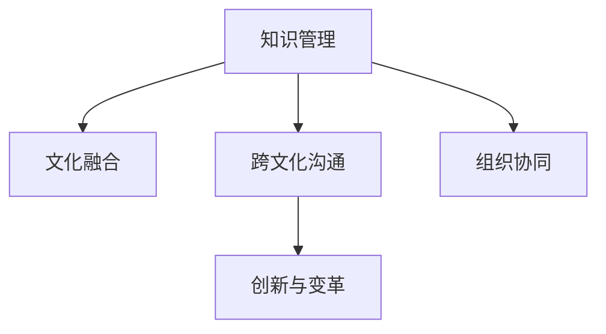

                 

# 知识管理在跨国公司文化融合中的作用

## 1. 背景介绍

在全球化经济浪潮的推动下，跨国公司的全球布局与扩张已成为企业发展的重要战略。然而，不同国家、地区的文化背景、商业习惯、法规政策差异巨大，使得跨国公司在文化融合上面临诸多挑战。为解决这一问题，企业必须建立起有效的知识管理体系，促进文化间的沟通与理解，实现高效协同，驱动组织创新。

### 1.1 跨国公司文化融合的重要性

跨国公司的文化融合不仅是跨国经营的基础，也是提升全球竞争力、实现可持续发展的关键。文化融合有助于：

- **降低跨文化沟通障碍**：通过理解不同文化，降低误解和冲突，提升工作效率。
- **增强团队凝聚力**：促进多元文化的理解和尊重，提升员工的归属感和满意度。
- **促进知识共享**：不同文化的交流与碰撞，带来更广泛的知识来源，促进创新与进步。
- **推动业务扩展**：基于共同的价值体系和文化认同，开拓新市场，增强品牌影响力。

### 1.2 跨国公司文化融合的现状与挑战

目前，跨国公司在文化融合方面仍面临诸多挑战，主要包括：

- **文化差异性大**：各国文化传统、价值观差异显著，难以形成统一的文化认同。
- **沟通障碍**：语言、习俗、礼仪等文化因素导致沟通不畅，影响工作效率。
- **组织复杂性高**：跨国公司往往组织结构复杂，各子公司之间缺乏有效的协调机制。
- **知识管理不足**：缺乏系统化的知识管理策略，导致知识共享不畅，影响创新能力。

面对这些挑战，跨国公司需要构建全面的知识管理体系，通过系统化、规范化的管理手段，促进知识共享与文化融合，从而提升整体绩效。

## 2. 核心概念与联系

### 2.1 核心概念概述

为了更好地理解知识管理在跨国公司文化融合中的作用，本节将介绍几个关键概念：

- **知识管理(Knowledge Management)**：通过技术、政策、流程等手段，促进知识的获取、存储、共享和应用，提升组织的创新能力和竞争力。
- **文化融合(Cultural Integration)**：不同文化背景的员工在共同工作过程中，逐步形成统一的价值观、行为规范和沟通方式，增强组织凝聚力。
- **跨文化沟通(Inter-cultural Communication)**：在不同文化背景下，通过语言、符号、行为等手段，进行有效交流和理解。
- **组织协同(Organizational Collaboration)**：通过知识共享、信息透明、流程优化等手段，提升组织内部和外部的协同效率。
- **创新与变革(Innovation and Change)**：通过知识管理促进创新思维与变革实践，提升组织适应性和竞争力。

这些概念之间存在紧密联系，共同构成跨国公司知识管理的完整框架。通过理解这些概念，我们可以更好地把握知识管理在文化融合中的关键作用和实践路径。

### 2.2 核心概念原理和架构的 Mermaid 流程图



## 3. 核心算法原理 & 具体操作步骤

### 3.1 算法原理概述

知识管理在跨国公司文化融合中的核心算法原理，可以归结为以下几个关键点：

- **知识收集**：通过自动化工具和人工整理，收集跨国公司的各类知识资源，包括文档、数据、经验、技能等。
- **知识存储与组织**：构建知识库和文档管理系统，对知识资源进行分类、索引、存储，便于快速检索和共享。
- **知识共享**：建立知识共享平台，促进跨部门、跨地区、跨文化的知识传递和协作，提升知识利用率。
- **知识应用与创新**：通过知识管理工具和技术，推动知识向业务应用的转化，促进创新思维和变革实践。

### 3.2 算法步骤详解

基于上述核心原理，跨国公司知识管理在文化融合中的具体操作步骤可细化为以下几个步骤：

**Step 1: 确定知识管理目标**

- 明确跨国公司的知识管理目标，包括知识共享、文化融合、创新发展等。
- 制定相应的KPI指标，评估知识管理的效果。

**Step 2: 构建知识管理体系**

- 建立知识管理政策与流程，包括知识分类、存储、检索、更新等。
- 引入知识管理工具，如知识库、文档管理系统、协作平台等。

**Step 3: 收集与存储知识资源**

- 通过自动化工具和人工整理，收集跨国公司的各类知识资源，包括文档、数据、经验、技能等。
- 对收集到的知识资源进行分类、索引、存储，建立统一的存储规范。

**Step 4: 促进知识共享**

- 建立知识共享平台，促进跨部门、跨地区、跨文化的知识传递和协作。
- 通过培训、研讨会等方式，提升员工的知识共享意识和能力。

**Step 5: 推动知识应用与创新**

- 将知识管理与业务应用相结合，推动知识向业务应用的转化。
- 利用知识管理工具和技术，促进创新思维与变革实践。

**Step 6: 评估与优化**

- 定期评估知识管理的效果，收集反馈意见，进行优化改进。
- 持续监测KPI指标，确保知识管理的有效性和可持续性。

### 3.3 算法优缺点

跨国公司知识管理在文化融合中的优势包括：

- **促进知识共享**：通过系统化的知识管理，促进跨国公司内部知识共享，打破地域和文化的限制。
- **增强文化理解**：通过跨文化沟通和协作，增强员工对不同文化的理解和尊重，促进文化融合。
- **提升创新能力**：知识管理促进创新思维与变革实践，推动组织持续进步。

然而，也存在一些缺点和挑战：

- **资源投入高**：知识管理体系的建立和维护需要大量资源，包括人力、技术、资金等。
- **数据隐私问题**：跨国公司涉及多个国家的数据隐私法规，数据共享与隐私保护间存在矛盾。
- **跨文化差异**：不同文化背景下，员工的知识表达和理解方式存在差异，可能导致沟通障碍。
- **知识转化难度**：将知识转化为实际业务应用需要时间，且效果存在不确定性。

### 3.4 算法应用领域

知识管理在跨国公司文化融合中的应用广泛，具体如下：

- **人力资源管理**：通过知识管理提升员工培训与职业发展，促进人才共享与成长。
- **市场营销**：通过知识共享提升市场情报分析和策略制定能力，增强跨国市场的竞争力。
- **研发创新**：推动知识共享与跨部门合作，加速新技术的研发与应用。
- **运营管理**：通过知识管理优化流程和决策支持，提升运营效率和质量。
- **客户服务**：通过知识共享提升服务标准化和响应速度，提升客户满意度。

## 4. 数学模型和公式 & 详细讲解 & 举例说明

### 4.1 数学模型构建

跨国公司文化融合的知识管理模型可以抽象为如下框架：

$$
\text{知识管理效果} = \text{知识获取} + \text{知识共享} + \text{知识应用} + \text{文化融合}
$$

其中，知识获取、知识共享、知识应用分别代表知识管理的不同阶段，文化融合是知识管理的目标和最终效果。

### 4.2 公式推导过程

假设跨国公司有 $n$ 个国家/地区，每个国家/地区分别有 $N_i$ 名员工，知识管理效果为 $E$。

定义 $K_i$ 为第 $i$ 个国家/地区的知识获取量，$S_i$ 为知识共享量，$A_i$ 为知识应用量，$C_i$ 为文化融合程度。

则知识管理效果可表示为：

$$
E = \sum_{i=1}^n (K_i + S_i + A_i + C_i)
$$

进一步，定义知识获取率 $R_k = \frac{K_i}{N_i}$，知识共享率 $R_s = \frac{S_i}{N_i}$，知识应用率 $R_a = \frac{A_i}{N_i}$，文化融合度 $C_i$。

则知识管理效果的公式可以写为：

$$
E = \sum_{i=1}^n N_i (R_k + R_s + R_a + C_i)
$$

### 4.3 案例分析与讲解

以跨国公司A为例，其拥有10个国家/地区，每个国家/地区分别有1000名员工。知识获取率 $R_k = 0.2$，知识共享率 $R_s = 0.3$，知识应用率 $R_a = 0.4$，文化融合度 $C_i = 0.5$。

代入公式计算，得：

$$
E = 10 \times 1000 \times (0.2 + 0.3 + 0.4 + 0.5) = 13000
$$

即跨国公司A的知识管理效果为13000。

## 5. 项目实践：代码实例和详细解释说明

### 5.1 开发环境搭建

在进行知识管理实践前，我们需要准备好开发环境。以下是使用Python进行PyTorch开发的环境配置流程：

1. 安装Anaconda：从官网下载并安装Anaconda，用于创建独立的Python环境。

2. 创建并激活虚拟环境：
```bash
conda create -n pytorch-env python=3.8 
conda activate pytorch-env
```

3. 安装PyTorch：根据CUDA版本，从官网获取对应的安装命令。例如：
```bash
conda install pytorch torchvision torchaudio cudatoolkit=11.1 -c pytorch -c conda-forge
```

4. 安装各类工具包：
```bash
pip install numpy pandas scikit-learn matplotlib tqdm jupyter notebook ipython
```

完成上述步骤后，即可在`pytorch-env`环境中开始知识管理实践。

### 5.2 源代码详细实现

这里我们以构建知识库为例，给出使用Python实现知识管理系统的代码。

首先，定义知识库类：

```python
class KnowledgeBase:
    def __init__(self):
        self.knowledge = {}
    
    def add_knowledge(self, id, content):
        self.knowledge[id] = content
    
    def get_knowledge(self, id):
        return self.knowledge.get(id, None)
```

然后，定义知识共享平台：

```python
class KnowledgeShare:
    def __init__(self, base):
        self.base = base
    
    def share_knowledge(self, id, user_id):
        knowledge = self.base.get_knowledge(id)
        if knowledge:
            print(f"{user_id} 分享了知识 {id}")
    
    def search_knowledge(self, query):
        for id, content in self.base.knowledge.items():
            if query in content:
                print(f"{id}：{content}")
```

最后，启动知识共享流程：

```python
kb = KnowledgeBase()
ks = KnowledgeShare(kb)

kb.add_knowledge(1, "知识1内容")
kb.add_knowledge(2, "知识2内容")
kb.add_knowledge(3, "知识3内容")

ks.share_knowledge(1, "用户1")
ks.search_knowledge("内容")
```

### 5.3 代码解读与分析

让我们再详细解读一下关键代码的实现细节：

**KnowledgeBase类**：
- `__init__`方法：初始化知识库，创建空字典。
- `add_knowledge`方法：添加新知识，按ID键存储。
- `get_knowledge`方法：根据ID获取知识内容，返回None或内容字符串。

**KnowledgeShare类**：
- `__init__`方法：初始化知识共享平台，传入知识库实例。
- `share_knowledge`方法：根据ID和用户ID分享知识，输出分享提示。
- `search_knowledge`方法：根据查询字符串搜索知识，输出匹配的结果。

**知识共享流程**：
- 创建知识库实例
- 创建知识共享平台实例，传入知识库实例
- 向知识库添加新知识
- 用户分享知识
- 搜索相关知识

可以看到，通过简单的代码，我们实现了一个基本的知识库和知识共享平台，能够满足基本的知识管理需求。

当然，工业级的系统实现还需考虑更多因素，如用户权限管理、版本控制、数据加密等。但核心的知识管理逻辑基本与此类似。

## 6. 实际应用场景

### 6.1 跨国公司人力资源管理

跨国公司的人力资源管理离不开系统化的知识管理支持。通过知识管理，企业可以：

- **人才招聘与选拔**：建立人才库，通过知识共享平台获取员工的技能、经验信息，提高招聘效率和质量。
- **员工培训与发展**：根据不同国家和地区的文化需求，设计个性化培训方案，促进员工技能提升和职业成长。
- **绩效评估与反馈**：利用知识管理工具记录和分析员工绩效数据，及时反馈和改进。

### 6.2 市场营销

跨国公司市场营销的竞争主要依赖于市场情报和策略的制定。通过知识管理，企业可以：

- **市场情报分析**：集成各国市场数据，进行市场趋势分析和情报评估，制定市场策略。
- **客户需求洞察**：通过知识共享平台，获取不同市场的客户需求和反馈信息，优化产品和服务。
- **品牌传播与推广**：利用知识管理工具，进行品牌信息的统一管理和传播，提升品牌影响力。

### 6.3 研发创新

跨国公司研发创新的核心在于知识积累和跨部门合作。通过知识管理，企业可以：

- **技术知识共享**：建立技术文档和专利库，促进技术知识在团队间的传递和应用。
- **跨部门合作**：利用知识管理平台，促进不同部门间的信息透明和协作，加速研发进度。
- **创新思维激发**：通过知识管理工具，激发员工的创新思维，促进新技术和新产品的开发。

### 6.4 运营管理

跨国公司的运营管理涉及复杂的流程和数据，知识管理在此扮演重要角色。通过知识管理，企业可以：

- **流程优化与标准化**：建立标准操作流程库，促进不同国家和地区的流程一致性和规范化。
- **风险管理**：集成各国市场和运营数据，进行风险评估和预测，制定风险管理策略。
- **成本控制**：通过知识共享平台，优化资源配置和成本控制，提升运营效率。

### 6.5 客户服务

跨国公司的客户服务需求多样，需要系统化的知识管理支持。通过知识管理，企业可以：

- **服务标准化**：建立服务流程和知识库，提高服务标准化和一致性。
- **客户信息管理**：通过知识共享平台，集成客户数据和反馈信息，提升客户满意度。
- **多语言支持**：利用知识管理工具，实现多语言服务支持和客户沟通，提升客户体验。

## 7. 工具和资源推荐

### 7.1 学习资源推荐

为了帮助开发者系统掌握知识管理技术，这里推荐一些优质的学习资源：

1. **《知识管理与组织创新》课程**：由知名大学的教授主讲，系统介绍知识管理的理论基础和实践技巧。
2. **《知识管理工具与实践》书籍**：详细讲解知识管理的工具和实际应用案例，帮助读者深入理解知识管理。
3. **KM²社区**：全球知识管理专业人士的交流平台，提供丰富的学习资源和社区支持。
4. **KnowledgeHQ平台**：提供知识管理工具和咨询服务，帮助企业构建知识管理体系。
5. **Microsoft Office 365**：集成各类知识管理工具，如SharePoint、OneDrive等，支持文档管理、知识共享等。

### 7.2 开发工具推荐

高效的知识管理开发需要工具的支撑。以下是几款常用的开发工具：

1. **Confluence**：Atlassian公司推出的知识管理系统，支持文档管理、知识共享和协作。
2. **SharePoint**：微软的知识管理平台，集成文件存储、协作工具和权限管理。
3. **Google Drive**：谷歌的云存储平台，支持文档协作、知识共享和团队沟通。
4. **JIRA**：Atlassian公司的项目管理工具，支持任务分配、进度跟踪和知识共享。
5. **Trello**：Butler的产品管理工具，支持看板管理、任务分配和知识共享。

### 7.3 相关论文推荐

知识管理在跨国公司中的应用涉及诸多领域，以下推荐几篇相关领域的经典论文：

1. **《跨文化知识管理：研究回顾与展望》**：回顾跨文化知识管理的理论进展和实践案例，探讨未来的发展方向。
2. **《知识管理在跨国公司中的应用研究》**：探讨跨国公司知识管理的策略和实践，提升组织创新能力。
3. **《文化多样性与知识管理：理论框架与实证研究》**：研究文化多样性对知识管理的挑战和影响，提出解决方案。
4. **《知识共享在跨国公司中的作用与影响》**：分析知识共享在跨国公司中的作用机制和影响因素。
5. **《知识管理与组织文化：理论与实践》**：探讨知识管理与组织文化的相互作用，提升组织绩效。

## 8. 总结：未来发展趋势与挑战

### 8.1 研究成果总结

本文对跨国公司知识管理在文化融合中的作用进行了全面系统的介绍。首先阐述了跨国公司文化融合的重要性，明确了知识管理在其中的关键作用。其次，从原理到实践，详细讲解了知识管理的核心步骤和技术手段，给出了知识管理系统的代码实现。同时，本文还探讨了知识管理在多个实际应用场景中的具体应用，展示了知识管理技术的广阔前景。

通过本文的系统梳理，可以看到，知识管理是跨国公司文化融合不可或缺的一部分，通过系统化的知识管理，企业能够促进跨文化沟通与协作，提升组织创新能力和竞争优势。未来，知识管理技术将在更多领域得到应用，为组织发展带来新的活力。

### 8.2 未来发展趋势

展望未来，知识管理在跨国公司中的应用将呈现以下几个发展趋势：

1. **人工智能与知识管理结合**：利用AI技术进行知识自动提取、分类和推荐，提高知识管理的智能化水平。
2. **多模态知识管理**：将文本、语音、图像等不同类型的数据融合，提供更全面、更丰富的知识资源。
3. **知识网络构建**：通过知识图谱等技术，构建知识网络，促进知识之间的关联和应用。
4. **实时知识管理**：实现知识的实时更新和动态管理，提升组织对变化环境的适应性。
5. **跨文化知识共享**：利用语言翻译、文化适应等技术，促进跨文化知识共享和理解，提升文化融合效果。

这些趋势将推动知识管理技术向更加高效、智能、全面的方向发展，为跨国公司带来更多的竞争优势和发展机会。

### 8.3 面临的挑战

尽管知识管理在跨国公司中的应用前景广阔，但在实际推广和应用中，仍面临诸多挑战：

1. **资源投入高**：知识管理体系的建立和维护需要大量资源，包括人力、技术、资金等。
2. **数据隐私问题**：跨国公司涉及多个国家的数据隐私法规，数据共享与隐私保护间存在矛盾。
3. **跨文化差异**：不同文化背景下，员工的知识表达和理解方式存在差异，可能导致沟通障碍。
4. **知识转化难度**：将知识转化为实际业务应用需要时间，且效果存在不确定性。
5. **文化融合难度**：不同文化之间的融合需要时间，且可能存在冲突和阻力。

这些挑战需要跨国公司在实践中不断探索和解决，才能更好地利用知识管理技术推动文化融合和组织创新。

### 8.4 研究展望

针对知识管理在跨国公司中的挑战，未来的研究可以从以下几个方向进行探索：

1. **智能知识管理**：结合AI和大数据技术，提高知识管理的智能化水平，提升知识获取、存储、共享和应用的效率。
2. **跨文化知识共享**：研究跨文化知识共享的策略和工具，促进不同文化背景下员工的知识理解和应用。
3. **知识管理与创新管理结合**：将知识管理与创新管理结合起来，推动组织的持续创新和变革。
4. **知识管理系统的可扩展性**：研究知识管理系统的可扩展性，支持多语言、多文化、多地区的应用。
5. **知识管理的伦理与安全**：研究知识管理系统的伦理与安全问题，确保知识共享与保护之间的平衡。

这些研究方向将推动知识管理技术向更加全面、智能、安全的方向发展，为跨国公司文化融合和组织创新提供更有力的支撑。

## 9. 附录：常见问题与解答

**Q1：知识管理在跨国公司中的重要性体现在哪些方面？**

A: 知识管理在跨国公司中的重要性主要体现在以下几个方面：

- **促进知识共享**：通过知识管理平台，跨国公司可以打破地域和文化的限制，促进内部知识的共享和传播。
- **增强文化理解**：不同文化背景下的员工通过知识管理平台，可以更好地理解彼此的文化差异，促进文化融合。
- **提升组织绩效**：知识管理通过优化流程和决策支持，提升跨国公司的运营效率和创新能力。
- **提升员工满意度**：知识管理平台提供了丰富的学习资源和协作工具，提升员工的满意度和归属感。

**Q2：如何进行跨文化知识管理？**

A: 跨文化知识管理主要通过以下步骤进行：

1. **文化适应性分析**：分析不同文化的差异和特点，确定知识管理的目标和策略。
2. **知识共享平台构建**：构建多语言、多文化的知识共享平台，支持不同语言和文化的内容发布和搜索。
3. **知识管理培训**：对员工进行跨文化知识管理的培训，提升员工的文化敏感性和协作能力。
4. **知识共享策略设计**：设计知识共享的策略和流程，促进不同文化背景下的知识传递和应用。
5. **文化融合监测**：监测知识共享和文化融合的效果，及时调整和优化策略。

**Q3：知识管理在跨国公司中的难点和挑战有哪些？**

A: 知识管理在跨国公司中的难点和挑战主要包括以下几个方面：

- **资源投入高**：知识管理体系的建立和维护需要大量资源，包括人力、技术、资金等。
- **数据隐私问题**：跨国公司涉及多个国家的数据隐私法规，数据共享与隐私保护间存在矛盾。
- **跨文化差异**：不同文化背景下，员工的知识表达和理解方式存在差异，可能导致沟通障碍。
- **知识转化难度**：将知识转化为实际业务应用需要时间，且效果存在不确定性。
- **文化融合难度**：不同文化之间的融合需要时间，且可能存在冲突和阻力。

**Q4：如何构建跨国公司的知识管理系统？**

A: 构建跨国公司的知识管理系统主要包括以下几个步骤：

1. **需求分析**：根据跨国公司的业务需求，确定知识管理的范围和目标。
2. **平台选择**：选择适合跨国公司的知识管理平台，如Confluence、SharePoint等。
3. **数据收集与整理**：收集跨国公司的各类知识资源，如文档、数据、经验、技能等，进行分类和整理。
4. **知识库建立**：建立知识库，将整理好的知识资源按类别和主题进行存储。
5. **知识共享平台搭建**：搭建知识共享平台，支持文档管理、搜索、协作等功能。
6. **知识共享机制设计**：设计知识共享的机制和流程，促进知识在跨国公司内部的传播和应用。
7. **系统培训与推广**：对员工进行知识管理系统的培训和推广，提升员工的知识管理意识和能力。

通过这些步骤，跨国公司可以建立起有效的知识管理体系，促进知识共享和跨文化融合。

**Q5：跨国公司知识管理系统的开发与维护需要注意哪些方面？**

A: 跨国公司知识管理系统的开发与维护需要注意以下方面：

1. **用户需求分析**：充分了解跨国公司不同地区和部门的知识需求，设计符合实际需求的知识管理平台。
2. **技术选型与架构设计**：选择合适的技术平台和架构，确保系统的可扩展性和稳定性。
3. **数据安全与隐私保护**：采取必要的技术和管理措施，保障数据安全和隐私保护。
4. **用户体验优化**：注重用户体验，设计直观易用的界面和操作流程，提升员工的使用体验。
5. **持续改进与优化**：定期收集用户反馈，进行系统优化和改进，确保知识管理系统的有效性和持续性。

通过关注这些方面，跨国公司可以建立起高效、安全、易用的知识管理系统，推动组织创新和业务发展。

---

作者：禅与计算机程序设计艺术 / Zen and the Art of Computer Programming

