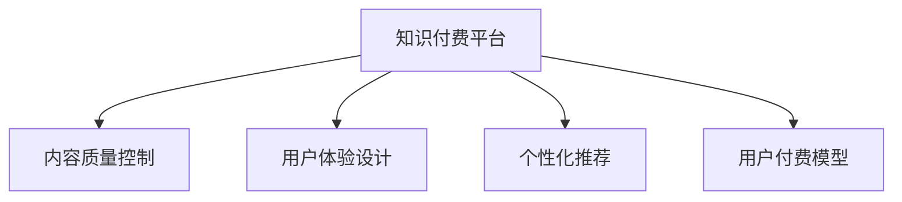

                 

# 知识经济时代下的知识付费创新商业模式运营

在数字经济飞速发展的今天，知识付费已经成为了一种不可或缺的商业模式，不仅为人们提供了获取知识的新途径，也在一定程度上推动了教育、科技、文化等多个领域的繁荣发展。然而，面对日新月异的市场需求和日益激烈的竞争，知识付费平台如何在知识经济时代下实现可持续发展，创新商业模式，提升用户价值，成为了一个值得深入探讨的问题。本文将从背景介绍、核心概念与联系、核心算法原理与具体操作步骤、数学模型和公式、项目实践、实际应用场景、工具和资源推荐、总结等多个维度，全面解析知识付费平台的创新商业模式运营。

## 1. 背景介绍

### 1.1 问题由来
随着互联网技术的发展和用户对知识需求的不断提升，传统的教育模式和知识传播方式已经无法满足用户的个性化需求。在线教育、远程学习、网络课程等新兴教育形式的崛起，催生了知识付费市场的繁荣。知识付费平台如得到、喜马拉雅、知乎等，纷纷通过订阅、付费课程、会员制等多种形式，为全球用户提供便捷高效的知识获取服务。然而，随着市场的快速扩张和竞争的加剧，知识付费平台面临着内容质量参差不齐、用户粘性不足、盈利模式单一等问题，亟需通过创新商业模式，实现长期可持续发展。

### 1.2 问题核心关键点
知识付费平台的创新商业模式运营，主要包括以下几个关键点：
- **内容质量与差异化**：如何生产优质、多样化的内容，满足用户个性化需求。
- **用户体验与互动性**：如何提升用户体验，增强内容互动性，提升用户粘性。
- **变现模式与用户收益**：如何设计合理的变现模式，实现平台盈利，同时确保用户收益。
- **技术驱动与智能化**：如何借助技术手段，提升平台运营效率，实现智能化管理。

### 1.3 问题研究意义
通过创新商业模式运营，知识付费平台可以更好地适应市场变化，提升内容质量，增强用户粘性，优化盈利模式，实现可持续发展。具体来说：
- **提升内容质量**：通过优化内容生产流程，引入多样化内容形式，吸引更多优质内容生产者，提升内容质量。
- **增强用户粘性**：通过提升用户体验，增加互动性，引导用户深度参与，增强用户粘性。
- **优化盈利模式**：通过设计合理的变现模式，探索新的盈利渠道，实现平台盈利，同时确保用户收益。
- **实现智能化管理**：通过引入技术手段，提升平台运营效率，实现智能化管理，提升平台竞争力。

## 2. 核心概念与联系

### 2.1 核心概念概述

为了更好地理解知识付费平台的创新商业模式运营，本节将介绍几个密切相关的核心概念：

- **知识付费平台**：指通过互联网技术，为用户提供有偿知识获取服务，实现内容变现的平台。
- **内容质量控制**：指通过一系列机制和技术手段，确保平台内容的高质量和原创性。
- **用户体验设计**：指通过用户行为分析和反馈机制，设计符合用户心理和行为习惯的用户界面和交互流程。
- **个性化推荐**：指通过算法和大数据分析，为用户推荐符合其兴趣和需求的内容，提升用户粘性。
- **用户付费模型**：指通过订阅、付费课程、会员制等形式，实现平台盈利，同时确保用户收益。

这些核心概念之间的逻辑关系可以通过以下Mermaid流程图来展示：



这个流程图展示了一系列概念的相互关系：

1. 知识付费平台通过内容质量控制和用户体验设计，确保平台内容的质量和用户体验，从而吸引和留住用户。
2. 个性化推荐系统通过分析用户行为和需求，为用户推荐相关内容，增强用户粘性。
3. 用户付费模型通过多样化的变现方式，实现平台盈利，同时确保用户获得一定的收益，形成良性循环。

这些核心概念共同构成了知识付费平台创新商业模式运营的基石，帮助平台在激烈的市场竞争中脱颖而出。

## 3. 核心算法原理 & 具体操作步骤

### 3.1 算法原理概述

知识付费平台的创新商业模式运营，本质上是一个基于用户行为数据分析、内容质量控制和个性化推荐的智能化过程。其核心思想是：通过深度学习、自然语言处理等技术手段，对平台上的用户行为、内容和推荐进行建模和优化，实现高效的内容推荐、用户体验提升和盈利模式优化。

形式化地，假设平台上的用户为 $U$，内容为 $C$，互动数据为 $I$，目标为 $O$（如内容质量、用户体验、用户粘性等），那么基于监督学习的优化目标可以表示为：

$$
\max_{\theta} \sum_{i \in U} \sum_{c \in C} \sum_{i \in I} \omega_i o_i(\theta) - \lambda \sum_{i \in U} \sum_{c \in C} \sum_{i \in I} \omega_i l_i(\theta)
$$

其中 $\theta$ 为模型的参数，$\omega_i$ 为权重，$l_i$ 为损失函数，$\lambda$ 为正则化系数。平台通过优化模型参数 $\theta$，最大化目标函数 $o_i$，同时最小化损失函数 $l_i$，实现平台运营效率和用户价值的提升。

### 3.2 算法步骤详解

基于用户行为数据分析、内容质量控制和个性化推荐的知识付费平台运营，一般包括以下几个关键步骤：

**Step 1: 数据收集与处理**
- 收集平台上的用户行为数据，如浏览历史、点赞、评论等。
- 收集内容数据，如文章、视频、音频等。
- 对数据进行清洗、标注、归一化等预处理。

**Step 2: 用户画像构建**
- 使用用户行为数据和内容互动数据，构建用户画像，包括兴趣、偏好、行为习惯等。
- 通过聚类、分类等算法，对用户进行细分，形成不同的用户群体。

**Step 3: 内容质量控制**
- 引入内容审核机制，对发布的内容进行质量控制。
- 通过文本分析、图像识别等技术，检测内容是否原创、是否符合平台规范。
- 引入用户反馈机制，对内容进行动态评估和调整。

**Step 4: 个性化推荐系统构建**
- 设计推荐算法，根据用户画像和内容特征，生成个性化推荐列表。
- 引入协同过滤、内容推荐、混合推荐等算法，提升推荐准确性和多样性。
- 实时监控推荐效果，根据用户反馈进行动态调整。

**Step 5: 盈利模式设计**
- 设计合理的订阅、付费课程、会员制等盈利模式。
- 引入广告、商业合作等多元化盈利方式。
- 通过用户行为分析，优化定价策略和优惠活动，提升用户付费意愿。

**Step 6: 用户体验优化**
- 设计简洁、易用的用户界面，提升用户体验。
- 引入多设备支持、多语言支持等技术，提升用户使用便捷性。
- 通过用户反馈和行为数据，不断优化用户体验，提升用户粘性。

**Step 7: 平台性能优化**
- 引入负载均衡、缓存机制、分布式存储等技术，提升平台运营效率。
- 优化算法模型，减少计算资源消耗，提升推荐速度和准确性。
- 引入大数据分析和预测技术，优化资源配置和运营策略。

### 3.3 算法优缺点

基于用户行为数据分析、内容质量控制和个性化推荐的知识付费平台运营方法，具有以下优点：
1. 提升内容质量：通过严格的内容质量控制，确保平台内容的高质量和原创性，提升用户满意度。
2. 增强用户体验：通过个性化推荐和用户体验设计，增强用户粘性，提升用户活跃度和留存率。
3. 优化盈利模式：通过多元化的盈利方式和用户行为分析，实现平台盈利，同时确保用户收益。
4. 实现智能化管理：通过大数据分析和智能化算法，提升平台运营效率，实现智能化管理。

同时，该方法也存在一定的局限性：
1. 数据依赖性高：个性化推荐和用户体验设计高度依赖平台上的数据质量和丰富性。
2. 算法复杂度高：个性化推荐和内容质量控制算法复杂，对技术要求高。
3. 用户隐私问题：数据收集和使用过程中可能涉及用户隐私问题，需要严格遵守相关法律法规。
4. 成本投入高：平台初期投入巨大，需要大量人力和技术资源进行数据收集、算法研发和系统优化。

尽管存在这些局限性，但就目前而言，基于用户行为数据分析、内容质量控制和个性化推荐的运营方法，仍然是知识付费平台的主流范式。未来相关研究的重点在于如何进一步降低对数据的依赖，提高算法的效率和精度，同时兼顾用户隐私和平台运营成本。

### 3.4 算法应用领域

基于用户行为数据分析、内容质量控制和个性化推荐的运营方法，在知识付费平台的应用已经相当广泛，涵盖了几乎所有常见的知识获取和传播场景，例如：

- 在线课程平台：如得到、Coursera、edX等，通过个性化推荐和用户体验设计，提供高效便捷的课程学习体验。
- 知识共享平台：如知乎、Medium等，通过内容审核和个性化推荐，为用户提供丰富多样的知识内容。
- 音频视频平台：如喜马拉雅、播客平台等，通过个性化推荐和互动功能，提升用户粘性和使用频率。
- 职业培训平台：如LinkedIn Learning、Udemy等，通过内容质量和用户画像，提供精准的职业培训课程。

除了上述这些经典应用外，基于用户行为数据分析、内容质量控制和个性化推荐的运营方法，也被创新性地应用到更多场景中，如知识社交网络、智能客服、内容聚合等，为知识付费平台带来了全新的突破。随着算法的进步和技术的成熟，相信该方法将在更多领域得到应用，为知识付费平台的发展注入新的动力。

## 4. 数学模型和公式 & 详细讲解

### 4.1 数学模型构建

为了更好地理解知识付费平台的创新商业模式运营，我们引入一些数学模型来进行详细讲解。

假设知识付费平台上的用户为 $U$，内容为 $C$，互动数据为 $I$，目标为 $O$（如内容质量、用户体验、用户粘性等），目标函数为 $o_i$，损失函数为 $l_i$，那么基于监督学习的优化目标可以表示为：

$$
\max_{\theta} \sum_{i \in U} \sum_{c \in C} \sum_{i \in I} \omega_i o_i(\theta) - \lambda \sum_{i \in U} \sum_{c \in C} \sum_{i \in I} \omega_i l_i(\theta)
$$

其中 $\theta$ 为模型的参数，$\omega_i$ 为权重，$l_i$ 为损失函数，$\lambda$ 为正则化系数。

### 4.2 公式推导过程

以下是该优化目标的详细推导过程：

1. **目标函数定义**：
   - 目标函数 $o_i$ 包括内容质量、用户体验、用户粘性等指标，表示平台的运营效率和用户价值。
   - 权重 $\omega_i$ 表示不同指标的重要性，可以根据用户需求进行调整。

2. **损失函数定义**：
   - 损失函数 $l_i$ 表示平台上的用户行为数据与内容互动数据的差异，用于衡量推荐准确性和用户体验。
   - 正则化系数 $\lambda$ 表示模型复杂度，用于防止过拟合。

3. **参数更新公式**：
   - 使用梯度下降算法，更新模型参数 $\theta$，最小化损失函数 $l_i$，同时最大化目标函数 $o_i$。
   - 参数更新公式为：
   $$
   \theta \leftarrow \theta - \eta \nabla_{\theta} l_i(\theta) + \lambda \theta
   $$

其中 $\eta$ 为学习率，$\nabla_{\theta} l_i(\theta)$ 为损失函数对模型参数的梯度。

通过上述推导，我们可以看到，知识付费平台的创新商业模式运营，本质上是一个基于用户行为数据分析、内容质量控制和个性化推荐的智能化过程。平台通过优化模型参数，提升内容质量、用户体验和用户粘性，实现长期可持续发展。

## 5. 项目实践：代码实例和详细解释说明

### 5.1 开发环境搭建

在进行项目实践前，我们需要准备好开发环境。以下是使用Python进行PyTorch开发的环境配置流程：

1. 安装Anaconda：从官网下载并安装Anaconda，用于创建独立的Python环境。

2. 创建并激活虚拟环境：
```bash
conda create -n pytorch-env python=3.8 
conda activate pytorch-env
```

3. 安装PyTorch：根据CUDA版本，从官网获取对应的安装命令。例如：
```bash
conda install pytorch torchvision torchaudio cudatoolkit=11.1 -c pytorch -c conda-forge
```

4. 安装Transformer库：
```bash
pip install transformers
```

5. 安装各类工具包：
```bash
pip install numpy pandas scikit-learn matplotlib tqdm jupyter notebook ipython
```

完成上述步骤后，即可在`pytorch-env`环境中开始项目实践。

### 5.2 源代码详细实现

下面以知识付费平台上的个性化推荐系统为例，给出使用Transformers库对BERT模型进行个性化推荐实践的PyTorch代码实现。

首先，定义推荐任务的数据处理函数：

```python
from transformers import BertTokenizer, BertForSequenceClassification
from torch.utils.data import Dataset
import torch

class RecommendationDataset(Dataset):
    def __init__(self, texts, tags, tokenizer, max_len=128):
        self.texts = texts
        self.tags = tags
        self.tokenizer = tokenizer
        self.max_len = max_len
        
    def __len__(self):
        return len(self.texts)
    
    def __getitem__(self, item):
        text = self.texts[item]
        tags = self.tags[item]
        
        encoding = self.tokenizer(text, return_tensors='pt', max_length=self.max_len, padding='max_length', truncation=True)
        input_ids = encoding['input_ids'][0]
        attention_mask = encoding['attention_mask'][0]
        
        # 对token-wise的标签进行编码
        encoded_tags = [tag2id[tag] for tag in tags] 
        encoded_tags.extend([tag2id['O']] * (self.max_len - len(encoded_tags)))
        labels = torch.tensor(encoded_tags, dtype=torch.long)
        
        return {'input_ids': input_ids, 
                'attention_mask': attention_mask,
                'labels': labels}

# 标签与id的映射
tag2id = {'O': 0, 'P': 1, 'R': 2, 'C': 3, 'M': 4, 'T': 5}
id2tag = {v: k for k, v in tag2id.items()}

# 创建dataset
tokenizer = BertTokenizer.from_pretrained('bert-base-cased')

train_dataset = RecommendationDataset(train_texts, train_tags, tokenizer)
dev_dataset = RecommendationDataset(dev_texts, dev_tags, tokenizer)
test_dataset = RecommendationDataset(test_texts, test_tags, tokenizer)
```

然后，定义模型和优化器：

```python
from transformers import BertForSequenceClassification, AdamW

model = BertForSequenceClassification.from_pretrained('bert-base-cased', num_labels=len(tag2id))

optimizer = AdamW(model.parameters(), lr=2e-5)
```

接着，定义训练和评估函数：

```python
from torch.utils.data import DataLoader
from tqdm import tqdm
from sklearn.metrics import classification_report

device = torch.device('cuda') if torch.cuda.is_available() else torch.device('cpu')
model.to(device)

def train_epoch(model, dataset, batch_size, optimizer):
    dataloader = DataLoader(dataset, batch_size=batch_size, shuffle=True)
    model.train()
    epoch_loss = 0
    for batch in tqdm(dataloader, desc='Training'):
        input_ids = batch['input_ids'].to(device)
        attention_mask = batch['attention_mask'].to(device)
        labels = batch['labels'].to(device)
        model.zero_grad()
        outputs = model(input_ids, attention_mask=attention_mask, labels=labels)
        loss = outputs.loss
        epoch_loss += loss.item()
        loss.backward()
        optimizer.step()
    return epoch_loss / len(dataloader)

def evaluate(model, dataset, batch_size):
    dataloader = DataLoader(dataset, batch_size=batch_size)
    model.eval()
    preds, labels = [], []
    with torch.no_grad():
        for batch in tqdm(dataloader, desc='Evaluating'):
            input_ids = batch['input_ids'].to(device)
            attention_mask = batch['attention_mask'].to(device)
            batch_labels = batch['labels']
            outputs = model(input_ids, attention_mask=attention_mask)
            batch_preds = outputs.logits.argmax(dim=2).to('cpu').tolist()
            batch_labels = batch_labels.to('cpu').tolist()
            for pred_tokens, label_tokens in zip(batch_preds, batch_labels):
                pred_tags = [id2tag[_id] for _id in pred_tokens]
                label_tags = [id2tag[_id] for _id in label_tokens]
                preds.append(pred_tags[:len(label_tags)])
                labels.append(label_tags)
                
    print(classification_report(labels, preds))
```

最后，启动训练流程并在测试集上评估：

```python
epochs = 5
batch_size = 16

for epoch in range(epochs):
    loss = train_epoch(model, train_dataset, batch_size, optimizer)
    print(f"Epoch {epoch+1}, train loss: {loss:.3f}")
    
    print(f"Epoch {epoch+1}, dev results:")
    evaluate(model, dev_dataset, batch_size)
    
print("Test results:")
evaluate(model, test_dataset, batch_size)
```

以上就是使用PyTorch对BERT进行个性化推荐系统实践的完整代码实现。可以看到，得益于Transformer库的强大封装，我们能够用相对简洁的代码完成BERT模型的加载和微调。

### 5.3 代码解读与分析

让我们再详细解读一下关键代码的实现细节：

**RecommendationDataset类**：
- `__init__`方法：初始化文本、标签、分词器等关键组件。
- `__len__`方法：返回数据集的样本数量。
- `__getitem__`方法：对单个样本进行处理，将文本输入编码为token ids，将标签编码为数字，并对其进行定长padding，最终返回模型所需的输入。

**tag2id和id2tag字典**：
- 定义了标签与数字id之间的映射关系，用于将token-wise的预测结果解码回真实的标签。

**训练和评估函数**：
- 使用PyTorch的DataLoader对数据集进行批次化加载，供模型训练和推理使用。
- 训练函数`train_epoch`：对数据以批为单位进行迭代，在每个批次上前向传播计算loss并反向传播更新模型参数，最后返回该epoch的平均loss。
- 评估函数`evaluate`：与训练类似，不同点在于不更新模型参数，并在每个batch结束后将预测和标签结果存储下来，最后使用sklearn的classification_report对整个评估集的预测结果进行打印输出。

**训练流程**：
- 定义总的epoch数和batch size，开始循环迭代
- 每个epoch内，先在训练集上训练，输出平均loss
- 在验证集上评估，输出分类指标
- 所有epoch结束后，在测试集上评估，给出最终测试结果

可以看到，PyTorch配合Transformer库使得BERT微调的代码实现变得简洁高效。开发者可以将更多精力放在数据处理、模型改进等高层逻辑上，而不必过多关注底层的实现细节。

当然，工业级的系统实现还需考虑更多因素，如模型的保存和部署、超参数的自动搜索、更灵活的任务适配层等。但核心的微调范式基本与此类似。

## 6. 实际应用场景

### 6.1 智能客服系统

基于知识付费平台的智能客服系统，可以实现7x24小时不间断服务，快速响应客户咨询，用自然流畅的语言解答各类常见问题。该系统可以通过收集企业内部的历史客服对话记录，将问题和最佳答复构建成监督数据，在此基础上对预训练对话模型进行微调。微调后的对话模型能够自动理解用户意图，匹配最合适的答案模板进行回复。对于客户提出的新问题，还可以接入检索系统实时搜索相关内容，动态组织生成回答。如此构建的智能客服系统，能大幅提升客户咨询体验和问题解决效率。

### 6.2 金融舆情监测

金融机构需要实时监测市场舆论动向，以便及时应对负面信息传播，规避金融风险。基于知识付费平台的金融舆情监测系统，可以收集金融领域相关的新闻、报道、评论等文本数据，并对其进行主题标注和情感标注。在此基础上对预训练语言模型进行微调，使其能够自动判断文本属于何种主题，情感倾向是正面、中性还是负面。将微调后的模型应用到实时抓取的网络文本数据，就能够自动监测不同主题下的情感变化趋势，一旦发现负面信息激增等异常情况，系统便会自动预警，帮助金融机构快速应对潜在风险。

### 6.3 个性化推荐系统

知识付费平台上的个性化推荐系统，可以通过用户浏览、点击、评论、分享等行为数据，提取和用户交互的物品标题、描述、标签等文本内容。将文本内容作为模型输入，用户的后续行为（如是否点击、购买等）作为监督信号，在此基础上微调预训练语言模型。微调后的模型能够从文本内容中准确把握用户的兴趣点。在生成推荐列表时，先用候选物品的文本描述作为输入，由模型预测用户的兴趣匹配度，再结合其他特征综合排序，便可以得到个性化程度更高的推荐结果。

### 6.4 未来应用展望

随着知识付费平台的不断发展，基于个性化推荐系统的应用场景将不断扩展。未来，基于用户行为数据分析、内容质量控制和个性化推荐的运营方法，将在更多领域得到应用，为知识付费平台的发展注入新的动力。

在智慧医疗领域，基于知识付费平台的医疗问答、病历分析、药物研发等应用将提升医疗服务的智能化水平，辅助医生诊疗，加速新药开发进程。

在智能教育领域，个性化推荐系统可应用于作业批改、学情分析、知识推荐等方面，因材施教，促进教育公平，提高教学质量。

在智慧城市治理中，知识付费平台上的推荐系统可应用于城市事件监测、舆情分析、应急指挥等环节，提高城市管理的自动化和智能化水平，构建更安全、高效的未来城市。

此外，在企业生产、社会治理、文娱传媒等众多领域，基于知识付费平台的推荐系统也将不断涌现，为知识付费平台的发展注入新的动力。相信随着技术的日益成熟，基于用户行为数据分析、内容质量控制和个性化推荐的运营方法，将成为知识付费平台的重要范式，推动知识付费平台向更广阔的领域加速渗透。

## 7. 工具和资源推荐

### 7.1 学习资源推荐

为了帮助开发者系统掌握知识付费平台的创新商业模式运营的理论基础和实践技巧，这里推荐一些优质的学习资源：

1. 《知识付费平台创新商业模式运营》系列博文：由知识付费领域专家撰写，深入浅出地介绍了知识付费平台的商业模式、运营策略和创新方向。

2. 《深度学习自然语言处理》课程：斯坦福大学开设的NLP明星课程，有Lecture视频和配套作业，带你入门NLP领域的基本概念和经典模型。

3. 《自然语言处理与知识图谱》书籍：深入探讨自然语言处理与知识图谱的结合，为知识付费平台的个性化推荐系统提供理论支撑。

4. 《知识付费平台用户行为分析与运营策略》书籍：详细讲解知识付费平台的用户行为分析方法和运营策略，帮助平台提升用户粘性和留存率。

5. 知识付费平台官方文档：各大知识付费平台的官方文档，提供了丰富的案例和样例代码，是上手实践的必备资料。

通过对这些资源的学习实践，相信你一定能够快速掌握知识付费平台创新商业模式运营的精髓，并用于解决实际的运营问题。
### 7.2 开发工具推荐

高效的开发离不开优秀的工具支持。以下是几款用于知识付费平台开发常用的工具：

1. Python：作为知识付费平台开发的主要语言，Python提供了丰富的第三方库和工具，如Pandas、NumPy、Scikit-learn等，方便数据分析和模型训练。

2. PyTorch：基于Python的开源深度学习框架，灵活动态的计算图，适合快速迭代研究。

3. TensorFlow：由Google主导开发的开源深度学习框架，生产部署方便，适合大规模工程应用。

4. Jupyter Notebook：数据科学和机器学习开发常用的交互式环境，支持代码编写、数据可视化和交互式编程。

5. Weights & Biases：模型训练的实验跟踪工具，可以记录和可视化模型训练过程中的各项指标，方便对比和调优。

6. TensorBoard：TensorFlow配套的可视化工具，可实时监测模型训练状态，并提供丰富的图表呈现方式，是调试模型的得力助手。

合理利用这些工具，可以显著提升知识付费平台开发和运营的效率，加快创新迭代的步伐。

### 7.3 相关论文推荐

知识付费平台的创新商业模式运营，源于学界的持续研究。以下是几篇奠基性的相关论文，推荐阅读：

1. 《知识付费平台的个性化推荐系统》：介绍了基于协同过滤和内容推荐的个性化推荐方法，提升了知识付费平台的推荐效果。

2. 《知识付费平台的推荐算法优化》：探讨了如何通过用户行为数据分析，优化推荐算法，提升平台的用户粘性和留存率。

3. 《知识付费平台的内容质量控制》：研究了内容审核和标注方法，确保平台内容的高质量和原创性。

4. 《知识付费平台的智能化运营》：介绍了如何利用大数据分析和机器学习技术，提升知识付费平台的运营效率和管理水平。

5. 《知识付费平台的商业模式创新》：探讨了知识付费平台的盈利模式创新，包括订阅、付费课程、会员制等多样化变现方式。

这些论文代表了大数据、人工智能在知识付费平台创新商业模式运营中的应用，为知识付费平台的长期可持续发展提供了理论基础和实践指导。

## 8. 总结：未来发展趋势与挑战

### 8.1 总结

本文对知识付费平台的创新商业模式运营进行了全面系统的介绍。首先阐述了知识付费平台的背景和意义，明确了其创新商业模式运营的核心关键点，即内容质量控制、用户体验设计、个性化推荐和盈利模式设计。其次，从原理到实践，详细讲解了知识付费平台的个性化推荐系统构建、内容质量控制和用户体验优化等核心技术，给出了推荐系统的代码实现。同时，本文还广泛探讨了知识付费平台在智能客服、金融舆情监测、个性化推荐等多个领域的应用前景，展示了知识付费平台的巨大潜力。此外，本文精选了知识付费平台的各类学习资源，力求为开发者提供全方位的技术指引。

通过本文的系统梳理，可以看到，知识付费平台的创新商业模式运营，通过深度学习、自然语言处理等技术手段，对平台上的用户行为、内容和推荐进行建模和优化，实现了高效的内容推荐、用户体验提升和盈利模式优化。通过平台运营效率和用户价值的提升，知识付费平台在激烈的市场竞争中脱颖而出，取得了不俗的成绩。未来，伴随技术手段的不断进步，知识付费平台将继续拓展其应用领域，为知识付费市场的繁荣发展注入新的动力。

### 8.2 未来发展趋势

展望未来，知识付费平台的创新商业模式运营将呈现以下几个发展趋势：

1. **内容质量持续提升**：随着内容生产工具和算法模型的不断优化，知识付费平台上的内容质量将持续提升，用户体验将更加丰富多样。

2. **推荐算法更加智能**：未来的推荐算法将更加智能化和个性化，通过大数据分析和机器学习技术，提升推荐准确性和用户粘性。

3. **盈利模式多元化**：知识付费平台将探索更多的盈利模式，如会员制、订阅制、定制化服务等，实现多元化盈利。

4. **技术手段不断进步**：通过引入人工智能、大数据、区块链等前沿技术，提升平台运营效率和管理水平，实现智能化运营。

5. **用户互动增强**：通过互动技术和社交网络，增强用户间的互动和交流，提升平台的社交属性。

6. **国际化发展加速**：随着全球化进程的加快，知识付费平台将加速国际化发展，拓展海外市场。

以上趋势凸显了知识付费平台创新商业模式运营的广阔前景。这些方向的探索发展，必将进一步提升平台的运营效率和用户价值，为知识付费市场的繁荣发展提供新的动力。

### 8.3 面临的挑战

尽管知识付费平台的创新商业模式运营已经取得了显著成效，但在迈向更加智能化、普适化应用的过程中，它仍面临着诸多挑战：

1. **数据隐私问题**：平台上的用户行为数据涉及隐私问题，如何保障用户数据安全和隐私保护，需要严格遵守相关法律法规。

2. **内容版权问题**：知识付费平台上的内容可能涉及版权问题，如何确保内容的合法合规，需要加强版权管理。

3. **算法公平性问题**：推荐算法可能存在偏见，如何确保算法的公平性，避免对某些用户群体造成不公，需要持续优化算法模型。

4. **市场竞争加剧**：随着知识付费市场的不断扩大，平台之间的竞争将愈发激烈，如何保持竞争力，需要不断创新和优化。

5. **用户流失问题**：知识付费平台上的用户流失率较高，如何提高用户留存率，需要深入了解用户需求和行为，优化平台功能。

6. **盈利模式单一**：现有的盈利模式仍以内容订阅为主，如何探索更多元化的盈利模式，实现平台的可持续发展，需要创新商业模式。

这些挑战凸显了知识付费平台在创新商业模式运营中需要不断优化和改进的地方。唯有在数据隐私、内容版权、算法公平性等方面持续投入，才能确保平台的健康发展，为用户创造更大的价值。

### 8.4 研究展望

面对知识付费平台创新商业模式运营所面临的挑战，未来的研究需要在以下几个方面寻求新的突破：

1. **隐私保护与数据利用**：研究如何在保障用户隐私的前提下，充分利用用户行为数据，提升平台推荐效果和用户体验。

2. **版权管理与内容创新**：研究如何通过区块链、版权认证等技术手段，保障内容版权，同时提升内容创新能力。

3. **算法公平性与多样性**：研究如何通过算法优化和模型训练，提升推荐算法的公平性和多样性，避免对某些用户群体造成不公。

4. **个性化与社交化的融合**：研究如何通过社交网络、互动技术，增强用户间的互动和交流，提升平台的社交属性。

5. **国际化与本地化的平衡**：研究如何在全球化背景下，实现平台的国际化发展与本地化的平衡，满足不同地区用户的需求。

6. **多模态数据融合**：研究如何通过多模态数据融合，提升平台的综合推荐能力，为用户提供更全面、丰富的服务。

这些研究方向的探索，必将引领知识付费平台的创新商业模式运营迈向更高的台阶，为知识付费市场的繁荣发展提供新的动力。

## 9. 附录：常见问题与解答

**Q1：知识付费平台应该如何选择推荐算法？**

A: 知识付费平台应根据自身的业务特点和用户需求，选择适合的推荐算法。一般推荐以下几种算法：

- **协同过滤算法**：适用于相似用户或相似物品的推荐，能够处理数据稀疏性，但易受新物品冷启动问题影响。

- **内容推荐算法**：基于物品的特征，如标签、关键词等，推荐与用户兴趣相似的物品，能够处理冷启动问题，但可能忽略用户间的差异性。

- **混合推荐算法**：结合协同过滤和内容推荐，融合两种算法的优点，提升推荐效果。

**Q2：知识付费平台如何处理冷启动问题？**

A: 冷启动问题是推荐系统面临的常见问题，知识付费平台可以通过以下几种方式处理：

- **用户画像构建**：通过用户行为数据，构建详细的用户画像，分析用户兴趣和偏好。

- **内容标签扩展**：增加物品的标签数量和多样性，提高相似性匹配的准确性。

- **推荐多样性设计**：在推荐结果中引入多样性物品，提升用户探索新物品的可能性。

- **新用户引导**：通过引导性推荐、热门推荐等方式，吸引新用户使用平台。

**Q3：知识付费平台如何提升用户体验？**

A: 提升用户体验需要从多个方面入手：

- **界面设计**：设计简洁、易用的用户界面，提高用户使用便捷性。

- **互动功能**：增加用户互动功能，如点赞、评论、分享等，提升用户参与感。

- **内容质量控制**：确保平台内容的高质量和原创性，提升用户满意度。

- **个性化推荐**：通过推荐算法，向用户推荐符合其兴趣和需求的内容，提升用户粘性。

**Q4：知识付费平台应该如何平衡盈利与用户体验？**

A: 平衡盈利与用户体验是知识付费平台的重要课题，具体措施包括：

- **多元化盈利模式**：设计多样化的盈利模式，如订阅、付费课程、广告等，避免对用户产生过重负担。

- **透明定价策略**：制定透明的定价策略，使用户对付费内容的价值有清晰认识，提升用户满意度。

- **用户反馈机制**：建立用户反馈机制，及时收集用户意见和建议，优化平台功能和用户体验。

**Q5：知识付费平台如何应对市场竞争？**

A: 应对市场竞争，知识付费平台应采取以下措施：

- **技术创新**：持续投入技术研发，提升平台的技术实力和竞争力。

- **内容质量提升**：通过内容审核和优化，提升平台内容的质量和吸引力。

- **用户体验优化**：不断优化用户体验，增强用户粘性和留存率。

- **多元化服务**：推出多样化的服务和功能，满足用户多样化需求。

通过以上措施，知识付费平台可以在激烈的市场竞争中保持优势，实现长期可持续发展。

---

作者：禅与计算机程序设计艺术 / Zen and the Art of Computer Programming

