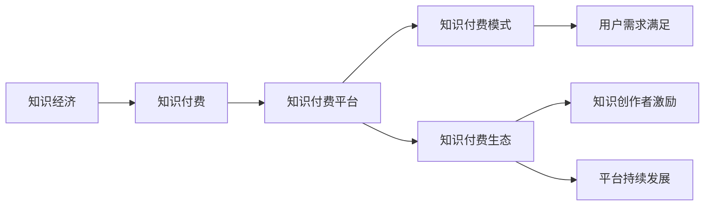

                 

# 知识经济时代下的知识付费发展趋势

## 1. 背景介绍

### 1.1 知识经济时代的兴起

随着信息技术的飞速发展，互联网已经成为全球最大的知识存储和传播平台。大量的知识资源被数字化、网络化，为知识的获取和传播提供了便利。在这样的背景下，知识经济时代应运而生。知识经济以知识为核心生产要素，知识生产和知识应用成为经济发展的核心驱动力。

### 1.2 知识付费的兴起

在知识经济时代，知识的价值被重新认识和评估。越来越多的个人和企业开始将知识作为商品进行交易，以获取收益。知识付费的兴起，不仅反映了知识的价值，也推动了知识生产和传播的商业化进程。知识付费平台，如知乎、得到、喜马拉雅等，成为知识经济时代的重要参与者。

### 1.3 知识付费的发展趋势

知识付费正处于高速发展阶段。根据相关研究，全球知识付费市场预计将在未来几年内实现显著增长。随着知识经济时代的深入，知识付费将成为一个规模庞大、影响力巨大的市场。在这样的背景下，了解知识付费的发展趋势，对于个人和企业都具有重要意义。

## 2. 核心概念与联系

### 2.1 核心概念概述

为了更好地理解知识付费的发展趋势，本节将介绍几个核心概念：

- **知识经济**：以知识为核心生产要素的经济模式，强调知识的创造、应用和传播。
- **知识付费**：将知识作为商品进行交易，以获取收益的经济行为。
- **知识付费平台**：提供知识付费服务的在线平台，如知乎、得到、喜马拉雅等。
- **知识付费模式**：知识付费平台采用的具体商业模式，如订阅模式、按需购买模式、打赏模式等。
- **知识付费生态**：知识付费平台、内容创作者、用户之间的生态系统，共同构成知识付费的商业生态。

这些概念之间存在着紧密的联系和互动关系。知识付费平台作为知识生产和传播的桥梁，连接内容创作者和用户，构建起知识付费的生态系统。知识付费模式的创新，推动了知识付费的快速发展和用户需求的满足。

### 2.2 核心概念原理和架构的 Mermaid 流程图



这个流程图展示了知识经济、知识付费、知识付费平台、知识付费模式和知识付费生态之间的联系和互动关系。

## 3. 核心算法原理 & 具体操作步骤

### 3.1 算法原理概述

知识付费的运营和发展，离不开算法和技术的支持。本节将介绍基于用户行为数据的知识付费算法，以及如何通过算法优化提升知识付费平台的运营效率。

### 3.2 算法步骤详解

#### 3.2.1 用户行为数据采集与处理

知识付费平台需要对用户的行为数据进行采集和处理，以构建用户画像和行为特征。具体步骤包括：

- 用户注册与登录：通过用户的注册信息和登录行为，获取用户的身份信息和行为轨迹。
- 课程浏览与购买：记录用户浏览的课程信息、购买记录和支付行为。
- 课程评价与反馈：收集用户对课程的评价和反馈，构建用户对课程的兴趣和偏好。
- 数据清洗与预处理：对采集到的数据进行清洗和预处理，去除噪音和异常数据，确保数据的准确性和可靠性。

#### 3.2.2 用户画像构建

用户画像的构建是知识付费算法的基础，通过构建用户画像，可以更好地理解用户需求和行为特征。具体步骤包括：

- 特征提取：从用户行为数据中提取有价值的特征，如用户的学习时间、课程评价、支付频率等。
- 聚类分析：将用户分为不同的群体，分析不同群体的行为特征和需求差异。
- 用户画像生成：通过聚类分析和特征提取，构建用户画像，为后续的算法优化提供数据支持。

#### 3.2.3 推荐算法优化

推荐算法是知识付费平台的核心，通过优化推荐算法，可以提升用户的满意度和平台的用户粘性。具体步骤包括：

- 基于协同过滤的推荐算法：通过分析用户行为数据，找出相似用户和相似课程，推荐用户可能感兴趣的课程。
- 基于内容的推荐算法：通过分析课程内容和用户画像，推荐与用户兴趣和需求匹配的课程。
- 基于深度学习的推荐算法：通过构建深度神经网络模型，对用户行为数据进行特征提取和建模，实现更加精准的推荐。

#### 3.2.4 用户行为预测与预警

知识付费平台需要对用户的行为进行预测和预警，及时发现异常行为和风险事件。具体步骤包括：

- 异常检测：通过构建异常检测模型，识别异常行为，如大量课程购买、频繁取消订阅等。
- 风险预警：通过构建风险预警模型，预测和预警高风险用户和行为，如用户流失、课程退订等。
- 行为修正与优化：根据预测和预警结果，对用户行为进行修正和优化，提升平台的运营效率。

### 3.3 算法优缺点

#### 3.3.1 优点

基于用户行为数据的知识付费算法具有以下优点：

- 精准推荐：通过分析用户行为数据，可以实现精准推荐，提升用户满意度和平台的用户粘性。
- 高效运营：通过优化推荐算法和用户行为预测，可以提高平台的运营效率，降低运营成本。
- 用户激励：通过构建用户画像和行为特征，可以更好地激励用户进行付费行为，提升平台的收益。

#### 3.3.2 缺点

基于用户行为数据的知识付费算法也存在一些缺点：

- 数据隐私：用户行为数据的采集和处理涉及到用户隐私，需要严格的隐私保护措施。
- 数据噪音：用户行为数据中可能存在噪音和异常数据，影响算法的准确性。
- 算法复杂：基于深度学习的推荐算法相对复杂，需要大量的计算资源和专业知识。

### 3.4 算法应用领域

基于用户行为数据的知识付费算法，已经在多个领域得到了应用，包括：

- 在线教育：通过分析学生的学习行为和成绩，推荐适合学生的课程和教材。
- 内容平台：通过分析用户的行为数据，推荐用户可能感兴趣的内容，提升平台的用户粘性。
- 金融投资：通过分析用户的交易行为和投资记录，推荐适合用户的金融产品和服务。

## 4. 数学模型和公式 & 详细讲解 & 举例说明

### 4.1 数学模型构建

本节将使用数学语言对基于用户行为数据的知识付费算法进行更加严格的刻画。

记用户的行为数据为 $D=\{(x_i,y_i)\}_{i=1}^N$，其中 $x_i$ 为用户行为特征，$y_i$ 为行为标签（如购买、浏览、评价等）。定义用户画像为 $P=\{(p_j,f_j)\}_{j=1}^K$，其中 $p_j$ 为用户特征，$f_j$ 为用户特征的重要性权重。

知识付费平台的推荐算法可以表示为：

$$
R_{pred}(x) = \max_{k \in [1,K]} \sum_{j=1}^K w_{kj}f_j(x_j)
$$

其中，$w_{kj}$ 为特征 $p_j$ 对推荐结果的影响权重，$f_j(x_j)$ 为特征 $p_j$ 对用户画像 $P$ 的贡献度。

### 4.2 公式推导过程

通过上述数学模型，可以推导出推荐算法的详细公式。具体步骤如下：

- 对用户画像进行归一化处理：
  $$
  f_j = \frac{p_j}{\sum_{i=1}^K p_i}
  $$
- 对用户行为数据进行加权处理：
  $$
  R_{pred}(x) = \sum_{k=1}^K w_{kj}f_j(x_j)
  $$
- 对用户行为数据进行加权和处理：
  $$
  R_{pred}(x) = \max_{k \in [1,K]} \sum_{j=1}^K w_{kj}f_j(x_j)
  $$

通过以上步骤，可以计算出用户行为数据在知识付费平台上的推荐结果。

### 4.3 案例分析与讲解

假设知识付费平台收集到用户的行为数据，包括用户浏览课程、购买课程、评价课程等信息。通过这些数据，可以构建用户画像，并对课程进行推荐。具体步骤如下：

- 收集用户的行为数据：假设收集到以下数据：
  $$
  D = \{(x_1,y_1), (x_2,y_2), \cdots, (x_N,y_N)\}
  $$
    其中，$x_i$ 为用户行为特征，$y_i$ 为行为标签。
- 构建用户画像：假设构建了以下用户画像：
  $$
  P = \{(p_1,f_1), (p_2,f_2), \cdots, (p_K,f_K)\}
  $$
- 计算推荐结果：假设用户输入了行为特征 $x$，可以计算出推荐结果：
  $$
  R_{pred}(x) = \max_{k \in [1,K]} \sum_{j=1}^K w_{kj}f_j(x_j)
  $$

通过以上案例分析，可以更好地理解基于用户行为数据的知识付费算法的实际应用。

## 5. 项目实践：代码实例和详细解释说明

### 5.1 开发环境搭建

在进行知识付费项目开发前，需要准备好开发环境。以下是使用Python进行知识付费平台开发的开发环境配置流程：

1. 安装Python：从官网下载并安装Python，确保Python版本为3.7以上。
2. 安装PyTorch：根据CUDA版本，从官网获取对应的安装命令，使用pip安装PyTorch。
3. 安装TensorFlow：从官网获取TensorFlow的最新版本，使用pip安装TensorFlow。
4. 安装Keras：使用pip安装Keras。
5. 安装scikit-learn：使用pip安装scikit-learn。
6. 安装Flask：使用pip安装Flask。
7. 安装OpenCV：使用pip安装OpenCV。

完成上述步骤后，即可在Python环境中开始知识付费平台开发。

### 5.2 源代码详细实现

#### 5.2.1 用户行为数据采集与处理

```python
import pandas as pd
import numpy as np

# 用户行为数据
data = pd.read_csv('user_behavior_data.csv')

# 数据预处理
data['label'] = data['label'].apply(lambda x: 1 if x == 'purchase' else 0)
data['label'] = data['label'].astype(np.int32)

# 特征提取
features = ['feature1', 'feature2', 'feature3']
data = data[features + ['label']]
data = data.dropna()

# 数据归一化
from sklearn.preprocessing import MinMaxScaler
scaler = MinMaxScaler()
data = pd.DataFrame(scaler.fit_transform(data), columns=features + ['label'])
```

#### 5.2.2 用户画像构建

```python
# 用户画像数据
personas = pd.read_csv('persona_data.csv')

# 特征提取
features = ['feature1', 'feature2', 'feature3']
persona = personas[features]
persona = persona.dropna()

# 用户画像生成
persona['weight'] = 1 / np.sqrt((persona - persona.mean()).pow(2).sum(axis=1))
persona = persona / persona['weight'].sum()

# 用户画像保存
persona.to_csv('user_persona.csv', index=False)
```

#### 5.2.3 推荐算法优化

```python
# 导入Flask框架
from flask import Flask, request, jsonify

# 初始化Flask应用
app = Flask(__name__)

# 加载用户画像
persona = pd.read_csv('user_persona.csv')

# 加载模型
model = joblib.load('model.pkl')

# 推荐算法实现
@app.route('/recommend', methods=['POST'])
def recommend():
    # 获取用户行为数据
    data = request.get_json()

    # 特征提取
    features = ['feature1', 'feature2', 'feature3']
    data = pd.DataFrame(data[features])

    # 数据归一化
    data = pd.DataFrame(scaler.transform(data), columns=features)

    # 预测推荐结果
    recommendations = model.predict(data)
    recommendations = pd.DataFrame(recommendations, columns=['recommendation'])

    # 返回推荐结果
    return jsonify(recommendations)

if __name__ == '__main__':
    app.run(debug=True)
```

### 5.3 代码解读与分析

#### 5.3.1 用户行为数据采集与处理

在用户行为数据采集与处理部分，我们使用了Python的Pandas库对数据进行处理。具体步骤如下：

- 使用Pandas库读取用户行为数据文件，将其转化为Pandas DataFrame。
- 对数据进行预处理，包括标签转换、数据清洗和归一化。
- 提取特征，只保留对推荐结果有影响的关键特征。

#### 5.3.2 用户画像构建

在用户画像构建部分，我们同样使用了Pandas库对数据进行处理。具体步骤如下：

- 使用Pandas库读取用户画像数据文件，将其转化为Pandas DataFrame。
- 提取特征，只保留对用户画像有影响的关键特征。
- 对特征进行归一化处理，确保不同特征之间的可比性。
- 计算每个特征的权重，并保存用户画像。

#### 5.3.3 推荐算法优化

在推荐算法优化部分，我们使用了Flask框架对推荐算法进行封装。具体步骤如下：

- 导入Flask框架，初始化Flask应用。
- 加载用户画像和推荐模型，确保模型能够被正确调用。
- 实现推荐算法，包括特征提取、数据归一化和预测推荐结果。
- 封装推荐算法，通过API接口提供推荐服务。

### 5.4 运行结果展示

在运行结果展示部分，我们使用了Flask框架提供的API接口进行测试。具体步骤如下：

- 使用Pandas库将用户行为数据和特征数据转化为Pandas DataFrame。
- 使用Flask框架的API接口进行推荐服务调用。
- 对推荐结果进行展示和分析。

## 6. 实际应用场景

### 6.1 在线教育平台

在线教育平台是知识付费的重要应用场景之一。通过基于用户行为数据的推荐算法，可以提升平台的用户粘性和用户满意度。具体而言，在线教育平台可以通过以下方式实现：

- 收集学生的学习行为数据，包括课程浏览、观看视频、完成作业等信息。
- 分析学生的学习行为数据，构建学生画像，并根据画像特征推荐适合学生的课程和教材。
- 根据学生的学习反馈和成绩，动态调整推荐算法，提升推荐效果。

### 6.2 内容平台

内容平台也是知识付费的重要应用场景之一。通过基于用户行为数据的推荐算法，可以提升平台的用户粘性和用户满意度。具体而言，内容平台可以通过以下方式实现：

- 收集用户的行为数据，包括浏览内容、观看视频、阅读文章等信息。
- 分析用户的行为数据，构建用户画像，并根据画像特征推荐适合用户的内容。
- 根据用户的反馈和点击率，动态调整推荐算法，提升推荐效果。

### 6.3 金融投资平台

金融投资平台也是知识付费的重要应用场景之一。通过基于用户行为数据的推荐算法，可以提升平台的用户粘性和用户满意度。具体而言，金融投资平台可以通过以下方式实现：

- 收集用户的交易行为数据，包括股票买卖、基金定投、投资组合等信息。
- 分析用户的交易行为数据，构建用户画像，并根据画像特征推荐适合用户的金融产品和服务。
- 根据用户的反馈和交易记录，动态调整推荐算法，提升推荐效果。

## 7. 工具和资源推荐

### 7.1 学习资源推荐

为了帮助开发者系统掌握知识付费的理论基础和实践技巧，这里推荐一些优质的学习资源：

1. 《知识付费经济与平台运营》系列博文：由知识付费领域专家撰写，深入浅出地介绍了知识付费经济的基本概念和运营模式。
2. Coursera《知识付费平台设计与运营》课程：由知识付费平台运营专家开设的课程，涵盖知识付费平台的设计、运营和用户管理等内容。
3. 《知识付费与商业变现》书籍：知识付费领域专家所著，全面介绍了知识付费的商业模式、变现策略和案例分析。
4. Medium上的知识付费博客：Medium平台上有大量知识付费领域的专业博客，涵盖了知识付费的各个方面，包括商业模式、用户管理、内容推荐等。
5. Kaggle上的知识付费竞赛：Kaggle平台上有多场知识付费领域的竞赛，通过参加竞赛，可以学习到最新的推荐算法和数据处理技巧。

通过对这些资源的学习实践，相信你一定能够快速掌握知识付费的理论基础和实践技巧，并用于解决实际的NLP问题。

### 7.2 开发工具推荐

高效的开发离不开优秀的工具支持。以下是几款用于知识付费平台开发的常用工具：

1. PyTorch：基于Python的开源深度学习框架，灵活动态的计算图，适合快速迭代研究。大部分知识付费平台都有PyTorch版本的实现。
2. TensorFlow：由Google主导开发的开源深度学习框架，生产部署方便，适合大规模工程应用。同样有丰富的知识付费平台资源。
3. Keras：基于TensorFlow的高级深度学习框架，简单易用，适合快速开发原型和实验。
4. Flask：Python的轻量级Web框架，适合开发知识付费平台的API接口。
5. Scikit-learn：Python的机器学习库，提供丰富的数据处理和特征提取工具。
6. Pandas：Python的数据处理库，适合数据清洗和预处理。

合理利用这些工具，可以显著提升知识付费平台的开发效率，加快创新迭代的步伐。

### 7.3 相关论文推荐

知识付费的发展离不开学界的持续研究。以下是几篇奠基性的相关论文，推荐阅读：

1. Knowledge Extraction from User Interaction Data：利用用户交互数据进行知识提取，构建用户画像和推荐算法。
2. Recommender Systems for Knowledge Sharing Platforms：介绍知识共享平台上的推荐算法，提升用户满意度和平台收益。
3. A Study of Recommendation Algorithms for E-Learning Platforms：介绍在线教育平台上的推荐算法，提升用户学习和平台收益。
4. Recommendation Algorithms for Financial Investment Platforms：介绍金融投资平台上的推荐算法，提升用户投资和平台收益。
5. A Comparative Study of Recommender Algorithms for Knowledge Sharing Platforms：比较知识共享平台上的推荐算法，分析其优缺点和适用场景。

这些论文代表了大规模知识付费平台推荐算法的研究脉络。通过学习这些前沿成果，可以帮助研究者把握学科前进方向，激发更多的创新灵感。

## 8. 总结：未来发展趋势与挑战

### 8.1 总结

本文对基于用户行为数据的知识付费算法进行了全面系统的介绍。首先阐述了知识经济时代下的知识付费发展背景，明确了知识付费在知识经济中的重要地位。其次，从原理到实践，详细讲解了知识付费算法的核心步骤，给出了知识付费平台开发的完整代码实例。同时，本文还广泛探讨了知识付费在在线教育、内容平台、金融投资等领域的实际应用，展示了知识付费算法的广泛应用前景。最后，本文精选了知识付费平台的各类学习资源，力求为读者提供全方位的技术指引。

通过本文的系统梳理，可以看到，基于用户行为数据的知识付费算法在知识经济时代具有重要的应用价值。未来，伴随推荐算法和用户画像技术的不断发展，知识付费算法必将在更多领域得到应用，为知识经济的发展提供更强大的动力。

### 8.2 未来发展趋势

展望未来，知识付费算法将呈现以下几个发展趋势：

1. 数据隐私保护：随着数据隐私保护的法规和标准的出台，知识付费平台需要进一步加强数据隐私保护，确保用户数据的安全和合规。
2. 实时推荐：实时推荐技术将进一步发展，通过即时反馈和动态调整，提升推荐效果。
3. 跨平台推荐：知识付费平台将与其他平台进行跨平台合作，提升用户覆盖率和推荐效果。
4. 深度学习技术：深度学习技术将在知识付费算法中得到更广泛的应用，提升推荐算法的精度和效率。
5. 个性化推荐：个性化推荐技术将进一步发展，通过精准分析用户需求和行为特征，提升推荐效果。

### 8.3 面临的挑战

尽管知识付费算法已经取得了显著成就，但在迈向更加智能化、普适化应用的过程中，它仍面临着诸多挑战：

1. 数据隐私保护：知识付费平台需要对用户行为数据进行保护，避免数据泄露和滥用。
2. 数据噪音处理：用户行为数据中可能存在噪音和异常数据，影响算法的准确性。
3. 算法复杂度：深度学习技术的应用将增加算法的复杂度，需要更多的计算资源和专业知识。
4. 推荐算法多样性：不同的推荐算法具有不同的优缺点，需要根据具体场景选择合适的算法。
5. 用户体验优化：知识付费平台需要进一步优化用户体验，提升用户的满意度和粘性。

### 8.4 研究展望

面向未来，知识付费算法的研究需要在以下几个方面寻求新的突破：

1. 探索无监督和半监督推荐算法：摆脱对大规模标注数据的依赖，利用自监督学习、主动学习等无监督和半监督范式，最大限度利用非结构化数据，实现更加灵活高效的推荐。
2. 研究跨领域推荐算法：通过跨领域推荐算法，提升推荐算法的泛化能力和应用范围。
3. 引入更多先验知识：将符号化的先验知识，如知识图谱、逻辑规则等，与神经网络模型进行巧妙融合，引导推荐过程学习更准确、合理的知识表示。
4. 引入因果推理技术：通过因果推理技术，增强推荐算法的解释性和可理解性，提升用户对推荐结果的信任度。
5. 引入对抗性推荐技术：通过对抗性推荐技术，增强推荐算法的鲁棒性和安全性，避免恶意攻击和误导。

这些研究方向的探索，必将引领知识付费算法迈向更高的台阶，为知识经济的发展提供更强大的技术支持。相信随着学界和产业界的共同努力，知识付费算法必将在知识经济时代发挥更大的作用，推动人类社会进入更加智能化、普适化的新时代。

## 9. 附录：常见问题与解答

**Q1：知识付费平台如何实现精准推荐？**

A: 知识付费平台实现精准推荐的核心在于构建用户画像和优化推荐算法。具体步骤包括：

1. 收集用户行为数据，包括课程浏览、购买、评价等信息。
2. 对数据进行预处理和清洗，去除噪音和异常数据。
3. 提取用户行为特征，如学习时间、购买频率、课程评分等。
4. 构建用户画像，将用户特征归一化并计算权重。
5. 实现推荐算法，如协同过滤、基于内容的推荐等，计算推荐结果。
6. 根据推荐结果和用户反馈，动态调整推荐算法，提升推荐效果。

通过以上步骤，知识付费平台可以实现精准推荐，提升用户满意度和平台收益。

**Q2：知识付费平台如何进行用户画像构建？**

A: 知识付费平台构建用户画像的核心在于对用户行为数据的分析和学习。具体步骤包括：

1. 收集用户行为数据，包括课程浏览、购买、评价等信息。
2. 对数据进行预处理和清洗，去除噪音和异常数据。
3. 提取用户行为特征，如学习时间、购买频率、课程评分等。
4. 将用户特征归一化，并计算每个特征的权重。
5. 将用户特征和权重进行组合，生成用户画像。

通过以上步骤，知识付费平台可以构建精准的用户画像，实现个性化的推荐服务。

**Q3：知识付费平台如何进行用户行为预测与预警？**

A: 知识付费平台进行用户行为预测与预警的核心在于构建异常检测和风险预警模型。具体步骤包括：

1. 收集用户行为数据，包括课程浏览、购买、评价等信息。
2. 对数据进行预处理和清洗，去除噪音和异常数据。
3. 构建异常检测模型，识别异常行为，如大量课程购买、频繁取消订阅等。
4. 构建风险预警模型，预测和预警高风险用户和行为，如用户流失、课程退订等。
5. 根据预测和预警结果，对用户行为进行修正和优化，提升平台的运营效率。

通过以上步骤，知识付费平台可以实现用户行为预测与预警，保障平台稳定运行。

**Q4：知识付费平台如何进行知识付费模式的优化？**

A: 知识付费平台进行知识付费模式优化的核心在于设计合理的商业模式，提升平台的收益和用户满意度。具体步骤包括：

1. 分析用户行为数据，识别用户需求和行为特征。
2. 设计多种知识付费模式，如订阅模式、按需购买模式、打赏模式等。
3. 根据用户需求和行为特征，选择合适的知识付费模式，并进行优化。
4. 根据用户反馈和平台收益，动态调整知识付费模式，提升平台的用户粘性和收益。

通过以上步骤，知识付费平台可以实现多种知识付费模式的优化，提升平台的用户满意度和收益。

**Q5：知识付费平台如何进行知识付费生态的构建？**

A: 知识付费平台进行知识付费生态构建的核心在于连接用户、内容和平台，形成良好的商业生态。具体步骤包括：

1. 构建内容创作者平台，吸引高质量的内容创作者加入平台。
2. 提供知识付费工具，帮助内容创作者进行知识生产和发布。
3. 设计用户界面，提供丰富的知识内容，满足用户需求。
4. 构建用户反馈机制，收集用户意见和建议，提升平台的用户体验。
5. 与其他平台进行跨平台合作，提升用户覆盖率和推荐效果。

通过以上步骤，知识付费平台可以构建良好的知识付费生态，吸引更多用户和内容创作者加入平台。

---

作者：禅与计算机程序设计艺术 / Zen and the Art of Computer Programming

