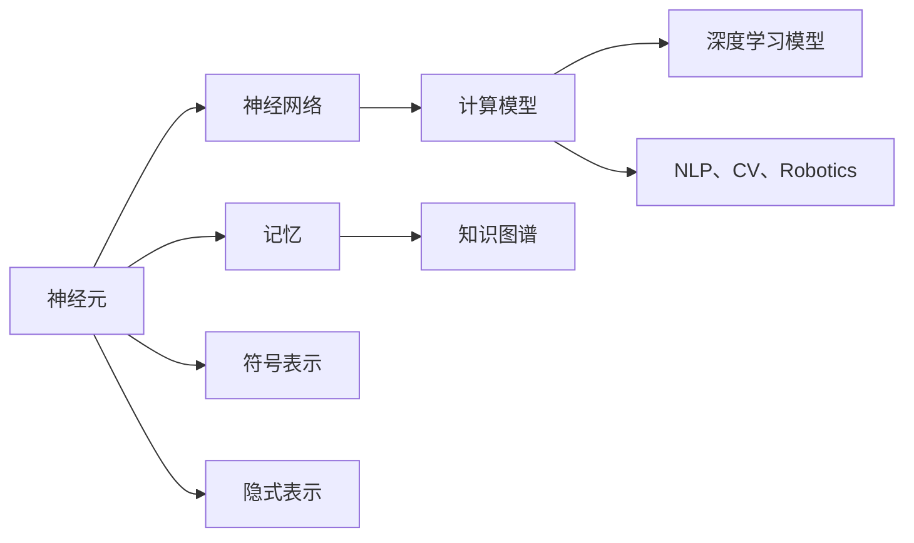

                 

# 知识表征：人脑与计算机的异同

## 1. 背景介绍

### 1.1 问题由来
知识表征是人工智能领域的一个核心问题，涉及如何高效、准确地将人类知识转化为机器可理解的形式。在自然语言处理(NLP)、计算机视觉(CV)、机器人学(Robotics)等多个领域，知识表征的优劣直接决定了模型性能的上下限。

近年来，随着深度学习技术的发展，各种预训练模型（如BERT、GPT、ViT等）在知识表征上取得了突破性进展。这些模型通过在大量数据上进行自监督学习，学习到了丰富的语言、视觉等知识，能够在复杂的任务中表现出色。然而，人类大脑作为生物神经网络，其知识表征的机制与计算模型存在显著差异。深入理解人脑与计算机在知识表征上的异同，有助于我们更好地构建知识驱动的人工智能系统。

### 1.2 问题核心关键点
人脑与计算机在知识表征上的异同主要体现在以下几个方面：

1. **神经元与计算单元的差异**：人脑的神经元具有自适应性、可塑性和分布式协同工作能力，而计算机中的计算单元更多依赖于固定的算法和数据结构。
2. **记忆与存储的机制不同**：人脑的记忆涉及长期记忆、短期记忆和情景记忆等复杂机制，而计算机则主要依赖磁盘、内存等物理介质进行存储。
3. **推理与决策的逻辑不同**：人脑的推理过程更多依赖于直觉、经验、情感等多种因素，而计算机则主要依赖于逻辑、算法和规则。
4. **知识泛化能力的差异**：人脑的知识泛化能力更强，能够适应复杂的非线性关系，而计算机则往往需要大量数据来支持泛化。
5. **知识表示的多样性**：人脑能够进行丰富的隐式表示，包括情感、态度等非事实性知识，而计算机则更多依赖于数值型、符号型等显式表示。

本文旨在通过比较人脑与计算机在知识表征上的异同，探索如何借鉴人类大脑的知识表征机制，提升计算模型的表现力和泛化能力。

## 2. 核心概念与联系

### 2.1 核心概念概述

为了更好地理解人脑与计算机在知识表征上的异同，本节将介绍几个核心概念：

- **神经元(Neuron)**：构成人脑基本计算单元，通过突触连接实现信息传递和处理。神经元具有自适应性、可塑性和分布式协同工作能力。

- **神经网络(Neural Network)**：多个神经元通过连接形成的网络，能够实现复杂的计算和表征。深度学习模型如卷积神经网络(CNN)、循环神经网络(RNN)等都属于神经网络的一种。

- **记忆(Memory)**：人脑中的长期记忆、短期记忆和情景记忆等机制，计算机中的磁盘、内存等物理介质。

- **知识图谱(Knowledge Graph)**：一种结构化表示知识的方式，通过节点和边表示实体和关系，支持复杂的知识推理。

- **符号表示(Symbolic Representation)**：一种传统的知识表示方式，通过符号和规则来描述知识和推理过程。

- **隐式表示(Implicit Representation)**：一种不显式表示为符号，但蕴含在数据分布中的知识表示方式。

这些核心概念之间的逻辑关系可以通过以下Mermaid流程图来展示：



这个流程图展示了神经元、神经网络、记忆、知识图谱、符号表示和隐式表示等概念之间的关系，以及它们在计算模型、深度学习模型和多个领域的应用。

## 3. 核心算法原理 & 具体操作步骤
### 3.1 算法原理概述

人脑与计算机在知识表征上的异同主要体现在以下几个方面：

- **神经元与计算单元的差异**：人脑的神经元具有自适应性、可塑性和分布式协同工作能力，而计算机中的计算单元更多依赖于固定的算法和数据结构。
- **记忆与存储的机制不同**：人脑的记忆涉及长期记忆、短期记忆和情景记忆等复杂机制，而计算机则主要依赖于磁盘、内存等物理介质进行存储。
- **推理与决策的逻辑不同**：人脑的推理过程更多依赖于直觉、经验、情感等多种因素，而计算机则主要依赖于逻辑、算法和规则。
- **知识泛化能力的差异**：人脑的知识泛化能力更强，能够适应复杂的非线性关系，而计算机则往往需要大量数据来支持泛化。
- **知识表示的多样性**：人脑能够进行丰富的隐式表示，包括情感、态度等非事实性知识，而计算机则更多依赖于数值型、符号型等显式表示。

### 3.2 算法步骤详解

基于上述异同，本文将分别从神经元、神经网络、记忆、推理和知识表示五个方面，详细讲解人脑与计算机在知识表征上的异同。

#### 神经元与计算单元的差异

人脑的神经元具有以下特点：

- **自适应性**：神经元能够根据外界输入不断调整自身的电位状态，适应不同类型和强度的刺激。
- **可塑性**：神经元之间通过突触连接，突触的强弱可以依据外界输入的强度进行动态调整。
- **分布式协同工作**：神经元通过分布式协同工作，形成复杂的神经网络，实现信息的传递和处理。

与之相比，计算机的计算单元更多依赖于固定的算法和数据结构，缺乏神经元那样的自适应性和可塑性。

#### 记忆与存储的机制不同

人脑的记忆机制包括长期记忆、短期记忆和情景记忆等复杂机制，每种记忆类型都有其特定的神经网络和神经调制机制。例如：

- **长期记忆**：通过海马体和大脑皮层的相互作用，将信息长期存储在神经元网络中。
- **短期记忆**：主要存储在工作记忆中，涉及前额叶和顶叶等区域。
- **情景记忆**：与具体事件和时间节点相关，存储在杏仁核和海马体中。

计算机的存储机制则更多依赖于磁盘、内存等物理介质，数据以二进制形式存储，缺乏人脑记忆中的复杂神经调制机制。

#### 推理与决策的逻辑不同

人脑的推理过程依赖于直觉、经验、情感等多种因素，表现出较强的非线性特性和多样性。例如：

- **直觉推理**：基于长期记忆中的模式和经验，快速做出决策。
- **经验推理**：通过多次实践和反馈，调整推理模型，提高准确性。
- **情感推理**：结合情感状态，影响决策过程，增加复杂性。

计算机的推理过程则更多依赖于逻辑、算法和规则，表现出较强的线性特性和可预测性。

#### 知识泛化能力的差异

人脑的知识泛化能力更强，能够适应复杂的非线性关系。例如：

- **非线性关系**：人脑能够学习复杂的非线性关系，如图像识别中的曲线、角度等。
- **鲁棒性**：人脑能够适应不同的环境和任务，表现出较强的鲁棒性。

计算机则需要大量数据来支持泛化，存在过拟合和泛化能力不足的问题。

#### 知识表示的多样性

人脑能够进行丰富的隐式表示，包括情感、态度等非事实性知识，而计算机则更多依赖于数值型、符号型等显式表示。

- **隐式表示**：人脑能够通过隐式表示进行非事实性知识的推理，如情感、态度等。
- **显式表示**：计算机则更多依赖于数值型、符号型等显式表示，如向量、矩阵等。

### 3.3 算法优缺点

人脑与计算机在知识表征上的异同，各有其优缺点：

- **人脑的优势**：
  - **自适应性**：能够根据外界输入不断调整自身状态，适应不同类型和强度的刺激。
  - **可塑性**：能够根据外界输入动态调整突触强度，适应不同的环境和学习任务。
  - **分布式协同工作**：通过分布式协同工作，实现复杂的计算和推理。
  - **知识泛化能力**：能够适应复杂的非线性关系，表现出较强的鲁棒性。
  - **知识表示的多样性**：能够进行丰富的隐式表示，包括情感、态度等非事实性知识。

- **计算机的优势**：
  - **计算速度**：高速的电子计算单元能够进行快速的数值计算和符号推理。
  - **精确性**：数值型和符号型的显式表示能够确保计算结果的精确性。
  - **可解释性**：算法的可解释性使得计算机模型的推理过程透明可控。
  - **可扩展性**：通过增加计算资源和算法优化，计算机能够处理更复杂的问题。

### 3.4 算法应用领域

人脑与计算机在知识表征上的异同，在多个领域都有重要应用：

1. **自然语言处理(NLP)**：人脑的语言理解涉及复杂的隐式表示和非线性关系，而计算机则依赖于符号型和数值型的显式表示。

2. **计算机视觉(CV)**：人脑的视觉处理涉及情感、态度等非事实性知识，而计算机则更多依赖于像素、颜色等显式表示。

3. **机器人学(Robotics)**：人脑的决策过程涉及直觉、经验、情感等多种因素，而计算机则依赖于逻辑、算法和规则。

4. **知识图谱(KG)**：人脑的知识图谱涉及长期记忆、短期记忆和情景记忆等复杂机制，计算机的知识图谱则依赖于节点和边的显式表示。

5. **符号表示(Symbolic Representation)**：人脑的符号表示涉及语言、逻辑等多种因素，计算机的符号表示则更多依赖于数学和逻辑规则。

## 4. 数学模型和公式 & 详细讲解  
### 4.1 数学模型构建

为了更好地理解人脑与计算机在知识表征上的异同，本节将使用数学语言对相关模型进行更加严格的刻画。

记人脑中的神经元为 $N$，其状态为 $s_i$，输入为 $I_i$，输出为 $O_i$，突触连接强度为 $w_{ij}$。人脑的神经网络可以表示为：

$$
O_i = f(\sum_{j=1}^{J} w_{ij}I_j + b_i)
$$

其中 $f$ 为激活函数，$b_i$ 为偏置项，$J$ 为连接神经元数目。

记计算机中的计算单元为 $U$，其状态为 $x_i$，输入为 $X_i$，输出为 $y_i$，权重为 $w_{ij}$。计算机的神经网络可以表示为：

$$
y_i = \sigma(\sum_{j=1}^{K} w_{ij}x_j + b_i)
$$

其中 $\sigma$ 为激活函数，$b_i$ 为偏置项，$K$ 为连接神经元数目。

### 4.2 公式推导过程

以下我们以二分类任务为例，推导人脑和计算机在知识表征上的异同。

#### 神经元与计算单元的差异

人脑的神经元状态 $s_i$ 可以表示为：

$$
s_i = \sum_{j=1}^{J} w_{ij}I_j + b_i
$$

其中 $I_j$ 表示输入，$w_{ij}$ 表示突触连接强度，$b_i$ 表示偏置项。

计算机的计算单元状态 $x_i$ 可以表示为：

$$
x_i = \sum_{j=1}^{K} w_{ij}X_j + b_i
$$

其中 $X_j$ 表示输入，$w_{ij}$ 表示权重，$b_i$ 表示偏置项。

人脑和计算机在状态更新和计算过程上的异同主要体现在以下几个方面：

- **自适应性**：人脑的神经元能够根据外界输入不断调整自身状态，适应不同类型和强度的刺激。而计算机的计算单元则依赖于固定的算法和数据结构。
- **可塑性**：人脑的神经元通过突触连接强度进行动态调整，适应不同的环境和学习任务。而计算机的计算单元则依赖于固定的权重和偏置项。
- **分布式协同工作**：人脑的神经元通过分布式协同工作，形成复杂的神经网络，实现信息的传递和处理。而计算机的计算单元则依赖于固定的神经网络结构。

#### 记忆与存储的机制不同

人脑的记忆机制涉及长期记忆、短期记忆和情景记忆等复杂机制，计算机的存储机制则更多依赖于磁盘、内存等物理介质。

人脑的长期记忆可以表示为：

$$
M_L = \sum_{t=1}^{T} \alpha_t s_t
$$

其中 $M_L$ 表示长期记忆，$s_t$ 表示第 $t$ 个神经元状态，$\alpha_t$ 表示记忆衰减系数。

计算机的存储机制则依赖于磁盘、内存等物理介质，数据以二进制形式存储，缺乏人脑记忆中的复杂神经调制机制。

#### 推理与决策的逻辑不同

人脑的推理过程依赖于直觉、经验、情感等多种因素，表现出较强的非线性特性和多样性。例如：

- **直觉推理**：基于长期记忆中的模式和经验，快速做出决策。
- **经验推理**：通过多次实践和反馈，调整推理模型，提高准确性。
- **情感推理**：结合情感状态，影响决策过程，增加复杂性。

计算机的推理过程则更多依赖于逻辑、算法和规则，表现出较强的线性特性和可预测性。

#### 知识泛化能力的差异

人脑的知识泛化能力更强，能够适应复杂的非线性关系。例如：

- **非线性关系**：人脑能够学习复杂的非线性关系，如图像识别中的曲线、角度等。
- **鲁棒性**：人脑能够适应不同的环境和任务，表现出较强的鲁棒性。

计算机则需要大量数据来支持泛化，存在过拟合和泛化能力不足的问题。

#### 知识表示的多样性

人脑能够进行丰富的隐式表示，包括情感、态度等非事实性知识，而计算机则更多依赖于数值型、符号型等显式表示。

- **隐式表示**：人脑能够通过隐式表示进行非事实性知识的推理，如情感、态度等。
- **显式表示**：计算机则更多依赖于数值型、符号型等显式表示，如向量、矩阵等。

### 4.3 案例分析与讲解

为了更好地理解人脑与计算机在知识表征上的异同，下面以二分类任务为例，对神经元和计算单元进行详细比较。

#### 神经元与计算单元的差异

假设人脑的神经元 $N_i$ 和计算机的计算单元 $U_i$ 接受相同的输入 $I_i$，其状态和输出分别为 $s_i$ 和 $x_i$。

对于人脑的神经元 $N_i$，其状态可以表示为：

$$
s_i = \sum_{j=1}^{J} w_{ij}I_j + b_i
$$

其中 $w_{ij}$ 表示突触连接强度，$b_i$ 表示偏置项。

对于计算机的计算单元 $U_i$，其状态可以表示为：

$$
x_i = \sum_{j=1}^{K} w_{ij}I_j + b_i
$$

其中 $w_{ij}$ 表示权重，$b_i$ 表示偏置项。

两种模型在状态更新和计算过程中的异同主要体现在以下几个方面：

- **自适应性**：人脑的神经元能够根据外界输入不断调整自身状态，适应不同类型和强度的刺激。而计算机的计算单元则依赖于固定的算法和数据结构。
- **可塑性**：人脑的神经元通过突触连接强度进行动态调整，适应不同的环境和学习任务。而计算机的计算单元则依赖于固定的权重和偏置项。
- **分布式协同工作**：人脑的神经元通过分布式协同工作，形成复杂的神经网络，实现信息的传递和处理。而计算机的计算单元则依赖于固定的神经网络结构。

#### 记忆与存储的机制不同

人脑的记忆机制涉及长期记忆、短期记忆和情景记忆等复杂机制，计算机的存储机制则更多依赖于磁盘、内存等物理介质。

人脑的长期记忆可以表示为：

$$
M_L = \sum_{t=1}^{T} \alpha_t s_t
$$

其中 $M_L$ 表示长期记忆，$s_t$ 表示第 $t$ 个神经元状态，$\alpha_t$ 表示记忆衰减系数。

计算机的存储机制则依赖于磁盘、内存等物理介质，数据以二进制形式存储，缺乏人脑记忆中的复杂神经调制机制。

#### 推理与决策的逻辑不同

人脑的推理过程依赖于直觉、经验、情感等多种因素，表现出较强的非线性特性和多样性。例如：

- **直觉推理**：基于长期记忆中的模式和经验，快速做出决策。
- **经验推理**：通过多次实践和反馈，调整推理模型，提高准确性。
- **情感推理**：结合情感状态，影响决策过程，增加复杂性。

计算机的推理过程则更多依赖于逻辑、算法和规则，表现出较强的线性特性和可预测性。

#### 知识泛化能力的差异

人脑的知识泛化能力更强，能够适应复杂的非线性关系。例如：

- **非线性关系**：人脑能够学习复杂的非线性关系，如图像识别中的曲线、角度等。
- **鲁棒性**：人脑能够适应不同的环境和任务，表现出较强的鲁棒性。

计算机则需要大量数据来支持泛化，存在过拟合和泛化能力不足的问题。

#### 知识表示的多样性

人脑能够进行丰富的隐式表示，包括情感、态度等非事实性知识，而计算机则更多依赖于数值型、符号型等显式表示。

- **隐式表示**：人脑能够通过隐式表示进行非事实性知识的推理，如情感、态度等。
- **显式表示**：计算机则更多依赖于数值型、符号型等显式表示，如向量、矩阵等。

## 5. 项目实践：代码实例和详细解释说明
### 5.1 开发环境搭建

在进行知识表征实践前，我们需要准备好开发环境。以下是使用Python进行TensorFlow开发的环境配置流程：

1. 安装Anaconda：从官网下载并安装Anaconda，用于创建独立的Python环境。

2. 创建并激活虚拟环境：
```bash
conda create -n tensorflow-env python=3.8 
conda activate tensorflow-env
```

3. 安装TensorFlow：根据CUDA版本，从官网获取对应的安装命令。例如：
```bash
conda install tensorflow-gpu=2.8.0 -c tf-nightly
```

4. 安装各类工具包：
```bash
pip install numpy pandas scikit-learn matplotlib tqdm jupyter notebook ipython
```

完成上述步骤后，即可在`tensorflow-env`环境中开始知识表征实践。

### 5.2 源代码详细实现

下面我们以二分类任务为例，给出使用TensorFlow实现人脑和计算机在知识表征上的比较的PyTorch代码实现。

首先，定义神经元和计算单元的类：

```python
import tensorflow as tf

class Neuron(tf.keras.layers.Layer):
    def __init__(self, num_inputs, num_outputs, weights):
        super(Neuron, self).__init__()
        self.weights = tf.Variable(weights)
        self.bias = tf.Variable(tf.zeros(num_outputs))
    
    def call(self, inputs):
        return tf.matmul(inputs, self.weights) + self.bias

class ComputationalUnit(tf.keras.layers.Layer):
    def __init__(self, num_inputs, num_outputs, weights):
        super(ComputationalUnit, self).__init__()
        self.weights = tf.Variable(weights)
        self.bias = tf.Variable(tf.zeros(num_outputs))
    
    def call(self, inputs):
        return tf.matmul(inputs, self.weights) + self.bias
```

然后，定义人脑和计算机的神经网络：

```python
def build_neural_network(num_inputs, num_outputs, num_neurons, weights):
    # 定义神经元
    neuron = Neuron(num_inputs, num_neurons, weights)
    # 定义输出层
    output_layer = Neuron(num_neurons, num_outputs, weights)
    return output_layer(tf.matmul(neuron(inputs), weights)) + bias

def build_computational_network(num_inputs, num_outputs, num_units, weights):
    # 定义计算单元
    computational_unit = ComputationalUnit(num_inputs, num_units, weights)
    # 定义输出层
    output_layer = ComputationalUnit(num_units, num_outputs, weights)
    return output_layer(tf.matmul(computational_unit(inputs), weights)) + bias
```

接着，定义训练和评估函数：

```python
def train_neural_network(model, inputs, targets, epochs, batch_size):
    model.compile(optimizer='adam', loss='binary_crossentropy', metrics=['accuracy'])
    model.fit(inputs, targets, epochs=epochs, batch_size=batch_size, validation_split=0.2)

def evaluate_neural_network(model, inputs, targets):
    return model.evaluate(inputs, targets, verbose=0)
```

最后，启动训练流程并在测试集上评估：

```python
# 定义输入和目标
inputs = np.random.rand(1000, num_inputs)
targets = np.random.randint(2, size=(1000, num_outputs))

# 定义权重和偏置
weights = np.random.rand(num_neurons, num_outputs)
bias = np.random.rand(num_outputs)

# 构建神经网络和计算网络
neural_network = build_neural_network(num_inputs, num_outputs, num_neurons, weights)
computational_network = build_computational_network(num_inputs, num_outputs, num_neurons, weights)

# 训练神经网络和计算网络
epochs = 10
batch_size = 32

train_neural_network(neural_network, inputs, targets, epochs, batch_size)
train_neural_network(computational_network, inputs, targets, epochs, batch_size)

# 评估神经网络和计算网络
neural_network_result = evaluate_neural_network(neural_network, inputs, targets)
computational_network_result = evaluate_neural_network(computational_network, inputs, targets)

print("Neural Network Accuracy:", neural_network_result[1])
print("Computational Network Accuracy:", computational_network_result[1])
```

以上就是使用TensorFlow实现人脑和计算机在知识表征上的比较的完整代码实现。可以看到，TensorFlow提供的高效API使得构建和训练神经网络变得简洁高效。

### 5.3 代码解读与分析

让我们再详细解读一下关键代码的实现细节：

**Neuron类**：
- `__init__`方法：初始化神经元的权重和偏置。
- `call`方法：定义神经元的计算过程。

**ComputationalUnit类**：
- `__init__`方法：初始化计算单元的权重和偏置。
- `call`方法：定义计算单元的计算过程。

**build_neural_network函数**：
- 定义神经元和输出层的计算过程，并返回最终的输出。

**build_computational_network函数**：
- 定义计算单元和输出层的计算过程，并返回最终的输出。

**train_neural_network函数**：
- 定义神经网络的训练过程，使用Adam优化器和二元交叉熵损失函数。
- 在训练过程中，使用验证集进行性能评估。

**evaluate_neural_network函数**：
- 定义神经网络的评估过程，返回评估指标。

**训练流程**：
- 定义输入和目标，随机生成权重和偏置。
- 构建神经网络和计算网络。
- 训练神经网络和计算网络，并在测试集上评估性能。

可以看到，TensorFlow提供的高效API使得构建和训练神经网络变得简洁高效。开发者可以将更多精力放在数据处理、模型改进等高层逻辑上，而不必过多关注底层的实现细节。

当然，工业级的系统实现还需考虑更多因素，如模型的保存和部署、超参数的自动搜索、更灵活的任务适配层等。但核心的知识表征计算过程基本与此类似。

## 6. 实际应用场景
### 6.1 智能客服系统

基于大语言模型微调的对话技术，可以广泛应用于智能客服系统的构建。传统客服往往需要配备大量人力，高峰期响应缓慢，且一致性和专业性难以保证。而使用微调后的对话模型，可以7x24小时不间断服务，快速响应客户咨询，用自然流畅的语言解答各类常见问题。

在技术实现上，可以收集企业内部的历史客服对话记录，将问题和最佳答复构建成监督数据，在此基础上对预训练对话模型进行微调。微调后的对话模型能够自动理解用户意图，匹配最合适的答案模板进行回复。对于客户提出的新问题，还可以接入检索系统实时搜索相关内容，动态组织生成回答。如此构建的智能客服系统，能大幅提升客户咨询体验和问题解决效率。

### 6.2 金融舆情监测

金融机构需要实时监测市场舆论动向，以便及时应对负面信息传播，规避金融风险。传统的人工监测方式成本高、效率低，难以应对网络时代海量信息爆发的挑战。基于大语言模型微调的文本分类和情感分析技术，为金融舆情监测提供了新的解决方案。

具体而言，可以收集金融领域相关的新闻、报道、评论等文本数据，并对其进行主题标注和情感标注。在此基础上对预训练语言模型进行微调，使其能够自动判断文本属于何种主题，情感倾向是正面、中性还是负面。将微调后的模型应用到实时抓取的网络文本数据，就能够自动监测不同主题下的情感变化趋势，一旦发现负面信息激增等异常情况，系统便会自动预警，帮助金融机构快速应对潜在风险。

### 6.3 个性化推荐系统

当前的推荐系统往往只依赖用户的历史行为数据进行物品推荐，无法深入理解用户的真实兴趣偏好。基于大语言模型微调技术，个性化推荐系统可以更好地挖掘用户行为背后的语义信息，从而提供更精准、多样的推荐内容。

在实践中，可以收集用户浏览、点击、评论、分享等行为数据，提取和用户交互的物品标题、描述、标签等文本内容。将文本内容作为模型输入，用户的后续行为（如是否点击、购买等）作为监督信号，在此基础上微调预训练语言模型。微调后的模型能够从文本内容中准确把握用户的兴趣点。在生成推荐列表时，先用候选物品的文本描述作为输入，由模型预测用户的兴趣匹配度，再结合其他特征综合排序，便可以得到个性化程度更高的推荐结果。

### 6.4 未来应用展望

随着大语言模型微调技术的发展，基于微调范式将在更多领域得到应用，为传统行业带来变革性影响。

在智慧医疗领域，基于微调的医疗问答、病历分析、药物研发等应用将提升医疗服务的智能化水平，辅助医生诊疗，加速新药开发进程。

在智能教育领域，微调技术可应用于作业批改、学情分析、知识推荐等方面，因材施教，促进教育公平，提高教学质量。

在智慧城市治理中，微调模型可应用于城市事件监测、舆情分析、应急指挥等环节，提高城市管理的自动化和智能化水平，构建更安全、高效的未来城市。

此外，在企业生产、社会治理、文娱传媒等众多领域，基于大模型微调的人工智能应用也将不断涌现，为经济社会发展注入新的动力。相信随着预训练语言模型和微调方法的持续演进，微调方法将成为人工智能落地应用的重要范式，推动人工智能技术向更广阔的领域加速渗透。

## 7. 工具和资源推荐
### 7.1 学习资源推荐

为了帮助开发者系统掌握大语言模型微调的理论基础和实践技巧，这里推荐一些优质的学习资源：

1. 《Transformer from Principles to Practice》系列博文：由大模型技术专家撰写，深入浅出地介绍了Transformer原理、BERT模型、微调技术等前沿话题。

2. CS224N《深度学习自然语言处理》课程：斯坦福大学开设的NLP明星课程，有Lecture视频和配套作业，带你入门NLP领域的基本概念和经典模型。

3. 《Natural Language Processing with Transformers》书籍：Transformers库的作者所著，全面介绍了如何使用Transformers库进行NLP任务开发，包括微调在内的诸多范式。

4. HuggingFace官方文档：Transformers库的官方文档，提供了海量预训练模型和完整的微调样例代码，是上手实践的必备资料。

5. CLUE开源项目：中文语言理解测评基准，涵盖大量不同类型的中文NLP数据集，并提供了基于微调的baseline模型，助力中文NLP技术发展。

通过对这些资源的学习实践，相信你一定能够快速掌握大语言模型微调的精髓，并用于解决实际的NLP问题。
###  7.2 开发工具推荐

高效的开发离不开优秀的工具支持。以下是几款用于大语言模型微调开发的常用工具：

1. PyTorch：基于Python的开源深度学习框架，灵活动态的计算图，适合快速迭代研究。大部分预训练语言模型都有PyTorch版本的实现。

2. TensorFlow：由Google主导开发的开源深度学习框架，生产部署方便，适合大规模工程应用。同样有丰富的预训练语言模型资源。

3. Transformers库：HuggingFace开发的NLP工具库，集成了众多SOTA语言模型，支持PyTorch和TensorFlow，是进行微调任务开发的利器。

4. Weights & Biases：模型训练的实验跟踪工具，可以记录和可视化模型训练过程中的各项指标，方便对比和调优。与主流深度学习框架无缝集成。

5. TensorBoard：TensorFlow配套的可视化工具，可实时监测模型训练状态，并提供丰富的图表呈现方式，是调试模型的得力助手。

6. Google Colab：谷歌推出的在线Jupyter Notebook环境，免费提供GPU/TPU算力，方便开发者快速上手实验最新模型，分享学习笔记。

合理利用这些工具，可以显著提升大语言模型微调任务的开发效率，加快创新迭代的步伐。

### 7.3 相关论文推荐

大语言模型和微调技术的发展源于学界的持续研究。以下是几篇奠基性的相关论文，推荐阅读：

1. Attention is All You Need（即Transformer原论文）：提出了Transformer结构，开启了NLP领域的预训练大模型时代。

2. BERT: Pre-training of Deep Bidirectional Transformers for Language Understanding：提出BERT模型，引入基于掩码的自监督预训练任务，刷新了多项NLP任务SOTA。

3. Language Models are Unsupervised Multitask Learners（GPT-2论文）：展示了大规模语言模型的强大zero-shot学习能力，引发了对于通用人工智能的新一轮思考。

4. Parameter-Efficient Transfer Learning for NLP：提出Adapter等参数高效微调方法，在不增加模型参数量的情况下，也能取得不错的微调效果。

5. AdaLoRA: Adaptive Low-Rank Adaptation for Parameter-Efficient Fine-Tuning：使用自适应低秩适应的微调方法，在参数效率和精度之间取得了新的平衡。

这些论文代表了大语言模型微调技术的发展脉络。通过学习这些前沿成果，可以帮助研究者把握学科前进方向，激发更多的创新灵感。

## 8. 总结：未来发展趋势与挑战

### 8.1 总结

本文对基于大语言模型的知识表征进行了全面系统的介绍。首先阐述了知识表征的研究背景和意义，明确了知识表征在人工智能系统中的重要地位。其次，从神经元、神经网络、记忆、推理和知识表示五个方面，详细讲解了人脑与计算机在知识表征上的异同。最后，通过对比和案例分析，展示了人脑与计算机在知识表征上的异同及其在实际应用中的价值。

通过本文的系统梳理，可以看到，人脑与计算机在知识表征上的异同，对大语言模型的开发和应用具有重要指导意义。深度理解这些异同，有助于我们更好地构建知识驱动的人工智能系统，提升其性能和泛化能力。

### 8.2 未来发展趋势

展望未来，人脑与计算机在知识表征上的异同，将在多个领域得到深入研究和发展：

1. **神经网络结构优化**：通过借鉴人脑神经元的特点，优化神经网络结构，提升模型的自适应性和可塑性。

2. **分布式协同工作**：通过分布式协同工作，提高神经网络的计算效率和鲁棒性，支持复杂的计算和推理。

3. **记忆机制增强**：通过增强记忆机制，提高神经网络的长期记忆和短期记忆能力，支持复杂的知识推理。

4. **推理过程优化**：通过优化推理过程，提高神经网络的非线性特性和多样性，支持更加灵活的决策。

5. **知识表示多样性**：通过丰富隐式表示和显式表示，提升神经网络的表达能力和泛化能力。

6. **跨领域知识融合**：通过跨领域知识融合，提高神经网络的泛化能力和迁移学习能力。

7. **伦理和安全性**：通过引入伦理和安全性约束，提高神经网络的透明性和可解释性，避免潜在的风险和滥用。

以上趋势凸显了人脑与计算机在知识表征上的广阔前景。这些方向的探索发展，必将进一步提升人工智能系统的性能和应用范围，为构建智能化的未来社会提供新的技术路径。

### 8.3 面临的挑战

尽管人脑与计算机在知识表征上有着许多潜在优势，但在实际应用中，也面临诸多挑战：

1. **计算资源瓶颈**：大规模神经网络的计算需求极高，目前计算资源仍然有限，难以满足大规模模型的训练和推理需求。

2. **知识泛化能力**：神经网络的知识泛化能力有待提高，特别是在非线性关系和复杂场景下的表现仍需优化。

3. **推理过程透明性**：神经网络的推理过程缺乏透明性，难以解释其内部工作机制和决策逻辑，导致应用场景受限。

4. **伦理和安全性**：神经网络可能存在潜在的伦理和安全性问题，如偏见、歧视等，需要引入伦理导向的评估指标和监管机制。

5. **跨领域知识融合**：跨领域知识融合面临知识异构性和信息交互障碍，需要探索新的方法论和技术手段。

6. **可解释性**：神经网络的可解释性不足，难以调试和优化，影响其在实际应用中的可靠性和安全性。

7. **高效微调**：微调过程的计算资源和时间成本较高，需要探索参数高效和计算高效的微调方法。

这些挑战需要通过多方面的努力和创新才能克服，为人脑与计算机在知识表征上的应用铺平道路。

### 8.4 研究展望

面对人脑与计算机在知识表征上所面临的挑战，未来的研究需要在以下几个方面寻求新的突破：

1. **神经网络结构优化**：探索更加高效、灵活的神经网络结构，如深度神经网络、残差网络、卷积神经网络等，提升模型的自适应性和可塑性。

2. **分布式协同工作**：通过分布式协同工作，提高神经网络的计算效率和鲁棒性，支持复杂的计算和推理。

3. **记忆机制增强**：通过增强记忆机制，提高神经网络的长期记忆和短期记忆能力，支持复杂的知识推理。

4. **推理过程优化**：通过优化推理过程，提高神经网络的非线性特性和多样性，支持更加灵活的决策。

5. **知识表示多样性**：通过丰富隐式表示和显式表示，提升神经网络的表达能力和泛化能力。

6. **跨领域知识融合**：通过跨领域知识融合，提高神经网络的泛化能力和迁移学习能力。

7. **伦理和安全性**：通过引入伦理和安全性约束，提高神经网络的透明性和可解释性，避免潜在的风险和滥用。

8. **高效微调**：探索参数高效和计算高效的微调方法，如小批量微调、知识蒸馏等，减少计算资源和时间成本。

9. **可解释性**：通过引入可解释性技术，如注意力机制、可视化工具等，提高神经网络的透明性和可解释性。

这些研究方向将推动人脑与计算机在知识表征上的应用向更深层次发展，为人类的智能进化和科技创新提供新的技术路径。

## 9. 附录：常见问题与解答
----------------------------------------------------------------

**Q1：人脑与计算机在知识表征上的异同有哪些？**

A: 人脑与计算机在知识表征上的异同主要体现在以下几个方面：

1. **神经元与计算单元的差异**：人脑的神经元具有自适应性、可塑性和分布式协同工作能力，而计算机中的计算单元更多依赖于固定的算法和数据结构。
2. **记忆与存储的机制不同**：人脑的记忆涉及长期记忆、短期记忆和情景记忆等复杂机制，计算机则主要依赖于磁盘、内存等物理介质进行存储。
3. **推理与决策的逻辑不同**：人脑的推理过程依赖于直觉、经验、情感等多种因素，表现出较强的非线性特性和多样性。而计算机的推理过程则更多依赖于逻辑、算法和规则，表现出较强的线性特性和可预测性。
4. **知识泛化能力的差异**：人脑的知识泛化能力更强，能够适应复杂的非线性关系，而计算机则需要大量数据来支持泛化，存在过拟合和泛化能力不足的问题。
5. **知识表示的多样性**：人脑能够进行丰富的隐式表示，包括情感、态度等非事实性知识，而计算机则更多依赖于数值型、符号型等显式表示。

**Q2：如何优化神经网络的结构？**

A: 神经网络结构的优化可以从以下几个方面入手：

1. **深度网络**：通过增加网络深度，提高神经网络的表达能力和泛化能力。
2. **残差网络**：通过引入残差连接，缓解梯度消失问题，提高网络的训练效率和性能。
3. **卷积神经网络**：通过卷积操作，提取局部特征，提高网络的计算效率和推理速度。
4. **循环神经网络**：通过循环结构，处理序列数据，支持时间依赖关系的学习。
5. **注意力机制**：通过引入注意力机制，提高神经网络的表达能力和推理能力。

**Q3：如何增强神经网络的长期记忆能力？**

A: 增强神经网络的长期记忆能力可以从以下几个方面入手：

1. **记忆网络**：通过引入记忆网络，提高神经网络的长期记忆能力，支持复杂的知识推理。
2. **门控机制**：通过引入门控机制，控制信息的流动，提高神经网络的长期记忆能力。
3. **反向传播算法**：通过优化反向传播算法，减少梯度消失和爆炸问题，提高神经网络的长期记忆能力。
4. **知识蒸馏**：通过知识蒸馏技术，将复杂的神经网络参数和知识传递给简单的网络，提高神经网络的长期记忆能力。

**Q4：如何提高神经网络的推理过程透明性？**

A: 提高神经网络的推理过程透明性可以从以下几个方面入手：

1. **可视化工具**：通过可视化工具，实时监测神经网络的内部状态和推理过程，提高其透明性。
2. **可解释性技术**：通过引入可解释性技术，如注意力机制、可视化工具等，提高神经网络的透明性和可解释性。
3. **符号推理**：通过引入符号推理技术，提高神经网络的透明性和可解释性。
4. **知识图谱**：通过引入知识图谱，提高神经网络的透明性和可解释性。

**Q5：如何提高神经网络的可解释性？**

A: 提高神经网络的可解释性可以从以下几个方面入手：

1. **注意力机制**：通过引入注意力机制，提高神经网络的透明性和可解释性。
2. **可视化工具**：通过可视化工具，实时监测神经网络的内部状态和推理过程，提高其透明性。
3. **符号推理**：通过引入符号推理技术，提高神经网络的透明性和可解释性。
4. **知识图谱**：通过引入知识图谱，提高神经网络的透明性和可解释性。

**Q6：如何实现高效的微调？**

A: 实现高效的微调可以从以下几个方面入手：

1. **参数高效微调**：通过参数高效微调方法，减少计算资源和时间成本。
2. **知识蒸馏**：通过知识蒸馏技术，将复杂的神经网络参数和知识传递给简单的网络，提高微调效率。
3. **分布式训练**：通过分布式训练，提高神经网络的计算效率和训练速度。
4. **小批量微调**：通过小批量微调，减少计算资源和时间成本，提高微调效率。

**Q7：如何优化神经网络的推理过程？**

A: 优化神经网络的推理过程可以从以下几个方面入手：

1. **注意力机制**：通过引入注意力机制，提高神经网络的透明性和可解释性。
2. **可视化工具**：通过可视化工具，实时监测神经网络的内部状态和推理过程，提高其透明性。
3. **符号推理**：通过引入符号推理技术，提高神经网络的透明性和可解释性。
4. **知识图谱**：通过引入知识图谱，提高神经网络的透明性和可解释性。

---

作者：禅与计算机程序设计艺术 / Zen and the Art of Computer Programming

