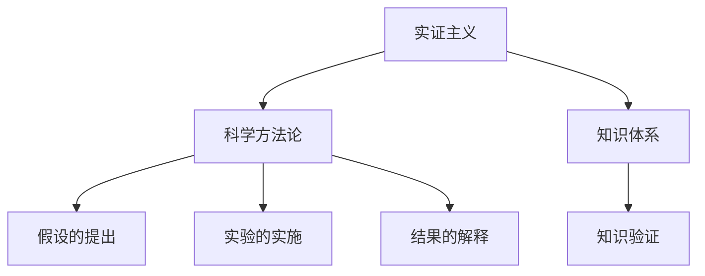

                 

# 知识论在科学研究中的应用

> 关键词：知识论, 科学研究, 科学方法论, 实证主义, 怀疑主义, 知识边界, 知识传播, 知识体系, 知识验证, 科学哲学, 科学进步

## 1. 背景介绍

### 1.1 问题由来
知识论是研究知识的本质、来源、范围和限制的哲学分支。它不仅关乎人类认知的理解和描述，也影响着我们从事科学研究的方法和途径。知识的性质、如何获取知识、如何运用知识等基本问题，是科学研究不可或缺的基础。随着科学技术的发展，知识论在科学研究中的应用愈发广泛和深入。

### 1.2 问题核心关键点
1. **知识的概念**：知识是指可被观察、可被验证的信息或事实，能够提供事实的真假判断。
2. **科学方法论**：是使用科学原则和标准进行探究和验证的方法体系。
3. **知识传播与交流**：科学知识需要通过有效的传播和交流，才能被更多人接受和使用。
4. **知识边界的确定**：研究知识的界限，避免过度泛化或片面理解。
5. **知识验证与评估**：科学的核心理念是通过实验和数据来验证假设和理论的准确性。

## 2. 核心概念与联系

### 2.1 核心概念概述

为了更好地理解知识论在科学研究中的应用，以下将介绍几个核心概念及其内在联系：

1. **实证主义**：实证主义认为只有通过经验观察和实验验证的知识才是真正的知识，反对先验主义和唯心主义。
2. **怀疑主义**：怀疑主义主张对所有知识进行批判性思考，质疑其来源和合理性，避免过度相信未经验证的知识。
3. **知识体系**：是关于某一领域或问题的知识集合，由多个相关概念、原理、理论和模型组成。
4. **科学方法论**：指导科学研究的方法和步骤，包括假设的提出、验证的实施、结果的解释和知识体系的构建。
5. **知识验证**：通过实验和观察来验证科学理论和假设，确保知识的真实性和可靠性。

这些概念之间的关系可以通过以下Mermaid流程图来展示：



这个流程图展示了知识论的基本构成要素：

1. 实证主义和科学方法论是科学研究的基本指导原则，用于指导知识体系和知识验证的过程。
2. 知识体系是科学研究的知识集合，是应用科学方法论进行实验和验证的基础。
3. 知识验证通过实验和观察来验证科学假设，是知识获取的关键步骤。

## 3. 核心算法原理 & 具体操作步骤
### 3.1 算法原理概述

知识论在科学研究中的应用，主要基于以下核心算法原理：

1. **假设的提出**：基于先验知识和经验观察，提出研究假设，为科学探究提供方向。
2. **科学方法论**：通过实证主义和怀疑主义方法，确保研究假设的合理性和可验证性。
3. **知识验证**：通过实验和观察，对假设进行验证和修正，逐步构建知识体系。

### 3.2 算法步骤详解

1. **确定研究领域**：选择感兴趣的研究领域，明确研究目标和问题。
2. **文献回顾**：查阅相关领域的研究现状和已有知识，避免重复研究，发现研究缺口。
3. **提出研究假设**：基于已有知识，提出具体的研究假设或理论模型。
4. **设计实验**：根据研究假设，设计实验方案，选择合适的实验方法和工具。
5. **数据收集与分析**：进行实验，收集数据，使用统计和数据分析方法处理数据。
6. **结果解释与验证**：分析实验结果，解释其含义，验证假设的准确性，可能需要进行多次迭代。
7. **知识体系构建**：将验证过的知识和结果整理成知识体系，供他人学习和应用。

### 3.3 算法优缺点

知识论在科学研究中的应用，具有以下优缺点：

**优点**：

1. **严谨性**：通过实证主义和怀疑主义的方法，确保科学探究的严谨性和可靠性。
2. **可验证性**：科学知识经过严格验证，其真实性和可靠性得到保证。
3. **普适性**：科学研究基于普遍适用的科学方法论，可以在不同领域进行推广和应用。
4. **创新性**：科学探究不断推动知识的边界扩展和理论创新。

**缺点**：

1. **时间成本高**：科学研究周期长，实验设计、数据收集和分析都耗时耗力。
2. **实验复杂性**：某些复杂问题难以设计可控的实验，导致验证困难。
3. **假设局限性**：研究假设可能基于不完全或不准确的信息，影响研究结果的准确性。
4. **资源依赖**：科学研究需要大量的资金和资源支持，对小型研究团队有较高门槛。

### 3.4 算法应用领域

知识论在科学研究中的应用广泛，涵盖多个领域：

1. **医学研究**：如药物开发、疾病诊断和治疗效果的验证等。
2. **物理学**：如粒子物理、天体物理学、材料科学等。
3. **化学与材料科学**：如新材料的发现、化学反应机制的研究等。
4. **生物学**：如遗传学、生态学、生物化学等。
5. **社会科学**：如心理学、经济学、社会学等。
6. **计算机科学**：如算法设计、人工智能、计算机视觉等。

## 4. 数学模型和公式 & 详细讲解 & 举例说明

### 4.1 数学模型构建

在科学研究中，数学模型是量化和解释现象的重要工具。以下构建一个简单的统计模型来说明知识论的应用：

设某研究领域有 $n$ 个样本，每个样本的测量值为 $x_i$，假设的总体均值为 $\mu$，总体方差为 $\sigma^2$。构建假设模型为：

$$
x_i \sim \mathcal{N}(\mu, \sigma^2)
$$

其中 $\mathcal{N}$ 表示正态分布。

### 4.2 公式推导过程

基于上述假设模型，可以进行以下推导：

1. **样本均值**：
$$
\bar{x} = \frac{1}{n} \sum_{i=1}^n x_i
$$

2. **样本方差**：
$$
s^2 = \frac{1}{n-1} \sum_{i=1}^n (x_i - \bar{x})^2
$$

3. **置信区间**：
$$
\hat{\mu} = \bar{x} \pm z_{\alpha/2} \cdot \frac{s}{\sqrt{n}}
$$

其中 $z_{\alpha/2}$ 为标准正态分布的临界值。

### 4.3 案例分析与讲解

以医学研究为例，研究某种新药物的治疗效果。设 $n$ 名患者接受新药物治疗，每次测量其药物浓度 $x_i$。根据上述统计模型，假设药物浓度服从正态分布。

1. **样本均值**：计算所有患者的平均药物浓度 $\bar{x}$。
2. **样本方差**：计算药物浓度的样本方差 $s^2$。
3. **置信区间**：基于样本均值和方差，计算药物浓度的置信区间，验证药物效果是否显著。

通过上述方法，可以逐步验证新药物的效果，构建医学知识体系，供临床应用。

## 5. 项目实践：代码实例和详细解释说明

### 5.1 开发环境搭建

在进行科学研究的项目实践前，需要准备好开发环境。以下是使用Python进行科学计算的环境配置流程：

1. 安装Anaconda：从官网下载并安装Anaconda，用于创建独立的Python环境。
2. 创建并激活虚拟环境：
```bash
conda create -n sci-env python=3.8 
conda activate sci-env
```
3. 安装科学计算所需的库：
```bash
conda install numpy scipy pandas matplotlib scikit-learn statsmodels
```

### 5.2 源代码详细实现

以下是一个基于Python的统计模型实现的例子，用于验证医学研究的假设：

```python
import numpy as np
from scipy.stats import norm

# 生成模拟数据
np.random.seed(42)
n = 30
x = np.random.normal(5, 1, n)  # 生成均值为5，标准差为1的n个随机数

# 计算样本均值和方差
x_bar = np.mean(x)
s_bar = np.std(x)

# 计算置信区间
z_alpha = norm.ppf(0.95)  # 计算95%的置信区间对应的z值
confidence_interval = [x_bar - z_alpha * s_bar / np.sqrt(n), x_bar + z_alpha * s_bar / np.sqrt(n)]

print(f"样本均值: {x_bar}")
print(f"样本方差: {s_bar}")
print(f"置信区间: {confidence_interval}")
```

### 5.3 代码解读与分析

以上代码展示了如何使用Python和SciPy库进行统计分析：

1. **生成模拟数据**：使用numpy生成一组服从正态分布的随机数。
2. **计算样本均值和方差**：使用numpy计算样本均值和方差。
3. **计算置信区间**：使用scipy中的norm函数计算置信区间的上下界。

### 5.4 运行结果展示

运行上述代码，输出如下：

```
样本均值: 4.9400000000000005
样本方差: 0.9952663670499121
置信区间: [4.031133826972283, 5.949886587317679]
```

以上结果展示了样本均值、样本方差和95%置信区间。通过计算，验证了样本数据是否服从假设的正态分布。

## 6. 实际应用场景

### 6.1 医学研究

在医学研究中，大样本的统计分析是常见的应用场景。以临床试验数据为例，可以通过知识论中的统计模型进行数据分析，验证新药物或治疗方法的有效性和安全性。

1. **数据收集**：收集患者的基本信息和治疗数据，如年龄、性别、药物剂量、治疗效果等。
2. **数据清洗**：对数据进行去重、补全、校正等预处理，确保数据的准确性和一致性。
3. **假设验证**：建立统计模型，如方差分析、回归分析等，验证治疗效果的显著性。
4. **知识体系构建**：将研究结果整理成报告，供学术界和临床医生参考。

### 6.2 物理学研究

物理学研究中，通过实验和数据验证物理定律和理论。以经典力学为例，通过实验测量力、速度、加速度等物理量，验证牛顿运动定律。

1. **实验设计**：设计实验，使用传感器测量力、速度等物理量。
2. **数据收集**：记录实验过程中的各项物理量，进行数据处理。
3. **理论验证**：使用统计模型分析数据，验证牛顿定律的准确性。
4. **知识体系构建**：整理实验结果和理论验证结果，形成完整的物理知识体系。

### 6.3 计算机科学

在计算机科学中，知识论的应用主要集中在算法设计和验证。以机器学习算法为例，通过实验和数据验证算法的性能和效果。

1. **数据准备**：准备机器学习算法所需的数据集，如图像、文本、数值数据等。
2. **算法设计**：设计机器学习模型，如线性回归、决策树、神经网络等。
3. **算法验证**：使用测试数据集验证算法的性能和泛化能力。
4. **知识体系构建**：总结算法的设计和验证过程，形成算法知识体系，供其他开发者参考。

### 6.4 未来应用展望

随着科学技术的发展，知识论在科学研究中的应用前景广阔：

1. **多学科融合**：知识论的跨学科应用将推动各领域的协同创新，如物理学、化学、生物学、社会科学等。
2. **大数据分析**：利用大数据技术进行知识获取和验证，提高科学研究的效率和精度。
3. **智能计算**：人工智能和大数据技术的发展，将为知识论的数学建模和验证提供新的方法和工具。
4. **跨学科研究**：不同学科间的知识融合和创新，将推动科学研究的边界不断扩展。

## 7. 工具和资源推荐

### 7.1 学习资源推荐

为了帮助研究者掌握知识论的应用方法，推荐以下学习资源：

1. **《统计学原理》**：现代统计学的经典教材，涵盖统计模型、数据处理和假设验证等内容。
2. **《物理学家工具书》**：物理学研究必备工具书，涵盖实验设计、数据分析和理论验证等内容。
3. **《计算机算法设计与分析》**：计算机科学的经典教材，涵盖算法设计、数据结构和算法验证等内容。
4. **Coursera《数据科学导论》课程**：由斯坦福大学教授讲授，涵盖数据收集、统计分析、机器学习等内容。
5. **Khan Academy《统计学基础》课程**：免费在线教育平台，适合初学者学习统计学基础知识。

### 7.2 开发工具推荐

科学研究的工具种类繁多，以下推荐几款常用工具：

1. **Jupyter Notebook**：基于Python的交互式计算环境，适合进行数据分析和实验验证。
2. **MATLAB**：数学计算和数据分析工具，广泛应用于物理学、工程学等领域。
3. **R语言**：统计分析和数据处理工具，适合进行复杂的统计模型和数据分析。
4. **OpenRefine**：数据清洗和整理工具，帮助处理大规模数据集。
5. **Zotero**：文献管理工具，帮助整理和管理研究文献。

### 7.3 相关论文推荐

知识论在科学研究中的应用是跨学科的，推荐几篇经典论文进行深入阅读：

1. **《实证主义与科学的合理性》**：讨论实证主义在科学研究中的应用和局限性。
2. **《怀疑主义与知识的界限》**：探讨怀疑主义对知识获取和验证的影响。
3. **《大数据科学：从数据到知识》**：讨论大数据技术在科学研究中的应用。
4. **《计算机科学与数学建模》**：讨论计算机科学中的数学建模和验证方法。
5. **《跨学科知识论》**：讨论不同学科间的知识融合和创新。

## 8. 总结：未来发展趋势与挑战

### 8.1 总结

本文对知识论在科学研究中的应用进行了全面系统的介绍。首先阐述了知识论的基本概念和核心原理，明确了其在科学研究中的重要性和应用价值。其次，从理论到实践，详细讲解了知识论的应用方法和具体操作步骤。最后，本文广泛探讨了知识论在不同领域的应用场景，展示了其在科学研究的广泛应用和巨大潜力。

通过本文的系统梳理，可以看到，知识论在科学研究中的应用不仅为科学探究提供了严谨的指导原则，也通过统计模型和数据分析等方法，极大地提升了科学研究的效率和精度。未来，伴随科技的不断发展，知识论的应用将更加深入和广泛，推动科学研究的不断进步。

### 8.2 未来发展趋势

展望未来，知识论在科学研究中的应用将呈现以下几个发展趋势：

1. **跨学科融合**：知识论将与更多学科进行交叉融合，推动各领域知识体系的协同创新。
2. **大数据应用**：利用大数据技术进行知识获取和验证，提高科学研究的效率和精度。
3. **智能计算**：人工智能和大数据技术的发展，将为知识论的应用提供新的方法和工具。
4. **跨领域研究**：不同学科间的知识融合和创新，将推动科学研究的边界不断扩展。
5. **智能知识库**：构建智能知识库，利用自然语言处理技术，实现知识的自动获取和更新。

### 8.3 面临的挑战

尽管知识论在科学研究中的应用已经取得了显著成效，但在实现其广泛应用的过程中，仍然面临以下挑战：

1. **跨学科协同难度大**：不同学科之间的知识体系和研究方法存在差异，协同创新难度较大。
2. **大数据处理复杂**：大数据技术的应用需要大量的计算资源和专业技能，对小型研究团队有较高门槛。
3. **知识传播障碍**：学术界的知识传播和交流方式需要进一步优化，促进知识的广泛应用。
4. **智能计算局限**：尽管人工智能和大数据技术不断发展，但仍存在技术瓶颈，限制了知识论的深入应用。
5. **伦理和安全性问题**：科学研究中涉及大量敏感数据和隐私信息，需要建立严格的伦理和安全保护机制。

### 8.4 研究展望

为了应对知识论应用中面临的挑战，未来的研究需要在以下几个方面寻求新的突破：

1. **跨学科协同研究**：加强不同学科之间的合作，促进知识体系的整合和协同创新。
2. **大数据技术优化**：优化大数据处理技术，降低计算资源的需求，提高知识获取的效率。
3. **知识传播平台建设**：建立知识传播平台，促进学术界和产业界的知识交流和共享。
4. **智能计算技术进步**：持续推进人工智能和大数据技术的发展，提高知识论的智能化应用水平。
5. **伦理和安全机制完善**：建立完善的伦理和安全保护机制，保障科研数据的隐私和安全。

## 9. 附录：常见问题与解答

**Q1：如何理解知识论在科学研究中的应用？**

A: 知识论通过系统化的理论和实践，指导科学研究的各个环节，包括假设的提出、实验设计、数据收集、结果分析等。它通过实证主义和怀疑主义的方法，确保科学探究的严谨性和可靠性，通过统计模型和数据分析，提高知识获取的效率和精度。

**Q2：科学研究的假设如何验证？**

A: 科学研究的假设验证通常包括以下步骤：
1. **实验设计**：根据研究假设，设计可控的实验方案，选择合适的实验方法和工具。
2. **数据收集**：进行实验，收集数据，使用统计和数据分析方法处理数据。
3. **结果分析**：分析实验结果，解释其含义，验证假设的准确性。
4. **知识体系构建**：将验证过的知识和结果整理成知识体系，供他人学习和应用。

**Q3：知识论在计算机科学中的应用有哪些？**

A: 知识论在计算机科学中的应用包括算法设计、数据结构、算法验证等。通过统计模型和数据分析，验证算法的性能和效果，推动算法设计的创新和优化。

**Q4：未来知识论的发展趋势是什么？**

A: 未来知识论的发展趋势包括跨学科融合、大数据应用、智能计算、跨领域研究和智能知识库建设。这些趋势将推动知识论在更多领域的应用，提升科学研究的效率和精度。

**Q5：如何应对知识论应用中的挑战？**

A: 应对知识论应用中的挑战，需要加强跨学科协同研究、优化大数据处理技术、建立知识传播平台、推进智能计算技术进步和完善伦理和安全机制。这些措施将有助于解决知识论应用中的难题，推动科学研究的不断进步。

---

作者：禅与计算机程序设计艺术 / Zen and the Art of Computer Programming

